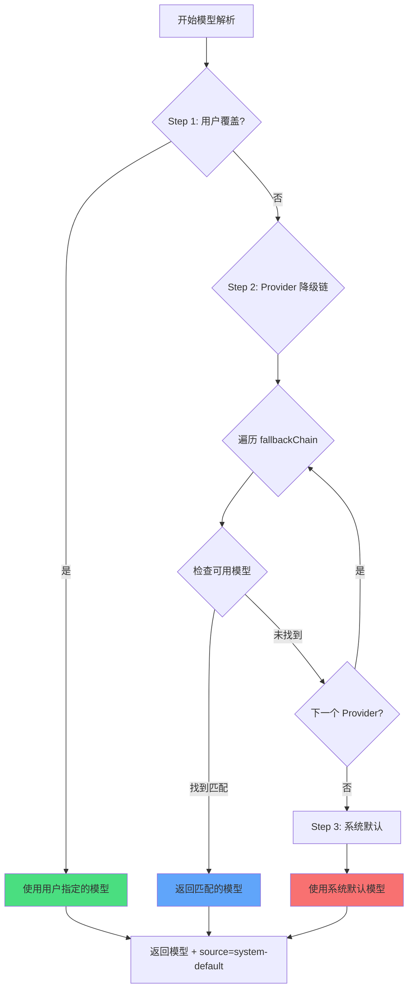

# 多模型策略：自动降级与优先级

## 学完你能做什么

- 理解 oh-my-opencode 如何为每个代理自动选择最合适的 AI 模型
- 掌握三步模型解析机制（用户覆盖 → Provider 降级 → 系统默认）
- 学会配置代理和 Category 的模型覆盖
- 使用 `doctor` 命令验证模型解析结果
- 根据任务需求手动指定模型，优化成本和性能

## 你现在的困境

在配置多个 AI Provider（Anthropic、OpenAI、Google 等）后，你可能遇到这些困惑：

- **模型选择不明确**：Sisyphus、Oracle、Librarian 等代理到底用哪个模型？
- **手动配置繁琐**：每个代理都要单独指定模型，Provider 变化时要全部调整
- **成本不可控**：不知道哪些任务用了昂贵的模型（如 Claude Opus）
- **Provider 故障影响体验**：某个 Provider API 挂了，整个系统无法工作
- **多模型协作不透明**：并行任务中不同代理用了什么模型不清楚

这些都在阻碍你发挥多模型编排的真正威力。

## 核心思路

**模型解析系统**是 oh-my-opencode 的"智能模型选择器"，它根据你的配置和可用模型，动态决定每个代理和 Category 使用哪个模型。

::: info 什么是模型解析？
模型解析（Model Resolution）是在运行时为每个代理或 Category 选择具体 AI 模型的过程。它不是硬编码的，而是根据你的配置、可用的 Provider、模型名称等动态计算结果。
:::

### 三步解析流程

模型解析通过三个优先级步骤实现：



**Step 1: User Override（用户覆盖）**
- 如果你在 `oh-my-opencode.json` 中明确指定了代理或 Category 的 `model`，系统直接使用该模型
- 跳过 Provider 降级链
- 这是最高的优先级

**Step 2: Provider Fallback（Provider 降级）**
- 如果没有用户覆盖，系统按预定义的 Provider 优先级链尝试
- 对于每个代理或 Category，都有一个 `fallbackChain`，定义了它偏好的 Provider 顺序
- 系统依次尝试每个 Provider，直到找到可用的模型

**Step 3: System Default（系统默认）**
- 如果所有 Provider 都没有可用模型，使用 OpenCode 的默认模型
- 这是最后的兜底方案

### 代理的 Provider 优先级链

每个代理都有自己偏好的 Provider 顺序，这取决于代理的任务类型和所需能力：

| 代理 | 推荐模型（无前缀） | Provider 优先级链 | 变体 |
|------|-------------------|-------------------|------|
| **Sisyphus** | `claude-opus-4-5` | anthropic → github-copilot → opencode → zai-coding-plan | max |
| **Oracle** | `gpt-5.2` | openai → anthropic → google | high |
| **Librarian** | `big-pickle` | zai-coding-plan → opencode → anthropic | - |
| **Explore** | `claude-haiku-4-5` | anthropic → opencode → github-copilot | - |
| **Multimodal Looker** | `gemini-3-flash` | google → openai → zai-coding-plan → anthropic → opencode | - |
| **Prometheus** | `claude-opus-4-5` | anthropic → github-copilot → opencode → google | max |
| **Metis** | `claude-opus-4-5` | anthropic → github-copilot → opencode → google | max |
| **Momus** | `gpt-5.2` | openai → anthropic → google | medium |
| **Atlas** | `claude-sonnet-4-5` | anthropic → github-copilot → opencode → google | - |

::: tip 为什么 Sisyphus 偏好 Anthropic？
Sisyphus 是主编排器，需要强大的推理能力。Claude Opus 是最适合复杂编排任务的模型，所以 Anthropic 在其优先级链中排第一。如果你的 Anthropic 配额不足，系统会自动降级到其他 Provider。
:::

### Category 的 Provider 优先级链

Categories 也遵循相同的解析逻辑：

| Category | 推荐模型（无前缀） | Provider 优先级链 | 变体 |
|----------|-------------------|-------------------|------|
| **visual-engineering** | `gemini-3-pro` | google → anthropic → openai | - |
| **ultrabrain** | `gpt-5.2-codex` | openai → anthropic → google | xhigh |
| **artistry** | `gemini-3-pro` | google → anthropic → openai | max |
| **quick** | `claude-haiku-4-5` | anthropic → google → opencode | - |
| **unspecified-low** | `claude-sonnet-4-5` | anthropic → openai → google | - |
| **unspecified-high** | `claude-opus-4-5` | anthropic → openai → google | max |
| **writing** | `gemini-3-flash` | google → anthropic → zai-coding-plan → openai | - |

::: tip Category 的优势
通过 `delegate_task(category="quick", ...)` 委托任务时，系统会自动使用 quick Category 的 Provider 优先级链。这意味着你不需要记住每个代理的配置，只需要根据任务类型选择合适的 Category。
:::

## 跟我做

### 第 1 步：查看当前模型解析状态

使用 `doctor` 命令查看每个代理和 Category 的模型解析结果：

```bash
bunx oh-my-opencode doctor --verbose
```

**你应该看到**类似这样的输出：

```
✅ Model Resolution Check
━━━━━━━━━━━━━━━━━━━━━━━━━━━━━━━━━━━━━━━━━━━━━━━━━━━

Agent: sisyphus
  Requirement: claude-opus-4-5 (variant: max)
  Fallback Chain: anthropic → github-copilot → opencode → zai-coding-plan → openai → google
  User Override: (none)
  Resolved Model: anthropic/claude-opus-4-5
  Source: provider-fallback
  Variant: max

Agent: oracle
  Requirement: gpt-5.2 (variant: high)
  Fallback Chain: openai → anthropic → google
  User Override: (none)
  Resolved Model: openai/gpt-5.2
  Source: provider-fallback
  Variant: high

Category: quick
  Requirement: claude-haiku-4-5
  Fallback Chain: anthropic → google → opencode
  User Override: (none)
  Resolved Model: anthropic/claude-haiku-4-5
  Source: provider-fallback
```

这个输出展示了：
- 每个代理/Category 的模型需求
- Provider 优先级链的顺序
- 是否有用户覆盖配置
- 最终解析的模型和来源（override/provider-fallback/system-default）

### 第 2 步：手动覆盖代理模型

假设你想让 Oracle 使用 OpenAI 的最新模型，而不是默认的 GPT-5.2：

编辑 `~/.config/opencode/oh-my-opencode.json` 或 `.opencode/oh-my-opencode.json`：

```jsonc
{
  "$schema": "https://raw.githubusercontent.com/code-yeongyu/oh-my-opencode/master/assets/oh-my-opencode.schema.json",

  "agents": {
    "oracle": {
      "model": "openai/o3"  // 覆盖为 o3 模型
    },
    "explore": {
      "model": "opencode/gpt-5-nano"  // 使用免费模型
    }
  }
}
```

::: info Step 1 优先级
当你设置 `agents.oracle.model` 时，系统会在 Step 1 直接使用这个模型，跳过 Provider 降级链。即使 Anthropic 的 Claude Opus 可用，Oracle 也会使用你指定的 OpenAI o3。
:::

**你应该看到**：再次运行 `doctor` 命令时，Oracle 的解析结果变为：

```
Agent: oracle
  Requirement: gpt-5.2 (variant: high)
  Fallback Chain: openai → anthropic → google
  User Override: openai/o3  // ← 用户覆盖生效
  Resolved Model: openai/o3
  Source: override  // ← 来源变为 override
  Variant: high
```

### 第 3 步：手动覆盖 Category 模型

假设你想让 `quick` Category 使用免费的 GPT-5 Nano：

```jsonc
{
  "$schema": "https://raw.githubusercontent.com/code-yeongyu/oh-my-opencode/master/assets/oh-my-opencode.schema.json",

  "categories": {
    "quick": {
      "model": "opencode/gpt-5-nano"  // 覆盖为免费模型
    },
    "visual-engineering": {
      "model": "anthropic/claude-opus-4-5"  // 强制使用 Opus
    }
  }
}
```

**你应该看到**：当你使用 `delegate_task(category="quick", ...)` 时，系统会使用 `opencode/gpt-5-nano`，即使 Anthropic 的 Haiku 可用。

### 第 4 步：模拟 Provider 故障

理解 Provider 降级机制的最佳方式是模拟故障场景。

假设你只配置了 OpenAI，但想看 Sisyphus（偏好 Anthropic）会使用哪个模型：

**当前配置**：
```jsonc
{
  // oh-my-opencode.json
  // 只配置了 openai provider
}
```

**运行 doctor**：

```
Agent: sisyphus
  Requirement: claude-opus-4-5 (variant: max)
  Fallback Chain: anthropic → github-copilot → opencode → zai-coding-plan → openai → google
  User Override: (none)
  
  // 第 1 轮尝试：anthropic/claude-opus-4-5
  // 结果：不可用（未配置）
  
  // 第 2 轮尝试：github-copilot/claude-opus-4-5
  // 结果：不可用（未配置）
  
  // 第 3 轮尝试：opencode/claude-opus-4-5
  // 结果：不可用（未配置）
  
  // 第 4 轮尝试：zai-coding-plan/glm-4.7
  // 结果：不可用（未配置）
  
  // 第 5 轮尝试：openai/gpt-5.2-codex (从 fallbackChain 的第 5 个入口)
  // 结果：找到！
  
  Resolved Model: openai/gpt-5.2-codex
  Source: provider-fallback
  Variant: medium
```

**你应该看到**：虽然 Sisyphus 偏好 Claude Opus，但因为 Anthropic 不可用，系统降级到了 OpenAI 的 GPT-5.2 Codex。

::: tip 自动降级的优势
Provider 降级机制确保了系统的鲁棒性。即使某个 Provider 故障或配额耗尽，系统也能自动切换到备用 Provider，无需你手动干预。
:::

### 第 5 步：验证系统默认兜底

假设你一个 Provider 都没配置，或者所有 Provider 都故障：

**运行 doctor**：

```
Agent: sisyphus
  Requirement: claude-opus-4-5
  Fallback Chain: anthropic → github-copilot → ...
  
  // 所有 Provider 尝试都失败
  
  Resolved Model: anthropic/claude-opus-4-5  // 使用系统默认
  Source: system-default  // ← 来源为 system-default
  Variant: max
```

**你应该看到**：系统使用 OpenCode 配置的默认模型。这是最后的安全网。

## 检查点 ✅

完成上述步骤后，确认：

- [ ] 运行 `doctor --verbose` 能看到所有代理和 Category 的模型解析结果
- [ ] 手动覆盖代理模型后，`Source` 变为 `override`
- [ ] 手动覆盖 Category 模型后，`delegate_task` 使用指定模型
- [ ] 模拟 Provider 故障时，系统能正确降级到下一个可用 Provider
- [ ] 所有 Provider 都不可用时，系统使用 `system-default`

如果任何一项未通过，检查：
- 配置文件路径是否正确（`~/.config/opencode/oh-my-opencode.json` 或 `.opencode/oh-my-opencode.json`）
- Provider 是否正确配置（API Key、环境变量等）
- 模型名称是否正确（包括 Provider 前缀，如 `anthropic/claude-opus-4-5`）

## 什么时候用这一招

| 场景 | 手动覆盖模型 | 使用 Provider 降级 |
|------|-------------|------------------|
| **成本敏感任务** | ✅ 指定廉价模型 | ❌ 可能选择昂贵模型 |
| **性能敏感任务** | ✅ 指定最强模型 | ❌ 可能降级到弱模型 |
| **测试新模型** | ✅ 指定实验性模型 | ❌ 不会自动选择 |
| **日常开发** | ❌ 过度配置 | ✅ 自动选择最优 |
| **Provider 故障** | ❌ 需要手动修改 | ✅ 自动降级 |
| **多 Provider 环境** | ❌ 过度配置 | ✅ 自动负载均衡 |

**经验法则**：
- 只在需要精确控制模型时才使用手动覆盖
- 其他情况让系统自动选择，享受 Provider 降级的鲁棒性
- 对于成本敏感的任务，可以覆盖为 `quick` Category 或指定廉价模型
- 对于需要最高性能的任务，可以覆盖为 `claude-opus-4-5` 或 `gpt-5.2`

## 踩坑提醒

::: warning 常见错误

**1. 模型名称缺少 Provider 前缀**

```jsonc
// ❌ 错误：缺少 Provider 前缀
{
  "agents": {
    "oracle": {
      "model": "gpt-5.2"  // 缺少 openai/ 前缀
    }
  }
}

// ✅ 正确：包含完整路径
{
  "agents": {
    "oracle": {
      "model": "openai/gpt-5.2"  // 完整的模型路径
    }
  }
}
```

**2. 覆盖不存在的模型**

```jsonc
// ❌ 错误：模型名称拼写错误
{
  "agents": {
    "oracle": {
      "model": "openai/gpt-6"  // GPT-6 不存在
    }
  }
}

// ✅ 正确：使用真实模型
{
  "agents": {
    "oracle": {
      "model": "openai/gpt-5.2"  // 真实模型
    }
  }
}
```

**3. 忽略 Variant 配置**

某些代理和 Category 有推荐的 Variant（如 `max`、`high`、`medium`），这些会影响模型的推理能力。手动覆盖时要注意：

```jsonc
// ✅ 推荐：保留默认 Variant
{
  "agents": {
    "oracle": {
      "model": "openai/gpt-5.2"
      // Variant 会从 fallbackChain 继承：high
    }
  }
}

// ✅ 可选：手动指定 Variant
{
  "agents": {
    "oracle": {
      "model": "openai/gpt-5.2",
      "variant": "max"  // 覆盖默认值
    }
  }
}
```

**4. 依赖系统默认但未配置 Provider**

系统默认模型来自 OpenCode 的配置。如果你一个 Provider 都没配置，OpenCode 也可能使用默认模型，但这个模型可能不是你想要的。

**建议**：
- 至少配置一个 Provider（Anthropic、OpenAI、Google 等）
- 使用 `doctor` 命令定期检查模型解析结果
:::

## 本课小结

模型解析系统通过三步优先级机制，实现了智能的模型选择：

- **Step 1: User Override**：你指定的模型最高优先级，完全可控
- **Step 2: Provider Fallback**：按预定义的优先级链自动降级，保证鲁棒性
- **Step 3: System Default**：最后的兜底方案，确保系统始终有模型可用

每个代理和 Category 都有自己的 Provider 优先级链，这是基于代理的任务类型和所需能力设计的。Sisyphus 偏好 Anthropic（复杂推理），Oracle 偏好 OpenAI（战略咨询），Librarian 偏好 zai-coding-plan（多仓库研究）。

记住：
- **日常开发**：让系统自动选择，享受 Provider 降级
- **精确控制**：手动覆盖模型，优化成本和性能
- **故障恢复**：Provider 降级自动处理，无需人工干预
- **验证工具**：使用 `doctor` 命令检查模型解析结果

## 下一课预告

> 下一课我们学习 **[AI 代理团队：10 位专家介绍](../../advanced/ai-agents-overview/)**。
>
> 你会学到：
> - 10 个内置代理的功能、使用场景和权限配置
> - 如何根据任务类型选择合适的代理
> - 代理之间的协作模式和最佳实践

---

## 附录：源码参考

<details>
<summary><strong>点击展开查看源码位置</strong></summary>

> 更新时间：2026-01-26

| 功能 | 文件路径 | 行号 |
|------|---------|------|
| 模型解析核心函数 | [`src/shared/model-resolver.ts`](https://github.com/code-yeongyu/oh-my-opencode/blob/main/src/shared/model-resolver.ts) | 43-98 |
| 代理模型需求定义 | [`src/shared/model-requirements.ts`](https://github.com/code-yeongyu/oh-my-opencode/blob/main/src/shared/model-requirements.ts) | 12-79 |
| Category 模型需求定义 | [`src/shared/model-requirements.ts`](https://github.com/code-yeongyu/oh-my-opencode/blob/main/src/shared/model-requirements.ts) | 81-133 |
| 代理创建时的模型解析 | [`src/agents/utils.ts`](https://github.com/code-yeongyu/oh-my-opencode/blob/main/src/agents/utils.ts) | 203-208, 245-250, 284-289 |
| Category 委托时的模型解析 | [`src/tools/delegate-task/tools.ts`](https://github.com/code-yeongyu/oh-my-opencode/blob/main/src/tools/delegate-task/tools.ts) | 532-540 |
| doctor 命令的模型解析检查 | [`src/cli/doctor/checks/model-resolution.ts`](https://github.com/code-yeongyu/oh-my-opencode/blob/main/src/cli/doctor/checks/model-resolution.ts) | 130-160 |

**关键类型定义**：
- `ModelResolutionInput`：模型解析输入参数（`src/shared/model-resolver.ts:6-10`）
- `ExtendedModelResolutionInput`：扩展模型解析输入，包含 fallbackChain 和 availableModels（`src/shared/model-resolver.ts:23-28`）
- `ModelResolutionResult`：模型解析结果，包含 model、source、variant（`src/shared/model-resolver.ts:17-21`）
- `ModelSource`：模型来源枚举（`override`/`provider-fallback`/`system-default`）（`src/shared/model-resolver.ts:12-16`）
- `FallbackEntry`：Provider 降级链条目，包含 providers、model、variant（`src/shared/model-requirements.ts:1-5`）
- `ModelRequirement`：模型需求定义，包含 fallbackChain 和默认 variant（`src/shared/model-requirements.ts:7-10`）

**关键常量**：
- `AGENT_MODEL_REQUIREMENTS`：所有代理的模型需求定义，包含 fallbackChain（`src/shared/model-requirements.ts:12-79`）
- `CATEGORY_MODEL_REQUIREMENTS`：所有 Category 的模型需求定义（`src/shared/model-requirements.ts:81-133`）

**关键函数**：
- `resolveModelWithFallback()`：核心模型解析函数，实现三步优先级机制（`src/shared/model-resolver.ts:43-98`）
- `resolveModel()`：简单模型解析，用于没有 fallbackChain 的情况（`src/shared/model-resolver.ts:35-41`）
- `normalizeModel()`：规范化模型名称，去除前后空格（`src/shared/model-resolver.ts:30-33`）
- `createBuiltinAgents()`：创建所有内置代理时，调用模型解析器确定模型（`src/agents/utils.ts:143-313`）

**业务规则**：
| 规则ID | 规则描述 | 标记 |
|---------|----------|------|
| BR-4.1-7 | 模型解析优先级：用户覆盖 > Provider 降级 > 系统默认 | 【事实】 |
| BR-4.1-7-1 | 用户覆盖时直接返回，跳过 Provider 降级链 | 【事实】 |
| BR-4.1-7-2 | Provider 降级时按 fallbackChain 顺序尝试每个 Provider | 【事实】 |
| BR-4.1-7-3 | Provider 降级时检查 availableModels 缓存，如果为空则检查 connectedProviders | 【事实】 |
| BR-4.1-7-4 | 所有 Provider 都不可用时，使用 systemDefaultModel | 【事实】 |
| BR-4.1-7-5 | Sisyphus 的 fallbackChain：anthropic → github-copilot → opencode → zai-coding-plan → openai → google | 【事实】 |
| BR-4.1-7-6 | Oracle 的 fallbackChain：openai → anthropic → google | 【事实】 |
| BR-4.1-7-7 | Librarian 的 fallbackChain：zai-coding-plan → opencode → anthropic | 【事实】 |
| BR-4.1-7-8 | Explore 的 fallbackChain：anthropic → opencode → github-copilot | 【事实】 |
| BR-4.1-7-9 | Multimodal Looker 的 fallbackChain：google → openai → zai-coding-plan → anthropic → opencode | 【事实】 |

</details>
