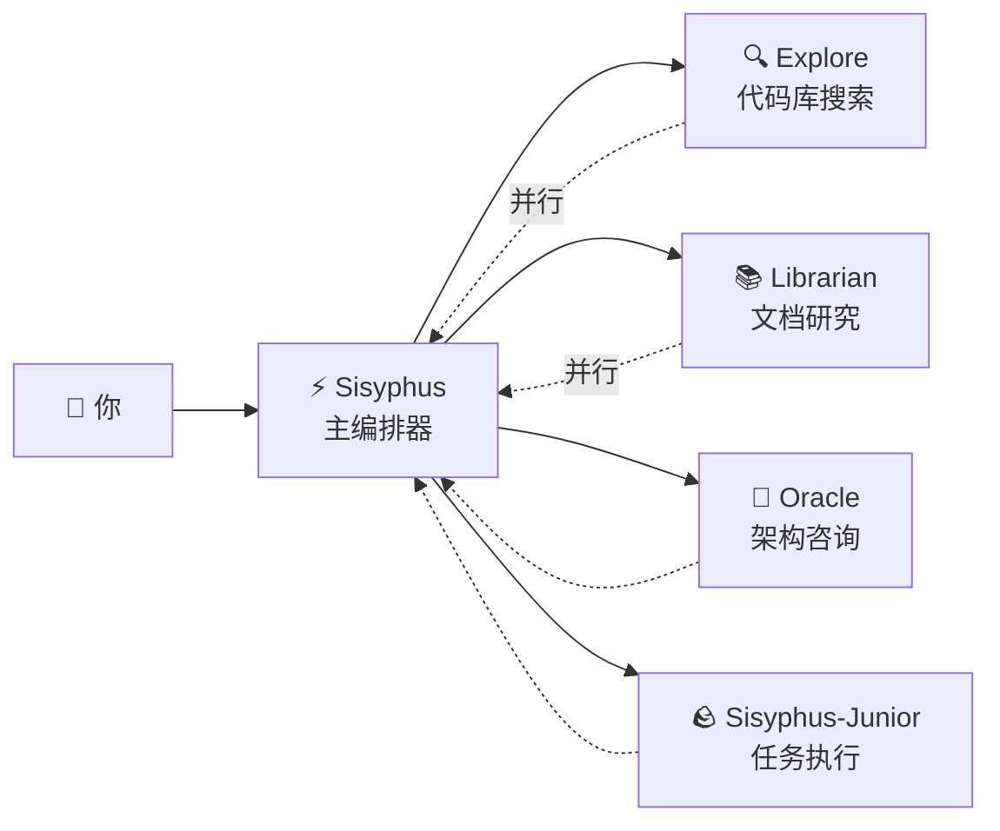

# 主编排器：像资深工程师一样思考和执行

## 学完你能做什么

- 理解 Sisyphus 如何像真实开发团队一样协调工作
- 掌握任务委托的最佳实践，让不同专家代理协同完成复杂任务
- 学会通过并行后台任务大幅提升开发效率
- 知道什么时候该让代理自己干，什么时候该委托给专家

## 你现在的困境

你可能遇到过这些问题：

- AI 代理"半途而废"，写着写着就忘了目标
- 同一个文件改来改去，每次都要重新读一遍上下文
- 想让 AI 干很多件事，但只能一个一个排队等
- 代理写了代码，但你自己还得去验证对不对、有没有破坏其他功能

**根本原因**：你让一个"万能助手"干所有活，但专家才懂专业事。

## 什么时候用这一招

Sisyphus 是你的主编排器，适合这些场景：

| 场景 | 是否适合 | 替代方案 |
|------|---------|---------|
| 复杂功能开发（3+ 步骤） | ✅ 强烈推荐 | Prometheus + Atlas（需要详细规划） |
| 快速修复已知 Bug | ✅ 合适 | 直接让 Sisyphus 做 |
| 需要调研多个仓库/文档 | ✅ 强烈推荐 | 使用 Sisyphus 并行委托 |
| 单文件简单修改 | ✅ 可以 | 直接编辑（更简单） |
| 需要详细项目规划 | ⚠️ 不推荐 | 先用 Prometheus 生成计划 |

## 核心思路

**Sisyphus** 是主编排器代理，像真实开发团队一样协调多个 AI 专家。它通过职责分离和并行委托机制，让专业子代理各自发挥所长，实现高效协作。

Sisyphus 不是"更聪明的 AI"，它是一个**编排系统**。

### 职责分离



**Sisyphus 不写代码**，它负责：

1. **理解你的真实需求**（不只听表面意思）
2. **判断谁最擅长这件事**（不是什么都自己干）
3. **并行委托任务**（让多个专家同时工作）
4. **验证结果**（绝不轻信"我完成了"）

### 为什么叫 Sisyphus？

希腊神话中的 Sisyphus 被惩罚永无止境地推石头上山。

这个系统的设计哲学：**代理必须推完石头（完成所有 TODO）才能停下**。

::: info
这不是惩罚，是质量保证机制。你不会希望 AI 半途而废留下烂摊子。
:::

### 32k Thinking Budget

Sisyphus 使用 **Claude Opus 4.5 + 32k thinking budget**。

这有什么用？

| 低预算（无 thinking） | 32k thinking budget |
|---------------------|---------------------|
| 直接开始写代码 | 先深度分析需求、评估复杂度、拆解任务 |
| 容易遗漏边界情况 | 提前发现潜在问题和风险 |
| 写到一半发现不对路 | 一开始就选择最优方案 |

::: tip
强烈推荐给 Sisyphus 配置 **Opus 4.5** 模型。用其他模型体验会显著下降。
:::

## 跟我做

### 第 1 步：创建一个测试项目

**为什么**
你需要一个可运行的项目来观察 Sisyphus 的行为。
mkdir my-app && cd my-app
npm create next-app@latest . -- --typescript --tailwind --eslint --no-src-dir
npm install
```

**你应该看到**：项目初始化完成，可运行 `npm run dev` 启动。

### 第 2 步：给 Sisyphus 一个复杂任务

在 OpenCode 中打开项目，输入：

```
添加用户登录功能，包括：
- 邮箱密码登录
- JWT token 存储
- 受保护的路由
- 登录状态检查
```

观察 Sisyphus 的反应。

**你应该看到**：

1. Sisyphus 不会直接开始写代码
2. 它先创建 TODO 列表（详细拆解任务）
3. 评估代码库模式（检查配置、文件结构）
4. 可能会问你几个澄清问题

**检查点 ✅**：查看 OpenCode 的 TODO 面板，应该看到类似：

```
□ 安装必要的依赖（bcrypt, jsonwebtoken）
□ 创建用户模型和类型定义
□ 实现登录 API 端点
□ 创建 JWT 签名和验证工具
□ 添加受保护路由中间件
□ 实现前端登录表单
□ 添加登录状态管理
```

### 第 3 步：观察并行委托（关键时刻）

Sisyphus 在实现过程中，可能会：

```
[Background Task Started]
- Task ID: bg_abc123
- Agent: explore
- Prompt: "Find existing auth patterns in this codebase..."

[Background Task Started]
- Task ID: bg_def456
- Agent: librarian
- Prompt: "Research JWT best practices for Next.js..."
```

**这是关键**：Sisyphus **没有等待**这些任务完成，它继续工作。

当你需要结果时，它会调用 `background_output(task_id="...")` 获取。

**为什么这样快？**

| 串行方式（传统） | 并行方式（Sisyphus） |
|-----------------|---------------------|
| 代码库搜索（2 分钟） | ⏳ 代码库搜索（2 分钟） |
| 等待... | ⏳ 文档研究（2 分钟，同时进行） |
| 文档研究（2 分钟） | 开始实现（总耗时 2 分钟） |
| 开始实现（2 分钟） |  |
| **总耗时 6 分钟** | **总耗时 4 分钟（省 33%）** |

### 第 4 步：验证机制

当 Sisyphus 声称"任务完成"时，它会：

1. 运行 `lsp_diagnostics` 检查错误
2. 运行 `npm run build` 确保构建通过
3. 如果有测试，运行测试套件
4. 标记 TODO 为 `completed`

**检查点 ✅**：查看终端输出，应该看到类似：

```
✓ Running diagnostics on changed files...
✓ No errors found
✓ Build passed (exit code 0)
✓ All tests passed
```

如果任何验证失败，Sisyphus 会立即修复，从不留下烂摊子。

### 第 5 步：踩坑提醒

#### ❌ 错误做法：打断 Sisyphus 的 TODO 追踪

你看到 Sisyphus 在做任务，你急着催：

```
快点写代码！别做计划了！
```

**问题**：Sisyphus 会跳过 TODO，直接写代码，但可能遗漏边界情况。

**正确做法**：

```
等 Sisyphus 完成规划。如果觉得规划不对，提具体的改进建议：
"TODO 第 3 步应该先考虑数据库迁移方案。"
```

#### ❌ 错误做法：不让 Sisyphus 委托

你在配置中禁用了所有专家代理，只留 Sisyphus。

**问题**：Sisyphus 会尝试自己干所有活，但可能不够专业。

**正确做法**：

保持默认配置，让 Sisyphus 自动委托给专家：

| 任务 | Sisyphus 自己做 | 委托给专家 |
|------|----------------|-----------|
| 单文件简单修改 | ✅ 可以 | 不需要 |
| 代码库搜索 | ⚠️ 慢 | ✅ Explore（更快） |
| 文档研究 | ⚠️ 可能不准确 | ✅ Librarian（更专业） |
| 架构决策 | ❌ 不建议 | ✅ Oracle（更权威） |

## 本课小结

Sisyphus 的威力不在于"更聪明"，而在于：

1. **职责分离**：主编排器 + 专业团队，不是单打独斗
2. **深度思考**：32k thinking budget 确保不遗漏细节
3. **并行执行**：后台任务让多个专家同时工作
4. **强制验证**：没有证据 = 任务未完成
5. **TODO 追踪**：半途而废是不允许的

**核心原则**：

::: tip
**默认委托**：除非任务极其简单（单文件、已知位置），否则优先考虑委托给专家或使用 Category+Skill。
:::

## 下一课预告

> 下一课我们学习 **[Ultrawork 模式](../ultrawork-mode/)**，一键激活全部功能，让 Sisyphus 全力以赴完成复杂任务。
>
> 你会学到：
> - 如何用 `ultrawork` 关键词快速启动任务
> - Ultrawork 模式激活了哪些额外能力
> - 什么时候该用 Ultrawork，什么时候该用 Prometheus

---

## 附录：源码参考

<details>
<summary><strong>点击展开查看源码位置</strong></summary>

> 更新时间：2026-01-26

| 功能 | 文件路径 | 行号 |
|------|---------|------|
| Sisyphus 代理工厂 | [`src/agents/sisyphus.ts`](https://github.com/code-yeongyu/oh-my-opencode/blob/main/src/agents/sisyphus.ts) | 419-450 |
| Sisyphus 核心提示词 | [`src/agents/sisyphus.ts`](https://github.com/code-yeongyu/oh-my-opencode/blob/main/src/agents/sisyphus.ts) | 17-416 |
| 代理元数据和模型配置 | [`src/agents/AGENTS.md`](https://github.com/code-yeongyu/oh-my-opencode/blob/main/src/agents/AGENTS.md) | 24-36 |
| 工具权限限制 | [`src/agents/AGENTS.md`](https://github.com/code-yeongyu/oh-my-opencode/blob/main/src/agents/AGENTS.md) | 44-51 |

**关键配置**：
- **Thinking Budget**：32k tokens（仅 Anthropic 模型）
- **Temperature**：0.1（代码代理固定低温度）
- **Max Tokens**：64000
- **推荐模型**：anthropic/claude-opus-4-5

**核心工作流程**（来自源码）：
- **Phase 0**: Intent Gate（意图分类，第 53-103 行）
- **Phase 1**: Codebase Assessment（代码库评估，第 107-130 行）
- **Phase 2A**: Exploration & Research（探索研究，第 132-172 行）
- **Phase 2B**: Implementation（实现，第 176-263 行）
- **Phase 2C**: Failure Recovery（失败恢复，第 266-283 行）
- **Phase 3**: Completion（完成，第 286-302 行）

**关键约束**：
- **非平凡任务必须创建 TODO**（第 311 行）
- **后台任务必须并行**（第 144-162 行）
- **必须验证结果**（第 254-262 行）

</details>
