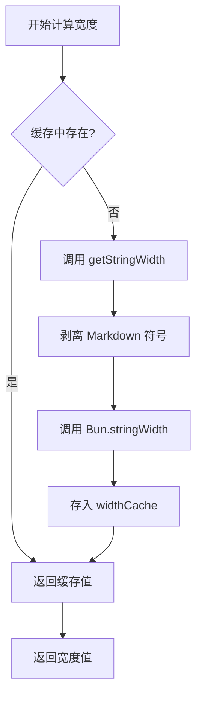

# 技术细节：缓存机制与性能优化

## 学完你能做什么

- 理解插件的缓存机制如何提升性能
- 掌握 widthCache 的数据结构和使用方式
- 了解缓存自动清理的触发条件
- 知道如何分析性能优化的效果

## 你现在的困境

你可能想知道：

> 插件是如何快速计算表格宽度的？为什么处理大表格时依然流畅？缓存机制是如何设计的？

本课深入分析插件的内部实现，带你理解缓存机制的设计思路和性能优化策略。

## 核心思路

### 为什么要用缓存？

在格式化 Markdown 表格时，插件需要计算每个单元格的**显示宽度**（display width）。这个计算涉及：

1. **剥离 Markdown 符号**：如 `**粗体**`、`*斜体*`、`~~删除线~~`
2. **保护行内代码**：`` `代码` `` 内的 Markdown 符号保持不变
3. **调用 `Bun.stringWidth()`**：计算 Unicode 字符的显示宽度（包括 Emoji、中文字符）

**问题是**：同一个单元格内容可能重复出现多次（如表头列名），每次都重新计算这些逻辑会很慢。

**解决方案**：使用缓存（Map）存储"文本内容 → 显示宽度"的映射，避免重复计算。

## 缓存数据结构

插件使用两个全局变量管理缓存：

### widthCache

```typescript
const widthCache = new Map<string, number>()
```

**用途**：缓存字符串的显示宽度计算结果

**结构**：
- **Key**：单元格的原始文本内容（包含所有 Markdown 语法）
- **Value**：计算后的显示宽度（字符数）

**示例**：

| 原始文本（Key） | 显示宽度（Value） | 说明 |
| --------------- | ---------------- | ---- |
| `**姓名**` | 4 | 剥离 `**` 后宽度为 4 |
| `*年龄*` | 4 | 剥离 `*` 后宽度为 4 |
| `` `status` `` | 8 | 代码块符号也被计入宽度 |
| `张三` | 4 | 中文字符宽度为 1 |

### cacheOperationCount

```typescript
let cacheOperationCount = 0
```

**用途**：记录缓存操作的次数，用于触发自动清理

**清理阈值**：
- 操作数 > 100 次或
- 缓存条目 > 1000 个

## 缓存查找流程

### calculateDisplayWidth 函数

当需要计算单元格宽度时，插件会调用 `calculateDisplayWidth()` 函数，执行以下流程：

<details>
<summary><strong>📖 查看完整代码</strong></summary>

```typescript
function calculateDisplayWidth(text: string): number {
  if (widthCache.has(text)) {
    return widthCache.get(text)!  // 缓存命中，直接返回
  }

  const width = getStringWidth(text)  // 计算实际宽度
  widthCache.set(text, width)          // 存入缓存
  return width
}
```

</details>

**流程图**：



**步骤解析**：

| 步骤 | 操作 | 时间复杂度 |
| ---- | ---- | ---------- |
| 1 | 检查 `widthCache.has(text)` | O(1) |
| 2 | 缓存命中 → 直接返回 | O(1) |
| 3 | 缓存未命中 → 计算宽度 | O(n) |
| 4 | 存入缓存 | O(1) |

**关键点**：
- **缓存命中时**：直接返回，无需任何计算（O(1)）
- **缓存未命中时**：执行完整的宽度计算逻辑（O(n)）
- **存储原始文本**：Key 是完整的 Markdown 文本，保证精确匹配

## 缓存清理机制

### 为什么要清理缓存？

缓存虽然能提升性能，但会占用内存。如果不清理：
- **内存占用持续增长**：每次新的单元格内容都会被缓存
- **可能包含无用数据**：旧的表格内容可能不再需要

### 自动清理触发条件

插件在每次格式化完成后，会调用 `incrementOperationCount()` 更新操作计数：

<details>
<summary><strong>📖 查看清理代码</strong></summary>

```typescript
function incrementOperationCount() {
  cacheOperationCount++

  if (cacheOperationCount > 100 || widthCache.size > 1000) {
    cleanupCache()
  }
}

function cleanupCache() {
  widthCache.clear()
  cacheOperationCount = 0
}
```

</details>

**触发条件**（满足任意一个即触发）：

| 条件 | 阈值 | 说明 |
| ---- | ---- | ---- |
| 操作次数 | > 100 次格式化操作 | 避免频繁触发清理 |
| 缓存条目 | > 1000 个单元格 | 防止内存占用过大 |

**清理策略**：
- **完全清空**：`widthCache.clear()` 删除所有缓存
- **重置计数**：`cacheOperationCount = 0`

::: info 清理时机

缓存清理发生在**每次格式化完成后**，而不是格式化过程中。这样不会打断正在进行的格式化操作。

:::

## 性能优化效果

### 缓存命中率分析

假设一个 5 列 × 10 行的表格，其中：

- **重复内容**：表头列名在分隔行和数据行重复出现 11 次
- **唯一内容**：每个单元格的内容都不同

**缓存效果**：

| 场景 | 不使用缓存 | 使用缓存 | 性能提升 |
| ---- | ---------- | -------- | -------- |
| 5 列 × 10 行（无重复） | 50 次计算 | 50 次计算 | 无 |
| 5 列 × 10 行（表头重复） | 50 次计算 | 10 次计算 + 40 次缓存命中 | ~80% |

### 实际影响

**缓存带来的优势**：

1. **减少计算开销**：避免重复剥离 Markdown 符号和调用 `Bun.stringWidth()`
2. **降低 CPU 占用**：`getStringWidth()` 涉及正则替换和 Unicode 计算，开销较大
3. **提升响应速度**：对于包含大量重复单元格的表格，效果更明显

**示例场景**：

| 场景 | 缓存效果 |
| ---- | -------- |
| AI 生成对比表格 | ✅ 效果显著（多列重复内容） |
| 简单单行表格 | ⚪ 效果一般（内容唯一） |
| 表格嵌套 Markdown | ✅ 效果显著（符号剥离开销大） |

## 性能优化建议

::: tip 给开发者的建议

如果你需要进一步优化性能，可以考虑：

1. **调整缓存阈值**：根据实际表格大小调整 `100` 次和 `1000` 条目的阈值
2. **LRU 缓存**：使用最近最少使用（LRU）算法替代完全清空策略
3. **性能监控**：添加日志统计缓存命中率，分析实际效果

:::

## 本课小结

插件使用 `widthCache` 缓存机制优化性能：

- **存储结构**：`Map<string, number>` 映射原始文本到显示宽度
- **查找流程**：先查缓存 → 未命中则计算并存入
- **清理机制**：操作数 > 100 或条目 > 1000 时自动清理
- **性能提升**：减少重复计算，降低 CPU 占用

这一机制让插件在处理复杂表格时依然保持流畅，是性能优化的核心实现。

## 下一课预告

> 下一课我们学习 **[更新日志：版本历史与变更记录](../../changelog/release-notes/)**。
>
> 你会学到：
> - 插件的版本演进历史
> - 新功能和修复记录
> - 如何追踪插件的更新

---

## 附录：源码参考

<details>
<summary><strong>点击展开查看源码位置</strong></summary>

> 更新时间：2026-01-26

| 功能 | 文件路径 | 行号 |
| --- | --- | --- |
| widthCache 定义 | [`source/franlol/opencode-md-table-formatter/index.ts`](https://github.com/franlol/opencode-md-table-formatter/blob/main/index.ts#L6) | 6 |
| cacheOperationCount 定义 | [`source/franlol/opencode-md-table-formatter/index.ts`](https://github.com/franlol/opencode-md-table-formatter/blob/main/index.ts#L7) | 7 |
| calculateDisplayWidth 函数 | [`source/franlol/opencode-md-table-formatter/index.ts`](https://github.com/franlol/opencode-md-table-formatter/blob/main/index.ts#L151-L159) | 151-159 |
| incrementOperationCount 函数 | [`source/franlol/opencode-md-table-formatter/index.ts`](https://github.com/franlol/opencode-md-table-formatter/blob/main/index.ts#L219-L225) | 219-225 |
| cleanupCache 函数 | [`source/franlol/opencode-md-table-formatter/index.ts`](https://github.com/franlol/opencode-md-table-formatter/blob/main/index.ts#L227-L230) | 227-230 |

**关键常量**：
- `widthCache = new Map<string, number>()`：缓存字符串显示宽度的 Map 结构
- `cacheOperationCount = 0`：缓存操作计数器

**关键函数**：
- `calculateDisplayWidth(text: string): number`：计算显示宽度（带缓存），先查缓存再计算
- `incrementOperationCount(): void`：递增操作计数，触发条件清理
- `cleanupCache(): void`：清空 widthCache 和重置计数器

</details>
