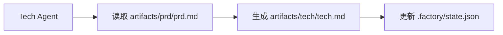

# 上下文优化：分会话执行

## 学完你能做什么

- 使用 `factory continue` 命令在新会话中继续流水线
- 理解每个阶段独享干净上下文的优势
- 掌握大幅降低 Token 消耗的方法
- 支持中断恢复，随时暂停和继续

## 你现在的困境

当你在 AI 助手（如 Claude Code）中执行完整的 7 阶段流水线时，可能会遇到这些问题：

- **Token 越用越多**：随着对话累积，上下文越来越长，每个阶段都要加载之前所有阶段的内容
- **成本越来越高**：长对话意味着更多的输入 Token，费用直线上升
- **响应变慢**：上下文过长可能导致响应时间增加
- **难以恢复**：如果某个阶段失败，重新开始需要重新加载大量上下文

::: tip 核心问题
长对话的上下文累积是 AI 助手的固有特性，但我们可以通过"分会话执行"来规避这个问题。
:::

## 什么时候用这一招

| 场景                     | 是否使用分会话 | 原因                           |
| ------------------------ | -------------- | ------------------------------ |
| 完整执行 7 阶段流水线   | ✅ 强烈推荐     | 每个 Token 都很宝贵             |
| 仅执行 1-2 个阶段       | ⚠️ 可选        | 上下文较短，不一定需要          |
| 调试某个阶段            | ⚠️ 可选        | 频繁重试可能增加会话切换成本    |
| 长时间中断后恢复        | ✅ 必须使用     | 避免加载过时的上下文            |

## 核心思路

Agent App Factory 支持**分会话执行**，其核心思想是：

**每个阶段结束后，用新会话执行下一个阶段。**

这样做的好处：

1. **干净上下文**：每个阶段只加载必要的输入文件，不依赖对话历史
2. **节省 Token**：避免了将之前所有阶段的内容重复传递给 AI
3. **可恢复性**：随时可以中断，之后用新会话继续，不会丢失进度
4. **跨平台兼容**：适用于所有 AI 助手（Claude Code、OpenCode、Cursor 等）

### 上下文隔离策略

为了实现分会话执行，Agent App Factory 采用了**上下文隔离策略**：

::: info 什么是上下文隔离？
上下文隔离是指每个 Agent 只依赖文件输入，不依赖对话历史。即使之前发生了什么，Agent 也只从指定的输入文件读取信息。
:::

每个 Agent 执行时：

- ✅ **只读取** `pipeline.yaml` 中定义的 `inputs` 文件
- ❌ **不使用** 对话历史中的任何"记忆"
- ❌ **不假设** 自己知道之前阶段发生了什么

例如，Tech Agent 执行时：



Tech Agent 只关心 `artifacts/prd/prd.md`，不会去想"用户之前说想做什么应用"，所有信息都来自输入文件。

### 状态恢复机制

当你执行 `factory continue` 时，系统会：

1. 读取 `.factory/state.json` 获取当前进度
2. 读取 `.factory/pipeline.yaml` 确定下一个阶段
3. **仅加载该阶段所需的输入文件**
4. 启动新的 AI 助手窗口继续执行

状态文件（`.factory/state.json`）是整个系统的"记忆中心"：

```json
{
  "version": 1,
  "status": "waiting_for_confirmation",
  "current_stage": "tech",
  "completed_stages": ["bootstrap", "prd"],
  "last_updated": "2026-01-29T12:00:00Z"
}
```

每个阶段完成后，状态都会更新到这个文件中。新会话启动时，只要读取这个文件就能知道当前在哪里。

## 🎒 开始前的准备

::: warning 前置检查
在开始本教程前，请确保：

- [ ] 已完成 [快速开始](../../start/getting-started/) 并初始化了一个 Factory 项目
- [ ] 已了解 [7 阶段流水线概览](../../start/pipeline-overview/)
- [ ] 已安装 Claude Code（或其他 AI 助手）

如果还未完成，请先完成这些前置课程。
:::

## 跟我做

让我们通过一个实际场景来学习如何使用 `factory continue` 命令。

### 场景设定

假设你正在执行一个 7 阶段流水线，目前已经完成了 `bootstrap` 和 `prd` 阶段，正在 `ui` 阶段等待确认。

### 第 1 步：在检查点选择"新建会话继续"

当某个阶段完成后，Sisyphus 调度器会显示一个选项表格：

```
✓ ui 完成！

生成的产物：
- artifacts/ui/ui.schema.yaml
- artifacts/ui/preview.web/index.html
- artifacts/ui/preview.web/styles.css
- artifacts/ui/preview.web/app.js

┌─────────────────────────────────────────────────────────────┐
│  📋 请选择下一步操作                                         │
│  输入选项数字（1-5），然后按回车键确认                        │
└─────────────────────────────────────────────────────────────┘

┌──────┬──────────────────────────────────────────────────────┐
│ 选项 │ 说明                                                  │
├──────┼──────────────────────────────────────────────────────┤
│  1   │ 继续下一阶段（同一会话）                               │
│      │ 我将继续执行 tech 阶段                                 │
├──────┼──────────────────────────────────────────────────────┤
│  2   │ 新建会话继续 ⭐ 推荐选项，节省 Token                   │
│      │ 在新的命令行窗口中执行：factory continue               │
│      │ （会自动启动新的 Claude Code 窗口并继续流水线）        │
├──────┼──────────────────────────────────────────────────────┤
│  3   │ 重跑该阶段                                             │
│      │ 重新执行 ui 阶段                                       │
├──────┼──────────────────────────────────────────────────────┤
│  4   │ 修改产物后重新运行                                     │
│      │ 修改 artifacts/prd/prd.md 后重新执行                   │
├──────┼──────────────────────────────────────────────────────┤
│  5   │ 暂停流水线                                             │
│      │ 保存当前进度，稍后继续                                 │
└──────┴──────────────────────────────────────────────────────┘

💡 提示：输入 1-5 之间的数字，然后按回车键确认您的选择
```

**你应该看到**：
- 选项 2 被标记为"⭐ 推荐选项，节省 Token"

在当前会话中，我们可以选择选项 5（暂停流水线），然后在新的命令行窗口中执行 `factory continue`。

**为什么**
- 选项 1 是"继续下一阶段（同一会话）"，这会在当前会话中继续，上下文会累积
- 选项 2 是"新建会话继续"，这会用新的干净上下文执行下一阶段，**节省 Token**
- 选项 5 是"暂停流水线"，这会保存当前进度，之后可以用 `factory continue` 恢复

### 第 2 步：在新命令行窗口执行 `factory continue`

打开一个新的终端窗口（或标签页），进入你的项目目录，然后执行：

```bash
factory continue
```

**你应该看到**：

```
Agent Factory - Continue in New Session

Pipeline Status:
────────────────────────────────────────
Project: my-awesome-app
Status: Waiting
Current Stage: tech
Completed: bootstrap, prd

Starting new Claude Code session...
✓ 新 Claude Code 窗口已启动
  (Please wait for the window to open)
```

**发生了什么**：

1. `factory continue` 命令读取了 `.factory/state.json`，知道当前状态
2. 显示了当前项目的状态信息
3. 自动启动了新的 Claude Code 窗口，并传递了"请继续执行流水线"的指令
4. 新窗口会自动从 `tech` 阶段继续执行

### 第 3 步：在新窗口中继续执行

新的 Claude Code 窗口启动后，你会看到一个新的对话，但是状态是从之前保存的检查点恢复的。

在新的会话中，Agent 会：

1. 读取 `.factory/state.json` 获取当前阶段
2. 读取 `.factory/pipeline.yaml` 确定该阶段的输入和输出
3. **仅加载该阶段所需的输入文件**（例如 `artifacts/prd/prd.md`）
4. 执行该阶段的任务

**关键点**：
- 新会话中没有之前阶段的对话历史
- Agent 只从输入文件读取信息，不依赖"记忆"
- 这就是**上下文隔离**的体现

### 第 4 步：验证上下文隔离

为了验证上下文隔离是否生效，你可以尝试在新会话中询问 Agent：

"你知道 bootstrap 阶段做了什么吗？"

如果上下文隔离生效，Agent 会说类似这样的话：

"我需要先查看相关文件来了解之前的工作。让我读取一下..."

然后它会尝试读取 `input/idea.md` 或其他文件来获取信息，而不是直接从对话历史中"回忆"。

**检查点 ✅**
- 新会话启动成功
- 显示了正确的项目状态
- Agent 只依赖输入文件，不依赖对话历史

### 第 5 步：继续执行剩余阶段

每个阶段完成后，你都可以选择：

- 在当前会话中继续（选项 1）- 适用于短流程
- **新建会话继续（选项 2）** - **推荐，节省 Token**
- 暂停流水线（选项 5）- 之后再执行 `factory continue`

对于完整的 7 阶段流水线，建议每个阶段都使用"新建会话继续"，这样：

```
bootstrap (会话 1) → prd (会话 2) → ui (会话 3) → tech (会话 4)
→ code (会话 5) → validation (会话 6) → preview (会话 7)
```

每个会话都是干净的，不需要加载之前所有阶段的内容。

## 踩坑提醒

### 坑 1：忘记执行 `factory continue`

**错误做法**：
- 在旧会话中直接开始下一阶段
- 或者在新窗口中直接打开 Claude Code 而不执行 `factory continue`

**正确做法**：
- 总是使用 `factory continue` 命令启动新会话
- 该命令会自动读取状态并传递正确的指令

### 坑 2：在新会话中重复加载历史文件

**错误做法**：
- 在新会话中手动要求 AI 读取之前阶段的产物
- 认为 AI 应该"知道"之前发生了什么

**正确做法**：
- 相信上下文隔离机制，Agent 会自动从输入文件读取信息
- 只提供该阶段需要的输入文件

### 坑 3：跨项目使用 `factory continue`

**错误做法**：
- 在项目 A 中执行 `factory continue`，但当前目录是项目 B

**正确做法**：
- `factory continue` 会检查当前目录是否为 Factory 项目
- 如果不是，会提示需要先执行 `factory init`

### 坑 4：修改产物后未使用 `factory continue`

**场景**：
- 你在某个阶段完成后，手动修改了产物（如修改了 PRD）
- 想继续执行下一阶段

**正确做法**：
- 执行 `factory run`（会从指定阶段重新开始）
- 或者执行 `factory continue`（会从当前检查点继续）
- 不要直接在旧会话中继续，因为上下文可能不一致

## 本课小结

本课学习了如何使用 `factory continue` 命令进行分会话执行：

### 核心要点

1. **分会话执行**：每个阶段完成后，用新会话执行下一阶段
2. **上下文隔离**：Agent 只依赖输入文件，不依赖对话历史
3. **状态恢复**：`.factory/state.json` 记录当前进度，新会话可以恢复
4. **节省 Token**：避免加载过长的上下文，大幅降低成本

### 命令速查

| 命令             | 作用                         | 使用场景           |
| ---------------- | ---------------------------- | ------------------ |
| `factory continue` | 新建会话继续执行流水线       | 每个阶段完成后     |
| `factory run`      | 在当前会话中运行流水线       | 首次运行或调试     |
| `factory status`   | 查看当前项目状态             | 了解进度           |

### 最佳实践

- ✅ 完整执行 7 阶段流水线时，每个阶段都使用 `factory continue`
- ✅ 在检查点选择"新建会话继续"（选项 2）
- ✅ 相信上下文隔离机制，不要手动加载历史文件
- ✅ 使用 `factory status` 检查项目进度

## 下一课预告

> 下一课我们学习 **[权限与安全机制](../security-permissions/)**。
>
> 你会学到：
> - 能力边界矩阵如何防止 Agent 越权
> - 越权处理机制和不可信产物隔离
> - 安全检查点和权限校验流程
> - 如何配置 Claude Code 的权限文件

这节课将帮助你理解 Agent App Factory 的安全机制，确保每个 Agent 只在授权目录中读写文件。

---

## 附录：源码参考

<details>
<summary><strong>点击展开查看源码位置</strong></summary>

> 更新时间：2026-01-29

| 功能                 | 文件路径                                                                                                       | 行号    |
| -------------------- | -------------------------------------------------------------------------------------------------------------- | ------- |
| factory continue 命令 | [`cli/commands/continue.js`](https://github.com/hyz1992/agent-app-factory/blob/main/cli/commands/continue.js) | 1-144   |
| 调度器上下文优化    | [`agents/orchestrator.checkpoint.md`](https://github.com/hyz1992/agent-app-factory/blob/main/agents/orchestrator.checkpoint.md) | 113-154  |
| 上下文隔离策略      | [`policies/context-isolation.md`](https://github.com/hyz1992/agent-app-factory/blob/main/policies/context-isolation.md) | 1-64    |

**关键函数**：
- `launchClaudeCode(projectDir, nextStage, completedStages)`：启动新的 Claude Code 窗口
- `commandExists(cmd)`：检查命令是否可用
- `module.exports(projectDir)`：`factory continue` 命令的主函数

**关键常量**：
- `state.json`：状态文件路径（`.factory/state.json`）
- `pipeline.yaml`：流水线定义文件路径（`.factory/pipeline.yaml`）
- `config.yaml`：项目配置文件路径（`.factory/config.yaml`）

**关键业务规则**：
- BR-6-1：每阶段独享干净上下文
- BR-6-2：使用 `factory continue` 命令继续
- BR-6-3：仅加载当前阶段所需文件

</details>
