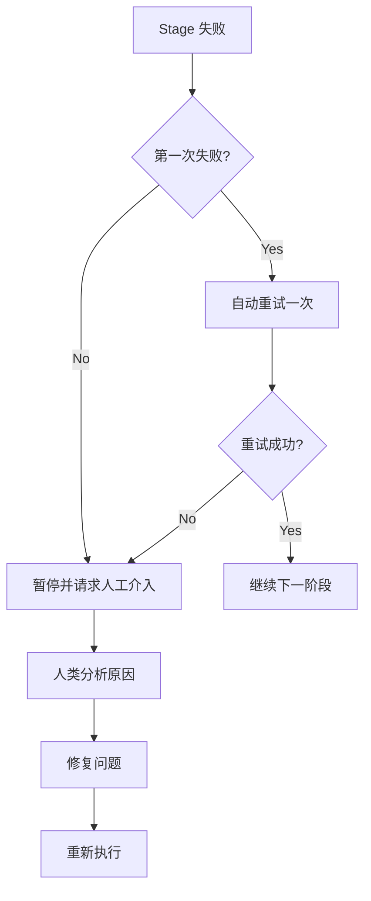
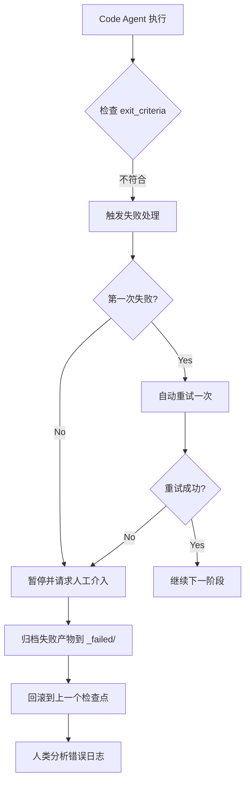
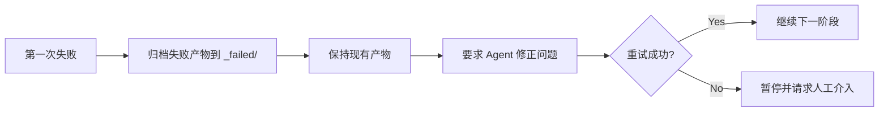
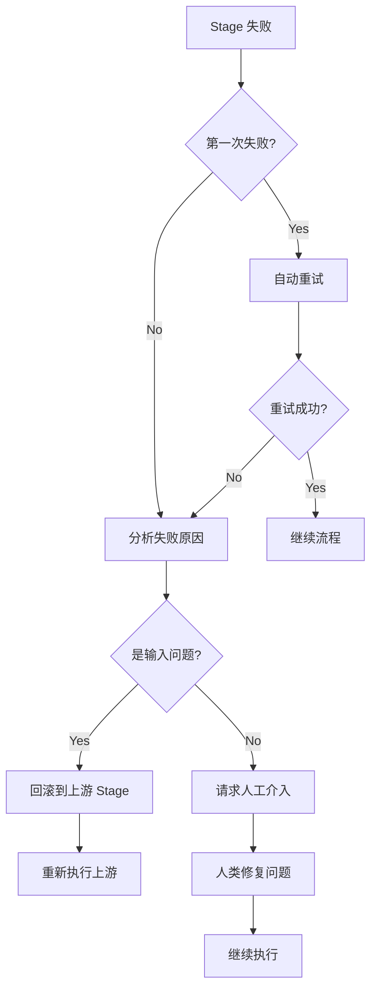

# 失败处理与回滚：智能容错与错误恢复

## 学完你能做什么

- **识别失败类型**：快速判断输出缺失、内容不符、越权写入等失败原因
- **理解重试机制**：掌握自动重试一次的策略和失败归档规则
- **执行回滚操作**：学会回滚到最近成功检查点，恢复稳定状态
- **人工介入处理**：知道何时需要人工介入，如何分析失败原因并修复
- **解读错误日志**：看懂 `pipeline/error.log` 的错误报告，快速定位问题

## 你现在的困境

流水线执行时，你最担心的是：

- **失败了怎么办**：某个阶段报错了，是重试还是从头开始？
- **数据污染了**：失败产物会影响后续阶段吗？会被清理吗？
- **怎么回滚**：想回到上一个成功状态，怎么做？
- **人工介入**：连续失败了，需要我做什么？怎么看日志？

失败处理机制就是为了解决这些问题——它定义了识别失败、自动重试、归档失败产物、回滚到检查点和人工介入的完整流程。

## 什么时候用这一招

当流水线出现以下情况时：

- **阶段失败**：Agent 执行失败，输出文件缺失或不符合预期
- **越权操作**：Agent 写入了未授权目录，触发安全检查
- **连续失败**：同一阶段失败两次，需要人工介入分析
- **需要回滚**：想回到之前的成功状态重新开始
- **日志分析**：需要查看详细的错误报告和堆栈信息

## 核心思路

失败处理策略由 Sisyphus 调度器统一执行，它像一位**容错工程师**，在流水线出错时自动处理或请求人工介入。

### 失败定义

以下情况被视为 Stage 失败：

| 失败类型 | 症状 | 代码位置 |
|---------|------|----------|
| **输出缺失** | `pipeline.yaml` 指定的输出文件不存在或命名不符 | `failure.policy.md:9` |
| **不符合 exit_criteria** | 输出内容未满足 `pipeline.yaml` 中的退出条件 | `failure.policy.md:10` |
| **越权写入** | Agent 向未授权的目录或文件写入内容 | `failure.policy.md:11` |
| **其他异常** | 脚本错误、无法读取输入等导致无法完成任务 | `failure.policy.md:12` |

### 重试机制



**重试规则**（`failure.policy.md:16-18`）：

- 每个 Stage 默认允许 **自动重试一次**
- 重试时，调度器要求 Agent 在保持现有产物的基础上修正问题，而非完全重做
- 若第二次尝试仍然失败，调度器必须暂停流水线并进入人工介入流程

### 回滚与存档

**失败归档**（`failure.policy.md:22-23`）：

```bash
# 失败产物移动到 _failed/ 目录
mv artifacts/<stage>/ artifacts/_failed/<stage-id>/attempt-1/
mv artifacts/<stage>/ artifacts/_failed/<stage-id>/attempt-2/
```

**回滚策略**（`failure.policy.md:23`）：

- 调度器回滚到最近一个成功的检查点
- 从该 Stage 重新开始执行
- 确保上下游产物一致，避免数据污染

### 人工介入

**介入时机**（`failure.policy.md:27`）：

- 同一 Stage 连续失败两次后
- 检测到越权写入时

**介入流程**（`failure.policy.md:27-29`）：

1. 调度器暂停执行并报告失败原因
2. 人类检查输入、配置或技能是否存在问题
3. 人类修改输入文件、调整技能或修改参数
4. 继续执行剩余流程

::: warning 调度器约束
调度器不得在未得到人类确认的情况下跳过失败阶段或修改输出。
:::

## 跟我做

### 第 1 步：认识失败处理流程

当你运行流水线时，如果某个阶段失败，Sisyphus 调度器会自动启动失败处理流程。

**示例场景**：Code 阶段失败



### 第 2 步：查看错误日志

失败时，调度器会记录详细的错误信息到 `pipeline/error.log`。

**错误日志格式**（`failure.policy.md:166-200`）：

```bash
cat pipeline/error.log
```

**你应该看到**：

```log
============================================
ERROR REPORT
============================================
Timestamp: 2026-01-29T10:30:00Z
Stage: code
Attempt: 2/2
Status: FAILED

Error Type: TypeScript Compilation Error
Error Message: Cannot find module '@prisma/client'

Stack Trace:
  at Object.<anonymous> (src/lib/prisma.ts:1:1)
  at Module._compile (node:internal/modules/cjs/loader:1198:14)

Exit Criteria Failed:
  - [ ] 后端可启动且无重大错误 (FAILED)
  - [x] 客户端可渲染并访问
  - [x] 未引入额外的认证或无关功能

Failed Artifacts Moved To:
  artifacts/_failed/code/attempt-2/

Recommended Action:
  1. 检查 package.json 是否包含 @prisma/client
  2. 运行 npx prisma generate 生成客户端
  3. 重试 Code 阶段

============================================
```

**错误日志解读**：

| 字段 | 说明 | 示例 |
|------|------|------|
| **Timestamp** | 失败发生时间 | 2026-01-29T10:30:00Z |
| **Stage** | 失败的阶段 | code |
| **Attempt** | 重试次数 | 2/2（第二次失败） |
| **Status** | 当前状态 | FAILED |
| **Error Type** | 错误类型 | TypeScript Compilation Error |
| **Error Message** | 错误描述 | Cannot find module '@prisma/client' |
| **Stack Trace** | 堆栈信息 | src/lib/prisma.ts:1:1 |
| **Exit Criteria Failed** | 未通过的退出条件 | 后端可启动且无重大错误 (FAILED) |
| **Failed Artifacts Moved To** | 失败产物归档位置 | artifacts/_failed/code/attempt-2/ |
| **Recommended Action** | 推荐的修复步骤 | 1. 检查 package.json... |

### 第 3 步：理解重试机制

当第一次失败时，Sisyphus 会自动触发重试。

**重试流程**（`failure.policy.md:16-18`）：



**重要特性**：

- **增量修复**：重试时，调度器要求 Agent 在现有产物基础上修正问题，而不是完全重做
- **失败归档**：每次失败的产物都会移动到 `artifacts/_failed/<stage-id>/attempt-N/`，便于对比分析
- **最多一次**：默认只允许自动重试一次，避免无限循环

### 第 4 步：查看失败归档

当阶段失败时，所有失败产物都会被归档到 `artifacts/_failed/` 目录。

**目录结构**：

```bash
artifacts/
├── _failed/
│   ├── code/
│   │   ├── attempt-1/
│   │   │   ├── backend/
│   │   │   └── client/
│   │   └── attempt-2/
│   │       ├── backend/
│   │       └── client/
│   ├── ui/
│   │   └── attempt-1/
│   └── prd/
│       └── attempt-1/
```

**归档目录命名规则**：

- `artifacts/_failed/<stage-id>/attempt-N/`
  - `<stage-id>`：失败的阶段名称（如 `code`、`ui`、`prd`）
  - `attempt-N`：尝试次数（1 表示第一次失败，2 表示第二次失败）

**为什么需要归档**：

- **避免污染**：失败产物不会影响后续阶段
- **便于分析**：可以对比不同尝试的差异，找出问题根源
- **证据保留**：保留失败产物供后续调试

### 第 5 步：执行回滚操作

当需要回到之前的状态时，可以使用回滚功能。

**回滚流程**（`failure.policy.md:23`）：

```bash
# 手动回滚到上一个检查点
factory run <stage-id>

# 例如：回滚到 tech 阶段重新执行
factory run tech
```

**回滚规则**：

- **回滚目标**：回滚到最近一个成功的检查点
- **重置状态**：清空当前阶段的产物和失败归档
- **重新执行**：从目标阶段重新开始执行

**回滚示例**：

假设你在 Code 阶段失败两次，想回到 Tech 阶段重新设计架构：

```bash
# 1. 回滚到 tech 阶段
factory run tech

# 2. AI 助手会重新执行 Tech Agent
# 3. 重新生成 artifacts/tech/ 和 artifacts/backend/prisma/
# 4. 然后继续执行 Code 阶段
```

### 第 6 步：人工介入处理

当连续失败两次后，Sisyphus 会暂停流水线并请求人工介入。

**介入决策树**（`failure.policy.md:204-236`）：



**人工介入检查清单**（`failure.policy.md:240-263`）：

#### 环境检查

- [ ] Node.js 版本 >= 18
- [ ] npm 版本 >= 9
- [ ] 磁盘空间充足
- [ ] 网络连接正常（npm 下载）

#### 状态检查

- [ ] `.factory/state.json` 状态正确
- [ ] 上游 Stage 产物完整
- [ ] 失败产物已归档到 `_failed/`

#### 修复确认

- [ ] 失败原因已明确
- [ ] 修复方案已实施
- [ ] 相关配置已更新

#### 恢复执行

- [ ] 从失败的 Stage 重新开始
- [ ] 监控执行日志
- [ ] 验证输出产物

### 第 7 步：常见失败场景处理

不同的阶段有不同的常见失败场景，以下是处理方案。

#### 7.1 Bootstrap 阶段失败

**常见错误**（`failure.policy.md:35-48`）：

| 错误类型 | 症状 | 原因 | 处理方案 |
|---------|------|------|----------|
| **输出缺失** | `input/idea.md` 不存在 | Agent 未正确写入文件 | 重试，检查写入路径 |
| **内容不完整** | idea.md 缺少关键章节 | 用户输入信息不足 | 暂停，请求用户补充信息 |
| **格式错误** | 不符合模板结构 | Agent 未遵循模板 | 重试，强调模板要求 |

**处理流程**：

```bash
# 1. 检查 input/ 目录是否存在
ls -la input/

# 2. 如果不存在，创建目录
mkdir -p input/

# 3. 重试 Bootstrap 阶段
factory run bootstrap
```

#### 7.2 PRD 阶段失败

**常见错误**（`failure.policy.md:50-65`）：

| 错误类型 | 症状 | 原因 | 处理方案 |
|---------|------|------|----------|
| **包含技术细节** | PRD 出现技术栈描述 | Agent 越界 | 重试，强调职责边界 |
| **功能过多** | Must Have > 7 个 | 范围蔓延 | 重试，要求精简到 MVP |
| **用户描述模糊** | "所有人"、"大部分用户" | 未具体化 | 重试，要求具体用户画像 |
| **缺少非目标** | Non-Goals 为空 | 未明确边界 | 重试，要求列出非目标 |

**处理流程**：

```bash
# 1. 验证 PRD 不包含技术关键词
grep -E "(React|API|数据库)" artifacts/prd/prd.md

# 2. 验证 Must Have 功能数量 ≤ 7
grep -A 100 "Must Have" artifacts/prd/prd.md | wc -l

# 3. 重试时提供具体的修正要求
factory run prd
```

#### 7.3 UI 阶段失败

**常见错误**（`failure.policy.md:67-82`）：

| 错误类型 | 症状 | 原因 | 处理方案 |
|---------|------|------|----------|
| **页面超限** | 页面数量 > 8 | 范围蔓延 | 重试，要求精简页面 |
| **预览无法打开** | HTML 文件损坏 | 生成错误 | 重试，检查 HTML 语法 |
| **使用 AI 风格** | Inter 字体 + 紫色渐变 | 未遵循审美指南 | 重试，要求选择鲜明审美 |
| **Schema 无效** | YAML 解析失败 | 语法错误 | 重试，验证 YAML 语法 |

**处理流程**：

```bash
# 1. 统计 ui.schema.yaml 中的页面数量
grep -c "page:" artifacts/ui/ui.schema.yaml

# 2. 尝试在浏览器中打开预览
open artifacts/ui/preview.web/index.html

# 3. 验证 YAML 语法
npx js-yaml artifacts/ui/ui.schema.yaml

# 4. 检查是否使用禁止的 AI 风格元素
grep -E "(Inter|purple|gradient)" artifacts/ui/ui.schema.yaml
```

#### 7.4 Tech 阶段失败

**常见错误**（`failure.policy.md:84-99`）：

| 错误类型 | 症状 | 原因 | 处理方案 |
|---------|------|------|----------|
| **Prisma 语法错误** | schema.prisma 无效 | 语法问题 | 重试，运行 prisma validate |
| **过度设计** | 引入微服务/缓存 | 违反 MVP 原则 | 重试，要求简化架构 |
| **数据模型过多** | 表数量 > 10 | 范围蔓延 | 重试，精简数据模型 |
| **缺少 API 定义** | tech.md 无端点列表 | 内容不完整 | 重试，要求补充 API |

**处理流程**：

```bash
# 1. 运行 Prisma 验证
cd artifacts/backend
npx prisma validate

# 2. 检查 tech.md 是否包含必要章节
grep -E "(API|端点|路由)" artifacts/tech/tech.md

# 3. 统计数据模型数量
grep -c "model " artifacts/backend/prisma/schema.prisma

# 4. 检查是否引入非必要复杂技术
grep -E "(微服务|缓存|队列)" artifacts/tech/tech.md
```

#### 7.5 Code 阶段失败

**常见错误**（`failure.policy.md:101-131`）：

| 错误类型 | 症状 | 原因 | 处理方案 |
|---------|------|------|----------|
| **依赖安装失败** | npm install 报错 | 包版本冲突 | 检查 package.json，更新版本 |
| **TypeScript 错误** | tsc 编译失败 | 类型问题 | 修复类型错误，重试 |
| **缺少必要文件** | 目录结构不完整 | 生成遗漏 | 重试，检查文件清单 |
| **测试失败** | npm test 失败 | 代码逻辑错误 | 修复测试，重试 |
| **API 无法启动** | 端口监听失败 | 配置问题 | 检查环境变量配置 |

**处理流程**：

```bash
# 1. 运行依赖检查
cd artifacts/backend
npm install --dry-run

# 2. 运行类型检查
npx tsc --noEmit

# 3. 对照文件清单检查目录结构
ls -la src/

# 4. 运行测试
npm test

# 5. 若以上全部通过，尝试启动服务
npm run dev
```

**常见依赖问题修复**（`failure.policy.md:120-131`）：

```bash
# 版本冲突
rm -rf node_modules package-lock.json
npm install

# Prisma 版本不匹配
npm install @prisma/client@latest prisma@latest

# React Native 依赖问题
cd artifacts/client
npx expo install --fix
```

#### 7.6 Validation 阶段失败

**常见错误**（`failure.policy.md:133-147`）：

| 错误类型 | 症状 | 原因 | 处理方案 |
|---------|------|------|----------|
| **验证报告不完整** | report.md 章节缺失 | Agent 未完成 | 重试 |
| **严重问题过多** | 错误数 > 10 | Code 阶段质量差 | 回滚到 Code 阶段 |
| **安全问题** | 检测到硬编码密钥 | 安全违规 | 回滚，修复安全问题 |

**处理流程**：

```bash
# 1. 解析 report.md 确认所有章节存在
grep -E "(## 摘要|## 后端|## 前端|## 问题)" artifacts/validation/report.md

# 2. 统计严重问题数量
grep -c "严重问题" artifacts/validation/report.md

# 3. 若严重问题 > 10，建议回滚到 Code 阶段
factory run code

# 4. 检查安全扫描结果
grep -E "(密钥|密码|token)" artifacts/validation/report.md
```

#### 7.7 Preview 阶段失败

**常见错误**（`failure.policy.md:149-162`）：

| 错误类型 | 症状 | 原因 | 处理方案 |
|---------|------|------|----------|
| **README 不完整** | 缺少安装步骤 | 内容遗漏 | 重试，补充步骤 |
| **Docker 构建失败** | Dockerfile 错误 | 配置问题 | 修复 Dockerfile |
| **部署配置缺失** | 无 docker-compose | 未生成 | 重试，要求生成配置 |

**处理流程**：

```bash
# 1. 检查 README.md 包含所有必要章节
grep -E "(## 快速开始|## 安装|## 运行)" artifacts/preview/README.md

# 2. 尝试 docker build 验证 Dockerfile
cd artifacts/preview
docker build -t test-app .

# 3. 检查部署配置文件是否存在
ls -la docker-compose.yml .github/workflows/
```

## 检查点 ✅

完成本课后，你应该：

- [ ] 理解失败处理的 4 种类型（输出缺失、内容不符、越权、异常）
- [ ] 掌握自动重试一次的机制
- [ ] 知道失败产物归档到 `artifacts/_failed/`
- [ ] 能够解读 `pipeline/error.log` 错误报告
- [ ] 理解回滚到检查点的流程
- [ ] 知道何时需要人工介入
- [ ] 掌握常见失败场景的处理方案

## 踩坑提醒

### 问题 1：重试时产物被完全重做

**症状**：第二次重试时，所有产物都被重新生成，而不是在现有基础上修正。

**原因**：Agent 没有遵循"在现有产物基础上修正"的规则。

**解决方案**：

在重试时，明确告知 Agent：

```markdown
请在现有产物基础上修正问题，不要完全重做。
保持已有的正确部分，只修改不符合 exit_criteria 的部分。
```

### 问题 2：失败产物污染后续阶段

**症状**：失败产物没有归档，影响了后续阶段的执行。

**原因**：归档失败产物的步骤未执行。

**解决方案**：

手动归档失败产物：

```bash
# 将失败产物移动到 _failed/ 目录
mv artifacts/<stage-id> artifacts/_failed/<stage-id>/attempt-1/

# 然后重新执行该阶段
factory run <stage-id>
```

### 问题 3：回滚后产物不一致

**症状**：回滚到上游阶段后，产物与之前不一致。

**原因**：回滚时只重置了当前阶段，没有清空依赖的下游产物。

**解决方案**：

完整回滚流程：

```bash
# 1. 回滚到目标阶段
factory run <target-stage>

# 2. 清空所有下游阶段产物
rm -rf artifacts/<downstream-stage-1>/
rm -rf artifacts/<downstream-stage-2>/

# 3. 重新执行
factory run
```

### 问题 4：人工介入后继续执行失败

**症状**：修复问题后继续执行，仍然失败。

**原因**：修复方案不完整或未保存修改。

**解决方案**：

人工介入检查清单：

```bash
# 1. 确认失败原因已明确
cat pipeline/error.log

# 2. 确认修复方案已实施
# 检查修改的文件

# 3. 确认相关配置已更新
cat .factory/state.json

# 4. 重新执行
factory run <failed-stage>
```

### 问题 5：错误日志不完整

**症状**：`pipeline/error.log` 中缺少关键信息。

**原因**：调度器未正确记录错误日志。

**解决方案**：

检查日志文件是否存在：

```bash
# 如果不存在，手动创建
mkdir -p pipeline
cat > pipeline/error.log << 'EOF'
ERROR REPORT
============================================
Timestamp: $(date -u +"%Y-%m-%dT%H:%M:%SZ")
Stage: <stage-id>
Attempt: 1/1
Status: FAILED

Error Type: Manual Debug
Error Message: Debug information needed

Stack Trace:
  (add stack trace if available)

Exit Criteria Failed:
  - [ ] exit-criteria-1
  - [ ] exit-criteria-2

Failed Artifacts Moved To:
  artifacts/_failed/<stage-id>/attempt-1/

Recommended Action:
  1. Describe the issue
  2. Provide fix steps
  3. Retry the stage

============================================
EOF
```

## 最佳实践

### 1. 早期失败

**原则**：尽早发现问题，避免在后续阶段浪费时间。

**实践**：

- 在 Bootstrap 阶段验证用户输入是否完整
- 在 PRD 阶段检查是否包含技术细节（违反职责边界）
- 在 UI 阶段验证页面数量是否合理

### 2. 详细日志

**原则**：记录足够的上下文信息，便于排查问题。

**实践**：

- 错误日志包含时间戳、阶段、尝试次数、错误类型、堆栈信息
- 推荐修复步骤具体到文件名和行号
- 归档失败产物便于对比分析

### 3. 原子操作

**原则**：每个阶段的输出应该是原子的，便于回滚。

**实践**：

- 一次性生成所有产物文件，而不是逐步写入
- 如果中途失败，不保留不完整的产物
- 归档整个阶段的产物，而不是部分文件

### 4. 保留证据

**原则**：失败产物归档后再重试，便于对比分析。

**实践**：

- 每次失败都归档到 `attempt-N/` 子目录
- 保留多次尝试的产物，便于对比差异
- 使用 `git diff` 对比不同尝试的差异

### 5. 渐进重试

**原则**：重试时提供更具体的指导，而非简单重复。

**实践**：

```markdown
# 第一次失败
请生成 PRD 文档。

# 第二次重试（提供具体指导）
请在现有 PRD 基础上修正以下问题：
1. 删除所有技术细节（如 React、API 等）
2. 将 Must Have 功能数量从 10 个减少到 7 个
3. 为目标用户添加具体画像
4. 补充 Non-Goals 章节并明确边界
```

## 本课小结

失败处理机制是 AI App Factory 的容错保障，它确保流水线在出错时能够自动恢复或请求人工介入。

**关键要点**：

1. **失败定义**：输出缺失、内容不符、越权写入、其他异常
2. **重试机制**：每个阶段允许自动重试一次，第二次失败后请求人工介入
3. **失败归档**：失败产物移动到 `artifacts/_failed/<stage-id>/attempt-N/`
4. **回滚策略**：回滚到最近成功检查点，确保上下游产物一致
5. **人工介入**：连续失败两次后，分析原因、修复问题、重新执行
6. **错误日志**：详细的错误报告包含时间戳、阶段、错误类型、堆栈信息、推荐修复步骤
7. **常见场景**：各阶段都有特定的常见错误和处理方案

## 下一课预告

> 下一课我们学习 **[常见问题与故障排除](../../faq/troubleshooting/)**。
>
> 你会学到：
> - 初始化阶段的常见问题
> - 执行过程中的故障排除
> - 部署相关的问题处理

---

## 附录：源码参考

<details>
<summary><strong>点击展开查看源码位置</strong></summary>

> 更新时间：2026-01-29

| 功能 | 文件路径 | 行号 |
|------|----------|------|
| 失败策略定义 | [`source/hyz1992/agent-app-factory/policies/failure.policy.md`](https://github.com/hyz1992/agent-app-factory/blob/main/policies/failure.policy.md) | 1-276 |
| 调度器失败处理 | [`source/hyz1992/agent-app-factory/agents/orchestrator.checkpoint.md`](https://github.com/hyz1992/agent-app-factory/blob/main/agents/orchestrator.checkpoint.md) | 38-46 |
| 能力边界矩阵 | [`source/hyz1992/agent-app-factory/policies/capability.matrix.md`](https://github.com/hyz1992/agent-app-factory/blob/main/policies/capability.matrix.md) | 1-40 |

**失败定义**（`failure.policy.md:5-13`）：
- 输出缺失：`pipeline.yaml` 指定的输出文件不存在或命名不符
- 不符合 exit_criteria：输出内容未满足 `pipeline.yaml` 中该 Stage 的 `exit_criteria`
- 越权写入：Agent 向未授权的目录或文件写入内容
- 其他异常：脚本错误、无法读取输入等导致无法完成任务

**重试机制**（`failure.policy.md:16-18`）：
- 每个 Stage 默认允许自动重试一次
- 调度器应要求 Agent 在保持现有产物的基础上修正问题，而非完全重做
- 若第二次尝试仍然失败，调度器必须暂停流水线并进入人工介入流程

**回滚与存档**（`failure.policy.md:22-23`）：
- 失败产物移动到 `artifacts/_failed/<stage-id>/` 目录
- 回滚到最近一个成功的检查点，从该 Stage 重新开始执行

**人工介入**（`failure.policy.md:27-29`）：
- 同一 Stage 连续失败两次时，调度器必须暂停执行并报告失败原因
- 人类介入后，可以修改输入文件、调整技能或修改参数，再继续执行剩余流程
- 调度器不得在未得到人类确认的情况下跳过失败阶段或修改输出

**错误日志格式**（`failure.policy.md:166-200`）：
- Timestamp、Stage、Attempt、Status
- Error Type、Error Message、Stack Trace
- Exit Criteria Failed
- Failed Artifacts Moved To
- Recommended Action

**常见失败场景**（`failure.policy.md:33-162`）：
- Bootstrap 阶段：输出缺失、内容不完整、格式错误
- PRD 阶段：包含技术细节、功能过多、用户描述模糊、缺少非目标
- UI 阶段：页面超限、预览无法打开、使用 AI 风格、Schema 无效
- Tech 阶段：Prisma 语法错误、过度设计、数据模型过多、缺少 API 定义
- Code 阶段：依赖安装失败、TypeScript 错误、缺少必要文件、测试失败、API 无法启动
- Validation 阶段：验证报告不完整、严重问题过多、安全问题
- Preview 阶段：README 不完整、Docker 构建失败、部署配置缺失

**调度器失败处理流程**（`orchestrator.checkpoint.md:38-46`）：
- 读取 `policies/failure.policy.md`，按照策略执行
- 要求 Agent 在保持现有产物的基础上修正问题并重新尝试
- 失败产物移动到 `artifacts/_failed/<stage-id>/` 目录
- 连续失败两次后暂停流水线，报告失败原因并等待人类介入

**越权处理**（`orchestrator.checkpoint.md:48-52`）：
- 检查输出路径是否仅限于授权目录
- 若发现越权写入，将该产物移动到 `artifacts/_untrusted/<stage-id>/`
- 暂停执行并报告

**人工介入决策树**（`failure.policy.md:204-236`）：
- 第一次失败 → 自动重试 → 重试成功? → 继续 / 第二次失败
- 第二次失败 → 分析失败原因 → 是输入问题? → 回滚到上游 Stage / 请求人工介入

**失败恢复检查清单**（`failure.policy.md:240-263`）：
- 环境检查：Node.js 版本、npm 版本、磁盘空间、网络连接
- 状态检查：`.factory/state.json`、上游 Stage 产物、失败产物归档
- 修复确认：失败原因、修复方案、相关配置
- 恢复执行：从失败 Stage 重新开始、监控日志、验证产物

**最佳实践**（`failure.policy.md:267-274`）：
- 早期失败：尽早发现问题，避免在后续 Stage 浪费时间
- 详细日志：记录足够的上下文信息，便于排查问题
- 原子操作：每个 Stage 的输出应该是原子的，便于回滚
- 保留证据：失败产物归档后再重试，便于对比分析
- 渐进重试：重试时提供更具体的指导，而非简单重复

</details>
