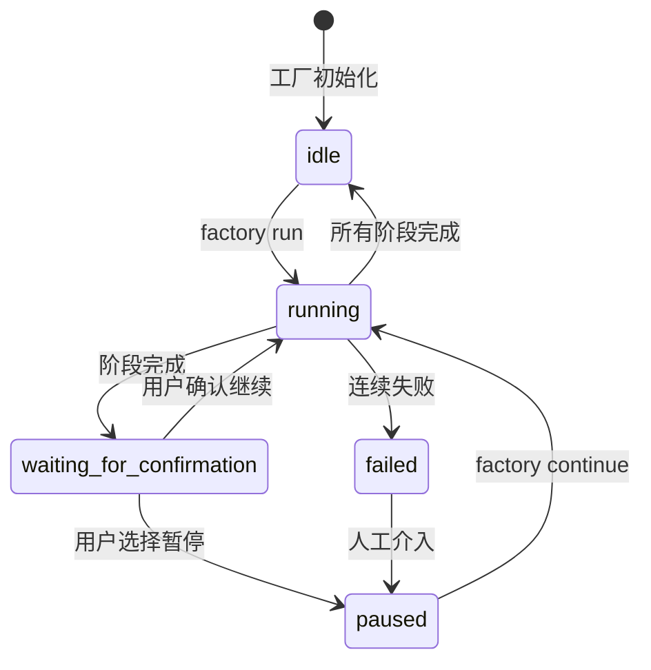
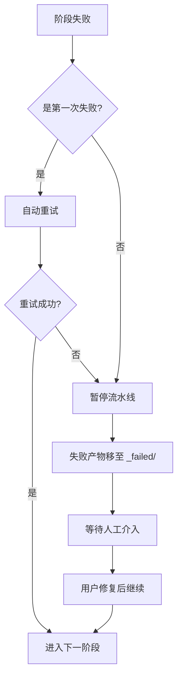

# Sisyphus 调度器详解：流水线协调与状态管理

## 学完你能做什么

- 读懂调度器如何协调 7 阶段流水线执行
- 理解状态机的工作原理和状态转换规则
- 掌握能力边界矩阵的权限检查机制
- 学会处理失败场景（重试、回滚、人工介入）
- 使用 `factory continue` 命令优化 Token 消耗

## 你现在的困境

你已经运行过几条流水线，但对这些问题可能还不太清楚：

- Sisyphus 到底做了什么？它和其他 Agent 有什么区别？
- 为什么 Agent 只能在某些目录读写，越权会发生什么？
- 失败后调度器怎么处理？为什么有时候自动重试，有时候需要人工介入？
- `factory continue` 命令为什么能节省 Token？背后的机制是什么？

如果你好奇这些问题，这章会帮你彻底搞懂。

## 什么时候用这一招

当你需要：

- **调试流水线问题**：了解调度器在某个阶段做了什么，为什么失败
- **优化 Token 消耗**：使用 `factory continue` 在每个阶段新建会话
- **扩展流水线**：添加新的 Agent 或修改现有逻辑
- **处理失败场景**：理解为什么某个阶段失败，以及如何恢复
- **检查权限问题**：确认 Agent 为什么无法访问某些文件

## 核心思路

Sisyphus 调度器是整个 AI App Factory 的"指挥官"。

**记住这个类比**：

- 其他 Agent（bootstrap、prd、ui、tech、code、validation、preview）就像是执行任务的工人
- Sisyphus 是负责调度工人、检查工作质量、处理异常的工头

**Sisyphus 的独特之处**：

| 特性 | Sisyphus | 其他 Agent |
| --- | --- | --- |
| **职责** | 协调、验证、状态管理 | 生成具体产物 |
| **产出** | 更新 state.json | 生成 PRD、代码、文档等 |
| **权限** | 读写 state.json | 读写特定 artifacts/ 子目录 |
| **生成内容** | 不生成业务内容 | 生成具体的业务产物 |

**关键原则**：

1. **严格顺序**：必须按 pipeline.yaml 定义执行，不能跳过或并行
2. **单阶段执行**：同一时刻只能激活一个 Agent
3. **职责分离**：Sisyphus 不修改业务产物，只负责协调和验证
4. **质量守门**：每个阶段完成后必须验证产物符合 exit_criteria

## 状态机模型

Sisyphus 以状态机的方式运行整个流程。理解状态机是掌握调度器的关键。

### 5 种状态



### 状态详解

| 状态 | 说明 | 触发条件 |
| --- | --- | --- |
| **idle** | 等待启动 | 项目初始化完成，或流水线全部完成 |
| **running** | 正在执行某个 Stage | factory run 或 factory continue 启动后 |
| **waiting_for_confirmation** | 等待人工确认 | 当前 Stage 完成后，等待用户选择下一步 |
| **paused** | 人工暂停 | 用户选择暂停，或连续失败后暂停 |
| **failed** | 检测到未处理的失败 | Agent 连续两次失败，或越权写入 |

::: info 状态文件
所有状态保存在 `.factory/state.json` 文件中，Sisyphus 拥有唯一更新权限。
:::

### 状态转换示例

**场景 1：正常执行**

```
idle → running (factory run)
   ↓
waiting_for_confirmation (bootstrap 完成)
   ↓
running (用户选择继续)
   ↓
waiting_for_confirmation (prd 完成)
   ↓
... (重复直到所有阶段完成)
   ↓
idle
```

**场景 2：失败恢复**

```
running → failed (code 阶段连续两次失败)
   ↓
paused (人工介入修复代码)
   ↓
running (factory continue 重试 code)
   ↓
waiting_for_confirmation
```

## 能力边界矩阵

### 为什么需要权限控制？

想象一下：

- 如果 PRD Agent 修改了 UI Agent 生成的文件，会导致什么问题？
- 如果 Tech Agent 读取了 Code Agent 生成的代码，会产生什么后果？

**答案**：职责混乱，产物无法追溯，质量无法保证。

能力边界矩阵通过限制每个 Agent 的读写权限，确保职责分离。

### 权限矩阵

| Agent | 可读取目录 | 可写入目录 | 说明 |
| --- | --- | --- | --- |
| **bootstrap** | 无 | `input/` | 仅在 `input/` 目录创建或修改 `idea.md` |
| **prd** | `input/` | `artifacts/prd/` | 读取想法文件，生成 PRD |
| **ui** | `artifacts/prd/` | `artifacts/ui/` | 读取 PRD，生成 UI Schema 与预览 |
| **tech** | `artifacts/prd/` | `artifacts/tech/`, `artifacts/backend/prisma/` | 读取 PRD，生成技术设计和数据模型 |
| **code** | `artifacts/ui/`, `artifacts/tech/`, `artifacts/backend/prisma/` | `artifacts/backend/`, `artifacts/client/` | 根据 UI 和技术设计生成代码 |
| **validation** | `artifacts/backend/`, `artifacts/client/` | `artifacts/validation/` | 验证代码质量，生成验证报告 |
| **preview** | `artifacts/backend/`, `artifacts/client/` | `artifacts/preview/` | 读取已生成的代码，编写演示说明 |

### 权限检查流程

**执行前**：

1. Sisyphus 读取 capability.matrix.md
2. 告知 Agent 允许的读取和写入目录
3. Agent 必须在权限范围内操作

**执行后**：

1. Sisyphus 扫描新创建或修改的文件
2. 检查是否在授权目录范围内
3. 如果发现越权，立即处理

### 越权处理机制

如果 Agent 写入了未授权目录：

1. **隔离产物**：将越权文件移动到 `artifacts/_untrusted/<stage-id>/`
2. **记录失败**：将事件标记为失败
3. **暂停流水线**：等待人工介入
4. **提供修复建议**：告诉用户如何处理不可信文件

**示例**：

```
⚠️  Unauthorized writes detected for stage "prd":
   - artifacts/ui/ui.schema.yaml

Files moved to quarantine: artifacts/_untrusted/prd

Please review these files before proceeding.
```

## 检查点机制

每个阶段完成后，Sisyphus 会暂停并等待人工确认。这就是检查点机制。

### 检查点的价值

- **质量控制**：人工验证每个阶段的产物
- **灵活控制**：可以随时暂停、重试、跳过
- **便于调试**：问题可以在早期发现，避免累积到后期

### 检查点输出模板

每个阶段完成后，Sisyphus 会按以下格式展示选项：

```
✓ prd 完成！

生成的产物：
- artifacts/prd/prd.md

┌─────────────────────────────────────────────────────────────┐
│  📋 请选择下一步操作                                         │
│  输入选项数字（1-5），然后按回车键确认                        │
└─────────────────────────────────────────────────────────────┘

┌──────┬──────────────────────────────────────────────────────┐
│ 选项 │ 说明                                                  │
├──────┼──────────────────────────────────────────────────────┤
│  1   │ 继续下一阶段（同一会话）                               │
│      │ 我将继续执行 ui 阶段                                   │
├──────┼──────────────────────────────────────────────────────┤
│  2   │ 新建会话继续 ⭐ 推荐选项，节省 Token                   │
│      │ 在新的命令行窗口中执行：factory continue               │
│      │ （会自动启动新的 Claude Code 窗口并继续流水线）        │
├──────┼──────────────────────────────────────────────────────┤
│  3   │ 重跑该阶段                                             │
│      │ 重新执行 prd 阶段                                      │
├──────┼──────────────────────────────────────────────────────┤
│  4   │ 修改产物后重新运行                                     │
│      │ 修改 input/idea.md 后重新执行                         │
├──────┼──────────────────────────────────────────────────────┤
│  5   │ 暂停流水线                                             │
│      │ 保存当前进度，稍后继续                                 │
└──────┴──────────────────────────────────────────────────────┘

💡 提示：输入 1-5 之间的数字，然后按回车键确认您的选择
```

::: tip 推荐做法
**选项 2（新建会话继续）是最佳实践**，原因见下一节"上下文优化"。
:::

## 失败处理策略

当某个阶段失败时，Sisyphus 会按照预定义的策略处理。

### 失败定义

**Sisyphus 认为失败的情况**：

- 输出文件缺失（要求生成的文件不存在）
- 输出内容不符合 exit_criteria（例如 PRD 缺少用户故事）
- Agent 越权写入（写入了未授权目录）
- Agent 连续执行错误（脚本错误、无法读取输入）

### 失败处理流程



### 自动重试机制

- **默认规则**：每个阶段允许自动重试一次
- **重试策略**：在原有产物基础上修正问题
- **失败归档**：重试失败后，产物移动到 `artifacts/_failed/<stage-id>/attempt-2/`

### 人工介入场景

**需要人工介入的情况**：

1. **连续失败两次**：自动重试后仍然失败
2. **越权写入**：Agent 写入了未授权目录
3. **脚本错误**：Agent 执行过程中抛出异常

**人工介入流程**：

1. Sisyphus 暂停流水线
2. 显示失败原因和错误信息
3. 提供修复建议：
   - 修改输入文件
   - 调整 Agent 定义
   - 更新 Skill 文件
4. 用户修复后，执行 `factory continue` 继续

## 上下文优化（节省 Token）

### 问题描述

如果你在同一个会话中连续执行 7 个阶段，会面临以下问题：

- **上下文累积**：AI 需要记住所有历史对话
- **Token 浪费**：重复读取历史产物
- **成本增加**：长会话的 Token 消耗更大

### 解决方案：分会话执行

**核心思路**：每个阶段在新的会话中执行。

```
会话 1: bootstrap
  ├─ 生成 input/idea.md
  ├─ 更新 state.json
  └─ 结束会话

会话 2: prd
  ├─ 读取 state.json（只加载当前状态）
  ├─ 读取 input/idea.md（只读取输入文件）
  ├─ 生成 artifacts/prd/prd.md
  ├─ 更新 state.json
  └─ 结束会话

会话 3: ui
  ├─ 读取 state.json
  ├─ 读取 artifacts/prd/prd.md
  ├─ 生成 artifacts/ui/ui.schema.yaml
  ├─ 更新 state.json
  └─ 结束会话
```

### 如何使用

**步骤 1**：在当前会话完成某个阶段后，选择"新建会话继续"

```
┌──────┬──────────────────────────────────────────────────────┐
│ 选项 │ 说明                                                  │
├──────┼──────────────────────────────────────────────────────┤
│  2   │ 新建会话继续 ⭐ 推荐选项，节省 Token                   │
│      │ 在新的命令行窗口中执行：factory continue               │
│      │ （会自动启动新的 Claude Code 窗口并继续流水线）        │
└──────┴──────────────────────────────────────────────────────┘
```

**步骤 2**：打开新的命令行窗口，执行：

```bash
factory continue
```

该命令会自动：
1. 读取 `.factory/state.json` 获取当前进度
2. 启动新的 Claude Code 窗口
3. 从下一个待执行阶段继续

### 上下文隔离的好处

| 好处 | 说明 |
| --- | --- |
| **节省 Token** | 不需要加载历史对话和产物 |
| **稳定性提升** | 避免上下文爆炸导致 AI 偏离目标 |
| **易于调试** | 每个阶段独立，问题更容易定位 |
| **中断恢复** | 可以在任何检查点中断后恢复 |

## 强制技能使用验证

某些阶段要求使用特定的技能来保证输出质量。Sisyphus 会验证这些技能的使用情况。

### bootstrap 阶段

**强制要求**：必须使用 `superpowers:brainstorm` 技能

**验证方法**：

1. 检查 Agent 输出消息中是否明确说明已使用该技能
2. 如果没有提及，拒绝接受产物
3. 提示重新执行，明确强调必须使用该技能

**失败提示**：

```
❌ 检测到未使用 superpowers:brainstorm 技能
请使用该技能深入挖掘用户想法后再生成 idea.md
```

### ui 阶段

**强制要求**：必须使用 `ui-ux-pro-max` 技能

**验证方法**：

1. 检查 Agent 输出消息中是否明确说明已使用该技能
2. 检查 `ui.schema.yaml` 中的设计系统配置
3. 如果设计系统配置非专业推荐，拒绝接受产物

**失败提示**：

```
❌ 检测到未使用 ui-ux-pro-max 技能
请使用该技能生成专业的设计系统和 UI 原型
```

### 连续失败处理

如果某个阶段连续两次因为技能验证失败：

1. 暂停流水线
2. 请求人工介入
3. 检查 Agent 定义和 Skill 配置

## 实战演练：调试一个失败的阶段

假设 code 阶段失败了，我们来看看如何调试。

### 步骤 1：查看 state.json

```bash
cat .factory/state.json
```

**输出示例**：

```json
{
  "version": "1.0",
  "status": "failed",
  "currentStage": "code",
  "completedStages": ["bootstrap", "prd", "ui", "tech"],
  "failedStages": ["code"],
  "stageHistory": [
    {
      "stageId": "code",
      "status": "failed",
      "startTime": "2026-01-29T10:00:00Z",
      "endTime": "2026-01-29T10:15:00Z",
      "attempts": 2,
      "error": "Exit criteria not met: Missing package.json"
    }
  ],
  "lastCheckpoint": "tech",
  "createdAt": "2026-01-29T09:00:00Z",
  "updatedAt": "2026-01-29T10:15:00Z"
}
```

**关键信息**：

- `status: failed` - 流水线失败
- `currentStage: code` - 当前失败阶段
- `completedStages` - 已完成 4 个阶段
- `error: "Exit criteria not met: Missing package.json"` - 失败原因

### 步骤 2：检查失败产物

```bash
ls -la artifacts/_failed/code/attempt-2/
```

**输出示例**：

```
drwxr-xr-x  5 user  staff  160 Jan 29 10:15 .
drwxr-xr-x  3 user  staff   96 Jan 29 10:15 ..
-rw-r--r--  1 user  staff 2.1K Jan 29 10:15 server.ts
-rw-r--r--  1 user  staff 1.5K Jan 29 10:15 client.ts
```

**问题发现**：缺少 `package.json` 文件！

### 步骤 3：查看 exit_criteria

```bash
cat .factory/pipeline.yaml | grep -A 10 'code:'
```

**输出示例**：

```yaml
code:
  agent: agents/code.agent.md
  inputs:
    - artifacts/ui/ui.schema.yaml
    - artifacts/tech/tech.md
    - artifacts/backend/prisma/schema.prisma
  outputs:
    - artifacts/backend/package.json
    - artifacts/backend/server.ts
    - artifacts/client/package.json
    - artifacts/client/app.ts
  exit_criteria:
    - package.json 存在
    - 包含正确的依赖
    - 代码通过类型检查
```

**确认问题**：Code Agent 没有生成 `package.json`，违反了 exit_criteria。

### 步骤 4：修复问题

**方案 1**：修改 Code Agent 定义

```bash
nano .factory/agents/code.agent.md
```

在 Agent 定义中明确要求生成 `package.json`：

```markdown
## 必须生成的文件

你必须生成以下文件：
- artifacts/backend/package.json（包含正确的依赖）
- artifacts/backend/server.ts
- artifacts/client/package.json
- artifacts/client/app.ts
```

**方案 2**：修改输入文件

如果问题出在 Tech 设计阶段，可以修改技术设计：

```bash
nano artifacts/tech/tech.md
```

补充明确的依赖说明。

### 步骤 5：继续流水线

修复问题后，重新执行：

```bash
factory continue
```

Sisyphus 会：
1. 读取 state.json（状态为 failed）
2. 从 lastCheckpoint（tech）继续
3. 重新执行 code 阶段
4. 验证产物是否符合 exit_criteria

## 本课小结

Sisyphus 调度器是 AI App Factory 的"指挥官"，负责：

- **流水线协调**：按顺序执行 7 个阶段
- **状态管理**：维护 state.json，跟踪进度
- **权限检查**：确保 Agent 只在授权目录读写
- **失败处理**：自动重试、归档失败产物、等待人工介入
- **质量守门**：验证每个阶段的产物是否符合 exit_criteria

**核心原则**：

1. 严格按顺序执行，不可跳过或并行
2. 同一时刻只能激活一个 Agent
3. 所有产物必须写入 artifacts/ 目录
4. 每个阶段完成后必须人工确认
5. 推荐使用 `factory continue` 节省 Token

**记住这个流程图**：

```
factory run → 读取 pipeline.yaml → 执行阶段 → 验证产物 → 检查点确认
     ↑                                                                      │
     └──────────────────── factory continue（新会话）←──────────────────────┘
```

## 下一课预告

> 下一课我们学习 **[上下文优化：分会话执行](../context-optimization/)**。
>
> 你会学到：
> - 如何使用 `factory continue` 命令
> - 为什么分会话执行能节省 Token
> - 如何在开发环境测试调度器
> - 常见调试技巧和日志分析

## 附录：源码参考

<details>
<summary><strong>点击展开查看源码位置</strong></summary>

> 更新时间：2026-01-29

| 功能 | 文件路径 | 行号 |
| --- | --- | --- |
| 调度器核心定义 | [`source/hyz1992/agent-app-factory/agents/orchestrator.checkpoint.md`](https://github.com/hyz1992/agent-app-factory/blob/main/agents/orchestrator.checkpoint.md) | 全文 |
| 调度器实现指南 | [`source/hyz1992/agent-app-factory/agents/orchestrator-implementation.md`](https://github.com/hyz1992/agent-app-factory/blob/main/agents/orchestrator-implementation.md) | 全文 |
| 能力边界矩阵 | [`source/hyz1992/agent-app-factory/policies/capability.matrix.md`](https://github.com/hyz1992/agent-app-factory/blob/main/policies/capability.matrix.md) | 全文 |
| 失败处理策略 | [`source/hyz1992/agent-app-factory/policies/failure.policy.md`](https://github.com/hyz1992/agent-app-factory/blob/main/policies/failure.policy.md) | 全文 |
| 流水线定义 | [`source/hyz1992/agent-app-factory/pipeline.yaml`](https://github.com/hyz1992/agent-app-factory/blob/main/pipeline.yaml) | 全文 |

**关键函数**：

- `executeStage()` - 执行单个阶段（第 117-189 行）
- `waitForCheckpointConfirmation()` - 等待检查点确认（第 195-236 行）
- `handleStageFailure()` - 处理阶段失败（第 242-289 行）
- `checkUnauthorizedWrites()` - 检查越权写入（第 295-315 行）
- `getPermissions()` - 获取权限矩阵（第 429-467 行）

**关键常量**：

- 状态枚举：`idle`, `running`, `waiting_for_confirmation`, `paused`, `failed`
- 最大重试次数：2 次（第 269 行）
- 路径解析优先级：`.factory/` → 根目录（第 31-33 行）

</details>
