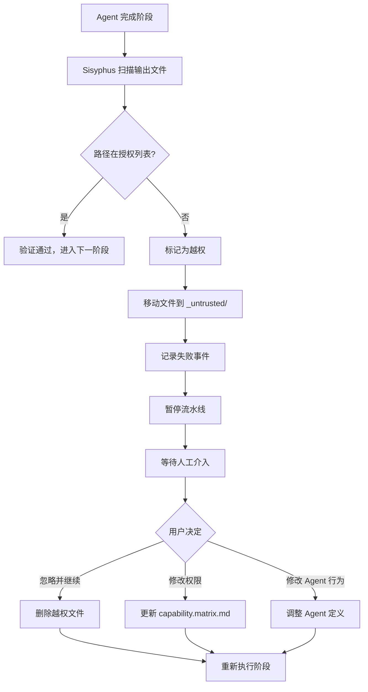

# 权限与安全机制：能力边界矩阵与越权防护

## 学完你能做什么

- 理解能力边界矩阵的设计原理和权限隔离机制
- 学会配置 Claude Code 的权限文件，避免使用 `--dangerously-skip-permissions`
- 掌握越权操作的处理流程和恢复方法
- 了解强制技能使用验证的机制
- 能够识别和修复权限相关的安全问题

## 你现在的困境

你可能遇到过这些情况：

- 不知道为什么 Agent 无法访问某些文件
- 执行 `factory run` 时总是被提示需要权限，直接用了 `--dangerously-skip-permissions` 跳过
- 不清楚 Agent 之间的权限边界，担心越权操作导致数据污染
- 越权发生后不知道如何处理和恢复

如果这些问题让你困扰，这章会帮你建立完整的权限和安全认知。

## 什么时候用这一招

当你需要：

- **配置 Claude Code**：为 Factory 项目设置正确的权限文件
- **调试权限问题**：排查 Agent 为什么无法读写特定文件
- **处理越权异常**：恢复越权操作导致的中断流水线
- **扩展 Agent**：添加新的 Agent 时定义其权限边界
- **安全审计**：检查现有项目的权限配置是否合理

## 核心思路

AI App Factory 的安全机制基于**能力边界矩阵**（Capability Boundary Matrix），确保每个 Agent 只能在授权的目录中操作。

**记住这个比喻**：

- Agent 就像是工厂里的**专业工人**
- 能力边界矩阵就像**工作许可证**，明确规定每个工人可以进入哪些车间、操作哪些设备
- Sisyphus 调度器就像**安全主管**，在工人进出车间时检查许可证，确保没有越权行为

**三层防护机制**：

| 层级 | 职责 | 检查时机 |
| --- | --- | --- |
| **Claude Code 权限** | 文件系统读写权限 | AI 助手启动时 |
| **能力边界矩阵** | Agent 目录访问权限 | 阶段执行前后 |
| **强制技能验证** | 特定阶段的技能使用要求 | bootstrap 和 ui 阶段 |

## 能力边界矩阵详解

### 为什么需要权限隔离？

想象一下没有权限限制会发生什么：

- **PRD Agent 修改了 UI 文件**：UI 设计被改乱，无法追溯
- **Tech Agent 读取了 Code 文件**：技术架构受代码实现影响，偏离 MVP 原则
- **Code Agent 修改了 PRD**：需求文档被代码逻辑"污染"，职责混乱

**答案**：职责边界不清，产物无法追溯，质量无法保证。

能力边界矩阵通过限制每个 Agent 的读写权限，确保职责分离。

### 权限矩阵表格

| Agent | 可读取目录 | 可写入目录 | 说明 |
| --- | --- | --- | --- |
| **bootstrap** | 无 | `input/` | 仅在 `input/` 目录创建或修改 `idea.md` |
| **prd** | `input/` | `artifacts/prd/` | 读取想法文件，生成 PRD；禁止写入其他目录 |
| **ui** | `artifacts/prd/` | `artifacts/ui/` | 读取 PRD，生成 UI Schema 与预览 |
| **tech** | `artifacts/prd/` | `artifacts/tech/`, `artifacts/backend/prisma/` | 读取 PRD，生成技术设计和数据模型 |
| **code** | `artifacts/ui/`, `artifacts/tech/`, `artifacts/backend/prisma/` | `artifacts/backend/`, `artifacts/client/` | 根据 UI 和技术设计生成后端和客户端代码；不得修改上游产物 |
| **validation** | `artifacts/backend/`, `artifacts/client/` | `artifacts/validation/` | 验证代码质量，生成验证报告；只读不修改代码 |
| **preview** | `artifacts/backend/`, `artifacts/client/` | `artifacts/preview/` | 读取已生成的服务与客户端，编写演示说明 |

::: tip 核心原则
- **单向依赖**：Agent 只能读取上游阶段的产物，不能读取下游或同级产物
- **职责独立**：每个 Agent 只能写入自己的产出目录
- **禁止越权**：未授权的读写操作会被视为安全违规
:::

### 权限检查流程

Sisyphus 调度器在每个阶段执行前后都会进行权限检查：

**执行前（告知权限）**：

```
1. Sisyphus 读取 capability.matrix.md
2. 将当前 Agent 的可读和可写目录传递给 AI 助手
3. AI 助手在执行时必须遵守这些限制
```

**执行后（验证输出）**：

```
1. Sisyphus 扫描新创建或修改的文件
2. 检查文件路径是否在 Agent 的授权目录范围内
3. 如果发现越权，立即处理（见越权处理机制）
```

::: info 自动化 vs 人工
权限检查主要由 AI 助手（Claude Code）的权限系统和 Sisyphus 的验证逻辑自动完成。只有在越权等异常情况下才需要人工介入。
:::

## 配置 Claude Code 权限

### 为什么不推荐 --dangerously-skip-permissions？

你可能见过这样的命令：

```bash
claude --dangerously-skip-permissions
```

**这个选项的问题**：

| 问题 | 说明 | 风险 |
| --- | --- | --- |
| **跳过所有检查** | Claude Code 不再验证任何文件操作 | AI 可能误删、误改系统文件 |
| **安全漏洞** | Agent 可以读写任意目录 | 越权操作无法被拦截 |
| **无法追溯** | 没有权限边界，问题难以定位 | 调试和维护困难 |

### Factory 自动生成权限配置

Factory CLI 在初始化项目时会自动生成 `.claude/settings.local.json`，配置精确的权限：

**生成时机**：`factory init` 命令执行时

**配置内容**（源码位置：`cli/utils/claude-settings.js:41-91`）：

```json
{
  "permissions": {
    "allow": [
      // ========== 文件操作权限 ==========
      "Read(/path/to/project/**)",
      "Write(/path/to/project/**)",
      "Glob(/path/to/project/**)",
      "Edit(/path/to/project/*,**)",
      
      // ========== Git 操作权限 ==========
      "Bash(git add:*)",
      "Bash(git commit:*)",
      "Bash(git push:*)",
      // ... 更多 git 命令
      
      // ========== 构建工具权限 ==========
      "Bash(npm install:*)",
      "Bash(npm run:*)",
      "Bash(npx:*)",
      
      // ========== TypeScript 权限 ==========
      "Bash(tsc:*)",
      "Bash(npx type-check:*)",
      
      // ========== 数据库 (Prisma) 权限 ==========
      "Bash(npx prisma validate:*)",
      "Bash(npx prisma generate:*)",
      "Bash(npx prisma migrate dev:*)",
      
      // ========== Factory CLI 权限 ==========
      "Bash(factory init:*)",
      "Bash(factory run:*)",
      "Bash(factory continue:*)",
      
      // ========== Docker 权限 ==========
      "Bash(docker compose:*)",
      "Bash(docker build:*)",
      
      // ========== 技能 (Plugins) 权限 ==========
      "Skill(superpowers:brainstorming)",
      "Skill(superpowers:writing-plans)",
      "Skill(ui-ux-pro-max)",
      "Skill(*)",
      
      // ========== Web 操作权限 ==========
      "WebFetch(domain:github.com)",
      "WebFetch(domain:npmjs.org)",
      
      // ========== 通用工具权限 ==========
      "Bash(curl:*)",
      "Bash(grep:*)",
      "Bash(find:*)"
    ]
  },
  "features": {
    "autoSave": true,
    "telemetry": false
  }
}
```

**权限配置的特点**：

| 特性 | 说明 | 示例 |
| --- | --- | --- |
| **项目级别限制** | 只允许读写当前项目目录 | `Read(/Users/xxx/my-app/**)` |
| **命令级精确控制** | 每种命令都有明确的权限模式 | `Bash(npm install:*)` 不允许 `npm install --global` |
| **跨平台支持** | 自动适配 Windows 和 Unix 路径 | Windows 使用 `//d/**`，Unix 使用 `/path/**` |
| **技能白名单** | 明确列出允许使用的技能 | `Skill(superpowers:brainstorming)` |

**检查配置是否生效**：

```bash
# 查看生成的权限配置
cat .claude/settings.local.json

# 验证文件存在
ls -la .claude/settings.local.json
```

::: warning 平台差异
Windows 和 Unix/macOS 的路径格式不同：
- Windows: `//C/**` 或 `//d/**`（盘符）
- Unix/macOS: `/Users/username/project/**`

Factory 会自动检测当前平台并生成正确的路径格式。
:::

## 越权处理机制

### 什么是越权操作？

**越权定义**：Agent 写入了未在其授权列表中的目录。

**典型场景**：

| Agent | 授权写入目录 | 越权写入目录 | 问题 |
| --- | --- | --- | --- |
| **prd** | `artifacts/prd/` | `artifacts/ui/` | PRD Agent 越界修改了 UI 文件 |
| **tech** | `artifacts/tech/` | `artifacts/prd/` | Tech Agent 修改了需求文档 |
| **code** | `artifacts/backend/` | `artifacts/prd/` | Code Agent 逆向修改了上游产物 |

### 越权处理流程

当 Sisyphus 检测到越权写入时：



### 越权产物隔离

越权文件会被移动到 `artifacts/_untrusted/<stage-id>/` 目录：

**示例**：PRD Agent 越权写入 `artifacts/ui/`

```
artifacts/
├── prd/
│   └── prd.md
├── ui/
│   └── ui.schema.yaml  ← 原本应该在这里，但被 PRD Agent 写入了
└── _untrusted/
    └── prd/
        └── ui/
            └── ui.schema.yaml  ← 越权文件被移动到这里
```

**错误提示**：

```
⚠️  Unauthorized writes detected for stage "prd":

Untrusted files:
  - artifacts/ui/ui.schema.yaml

Files moved to quarantine: artifacts/_untrusted/prd/artifacts/ui/ui.schema.yaml

Pipeline paused. Please review these files before proceeding.

Choose action:
  1. Delete untrusted files and retry
  2. Adjust permissions in capability.matrix.md
  3. Modify Agent behavior in .factory/agents/prd.agent.md
  4. Continue (accept untrusted files) - Not recommended
```

### 人工介入处理

**方案 1：删除越权文件，重新执行**（推荐）

```bash
# 查看越权文件
ls -la artifacts/_untrusted/prd/

# 删除越权文件
rm -rf artifacts/_untrusted/prd/

# 重新执行阶段
factory continue
```

**方案 2：调整权限矩阵**

如果越权是合理的（例如某个 Agent 确实需要写入额外的目录）：

```bash
# 编辑权限矩阵
nano .factory/policies/capability.matrix.md

# 修改 Agent 的可写入目录
# 例如：给 prd Agent 添加 `artifacts/ui/` 写入权限

# 重新执行
factory continue
```

**方案 3：修改 Agent 行为**

如果越权是 Agent 误操作：

```bash
# 编辑 Agent 定义
nano .factory/agents/prd.agent.md

# 明确禁止写入非授权目录
# 添加指令："禁止写入 artifacts/ui/ 或其他非授权目录"

# 重新执行
factory continue
```

::: danger 警告
选项 4（接受越权文件）是**极不推荐**的做法，因为：
- 违背了权限隔离的设计原则
- 会导致职责混乱，难以追溯
- 后续阶段可能因为错误的产物而失败
:::

## 强制技能使用验证

某些阶段要求使用特定的技能来保证输出质量。Sisyphus 会验证这些技能的使用情况。

### bootstrap 阶段验证

**强制要求**：必须使用 `superpowers:brainstorm` 技能

**为什么**？

- Brainstorming 技能提供结构化的思维框架
- 确保产品想法经过深入挖掘，而非肤浅描述
- 防止 Agent 跳过关键的分析步骤

**验证方法**：

1. 检查 Agent 输出消息中是否明确说明已使用该技能
2. 如果没有提及，拒绝接受产物
3. 提示重新执行，明确强调必须使用该技能

**失败提示**：

```
❌ 检测到未使用 superpowers:brainstorm 技能

Bootstrap Agent 必须使用 superpowers:brainstorm 技能深入挖掘用户想法。

请重新执行 bootstrap 阶段，并在输出中明确说明：
"我已使用 superpowers:brainstorm 技能分析用户想法..."
```

**正确示例**：

```
我已使用 superpowers:brainstorm 技能深入分析用户想法。

通过 brainstorming 技能，我识别了以下关键点：
- 核心问题：[问题描述]
- 目标用户：[用户画像]
- 价值主张：[价值点]
- 关键假设：[假设列表]

生成的想法文档：input/idea.md
```

### ui 阶段验证

**强制要求**：必须使用 `ui-ux-pro-max` 技能

**为什么**？

- UI/UX Pro Max 技能提供专业的设计系统框架
- 避免"AI 默认风格"（Inter 字体、紫色渐变等）
- 确保设计方案的一致性和可维护性

**验证方法**：

1. 检查 Agent 输出消息中是否明确说明已使用该技能
2. 检查 `ui.schema.yaml` 中的设计系统配置是否专业
3. 如果设计系统配置非专业推荐，拒绝接受产物

**失败提示**：

```
❌ 检测到未使用 ui-ux-pro-max 技能

UI Agent 必须使用 ui-ux-pro-max 技能生成专业的设计系统和 UI 原型。

请重新执行 ui 阶段，并在输出中明确说明：
"我已使用 ui-ux-pro-max 技能设计 UI 系统..."
```

**正确示例**：

```
我已使用 ui-ux-pro-max 技能设计 UI 系统和原型。

通过 ui-ux-pro-max 技能，我选择了：
- 设计方向：[具体风格，如：极简主义 / 赛博朋克]
- 色彩系统：[配色方案]
- 字体系统：[字体选择]
- 组件库：[组件规范]

生成的 UI 产物：
- artifacts/ui/ui.schema.yaml
- artifacts/ui/preview.web/index.html
```

### 连续失败处理

如果某个阶段连续两次因为技能验证失败：

1. 暂停流水线
2. 请求人工介入
3. 检查以下可能的问题：
   - AI 助手是否安装了对应的技能（Plugin）
   - Agent 定义中是否明确要求使用该技能
   - Skill 文件路径是否正确

## 实战演练：处理越权异常

假设 PRD Agent 越权写入了 UI 目录，我们来看看完整的处理流程。

### 步骤 1：识别越权

PRD 阶段完成后，Sisyphus 报告：

```
⚠️  Unauthorized writes detected for stage "prd":

Untrusted files:
  - artifacts/ui/ui.schema.yaml

Files moved to quarantine: artifacts/_untrusted/prd/artifacts/ui/ui.schema.yaml

Pipeline paused.
```

### 步骤 2：查看越权文件

```bash
# 查看越权文件内容
cat artifacts/_untrusted/prd/artifacts/ui/ui.schema.yaml

# 输出示例：
```
```yaml
# PRD Agent 生成的 UI Schema（越权产物）
pages:
  - name: Home
    components:
      - Hero
      - Features
```

### 步骤 3：分析原因

**可能原因**：

| 原因 | 说明 | 证据 |
| --- | --- | --- |
| **Agent 误操作** | PRD Agent 错误地生成了 UI 文件 | 文件内容确实包含 UI 结构 |
| **Prompt 不明确** | Agent 定义未禁止写入其他目录 | 需要检查 `.factory/agents/prd.agent.md` |
| **权限配置错误** | PRD Agent 的写入权限过大 | 需要检查 `capability.matrix.md` |

**检查 Agent 定义**：

```bash
cat .factory/agents/prd.agent.md
```

**检查权限矩阵**：

```bash
cat .factory/policies/capability.matrix.md | grep -A 1 "prd"
```

**输出**：

```
| **prd** | `input/` | `artifacts/prd/` | 读取想法文件，生成 PRD；禁止写入其他目录 |
```

权限矩阵是正确的，问题出在 Agent 行为上。

### 步骤 4：修复 Agent 定义

编辑 Agent 定义，添加明确的禁止指令：

```bash
nano .factory/agents/prd.agent.md
```

**添加内容**：

```markdown
## 禁止事项

- ❌ **禁止写入 `artifacts/ui/` 目录**：UI 设计由 UI Agent 负责
- ❌ **禁止写入 `artifacts/tech/` 目录**：技术架构由 Tech Agent 负责
- ❌ **禁止写入 `artifacts/backend/` 或 `artifacts/client/`**：代码生成由 Code Agent 负责
- ✅ **只能写入 `artifacts/prd/` 目录**：生成 PRD 文档
```

### 步骤 5：删除越权文件，重新执行

```bash
# 删除越权文件
rm -rf artifacts/_untrusted/prd/

# 重新执行 PRD 阶段
factory continue
```

### 步骤 6：验证修复

检查 PRD 阶段是否再次越权：

```bash
# 查看生成的产物
ls -la artifacts/prd/

# 确认没有写入其他目录
ls -la artifacts/_untrusted/prd/

# 输出应为空，表示没有新的越权
```

**成功标志**：

```
✓ prd 完成！

生成的产物：
- artifacts/prd/prd.md

...（检查点选项）

没有出现越权警告
```

## 安全最佳实践

### 1. 初始化时检查权限配置

```bash
# 执行 factory init 后立即检查
cat .claude/settings.local.json

# 验证以下内容：
# ✅ permissions.allow 数组存在
# ✅ 项目路径正确（Windows 为 //d/**，Unix 为 /path/**）
# ✅ 包含必要的命令权限（npm, git, factory, docker 等）
# ✅ 包含技能权限（superpowers, ui-ux-pro-max）
```

### 2. 定期审查权限矩阵

```bash
# 检查权限矩阵
cat .factory/policies/capability.matrix.md

# 确认：
# ✅ 每个 Agent 的读写权限合理
# ✅ 没有过度授权（例如 Code Agent 不应写入 PRD）
# ✅ 越权处理机制明确
```

### 3. 监控越权事件

```bash
# 查看是否有越权文件
ls -la artifacts/_untrusted/

# 如果存在越权文件，分析原因：
# - 是 Agent 误操作？
# - 是权限配置不合理？
# - 是需要调整 Agent 定义？
```

### 4. 使用版本控制保护配置文件

```bash
# 将关键配置文件纳入 Git
git add .claude/settings.local.json
git add .factory/policies/capability.matrix.md
git commit -m "chore: add security configuration files"
```

**原因**：

- 防止误删或误改配置
- 支持权限配置的版本追溯
- 团队协作时保持权限一致

::: warning settings.local.json 应该提交吗？
虽然名字包含 `local`，但 Factory 生成的 `.claude/settings.local.json` 是项目级别的权限配置，应该纳入版本控制。团队所有成员应该使用相同的权限配置。
:::

### 5. 定期更新权限配置

当以下情况发生时，需要更新权限配置：

| 触发条件 | 需要更新的配置 |
| --- | --- |
| 添加新的 Agent | 更新 `capability.matrix.md` |
| 引入新的构建工具 | 更新 `settings.local.json` 的 Bash 权限 |
| 添加新的技能（Plugin） | 更新 `settings.local.json` 的 Skill 权限 |
| 调整 Agent 职责 | 更新 `capability.matrix.md` |

**更新流程**：

```bash
# 1. 修改配置文件
nano .claude/settings.local.json
# 或
nano .factory/policies/capability.matrix.md

# 2. 提交修改
git add .claude/settings.local.json
git add .factory/policies/capability.matrix.md
git commit -m "security: update permissions for new Agent/Tool"

# 3. 重新初始化权限（可选）
# 如果修改了 capability.matrix.md，无需额外操作，Sisyphus 会自动读取
# 如果修改了 settings.local.json，可能需要重启 Claude Code
```

## 常见安全问题排查

### 问题 1：Agent 无法读取文件

**症状**：

```
❌ Error: Cannot read file: artifacts/prd/prd.md
```

**排查步骤**：

1. 检查文件是否存在
   ```bash
   ls -la artifacts/prd/prd.md
   ```

2. 检查 Agent 的读取权限
   ```bash
   cat .factory/policies/capability.matrix.md | grep -A 1 "prd"
   ```
   确认 Agent 的可读目录包含该文件所在目录。

3. 检查 Claude Code 权限配置
   ```bash
   cat .claude/settings.local.json | grep "Read"
   ```
   确认项目目录的 Read 权限存在。

### 问题 2：Agent 无法写入文件

**症状**：

```
❌ Error: Cannot write file: artifacts/prd/prd.md
```

**排查步骤**：

1. 检查 Agent 的写入权限
   ```bash
   cat .factory/policies/capability.matrix.md | grep -A 1 "prd"
   ```
   确认 Agent 的可写目录包含目标目录。

2. 检查 Claude Code 权限配置
   ```bash
   cat .claude/settings.local.json | grep "Write"
   ```
   确认项目目录的 Write 权限存在。

3. 检查目录是否存在
   ```bash
   ls -la artifacts/prd/
   ```
   如果目录不存在，Agent 会自动创建，但需要 Write 权限。

### 问题 3：越权警告频繁出现

**症状**：

同一 Agent 频繁出现越权警告。

**排查步骤**：

1. 分析越权模式
   ```bash
   ls -la artifacts/_untrusted/<stage-id>/
   ```
   查看 Agent 总是写入哪些目录。

2. 检查 Agent 定义
   ```bash
   cat .factory/agents/<stage>.agent.md
   ```
   确认是否有明确的禁止指令。

3. 考虑是否需要调整权限
   - 如果越权是合理的 → 更新 `capability.matrix.md`
   - 如果越权是误操作 → 修改 Agent 定义

### 问题 4：技能验证失败

**症状**：

```
❌ 检测到未使用 superpowers:brainstorm 技能
```

**排查步骤**：

1. 确认技能已安装
   - 检查 AI 助手是否安装了对应的 Plugin
   - Claude Code：检查 `settings.local.json` 的 Skill 权限
   - OpenCode：检查 Plugin 列表

2. 检查 Agent 定义
   ```bash
   cat .factory/agents/<stage>.agent.md
   ```
   确认 Agent 明确要求使用该技能。

3. 检查 Skill 文件路径
   ```bash
   ls -la .factory/skills/<stage>/skill.md
   ```
   确认 Skill 文件存在且路径正确。

## 本课小结

权限与安全机制是 AI App Factory 的核心防护体系，包括：

**三层防护**：

1. **Claude Code 权限**：文件系统读写权限，由 `settings.local.json` 配置
2. **能力边界矩阵**：Agent 目录访问权限，由 `capability.matrix.md` 定义
3. **强制技能验证**：特定阶段的技能使用要求，由 Sisyphus 验证

**核心原则**：

- 职责分离：每个 Agent 只能读写授权目录
- 单向依赖：Agent 只能读取上游产物，不能读取下游或同级产物
- 越权隔离：越权文件自动移至 `_untrusted/`，等待人工处理
- 技能保证：Bootstrap 和 UI 阶段必须使用指定技能

**实践要点**：

- 初始化时检查权限配置是否正确生成
- 定期审查能力边界矩阵，确保权限合理
- 监控越权事件，及时修复 Agent 行为
- 使用版本控制保护配置文件
- 遇到问题时，按照排查流程定位原因

**记住这个流程**：

```
factory init → 生成权限配置 → 执行流水线 → Sisyphus 检查权限
      ↓                                                      │
      └── 越权? → 移至 _untrusted/ → 人工介入 → 修复 → 继续 ──┘
```

## 下一课预告

> 下一课我们学习 **[失败处理与回滚](../failure-handling/)**。
>
> 你会学到：
> - 失败识别机制（输出缺失、内容不符、越权）
> - 自动重试策略和失败归档流程
> - 回滚机制和人工介入流程
> - 如何从失败中恢复流水线

## 附录：源码参考

<details>
<summary><strong>点击展开查看源码位置</strong></summary>

> 更新时间：2026-01-29

| 功能 | 文件路径 | 行号 |
| --- | --- | --- |
| 能力边界矩阵定义 | [`source/hyz1992/agent-app-factory/policies/capability.matrix.md`](https://github.com/hyz1992/agent-app-factory/blob/main/policies/capability.matrix.md) | 全文（1-23 行） |
| Claude Code 权限生成 | [`source/hyz1992/agent-app-factory/cli/utils/claude-settings.js`](https://github.com/hyz1992/agent-app-factory/blob/main/cli/utils/claude-settings.js) | 38-91 行 |
| 权限检查逻辑 | [`source/hyz1992/agent-app-factory/agents/orchestrator.checkpoint.md`](https://github.com/hyz1992/agent-app-factory/blob/main/agents/orchestrator.checkpoint.md) | 47-53 行 |
| 越权处理策略 | [`source/hyz1992/agent-app-factory/agents/orchestrator.checkpoint.md`](https://github.com/hyz1992/agent-app-factory/blob/main/agents/orchestrator.checkpoint.md) | 19-21 行 |
| Bootstrap 技能验证 | [`source/hyz1992/agent-app-factory/agents/orchestrator.checkpoint.md`](https://github.com/hyz1992/agent-app-factory/blob/main/agents/orchestrator.checkpoint.md) | 58-70 行 |
| UI 技能验证 | [`source/hyz1992/agent-app-factory/agents/orchestrator.checkpoint.md`](https://github.com/hyz1992/agent-app-factory/blob/main/agents/orchestrator.checkpoint.md) | 72-84 行 |

**关键函数**：

- `generatePermissions(projectDir)` - 生成 Claude Code 权限配置（第 41-91 行）
- `generateClaudeSettings(projectDir)` - 生成并写入 `settings.local.json`（第 256-275 行）
- `getPathPatterns()` - 获取平台特定的路径模式（第 14-36 行）

**关键常量**：

- 越权隔离目录：`artifacts/_untrusted/<stage-id>/`
- 技能名称：
  - Bootstrap: `superpowers:brainstorm`
  - UI: `ui-ux-pro-max`
- 平台路径格式：
  - Windows: `//{drive}/**`
  - Unix/macOS: `/path/to/project/**`

</details>
