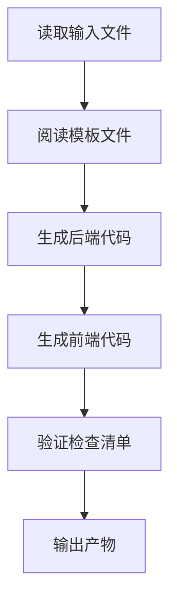

# 阶段 5：Code - 生成可运行代码

## 学完你能做什么

- **一键生成全栈代码**：从 UI Schema 和 Tech 设计自动生成可运行的前后端应用
- **理解代码生成流程**：掌握 Code Agent 如何将设计文档转化为生产就绪的代码
- **验证代码质量**：学会检查生成代码的完整性、测试覆盖和安全标准
- **调试常见问题**：解决依赖安装、类型检查和 API 连接问题

## 你现在的困境

你已经完成了产品想法的结构化、PRD 生成、UI 设计和技术架构设计，接下来最头疼的是：

- **如何把设计变成代码**：UI Schema 和 Tech 设计在文档里，但怎么实现？
- **全栈开发太复杂**：后端要 Express + Prisma，前端要 React Native，从哪开始？
- **代码质量难保证**：怎么确保生成的代码有测试、有文档、符合安全规范？
- **时间不够用**：写一个 MVP 要好几天，有没有更快的方法？

Code 阶段就是为了解决这些问题——它自动根据前序阶段的设计，生成生产就绪的全栈代码。

## 什么时候用这一招

当你需要：

- **快速验证想法**：用代码验证产品想法是否可行，而不是直接投入开发
- **创建应用骨架**：为后续开发提供可运行的基础，而不是从零开始
- **统一技术栈**：确保前后端代码遵循统一的架构和规范
- **节省开发时间**：从设计到代码，几分钟内完成 MVP 框架

## 核心思路

Code Agent 是一个**全栈工程师**，它的任务是将前序阶段的设计文档转化为可运行的代码。它的核心特点：

### 输入输出

| 类型 | 内容 |
|------|------|
| **输入** | UI Schema（界面结构）、Tech 设计（技术方案）、Prisma Schema（数据模型） |
| **输出** | `artifacts/backend/`（后端代码）、`artifacts/client/`（前端代码） |

### 技术栈

| 部分 | 技术栈 |
|------|--------|
| **后端** | Express + Prisma + TypeScript |
| **前端** | React Native Web + Expo + TypeScript |
| **数据库** | SQLite（开发）/ PostgreSQL（生产） |

### 执行约束

::: warning 严格范围
Code Agent **只实现** PRD 和 UI Schema 中确认的功能，**不添加**：
- 认证、授权系统
- 复杂的状态管理（如 Redux）
- 非核心的功能特性
:::

## 跟我做

### 第 1 步：进入 Code 阶段

假设你已经完成了 Tech 阶段，现在要开始生成代码。

```bash
# 如果在 pipeline 中，直接进入下一个阶段
factory run code

# 或者从某个阶段重新开始
factory run code
```

**你应该看到**：CLI 会显示 Code 阶段的信息，包括输入文件和预期输出。

### 第 2 步：AI 助手执行 Code Agent

AI 助手会加载 `agents/code.agent.md` 和 `skills/code/skill.md`，然后开始执行。

Code Agent 的执行流程：



**AI 助手会做什么**：

1. **阅读模板文件**（`skills/code/references/backend-template.md` 和 `frontend-template.md`）
   - 理解项目结构和代码组织方式
   - 学习如何组织目录和配置文件

2. **分析输入文件**
   - 从 `ui.schema.yaml` 理解页面结构和组件
   - 从 `tech.md` 理解技术架构和 API 设计
   - 从 `schema.prisma` 理解数据模型

3. **生成后端代码**
   - 创建 Express + Prisma 项目结构
   - 生成 API 路由和控制器
   - 实现数据验证和错误处理
   - 添加测试和文档

4. **生成前端代码**
   - 创建 React Native + Expo 项目结构
   - 生成页面组件和 UI 组件
   - 实现数据状态管理和 API 调用
   - 添加测试和导航配置

5. **验证检查清单**
   - 对照 Code Skill 中的检查清单
   - 确保所有必须项都已完成

6. **输出产物**
   - 生成 `artifacts/backend/` 和 `artifacts/client/` 目录

### 第 3 步：验证生成的代码

Code Agent 完成后，会生成完整的代码目录结构。

**后端目录结构**：

```
backend/
├── package.json          # 依赖和脚本
├── tsconfig.json         # TypeScript 配置
├── .env.example          # 环境变量模板
├── .gitignore            # Git 忽略文件
├── README.md             # 项目说明
├── GETTING_STARTED.md    # 快速启动指南
├── prisma/
│   ├── schema.prisma     # 数据模型（从 Tech 阶段复制）
│   └── seed.ts           # 种子数据
└── src/
    ├── index.ts          # 应用入口
    ├── app.ts            # Express 应用配置
    ├── config/           # 环境变量配置
    ├── lib/              # Prisma 客户端
    ├── middleware/       # 错误处理、日志
    ├── routes/           # API 路由
    ├── controllers/      # 控制器
    ├── services/         # 业务逻辑
    ├── validators/       # 输入验证（Zod）
    └── __tests__/        # 测试文件
```

**前端目录结构**：

```
client/
├── package.json          # 依赖和脚本
├── tsconfig.json         # TypeScript 配置
├── app.json              # Expo 配置
├── babel.config.js       # Babel 配置
├── .env.example          # 环境变量模板
├── .gitignore            # Git 忽略文件
├── README.md             # 项目说明
├── GETTING_STARTED.md    # 快速启动指南
├── App.tsx               # 应用入口
└── src/
    ├── config/           # 环境变量配置
    ├── api/              # API 客户端
    ├── components/       # UI 组件
    ├── hooks/            # 自定义 Hooks
    ├── navigation/       # 导航配置
    ├── screens/          # 页面组件
    ├── styles/           # 主题和样式
    └── types/            # 类型定义
```

**检查点 ✅**：确认以下文件是否存在：

| 文件 | 后端 | 前端 |
|------|------|------|
| `package.json` | ✅ | ✅ |
| `tsconfig.json` | ✅ | ✅ |
| `.env.example` | ✅ | ✅ |
| `README.md` | ✅ | ✅ |
| `GETTING_STARTED.md` | ✅ | ✅ |
| 测试文件 | ✅ | ✅ |
| Prisma Schema | ✅ | - |

### 第 4 步：启动后端服务

按照 `backend/GETTING_STARTED.md` 的指引启动服务。

```bash
# 进入后端目录
cd artifacts/backend

# 安装依赖
npm install

# 配置环境变量
cp .env.example .env

# 初始化数据库
npx prisma generate
npx prisma migrate dev
npm run db:seed

# 启动开发服务器
npm run dev
```

**你应该看到**：

```
Server running on http://localhost:3000
Environment: development
Database connected
```

**检查点 ✅**：访问健康检查端点确认服务正常。

```bash
curl http://localhost:3000/health
```

应该返回：

```json
{
  "status": "ok",
  "timestamp": "2024-01-29T12:00:00.000Z"
}
```

### 第 5 步：启动前端应用

按照 `client/GETTING_STARTED.md` 的指引启动应用。

```bash
# 新开一个终端，进入前端目录
cd artifacts/client

# 安装依赖
npm install

# 配置环境变量
cp .env.example .env

# 启动开发服务器
npm start
```

**你应该看到**：Metro Bundler 启动，显示运行选项。

```
› Metro waiting on exp://192.168.x.x:19000
› Scan the QR code above with Expo Go (Android) or the Camera app (iOS)
› Press a │ open Android
› Press i │ open iOS simulator
› Press w │ open web

Logs for your project will appear below.
```

选择运行平台：
- 按 `w` - 在浏览器中打开（最方便测试）

**检查点 ✅**：应用能在浏览器中打开，并显示前端界面。

### 第 6 步：测试前后端集成

1. **访问 API 文档**：http://localhost:3000/api-docs
   - 查看 Swagger UI 文档
   - 确认所有端点都有定义

2. **测试前端功能**：
   - 创建新数据
   - 编辑数据
   - 删除数据
   - 列表刷新

3. **检查控制台日志**：
   - 前端是否有 API 调用错误
   - 后端是否有请求日志
   - 是否有未处理的异常

### 第 7 步：确认检查点

在 AI 助手确认 Code 阶段完成时，你会看到：

```
✅ Code 阶段完成

生成的文件：
- 后端：artifacts/backend/（Express + Prisma + TypeScript）
- 前端：artifacts/client/（React Native + Expo + TypeScript）

检查点选项：
[1] 继续 - 进入 Validation 阶段
[2] 重试 - 重新生成代码
[3] 暂停 - 保存当前状态
```

选择 **继续** 进入下一阶段。

## 检查点 ✅

完成 Code 阶段后，你应该：

- [ ] 后端代码能正常启动（`npm run dev`）
- [ ] 前端应用能在浏览器中打开
- [ ] 健康检查端点返回正常
- [ ] API 文档可访问（`/api-docs`）
- [ ] 前端能调用后端 API
- [ ] 前端处理了 Loading 和 Error 状态
- [ ] 测试文件存在且可运行（`npm test`）

## 踩坑提醒

### 问题 1：依赖安装失败

**症状**：`npm install` 报错

**解决方案**：

```bash
# 清除缓存重试
rm -rf node_modules package-lock.json
npm cache clean --force
npm install
```

### 问题 2：Prisma 迁移失败

**症状**：`npx prisma migrate dev` 报错

**解决方案**：

```bash
# 重置数据库
npx prisma migrate reset

# 或手动删除数据库文件
rm prisma/dev.db
npx prisma migrate dev
```

### 问题 3：前端无法连接后端

**症状**：前端报错 `Network Error` 或 `ECONNREFUSED`

**检查清单**：

1. 确认后端已启动：`curl http://localhost:3000/health`
2. 检查前端的 `.env` 配置：`EXPO_PUBLIC_API_URL=http://localhost:3000/api`
3. 如果使用真机测试，改为局域网 IP（如 `http://192.168.1.100:3000/api`）

### 问题 4：测试失败

**症状**：`npm test` 报错

**解决方案**：

- 确认测试文件存在：`src/__tests__/`
- 检查测试依赖是否安装：`npm install --save-dev vitest @testing-library/react-native`
- 查看错误信息，修复代码中的问题

## Code Agent 特殊要求

Code Agent 有一些特殊的约束和要求，需要特别注意：

### 1. 必须阅读模板文件

在生成代码前，Code Agent **必须完整阅读**：
- `skills/code/references/backend-template.md`
- `skills/code/references/frontend-template.md`

这两个模板文件展示了生产就绪的项目结构和示例代码。

### 2. 禁止添加认证和授权

::: warning 范围限制
Code Agent **绝对禁止**添加：
- 登录/注册功能
- Token 认证
- 权限控制
- 复杂的状态管理（如 Redux）
:::

这些功能会在后续迭代中添加，MVP 阶段只关注核心业务逻辑。

### 3. 代码质量要求

生成的代码必须满足：

| 要求 | 说明 |
|------|------|
| **TypeScript** | 严格模式，无 `any` 类型 |
| **测试** | 健康检查、CRUD 端点、输入验证测试 |
| **API 文档** | Swagger/OpenAPI 规范（`/api-docs`） |
| **错误处理** | 统一错误处理中间件 |
| **日志** | 结构化日志（winston/pino） |
| **安全** | Zod 验证、helmet、CORS 白名单 |
| **文档** | README 和快速启动指南 |

## 代码生成检查清单

Code Agent 会对照以下检查清单生成代码。

### 后端必须项

- [ ] 环境变量支持（dotenv）
- [ ] 依赖版本锁定（Prisma 5.x）
- [ ] 类型定义（JSON 字段处理）
- [ ] 核心依赖：Express + Prisma + Zod + Helmet
- [ ] API 端点：健康检查 + CRUD
- [ ] 统一响应格式
- [ ] 输入验证（Zod Schema）
- [ ] 错误处理中间件
- [ ] 测试文件（健康检查 + CRUD + 验证）
- [ ] Swagger API 文档
- [ ] 种子数据（`prisma/seed.ts`）

### 前端必须项

- [ ] 核心依赖：React Native Web + Expo + React Navigation
- [ ] 持久化存储（AsyncStorage）
- [ ] 导航配置（React Navigation 6+）
- [ ] 安全区域（SafeAreaView）
- [ ] API Client（Axios + 拦截器）
- [ ] 自定义 Hooks（数据管理）
- [ ] 基础 UI 组件（Button, Input, Card, Loading）
- [ ] 页面组件（至少主页和详情页）
- [ ] Loading 和 Error 状态处理
- [ ] 下拉刷新（RefreshControl）
- [ ] 测试文件（页面渲染 + 组件 + Hooks）

## 测试和质量保证

即使是在 MVP 阶段，Code Agent 也会生成基础的测试代码。

### 后端测试示例

```typescript
// src/__tests__/items.test.ts
import { describe, it, expect } from 'vitest';
import request from 'supertest';
import app from '../app';

describe('Items API', () => {
  it('should return health check', async () => {
    const res = await request(app).get('/health');
    expect(res.status).toBe(200);
  });

  it('should create a new item', async () => {
    const res = await request(app)
      .post('/api/items')
      .send({ title: 'Test Item', amount: 100 });

    expect(res.status).toBe(201);
    expect(res.body.data).toHaveProperty('id');
  });

  it('should reject invalid item', async () => {
    const res = await request(app)
      .post('/api/items')
      .send({ title: '' }); // 缺少必填字段

    expect(res.status).toBe(400);
  });
});
```

### 前端测试示例

```typescript
// src/screens/__tests__/HomeScreen.test.tsx
import React from 'react';
import { render, screen } from '@testing-library/react-native';
import HomeScreen from '../HomeScreen';

describe('HomeScreen', () => {
  it('should render without crashing', () => {
    render(<HomeScreen />);
    expect(screen.getByText(/home/i)).toBeTruthy();
  });

  it('should show loading state initially', () => {
    render(<HomeScreen />);
    expect(screen.getByTestId('loading-indicator')).toBeTruthy();
  });
});
```

## 快速启动指南

每个生成的项目都会包含 `GETTING_STARTED.md`，帮助你在 5 分钟内运行项目。

### 后端快速启动

```bash
# 1. 克隆项目
cd artifacts/backend

# 2. 安装依赖
npm install

# 3. 配置环境变量
cp .env.example .env

# 4. 初始化数据库
npx prisma generate
npx prisma migrate dev
npm run db:seed

# 5. 启动服务
npm run dev
```

### 前端快速启动

```bash
# 1. 克隆项目
cd artifacts/client

# 2. 安装依赖
npm install

# 3. 配置环境变量
cp .env.example .env

# 4. 启动应用
npm start
```

**注意**：确保后端已启动，否则前端无法连接 API。

## 本课小结

Code 阶段是流水线的核心环节之一，它将前序阶段的设计转化为可运行的代码。

**关键要点**：

1. **输入输出**：Code Agent 根据 UI Schema、Tech 设计和 Prisma Schema 生成前后端代码
2. **技术栈**：后端使用 Express + Prisma，前端使用 React Native Web + Expo
3. **范围控制**：只实现 PRD 和 UI Schema 中的功能，不添加认证和授权
4. **质量保证**：生成测试、API 文档和快速启动指南
5. **验证标准**：后端可启动、前端可渲染、API 可调用

## 下一课预告

> 下一课我们学习 **[Validation 阶段](../stage-validation/)**。
>
> 你会学到：
> - 如何验证生成的代码质量
> - 依赖安装和类型检查
> - Prisma Schema 验证
> - 生成验证报告

---

## 附录：源码参考

<details>
<summary><strong>点击展开查看源码位置</strong></summary>

> 更新时间：2026-01-29

| 功能 | 文件路径 | 行号 |
|------|----------|------|
| Code Agent 定义 | [`agents/code.agent.md`](https://github.com/hyz1992/agent-app-factory/blob/main/agents/code.agent.md) | 1-82 |
| Code Skill | [`skills/code/skill.md`](https://github.com/hyz1992/agent-app-factory/blob/main/skills/code/skill.md) | 1-1488 |
| 后端模板 | [`skills/code/references/backend-template.md`](https://github.com/hyz1992/agent-app-factory/blob/main/skills/code/references/backend-template.md) | 1-670 |
| 前端模板 | [`skills/code/references/frontend-template.md`](https://github.com/hyz1992/agent-app-factory/blob/main/skills/code/references/frontend-template.md) | 1-1231 |
| 流水线定义 | [`pipeline.yaml`](https://github.com/hyz1992/agent-app-factory/blob/main/pipeline.yaml) | 63-77 |

**关键约束**：
- 只实现 PRD 和 UI Schema 中的功能（`code.agent.md:25`）
- 禁止添加认证、授权或复杂状态管理（`code.agent.md:28`）
- 必须完整阅读模板文件（`code/skill.md:1476`）
- 所有数据库操作通过 Service 层（`backend-template.md:665`）
- 所有输入必须通过 Zod 验证（`backend-template.md:666`）

**关键检查清单**：
- 后端必须项：环境变量、依赖锁定、类型定义（`code.agent.md:37-47`）
- 前端必须项：核心依赖、导入路径、配置文件（`code.agent.md:50-64`）
- 常见错误预防（`code.agent.md:65-74`）

</details>
