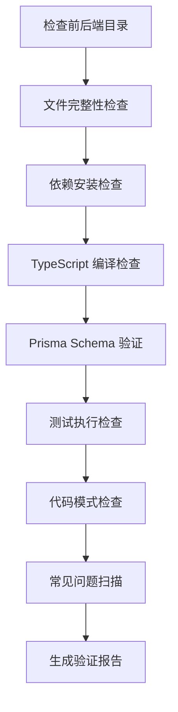

# 阶段 6：Validation - 验证代码质量

## 学完你能做什么

- **自动化代码验证**：一键检查前后端代码的依赖安装、类型检查和基础测试
- **解读验证报告**：理解 Validation Agent 生成的详细报告和问题分类
- **快速定位问题**：根据报告中的具体位置和建议修复代码错误
- **确保代码质量**：验证生成的代码符合生产就绪标准

## 你现在的困境

你已经完成了 Code 阶段，生成了前后端代码，但最头疼的是：

- **代码能不能跑**：依赖都装对了吗？类型检查能过吗？
- **Prisma 对不对**：schema 语法有问题吗？能生成客户端吗？
- **测试靠谱吗**：有测试吗？能通过吗？
- **有没有坑**：环境变量配置对吗？导入路径正确吗？

人工逐一检查这些问题要花好长时间，而且容易遗漏。Validation 阶段就是为了解决这些问题——它自动验证代码质量，生成详细报告。

## 什么时候用这一招

当你需要：

- **快速验证代码**：确认生成的代码符合基本质量标准
- **发现潜在问题**：在部署前找出依赖、类型、测试等问题
- **代码质量保证**：确保前后端代码都能通过基本检查
- **避免部署失败**：提前发现问题，减少返工成本

## 核心思路

Validation Agent 是一个**质量检查员**，它的任务是验证 Code Agent 生成的代码是否符合质量标准。它的核心特点：

### 输入输出

| 类型 | 内容 |
|------|------|
| **输入** | `artifacts/backend/`（后端代码）、`artifacts/client/`（前端代码） |
| **输出** | `artifacts/validation/report.md`（验证报告） |

### 验证检查项

Validation Agent 会执行 8 大类检查：

| 检查项 | 说明 |
|--------|------|
| **文件完整性** | 确认所有必须文件都存在 |
| **依赖安装** | 验证 `package.json` 依赖可正常解析 |
| **TypeScript 编译** | 检查代码是否通过类型检查 |
| **Prisma Schema** | 验证数据模型语法是否正确 |
| **测试执行** | 确认测试存在且能通过 |
| **代码规范** | 检查 lint 脚本配置 |
| **关键模式** | 扫描代码中的关键模式（错误处理、健康检查等） |
| **常见问题** | 识别已知的错误模式 |

### 执行约束

::: warning 只读模式
Validation Agent **只验证不修改**：
- 禁止修改任何代码文件
- 禁止实际安装依赖（使用 `--dry-run`）
- 禁止执行有副作用的命令
:::

## 跟我做

### 第 1 步：进入 Validation 阶段

假设你已经完成了 Code 阶段，现在要开始验证代码质量。

```bash
# 如果在 pipeline 中，直接进入下一个阶段
factory run validation

# 或者从某个阶段重新开始
factory run validation
```

**你应该看到**：CLI 会显示 Validation 阶段的信息，包括输入文件和预期输出。

### 第 2 步：AI 助手执行 Validation Agent

AI 助手会加载 `agents/validation.agent.md`，然后开始执行。

Validation Agent 的执行流程：



**AI 助手会做什么**：

1. **检查后端目录**
   - 确认 `artifacts/backend/` 存在
   - 检查必须文件：`package.json`、`tsconfig.json`、`.env.example`、`prisma/schema.prisma`

2. **检查前端目录**
   - 确认 `artifacts/client/` 存在
   - 检查必须文件：`package.json`、`tsconfig.json`、`app.json`、`App.tsx`

3. **依赖安装检查**
   - 后端：`cd artifacts/backend && npm install --dry-run`
   - 前端：`cd artifacts/client && npm install --dry-run`
   - 验证依赖是否可以正常解析

4. **TypeScript 编译检查**
   - 后端：`cd artifacts/backend && npx tsc --noEmit`
   - 前端：`cd artifacts/client && npx tsc --noEmit`
   - 检查代码是否通过类型检查

5. **Prisma Schema 验证**
   - `cd artifacts/backend && npx prisma validate`
   - 验证数据模型语法是否正确

6. **测试执行检查**
   - 后端：`cd artifacts/backend && npm test`
   - 前端：`cd artifacts/client && npm test`
   - 确认测试存在且能通过

7. **代码模式检查**
   - 扫描关键模式：错误处理、健康检查、SafeAreaView 等
   - 检查依赖配置：dotenv、React Native Web 等

8. **常见问题扫描**
   - SQLite 使用 `type` 定义
   - 环境变量值有引号
   - 错误的导入路径
   - 缺少必要的导入

9. **生成验证报告**
   - 汇总所有检查结果
   - 列出发现的问题
   - 提供修复建议
   - 保存到 `artifacts/validation/report.md`

### 第 3 步：查看验证报告

Validation Agent 完成后，会生成详细的验证报告。

打开 `artifacts/validation/report.md`：

```bash
cat artifacts/validation/report.md
```

**你应该看到**：

```markdown
# 代码验证报告

**生成时间**: 2026-01-29 12:00:00
**验证结果**: ✅ 通过

## 摘要

- 后端验证: ✅
- 前端验证: ✅
- 总体评估: 代码质量符合 MVP 标准，可以进入 Preview 阶段

---

## 后端验证详情

### 文件完整性
| 文件 | 状态 |
|------|------|
| package.json | ✅ |
| tsconfig.json | ✅ |
| .env.example | ✅ |
| prisma/schema.prisma | ✅ |
| src/index.ts | ✅ |
| src/app.ts | ✅ |

### 依赖安装
- 状态: ✅
- 详情: 所有依赖可正常解析

### TypeScript 编译
- 状态: ✅
- 错误数量: 0

### Prisma 验证
- 状态: ✅
- 详情: Prisma schema 语法正确

### 测试执行
- 状态: ✅
- 测试数量: 12
- 通过数量: 12
- 失败数量: 0

### 代码模式检查
| 检查项 | 状态 |
|--------|------|
| 错误处理中间件 | ✅ |
| 健康检查端点 | ✅ |
| 环境变量使用 | ✅ |
| Prisma Client 导入 | ✅ |
| 测试文件存在 | ✅ |
| dotenv 首行导入 | ✅ |

---

## 前端验证详情

### 文件完整性
| 文件 | 状态 |
|------|------|
| package.json | ✅ |
| tsconfig.json | ✅ |
| app.json | ✅ |
| App.tsx | ✅ |
| src/navigation/index.tsx | ✅ |

### 依赖安装
- 状态: ✅
- 详情: 所有依赖可正常解析

### TypeScript 编译
- 状态: ✅
- 错误数量: 0

### 测试执行
- 状态: ✅
- 测试数量: 8
- 通过数量: 8
- 失败数量: 0

### 代码模式检查
| 检查项 | 状态 |
|--------|------|
| SafeAreaView 使用 | ✅ |
| Loading 组件 | ✅ |
| Error 处理 | ✅ |
| API 调用封装 | ✅ |
| React Native Web 依赖 | ✅ |
| async-storage 依赖 | ✅ |

---

## 发现的问题

无严重问题或警告

---

## 修复建议

无需修复

---

## 结论

代码质量符合 MVP 标准，建议进入 Preview 阶段。
```

### 第 4 步：处理验证失败的情况

如果验证失败，报告中会列出具体问题和修复建议。

**示例：部分通过的验证报告**

```markdown
**验证结果**: ⚠️ 部分通过

## 发现的问题

### 严重问题 (必须修复)

1. TypeScript 编译错误
   - 位置: src/controllers/items.ts:15
   - 错误: Property 'title' does not exist on type 'any'
   - 建议: 添加类型定义 `const item: Item = req.body;`

2. Prisma schema 验证失败
   - 位置: prisma/schema.prisma:10
   - 错误: Invalid datasource provider 'sqlite'
   - 建议: 将 `provider = "sqlite"` 改为 `provider = "postgresql"`（生产环境）

### 警告 (建议修复)

1. 缺少测试文件
   - 位置: src/controllers/
   - 建议: 为每个控制器添加测试文件

2. 环境变量配置不完整
   - 位置: .env.example
   - 建议: 添加 `DATABASE_URL` 示例

## 修复建议

1. 修复 TypeScript 错误：在 `src/controllers/items.ts` 中添加类型定义
2. 更新 Prisma schema：修改数据源 provider
3. 添加测试文件：为控制器编写测试
4. 完善环境变量：补充 `.env.example`
```

**修复步骤**：

1. **定位问题文件**
   ```bash
   # 打开问题文件
   vim artifacts/backend/src/controllers/items.ts
   ```

2. **修复代码**
   ```typescript
   // 添加类型定义
   const item: Item = req.body;
   ```

3. **更新 Prisma schema**
   ```prisma
   datasource db {
     provider = "postgresql"  // 修改为 postgresql
     url      = env("DATABASE_URL")
   }
   ```

4. **重新验证**
   ```bash
   # 重新运行 Validation 阶段
   factory run validation
   ```

### 第 5 步：确认检查点

在 AI 助手确认 Validation 阶段完成时，你会看到：

```
✅ Validation 阶段完成

生成的文件：
- 验证报告：artifacts/validation/report.md

验证结果：✅ 通过 / ⚠️ 部分通过 / ❌ 失败

检查点选项：
[1] 继续 - 进入 Preview 阶段
[2] 重试 - 重新验证代码
[3] 暂停 - 保存当前状态
```

- 如果验证通过，选择 **继续** 进入下一阶段
- 如果有问题，修复后选择 **重试** 重新验证
- 如果需要时间修复，选择 **暂停** 保存当前状态

## 检查点 ✅

完成 Validation 阶段后，你应该：

- [ ] 后端和前端的所有必须文件都存在
- [ ] 依赖可以正常解析（`npm install --dry-run`）
- [ ] TypeScript 编译无错误（`npx tsc --noEmit`）
- [ ] Prisma schema 验证通过（`npx prisma validate`）
- [ ] 测试文件存在且能通过（`npm test`）
- [ ] 关键模式检查全部通过
- [ ] 验证报告已生成（`artifacts/validation/report.md`）

## 踩坑提醒

### 问题 1：依赖安装失败

**症状**：`npm install --dry-run` 报错

**解决方案**：

```bash
# 检查 package.json 语法
cat artifacts/backend/package.json

# 常见问题：
# - 缺少引号
# - 依赖名称错误
# - 版本格式不对

# 修复后重新验证
factory run validation
```

### 问题 2：TypeScript 编译错误

**症状**：`npx tsc --noEmit` 报错

**常见错误类型**：

| 错误 | 原因 | 解决方案 |
|------|------|----------|
| `Property does not exist` | 类型未定义 | 添加类型定义 |
| `Module not found` | 导入路径错误 | 检查导入路径 |
| `Implicit any` | 隐式 any 类型 | 启用严格模式并添加类型 |

### 问题 3：Prisma schema 验证失败

**症状**：`npx prisma validate` 报错

**常见错误**：

| 错误 | 原因 | 解决方案 |
|------|------|----------|
| `Invalid datasource provider` | provider 错误 | 使用 `postgresql` 或 `sqlite` |
| `Error parsing` | 语法错误 | 检查 model 定义 |
| `Relation error` | 关系定义错误 | 检查 `@relation` 字段 |

### 问题 4：测试失败

**症状**：`npm test` 报错

**解决方案**：

```bash
# 检查测试文件是否存在
find artifacts/backend -name "*.test.ts"

# 检查测试依赖是否安装
cat artifacts/backend/package.json | grep -A 5 "devDependencies"

# 如果缺少测试依赖，手动安装
cd artifacts/backend
npm install --save-dev vitest @testing-library/react-native
```

### 问题 5：关键模式检查失败

**症状**：报告显示关键模式缺失

**常见缺失模式**：

| 模式 | 位置 | 修复方法 |
|------|------|----------|
| 错误处理中间件 | `src/middleware/error.ts` | 添加错误处理中间件 |
| 健康检查端点 | `src/routes/health.ts` | 添加 `/health` 路由 |
| dotenv 首行导入 | `src/index.ts:1` | 添加 `import 'dotenv/config';` |
| SafeAreaView | `src/screens/Home.tsx` | 用 SafeAreaView 包裹内容 |

## Validation Agent 特殊要求

Validation Agent 有一些特殊的约束和要求，需要特别注意：

### 1. 只读模式

::: warning 禁止修改代码
Validation Agent **绝对禁止**修改任何代码文件，只执行验证和报告生成。
:::

### 2. Dry-run 安装

依赖安装检查使用 `--dry-run` 参数，不会实际安装依赖：

```bash
npm install --dry-run  # 只检查依赖是否可解析
```

### 3. 完整的报告

Validation Agent **必须**生成完整的验证报告，包括：

| 部分 | 内容 |
|------|------|
| **摘要** | 后端/前端验证状态和总体评估 |
| **后端详情** | 文件完整性、依赖、编译、Prisma、测试、模式检查 |
| **前端详情** | 文件完整性、依赖、编译、测试、模式检查 |
| **发现的问题** | 严重问题和警告列表 |
| **修复建议** | 针对问题的具体修复步骤 |
| **结论** | 总体评估和下一步建议 |

### 4. 问题分级

Validation Agent 会将问题分为三级：

| 级别 | 标准 | 处理方式 |
|------|------|----------|
| **严重问题** | 必须修复才能通过 | 在报告中标记为"必须修复" |
| **警告** | 建议修复但非致命 | 在报告中标记为"建议修复" |
| **信息** | 仅供参考 | 不影响验证结果 |

## 验证结果判定

Validation Agent 会根据检查结果判定验证状态。

### 通过条件 (✅ 通过)

- 所有必须文件存在
- 依赖安装无错误
- TypeScript 编译无错误
- Prisma schema 验证通过
- 基础测试存在且全部通过
- 关键模式检查全部通过

### 部分通过条件 (⚠️ 部分通过)

- 必须文件存在
- 依赖安装无错误
- TypeScript 编译有警告但无错误
- 测试存在但部分失败（< 30% 失败率）
- 存在非关键问题

### 失败条件 (❌ 失败)

- 必须文件缺失
- 依赖安装失败
- TypeScript 编译有错误
- Prisma schema 验证失败
- 测试缺失或大量失败（≥ 30% 失败率）

## 代码质量检查清单

Validation Agent 会对照以下检查清单进行验证。

### 后端必须项

- [ ] `package.json` 存在
- [ ] `tsconfig.json` 存在
- [ ] `.env.example` 存在
- [ ] `prisma/schema.prisma` 存在
- [ ] `src/index.ts` 存在
- [ ] `src/app.ts` 存在
- [ ] `src/index.ts` 首行导入 dotenv
- [ ] dotenv 在 dependencies 中
- [ ] 存在错误处理中间件
- [ ] 存在健康检查端点 (`/health`)
- [ ] 环境变量使用 `process.env`
- [ ] Prisma Client 导入正确
- [ ] 存在至少一个测试文件
- [ ] package.json 包含 `test` 脚本

### 前端必须项

- [ ] `package.json` 存在
- [ ] `tsconfig.json` 存在
- [ ] `app.json` 存在
- [ ] `App.tsx` 存在
- [ ] `src/navigation/index.tsx` 存在
- [ ] 存在 SafeAreaView 使用
- [ ] 存在 Loading 组件
- [ ] 存在 Error 处理
- [ ] API 调用通过封装层
- [ ] 包含 React Native Web 依赖
- [ ] 包含 async-storage 依赖
- [ ] `app.json` 不引用不存在的图片文件

## 常见问题扫描

Validation Agent 会扫描以下已知问题模式：

| 检查项 | 检测方法 | 修复建议 |
|--------|----------|----------|
| SQLite 使用 `type` 定义 | 检查 schema.prisma 是否包含 `type Xxx` | 移除 `type` 定义 |
| 环境变量值有引号 | 检查 .env 是否包含 `="xxx"` 或 `='xxx'` | 移除引号 |
| Prisma 版本是 7.x | 检查 package.json 中 prisma 版本是否 ^7 | 改用 Prisma 5.x |
| 错误的导入路径 | 检查 screens 中是否有 `from './ui/'` | 改为 `from '../components/ui/'` |
| 缺少 View 导入 | 检查组件是否使用 View 但未导入 | 添加 `import { View } from 'react-native'` |
| 字符串未终止 | 检查 .tsx 文件是否有连续的引号 | 添加缺失的引号 |

## 验证报告示例

### 通过的验证报告

```markdown
# 代码验证报告

**生成时间**: 2026-01-29 12:00:00
**验证结果**: ✅ 通过

## 摘要

- 后端验证: ✅
- 前端验证: ✅
- 总体评估: 代码质量符合 MVP 标准，可以进入 Preview 阶段

---

## 后端验证详情

### 文件完整性
| 文件 | 状态 |
|------|------|
| package.json | ✅ |
| tsconfig.json | ✅ |
| .env.example | ✅ |
| prisma/schema.prisma | ✅ |
| src/index.ts | ✅ |
| src/app.ts | ✅ |

### 依赖安装
- 状态: ✅
- 详情: 所有依赖可正常解析

### TypeScript 编译
- 状态: ✅
- 错误数量: 0

### Prisma 验证
- 状态: ✅
- 详情: Prisma schema 语法正确

### 测试执行
- 状态: ✅
- 测试数量: 12
- 通过数量: 12
- 失败数量: 0

### 代码模式检查
| 检查项 | 状态 |
|--------|------|
| 错误处理中间件 | ✅ |
| 健康检查端点 | ✅ |
| 环境变量使用 | ✅ |
| Prisma Client 导入 | ✅ |
| 测试文件存在 | ✅ |
| dotenv 首行导入 | ✅ |

---

## 前端验证详情

### 文件完整性
| 文件 | 状态 |
|------|------|
| package.json | ✅ |
| tsconfig.json | ✅ |
| app.json | ✅ |
| App.tsx | ✅ |
| src/navigation/index.tsx | ✅ |

### 依赖安装
- 状态: ✅
- 详情: 所有依赖可正常解析

### TypeScript 编译
- 状态: ✅
- 错误数量: 0

### 测试执行
- 状态: ✅
- 测试数量: 8
- 通过数量: 8
- 失败数量: 0

### 代码模式检查
| 检查项 | 状态 |
|--------|------|
| SafeAreaView 使用 | ✅ |
| Loading 组件 | ✅ |
| Error 处理 | ✅ |
| API 调用封装 | ✅ |
| React Native Web 依赖 | ✅ |
| async-storage 依赖 | ✅ |

---

## 发现的问题

无严重问题或警告

---

## 修复建议

无需修复

---

## 结论

代码质量符合 MVP 标准，建议进入 Preview 阶段。
```

### 失败的验证报告

```markdown
# 代码验证报告

**生成时间**: 2026-01-29 12:00:00
**验证结果**: ❌ 失败

## 摘要

- 后端验证: ❌
- 前端验证: ⚠️
- 总体评估: 后端存在严重问题，必须修复后才能继续

---

## 发现的问题

### 严重问题 (必须修复)

1. TypeScript 编译错误
   - 位置: src/controllers/items.ts:15
   - 错误: Property 'title' does not exist on type 'any'
   - 建议: 添加类型定义 `const item: Item = req.body;`

2. Prisma schema 验证失败
   - 位置: prisma/schema.prisma:10
   - 错误: Invalid datasource provider 'sqlite'
   - 建议: 将 `provider = "sqlite"` 改为 `provider = "postgresql"`

3. 缺少必须文件
   - 位置: src/
   - 文件: src/middleware/error.ts
   - 建议: 创建错误处理中间件

### 警告 (建议修复)

1. 前端测试失败
   - 位置: src/screens/__tests__/HomeScreen.test.tsx
   - 失败: 2/8 测试失败
   - 建议: 修复测试用例

2. 缺少 Loading 组件
   - 位置: src/components/
   - 建议: 创建 Loading 组件并正确使用

---

## 修复建议

1. 修复 TypeScript 错误：在 `src/controllers/items.ts` 中添加类型定义
2. 更新 Prisma schema：修改数据源 provider 为 postgresql
3. 创建错误处理中间件：添加 `src/middleware/error.ts`
4. 修复前端测试：检查并修复失败的测试用例
5. 创建 Loading 组件：添加 `src/components/Loading.tsx`

---

## 结论

后端存在严重问题，必须修复后才能继续。建议：
1. 修复 TypeScript 编译错误
2. 更新 Prisma schema
3. 添加缺失的文件
4. 重新运行 Validation 阶段
```

## 本课小结

Validation 阶段是流水线的质量保证环节，它确保生成的代码符合基本的质量标准。

**关键要点**：

1. **验证流程**：Validation Agent 自动检查文件完整性、依赖、编译、测试等
2. **只读模式**：只验证不修改，使用 `--dry-run` 避免副作用
3. **问题分级**：将问题分为严重、警告、信息三级
4. **详细报告**：生成包含具体位置和修复建议的验证报告
5. **结果判定**：根据检查结果判定通过/部分通过/失败

## 下一课预告

> 下一课我们学习 **[Preview 阶段](../stage-preview/)**。
>
> 你会学到：
> - 如何生成运行说明文档
> - 快速启动指南
> - 部署配置（Docker、CI/CD）

---

## 附录：源码参考

<details>
<summary><strong>点击展开查看源码位置</strong></summary>

> 更新时间：2026-01-29

| 功能 | 文件路径 | 行号 |
|------|----------|------|
| Validation Agent 定义 | [`agents/validation.agent.md`](https://github.com/hyz1992/agent-app-factory/blob/main/agents/validation.agent.md) | 1-320 |
| 流水线定义 | [`pipeline.yaml`](https://github.com/hyz1992/agent-app-factory/blob/main/pipeline.yaml) | 79-96 |

**关键约束**：
- 禁止修改任何代码文件（`validation.agent.md:293`）
- 禁止实际安装依赖，使用 `--dry-run`（`validation.agent.md:294`）
- 必须生成完整的验证报告（`validation.agent.md:296`）
- 必须提供具体的修复建议（`validation.agent.md:298`）

**验证检查项**：
- 文件完整性检查（`validation.agent.md:24-42`）
- 依赖安装检查（`validation.agent.md:43-53`）
- TypeScript 编译检查（`validation.agent.md:55-65`）
- Prisma Schema 验证（`validation.agent.md:67-73`）
- 测试执行检查（`validation.agent.md:75-85`）
- 代码规范检查（`validation.agent.md:87-97`）
- 关键模式检查（`validation.agent.md:99-122`）
- 常见问题扫描（`validation.agent.md:124-136`）

**验证结果判定**：
- 通过条件（`validation.agent.md:268-274`）
- 部分通过条件（`validation.agent.md:276-281`）
- 失败条件（`validation.agent.md:283-288`）

**执行流程**：
- 操作步骤（`validation.agent.md:303-313`）
- 输出格式（`validation.agent.md:139-262`）

</details>
