# 7 阶段流水线概览

## 学完你能做什么

- 理解 7 个阶段流水线的完整流程和每个阶段的职责
- 知道每个阶段的输入、输出和退出条件
- 了解检查点机制如何保证质量
- 理解 Sisyphus 调度器如何协调 Agent 执行
- 掌握权限矩阵如何防止 Agent 越权
- 学会利用"新建会话继续"节省 Token

## 核心思路

**流水线是什么？**

AI App Factory 的流水线是一条自动化的生产线，将你的产品想法一步步转化为可运行的应用。就像工厂生产线一样，原料（产品想法）经过 7 个工序（阶段），最终产出成品（完整应用）。

每个工序由专门的 Agent 负责，他们各司其职，互不干扰：

| 阶段 | Agent | 职责 | 产出 |
| ----- | ----- | ---- | ---- |
| Bootstrap | Bootstrap Agent | 深入挖掘产品想法 | `input/idea.md` |
| PRD | PRD Agent | 生成产品需求文档 | `artifacts/prd/prd.md` |
| UI | UI Agent | 设计界面和原型 | `artifacts/ui/ui.schema.yaml` + 预览页面 |
| Tech | Tech Agent | 设计技术架构 | `artifacts/tech/tech.md` + Prisma Schema |
| Code | Code Agent | 生成可运行代码 | `artifacts/backend/` + `artifacts/client/` |
| Validation | Validation Agent | 验证代码质量 | `artifacts/validation/report.md` |
| Preview | Preview Agent | 生成部署指南 | `artifacts/preview/README.md` |

**关键特性**

1. **检查点机制**：每个阶段完成后暂停，等待你确认后再继续
2. **权限隔离**：每个 Agent 只能读写授权目录，防止污染
3. **失败可回滚**：阶段失败时自动重试，连续失败则回滚到上一个成功检查点
4. **上下文优化**：支持在新会话中继续执行，节省 Token

## 流水线全览

```mermaid
graph LR
    A[Bootstrap<br/>结构化产品想法] -->|idea.md| B[PRD<br/>生成需求文档]
    B -->|prd.md| C[UI<br/>设计界面原型]
    C -->|ui.schema.yaml| D[Tech<br/>设计技术架构]
    D -->|tech.md + schema.prisma| E[Code<br/>生成可运行代码]
    E -->|backend + client| F[Validation<br/>验证代码质量]
    F -->|验证报告| G[Preview<br/>生成部署指南]
    
    style A fill:#e0f2fe
    style B fill:#f0fdf4
    style C fill:#fef3c7
    style D fill:#ede9fe
    style E fill:#fce7f3
    style F fill:#dbeafe
    style G fill:#d1fae5
```



**流水线执行规则**

::: tip 执行规则

1. **严格顺序**：必须从 Bootstrap 开始，按顺序执行到 Preview，不可跳过或并行
2. **单 Agent 激活**：同一时刻只能有一个 Agent 在工作
3. **不可回溯**：已确认的产物不能修改，只能重新执行该阶段

注意：这些是流水线的执行规则，不等于检查点选项的数量。每个阶段完成后，Sisyphus 会提供 5 个检查点选项（详见下方"检查点机制"章节）。

:::

## 各阶段详解

### 阶段 1：Bootstrap - 结构化产品想法

**做什么？**

将你提供的自然语言产品描述转化为结构化的文档，深入挖掘问题、用户、价值和假设。

**为什么重要？**

清晰的产品定义是整个流水线的基础。如果这一步没做好，后续所有阶段都会偏离方向。

**输入和输出**

| 类型 | 路径 | 说明 |
| ---- | ---- | ---- |
| 输入 | 用户自然语言描述 | 例如："我想做一个记账应用" |
| 输出 | `input/idea.md` | 结构化的产品想法文档 |

**退出条件**

- [ ] `idea.md` 存在
- [ ] 描述了一个连贯的产品想法
- [ ] Agent 使用了 `superpowers:brainstorm` 技能深入挖掘

**强制技能使用**

::: warning 必须使用 superpowers:brainstorm

Bootstrap 阶段必须使用 `superpowers:brainstorm` 技能进行深入挖掘，如果 Agent 没有提及使用该技能，产物会被拒绝，要求重新执行。

:::

### 阶段 2：PRD - 生成产品需求文档

**做什么？**

将结构化的产品想法转化为 MVP 级的产品需求文档，明确功能范围、非目标和用户故事。

**为什么重要？**

PRD 是设计和开发的"合同"，明确了"做什么"和"不做什么"，防止范围蔓延。

**输入和输出**

| 类型 | 路径 | 说明 |
| ---- | ---- | ---- |
| 输入 | `input/idea.md` | Bootstrap 阶段输出的结构化想法 |
| 输出 | `artifacts/prd/prd.md` | MVP 级产品需求文档 |

**退出条件**

- [ ] PRD 包含目标用户
- [ ] PRD 定义了 MVP 范围
- [ ] PRD 列出了非目标
- [ ] PRD 不包含任何技术实现细节

**注意：PRD 不包含技术细节**

PRD 应该描述"用户需要什么"，而不是"如何实现"。技术实现细节由 Tech 和 Code 阶段负责。

### 阶段 3：UI - 设计界面与原型

**做什么？**

基于 PRD 设计 UI 结构、配色方案，并生成可在浏览器中预览的 HTML 原型。

**为什么重要？**

可视化设计让团队和早期用户直观理解产品形态，减少开发返工。

**输入和输出**

| 类型 | 路径 | 说明 |
| ---- | ---- | ---- |
| 输入 | `artifacts/prd/prd.md` | PRD 文档 |
| 输出 | `artifacts/ui/ui.schema.yaml` | UI 结构定义 |
| 输出 | `artifacts/ui/preview.web/index.html` | 可预览的 HTML 原型 |

**退出条件**

- [ ] `ui.schema.yaml` 存在
- [ ] 页面数量不超过 3
- [ ] 预览页面可在浏览器中打开
- [ ] Agent 使用了 `ui-ux-pro-max` 技能

**强制技能使用**

::: warning 必须使用 ui-ux-pro-max

UI 阶段必须使用 `ui-ux-pro-max` 技能生成专业的设计系统，该技能包含 67 种样式、96 种调色板和 100 条行业规则。

:::

### 阶段 4：Tech - 设计技术架构

**做什么？**

设计最小可行的技术架构和数据模型，选择技术栈，定义 API 端点。

**为什么重要？**

技术架构决定了代码的可维护性、扩展性和性能。过度设计会导致开发困难，设计不足则无法支撑需求。

**输入和输出**

| 类型 | 路径 | 说明 |
| ---- | ---- | ---- |
| 输入 | `artifacts/prd/prd.md` | PRD 文档 |
| 输出 | `artifacts/tech/tech.md` | 技术架构文档 |
| 输出 | `artifacts/backend/prisma/schema.prisma` | Prisma 数据模型 |

**退出条件**

- [ ] 技术栈明确声明
- [ ] 数据模型与 PRD 一致
- [ ] 未进行过早优化或过度设计

**技术栈默认选择**

- 后端：Node.js + Express + Prisma
- 数据库：SQLite（开发）/ PostgreSQL（生产）
- 前端：React Native + Expo

### 阶段 5：Code - 生成可运行代码

**做什么？**

根据 UI Schema、Tech 设计和 Prisma Schema 生成完整的前后端代码、测试、配置和文档。

**为什么重要？**

这是"从想法到应用"的关键一步，生成的代码是可运行的、生产就绪的。

**输入和输出**

| 类型 | 路径 | 说明 |
| ---- | ---- | ---- |
| 输入 | `artifacts/ui/ui.schema.yaml` | UI 结构定义 |
| 输入 | `artifacts/tech/tech.md` | 技术架构文档 |
| 输入 | `artifacts/backend/prisma/schema.prisma` | 数据模型 |
| 输出 | `artifacts/backend/` | 后端代码（Express + Prisma） |
| 输出 | `artifacts/client/` | 前端代码（React Native） |

**退出条件**

- [ ] 后端可启动且无重大错误
- [ ] 客户端可渲染并访问
- [ ] 未引入额外的认证或无关功能

**生成的内容**

Code Agent 会生成以下内容：

**后端**：
- Express 服务器 + 路由
- Prisma ORM + 数据模型
- 单元测试和集成测试（Vitest）
- API 文档（Swagger/OpenAPI）
- 种子数据（`prisma/seed.ts`）
- Docker 配置
- 日志和监控

**前端**：
- React Native 页面和组件
- React Navigation 路由
- 单元测试（Jest + React Testing Library）
- 环境配置

::: info 为什么不生成认证功能？

AI App Factory 聚焦 MVP，默认不生成认证、授权等复杂功能。这些功能可以在后续迭代中添加。

:::

### 阶段 6：Validation - 验证代码质量

**做什么？**

验证生成的代码能否正常安装依赖、通过类型检查、符合代码规范。

**为什么重要？**

在运行代码前发现问题，避免部署后才发现错误，节省调试时间。

**输入和输出**

| 类型 | 路径 | 说明 |
| ---- | ---- | ---- |
| 输入 | `artifacts/backend/` | 后端代码 |
| 输入 | `artifacts/client/` | 前端代码 |
| 输出 | `artifacts/validation/report.md` | 验证报告 |

**退出条件**

- [ ] 验证报告已生成
- [ ] 后端依赖可正常解析
- [ ] 前端依赖可正常解析
- [ ] TypeScript 编译无严重错误
- [ ] Prisma schema 验证通过

**验证内容**

Validation Agent 会检查：

1. **依赖解析**：`npm install` 是否成功
2. **类型检查**：`tsc --noEmit` 是否通过
3. **代码规范**：是否符合 `policies/code-standards.md`
4. **Prisma Schema**：`prisma validate` 是否通过
5. **测试通过率**：测试是否存在且能执行

**失败处理**

如果验证失败，Validation Agent 会生成详细的错误报告，指出具体问题和修复建议。

### 阶段 7：Preview - 生成部署指南

**做什么？**

汇总所有产物，生成完整的运行说明、部署配置和演示流程文档。

**为什么重要？**

这是流水线的最后一环，让你能快速运行和部署生成的应用。

**输入和输出**

| 类型 | 路径 | 说明 |
| ---- | ---- | ---- |
| 输入 | `artifacts/backend/` | 后端代码 |
| 输入 | `artifacts/client/` | 前端代码 |
| 输出 | `artifacts/preview/README.md` | 完整运行说明 |
| 输出 | `artifacts/preview/GETTING_STARTED.md` | 快速启动指南 |

**退出条件**

- [ ] README 包含安装步骤
- [ ] README 包含运行命令
- [ ] README 列出访问地址和演示流程

**生成的内容**

Preview Agent 会生成：

- 本地运行说明（Web、iOS、Android）
- Docker 部署配置（`docker-compose.yml`）
- CI/CD 配置参考（GitHub Actions）
- Git Hooks 配置参考（Husky）
- 数据库迁移指南（SQLite → PostgreSQL）

## 检查点机制

**什么是检查点？**

每个阶段完成后，流水线会暂停，向你展示生成的产物列表，让你确认是否符合预期。如果不符合，你可以选择"重试"或"修改后重新运行"。

**为什么需要检查点？**

- **防止错误累积**：早期的问题如果不在当前阶段解决，后续阶段会放大错误
- **保证质量**：每个阶段都确保输出符合预期，避免生成不可用的代码
- **灵活控制**：你可以在任意检查点暂停、重试或修改输入

**检查点选项**

每个阶段完成后，Sisyphus 调度器会展示以下选项：

```
┌──────┬──────────────────────────────────────────────────────┐
│ 选项 │ 说明                                                  │
├──────┼──────────────────────────────────────────────────────┤
│  1   │ 继续下一阶段（同一会话）                               │
│      │ 我将继续执行 [下一阶段名称] 阶段                        │
├──────┼──────────────────────────────────────────────────────┤
│  2   │ 新建会话继续 ⭐ 推荐选项，节省 Token                   │
│      │ 在新的命令行窗口中执行：factory continue               │
│      │ （会自动启动新的 Claude Code 窗口并继续流水线）        │
├──────┼──────────────────────────────────────────────────────┤
│  3   │ 重跑该阶段                                             │
│      │ 重新执行 [当前阶段名称] 阶段                           │
├──────┼──────────────────────────────────────────────────────┤
│  4   │ 修改产物后重新运行                                     │
│      │ 修改 [某个输入文件] 后重新执行                         │
├──────┼──────────────────────────────────────────────────────┤
│  5   │ 暂停流水线                                             │
│      │ 保存当前进度，稍后继续                                 │
└──────┴──────────────────────────────────────────────────────┘
```

**推荐做法**

::: tip 选择"新建会话继续"节省 Token

每个阶段完成后，推荐选择"新建会话继续"（选项 2）：

1. 在新的命令行窗口执行 `factory continue`
2. 命令会自动启动新的 Claude Code 窗口
3. 每个阶段独享干净的上下文，避免 Token 累积

:::

## 权限矩阵

**为什么需要权限隔离？**

如果 Agent 可以随意读写任何目录，可能会导致：

- Bootstrap Agent 意外修改了已完成的 PRD
- Code Agent 意外删除了 UI 设计
- Validation Agent 误改了后端代码

**能力边界矩阵**

Sisyphus 调度器会在每个阶段执行前后检查 Agent 的权限：

| Agent | 可读取 | 可写入 |
| ----- | ------ | ------ |
| bootstrap | 无 | `input/` |
| prd | `input/` | `artifacts/prd/` |
| ui | `artifacts/prd/` | `artifacts/ui/` |
| tech | `artifacts/prd/` | `artifacts/tech/`, `artifacts/backend/prisma/` |
| code | `artifacts/ui/`, `artifacts/tech/`, `artifacts/backend/prisma/` | `artifacts/backend/`, `artifacts/client/` |
| validation | `artifacts/backend/`, `artifacts/client/` | `artifacts/validation/` |
| preview | `artifacts/backend/`, `artifacts/client/` | `artifacts/preview/` |

**越权处理**

如果 Agent 写入了未授权目录，Sisyphus 调度器会将文件移动到 `artifacts/_untrusted/<stage-id>/`，暂停流水线并报告。

::: warning 越权例子

假设 PRD Agent 写入了 `artifacts/ui/ui.schema.yaml`（这不是它的权限范围），调度器会：

1. 将文件移动到 `artifacts/_untrusted/prd/ui.schema.yaml`
2. 暂停流水线
3. 报告：检测到越权写入，请人工处理

:::

## 失败处理

**什么算失败？**

- 输出文件缺失
- 产物内容不符合 `exit_criteria`
- Agent 写入了未授权目录
- 脚本错误或无法读取输入

**默认处理策略**

1. **自动重试**：每个阶段允许自动重试一次
2. **失败归档**：失败的产物移动到 `artifacts/_failed/<stage-id>/`
3. **暂停流水线**：连续失败两次后，等待人工介入
4. **回滚机制**：回滚到最近成功的检查点重新执行

::: tip 人工介入后的处理

如果连续失败两次，你可以：

1. 修改输入文件（如 `input/idea.md`）
2. 调整 Agent 提示词
3. 修复权限问题
4. 执行 `factory run [stage]` 从该阶段重新开始

:::

## 状态管理

**状态文件**

流水线的所有状态都保存在 `.factory/state.json`，包括：

```json
{
  "version": 1,
  "status": "waiting_for_confirmation",
  "current_stage": "prd",
  "completed_stages": ["bootstrap"],
  "started_at": "2026-01-29T10:00:00Z",
  "last_updated": "2026-01-29T10:30:00Z"
}
```

**状态机**

| 状态 | 含义 | 触发条件 |
| ---- | ---- | -------- |
| idle | 未启动 | 等待 `factory run` |
| running | 正在执行 | 开始执行某个 Stage |
| waiting_for_confirmation | 等待确认 | 阶段完成 |
| paused | 已暂停 | 用户选择暂停 |
| failed | 失败需介入 | 连续失败或越权操作 |

只有 Sisyphus 调度器有权限更新状态。

## 踩坑提醒

### 常见错误 1：Bootstrap 阶段未使用 brainstorm 技能

**现象**：Sisyphus 拒绝接受 `input/idea.md`，提示"检测到未使用 superpowers:brainstorm 技能"。

**原因**：Bootstrap Agent 没有使用 `superpowers:brainstorm` 技能深入挖掘产品想法。

**解决方法**：在确认产物时，选择"重跑该阶段"，明确要求 Agent 使用 `superpowers:brainstorm` 技能。

### 常见错误 2：UI 阶段设计平庸

**现象**：生成的 UI 设计千篇一律，都是紫色渐变、Inter 字体。

**原因**：UI Agent 没有使用 `ui-ux-pro-max` 技能。

**解决方法**：在确认产物时，选择"重跑该阶段"，明确要求 Agent 使用 `ui-ux-pro-max` 技能，并指定一个鲜明的审美方向（如"赛博朋克"、"极简主义"）。

### 常见错误 3：Code 阶段生成了认证功能

**现象**：生成的后端代码包含了 JWT 认证、用户登录等复杂功能。

**原因**：Code Agent 超出了 MVP 范围。

**解决方法**：修改 PRD，明确列出"非目标"（如"不支持用户登录"、"不支持多人协作"），然后重新执行 Code 阶段。

### 常见错误 4：Token 消耗过大

**现象**：流水线执行到后期，Token 消耗激增，AI 助手响应变慢。

**原因**：在同一会话中执行多个阶段，上下文不断累积。

**解决方法**：**始终选择"新建会话继续"**（选项 2），让每个阶段独享干净的上下文。

## 本课小结

- 流水线包含 7 个阶段：Bootstrap → PRD → UI → Tech → Code → Validation → Preview
- 每个阶段完成后暂停确认，确保输出符合预期
- Sisyphus 调度器协调 Agent 执行，管理状态和权限
- 能力边界矩阵防止 Agent 越权，保证职责分离
- 选择"新建会话继续"可以大幅节省 Token

## 下一课预告

> 下一课我们学习 **[Claude Code 集成指南](../../platforms/claude-code/)**。
>
> 你会学到：
> - 如何配置 Claude Code 权限
> - 如何运行流水线
> - Claude Code 的最佳实践

---

## 附录：源码参考

<details>
<summary><strong>点击展开查看源码位置</strong></summary>

> 更新时间：2026-01-29

| 功能 | 文件路径 | 行号 |
| --- | --- | --- |
| 流水线定义 | [`pipeline.yaml`](https://github.com/hyz1992/agent-app-factory/blob/main/pipeline.yaml) | 1-111 |
| 调度器核心 | [`agents/orchestrator.checkpoint.md`](https://github.com/hyz1992/agent-app-factory/blob/main/agents/orchestrator.checkpoint.md) | 1-302 |
| 项目 README | [`README.md`](https://github.com/hyz1992/agent-app-factory/blob/main/README.md) | 1-253 |

**关键常量**：
- 流水线模式：`checkpoint`（检查点模式，每个阶段暂停确认）

**关键 Agent 定义**：
- **Bootstrap Agent**：使用 `superpowers:brainstorm` 技能，生成 `input/idea.md`
- **PRD Agent**：读取 `input/idea.md`，生成 `artifacts/prd/prd.md`
- **UI Agent**：使用 `ui-ux-pro-max` 技能，生成 `artifacts/ui/ui.schema.yaml` 和预览页面
- **Tech Agent**：生成 `artifacts/tech/tech.md` 和 `artifacts/backend/prisma/schema.prisma`
- **Code Agent**：根据 UI、Tech、Schema 生成 `artifacts/backend/` 和 `artifacts/client/`
- **Validation Agent**：验证代码质量，生成 `artifacts/validation/report.md`
- **Preview Agent**：生成 `artifacts/preview/README.md`

</details>
