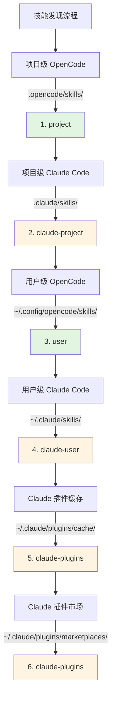

# Claude Code 技能兼容性

## 学完你能做什么

- 理解插件如何自动兼容 Claude Code 技能格式
- 掌握工具映射机制，让 Claude 技能在 OpenCode 中正确工作
- 了解技能发现的完整优先级规则
- 复用 Claude 插件市场中的现有技能，无需重新编写

## 你现在的困境

你已经有一些 Claude Code 的技能，或者想用 Claude 插件市场上的技能，但这些技能都是为 Claude Code 编写的。直接在 OpenCode 中使用会遇到问题：

- Claude 技能中的工具调用（如 `TodoWrite`、`Task`）在 OpenCode 中不存在
- 不清楚如何让 OpenCode 找到已安装的 Claude 插件技能
- 担心技能格式不兼容，需要重写所有内容

## 核心思路

OpenCode Agent Skills 插件通过**三层兼容机制**，让你无需修改即可使用 Claude Code 技能：

1. **自动发现** - 从 Claude Code 的标准目录（`.claude/skills/`、`~/.claude/plugins/`）扫描技能
2. **工具映射** - 加载技能时自动注入工具映射指南，将 Claude 工具名转为 OpenCode 工具名
3. **格式支持** - 同时支持 Claude 插件的 v1 和 v2 两种安装格式

::: info 关键概念
**Claude Code 技能格式** - Anthropic 定义的技能规范，使用 `SKILL.md` 文件描述技能，包含 YAML frontmatter（元数据）和 Markdown 内容（指令）。
:::

### 工具映射原理

当插件检测到加载的是 Claude Code 编写的技能时，会自动注入工具映射指南：

| Claude Code 工具 | OpenCode 工具 | 映射规则 |
| ---------------- | ------------- | -------- |
| `TodoWrite/TodoRead` | `todowrite/todoread` | 小写 |
| `Task` (子代理) | `task` (带 subagent_type 参数) | 改用参数 |
| `Skill` | `use_skill` | 替换工具名 |
| `Read/Write/Edit/Bash/Glob/Grep/WebFetch` | `read/write/edit/bash/glob/grep/webfetch` | 小写 |

**映射方式**：插件在加载技能时，将映射指南作为 XML 注入到会话上下文中，AI 会自动按照映射调用正确的工具。

::: tip 为什么需要映射？
Claude Code 和 OpenCode 的工具命名风格不同。Claude 使用 PascalCase（如 `TodoWrite`），OpenCode 使用小写（如 `todowrite`）。工具映射让 AI 知道如何转换调用。
:::

### 技能发现优先级

插件按照以下顺序发现技能，**第一个匹配的技能生效**（同名技能不会重复）：



**优先级规则**：
- 项目级技能覆盖用户级技能（方便项目定制）
- OpenCode 技能优先于 Claude 技能（避免混淆）
- 同名技能只保留首次发现的版本

::: details 示例：同名技能覆盖
假设你在两个位置都有名为 `git-helper` 的技能：
- `.claude/skills/git-helper/SKILL.md` （Claude 版本）
- `.opencode/skills/git-helper/SKILL.md` （OpenCode 版本）

**结果**：OpenCode 版本生效（优先级更高）
:::

## 🎒 开始前的准备

- 已安装并配置 OpenCode Agent Skills 插件
- 了解基础技能概念（推荐先阅读[什么是 OpenCode Agent Skills？](../../start/what-is-opencode-agent-skills/)）
- （可选）有 Claude Code 的已安装插件或技能

## 跟我做

### 第 1 步：检查 Claude 技能是否被发现

**为什么**
确认插件能正确扫描到你的 Claude Code 技能目录。

在 OpenCode 中调用工具：

```
get_available_skills()
```

**你应该看到**：返回的技能列表中包含来自 `.claude/skills/`、`~/.claude/skills/`、`~/.claude/plugins/` 的技能，每个技能的 `source` 字段显示来源（如 `claude-project`、`claude-user`、`claude-plugins`）。

**检查点 ✅**：确认列表中包含预期的 Claude 技能。

### 第 2 步：加载 Claude 技能

**为什么**
验证工具映射机制是否正常工作。

调用工具加载一个 Claude 技能：

```
use_skill(skill="你的技能名称")
```

**你应该看到**：返回成功消息，如 `Skill "xxx" loaded.`。

**检查点 ✅**：AI 现在可以使用该技能的指令。

### 第 3 步：验证工具映射生效

**为什么**
确认 AI 能正确调用 OpenCode 的工具而非 Claude 的工具。

向 AI 提出一个需要该技能工具的任务，例如：

```
请用技能中的 todo 功能帮我创建任务列表。
```

**你应该看到**：AI 正确调用 OpenCode 的 `todowrite` 工具，而不是 Claude 的 `TodoWrite` 工具。

::: tip 如何验证映射生效？
查看 AI 的工具调用日志（如果启用了调试模式），你会看到它调用的是 `todowrite` 而非 `TodoWrite`。
:::

**检查点 ✅**：工具调用成功，任务完成。

## 踩坑提醒

### 1. 插件格式不匹配

**问题**：旧版 Claude 插件使用 v1 格式，新版使用 v2 格式，导致某些技能无法被发现。

**原因**：v1 和 v2 的 `installed_plugins.json` 结构不同。

**解决**：插件同时支持两种格式，无需手动转换。如果仍无法发现技能，检查 `~/.claude/plugins/installed_plugins.json` 是否存在且格式正确。

### 2. 工具映射未生效

**问题**：AI 仍调用 Claude 工具名，导致报错。

**原因**：技能内容可能绕过了工具映射指南，或者使用了硬编码的工具调用。

**解决**：
- 确认技能是加载后使用，而非直接调用工具
- 如果技能中有代码示例，手动将工具名改为 OpenCode 格式

### 3. 技能命名冲突

**问题**：同名技能在不同位置，加载的是错误的版本。

**原因**：技能发现优先级导致的覆盖。

**解决**：
- 检查技能的 `source` 字段，确认来源
- 使用命名空间格式明确指定来源：`use_skill(skill="user:skill-name")` 或 `use_skill(skill="claude-plugins:skill-name")`

::: details 命名空间语法
插件支持 `namespace:skill-name` 格式：
- `project:skill-name` - 项目级 OpenCode 技能
- `claude-project:skill-name` - 项目级 Claude 技能
- `user:skill-name` - 用户级 OpenCode 技能
- `claude-user:skill-name` - 用户级 Claude 技能
- `claude-plugins:skill-name` - Claude 插件市场技能
:::

## 本课小结

OpenCode Agent Skills 插件通过三层兼容机制，让你无缝复用 Claude Code 技能：

- **自动发现** - 从 6 个位置扫描技能，覆盖项目级、用户级、插件级
- **工具映射** - 自动将 Claude 工具名转换为 OpenCode 工具名
- **格式支持** - 同时支持 v1 和 v2 两种 Claude 插件格式

无需重写技能，直接安装并使用，插件会自动处理兼容性问题。

## 下一课预告

> 下一课我们学习 **[Superpowers 工作流集成](../superpowers-integration/)**。
>
> 你会学到：
> - 如何启用 Superpowers 模式
> - Superpowers 技能的自动检测和加载
> - 严格工作流如何提升开发效率

---

## 附录：源码参考

<details>
<summary><strong>点击展开查看源码位置</strong></summary>

> 更新时间：2026-01-24

| 功能                | 文件路径                                                                                               | 行号    |
| ------------------- | ------------------------------------------------------------------------------------------------------ | ------- |
| 工具映射定义        | [`src/claude.ts`](https://github.com/joshuadavidthomas/opencode-agent-skills/blob/main/src/claude.ts#L19-L25)       | 19-25   |
| v1/v2 格式类型定义  | [`src/claude.ts`](https://github.com/joshuadavidthomas/opencode-agent-skills/blob/main/src/claude.ts#L35-L61)       | 35-61   |
| 插件安装路径提取    | [`src/claude.ts`](https://github.com/joshuadavidthomas/opencode-agent-skills/blob/main/src/claude.ts#L68-L77)       | 68-77   |
| 发现插件技能        | [`src/claude.ts`](https://github.com/joshuadavidthomas/opencode-agent-skills/blob/main/src/claude.ts#L82-L105)      | 82-105  |
| 发现市场技能        | [`src/claude.ts`](https://github.com/joshuadavidthomas/opencode-agent-skills/blob/main/src/claude.ts#L115-L180)      | 115-180 |
| 发现缓存技能        | [`src/claude.ts`](https://github.com/joshuadavidthomas/opencode-agent-skills/blob/main/src/claude.ts#L193-L253)      | 193-253 |
| 技能发现优先级列表  | [`src/skills.ts`](https://github.com/joshuadavidthomas/opencode-agent-skills/blob/main/src/skills.ts#L241-L254)      | 241-254 |
| 同名技能去重逻辑    | [`src/skills.ts`](https://github.com/joshuadavidthomas/opencode-agent-skills/blob/main/src/skills.ts#L256-L260)      | 256-260 |
| toolTranslation 导入 | [`src/tools.ts`](https://github.com/joshuadavidthomas/opencode-agent-skills/blob/main/src/tools.ts#L15)       | 15   |
| 工具映射注入        | [`src/tools.ts`](https://github.com/joshuadavidthomas/opencode-agent-skills/blob/main/src/tools.ts#L238-L249)      | 238-249 |

**关键常量**：
- `toolTranslation`：工具映射指南 XML 字符串，在加载技能时注入到会话上下文。在 `src/claude.ts:19-25` 定义，在 `src/tools.ts:15` 导入

**关键函数**：
- `getPluginInstallPaths()`：从 v1/v2 格式中提取插件安装路径
- `discoverSkillsFromPluginDir()`：扫描插件目录的 skills/ 子目录
- `discoverMarketplaceSkills()`：从 `~/.claude/plugins/marketplaces/` 发现技能（优先）
- `discoverPluginCacheSkills()`：从 `~/.claude/plugins/cache/` 发现技能（作为降级方案）
- `findFile()`：递归查找指定文件名（工具函数）

**重要流程**：
1. 插件初始化时调用 `discoverAllSkills()` → 遍历 6 个发现路径
2. 发现 Claude 插件技能时调用 `discoverMarketplaceSkills()` 或 `discoverPluginCacheSkills()`
3. 加载技能时，`use_skill` 工具在 XML 内容中插入 `toolTranslation`（第 244 行）

</details>
