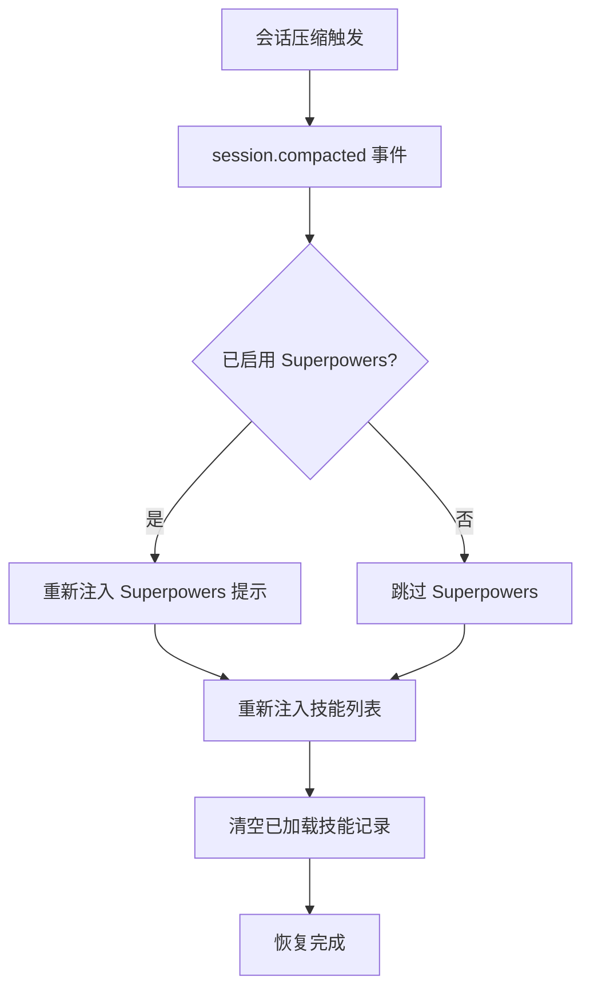

# 上下文压缩恢复机制

## 学完你能做什么

- 理解插件如何在会话压缩后保持技能可用
- 知道压缩恢复的触发时机和执行流程
- 能够验证压缩恢复是否正常工作
- 理解 synthetic 消息在恢复机制中的作用

## 你现在的困境

在长会话中，OpenCode 会执行**上下文压缩**（Context Compaction）以节省 Token。压缩后的会话只保留最近的消息，早期历史记录（包括之前注入的技能内容）会被移除。

这导致一个问题：如果技能内容被压缩掉了，AI 就不再知道有哪些技能可用，也无法使用已加载的技能。

## 什么时候用这一招

压缩恢复机制是**自动运行**的，你无需手动干预。但了解它的原理后，你可以在以下场景排查问题：

- 长会话中 AI 突然"忘记"了技能
- 需要调试技能在压缩后的可用性
- 想理解插件的会话管理策略

## 核心思路

### 什么是上下文压缩？

OpenCode 会话随着消息增多会越来越长，当 Token 使用量接近上限时，系统会自动执行**上下文压缩**：

```
[会话初始] → [消息 1] → [消息 2] → ... → [消息 50]
                          ↑ 压缩点：只保留最近 10 条消息
```

压缩后，早期消息（包括技能注入内容）会被移除，AI 只能看到最近的消息历史。

### 压缩恢复机制的工作原理

插件监听 `session.compacted` 事件，一旦检测到压缩发生，立即执行以下恢复操作：



**关键点**：
- 恢复是**自动的**，无需手动触发
- 恢复后的技能列表包含**所有发现的技能**（不仅仅是之前加载的）
- 已加载技能的记录会被清空，允许 AI 重新评估需要哪些技能

### Synthetic 消息的作用

插件使用 **Synthetic Message Injection** 机制注入内容：

| 属性 | 值 | 含义 |
|--- | --- | ---|
| `noReply` | `true` | AI 不会对注入内容本身进行回复 |
| `synthetic` | `true` | 标记为系统生成内容，不计入用户输入，不在 UI 显示 |

这意味着压缩恢复注入的内容：
- 对用户完全透明（看不到）
- 不消耗用户消息配额
- 但会被 AI 读取并理解

## 🎒 开始前的准备

本教程需要：
- 已安装 OpenCode Agent Skills 插件
- 理解技能加载的基础知识
- 一个长会话用于测试压缩效果

::: tip
无需额外准备，压缩恢复机制是插件内置功能。
:::

## 跟我做：验证压缩恢复效果

### 第 1 步：启动新会话

**为什么**
验证会话初始化时技能列表是否正常注入

启动一个新会话，输入任何消息：

```
你好
```

**你应该看到**：AI 正常回复，并在后台自动注入了技能列表（对用户不可见）

### 第 2 步：加载一个技能

**为什么**
确保技能内容被注入到上下文

调用 `use_skill` 工具：

```
使用 get_available_skills 查看可用技能，然后用 use_skill 加载其中一个技能
```

**你应该看到**：AI 列出可用技能，然后加载你选择的技能

### 第 3 步：触发上下文压缩

**为什么**
模拟长会话场景，触发 OpenCode 的压缩机制

持续发送消息，模拟长对话：

```
消息 1：测试内容
消息 2：继续测试
...
（重复发送 20-30 条消息）
```

**你应该看到**：
- 随着消息增多，会话历史变长
- 达到一定长度后，OpenCode 自动执行压缩
- 压缩后，早期消息（包括技能注入）被移除

### 第 4 步：检查恢复效果

**为什么**
验证压缩后技能列表是否被重新注入

压缩后，再次让 AI 使用技能：

```
帮我使用 git-helper 技能创建新分支（假设你已安装 git-helper 技能）
```

**你应该看到**：
- AI 仍然知道有哪些技能可用（证明技能列表已恢复）
- AI 能够正常加载和使用技能（证明技能功能未受压缩影响）

### 第 5 步：验证 Synthetic 消息注入

**为什么**
确认恢复机制使用的是 synthetic 消息，不会干扰对话

如果插件支持，可以检查会话消息历史（取决于 OpenCode 功能）：

```
使用调试工具查看会话消息历史
```

**你应该看到**：
- 恢复的技能列表消息标记为 `synthetic: true`
- 这些消息不会显示在正常对话界面

## 检查点 ✅

完成上述步骤后，你应该能够确认：

- [ ] 长会话中 AI 仍能访问技能列表
- [ ] 压缩后技能加载功能正常工作
- [ ] 恢复过程对用户完全透明

## 踩坑提醒

### 问题 1：压缩后 AI 说"找不到技能"

**可能原因**：
- 插件未正确监听 `session.compacted` 事件
- 技能目录路径发生变化

**解决方法**：

1. **验证压缩事件是否触发**
   - 通过「跟我做」中的第 3 步和第 4 步，确认压缩后 AI 仍能访问技能列表
   - 如果 AI 能正常使用技能，说明压缩恢复机制工作正常

2. **检查插件是否正确加载**
   - 重启 OpenCode
   - 启动新会话后，让 AI 列出可用技能（`get_available_skills`）
   - 如果能看到技能列表，说明插件已正确加载

### 问题 2：恢复的技能列表为空

**可能原因**：
- 技能发现路径中没有技能
- 技能文件格式错误

**解决方法**：
```bash
# 手动查询可用技能
使用 get_available_skills 查看技能列表
```

如果返回空列表，检查技能目录和文件格式。

### 问题 3：压缩后已加载技能状态丢失

**这是预期行为**，不是 Bug。恢复机制会清空 `loadedSkillsPerSession` 记录，允许 AI 重新评估需要哪些技能。

**解决方法**：AI 会根据上下文自动决定是否重新加载技能，无需手动干预。

## 本课小结

压缩恢复机制通过以下方式确保技能在长会话中的可用性：

1. **监听压缩事件**：自动检测 `session.compacted` 事件
2. **重新注入技能列表**：使用 `<available-skills>` 标签注入所有技能
3. **可选 Superpowers 恢复**：如果启用，同时恢复 Superpowers 提示
4. **使用 Synthetic 消息**：恢复过程对用户透明，不影响对话
5. **重置已加载记录**：清空已加载技能集合，允许重新评估

这套机制确保了：
- 长会话中技能始终可用
- 恢复过程自动化且无感知
- AI 可以根据最新上下文决定使用哪些技能

## 下一课预告

> 下一课我们学习 **[常见问题排查](../../faq/troubleshooting/)**。
>
> 你会学到：
> - 常见错误和异常的处理方法
> - 压缩恢复相关的排查技巧
> - 其他使用问题的解决方案

---

## 附录：源码参考

<details>
<summary><strong>点击展开查看源码位置</strong></summary>

> 更新时间：2026-01-24

| 功能        | 文件路径                                                                                    | 行号    |
|--- | --- | ---|
| 压缩事件监听 | [`src/plugin.ts`](https://github.com/joshuadavidthomas/opencode-agent-skills/blob/main/src/plugin.ts#L144-L157) | 144-157 |
| 首次消息初始化 | [`src/plugin.ts`](https://github.com/joshuadavidthomas/opencode-agent-skills/blob/main/src/plugin.ts#L70-L105) | 70-105 |
| 技能列表注入 | [`src/skills.ts`](https://github.com/joshuadavidthomas/opencode-agent-skills/blob/main/src/skills.ts#L345-L370) | 345-370 |
| Synthetic 消息注入 | [`src/utils.ts`](https://github.com/joshuadavidthomas/opencode-agent-skills/blob/main/src/utils.ts#L147-L162) | 147-162 |
| 会话状态管理 | [`src/plugin.ts`](https://github.com/joshuadavidthomas/opencode-agent-skills/blob/main/src/plugin.ts#L25-L35) | 25-35 |

**关键变量**：
- `setupCompleteSessions: Set<string>`：记录已完成初始化的会话 ID
- `loadedSkillsPerSession: Map<string, Set<string>>`：记录每个会话已加载的技能名称

**关键函数**：
- `injectSkillsList()`：注入可用技能列表到会话
- `injectSyntheticContent()`：使用 synthetic 消息注入内容
- `getSessionContext()`：获取会话的 model 和 agent 信息

</details>
