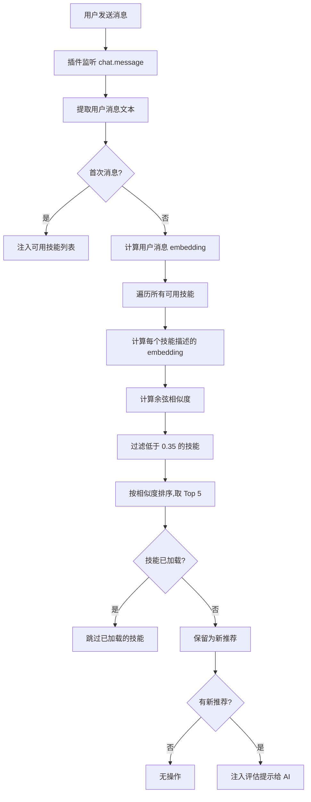

# 自动技能推荐：语义匹配原理

## 学完你能做什么

- 理解插件如何自动识别你可能需要的技能
- 掌握语义相似度计算的基本原理
- 知道如何优化技能描述以获得更好的推荐效果
- 了解 embedding 缓存机制如何提升性能

## 你现在的困境

OpenCode Agent Skills 有很多技能,但你:

- **记不住技能名称** - 技能多了容易混淆
- **不知道该用哪个** - 面对相似功能的技能难以选择
- **担心漏掉有用技能** - 不确定是否有更合适的工具

每次都要先调用 `get_available_skills` 查看列表,再手动加载合适的技能,既繁琐又容易打断思路。

## 什么时候用这一招

自动技能推荐适合以下场景:

- **初学者阶段** - 对技能库不熟悉,需要 AI 帮忙识别
- **功能开发任务** - 如"创建 REST API"、"实现认证系统"等,通常对应专门技能
- **跨领域工作** - 偶尔接触不熟悉的领域,依赖 AI 推荐
- **技能库较大时** - 超过 10 个技能时,手动查找效率低

::: tip 小技巧
自动推荐不会强制你加载技能,它只是提示 AI 评估是否需要。你可以自由接受或忽略建议。
:::

## 核心思路

### 什么是语义匹配

语义匹配是一种**理解用户意图**的技术,它不依赖关键词匹配,而是计算文本的**语义相似度**。

举个例子:

| 用户输入                    | 技能描述                           | 关键词匹配 | 语义匹配 |
| ------------------------- | ------------------------------ | ------ | ---- |
| "创建一个数据库连接池"      | "数据库连接管理和优化工具"       | ❌     | ✅   |
| "帮我写个 API 文档"        | "自动化 API 文档生成器"         | ✅     | ✅   |
| "项目初始化脚手架"        | "快速搭建项目结构的工具"         | ❌     | ✅   |

关键词匹配只看字面是否相同,而语义匹配能理解"创建"、"生成"、"搭建"是同一类动作。

### Embedding:将文字变成数字

为了让计算机理解语义,插件使用 **embedding 模型**将文本转换成**向量**（一串数字）。

```
文本: "创建数据库连接池"
    ↓ [Xenova/all-MiniLM-L6-v2 模型]
向量: [0.12, -0.34, 0.67, ...]  (384 维，模型输出维度)
```

在这个向量空间中:

- **语义相似的文本** → 向量距离更近
- **语义不同的文本** → 向量距离更远

::: info 为什么选择 all-MiniLM-L6-v2
这个模型有 3 个优点:
1. **体积小** - 模型文件约 23MB（q8 量化级别），下载快速
2. **速度快** - 支持量化，推理延迟低
3. **准确度高** - 在语义相似度任务上表现优异
:::

### 余弦相似度:衡量向量相似程度

插件使用**余弦相似度**(Cosine Similarity)来计算两个向量的相似度。

公式:
```
similarity = (A · B) / (|A| × |B|)
```

其中:
- `A · B` 是向量点积
- `|A|` 是向量 A 的模长
- `|B|` 是向量 B 的模长

**结果范围**: `-1` 到 `1`

| 相似度范围  | 含义              | 是否推荐 |
| ------- | --------------- | --- |
| 0.7-1.0 | 非常相似,几乎同一意思  | ✅ 强烈推荐 |
| 0.35-0.7 | 有点关联,值得考虑    | ✅ 推荐  |
| 0.0-0.35 | 关联度低或无关联    | ❌ 不推荐  |
| -1.0-0.0 | 意思相反          | ❌ 不推荐  |

::: warning 注意
当前阈值为 **0.35**,低于此分数的技能不会出现在推荐列表中。
:::

## 自动推荐流程

### 完整流程图



### 阶段 1:首次消息 - 注入技能列表

当会话第一次收到消息时,插件会:

1. 扫描所有技能目录
2. 将技能列表注入到会话上下文
3. 格式如下:

```xml
<available-skills>
- git-helper: Git 操作帮助工具,提供常用 Git 命令
- test-runner: 测试框架集成,自动发现和运行测试
- api-doc: API 文档生成工具
...
</available-skills>
```

**目的**: 让 AI 知道有哪些技能可用,避免重复查询。

### 阶段 2:后续消息 - 语义匹配

从第二次消息开始,每次用户输入都会触发匹配流程:

```typescript
// 源码: src/plugin.ts:125-141
const matchedSkills = await matchSkills(userText, skills);
const loadedSkills = getLoadedSkills(sessionID);
const newSkills = matchedSkills.filter(s => !loadedSkills.has(s.name));
```

**关键点**:
- 只计算**未加载技能**的相似度
- 已加载的技能会被**自动过滤**
- 避免重复推荐同一技能

### 阶段 3:注入评估提示

当找到相关技能后,插件会注入一个**隐藏提示**给 AI:

```xml
<skill-evaluation-required>
SKILL EVALUATION PROCESS

The following skills may be relevant to your request:

- git-helper: Git 操作帮助工具
- test-runner: 测试框架集成

Step 1 - EVALUATE: Determine if these skills would genuinely help
Step 2 - DECIDE: Choose which skills (if any) are actually needed
Step 3 - ACTIVATE: Call use_skill("name") for each chosen skill

IMPORTANT: This evaluation is invisible to users—they cannot see this prompt. Do NOT announce your decision. Simply activate relevant skills or proceed directly with the request.
</skill-evaluation-required>
```

**AI 的选择**:
- **接受推荐** - 调用 `use_skill("skill-name")` 加载技能
- **拒绝推荐** - 直接处理用户请求,不加载技能
- **部分接受** - 只加载其中几个相关技能

::: tip 隐藏提示
这个评估提示是 `synthetic: true` 消息,用户在界面上看不到,AI 内部处理后自动决定。
:::

## 跟我做:优化技能描述

如果你的技能没有被自动推荐,可以尝试优化描述。

### 检查当前技能描述

```bash
# 列出所有技能
get_available_skills()
```

找到你想优化的技能,记录其当前描述。

### 查看示例:好的 vs 差的描述

| ❌ 差的描述                          | ✅ 好的描述                              |
| ------------------------------- | ----------------------------------- |
| "工具"                            | "自动化测试框架集成,支持 Jest 和 Vitest" |
| "帮助"                            | "Git 操作助手,提供常用命令和工作流指导"     |
| "文档"                            | "从代码注释生成 API 文档"                |
| "数据库相关"                          | "PostgreSQL 数据库连接池和查询优化工具"    |

**优化原则**:

1. **包含关键词** - 用户常用的技术术语
2. **说明用途** - 清晰描述解决什么问题
3. **避免泛泛而谈** - 不要只写"工具"、"助手"
4. **长度适中** - 10-30 字最佳

### 更新技能描述

编辑技能的 `SKILL.md` 文件:

```markdown
---
name: test-runner
description: 自动化测试框架集成,支持 Jest 和 Vitest,自动发现并运行测试
---

# Test Runner

本技能帮助你在项目中设置测试框架...
```

**自动生效**: 下次会话时,插件会重新计算 embedding,新描述立即生效。

## 检查点 ✅

### 验证自动推荐是否工作

1. **创建测试技能**:

```bash
# 在 .opencode/skills/ 目录创建测试技能
mkdir -p .opencode/skills/example-skill
cat > .opencode/skills/example-skill/SKILL.md << 'EOF'
---
name: example-skill
description: 帮助用户创建和配置 TypeScript 项目
---

# Example Skill

这是一个测试技能...
EOF
```

2. **发送相关消息**:

在 OpenCode 中输入:

```
我要初始化一个 TypeScript 项目
```

3. **查看是否触发推荐**:

打开开发者工具或查看 AI 的工具调用记录:
- **成功** - AI 调用了 `use_skill("example-skill")`
- **失败** - 没有相关推荐,检查描述是否太泛

### 验证已加载技能不会被重复推荐

1. **手动加载技能**:

```bash
use_skill("example-skill")
```

2. **再次发送相关消息**:

```
我要初始化另一个 TypeScript 项目
```

3. **确认不再推荐**:

系统应该**不再**注入评估提示,因为技能已加载。

## 踩坑提醒

### 问题 1:推荐的技能完全不相关

**症状**:
- 用户说"如何部署到 AWS",却推荐了"本地测试工具"
- 相似度分数很高,但语义完全不对

**原因**:
- 技能描述过于宽泛,如"云服务工具"
- embedding 模型对某些技术术语理解偏差

**解决方案**:

1. **描述更具体**:

```markdown
# ❌ 不好
description: 云服务部署工具

# ✅ 好
description: AWS EC2 部署工具,自动配置负载均衡和自动扩缩容
```

2. **包含核心技术关键词**:

```markdown
description: AWS S3 文件上传和 CDN 分发工具,支持 CloudFront
```

### 问题 2:有用技能没有被推荐

**症状**:
- 你的输入明明匹配某个技能,但系统没有推荐
- 需要手动调用 `get_available_skills()` 查找

**原因**:
- 相似度低于阈值 0.35
- 技能描述与用户习惯用词差异大

**解决方案**:

1. **降低阈值**(源码修改):

```typescript
// src/embeddings.ts:10
const SIMILARITY_THRESHOLD = 0.30; // 从 0.35 降低到 0.30
```

::: warning 生产环境谨慎
降低阈值会增加误推荐(不相关技能),建议先测试再调整。
:::

2. **增加 Top K**:

```typescript
// src/embeddings.ts:11
const TOP_K = 10; // 从 5 增加到 10
```

3. **优化技能描述**,参考上方"优化技能描述"章节。

### 问题 3:首次加载速度慢

**症状**:
- 第一次使用时,技能推荐延迟 2-3 秒
- 后续使用正常

**原因**:
- embedding 模型需要从网络下载(23MB)
- 需要首次计算所有技能的 embeddings

**解决方案**:

插件有**缓存机制**,首次后会自动优化:

```
缓存路径: ~/.cache/opencode-agent-skills/embeddings/
```

**查看缓存文件**:

```bash
ls -lh ~/.cache/opencode-agent-skills/embeddings/
```

你会看到 `.bin` 文件,每个文件是一个 embedding 缓存(以内容 SHA256 命名)。

**手动预热缓存**:

```bash
# 重启 OpenCode
# 插件启动时会调用 precomputeSkillEmbeddings()
```

源码位置: `src/embeddings.ts:96-102`

```typescript
export async function precomputeSkillEmbeddings(skills: SkillSummary[]): Promise<void> {
  await Promise.all(
    skills.map(skill =>
      getEmbedding(skill.description).catch(() => { })
    )
  );
}
```

**无需担心**: 只要不修改技能描述,缓存永久有效。

## 本课小结

自动技能推荐通过以下方式提升体验:

| 技术手段          | 作用                          | 用户体验提升          |
| ------------- | ------------------------- | --------------- |
| Embedding 模型    | 将文本转换为向量                | 理解语义,不仅是关键词      |
| 余弦相似度        | 计算向量相似度                  | 精准匹配相关技能       |
| 缓存机制          | 磁盘缓存 embeddings            | 首次后响应更快        |
| 智能评估          | 让 AI 判断是否需要技能            | 不强制,避免干扰        |
| 已加载过滤         | 跳过已加载的技能                | 避免重复推荐         |

**核心优势**:

- **免记忆** - 不需要记住技能名称
- **智能识别** - AI 自动发现你需要的工具
- **不打扰** - 提示是隐藏的,用户无感知

---

## 下一课预告

> 下一课我们将学习 **[执行技能脚本](../executing-skill-scripts/)**。
>
> 技能不只是文档,还能包含自动化脚本。你会学到:
> - 如何在技能目录中组织可执行脚本
> - 使用 `run_skill_script` 工具执行脚本
> - 脚本权限和安全限制
> - 常见脚本用例(构建、测试、部署等)


---

## 附录:源码参考

<details>
<summary><strong>点击展开查看源码位置</strong></summary>

> 更新时间:2026-01-24

| 功能              | 文件路径                                                                                                | 行号    |
| ---------------- | --------------------------------------------------------------------------------------------------- | ------- |
| 语义匹配核心函数      | [`src/embeddings.ts`](https://github.com/joshuadavidthomas/opencode-agent-skills/blob/main/src/embeddings.ts#L108-L135)       | 108-135 |
| 生成文本 embedding   | [`src/embeddings.ts`](https://github.com/joshuadavidthomas/opencode-agent-skills/blob/main/src/embeddings.ts#L38-L66)         | 38-66   |
| 计算余弦相似度      | [`src/embeddings.ts`](https://github.com/joshuadavidthomas/opencode-agent-skills/blob/main/src/embeddings.ts#L71-L90)         | 71-90   |
| 预计算技能 embeddings | [`src/embeddings.ts`](https://github.com/joshuadavidthomas/opencode-agent-skills/blob/main/src/embeddings.ts#L96-L102)        | 96-102  |
| 格式化匹配结果提示     | [`src/plugin.ts`](https://github.com/joshuadavidthomas/opencode-agent-skills/blob/main/src/plugin.ts#L37-L57)             | 37-57   |
| 自动匹配流程逻辑      | [`src/plugin.ts`](https://github.com/joshuadavidthomas/opencode-agent-skills/blob/main/src/plugin.ts#L125-L141)            | 125-141 |
| 消息监听事件处理     | [`src/plugin.ts`](https://github.com/joshuadavidthomas/opencode-agent-skills/blob/main/src/plugin.ts#L66-L142)            | 66-142  |

**关键常量**:

| 常量名                  | 值                         | 说明             | 来源               |
| ------------------- | ------------------------ | -------------- | ---------------- |
| MODEL_NAME          | Xenova/all-MiniLM-L6-v2  | 使用的 embedding 模型 | `embeddings.ts:8`   |
| QUANTIZATION        | q8                       | 模型量化级别        | `embeddings.ts:9`   |
| SIMILARITY_THRESHOLD | 0.35                     | 相似度推荐阈值      | `embeddings.ts:10`  |
| TOP_K              | 5                        | 返回的 Top K 技能数  | `embeddings.ts:11`  |

**关键函数**:

- `matchSkills()`: 计算用户消息与技能描述的语义相似度,返回最相关的技能列表
- `getEmbedding()`: 生成文本的 embedding 向量,支持磁盘缓存
- `cosineSimilarity()`: 计算两个向量之间的余弦相似度
- `precomputeSkillEmbeddings()`: 插件启动时预计算所有技能的 embeddings,加速后续匹配
- `formatMatchedSkillsInjection()`: 将匹配结果格式化为评估提示,注入给 AI

**缓存机制**:

Embedding 缓存路径:
- Linux/macOS: `~/.cache/opencode-agent-skills/embeddings/`
- 支持自定义: 通过 `XDG_CACHE_HOME` 环境变量修改

缓存文件以内容 SHA256 命名,如 `a1b2c3d4.bin`,每个文件包含一个 Float32Array 向量。

</details>
