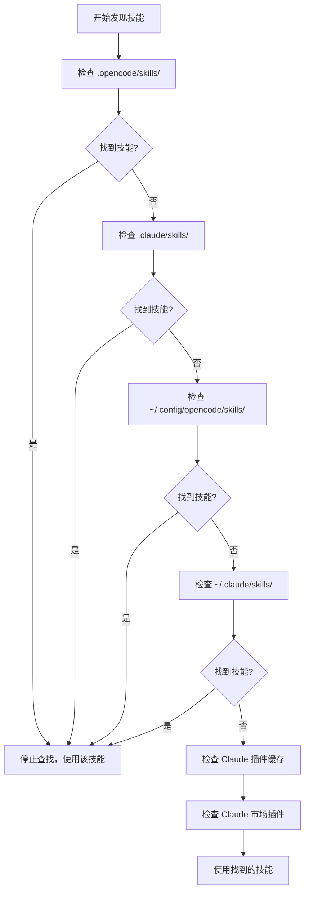

# 技能发现机制详解

## 学完你能做什么

- 理解插件从哪些位置自动发现技能
- 掌握技能发现的优先级规则
- 知道如何让项目级技能覆盖用户级技能
- 了解 Claude Code 技能兼容机制

## 你现在的困境

你创建了技能，但 AI 一直说「找不到技能」。你不知道插件会在哪些地方查找技能，也不知道同名技能会发生什么。结果就是技能放错了位置，或者被其他位置的技能覆盖了。

## 什么时候用这一招

- 需要让某个技能在项目中生效时
- 想覆盖用户级或插件自带的技能时
- 复用 Claude Code 的技能时

## 🎒 开始前的准备

::: warning 前置知识
请先完成 [安装 OpenCode Agent Skills](../../start/installation/)。
:::

## 核心思路

OpenCode Agent Skills 会从多个位置自动发现技能，按优先级顺序查找。**第一个找到的技能生效，后续同名技能被忽略**。这让你可以在项目中覆盖用户级技能，实现定制化。

### 发现路径总览



::: info 技能名称唯一性
同名技能只会保留第一个发现的，后续的被忽略。这意味着项目级的 `git-helper` 会覆盖用户级的 `git-helper`。
:::

## 跟我做

### 第 1 步：查看技能发现逻辑

**为什么**
了解插件是如何扫描技能目录的，能帮你定位问题。

查看源码中的发现路径定义：

```typescript
// src/skills.ts:241-246
const discoveryPaths: DiscoveryPath[] = [
  { path: path.join(directory, '.opencode', 'skills'), label: 'project', maxDepth: 3 },
  { path: path.join(directory, '.claude', 'skills'), label: 'claude-project', maxDepth: 1 },
  { path: path.join(homedir(), '.config', 'opencode', 'skills'), label: 'user', maxDepth: 3 },
  { path: path.join(homedir(), '.claude', 'skills'), label: 'claude-user', maxDepth: 1 }
];
```

**你应该看到**：
- 4 个本地发现路径，每个都有 `label`（来源标识）和 `maxDepth`（最大递归深度）
- 还有 2 个 Claude 插件路径（缓存和市场插件），通过 `discoverPluginCacheSkills()` 和 `discoverMarketplaceSkills()` 发现
- `directory` 是项目根目录，`homedir()` 是用户主目录

### 第 2 步：了解递归搜索机制

**为什么**
理解递归深度限制，能帮你避免把技能放太深导致找不到。

递归搜索函数会遍历目录树，查找 `SKILL.md` 文件：

```typescript
// src/skills.ts:182-207
async function recurse(dir: string, depth: number, relPath: string) {
  if (depth > maxDepth) return;  // 超过深度限制，停止搜索

  const entries = await fs.readdir(dir, { withFileTypes: true });
  for (const entry of entries) {
    const fullPath = path.join(dir, entry.name);
    const stats = await fs.stat(fullPath);

    if (!stats.isDirectory()) continue;  // 跳过文件

    const newRelPath = relPath ? `${relPath}/${entry.name}` : entry.name;
    const found = await findFile(fullPath, newRelPath, 'SKILL.md');

    if (found) {
      results.push({ ...found, label });  // 找到技能，添加结果
    } else {
      await recurse(fullPath, depth + 1, newRelPath);  // 递归搜索子目录
    }
  }
}
```

**你应该看到**：
- 每个目录深度从 0 开始，超过 `maxDepth` 就停止
- 找到 `SKILL.md` 就返回，否则继续搜索子目录

**不同位置的递归深度**：

| 位置                | Label           | 最大深度 | 说明                       |
|--- | --- | --- | ---|
| `.opencode/skills/` | project         | 3        | 支持嵌套目录结构           |
| `.claude/skills/`   | claude-project  | 1        | 只扫描第一层               |
| `~/.config/opencode/skills/` | user   | 3        | 支持嵌套目录结构           |
| `~/.claude/skills/` | claude-user     | 1        | 只扫描第一层               |

### 第 3 步：理解去重规则

**为什么**
同名技能只会保留一个，知道这个规则能避免技能被覆盖。

去重逻辑在 `discoverAllSkills` 函数中：

```typescript
// src/skills.ts:255-262
const skillsByName = new Map<string, Skill>();
for (const { filePath, relativePath, label } of allResults) {
  const skill = await parseSkillFile(filePath, relativePath, label);
  if (!skill || skillsByName.has(skill.name)) continue;  // 跳过已存在的同名技能
  skillsByName.set(skill.name, skill);
}
```

**你应该看到**：
- 使用 `Map` 按 `skill.name` 存储，确保唯一性
- `skillsByName.has(skill.name)` 检查是否已存在同名技能
- 后续同名技能被忽略（`continue`）

**场景示例**：

```
项目结构：
.opencode/skills/git-helper/SKILL.md  ← 第一个发现，生效
~/.config/opencode/skills/git-helper/SKILL.md  ← 同名，被忽略
```

### 第 4 步：解析 SKILL.md 文件

**为什么**
了解 SKILL.md 的解析规则，能帮你避免格式错误。

插件会解析 SKILL.md 的 YAML frontmatter：

```typescript
// src/skills.ts:132-152
const frontmatterMatch = content.match(/^---\n([\s\S]*?)\n---\n([\s\S]*)$/);
if (!frontmatterMatch?.[1] || !frontmatterMatch?.[2]) {
  return null;  // 格式错误，跳过
}

const frontmatterText = frontmatterMatch[1];
const skillContent = frontmatterMatch[2].trim();

let frontmatterObj: unknown;
try {
  frontmatterObj = parseYamlFrontmatter(frontmatterText);
} catch {
  return null;  // YAML 解析失败，跳过
}

let frontmatter: SkillFrontmatter;
try {
  frontmatter = SkillFrontmatterSchema.parse(frontmatterObj);
} catch (error) {
  return null;  // 验证失败，跳过
}
```

**你应该看到**：
- Frontmatter 必须用 `---` 包围
- YAML 内容必须符合 Zod Schema 验证
- 解析失败的技能会被忽略（不报错，继续发现其他技能）

**Frontmatter 验证规则**：

```typescript
// src/skills.ts:106-114
const SkillFrontmatterSchema = z.object({
  name: z.string()
    .regex(/^[\p{Ll}\p{N}-]+$/u, { message: "Name must be lowercase alphanumeric with hyphens" })
    .min(1, { message: "Name cannot be empty" }),
  description: z.string()
    .min(1, { message: "Description cannot be empty" }),
  license: z.string().optional(),
  "allowed-tools": z.array(z.string()).optional(),
  metadata: z.record(z.string(), z.string()).optional()
});
```

**名称规范**：
- 只允许小写字母、数字、连字符（`-`）
- 不允许空格、大写字母、下划线

| ❌ 错误的技能名称  | ✅ 正确的技能名称 |
|--- | ---|
| `MySkill`        | `my-skill`       |
| `git_helper`     | `git-helper`     |
| `Git Helper`     | `git-helper`     |

### 第 5 步：发现可执行脚本

**为什么**
技能可以包含自动化脚本，了解脚本发现机制能帮你正确配置。

插件会递归扫描技能目录，查找可执行文件：

```typescript
// src/skills.ts:61-93
const scripts: Script[] = [];
const skipDirs = new Set(['node_modules', '__pycache__', '.git', '.venv', 'venv', '.tox', '.nox']);

async function recurse(dir: string, depth: number, relPath: string) {
  if (depth > maxDepth) return;

  const entries = await fs.readdir(dir, { withFileTypes: true });
  for (const entry of entries) {
    if (entry.name.startsWith('.')) continue;  // 跳过隐藏目录
    if (skipDirs.has(entry.name)) continue;    // 跳过依赖目录

    const fullPath = path.join(dir, entry.name);
    const stats = await fs.stat(fullPath);

    if (stats.isDirectory()) {
      await recurse(fullPath, depth + 1, newRelPath);
    } else if (stats.isFile()) {
      if (stats.mode & 0o111) {  // 检查可执行位
        scripts.push({
          relativePath: newRelPath,
          absolutePath: fullPath
        });
      }
    }
  }
}
```

**你应该看到**：
- 只扫描有可执行位（`0o111`）的文件
- 自动跳过隐藏目录和常见依赖目录
- 最大递归深度为 10 层

**脚本发现规则**：

| 规则              | 说明                                    |
|--- | ---|
| 可执行位检查      | 文件必须有执行权限（`chmod +x`）       |
| 跳过隐藏目录      | 不扫描 `.git`、`.venv` 等目录           |
| 跳过依赖目录      | 不扫描 `node_modules`、`__pycache__` 等 |
| 最大深度 10 层    | 超过 10 层的嵌套不会被扫描              |

### 第 6 步：兼容 Claude Code 插件

**为什么**
了解 Claude Code 插件兼容机制，能帮你复用现有技能。

插件会扫描 Claude Code 的插件缓存和市场安装目录：

```typescript
// src/claude.ts:115-145
async function discoverMarketplaceSkills(): Promise<LabeledDiscoveryResult[]> {
  const claudeDir = path.join(homedir(), ".claude", "plugins");
  const installedPath = path.join(claudeDir, "installed_plugins.json");

  let installed: InstalledPlugins;
  try {
    const content = await fs.readFile(installedPath, "utf-8");
    installed = JSON.parse(content);
  } catch {
    return [];
  }

  const isV2 = installed.version === 2;

  for (const pluginKey of Object.keys(installed.plugins || {})) {
    const pluginData = installed.plugins[pluginKey];
    if (!pluginData) continue;

    if (isV2 || Array.isArray(pluginData)) {
      // v2 format: use installPath directly from each installation entry
      const installPaths = getPluginInstallPaths(pluginData);
      for (const installPath of installPaths) {
        const skills = await discoverSkillsFromPluginDir(installPath);
        results.push(...skills);
      }
    } else {
      // v1 format: use marketplace manifest to find skills
      // ...
    }
  }
}
```

**你应该看到**：
- 读取 Claude Code 的 `installed_plugins.json` 文件
- 支持 v1 和 v2 两种插件格式
- 从插件安装路径扫描 `SKILL.md` 文件

**Claude Code 插件结构**：

Cache 目录结构（插件缓存）：

```
~/.claude/plugins/
├── cache/                    # 插件缓存
│   ├── plugin-name/         # v1 结构
│   │   └── skills/
│   │       └── skill-name/SKILL.md
│   └── marketplace-name/    # v2 结构
│       └── plugin-name/
│           └── version/
│               └── skills/
│                   └── skill-name/SKILL.md
└── installed_plugins.json   # 插件安装清单
```

**市场插件（v2）**：
- 插件的实际路径从 `installed_plugins.json` 的 `installPath` 字段读取
- 路径不固定，可能是 `managed`、`user`、`project` 或 `local` 作用域的任意位置
- 每个插件目录下有 `skills/` 子目录，包含各个技能

## 检查点 ✅

验证你掌握了技能发现机制：

- [ ] 知道 6 个技能发现路径的优先级顺序
- [ ] 理解同名技能只会保留第一个发现的
- [ ] 知道不同位置的递归深度限制
- [ ] 了解 SKILL.md 的验证规则
- [ ] 知道如何让项目级技能覆盖用户级技能

## 踩坑提醒

### ❌ 技能放错位置

**问题**：技能放在 `~/.config/opencode/skills/`，但项目中有同名技能，导致被覆盖。

**解决**：将项目特定技能放在 `.opencode/skills/`，确保优先级最高。

### ❌ 技能名称不符合规范

**问题**：SKILL.md 中的 `name` 字段包含大写字母或空格，导致解析失败。

**解决**：确保技能名称符合 `lowercase-alphanumeric-with-hyphens` 规范，如 `git-helper`。

### ❌ 脚本没有执行权限

**问题**：技能脚本无法被 `run_skill_script` 工具执行。

**解决**：为脚本添加执行权限：
```bash
chmod +x tools/build.sh
```

### ❌ 技能放太深导致找不到

**问题**：技能放在 `~/.config/opencode/skills/category/subcategory/skill/`，超过递归深度限制。

**解决**：确保技能目录深度不超过对应位置的 `maxDepth` 限制。

## 本课小结

OpenCode Agent Skills 从多个位置自动发现技能，按优先级顺序查找：

1. **优先级顺序**（从高到低）：`.opencode/skills/` → `.claude/skills/` → `~/.config/opencode/skills/` → `~/.claude/skills/` → Claude 插件缓存（`~/.claude/plugins/cache/`）→ Claude 市场插件（从 `installed_plugins.json` 读取安装路径）

2. **去重规则**：同名技能只保留第一个发现的，项目级技能会覆盖用户级技能。

3. **递归深度**：不同位置的递归深度不同，技能放太深可能找不到。

4. **格式验证**：SKILL.md 的 frontmatter 必须符合 Zod Schema 验证，否则被忽略。

5. **脚本发现**：只有有可执行位的文件才会被识别为脚本。

## 下一课预告

> 下一课我们学习 **[查询和列出可用技能](../listing-available-skills/)**。
>
> 你会学到：
> - 使用 `get_available_skills` 工具查看所有可用技能
> - 了解技能命名空间的使用方法
> - 如何用模糊匹配查找技能

---

## 附录：源码参考

<details>
<summary><strong>点击展开查看源码位置</strong></summary>

> 更新时间：2026-01-24

| 功能           | 文件路径                                                                                      | 行号    |
|--- | --- | ---|
| 发现路径定义   | [`src/skills.ts`](https://github.com/joshuadavidthomas/opencode-agent-skills/blob/main/src/skills.ts#L241-L246)     | 241-246 |
| 发现所有技能   | [`src/skills.ts`](https://github.com/joshuadavidthomas/opencode-agent-skills/blob/main/src/skills.ts#L240-L263)     | 240-263 |
| 递归搜索技能   | [`src/skills.ts`](https://github.com/joshuadavidthomas/opencode-agent-skills/blob/main/src/skills.ts#L176-L218)     | 176-218 |
| SkillLabel 枚举 | [`src/skills.ts`](https://github.com/joshuadavidthomas/opencode-agent-skills/blob/main/src/skills.ts#L30)              | 30      |
| 去重逻辑       | [`src/skills.ts`](https://github.com/joshuadavidthomas/opencode-agent-skills/blob/main/src/skills.ts#L255-L262)     | 255-262 |
| Frontmatter 解析 | [`src/skills.ts`](https://github.com/joshuadavidthomas/opencode-agent-skills/blob/main/src/skills.ts#L122-L167)      | 122-167 |
| Schema 验证    | [`src/skills.ts`](https://github.com/joshuadavidthomas/opencode-agent-skills/blob/main/src/skills.ts#L105-L114)     | 105-114 |
| 脚本发现       | [`src/skills.ts`](https://github.com/joshuadavidthomas/opencode-agent-skills/blob/main/src/skills.ts#L59-L99)       | 59-99   |
| Claude 市场插件发现 | [`src/claude.ts`](https://github.com/joshuadavidthomas/opencode-agent-skills/blob/main/src/claude.ts#L115-L180)     | 115-180 |
| Claude 缓存插件发现 | [`src/claude.ts`](https://github.com/joshuadavidthomas/opencode-agent-skills/blob/main/src/claude.ts#L193-L253)     | 193-253 |

**关键常量**：
- `maxDepth`（不同位置不同值）：递归深度限制

**关键函数**：
- `discoverAllSkills()`: 从所有路径发现技能
- `findSkillsRecursive()`: 递归搜索技能目录
- `parseSkillFile()`: 解析 SKILL.md 文件
- `discoverMarketplaceSkills()`: 发现 Claude 市场插件
- `discoverPluginCacheSkills()`: 发现 Claude 缓存插件

</details>
