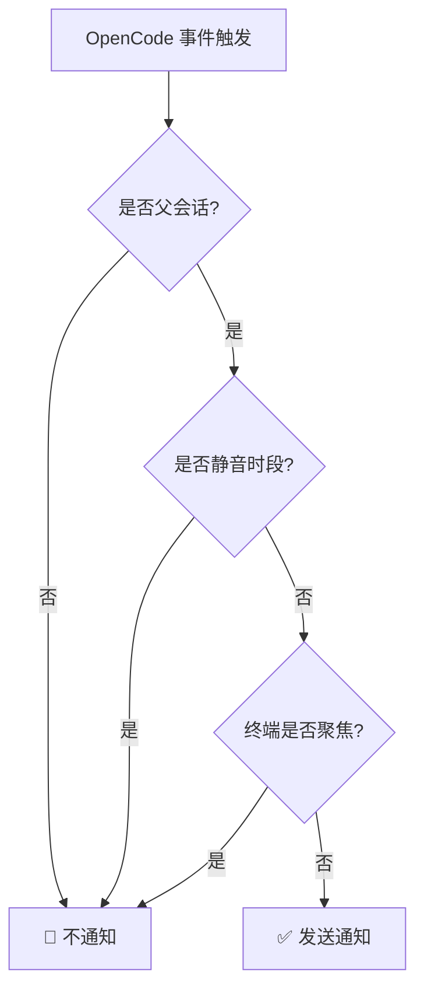

# 静音时段详解：避免特定时间段打扰

## 学完你能做什么

- 在配置文件中启用静音时段，避免在休息时间被打扰
- 理解静音时段的工作原理和时间计算逻辑
- 配置跨午夜时间段（如 22:00 - 08:00）
- 了解静音时段与其他智能过滤机制的优先级关系

## 你现在的困境

你可能遇到过这种情况：晚上 10 点委托了一个任务给 AI，然后去休息了。结果半夜 2 点 AI 完成了任务，"叮"的一声通知把你吵醒。或者你在午休时让 AI 处理一些文件，结果 12:05 通知响了，打断了你的休息。

::: info 什么是静音时段
静音时段是一个时间段配置，在这个时间段内，opencode-notify 会停止发送所有通知，避免在你不希望被打扰的时间收到提醒。
:::

## 什么时候用这一招

- **夜间休息**：设置 22:00 - 08:00，避免睡觉时被打扰
- **午休时间**：设置 12:00 - 13:00，避免中午休息时被打扰
- **专注工作时间**：设置 09:00 - 12:00，避免开会时被通知打断
- **周末不工作**：设置整个周末为静音时段

静音时段最适合用来保护你的休息时间或专注工作时间，让 AI 在后台默默完成任务，等你准备好再来检查结果。

## 核心思路

静音时段的工作原理很简单：

1. **时间检查**：每次需要发送通知前，插件检查当前时间是否在配置的静音时段内
2. **时间段支持**：支持任意时间段，包括跨午夜的时间段（如 22:00 - 08:00）
3. **优先级中等**：静音时段的检查优先级低于父会话检查，但高于终端焦点检测。如果当前是子会话且 `notifyChildSessions` 为 false，会直接跳过静音时段检查。

::: tip 静音时段 vs 临时禁用
静音时段是**定期重复**的时间配置，比如每天的晚上 10 点到早上 8 点。如果你想**临时禁用**通知（比如接下来 1 小时不想要通知），可以在配置文件中设置 `"enabled": false`，或者删除配置文件返回默认值。
:::

## 跟我做

### 第 1 步：打开配置文件

配置文件位于：`~/.config/opencode/kdco-notify.json`

如果文件不存在，你可以先创建它：

::: code-group

```bash [macOS/Linux]
vim ~/.config/opencode/kdco-notify.json
```

```powershell [Windows]
notepad $env:USERPROFILE\.config\opencode\kdco-notify.json
```

:::

你应该看到配置文件内容（如果存在），或者一个空白文件。

### 第 2 步：添加静音时段配置

在配置文件中添加或修改 `quietHours` 部分：

```json
{
  "quietHours": {
    "enabled": true,
    "start": "22:00",
    "end": "08:00"
  }
}
```

**配置项说明**：

| 配置项 | 类型 | 默认值 | 说明 |
|--- | --- | --- | ---|
| `enabled` | boolean | `false` | 是否启用静音时段 |
| `start` | string | `"22:00"` | 静音开始时间，格式为 `"HH:MM"` |
| `end` | string | `"08:00"` | 静音结束时间，格式为 `"HH:MM"` |

### 第 3 步：保存配置文件

保存文件并退出编辑器。

**检查点 ✅**：运行以下命令验证配置文件格式是否正确：

```bash
cat ~/.config/opencode/kdco-notify.json | jq .
```

你应该看到格式化的 JSON 内容，没有错误提示。

::: tip 没有安装 jq？
如果系统没有 `jq` 命令，可以跳过此检查，或者在浏览器中复制 JSON 内容到 [JSON 验证器](https://jsonlint.com/) 检查。
:::

### 第 4 步：重启 OpenCode

配置文件修改后，需要重启 OpenCode 才能生效。

**检查点 ✅**：重启后，OpenCode 会自动重新加载配置。

### 第 5 步：测试静音时段

为了验证静音时段是否生效，你可以：

1. 将 `start` 和 `end` 设置为当前时间附近的值（比如现在是 14:00，设置为 13:55 - 14:05）
2. 委托一个简单的任务给 AI
3. 等待任务完成

你应该看到：**在静音时段内，不会收到任何通知**。

**注意**：如果当前时间不在静音时段内，或者 `enabled` 为 `false`，你会正常收到通知。

### 第 6 步：恢复为常用配置

测试完成后，将配置改回常用的时间段（比如 22:00 - 08:00）：

```json
{
  "quietHours": {
    "enabled": true,
    "start": "22:00",
    "end": "08:00"
  }
}
```

保存配置文件并重启 OpenCode。

## 踩坑提醒

### 常见错误 1：忘记启用静音时段

**问题**：配置了 `start` 和 `end`，但仍然收到通知。

**原因**：`enabled` 字段为 `false` 或未设置。

**解决方案**：确保 `enabled` 设置为 `true`：

```json
{
  "quietHours": {
    "enabled": true,
    "start": "22:00",
    "end": "08:00"
  }
}
```

### 常见错误 2：时间格式错误

**问题**：配置后不生效，或者启动时报错。

**原因**：时间格式不是 `"HH:MM"` 格式，或者使用了 12 小时制（AM/PM）。

**错误示例**：
```json
{
  "start": "10 PM",  // ❌ 错误：不支持 AM/PM
  "end": "8:00"      // ⚠️ 可以工作，但建议使用 "08:00" 保持一致性
}
```

**正确示例**：
```json
{
  "start": "22:00",  // ✅ 正确：24 小时制，推荐使用前导零
  "end": "08:00"     // ✅ 正确：24 小时制，推荐使用前导零
}
```

### 常见错误 3：跨午夜时间理解错误

**问题**：设置了 22:00 - 08:00，但发现白天某些时间段也被静音了。

**原因**：误以为 `start` 必须小于 `end`，导致时间段计算错误。

**正确理解**：
- 22:00 - 08:00 表示：**晚上 10 点到次日早上 8 点**
- 这是一个跨午夜的时间段，插件会自动识别
- 不是 08:00 - 22:00（这样设置的话，整个白天都会被静音）

::: tip 跨午夜时间段的验证
如果你想验证跨午夜时间段是否正确配置，可以在配置文件中设置一个短的测试时段（比如 10 分钟），然后观察是否在预期的时间段内不收到通知。
:::

### 常见错误 4：未重启 OpenCode

**问题**：修改配置文件后，静音时段仍然按照旧配置工作。

**原因**：配置文件在插件启动时加载一次，不会实时监听文件变化。

**解决方案**：每次修改配置文件后，必须重启 OpenCode 才能生效。

## 静音时段与其他过滤机制的关系

静音时段在智能过滤机制中的位置：



**关键点**：

1. **静音时段优先级中等**：父会话检查优先级最高，静音时段次之。如果当前是子会话且 `notifyChildSessions` 为 false，会直接跳过静音时段检查。但通过父会话检查后，无论终端是否聚焦，只要在静音时段内，就不会发送通知。
2. **与终端焦点检测无关**：即使终端未聚焦，在静音时段内也不会发送通知
3. **执行顺序**：父会话检查先于静音时段执行。如果父会话检查通过（即当前是父会话或 `notifyChildSessions` 为 true），才会继续检查静音时段。

::: warning 特殊情况：权限请求和问题询问
权限请求（`permission.updated`）和问题询问（`tool.execute.before`）在源码中**也受静音时段约束**。这意味着在静音时段内，即使 AI 被阻塞等待你的授权或回答，也不会发送通知。
:::

## 常用配置示例

### 示例 1：夜间休息

配置晚上 10 点到早上 8 点为静音时段：

```json
{
  "quietHours": {
    "enabled": true,
    "start": "22:00",
    "end": "08:00"
  }
}
```

### 示例 2：午休时间

配置中午 12 点到下午 1 点为静音时段：

```json
{
  "quietHours": {
    "enabled": true,
    "start": "12:00",
    "end": "13:00"
  }
}
```

### 示例 3：专注工作时间

配置上午 9 点到中午 12 点为静音时段（比如在开会时不被通知打扰）：

```json
{
  "quietHours": {
    "enabled": true,
    "start": "09:00",
    "end": "12:00"
  }
}
```

### 示例 4：完整配置

将静音时段与其他配置项一起使用：

```json
{
  "enabled": true,
  "notifyChildSessions": false,
  "suppressWhenFocused": true,
  "sounds": {
    "idle": "Glass",
    "error": "Basso",
    "permission": "Submarine"
  },
  "quietHours": {
    "enabled": true,
    "start": "22:00",
    "end": "08:00"
  },
  "terminal": "ghostty"
}
```

## 本课小结

静音时段是 opencode-notify 的一个重要功能，用于避免在特定时间段被打扰：

1. **配置方式**：在 `~/.config/opencode/kdco-notify.json` 中配置 `quietHours` 部分
2. **时间格式**：使用 24 小时制的 `"HH:MM"` 格式，如 `"22:00"` 和 `"08:00"`
3. **跨午夜支持**：支持跨午夜的时间段，如 `"22:00" - "08:00"` 表示晚上 10 点到次日早上 8 点
4. **执行顺序**：父会话检查 → 静音时段 → 终端焦点检测。静音时段在通过父会话检查后才会生效
5. **需要重启**：修改配置文件后必须重启 OpenCode 才能生效

通过合理配置静音时段，你可以让 AI 在休息时间或专注工作时默默完成任务，等准备好再来检查结果。

## 下一课预告

> 下一课我们学习 **[终端检测原理](../terminal-detection/)**。
>
> 你会学到：
> - opencode-notify 如何自动检测你使用的终端
> - 支持的 37+ 终端模拟器列表
> - 手动指定终端类型的方法
> - macOS 焦点检测的实现原理

---

## 附录：源码参考

<details>
<summary><strong>点击展开查看源码位置</strong></summary>

> 更新时间：2026-01-27

| 功能 | 文件路径 | 行号 |
|--- | --- | ---|
| 静音时段检查 | [`src/notify.ts`](https://github.com/kdcokenny/opencode-notify/blob/main/src/notify.ts#L181-L199) | 181-199 |
| 配置接口定义 | [`src/notify.ts`](https://github.com/kdcokenny/opencode-notify/blob/main/src/notify.ts#L30-L48) | 30-48 |
| 默认配置 | [`src/notify.ts`](https://github.com/kdcokenny/opencode-notify/blob/main/src/notify.ts#L56-L68) | 56-68 |
| 任务完成处理中的静音检查 | [`src/notify.ts`](https://github.com/kdcokenny/opencode-notify/blob/main/src/notify.ts#L262) | 262 |
| 错误通知处理中的静音检查 | [`src/notify.ts`](https://github.com/kdcokenny/opencode-notify/blob/main/src/notify.ts#L300) | 300 |
| 权限请求处理中的静音检查 | [`src/notify.ts`](https://github.com/kdcokenny/opencode-notify/blob/main/src/notify.ts#L323) | 323 |
| 问题询问处理中的静音检查 | [`src/notify.ts`](https://github.com/kdcokenny/opencode-notify/blob/main/src/notify.ts#L341) | 341 |

**关键常量**：

- `DEFAULT_CONFIG.quietHours`：默认静音时段配置（第 63-67 行）
  - `enabled: false`：默认不启用静音时段
  - `start: "22:00"`：默认静音开始时间
  - `end: "08:00"`：默认静音结束时间

**关键函数**：

- `isQuietHours(config: NotifyConfig): boolean`：检查当前时间是否在静音时段内（第 181-199 行）
  - 首先检查 `config.quietHours.enabled` 是否为 `true`
  - 将当前时间转换为分钟数
  - 将开始和结束时间转换为分钟数
  - 处理跨午夜时间段（`startMinutes > endMinutes`）
  - 返回 `true` 表示在静音时段内，`false` 表示不在

**业务规则**：

- BR-1-3：静音时段内不发送通知（`notify.ts:262`）
- BR-3-2：静音时段支持跨午夜（如 22:00-08:00）（`notify.ts:193-196`）
- BR-4-1：当前时间在静音时段内时不发送通知（`notify.ts:182-198`）
- BR-4-2：支持跨午夜时段（如 22:00-08:00）（`notify.ts:194-196`）

</details>
