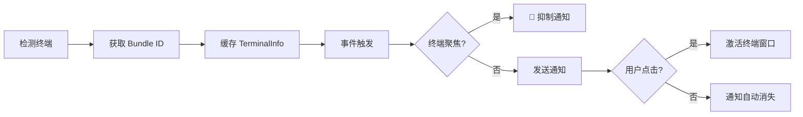
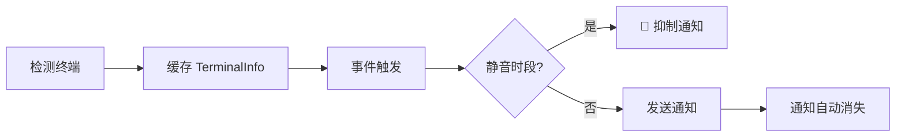

# 终端检测原理：自动识别机制与 macOS 焦点检测详解

## 学完你能做什么

- 深入理解终端自动检测的工作机制和实现原理
- 掌握 macOS 焦点检测和 Bundle ID 动态获取的技术细节
- 学会手动覆盖终端类型以解决检测失败问题
- 了解不同平台（macOS/Windows/Linux）的检测差异
- 读懂终端检测相关的源码实现

## 你现在的困境

你已经知道 opencode-notify 支持 37+ 终端，也知道可以手动指定终端类型。但你想深入了解：

- 终端检测是如何在底层实现的？
- macOS 的焦点检测是通过什么机制实现的？
- 为什么 macOS 需要获取 Bundle ID，而 Windows/Linux 不需要？
- 自动检测失败时，插件是如何处理的？
- tmux 等终端复用器是如何被识别的？

本课将带你深入源码，解答这些技术细节。

## 核心思路

终端检测的实现分为三个层次：

```
1. 自动检测层：detect-terminal 库识别终端类型
    ↓
2. 平台适配层：macOS/Windows/Linux 特定处理
    ↓
3. 功能增强层：焦点检测、点击聚焦、Bundle ID 获取
```

**关键设计原则**：

- **启动时检测一次**：插件启动时检测终端，缓存结果用于后续所有通知（性能优化）
- **配置覆盖优先**：手动指定的 `terminal` 配置优先于自动检测
- **失败降级处理**：检测失败时不阻止通知发送，只是禁用智能过滤功能
- **平台差异适配**：macOS 支持完整功能，Windows/Linux 支持基础通知

::: info 为什么要启动时检测？
终端检测涉及进程扫描、osascript 调用等操作，如果每次通知前都检测，会带来显著性能开销。因此插件在启动时检测一次，缓存 `TerminalInfo` 对象，后续所有通知复用这个缓存。
:::

## 终端检测的完整流程

### 源码分析：detectTerminalInfo()

让我们逐行分析核心检测函数：

```typescript
// src/notify.ts:145-164
async function detectTerminalInfo(config: NotifyConfig): Promise<TerminalInfo> {
    // Use config override if provided
    const terminalName = config.terminal || detectTerminal() || null

    if (!terminalName) {
        return { name: null, bundleId: null, processName: null }
    }

    // Get process name for focus detection
    const processName = TERMINAL_PROCESS_NAMES[terminalName.toLowerCase()] || terminalName

    // Dynamically get bundle ID from macOS (no hardcoding!)
    const bundleId = await getBundleId(processName)

    return {
        name: terminalName,
        bundleId,
        processName,
    }
}
```

**步骤拆解**：

| 步骤 | 代码 | 说明 |
|------|------|------|
| 1 | `config.terminal \|\| detectTerminal()` | 优先使用配置覆盖，否则自动检测 |
| 2 | `!terminalName ? return {...}` | 检测失败时返回空对象 |
| 3 | `TERMINAL_PROCESS_NAMES[...]` | 查找映射表获取 macOS 进程名 |
| 4 | `await getBundleId()` | macOS 动态获取 Bundle ID |
| 5 | `return { name, bundleId, processName }` | 返回完整的终端信息 |

**返回的 `TerminalInfo` 结构**：

```typescript
interface TerminalInfo {
    name: string | null       // 终端名称，如 "ghostty"
    bundleId: string | null   // macOS Bundle ID，如 "com.mitchellh.ghostty"
    processName: string | null // macOS 进程名，如 "Ghostty"
}
```

::: details 为什么 macOS 需要三个字段？
- **name**：终端的通用名称（来自 detect-terminal 库）
- **processName**：macOS 进程管理器中的进程名（用于焦点检测）
- **bundleId**：macOS 应用的唯一标识符（用于点击聚焦）

例如：
- `name = "ghostty"`（detect-terminal 返回）
- `processName = "Ghostty"`（映射表查找）
- `bundleId = "com.mitchellh.ghostty"`（osascript 动态查询）
:::

## detect-terminal 库的工作原理

### 什么是 detect-terminal？

`detect-terminal` 是一个专门用于识别终端模拟器的 Node.js 库，它通过扫描系统进程来识别当前运行的终端。

**检测方法**：

1. **进程扫描**：检查当前进程的父进程链
2. **环境变量检测**：检查 `TERM`、`TERM_PROGRAM` 等环境变量
3. **已知进程名匹配**：与 37+ 已知终端的进程名对比

**支持的检测方式**：

```typescript
// detect-terminal 内部逻辑（简化）
function detect() {
    // 1. 检查环境变量
    if (process.env.TERM_PROGRAM) {
        return process.env.TERM_PROGRAM
    }

    // 2. 扫描父进程链
    const parentProcess = getParentProcess()
    if (isKnownTerminal(parentProcess.name)) {
        return parentProcess.name
    }

    // 3. 检查特定环境变量
    if (process.env.TMUX) return 'tmux'
    if (process.env.VSCODE_PID) return 'vscode'

    return null
}
```

**支持的终端数量**：37+（详见[完整列表](https://github.com/jonschlinkert/detect-terminal#supported-terminals)）

## macOS 特殊处理

### 1. 进程名映射表

源码中定义了终端名称到 macOS 进程名的映射：

```typescript
// src/notify.ts:71-84
const TERMINAL_PROCESS_NAMES: Record<string, string> = {
    ghostty: "Ghostty",
    kitty: "kitty",
    iterm: "iTerm2",
    iterm2: "iTerm2",
    wezterm: "WezTerm",
    alacritty: "Alacritty",
    terminal: "Terminal",
    apple_terminal: "Terminal",
    hyper: "Hyper",
    warp: "Warp",
    vscode: "Code",
    "vscode-insiders": "Code - Insiders",
}
```

**为什么需要映射表？**

- detect-terminal 返回的终端名称可能是小写或简写（如 `"ghostty"`）
- macOS 进程管理器中的进程名可能有大小写差异（如 `"Ghostty"`）
- 某些终端有多种写法（如 `"iterm"` 和 `"iterm2"` 都对应 `"iTerm2"`）

**映射逻辑**：

```typescript
const processName = TERMINAL_PROCESS_NAMES[terminalName.toLowerCase()] || terminalName
```

- 先将终端名转为小写查找映射表
- 找到则使用映射后的进程名
- 找不到则使用原始终端名

### 2. 动态获取 Bundle ID

**源码实现**：

```typescript
// src/notify.ts:135-137
async function getBundleId(appName: string): Promise<string | null> {
    return runOsascript(`id of application "${appName}"`)
}
```

**osascript 命令**：

```applescript
id of application "Ghostty"
-- 返回: com.mitchellh.ghostty
```

**为什么不硬编码 Bundle ID？**

硬编码的缺点：
- ❌ 终端更新时 Bundle ID 可能变化
- ❌ 需要手动维护 37+ 终端的 Bundle ID 列表
- ❌ 新终端发布时需要更新代码

动态获取的优点：
- ✅ 自动适配终端版本变化
- ✅ 减少维护成本
- ✅ 理论上支持任何 macOS 终端

### 3. 焦点检测实现

**源码实现**：

```typescript
// src/notify.ts:139-143
async function getFrontmostApp(): Promise<string | null> {
    return runOsascript(
        'tell application "System Events" to get name of first application process whose frontmost is true',
    )
}

// src/notify.ts:166-175
async function isTerminalFocused(terminalInfo: TerminalInfo): Promise<boolean> {
    if (!terminalInfo.processName) return false
    if (process.platform !== "darwin") return false

    const frontmost = await getFrontmostApp()
    if (!frontmost) return false

    // Case-insensitive comparison
    return frontmost.toLowerCase() === terminalInfo.processName.toLowerCase()
}
```

**osascript 命令**：

```applescript
tell application "System Events" to get name of first application process whose frontmost is true
-- 返回: Ghostty
```

**检测流程**：

```
1. 检查平台：非 macOS 直接返回 false
    ↓
2. 检查 processName：没有进程名直接返回 false
    ↓
3. 获取前台应用：通过 osascript 查询
    ↓
4. 比较进程名：不区分大小写
    ↓
5. 返回结果：相同则聚焦，不同则未聚焦
```

**在通知发送流程中的使用**：

```typescript
// src/notify.ts:264-265
// Check if terminal is focused (suppress notification if user is already looking)
if (await isTerminalFocused(terminalInfo)) return
```

当终端在前台时，插件会抑制通知发送，避免重复提醒。

## 配置覆盖机制

### 什么时候需要手动覆盖？

**适用场景**：

1. **自动检测失败**：detect-terminal 无法识别你的终端
2. **嵌套终端场景**：在 tmux 中使用 Alacritty，希望识别为 tmux
3. **检测结果不准确**：误识别为其他终端

### 配置方法

**配置文件**：`~/.config/opencode/kdco-notify.json`

```json
{
  "terminal": "ghostty"
}
```

**优先级逻辑**（源码第 147 行）：

```typescript
const terminalName = config.terminal || detectTerminal() || null
```

**优先级顺序**：

1. **配置覆盖**（`config.terminal`）：最高优先级
2. **自动检测**（`detectTerminal()`）：次优先级
3. **降级处理**（`null`）：检测失败时使用 null

::: tip 配置覆盖的适用场景
如果你的终端能被正确识别，**不建议手动覆盖**。配置覆盖主要用于解决检测失败或特殊场景问题。
:::

## 平台差异对比

### macOS

| 功能 | 支持情况 | 实现方式 |
|------|---------|---------|
| 原生通知 | ✅ | node-notifier (NSUserNotificationCenter) |
| 终端检测 | ✅ | detect-terminal 库 |
| 焦点检测 | ✅ | osascript 查询前台应用 |
| 点击聚焦 | ✅ | node-notifier activate 参数 |
| Bundle ID 获取 | ✅ | osascript 动态查询 |
| 自定义音效 | ✅ | node-notifier sound 参数 |

**完整支持流程**：



### Windows

| 功能 | 支持情况 | 实现方式 |
|------|---------|---------|
| 原生通知 | ✅ | node-notifier (SnoreToast) |
| 终端检测 | ✅ | detect-terminal 库 |
| 焦点检测 | ❌ | 系统限制 |
| 点击聚焦 | ❌ | 系统限制 |
| Bundle ID 获取 | ❌ | Windows 无此概念 |
| 自定义音效 | ❌ | 使用系统默认声音 |

**简化流程**：



### Linux

| 功能 | 支持情况 | 实现方式 |
|------|---------|---------|
| 原生通知 | ✅ | node-notifier (notify-send) |
| 终端检测 | ✅ | detect-terminal 库 |
| 焦点检测 | ❌ | 系统限制 |
| 点击聚焦 | ❌ | 系统限制 |
| Bundle ID 获取 | ❌ | Linux 无此概念 |
| 自定义音效 | ❌ | 使用桌面环境默认声音 |

**流程与 Windows 相同**，只是通知后端使用 `notify-send`。

## 检测失败的处理

### 源码逻辑

当检测失败时，`detectTerminalInfo()` 返回空对象：

```typescript
if (!terminalName) {
    return { name: null, bundleId: null, processName: null }
}
```

### 对通知功能的影响

| 功能 | 检测失败后的行为 |
|------|-----------------|
| 原生通知 | ✅ **正常工作**（不依赖终端检测） |
| 焦点检测 | ❌ **失效**（`isTerminalFocused()` 直接返回 false） |
| 点击聚焦 | ❌ **失效**（`bundleId` 为 null，不设置 activate 参数） |
| 静音时段 | ✅ **正常工作**（独立于终端检测） |
| 父会话检查 | ✅ **正常工作**（独立于终端检测） |

**示例代码**：

```typescript
// src/notify.ts:166-175
async function isTerminalFocused(terminalInfo: TerminalInfo): Promise<boolean> {
    if (!terminalInfo.processName) return false  // ← 检测失败时直接返回 false
    if (process.platform !== "darwin") return false
    // ...
}

// src/notify.ts:238-240
if (process.platform === "darwin" && terminalInfo.bundleId) {
    notifyOptions.activate = terminalInfo.bundleId  // ← bundleId 为 null 时不设置
}
```

### 如何验证检测状态？

**临时调试方法**（需要修改源码）：

```typescript
// 在 notify.ts 的插件导出处添加
export const NotifyPlugin: Plugin = async (ctx) => {
    const { client } = ctx
    const config = await loadConfig()
    const terminalInfo = await detectTerminalInfo(config)

    // 👇 添加调试日志
    console.log("Terminal Info:", JSON.stringify(terminalInfo, null, 2))

    return {
        // ...
    }
}
```

**正常输出示例**：

```json
{
  "name": "ghostty",
  "bundleId": "com.mitchellh.ghostty",
  "processName": "Ghostty"
}
```

**检测失败示例**：

```json
{
  "name": null,
  "bundleId": null,
  "processName": null
}
```

## 特殊场景：tmux 终端

### tmux 的特殊性

tmux 是一个终端复用器（terminal multiplexer），它允许在一个终端窗口中创建多个会话和窗格。

**检测方式**：

```typescript
// detect-terminal 库通过环境变量检测 tmux
if (process.env.TMUX) return 'tmux'
```

**tmux 的工作流影响**：

在 `terminals/index.md` 中提到，tmux 工作流中不进行焦点检测。这是因为：

1. **多窗口场景**：tmux 可能在多个终端窗口中运行
2. **焦点语义模糊**：无法确定用户在关注哪个 tmux 窗格
3. **用户体验考虑**：避免抑制重要通知

**源码证据**（`handleQuestionAsked` 函数）：

```typescript
// src/notify.ts:340-341
// Guard: quiet hours only (no focus check for questions - tmux workflow)
if (isQuietHours(config)) return
```

注意：对于 `question` 类型的事件，源码明确注释了"no focus check for questions - tmux workflow"。

## 手动配置终端类型的最佳实践

### 选择合适的终端名称

**原则**：使用 detect-terminal 库识别的标准名称。

**常用对照表**：

| 你的终端 | 配置值 | 检测结果（detect-terminal） |
|---------|-------|--------------------------|
| Ghostty | `"ghostty"` | ✅ |
| iTerm2 | `"iterm2"` 或 `"iterm"` | ✅ |
| Kitty | `"kitty"` | ✅ |
| WezTerm | `"wezterm"` | ✅ |
| Alacritty | `"alacritty"` | ✅ |
| macOS Terminal.app | `"terminal"` 或 `"apple_terminal"` | ✅ |
| Hyper | `"hyper"` | ✅ |
| Warp | `"warp"` | ✅ |
| VS Code Stable | `"vscode"` | ✅ |
| VS Code Insiders | `"vscode-insiders"` | ✅ |
| Windows Terminal | `"windows-terminal"` 或 `"Windows Terminal"` | ⚠️ 可能需要尝试两种 |

### 验证配置是否生效

**方法 1：检查日志**

如果启用了调试日志（见上文），你应该看到：

```json
{
  "name": "ghostty",  // ← 应该是你配置的终端名称
  "bundleId": "com.mitchellh.ghostty",
  "processName": "Ghostty"
}
```

**方法 2：功能测试**

1. 配置终端类型后，重启 OpenCode
2. 启动一个 AI 任务
3. 切换到其他窗口（让终端失去焦点）
4. 等待任务完成

你应该看到：收到通知，且点击通知（macOS）能聚焦到终端窗口。

## 踩坑提醒

### 常见问题 1：配置后检测仍然失败

**现象**：设置了 `"terminal": "ghostty"`，但通知功能异常。

**排查步骤**：

1. **检查 JSON 格式**：

```bash
cat ~/.config/opencode/kdco-notify.json | jq .
```

2. **检查终端名称拼写**：

- 确保使用小写（如 `"ghostty"` 而非 `"Ghostty"`）
- 确保是 detect-terminal 支持的名称

3. **检查是否重启 OpenCode**：

配置文件修改后必须重启 OpenCode 才能生效。

### 常见问题 2：macOS 焦点检测不准确

**现象**：终端在前台时仍然弹出通知，或终端在后台时不弹出通知。

**可能原因**：

1. **进程名不匹配**：

检查映射表中是否有你的终端进程名：

```typescript
const TERMINAL_PROCESS_NAMES: Record<string, string> = {
    // ... 查看你的终端是否在列表中
}
```

2. **osascript 执行失败**：

在终端中手动测试：

```bash
osascript -e 'tell application "System Events" to get name of first application process whose frontmost is true'
```

应该返回当前前台应用名（如 `Ghostty`）。

3. **大小写敏感**：

源码使用不区分大小写的比较：

```typescript
return frontmost.toLowerCase() === terminalInfo.processName.toLowerCase()
```

确保映射表中的进程名与实际进程名大小写一致。

### 常见问题 3：Windows/Linux 手动配置无效

**现象**：在 Windows/Linux 上配置 `"terminal": "xxx"`，但检测仍然失败。

**说明**：

Windows/Linux 的终端检测依赖 detect-terminal 库，配置覆盖功能在源码中是跨平台实现的。如果配置无效，可能原因：

1. **终端名称不正确**：确保使用 detect-terminal 支持的名称
2. **终端不在支持列表中**：查看 [detect-terminal 完整列表](https://github.com/jonschlinkert/detect-terminal#supported-terminals)

**注意**：Windows/Linux 不支持焦点检测和点击聚焦，即使配置正确也只影响终端检测，不会启用这些功能。

### 常见问题 4：嵌套终端场景检测错误

**场景**：在 tmux 中使用 Alacritty，希望识别为 tmux。

**现象**：自动检测识别为 `"alacritty"`，但你希望识别为 `"tmux"`。

**解决方法**：

手动配置 `"terminal": "tmux"`：

```json
{
  "terminal": "tmux"
}
```

**注意**：这样配置后，插件会认为你在使用 tmux，不会进行焦点检测（符合 tmux 工作流）。

## 本课小结

终端检测是 opencode-notify 智能过滤功能的基础：

1. **检测流程**：启动时通过 detect-terminal 库自动识别终端，缓存结果
2. **macOS 特殊处理**：
   - 进程名映射表（`TERMINAL_PROCESS_NAMES`）
   - 动态获取 Bundle ID（通过 osascript）
   - 焦点检测（查询前台应用进程）
3. **配置覆盖**：手动指定终端类型优先于自动检测
4. **平台差异**：
   - macOS：完整功能（通知 + 焦点检测 + 点击聚焦）
   - Windows/Linux：基础通知功能
5. **失败处理**：检测失败时不阻止通知，只是禁用智能过滤
6. **特殊场景**：tmux 工作流不支持焦点检测，避免抑制重要通知

**关键源码位置**：

- `detectTerminalInfo()`：终端检测主函数（第 145-164 行）
- `TERMINAL_PROCESS_NAMES`：macOS 进程名映射表（第 71-84 行）
- `getBundleId()`：动态获取 Bundle ID（第 135-137 行）
- `isTerminalFocused()`：焦点检测实现（第 166-175 行）

## 下一课预告

> 下一课我们学习 **[高级用法](../advanced-usage/)**。
>
> 你会学到：
> - 配置技巧和最佳实践
> - 多终端环境配置
> - 性能优化建议
> - 与其他 OpenCode 插件的协同使用

---

## 附录：源码参考

<details>
<summary><strong>点击展开查看源码位置</strong></summary>

> 更新时间：2026-01-27

| 功能 | 文件路径 | 行号 |
| --- | --- | --- |
| 终端检测主函数 | [`src/notify.ts`](https://github.com/kdcokenny/opencode-notify/blob/main/src/notify.ts#L145-L164) | 145-164 |
| macOS 进程名映射表 | [`src/notify.ts`](https://github.com/kdcokenny/opencode-notify/blob/main/src/notify.ts#L71-L84) | 71-84 |
| macOS Bundle ID 获取 | [`src/notify.ts`](https://github.com/kdcokenny/opencode-notify/blob/main/src/notify.ts#L135-L137) | 135-137 |
| macOS 前台应用检测 | [`src/notify.ts`](https://github.com/kdcokenny/opencode-notify/blob/main/src/notify.ts#L139-L143) | 139-143 |
| macOS 焦点检测 | [`src/notify.ts`](https://github.com/kdcokenny/opencode-notify/blob/main/src/notify.ts#L166-L175) | 166-175 |
| osascript 执行封装 | [`src/notify.ts`](https://github.com/kdcokenny/opencode-notify/blob/main/src/notify.ts#L120-L133) | 120-133 |
| 配置接口定义 | [`src/notify.ts`](https://github.com/kdcokenny/opencode-notify/blob/main/src/notify.ts#L30-L54) | 30-54 |
| 任务完成处理中的焦点检测 | [`src/notify.ts`](https://github.com/kdcokenny/opencode-notify/blob/main/src/notify.ts#L265) | 265 |
| 错误通知处理中的焦点检测 | [`src/notify.ts`](https://github.com/kdcokenny/opencode-notify/blob/main/src/notify.ts#L303) | 303 |
| 权限请求处理中的焦点检测 | [`src/notify.ts`](https://github.com/kdcokenny/opencode-notify/blob/main/src/notify.ts#L326) | 326 |
| macOS 点击聚焦设置 | [`src/notify.ts`](https://github.com/kdcokenny/opencode-notify/blob/main/src/notify.ts#L238-L240) | 238-240 |
| 插件启动时的终端检测 | [`src/notify.ts`](https://github.com/kdcokenny/opencode-notify/blob/main/src/notify.ts#L364) | 364 |

**关键常量**：

- `TERMINAL_PROCESS_NAMES`：终端名称到 macOS 进程名的映射表（第 71-84 行）
  - `ghostty: "Ghostty"`
  - `kitty: "kitty"`
  - `iterm: "iTerm2"` / `iterm2: "iTerm2"`
  - `wezterm: "WezTerm"`
  - `alacritty: "Alacritty"`
  - `terminal: "Terminal"` / `apple_terminal: "Terminal"`
  - `hyper: "Hyper"`
  - `warp: "Warp"`
  - `vscode: "Code"` / `"vscode-insiders": "Code - Insiders"`

**关键函数**：

- `detectTerminalInfo(config: NotifyConfig): Promise<TerminalInfo>`：终端检测主函数（第 145-164 行）
  - 优先使用配置覆盖（`config.terminal`）
  - 调用 detect-terminal 库自动检测
  - 查找进程名映射表
  - 动态获取 Bundle ID（macOS）
  - 返回完整的终端信息对象

- `isTerminalFocused(terminalInfo: TerminalInfo): Promise<boolean>`：检测终端是否聚焦（第 166-175 行）
  - 检查平台（仅 macOS）
  - 检查 processName 是否存在
  - 获取当前前台应用（osascript）
  - 不区分大小写比较进程名
  - 返回 true 表示终端在前台

- `getBundleId(appName: string): Promise<string | null>`：动态获取 macOS 应用 Bundle ID（第 135-137 行）
  - 使用 osascript 查询应用标识符
  - 返回格式如 `"com.mitchellh.ghostty"`

- `getFrontmostApp(): Promise<string | null>`：获取 macOS 前台应用名称（第 139-143 行）
  - 使用 osascript 查询 System Events
  - 返回前台应用的进程名

- `runOsascript(script: string): Promise<string | null>`：执行 AppleScript 命令（第 120-133 行）
  - 平台检查（仅 macOS）
  - 使用 Bun.spawn 执行 osascript
  - 捕获输出并返回
  - 异常处理返回 null

**业务规则**：

- BR-2-1：使用 detect-terminal 库识别 37+ 终端（`notify.ts:147`）
- BR-2-2：终端名称到 macOS 进程名的映射表（`notify.ts:71-84`）
- BR-2-3：Bundle ID 动态获取，不硬编码（`notify.ts:135-137`）
- BR-2-4：通过 TMUX 环境变量检测 tmux 会话（检测库实现）
- BR-1-2：终端聚焦时抑制通知（`notify.ts:265`）
- BR-1-6：macOS 支持点击通知聚焦终端（`notify.ts:238-240`）

**外部依赖**：

- [detect-terminal](https://github.com/jonschlinkert/detect-terminal)：终端检测库，支持 37+ 终端模拟器
- [node-notifier](https://github.com/mikaelbr/node-notifier)：跨平台原生通知库
- macOS osascript：系统命令行工具，用于执行 AppleScript

</details>
