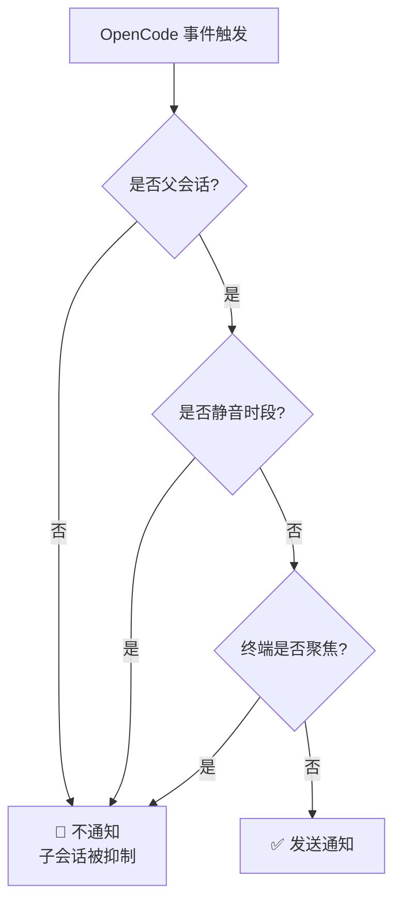
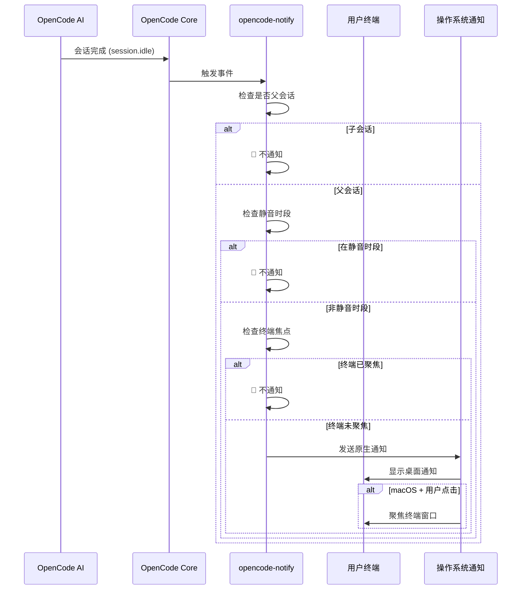

# 工作原理：通知、过滤与触发机制

## 学完你能做什么

- 理解 opencode-notify 的四种通知类型及其触发时机
- 掌握智能过滤机制的工作原理（为什么不会收到太多通知）
- 了解通知从触发到显示的完整流程
- 知道如何通过配置调整通知行为

## 核心思路

::: tip 设计哲学
opencode-notify 遵循一个核心原则：**"通知用户时才通知，而不是为每个微小事件通知"**。
:::

这个插件的工作方式可以拆解为三个关键环节：

1. **监听** - 等待 OpenCode 发生重要事件
2. **过滤** - 决定这个事件是否需要通知
3. **发送** - 通过操作系统原生通知提醒你

理解这个流程，你就能知道为什么插件既能及时提醒，又不会像垃圾信息一样频繁打扰。

## 四种通知类型

opencode-notify 监听四类 OpenCode 事件，每类都有明确的触发场景：

### 1. 任务完成通知 (session.idle)

**触发时机**：当 AI 会话进入空闲状态（任务完成）

| 项目 | 说明 |
|--- | ---|
| 通知标题 | Ready for review |
| 通知内容 | 会话标题（最多 50 字符） |
| 默认音效 | Glass (macOS) |

**为什么重要**：这是最常用的通知，让你知道 AI 已经完成任务，可以过来检查结果了。

### 2. 错误通知 (session.error)

**触发时机**：当 AI 会话执行出错

| 项目 | 说明 |
|--- | ---|
| 通知标题 | Something went wrong |
| 通知内容 | 错误摘要（最多 100 字符） |
| 默认音效 | Basso (macOS) |

**为什么重要**：错误需要及时处理，否则后续操作可能无法正常进行。

### 3. 权限请求通知 (permission.updated)

**触发时机**：当 AI 需要用户授权执行某操作（如读取文件、访问网络）

| 项目 | 说明 |
|--- | ---|
| 通知标题 | Waiting for you |
| 通知内容 | OpenCode needs your input |
| 默认音效 | Submarine (macOS) |

**为什么重要**：AI 被阻塞了，需要你手动授权才能继续，不处理会导致任务卡住。

### 4. 问题询问通知 (tool.execute.before)

**触发时机**：当 AI 使用 `question` 工具向你提问

| 项目 | 说明 |
|--- | ---|
| 通知标题 | Question for you |
| 通知内容 | OpenCode needs your input |
| 默认音效 | Submarine (macOS) |

**为什么重要**：AI 需要更多信息才能继续，比如确认某个决策或澄清需求。

::: info 四种通知的优先级
权限请求和问题询问的优先级最高，因为 AI 在这些事件下是完全阻塞的；错误通知次之，因为任务已失败；任务完成通知的优先级相对较低，因为你可以在方便的时候再检查。
:::

## 智能过滤机制

这是 opencode-notify 最大的亮点——通过多层过滤，确保你只收到真正需要关注的通知。

### 过滤层级概览



### 层级 1：父会话检查

**规则**：默认只通知父会话（根会话），不通知子会话。

**原理**：OpenCode 的任务可能是嵌套的。比如你让 AI "优化代码库"，它可能会拆分成多个子任务：
- 父会话："优化整个代码库"
- 子会话 1："优化 src/components 目录"
- 子会话 2："优化 src/utils 目录"

如果所有子会话都通知，你会收到一堆通知。opencode-notify 只在父会话完成时通知一次。

::: tip 何时需要子会话通知？
如果你正在监控单个 AI 的多个并发任务，可以在配置中设置 `notifyChildSessions: true` 启用子会话通知。
:::

**特殊例外**：
- **权限请求通知**：始终通知，不检查父会话（因为权限问题必须处理）
- **问题询问通知**：始终通知，不检查父会话

### 层级 2：静音时段检查

**规则**：在配置的静音时间段内，不发送任何通知。

**原理**：避免在夜间或休息时间被打扰。配置示例：

```json
{
  "quietHours": {
    "enabled": true,
    "start": "22:00",
    "end": "08:00"
  }
}
```

**跨午夜支持**：静音时段可以跨午夜，比如 `22:00 - 08:00` 会正确识别为晚上 10 点到次日早上 8 点。

::: info 静音时段检查优先级
静音时段的优先级高于其他所有检查。即使在静音时段内，终端不聚焦或父会话等条件也不会绕过静音时段。
:::

### 层级 3：终端焦点检测

**规则**：当终端窗口是当前活动窗口时，不发送通知。

**原理**：你正在看终端时，AI 完成任务会直接显示在屏幕上，不需要额外通知。

**平台支持**：
- ✅ **macOS**：完全支持，通过 `osascript` 检测前台应用
- ❌ **Windows**：不支持
- ❌ **Linux**：不支持

**检测机制**（macOS）：
1. 使用 `detect-terminal` 库识别你的终端（支持 37+ 终端模拟器）
2. 查询 macOS 获取当前前台应用
3. 比较是否匹配你的终端进程名
4. 匹配则抑制通知

**特殊例外**：
- **问题询问通知**：不做焦点检查（支持 tmux 工作流）

::: tip tmux 工作流支持
如果你在 tmux 中使用多个窗格，问题询问通知不会因焦点检测被抑制，确保你能在其他窗格工作时收到提醒。
:::

### macOS 特殊功能：点击通知聚焦终端

在 macOS 上，通知还有一个额外功能：**点击通知后，终端窗口会自动置顶**。

**原理**：
1. 插件通过 `osascript` 获取你的终端 Bundle ID（如 `com.ghostty.Ghostty`）
2. 发送通知时设置 `activate` 选项为该 Bundle ID
3. 点击通知时，系统会自动聚焦到对应的应用

**支持的终端**：Ghostty, Kitty, iTerm2, WezTerm, Alacritty, macOS Terminal, Hyper, Warp, VS Code 集成终端等。

::: info 自动终端检测
插件会自动检测你使用的终端，无需手动配置。如果自动检测失败，可以在配置文件中手动指定 `terminal` 字段。
:::

## 通知触发流程

### 完整流程图



### 事件处理优先级

当多个事件同时触发时，插件会按照以下优先级处理：

1. **最高优先级**：权限请求（`permission.updated`）- AI 被阻塞，必须处理
2. **次高优先级**：错误通知（`session.error`）- 任务失败，需要关注
3. **低优先级**：任务完成（`session.idle）- 可以稍后检查
4. **特殊**：问题询问（`tool.execute.before`）- 根据实际需求决定优先级

::: tip 批量通知处理
如果多个任务同时完成，插件不会分别发送多个通知，而是只发送一个通知（基于父会话检查）。这避免了通知轰炸。
:::

## 配置影响

通过配置文件，你可以调整过滤机制的各个层级：

| 配置项 | 影响层级 | 默认值 | 说明 |
|--- | --- | --- | ---|
| `notifyChildSessions` | 父会话检查 | `false` | 设为 `true` 可启用子会话通知 |
| `quietHours.enabled` | 静音时段检查 | `false` | 设为 `true` 启用静音时段 |
| `quietHours.start` | 静音时段检查 | `"22:00"` | 静音开始时间 |
| `quietHours.end` | 静音时段检查 | `"08:00"` | 静音结束时间 |
| `terminal` | 终端检测 | 未设置 | 手动指定终端类型（覆盖自动检测） |

::: details 配置示例

```json
{
  "enabled": true,
  "notifyChildSessions": false,
  "sounds": {
    "idle": "Glass",
    "error": "Basso",
    "permission": "Submarine"
  },
  "quietHours": {
    "enabled": true,
    "start": "22:00",
    "end": "08:00"
  },
  "terminal": "ghostty"
}
```

:::

## 本课小结

opencode-notify 的工作原理可以概括为：

1. **四种通知类型**：任务完成、错误、权限请求、问题询问
2. **三层智能过滤**：父会话检查 → 静音时段检查 → 终端焦点检查
3. **平台差异**：macOS 支持焦点检测和点击聚焦，Windows/Linux 仅支持基础通知
4. **灵活配置**：通过 JSON 配置文件调整过滤层级和行为

这个设计确保了通知的及时性和低干扰性——只在真正需要你的时候提醒，而不会成为另一个需要频繁查看的通知中心。

## 下一课预告

> 下一课我们学习 **[macOS 平台特性](../../platforms/macos/)**。
>
> 你会学到：
> - macOS 独有的焦点检测机制
> - 如何配置点击通知聚焦功能
> - 自定义音效的完整列表
> - 与 macOS 原生系统的集成细节

---

## 附录：源码参考

<details>
<summary><strong>点击展开查看源码位置</strong></summary>

> 更新时间：2026-01-27

| 功能 | 文件路径 | 行号 |
|--- | --- | ---|
| 插件主入口 | [`src/notify.ts`](https://github.com/kdcokenny/opencode-notify/blob/main/src/notify.ts#L357-L406) | 357-406 |
| 配置加载 | [`src/notify.ts`](https://github.com/kdcokenny/opencode-notify/blob/main/src/notify.ts#L90-L114) | 90-114 |
| 默认配置 | [`src/notify.ts`](https://github.com/kdcokenny/opencode-notify/blob/main/src/notify.ts#L56-L68) | 56-68 |
| 终端检测 | [`src/notify.ts`](https://github.com/kdcokenny/opencode-notify/blob/main/src/notify.ts#L145-L164) | 145-164 |
| 终端焦点检测 | [`src/notify.ts`](https://github.com/kdcokenny/opencode-notify/blob/main/src/notify.ts#L166-L175) | 166-175 |
| 静音时段检查 | [`src/notify.ts`](https://github.com/kdcokenny/opencode-notify/blob/main/src/notify.ts#L181-L199) | 181-199 |
| 父会话检测 | [`src/notify.ts`](https://github.com/kdcokenny/opencode-notify/blob/main/src/notify.ts#L205-L214) | 205-214 |
| 任务完成处理 | [`src/notify.ts`](https://github.com/kdcokenny/opencode-notify/blob/main/src/notify.ts#L249-L284) | 249-284 |
| 错误通知处理 | [`src/notify.ts`](https://github.com/kdcokenny/opencode-notify/blob/main/src/notify.ts#L286-L313) | 286-313 |
| 权限请求处理 | [`src/notify.ts`](https://github.com/kdcokenny/opencode-notify/blob/main/src/notify.ts#L315-L334) | 315-334 |
| 问题询问处理 | [`src/notify.ts`](https://github.com/kdcokenny/opencode-notify/blob/main/src/notify.ts#L336-L351) | 336-351 |
| 通知发送 | [`src/notify.ts`](https://github.com/kdcokenny/opencode-notify/blob/main/src/notify.ts#L227-L243) | 227-243 |
| macOS 前台应用检测 | [`src/notify.ts`](https://github.com/kdcokenny/opencode-notify/blob/main/src/notify.ts#L139-L143) | 139-143 |
| Bundle ID 获取 | [`src/notify.ts`](https://github.com/kdcokenny/opencode-notify/blob/main/src/notify.ts#L135-L137) | 135-137 |
| 终端进程名映射 | [`src/notify.ts`](https://github.com/kdcokenny/opencode-notify/blob/main/src/notify.ts#L71-L84) | 71-84 |

**关键常量**：

- `DEFAULT_CONFIG`：默认配置（第 56-68 行）
  - `notifyChildSessions: false`：默认不通知子会话
  - `sounds.idle: "Glass"`：任务完成音效
  - `sounds.error: "Basso"`：错误音效
  - `sounds.permission: "Submarine"`：权限请求音效
  - `quietHours.start: "22:00"`、`quietHours.end: "08:00"`：默认静音时段

- `TERMINAL_PROCESS_NAMES`：终端名称到 macOS 进程名的映射（第 71-84 行）

**关键函数**：

- `loadConfig()`：加载并合并配置文件与默认配置
- `detectTerminalInfo()`：检测终端信息（名称、Bundle ID、进程名）
- `isTerminalFocused()`：检查终端是否为当前前台应用（macOS）
- `isQuietHours()`：检查当前时间是否在静音时段内
- `isParentSession()`：检查会话是否为父会话
- `sendNotification()`：发送原生通知，支持 macOS 点击聚焦
- `handleSessionIdle()`：处理任务完成事件
- `handleSessionError()`：处理错误事件
- `handlePermissionUpdated()`：处理权限请求事件
- `handleQuestionAsked()`：处理问题询问事件

**业务规则**：

- BR-1-1：默认只通知父会话，不通知子会话（`notify.ts:256-259`）
- BR-1-2：终端聚焦时抑制通知（`notify.ts:265`）
- BR-1-3：静音时段内不发送通知（`notify.ts:262`）
- BR-1-4：权限请求始终通知，无需父会话检查（`notify.ts:319`）
- BR-1-5：问题询问不做焦点检查，支持 tmux 工作流（`notify.ts:340`）
- BR-1-6：macOS 支持点击通知聚焦终端（`notify.ts:238-240`）

</details>
