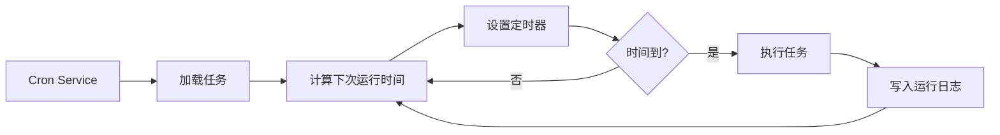

# Cron 定时任务与 Webhook

## 学完你能做什么

本课学完后，你将能够：

- 创建 Cron 定时任务，按指定时间或周期自动执行 AI 任务
- 理解三种调度方式（at、every、cron）的使用场景
- 配置 Webhook 接收外部事件触发
- 设置 Gmail Pub/Sub 集成，实现邮件触发 AI 响应
- 管理任务执行历史和日志

## 你现在的困境

你可能遇到了这些情况：

- 需要在固定时间提醒自己处理某些事情
- 想要定期总结工作进度或生成报告
- 需要在收到特定邮件时自动触发 AI 分析
- 不想每次都手动发送消息给 AI

## 什么时候用这一招

**Cron 定时任务**适合这些场景：

| 场景 | 示例 | 调度方式 |
|--- | --- | ---|
| 一次性提醒 | "明天上午 9 点提醒我开会" | at |
| 定期检查 | "每 30 分钟检查一下系统状态" | every |
| 按时执行 | "每天下午 5 点生成日报" | cron |
| 复杂周期 | "每周一到周五上午 9 点" | cron |

**Webhook**适合这些场景：

- 接收 GitHub、GitLab 的推送通知
- 接收 Stripe 支付成功通知
- 接收 Twilio 来电通知
- 任何能发送 HTTP POST 的服务

**Gmail Pub/Sub**适合这些场景：

- 收到重要邮件时自动分析
- 邮件分类和自动回复
- 邮件内容提取和归档

---

## 核心思路

### Cron 任务的工作流程



### 三种调度方式对比

| 方式 | 适用场景 | 示例 | 精度 |
|--- | --- | --- | ---|
| `at` | 一次性任务 | 2026-01-27 09:00:00 | 毫秒级 |
| `every` | 固定间隔 | 每 30 分钟 | 毫秒级 |
| `cron` | 复杂周期 | 每天上午 9 点 | 分钟级 |

### 两种会话目标

| 会话目标 | Payload 类型 | 说明 |
|--- | --- | ---|
| `main` | `systemEvent` | 向主会话注入系统事件 |
| `isolated` | `agentTurn` | 在隔离会话中运行 Agent |

**关键约束**：
- `sessionTarget="main"` 必须使用 `payload.kind="systemEvent"`
- `sessionTarget="isolated"` 必须使用 `payload.kind="agentTurn"`

---

## 🎒 开始前的准备

在开始之前，请确保：

::: warning 前置检查
- [ ] Gateway 已启动（[启动 Gateway](../../start/gateway-startup/)）
- [ ] AI 模型已配置（[AI 模型配置](../models-auth/)）
- [ ] 了解基本的 Cron 表达式语法（如果使用 cron 调度）
:::

---

## 跟我做

### 第 1 步：检查 Cron 服务状态

**为什么**：确认 Cron 服务已启用并运行

```bash
## 使用 CLI 检查 Cron 状态
clawdbot cron status
```

**你应该看到**：

```
✓ Cron enabled
  Store: ~/.clawdbot/cron.json
  Jobs: 0
  Next wake: null
```

如果显示 `disabled`，需要在配置文件中启用：

```json
{
  "cron": {
    "enabled": true,
    "store": "~/.clawdbot/cron.json",
    "maxConcurrentRuns": 5
  }
}
```

---

### 第 2 步：创建一次性定时任务

**为什么**：学习最基本的 `at` 调度方式

使用 cron 工具添加一个 1 分钟后执行的任务：

```json
{
  "action": "add",
  "job": {
    "name": "测试提醒",
    "enabled": true,
    "schedule": {
      "kind": "at",
      "atMs": 1738000000000
    },
    "sessionTarget": "main",
    "wakeMode": "next-heartbeat",
    "payload": {
      "kind": "systemEvent",
      "text": "这是一条测试提醒：检查工作进度"
    }
  }
}
```

**你应该看到**：

```
✓ Job added: job_xxx
  Name: 测试提醒
  Next run: 2026-01-27 10:00:00
```

**提示**：`atMs` 是 Unix 时间戳（毫秒）。可以使用 JavaScript 计算：

```javascript
Date.now() + 60 * 1000  // 1 分钟后
```

---

### 第 3 步：创建重复间隔任务

**为什么**：学习 `every` 调度方式，适合定期检查

创建一个每 30 分钟执行一次的任务：

```json
{
  "action": "add",
  "job": {
    "name": "每30分钟检查系统",
    "enabled": true,
    "schedule": {
      "kind": "every",
      "everyMs": 1800000
    },
    "sessionTarget": "main",
    "wakeMode": "next-heartbeat",
    "payload": {
      "kind": "systemEvent",
      "text": "检查系统状态：CPU、内存、磁盘"
    }
  }
}
```

**你应该看到**：

```
✓ Job added: job_xxx
  Name: 每30分钟检查系统
  Interval: 30 minutes
  Next run: 2026-01-27 10:00:00
```

**参数说明**：
- `everyMs`: 间隔时间（毫秒）
  - 1 分钟 = 60,000 ms
  - 5 分钟 = 300,000 ms
  - 30 分钟 = 1,800,000 ms
  - 1 小时 = 3,600,000 ms
- `anchorMs`（可选）：首次运行的起始时间

---

### 第 4 步：创建 Cron 表达式任务

**为什么**：学习 `cron` 调度方式，适合复杂周期

创建一个每天上午 9 点执行的任务：

```json
{
  "action": "add",
  "job": {
    "name": "每天上午9点日报",
    "enabled": true,
    "schedule": {
      "kind": "cron",
      "expr": "0 9 * * *",
      "tz": "Asia/Shanghai"
    },
    "sessionTarget": "main",
    "wakeMode": "next-heartbeat",
    "payload": {
      "kind": "systemEvent",
      "text": "生成今日工作日报"
    }
  }
}
```

**你应该看到**：

```
✓ Job added: job_xxx
  Name: 每天上午9点日报
  Schedule: 0 9 * * * (Asia/Shanghai)
  Next run: 2026-01-27 09:00:00
```

**Cron 表达式格式**：

```
┌───────────── 分钟 (0 - 59)
│ ┌─────────── 小时 (0 - 23)
│ │ ┌───────── 日 (1 - 31)
│ │ │ ┌─────── 月 (1 - 12)
│ │ │ │ ┌───── 星期 (0 - 7, 0 和 7 都表示周日)
│ │ │ │ │
* * * * *
```

**常用表达式**：

| 表达式 | 说明 |
|--- | ---|
| `0 9 * * *` | 每天上午 9 点 |
| `0 9 * * 1-5` | 周一到周五上午 9 点 |
| `0 */6 * * *` | 每 6 小时 |
| `0 0 * * 0` | 每周日午夜 |
| `0 9,17 * * *` | 每天 9 点和 17 点 |

::: info 时区设置
Cron 表达式默认使用 UTC 时区。使用 `tz` 字段指定时区（如 `"Asia/Shanghai"`），确保任务在你期望的时间执行。
:::

---

### 第 5 步：使用隔离会话执行任务

**为什么**：在隔离环境中运行 AI 任务，避免干扰主会话

创建一个在隔离会话中运行的任务：

```json
{
  "action": "add",
  "job": {
    "name": "每日摘要",
    "enabled": true,
    "schedule": {
      "kind": "cron",
      "expr": "0 18 * * *",
      "tz": "Asia/Shanghai"
    },
    "sessionTarget": "isolated",
    "wakeMode": "next-heartbeat",
    "payload": {
      "kind": "agentTurn",
      "message": "总结今天的工作：1. 完成的任务 2. 遇到的问题 3. 明天的计划",
      "model": "anthropic/claude-sonnet-4-20250514",
      "thinking": "low"
    }
  }
}
```

**你应该看到**：

```
✓ Job added: job_xxx
  Name: 每日摘要
  Session: isolated
  Next run: 2026-01-27 18:00:00
```

**`agentTurn` Payload 参数**：

| 参数 | 类型 | 说明 |
|--- | --- | ---|
| `message` | string | 发送给 Agent 的提示词 |
| `model` | string | 覆盖使用的模型（可选） |
| `thinking` | string | 思考级别："off" \| "minimal" \| "low" \| "medium" \| "high" |
| `timeoutSeconds` | number | 超时时间（秒） |
| `deliver` | boolean | 是否将结果发送到渠道 |
| `channel` | string | 目标渠道（如 "whatsapp"、"telegram"） |
| `to` | string | 接收者标识符 |
| `bestEffortDeliver` | boolean | 如果无法发送到指定渠道，是否尝试其他渠道 |

**隔离会话配置**（可选）：

```json
{
  "isolation": {
    "postToMainPrefix": "📊 每日摘要:",
    "postToMainMode": "summary",
    "postToMainMaxChars": 8000
  }
}
```

| 参数 | 说明 |
|--- | ---|
| `postToMainPrefix` | 将结果回传到主会话时的前缀 |
| `postToMainMode` | "summary"（摘要）或 "full"（完整文本） |
| `postToMainMaxChars` | `postToMainMode="full"` 时的最大字符数 |

---

### 第 6 步：列出和管理任务

**为什么**：查看所有任务并管理其状态

**列出所有任务**：

```bash
clawdbot cron list
```

**你应该看到**：

```
Jobs: 3
  ✓ job_xxx: 测试提醒 (enabled, next: 2026-01-27 10:00:00)
  ✓ job_yyy: 每30分钟检查系统 (enabled, next: 2026-01-27 10:00:00)
  ✓ job_zzz: 每天上午9点日报 (enabled, next: 2026-01-27 09:00:00)
```

**包含已禁用的任务**：

```bash
clawdbot cron list --include-disabled
```

**禁用任务**：

```json
{
  "action": "update",
  "jobId": "job_xxx",
  "patch": {
    "enabled": false
  }
}
```

**启用任务**：

```json
{
  "action": "update",
  "jobId": "job_xxx",
  "patch": {
    "enabled": true
  }
}
```

**删除任务**：

```json
{
  "action": "remove",
  "jobId": "job_xxx"
}
```

---

### 第 7 步：立即运行任务

**为什么**：测试任务是否正常工作，无需等待调度

```json
{
  "action": "run",
  "jobId": "job_xxx"
}
```

**你应该看到**：

```
✓ Job ran: job_xxx
  Status: ok
  Duration: 1234ms
```

**查看运行历史**：

```json
{
  "action": "runs",
  "jobId": "job_xxx",
  "limit": 10
}
```

**你应该看到**：

```
Runs for job_xxx (10 most recent):
  2026-01-27 10:00:00 - ok - 1234ms
  2026-01-26 10:00:00 - ok - 1189ms
  2026-01-25 10:00:00 - ok - 1245ms
```

---

### 第 8 步：添加上下文到提醒任务

**为什么**：让 AI 了解最近的对话上下文，提供更相关的提醒

使用 `contextMessages` 参数添加最近的消息历史：

```json
{
  "action": "add",
  "job": {
    "name": "任务跟进提醒",
    "enabled": true,
    "schedule": {
      "kind": "cron",
      "expr": "0 10,16 * * *",
      "tz": "Asia/Shanghai"
    },
    "sessionTarget": "main",
    "wakeMode": "next-heartbeat",
    "payload": {
      "kind": "systemEvent",
      "text": "跟进你的任务进度：1. 检查待办事项 2. 更新项目状态"
    },
    "contextMessages": 5
  }
}
```

**上下文消息限制**：
- 最大消息数：10 条
- 每条消息最大字符数：220
- 总字符数限制：700
- 格式：`- User: ...\n- Assistant: ...`

**自动添加的上下文**：

```
跟进你的任务进度：1. 检查待办事项 2. 更新项目状态

Recent context:
- User: 我需要在今天完成报告
- Assistant: 明白了，你需要写什么类型的报告？
- User: 是周报，包含本周的工作总结
```

---

## Webhook 配置

### Webhook 概述

Webhook 允许外部服务通过 HTTP POST 请求触发 Clawdbot 的内部事件。常见用途：

- **GitHub/GitLab**: 推送通知触发 CI/CD 流程
- **Stripe**: 支付成功通知触发订单处理
- **Twilio**: 来电通知触发 AI 语音响应
- **Jira**: 工单创建通知触发自动回复

### 配置 Webhook

**启用 Hooks 系统**：

```json
{
  "hooks": {
    "enabled": true,
    "path": "/hooks",
    "token": "your-secret-token-here"
  }
}
```

**配置映射规则**：

```json
{
  "hooks": {
    "enabled": true,
    "token": "your-secret-token-here",
    "mappings": [
      {
        "id": "github-push",
        "match": {
          "path": "/hooks/github"
        },
        "action": "wake",
        "wakeMode": "now",
        "sessionKey": "main",
        "messageTemplate": "GitHub 推送通知: {{ repository }} - {{ ref }}"
      }
    }
    ]
  }
}
```

**映射配置参数**：

| 参数 | 说明 |
|--- | ---|
| `match.path` | 匹配的 URL 路径 |
| `match.source` | 匹配的请求来源头 |
| `action` | `"wake"` 或 `"agent"` |
| `wakeMode` | `"now"` 或 `"next-heartbeat"` |
| `sessionKey` | 目标会话键（如 "main"） |
| `messageTemplate` | 使用 Mustache 语法的消息模板 |
| `deliver` | 是否发送到渠道 |
| `channel` | 目标渠道（如 "whatsapp"） |
| `to` | 接收者标识符 |
| `transform` | 转换模块（处理请求体） |

---

## Gmail Pub/Sub 集成

### Gmail Pub/Sub 概述

Gmail Pub/Sub 允许你在收到新邮件时实时触发 Clawdbot，实现邮件驱动的 AI 响应。

### 配置 Gmail Pub/Sub

**基本配置**：

```json
{
  "hooks": {
    "enabled": true,
    "token": "your-hook-token",
    "gmail": {
      "account": "your-email@gmail.com",
      "label": "INBOX",
      "topic": "projects/your-project-id/topics/gmail-topic",
      "subscription": "gmail-subscription",
      "pushToken": "your-push-token",
      "hookUrl": "http://127.0.0.1:18789/hooks/gmail",
      "includeBody": true,
      "maxBytes": 20000,
      "renewEveryMinutes": 720
    }
  }
}
```

**配置参数说明**：

| 参数 | 说明 | 默认值 |
|--- | --- | ---|
| `account` | Gmail 账户地址 | - |
| `label` | 监听的 Gmail 标签 | `INBOX` |
| `topic` | Google Cloud Pub/Sub 主题路径 | - |
| `subscription` | Pub/Sub 订阅名称 | `gmail-subscription` |
| `pushToken` | Gmail 推送令牌 | - |
| `hookUrl` | Webhook 接收 URL | 自动生成 |
| `includeBody` | 是否包含邮件正文 | `true` |
| `maxBytes` | 最大邮件字节数 | `20000` |
| `renewEveryMinutes` | 订阅续期间隔（分钟） | `720`（12 小时） |

### Tailscale 集成（可选）

**使用 Tailscale Serve 暴露 Webhook**：

```json
{
  "hooks": {
    "gmail": {
      "tailscale": {
        "mode": "serve",
        "path": "/gmail-pubsub",
        "target": "10000"
      }
    }
  }
}
```

**使用 Tailscale Funnel**：

```json
{
  "hooks": {
    "gmail": {
      "tailscale": {
        "mode": "funnel",
        "path": "/gmail-pubsub"
      }
    }
  }
}
```

| 模式 | 说明 |
|--- | ---|
| `off` | 不使用 Tailscale |
| `serve` | 通过 Tailscale Serve 暴露本地服务 |
| `funnel` | 通过 Tailscale Funnel 从公网访问 |

### 启动 Gmail Watcher

**启动 Gmail Watcher 服务**：

```bash
clawdbot hooks gmail-watch
```

**你应该看到**：

```
✓ Gmail watcher started
  Account: your-email@gmail.com
  Label: INBOX
  Watching...
```

**Gmail Watcher 会**：
1. 订阅 Gmail 的标签变化
2. 接收新的邮件推送
3. 将邮件信息发送到 Webhook
4. 触发 Clawdbot 的内部事件

---

## 检查点 ✅

**确认你已掌握**：

- [ ] 能够创建三种类型的 Cron 任务（at、every、cron）
- [ ] 理解 `main` 和 `isolated` 会话目标的区别
- [ ] 能够列出、启用、禁用和删除任务
- [ ] 能够查看任务的运行历史
- [ ] 理解 Webhook 的配置和工作原理
- [ ] 能够配置 Gmail Pub/Sub 集成

---

## 踩坑提醒

### 任务不执行

**问题**：任务已添加但从未运行

**可能原因**：

| 原因 | 解决方法 |
|--- | ---|
| Cron 服务未启用 | 检查 `cron.enabled` 配置 |
| 时间未到 | 使用 `clawdbot cron list` 查看下次运行时间 |
| 时区错误 | 检查 `tz` 字段是否正确 |
| 任务已禁用 | 使用 `--include-disabled` 检查任务状态 |

### Cron 表达式错误

**问题**：任务在错误的时间运行

**常见错误**：

| 错误 | 正确 | 说明 |
|--- | --- | ---|
| `9 * * *` | `0 9 * * *` | 缺少分钟字段 |
| `0 9 * * * *` | `0 9 * * *` | 多了一个字段 |
| `0 9 1-5 * *` | `0 9 * * 1-5` | 星期字段位置错误 |

**验证工具**：使用 [crontab.guru](https://crontab.guru/) 验证 Cron 表达式。

### Gmail Pub/Sub 不工作

**问题**：收到邮件但未触发

**检查清单**：

- [ ] Gmail Watcher 服务是否正在运行
- [ ] `hookUrl` 是否可访问（使用 curl 测试）
- [ ] `token` 是否正确配置
- [ ] Pub/Sub 主题和订阅是否正确创建
- [ ] 网络连接是否正常（使用 Tailscale 时）

### 隔离会话无响应

**问题**：`sessionTarget="isolated"` 的任务没有输出

**可能原因**：

- 缺少 `model` 字段，使用默认模型但未配置
- `message` 提示词不够清晰
- `timeoutSeconds` 太短，任务超时
- `deliver=false` 但没有配置 `postToMainMode`

**解决方法**：

1. 增加日志详细程度
2. 检查 Gateway 日志
3. 使用 `bestEffortDeliver=true` 确保结果至少能传回主会话

---

## 本课小结

Cron 和 Webhook 是 Clawdbot 的强大自动化工具：

**Cron 系统**：
- 三种调度方式：`at`（一次性）、`every`（间隔）、`cron`（复杂周期）
- 两种会话目标：`main`（注入系统事件）、`isolated`（运行 Agent）
- 支持任务历史和运行日志
- 可添加上下文消息提供更相关的提醒

**Webhook 系统**：
- 接收外部 HTTP POST 请求
- 支持映射规则和消息模板
- 可配置 Tailscale 暴露公网访问

**Gmail Pub/Sub**：
- 实时监听新邮件
- 支持标签过滤
- 集成 Tailscale Serve/Funnel

通过合理配置这些功能，你可以构建完全自动化的 AI 助手，让它在正确的时间做出响应。

---

## 下一课预告

> 下一课我们将学习 **[记忆系统与向量搜索](../memory-system/)**。
>
> 你会学到：
> - 记忆系统的文件结构和索引机制
> - 配置向量搜索提供商（OpenAI、Gemini、本地）
> - 使用混合搜索（BM25 + 向量）提升检索准确率
> - 通过 CLI 管理记忆索引和搜索

---

## 附录：源码参考

<details>
<summary><strong>点击展开查看源码位置</strong></summary>

> 更新时间：2026-01-27

| 功能 | 文件路径 | 行号 |
|--- | --- | ---|
| Cron 配置类型定义 | [`src/config/types.cron.ts`](https://github.com/clawdbot/clawdbot/blob/main/src/config/types.cron.ts#L1-L6) | 1-6 |
| Cron 核心类型定义 | [`src/cron/types.ts`](https://github.com/clawdbot/clawdbot/blob/main/src/cron/types.ts#L1-L95) | 1-95 |
| Cron Service | [`src/cron/service.ts`](https://github.com/clawdbot/clawdbot/blob/main/src/cron/service.ts#L1-L49) | 1-49 |
| Cron 操作实现 | [`src/cron/service/ops.ts`](https://github.com/clawdbot/clawdbot/blob/main/src/cron/service/ops.ts#L1-L141) | 1-141 |
| Cron 工具实现 | [`src/agents/tools/cron-tool.ts`](https://github.com/clawdbot/clawdbot/blob/main/src/agents/tools/cron-tool.ts#L1-L291) | 1-291 |
| Gateway Cron 方法 | [`src/gateway/server-methods/cron.ts`](https://github.com/clawdbot/clawdbot/blob/main/src/gateway/server-methods/cron.ts#L1-L205) | 1-205 |
| Hooks 配置类型定义 | [`src/config/types.hooks.ts`](https://github.com/clawdbot/clawdbot/blob/main/src/config/types.hooks.ts#L1-L125) | 1-125 |
| Hooks Gmail 工具 | [`src/hooks/gmail.ts`](https://github.com/clawdbot/clawdbot/blob/main/src/hooks/gmail.ts#L1-L267) | 1-267 |
| Hooks 内部事件 | [`src/hooks/hooks.ts`](https://github.com/clawdbot/clawdbot/blob/main/src/hooks/hooks.ts#L1-L15) | 1-15 |
| Hooks CLI 命令 | [`src/cli/hooks-cli.ts`](https://github.com/clawdbot/clawdbot/blob/main/src/cli/hooks-cli.ts#L1-L839) | 1-839 |

**关键常量**：
- `DEFAULT_GMAIL_LABEL = "INBOX"`: Gmail 默认标签
- `DEFAULT_GMAIL_TOPIC = "gog-gmail-watch"`: Gmail 默认主题名称
- `DEFAULT_GMAIL_SUBSCRIPTION = "gog-gmail-watch-push"`: Gmail 默认订阅名称
- `DEFAULT_GMAIL_MAX_BYTES = 20000`: Gmail 默认最大邮件字节数
- `DEFAULT_GMAIL_RENEW_MINUTES = 720`: Gmail 默认续期间隔（12 小时）

**关键函数**：
- `CronService.start()`: 启动 Cron 服务
- `CronService.add()`: 添加定时任务
- `CronService.update()`: 更新任务
- `CronService.remove()`: 删除任务
- `CronService.run()`: 立即运行任务
- `createCronTool()`: 创建 Cron 工具
- `resolveGmailHookRuntimeConfig()`: 解析 Gmail Hook 配置
- `buildGogWatchStartArgs()`: 构建 Gmail Watch 启动参数
- `buildGogWatchServeArgs()`: 构建 Gmail Watch 服务参数

</details>
