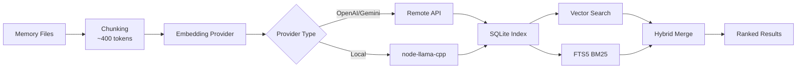

# 记忆系统与向量搜索完全指南

## 学完你能做什么

本课学完后，你将能够：

- 理解 Clawdbot 记忆系统的文件结构和索引机制
- 配置向量搜索提供商（OpenAI、Gemini、本地）
- 使用混合搜索（BM25 + 向量）提升检索准确率
- 通过 CLI 管理记忆索引和搜索
- 调整 Embedding 缓存和索引性能

## 你现在的困境

你可能遇到了这些情况：

- AI 在新会话中"忘"了之前的对话内容
- 想让 AI 记住一些持久化的知识和偏好
- 不清楚如何让 AI"学习"并记住重要信息
- 搜索历史对话时找不到相关的上下文

## 什么时候用这一招

**记忆系统**适合这些场景：

| 场景 | 示例 | 存储位置 |
|--- | --- | ---|
| 持久化知识 | "我喜欢素食，记住这个" | MEMORY.md |
| 日常笔记 | "今天的工作进度和待办" | memory/YYYY-MM-DD.md |
| 会话检索 | "上次讨论的 API 端点是什么" | 向量索引 |
| 配置信息 | "Gateway 在端口 18789 运行" | MEMORY.md |

---

## 核心思路

### 记忆系统的两层结构

Clawdbot 使用 **两层数据** 来管理长期记忆：

| 层级 | 文件路径 | 用途 | 加载时机 |
|--- | --- | --- | ---|
| **长期记忆** | `MEMORY.md` | 精选的知识、偏好、重要事实 | 主会话启动时加载 |
| **每日日志** | `memory/YYYY-MM-DD.md` | 日常笔记、运行上下文 | 加载今天 + 昨天的 |

::: info 为什么是两层？
`MEMORY.md` 类似于"知识库"，只加载到主会话，确保敏感信息不会泄露到群组对话。`memory/*.md` 是"日记本"，记录日常流水，方便回溯。
:::

### 向量索引的工作流程



### 混合搜索：BM25 + 向量

向量搜索擅长"语义匹配"，但弱于"精确匹配"：

| 查询类型 | 向量搜索 | BM25 全文 | 混合搜索 |
|--- | --- | --- | ---|
| "服务器 IP 地址" | ❌ 弱 | ✅ 强 | ✅ 最佳 |
| "如何部署 Gateway" | ✅ 强 | ⚠️ 中等 | ✅ 最佳 |
| "API 端点 a828e60" | ❌ 弱 | ✅ 强 | ✅ 最佳 |

**融合公式**：
```javascript
finalScore = vectorWeight × vectorScore + textWeight × textScore
```

- `vectorWeight + textWeight` 自动归一化为 1.0
- 默认：70% 向量 + 30% 关键词
- 可通过 `agents.defaults.memorySearch.query.hybrid.*` 调整

---

## 🎒 开始前的准备

在开始之前，请确保：

::: warning 前置检查
- [ ] Gateway 已启动（[启动 Gateway](../../start/gateway-startup/)）
- [ ] AI 模型已配置（[AI 模型配置](../models-auth/)）
- [ ] 了解基本的 Markdown 文件编辑
:::

::: tip 推荐配置
- 优先使用 OpenAI 或 Gemini embeddings（速度快、质量高）
- 本地 embeddings 需要 `pnpm rebuild node-llama-cpp`
- 首次索引可能需要几分钟，之后增量更新很快
:::

---

## 跟我做

### 第 1 步：创建记忆文件

**为什么**：AI 只会索引已存在的文件，先创建记忆内容

在 Agent 工作目录（默认 `~/clawd`）创建文件：

```bash
# 创建长期记忆文件
cat > ~/clawd/MEMORY.md << 'EOF'
# 个人偏好

- 饮食偏好：素食，不吃辛辣食物
- 工作时间：上午 9 点到下午 6 点
- 常用命令：`clawdbot gateway status`

# 重要配置

- Gateway 端口：18789
- 数据库：PostgreSQL 15
EOF

# 创建今日日志
cat > ~/clawd/memory/$(date +%Y-%m-%d).md << 'EOF'
# 今日工作进度

- 完成了 Gateway 配置
- 学习了记忆系统
- 待办：阅读模型认证文档
EOF
```

**你应该看到**：

```bash
# 查看文件结构
tree ~/clawd/
# 或
ls -la ~/clawd/
ls -la ~/clawd/memory/

# 输出示例
~/clawd/
├── MEMORY.md
└── memory/
    └── 2026-01-27.md
```

### 第 2 步：检查记忆系统状态

**为什么**：确认 Embedding 提供商和索引状态

```bash
# 基本状态检查
clawdbot memory status

# 深度检查（探测 provider 可用性）
clawdbot memory status --deep

# 深度检查 + 强制重新索引
clawdbot memory status --deep --index
```

**你应该看到**：

```bash
✓ Memory Search enabled
  Store: ~/.clawdbot/memory/main.sqlite
  Provider: openai
  Model: text-embedding-3-small
  Fallback: openai
  Hybrid: enabled (vectorWeight: 0.7, textWeight: 0.3)
  Cache: enabled (maxEntries: 50000)
  Sources: memory
  Indexed: 2 files, 5 chunks
```

::: tip 深度检查
- `--deep` 会探测 OpenAI/Gemini/Local embeddings 是否可用
- `--index` 在检测到"脏"索引时自动重新索引
- 首次运行时，索引可能需要几分钟
:::

### 第 3 步：手动触发索引

**为什么**：确保新创建的记忆文件被索引

```bash
# 手动触发索引
clawdbot memory index

# 带详细日志
clawdbot memory index --verbose

# 仅针对特定 agent
clawdbot memory index --agent main
```

**你应该看到**：

```bash
Indexing memory for agent: main
  Provider: openai (text-embedding-3-small)
  Sources: memory
  - MEMORY.md (2 chunks)
  - memory/2026-01-27.md (3 chunks)
✓ Indexed 2 files, 5 chunks
```

### 第 4 步：测试语义搜索

**为什么**：验证向量搜索和混合搜索是否正常工作

```bash
# 基础搜索
clawdbot memory search "素食"

# 搜索精确匹配（测试 BM25）
clawdbot memory search "Gateway 端口"

# 搜索模糊语义（测试向量）
clawdbot memory search "我喜欢吃什么"

# 查看详细结果
clawdbot memory search "Gateway" --verbose
```

**你应该看到**：

```bash
Searching memory for: "素食"

Results (2):

[1] MEMORY.md:3-5 (score: 0.842)
  - 饮食偏好：素食，不吃辛辣食物

[2] memory/2026-01-27.md:1-3 (score: 0.615)
  - 完成了 Gateway 配置
  - 学习了记忆系统
```

### 第 5 步：配置 Embedding 提供商

**为什么**：根据需求选择最适合的提供商（远程 vs 本地）

#### 方案 A：OpenAI embeddings（推荐）

编辑配置文件 `~/.clawdbot/clawdbot.json`：

```json
{
  "agents": {
    "defaults": {
      "memorySearch": {
        "enabled": true,
        "provider": "openai",
        "model": "text-embedding-3-small",
        "fallback": "openai",
        "remote": {
          "apiKey": "YOUR_OPENAI_API_KEY",
          "batch": {
            "enabled": true,
            "concurrency": 2
          }
        }
      }
    }
  }
}
```

**优点**：
- 速度快、质量高
- 支持批量索引（便宜）
- 适合大规模回填

#### 方案 B：Gemini embeddings

```json
{
  "agents": {
    "defaults": {
      "memorySearch": {
        "provider": "gemini",
        "model": "gemini-embedding-001",
        "remote": {
          "apiKey": "YOUR_GEMINI_API_KEY"
        },
        "fallback": "openai"
      }
    }
  }
}
```

#### 方案 C：本地 embeddings（隐私优先）

```json
{
  "agents": {
    "defaults": {
      "memorySearch": {
        "provider": "local",
        "local": {
          "modelPath": "hf:ggml-org/embeddinggemma-300M-GGUF/embeddinggemma-300M-Q8_0.gguf",
          "modelCacheDir": "~/.cache/embeddings"
        },
        "fallback": "none"
      }
    }
  }
}
```

**注意事项**：

```bash
# 首次使用本地 embeddings 需要构建
pnpm approve-builds
# 选择 node-llama-cpp
pnpm rebuild node-llama-cpp
```

**你应该看到**：

```bash
✓ node-llama-cpp installed
✓ Local embedding model ready
```

::: warning 本地 embeddings
- 首次会自动下载模型（~600MB）
- 需要编译 node-llama-cpp（依赖系统环境）
- 速度较远程慢，但完全离线、隐私优先
:::

### 第 6 步：配置混合搜索权重

**为什么**：根据应用场景调整语义和关键词的权重比例

编辑配置：

```json
{
  "agents": {
    "defaults": {
      "memorySearch": {
        "query": {
          "hybrid": {
            "enabled": true,
            "vectorWeight": 0.7,
            "textWeight": 0.3,
            "candidateMultiplier": 4
          }
        }
      }
    }
  }
}
```

**参数说明**：

| 参数 | 默认值 | 说明 | 调整建议 |
|--- | --- | --- | ---|
| `vectorWeight` | 0.7 | 语义搜索权重 | 提升到 0.8 用于"自然语言"查询 |
| `textWeight` | 0.3 | 关键词搜索权重 | 提升到 0.5 用于"代码/ID"查询 |
| `candidateMultiplier` | 4 | 候选倍数 | 增加到 6 提升召回率 |

**对比效果**：

```bash
# 测试语义查询
clawdbot memory search "部署 Gateway 的方法"
# vectorWeight: 0.7 → 找到语义相关的结果
# textWeight: 0.5 → 找到"部署"、"Gateway"关键词

# 测试精确查询
clawdbot memory search "API 端点 a828e60"
# vectorWeight: 0.3 → 忽略语义，优先匹配
# textWeight: 0.7 → 精确匹配 "a828e60"
```

### 第 7 步：启用 SQLite-vec 加速

**为什么**：将向量查询下推到 SQLite，避免加载所有 embeddings

编辑配置：

```json
{
  "agents": {
    "defaults": {
      "memorySearch": {
        "store": {
          "vector": {
            "enabled": true,
            "extensionPath": "/path/to/sqlite-vec"
          }
        }
      }
    }
  }
}
```

**检查 sqlite-vec 是否可用**：

```bash
# 查看索引状态
clawdbot memory status --deep

# 如果可用，你会看到
✓ SQLite-vec extension loaded
  Vector table: chunks_vec
```

::: info SQLite-vec
- 默认自动尝试加载
- 如果加载失败，自动回退到 JS 计算（不影响功能）
- 自定义路径仅用于特殊构建或非标准安装
:::

---

## 检查点 ✅

完成上述步骤后，验证以下内容：

| 检查项 | 验证方法 | 预期结果 |
|--- | --- | ---|
| 记忆文件存在 | `ls ~/clawd/` | MEMORY.md 和 memory/ 目录存在 |
| 索引已创建 | `clawdbot memory status` | 显示 Indexed > 0 chunks |
| 搜索正常 | `clawdbot memory search "..."` | 返回相关结果 |
| Provider 正常 | `clawdbot memory status --deep` | 显示 Provider 类型 |

---

## 踩坑提醒

### 坑 1：Embedding 提供商失败

**现象**：

```bash
✗ Memory Search disabled
  Error: No API key found for provider
```

**解决**：

```bash
# 检查配置
cat ~/.clawdbot/clawdbot.json | grep -A 5 "memorySearch"

# 确认 apiKey 存在
# 或者设置环境变量
export OPENAI_API_KEY="sk-..."
export GEMINI_API_KEY="..."
```

### 坑 2：本地 embeddings 无法加载

**现象**：

```bash
✗ Local embedding provider failed
  Error: Cannot find module 'node-llama-cpp'
```

**解决**：

```bash
# 批准构建
pnpm approve-builds

# 重新构建
pnpm rebuild node-llama-cpp
```

### 坑 3：索引不更新

**现象**：

```bash
# 修改了 MEMORY.md
# 但搜索结果还是旧的
```

**解决**：

```bash
# 方法 1：手动触发索引
clawdbot memory index

# 方法 2：重启 Gateway（触发 onSessionStart 索引）
clawdbot gateway restart

# 方法 3：检查文件监听
clawdbot memory status --verbose
# 检查 "Watch: true"
```

### 坑 4：搜索结果不相关

**现象**：搜索"Gateway"却返回了"工作进度"

**可能原因**：

1. **混合权重不合适**：
   - 语义查询（"如何部署"）→ 提高 `vectorWeight`
   - 关键词查询（"API 端点"）→ 提高 `textWeight`

2. **索引未完全更新**：
   ```bash
   # 强制重新索引
   rm ~/.clawdbot/memory/main.sqlite
   clawdbot memory index
   ```

3. **Chunk 粒度问题**：
   - 默认 400 tokens，可能切断了上下文
   - 调整 `agents.defaults.memorySearch.chunking.tokens`

---

## 本课小结

本课我们学习了：

1. **记忆系统架构**
   - 两层数据结构（MEMORY.md + memory/*.md）
   - 向量索引 + FTS5 全文搜索
   - 混合检索（BM25 + 向量）

2. **Embedding 提供商配置**
   - OpenAI/Gemini/本地三种方案
   - 批量索引加速
   - Fallback 机制

3. **CLI 工具使用**
   - `clawdbot memory status` 检查状态
   - `clawdbot memory index` 触发索引
   - `clawdbot memory search` 测试搜索

4. **性能优化**
   - SQLite-vec 向量加速
   - Embedding 缓存
   - 混合权重调优

---

## 下一课预告

> 下一课我们学习 **[安全与沙箱隔离](../security-sandbox/)**。
>
> 你会学到：
> - 工具权限控制和 allowlist
> - Sandbox 会话隔离
> - Exec 审批机制
> - Docker 化部署
> - Tailscale 认证

---

## 附录：源码参考

<details>
<summary><strong>点击展开查看源码位置</strong></summary>

> 更新时间：2026-01-27

| 功能 | 文件路径 | 行号 |
|--- | --- | ---|
| 记忆管理器 | [`src/memory/manager.ts`](https://github.com/moltbot/moltbot/blob/main/src/memory/manager.ts) | 1-200 |
| 混合搜索 | [`src/memory/hybrid.ts`](https://github.com/moltbot/moltbot/blob/main/src/memory/hybrid.ts) | 1-112 |
| Embedding 提供商 | [`src/memory/embeddings.ts`](https://github.com/moltbot/moltbot/blob/main/src/memory/embeddings.ts) | 1-80 |
| OpenAI embeddings | [`src/memory/embeddings-openai.ts`](https://github.com/moltbot/moltbot/blob/main/src/memory/embeddings-openai.ts) | 全文 |
| Gemini embeddings | [`src/memory/embeddings-gemini.ts`](https://github.com/moltbot/moltbot/blob/main/src/memory/embeddings-gemini.ts) | 全文 |
| 本地 embeddings | [`src/memory/node-llama.ts`](https://github.com/moltbot/moltbot/blob/main/src/memory/node-llama.ts) | 全文 |
| SQLite-vec | [`src/memory/sqlite-vec.ts`](https://github.com/moltbot/moltbot/blob/main/src/memory/sqlite-vec.ts) | 全文 |
| 批量索引（OpenAI） | [`src/memory/batch-openai.ts`](https://github.com/moltbot/moltbot/blob/main/src/memory/batch-openai.ts) | 全文 |
| 批量索引（Gemini） | [`src/memory/batch-gemini.ts`](https://github.com/moltbot/moltbot/blob/main/src/memory/batch-gemini.ts) | 全文 |
| 搜索管理器 | [`src/memory/manager-search.ts`](https://github.com/moltbot/moltbot/blob/main/src/memory/manager-search.ts) | 全文 |
| Memory Schema | [`src/memory/memory-schema.ts`](https://github.com/moltbot/moltbot/blob/main/src/memory/memory-schema.ts) | 全文 |

**关键配置**：
- `agents.defaults.memorySearch.enabled`：启用/禁用记忆搜索
- `agents.defaults.memorySearch.provider`：Embedding 提供商（"openai"、"gemini"、"local"）
- `agents.defaults.memorySearch.query.hybrid.vectorWeight`：向量搜索权重（默认 0.7）
- `agents.defaults.memorySearch.query.hybrid.textWeight`：BM25 搜索权重（默认 0.3）
- `agents.defaults.memorySearch.cache.enabled`：Embedding 缓存（默认 true）
- `agents.defaults.memorySearch.store.vector.enabled`：SQLite-vec 加速（默认 true）

**关键函数**：
- `mergeHybridResults()`：融合向量 + BM25 结果（`src/memory/hybrid.ts:39-111`）
- `bm25RankToScore()`：BM25 排名转分数（`src/memory/hybrid.ts:34-37`）
- `createEmbeddingProvider()`：创建 Embedding 提供商（`src/memory/embeddings.ts`）
- `getMemorySearchManager()`：获取记忆搜索管理器（`src/memory/search-manager.ts`）

**CLI 命令**：
- `clawdbot memory status`：检查状态（`src/cli/commands/memory-cli.ts`）
- `clawdbot memory index`：触发索引（`src/cli/commands/memory-cli.ts`）
- `clawdbot memory search`：搜索记忆（`src/cli/commands/memory-cli.ts`）

</details>
