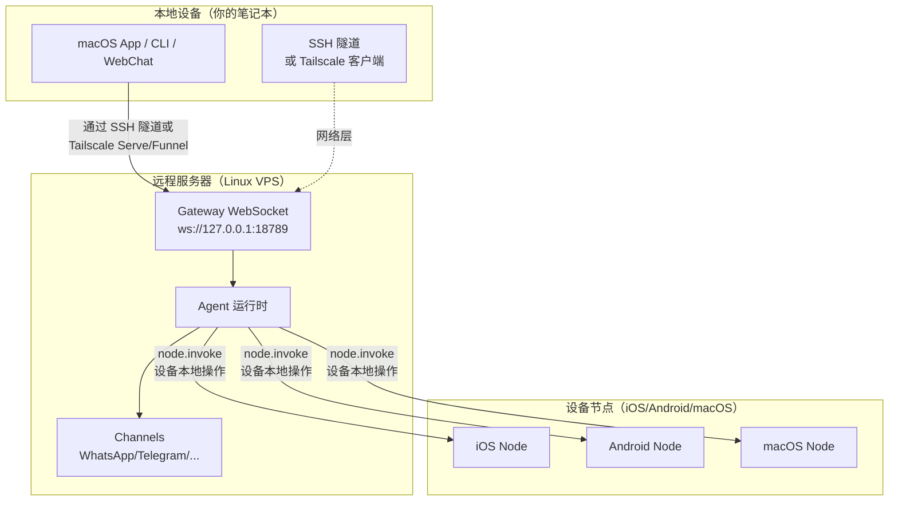

# 远程 Gateway：通过 Tailscale 和 SSH 隧道访问 Clawdbot | Clawdbot 教程

## 学完你能做什么

**远程 Gateway** 让你摆脱设备限制，将 AI 助手部署到 Always-on 的 Linux 服务器。本课学完后，你将能够：

- ✅ 在 Linux 服务器或 VPS 上运行 Clawdbot Gateway
- ✅ 通过 Tailscale Serve/Funnel 安全暴露 Gateway 到网络
- ✅ 使用 SSH 隧道从客户端连接到远程 Gateway
- ✅ 理解 Gateway 与 Node 的架构差异（exec 在哪跑，设备操作在哪跑）
- ✅ 配置安全的远程访问策略

## 你现在的困境

你可能有这些问题：

- 🤔 "我的笔记本经常休眠，但我想让 AI 助手一直在线"
- 🤔 "我想在便宜的 VPS 上运行 Gateway，但不知道怎么安全访问"
- 🤔 "Tailscale Serve 和 Funnel 有什么区别？我该用哪个？"
- 🤔 "SSH 隧道太麻烦，有没有更自动化的方案？"

## 什么时候用这一招

**远程 Gateway** 适合以下场景：

| 场景 | 推荐方案 | 原因 |
|--- | --- | ---|
| 笔记本经常休眠，需要 AI 常驻 | **Tailscale Serve + Linux VPS** | VPS 不休眠，通过 tailnet 安全访问 |
| 家庭桌面运行 Gateway，笔记本电脑远程控制 | **SSH 隧道** 或 **Tailscale Serve** | 统一 Gateway 会话和配置 |
| 需要从公网访问（临时测试） | **Tailscale Funnel + 密码** | 快速暴露，但需密码保护 |
| 多台设备共享一个 AI 助手 | **Always-on Gateway** | 所有会话、配置、历史集中管理 |

::: warning 不推荐场景
如果你只有一台设备，且经常随身携带，**不需要**远程 Gateway。直接在本机运行 Gateway 即可。
:::

## 🎒 开始前的准备

在开始前，请确认：

- [ ] 已完成 **[启动 Gateway](/zh/moltbot/moltbot/start/gateway-startup/)** 课程
- [ ] 了解基本的 SSH 命令（可选，如使用 SSH 隧道）
- [ ] （如使用 Tailscale）已安装 Tailscale CLI 并登录
- [ ] 准备好远程 Linux 服务器或 VPS（推荐 Ubuntu/Debian）

---

## 核心思路

### 远程 Gateway 架构

远程 Gateway 的核心理念是：**Gateway 是控制中心，客户端是终端**。



### 三个关键概念

| 概念 | 解释 | 示例 |
|--- | --- | ---|
| **Gateway 主机** | 运行 Gateway 服务的机器，拥有会话、认证、渠道和状态 | Linux VPS、家庭桌面 |
| **客户端** | 连接到 Gateway 的工具（macOS App、CLI、WebChat） | 你的笔记本、手机 |
| **设备节点** | 通过 Gateway WebSocket 连接的外设，执行设备本地操作 | iOS 设备、Android 设备、macOS 节点模式 |

### 命令在哪儿执行？

这是最常见的混淆点：

| 操作类型 | 在哪儿执行 | 原因 |
|--- | --- | ---|
| `exec` 工具 | **Gateway 主机** | Shell 命令在 Gateway 机器上跑 |
| `browser` 工具 | **Gateway 主机**（或单独的浏览器控制服务器） | 浏览器在 Gateway 机器上启动 |
| 节点操作（`camera.snap`、`system.run`）| **设备节点** | 需要访问设备本地资源 |

**一句话记住**：
- Gateway 主机 → 执行通用命令和运行 AI
- 设备节点 → 执行设备特定的本地操作

---

## 跟我做

### 第 1 步：在远程服务器上安装 Clawdbot

**为什么**
Linux 服务器更适合运行长期在线的 Gateway 服务。

在远程服务器上执行：

```bash
# 1. 安装 Node.js (≥22)
curl -fsSL https://deb.nodesource.com/setup_22.x | sudo -E bash -
sudo apt-get install -y nodejs

# 2. 安装 Clawdbot
npm install -g @clawdbot/cli

# 3. 验证安装
clawdbot --version
```

**你应该看到**：
```
clawdbot CLI v<version>
```

### 第 2 步：运行 onboarding 向导

**为什么**
通过交互式向导快速配置基础设置。

```bash
clawdbot onboard
```

按照向导完成：
- 选择渠道（如 Telegram）
- 配置 AI 模型（如 OpenAI、Anthropic）
- 设置 Gateway 认证（Token 或 Password）

::: tip 推荐
配置 `gateway.auth.mode: "password"`，方便远程连接时使用密码认证：
```bash
export CLAWDBOT_GATEWAY_PASSWORD="your-secure-password"
```
:::

**你应该看到**：
```
✅ Gateway configured successfully
✅ Channels configured: telegram
✅ AI model configured: openai:gpt-4o-mini
```

### 第 3 步：启动 Gateway 守护进程

**为什么**
Gateway 需要在后台持续运行。

```bash
# 启动 Gateway（默认绑定 loopback: 127.0.0.1:18789）
clawdbot gateway start
```

**你应该看到**：
```
🚀 Gateway starting...
📡 WebSocket: ws://127.0.0.1:18789
🔒 Auth mode: password
```

::: tip 使用 systemd 自动启动（Linux）
创建服务文件 `/etc/systemd/system/clawdbot.service`：

```ini
[Unit]
Description=Clawdbot Gateway
After=network.target

[Service]
Type=simple
User=your-user
ExecStart=/usr/bin/clawdbot gateway start
Restart=on-failure
RestartSec=5s
Environment="CLAWDBOT_GATEWAY_PASSWORD=your-secure-password"

[Install]
WantedBy=multi-user.target
```

启动服务：
```bash
sudo systemctl enable clawdbot
sudo systemctl start clawdbot
sudo systemctl status clawdbot
```
:::

---

### 方案 A：使用 Tailscale Serve（推荐）

#### 第 4 步：安装并登录 Tailscale

**为什么**
Tailscale Serve 提供安全的 HTTPS 访问，无需公网 IP。

```bash
# 安装 Tailscale CLI
curl -fsSL https://tailscale.com/install.sh | sh

# 登录 Tailscale
sudo tailscale up
```

**你应该看到**：
```
To authenticate, visit:

    https://login.tailscale.com/a/xxxxx

----------------------------------------------------
Copy the URL and open it in your browser.
```

#### 第 5 步：配置 Tailscale Serve

**为什么**
通过 Tailscale Serve 暴露 Gateway 到 tailnet，保持 Gateway loopback-only（最安全）。

修改配置文件 `~/.clawdbot/clawdbot.json`：

```json5
{
  "gateway": {
    "bind": "loopback",
    "tailscale": {
      "mode": "serve",
      "resetOnExit": true
    },
    "auth": {
      "mode": "password"
    }
  }
}
```

**配置说明**：
- `bind: "loopback"`：Gateway 只监听本地回环（最安全）
- `tailscale.mode: "serve"`：通过 Tailscale Serve 暴露到 tailnet
- `resetOnExit: true`：退出时撤销 Serve 配置

#### 第 6 步：重启 Gateway

**为什么**
应用新的 Tailscale 配置。

```bash
# 如果使用 systemd
sudo systemctl restart clawdbot

# 或直接重启（如果在前台运行）
clawdbot gateway restart
```

**你应该看到**：
```
🚀 Gateway starting...
📡 WebSocket: ws://127.0.0.1:18789
🌐 Tailscale Serve: https://your-tailnet-name.tailnet-name.ts.net/
🔒 Auth mode: password
```

#### 第 7 步：从客户端连接

**为什么**
验证远程 Gateway 是否可访问。

在客户端机器上：

1. **确保已加入同一个 Tailscale tailnet**
2. **访问 Control UI**：
   ```
   https://<magicdns>/  # 或 https://<tailnet-ip>:18789/
   ```
3. **连接 WebSocket**：
   ```bash
   # 验证连接
   clawdbot health --url ws://<tailnet-ip>:18789 --password your-secure-password
   ```

**你应该看到**：
```
✅ Gateway is healthy
✅ Authenticated successfully
✅ Channels: telegram (connected)
```

---

### 方案 B：使用 SSH 隧道（通用回退）

#### 第 4 步：配置 SSH 密钥认证

**为什么**
SSH 密钥认证比密码更安全，可以自动化连接。

在客户端机器上生成密钥对：

```bash
# 生成密钥对（如果还没有）
ssh-keygen -t rsa -b 4096 -f ~/.ssh/clawdbot_gateway
```

**你应该看到**：
```
Generating public/private rsa key pair.
Enter passphrase (empty for no passphrase): [直接回车]
Enter same passphrase again: [直接回车]
Your identification has been saved in ~/.ssh/clawdbot_gateway
Your public key has been saved in ~/.ssh/clawdbot_gateway.pub
```

#### 第 5 步：复制公钥到远程服务器

**为什么**
让远程服务器信任你的客户端密钥。

```bash
# 复制公钥到远程服务器
ssh-copy-id -i ~/.ssh/clawdbot_gateway.pub your-user@remote-server-ip
```

**你应该看到**：
```
Number of key(s) added: 1
Now try logging into the machine with:   "ssh 'your-user@remote-server-ip'"
```

#### 第 6 步：创建 SSH 配置

**为什么**
简化 SSH 连接命令，方便后续使用。

编辑客户端机器的 `~/.ssh/config`：

```txt
Host clawdbot-remote
    HostName <remote-server-ip>
    User your-user
    IdentityFile ~/.ssh/clawdbot_gateway
    LocalForward 18789 127.0.0.1:18789
    ServerAliveInterval 60
    ServerAliveCountMax 3
```

**配置说明**：
- `LocalForward 18789 127.0.0.1:18789`：将本地 18789 端口转发到远程的 18789
- `ServerAliveInterval 60`：每 60 秒发送心跳，保持连接活跃

#### 第 7 步：建立 SSH 隧道

**为什么**
创建本地到远程 Gateway 的安全通道。

```bash
# 启动 SSH 隧道（后台运行）
ssh -N -f clawdbot-remote
```

**你应该看到**：
（没有输出，命令在后台运行）

#### 第 8 步：验证连接

**为什么**
确认 SSH 隧道和 Gateway 都正常工作。

```bash
# 检查本地端口是否转发成功
lsof -i :18789

# 测试 Gateway 连接
clawdbot health --url ws://127.0.0.1:18789 --password your-secure-password
```

**你应该看到**：
```
COMMAND   PID   USER   FD   TYPE DEVICE SIZE/OFF NODE NAME
ssh      12345  user   4u  IPv4  0x1234      0t0  TCP *:18789 (LISTEN)

✅ Gateway is healthy
✅ Authenticated successfully
```

#### 第 9 步：自动启动 SSH 隧道（macOS）

**为什么**
开机自动启动，无需手动操作。

创建 `~/Library/LaunchAgents/com.clawdbot.ssh-tunnel.plist`：

```xml
<?xml version="1.0" encoding="UTF-8"?>
<!DOCTYPE plist PUBLIC "-//Apple//DTD PLIST 1.0//EN" "http://www.apple.com/DTDs/PropertyList-1.0.dtd">
<plist version="1.0">
<dict>
    <key>Label</key>
    <string>com.clawdbot.ssh-tunnel</string>
    <key>ProgramArguments</key>
    <array>
        <string>/usr/bin/ssh</string>
        <string>-N</string>
        <string>-f</string>
        <string>clawdbot-remote</string>
    </array>
    <key>KeepAlive</key>
    <true/>
    <key>RunAtLoad</key>
    <true/>
</dict>
</plist>
```

加载 Launch Agent：

```bash
launchctl bootstrap gui/$UID ~/Library/LaunchAgents/com.clawdbot.ssh-tunnel.plist
```

**你应该看到**：
（无输出，隧道在后台自动运行）

::: tip Linux 自动启动（systemd user service）
创建 `~/.config/systemd/user/clawdbot-ssh-tunnel.service`：

```ini
[Unit]
Description=Clawdbot SSH Tunnel
After=network.target

[Service]
Type=simple
ExecStart=/usr/bin/ssh -N clawdbot-remote
Restart=on-failure
RestartSec=5s

[Install]
WantedBy=default.target
```

启动服务：
```bash
systemctl --user enable clawdbot-ssh-tunnel
systemctl --user start clawdbot-ssh-tunnel
```
:::

---

### 方案 C：使用 Tailscale Funnel（公开访问，需密码）

::: danger 安全警告
Tailscale Funnel 会将 Gateway 暴露到公网！
- **必须**使用密码认证（`gateway.auth.mode: "password"`）
- **仅推荐**用于临时测试，不适合生产环境
:::

#### 第 4 步：配置 Funnel

**为什么**
通过 Tailscale Funnel 提供公网 HTTPS 访问。

修改配置文件 `~/.clawdbot/clawdbot.json`：

```json5
{
  "gateway": {
    "bind": "loopback",
    "tailscale": {
      "mode": "funnel",
      "resetOnExit": true
    },
    "auth": {
      "mode": "password",
      "password": "${CLAWDBOT_GATEWAY_PASSWORD}"
    }
  }
}
```

**重要**：
- `tailscale.mode: "funnel"`：使用 Tailscale Funnel（公网访问）
- `auth.mode: "password"`：Funnel 强制要求密码（否则拒绝启动）

#### 第 5 步：重启 Gateway

```bash
sudo systemctl restart clawdbot
```

**你应该看到**：
```
🚀 Gateway starting...
🌐 Tailscale Funnel: https://your-funnel-url.ts.net/
🔒 Auth mode: password
```

#### 第 6 步：从公网连接

```bash
clawdbot health --url wss://your-funnel-url.ts.net --password your-secure-password
```

---

## 检查点 ✅

完成上述任一方案后，验证以下几点：

| 检查项 | 命令 | 预期结果 |
|--- | --- | ---|
| Gateway 是否运行 | `clawdbot gateway status` | ✅ Running |
| WebSocket 是否可访问 | `clawdbot health --url <url>` | ✅ Healthy |
| Channels 是否连接 | `clawdbot channels status` | ✅ connected |
| 节点是否可配对 | `clawdbot nodes list` | 显示节点列表 |

---

## 踩坑提醒

### 陷阱 1：Gateway 绑定到非 loopback

**问题**：
```json5
{
  "gateway": {
    "bind": "lan"  // ❌ 危险！
  }
}
```

**后果**：
- Gateway 在局域网公网 IP 上监听，任何人都可连接
- 如果没有配置认证，**严重安全风险**

**正确做法**：
```json5
{
  "gateway": {
    "bind": "loopback",  // ✅ 最安全
    "tailscale": {
      "mode": "serve"  // ✅ 通过 Tailscale Serve 暴露
    }
  }
}
```

### 陷阱 2：Tailscale Funnel 不设置密码

**问题**：
```json5
{
  "gateway": {
    "auth": {
      "mode": "token"  // ❌ Funnel 不允许！
    },
    "tailscale": {
      "mode": "funnel"
    }
  }
}
```

**后果**：
- Gateway 拒绝启动（Funnel 强制要求密码）

**正确做法**：
```json5
{
  "gateway": {
    "auth": {
      "mode": "password",  // ✅ Funnel 必须用密码
      "password": "${CLAWDBOT_GATEWAY_PASSWORD}"
    },
    "tailscale": {
      "mode": "funnel"
    }
  }
}
```

### 陷阱 3：SSH 隧道端口冲突

**问题**：
```
channel_setup_fwd: listen 127.0.0.1:18789: cannot listen to port: Address already in use
```

**原因**：本地 18789 端口已被占用

**解决**：
```bash
# 查找占用端口的进程
lsof -i :18789

# 终止冲突进程
kill -9 <PID>

# 或使用其他端口转发（需同时修改客户端 URL）
ssh -N -L 18790:127.0.0.1:18789 clawdbot-remote
```

### 陷阱 4：macOS App Remote over SSH 不生效

**问题**：macOS App 显示 "Unable to connect to Gateway"

**检查**：
1. SSH 隧道是否运行：
   ```bash
   ps aux | grep "ssh -N clawdbot-remote" | grep -v grep
   ```
2. Gateway Token 是否设置：
   ```bash
   launchctl getenv CLAWDBOT_GATEWAY_TOKEN
   ```
3. App 设置是否正确：
   - Settings → General → "Clawdbot runs" → "On a remote machine over SSH"

**解决**：
- 重新启动 SSH 隧道
- 退出并重启 macOS App

---

## 本课小结

### 核心要点

- ✅ **远程 Gateway** 让 AI 助手常驻在线，客户端可以随时连接
- ✅ **Tailscale Serve** 是最安全的方案（tailnet-only + HTTPS + loopback）
- ✅ **SSH 隧道** 是通用回退方案（无需 Tailscale）
- ✅ **Tailscale Funnel** 适合临时公开访问（必须用密码）
- ✅ **Gateway 主机**执行 `exec` 和通用命令，**设备节点**执行设备本地操作

### 配置对比

| 方案 | 安全性 | 访问范围 | 配置复杂度 | 推荐场景 |
|--- | --- | --- | --- | ---|
| Tailscale Serve | ⭐⭐⭐⭐⭐ | Tailnet | 中 | **推荐**：Always-on Gateway |
| SSH 隧道 | ⭐⭐⭐⭐ | SSH 连接可达 | 低 | 通用回退、家庭桌面远程控制 |
| Tailscale Funnel | ⭐⭐ | 公网 | 低 | 临时测试、Demo |

### 安全检查清单

- [ ] Gateway 绑定到 `loopback`
- [ ] Tailscale Funnel 使用密码认证
- [ ] SSH 密钥已配置（如使用 SSH 隧道）
- [ ] 密码通过环境变量设置（不写入配置文件）
- [ ] 定期运行 `clawdbot security audit`

---

## 下一课预告

> 下一课我们学习 **[技能平台与 ClawdHub](../skills-platform/)**。
>
> 你会学到：
> - 技能系统的概念（Bundled/Managed/Workspace）
> - 如何从 ClawdHub 安装第三方技能
> - 如何创建和管理自定义技能
> - 技能的权限和隔离机制

---

## 附录：源码参考

<details>
<summary><strong>点击展开查看源码位置</strong></summary>

> 更新时间：2026-01-27

| 功能 | 文件路径 | 行号 |
|--- | --- | ---|
| Gateway 远程配置 Schema | [`src/config/types.gateway.ts`](https://github.com/moltbot/moltbot/blob/main/src/config/types.gateway.ts) | 200-220 |
| Gateway Tailscale 配置 Schema | [`src/config/types.gateway.ts`](https://github.com/moltbot/moltbot/blob/main/src/config/types.gateway.ts) | 150-180 |
| Tailscale 集成 | [`src/infra/tailscale.ts`](https://github.com/moltbot/moltbot/blob/main/src/infra/tailscale.ts) | 1-100 |
| 远程 Gateway 文档 | [`docs/gateway/remote.md`](https://github.com/moltbot/moltbot/blob/main/docs/gateway/remote.md) | 1-123 |
| Tailscale 文档 | [`docs/gateway/tailscale.md`](https://github.com/moltbot/moltbot/blob/main/docs/gateway/tailscale.md) | 1-147 |
| macOS App 远程访问文档 | [`docs/gateway/remote-gateway-readme.md`](https://github.com/moltbot/moltbot/blob/main/docs/gateway/remote-gateway-readme.md) | 1-154 |
| 安全文档 | [`docs/gateway/security.md`](https://github.com/moltbot/moltbot/blob/main/docs/gateway/security.md) | 1-100 |

**关键配置字段**：

- `gateway.bind`: Gateway 绑定地址（`loopback`/`lan`/`tailnet`/`auto`）
- `gateway.tailscale.mode`: Tailscale 模式（`off`/`serve`/`funnel`）
- `gateway.auth.mode`: 认证模式（`token`/`password`）
- `gateway.auth.allowTailscale`: 是否允许 Tailscale identity headers（`true`/`false`）
- `gateway.remote.url`: 远程 Gateway URL（CLI 默认）
- `gateway.remote.token`: 远程 Gateway Token（CLI 认证）
- `gateway.tailscale.resetOnExit`: 退出时撤销 Serve/Funnel 配置（`true`/`false`）

**关键业务规则**：

- Gateway 默认绑定到 loopback（`127.0.0.1`）【事实】
- Tailscale Serve 提供 tailnet-only HTTPS 访问【事实】
- Tailscale Funnel 强制要求密码认证（`gateway.auth.mode: "password"`）【事实】
- `gateway.remote.token` 仅用于远程 CLI 调用，不启用本地认证【事实】
- `gateway.bind: "tailnet"` 直接绑定到 Tailnet IP（无需 Serve/Funnel）【事实】

**安全规则**：

- Loopback + SSH/Tailscale Serve 是最安全的默认配置【事实】
- 非绑定配置（`lan`/`tailnet`/`custom`）必须使用认证令牌或密码【事实】
- Tailscale Serve 可通过 identity headers 认证（`gateway.auth.allowTailscale: true`）【事实】
- Funnel 不注入 Tailscale identity headers【事实】

</details>
