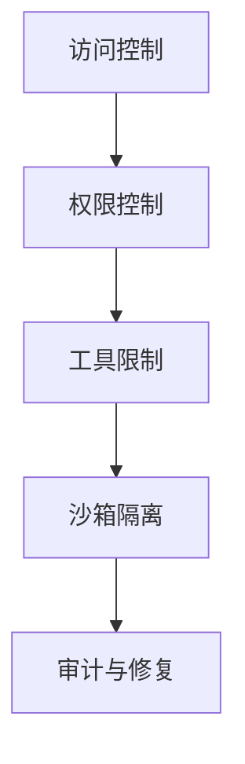

# 安全与沙箱隔离：保护你的 AI 助手

## 学完你能做什么

- 配置多层安全策略，从访问控制到工具权限
- 使用沙箱隔离限制 AI 助手的文件系统和网络访问
- 运行安全审计，发现并修复常见的安全隐患
- 根据不同场景（个人/家庭/公开）调整安全等级

## 你现在的困境

Clawdbot 让你的 AI 助手变得强大，但也带来了新的安全挑战：

- **Shell 访问**：AI 可以执行任意命令，读写文件
- **网络访问**：AI 可以访问任意 URL 和服务
- **消息发送**：AI 可以向任何人发送消息（如配置了 WhatsApp）
- **远程控制**：通过浏览器工具控制本地浏览器
- **数据暴露**：所有对话历史存储在磁盘上

没有适当的防护，一个被操纵的 AI 模型可能导致灾难性的后果。

## 什么时候用这一招

- ✅ 你需要运行 AI 助手在自有设备上，担心安全风险
- ✅ 你想将 AI 助手暴露给多人使用（家庭成员、团队）
- ✅ 你需要限制 AI 访问特定文件或目录
- ✅ 你希望隔离不同用户/会话的访问范围
- ✅ 你需要让 AI 助手在受限环境中运行（沙箱）

::: info
**重要概念**：安全是分层的，从"谁能访问"到"能做什么"，最后才是"模型安全"。
::

## 🎒 开始前的准备

### 前置检查

- [x] 已完成[快速开始](../../start/getting-started/)，了解如何启动 Gateway
- [ ] 已配置至少一个 AI 模型（Anthropic、OpenAI 或 Ollama）
- [ ] 了解你的使用场景（个人使用、家庭共享、公开服务）
- [ ] 了解 Linux 文件权限概念（chmod）

### 推荐工具

- 命令行工具：Terminal 或 SSH
- 编辑器：你喜欢的代码编辑器
- Docker：用于运行沙箱容器（可选）

---

## 核心思路

Clawdbot 的安全模型基于一个核心哲学：**访问控制优先，限制后置安全**。

### 安全分层



1. **访问控制**：决定谁能与你的 AI 助手对话
2. **权限控制**：决定 AI 助手能调用哪些工具
3. **沙箱隔离**：决定工具运行在什么环境中（主机或容器）
4. **审计与修复**：持续检查和修复安全配置

这个分层设计确保即使模型被操纵，攻击范围也被限制在已定义的边界内。

### 访问控制的三层保护

Clawdbot 提供三层访问控制：

| 层级 | 保护内容 | 配置位置 |
|--- | --- | ---|
| **Gateway 认证** | WebSocket 连接 | `gateway.auth` |
| **DM 策略** | 私聊消息 | `channels.*.dmPolicy` |
| **Group 策略** | 群组消息 | `channels.*.groupPolicy` / `channels.*.groups` |

每一层都可以独立配置，形成纵深防御。

---

## 安全审计：发现风险

Clawdbot 提供内置的安全审计工具，可以快速发现常见的安全隐患。

### 运行审计

```bash
# 基础审计
clawdbot security audit

# 深度审计（包括 Gateway 探测）
clawdbot security audit --deep

# 自动修复安全建议
clawdbot security audit --fix
```

### 审计检查的内容

审计工具会检查以下方面：

| 检查类别 | 具体项目 | 风险等级 |
|--- | --- | ---|
| **入站访问** | Gateway 认证、DM 策略、Group 策略 | Critical / Warn |
| **工具访问** | Elevated exec 允许列表、工具 allow/deny | Critical / Warn |
| **网络暴露** | Gateway 绑定模式、Tailscale Serve/Funnel | Critical / Info |
| **浏览器控制** | 远程浏览器控制认证、URL 协议 | Critical / Warn |
| **文件权限** | 配置文件权限、状态目录权限 | Critical / Warn |
| **插件信任** | 未显式允许的插件 | Warn |

### 理解审计输出

审计报告会按严重级别分类：

- **Critical（红色）**：立即修复，可能导致远程代码执行或数据泄露
- **Warn（黄色）**：建议修复，降低安全边界
- **Info（蓝色）**：信息提示，非安全问题

### 自动修复

使用 `--fix` 标志时，审计工具会安全地应用以下修复：

- 将 `groupPolicy="open"` 改为 `allowlist`
- 将 `logging.redactSensitive="off"` 改为 `"tools"`
- 修复文件权限（配置文件 600，目录 700）

::: tip
**最佳实践**：定期运行审计，尤其是在更改配置或更新 Gateway 后。
::

---

## 访问控制：谁能访问你的 AI 助手

访问控制是第一道防线，决定谁能与你的 AI 助手交互。

### Gateway 认证

默认情况下，Gateway 需要认证才能接受 WebSocket 连接。

#### 配置认证方式

```json5
{
  "gateway": {
    "auth": {
      "mode": "token",  // 或 "password"
      "token": "your-long-random-token-please-change-me"
    }
  }
}
```

**认证模式**：

| 模式 | 用途 | 推荐场景 |
|--- | --- | ---|
| `token` | 共享 bearer token | 大多数情况，推荐 |
| `password` | 密码认证 | 本地开发，方便快速测试 |
| Tailscale Identity | Tailscale Serve | 远程访问通过 Tailscale |

::: warning
**重要**：如果 `gateway.bind` 设置为非 loopback（如 `lan`、`tailnet`），必须配置认证，否则拒绝连接。
::

### DM 策略：私聊保护

DM 策略控制陌生用户是否能直接与你的 AI 助手对话。

| 策略 | 行为 | 推荐场景 |
|--- | --- | ---|
| `pairing`（默认） | 未知发送者收到配对代码，配对前不处理 | 个人使用，推荐 |
| `allowlist` | 未知发送者被拒绝 | 多人可信环境 |
| `open` | 允许任何人 | 公开服务（需 `allowFrom` 包含 `"*"`） |
| `disabled` | 忽略所有私聊 | 仅使用群组功能 |

#### 配置示例

```json5
{
  "channels": {
    "whatsapp": {
      "dmPolicy": "pairing"
    },
    "telegram": {
      "dmPolicy": "allowlist",
      "allowFrom": ["user123", "user456"]
    }
  }
}
```

#### 管理配对

```bash
# 查看待批准的配对请求
clawdbot pairing list whatsapp

# 批准配对
clawdbot pairing approve whatsapp <配对代码>
```

::: tip
**最佳实践**：默认 `pairing` 模式提供了良好的用户体验和安全性平衡。仅在你明确信任所有用户时才使用 `allowlist` 或 `open`。
::

### Group 策略：群组消息控制

Group 策略决定 AI 助手如何在群组中响应消息。

| 策略 | 行为 | 配置位置 |
|--- | --- | ---|
| `allowlist` | 仅接受白名单中的群组 | `channels.whatsapp.groups` |
| `disabled` | 忽略所有群组消息 | `channels.telegram.groups` |
| `requireMention` | 仅在被 @ 提及或命令触发时响应 | `channels.*.groups.*` |

#### 配置示例

```json5
{
  "channels": {
    "whatsapp": {
      "groups": {
        "*": {
          "requireMention": true
        }
      }
    },
    "discord": {
      "guilds": {
        "your-guild-id": {
          "users": ["user1", "user2"]
        }
      }
    }
  }
}
```

::: tip
**最佳实践**：在公共群组中启用 `requireMention`，避免 AI 助手被恶意用户操控。
::

### 会话隔离：防止上下文泄露

默认情况下，所有私聊消息都路由到同一个主会话。当多个用户可以访问 AI 助手时，这可能导致上下文泄露。

```json5
{
  "session": {
    "dmScope": "per-channel-peer"  // 为每个渠道-发送者创建独立会话
  }
}
```

---

## 工具权限控制：限制 AI 能做什么

工具权限控制是第二道防线，决定 AI 助手能调用哪些工具。

### 工具 Allow/Deny 列表

你可以全局或每个 Agent 配置工具的白名单和黑名单。

```json5
{
  "agents": {
    "defaults": {
      "tools": {
        "allow": ["read", "write", "web_search"],
        "deny": ["exec", "browser", "web_fetch"]
      }
    },
    "list": [
      {
        "id": "read-only",
        "tools": {
          "allow": ["read"],
          "deny": ["write", "edit", "apply_patch", "exec", "browser"]
        }
      }
    ]
  }
}
```

### 常用工具分类

| 工具类别 | 具体工具 | 风险等级 |
|--- | --- | ---|
| **文件操作** | `read`、`write`、`edit`、`apply_patch` | 中等 |
| **Shell 执行** | `exec`、`process` | 高 |
| **浏览器控制** | `browser` | 高 |
| **网络访问** | `web_search`、`web_fetch` | 中等 |
| **Canvas 可视化** | `canvas` | 中等 |
| **节点操作** | `nodes_invoke` | 高 |
| **Cron 定时任务** | `cron` | 中等 |
| **消息发送** | `message`、`sessions_*` | 低 |

### Elevated 模式：主机执行的逃生口

Elevated exec 是一个特殊的逃生口，允许工具在主机上运行，绕过沙箱。

```json5
{
  "tools": {
    "elevated": {
      "enabled": true,
      "allowFrom": {
        "whatsapp": ["your-trusted-user-id"]
      },
      "security": "allowlist",
      "ask": "on"  // 每次执行前询问确认
    }
  }
}
```

::: danger
**重要警告**：Elevated exec 绕过沙箱限制。仅在你完全信任允许的用户和场景时启用。
::

::: tip
**最佳实践**：对于大多数场景，禁用 elevated exec，依赖沙箱隔离和严格的工具白名单。
::

---

## 沙箱隔离：运行在受限环境中

沙箱隔离让工具运行在 Docker 容器中，限制文件系统和网络访问。

### 沙箱模式

| 模式 | 行为 | 推荐场景 |
|--- | --- | ---|
| `off` | 所有工具在主机上运行 | 个人可信环境 |
| `non-main`（推荐） | 主会话在主机，其他会话在沙箱 | 平衡性能和安全 |
| `all` | 所有会话在沙箱 | 多人环境、公开服务 |

```json5
{
  "agents": {
    "defaults": {
      "sandbox": {
        "mode": "non-main"
      }
    }
  }
}
```

### 工作区访问

工作区访问决定沙箱容器能看到主机的哪些目录。

| 访问级别 | 行为 | 推荐场景 |
|--- | --- | ---|
| `none`（默认） | 沙箱工作区 `~/.clawdbot/sandboxes` | 最大隔离 |
| `ro` | 代理工作区只读挂载在 `/agent` | 读取但不写入文件 |
| `rw` | 代理工作区读写挂载在 `/workspace` | 需要写入文件的 Agent |

```json5
{
  "agents": {
    "defaults": {
      "sandbox": {
        "workspaceAccess": "none"
      }
    }
  }
}
```

### 沙箱范围

沙箱范围决定容器隔离粒度。

| 范围 | 行为 | 容器数量 |
|--- | --- | ---|
| `session`（默认） | 每个会话一个容器 | 较多容器，更好隔离 |
| `agent` | 每个 Agent 一个容器 | 平衡隔离和资源 |
| `shared` | 所有会话共享一个容器 | 节省资源，隔离性最低 |

### Docker 配置

```json5
{
  "agents": {
    "defaults": {
      "sandbox": {
        "docker": {
          "image": "clawdbot-sandbox:bookworm-slim",
          "containerPrefix": "clawdbot-sbx-"
        }
      }
    }
}
```

### 自定义挂载

你可以将主机的额外目录挂载到沙箱容器。

```json5
{
  "agents": {
    "defaults": {
      "sandbox": {
        "docker": {
          "binds": [
            "/home/user/source:/source:ro",
            "/var/run/docker.sock:/var/run/docker.sock"
          ]
        }
      }
    }
  }
}
```

::: warning
**安全提示**：挂载绕过沙箱文件系统隔离。敏感挂载（如 docker.sock）应使用 `:ro`（只读）模式。
::

### 沙箱化浏览器

沙箱化浏览器将 Chrome 实例运行在容器中，隔离浏览器操作。

```json5
{
  "agents": {
    "defaults": {
      "sandbox": {
        "browser": {
          "enabled": true,
          "autoStart": true,
          "autoStartTimeoutMs": 10000
        }
      }
    }
  }
}
```

::: tip
**最佳实践**：沙箱化浏览器可以防止 AI 助手访问你日常浏览器的登录会话和敏感数据。
::

---

## 多 Agent 安全配置

不同 Agent 可以有不同的安全配置。

### 场景示例

#### 场景 1：个人 Agent（完全信任）

```json5
{
  "agents": {
    "list": [
      {
        "id": "personal",
        "sandbox": { "mode": "off" },
        "tools": {
          "allow": ["*"],
          "deny": []
        }
      }
    ]
  }
}
```

#### 场景 2：家庭 Agent（只读）

```json5
{
  "agents": {
    "list": [
      {
        "id": "family",
        "workspace": "~/clawd-family",
        "sandbox": {
          "mode": "all",
          "scope": "agent",
          "workspaceAccess": "ro"
        },
        "tools": {
          "allow": ["read"],
          "deny": ["write", "edit", "apply_patch", "exec", "browser"]
        }
      }
    ]
  }
}
```

#### 场景 3：公开 Agent（沙箱 + 严格限制）

```json5
{
  "agents": {
    "list": [
      {
        "id": "public",
        "workspace": "~/clawd-public",
        "sandbox": {
          "mode": "all",
          "scope": "agent",
          "workspaceAccess": "none"
        },
        "tools": {
          "allow": ["web_search", "sessions_list"],
          "deny": ["read", "write", "edit", "apply_patch", "exec", "browser", "web_fetch", "canvas", "nodes", "cron", "gateway", "image"]
        }
      }
    ]
  }
}
```

---

## Docker 化：完全隔离 Gateway

除了工具级别的沙箱，你还可以将整个 Gateway 运行在 Docker 容器中。

### 完全 Docker 化的优势

- 完全隔离 Gateway 进程
- 避免在主机上安装依赖
- 便于部署和管理
- 提供额外的安全边界

::: tip
何时使用 Docker 化 vs 工具沙箱：
- **工具沙箱**：大多数场景，平衡性能和安全
- **Docker 化**：生产环境、多租户部署、需要完全隔离
::

### Docker 安装参考

### Docker 安装参考

详细的 Docker 安装说明，请参考：[部署选项](../../appendix/deployment/)。

---

## 踩坑提醒

### 常见错误

#### ❌ 忘记配置 Gateway 认证

**错误配置**：
```json5
{
  "gateway": {
    "bind": "lan"  // 危险！
    "auth": {}
  }
}
```

**后果**：任何能连接到你局域网的人都能控制你的 AI 助手。

**正确配置**：
```json5
{
  "gateway": {
    "bind": "loopback",  // 或配置强认证
    "auth": {
      "mode": "token",
      "token": "your-secure-token"
    }
  }
}
```

#### ❌ 使用 `dmPolicy: "open"` 但忘记 `allowFrom`

**错误配置**：
```json5
{
  "channels": {
    "whatsapp": {
      "dmPolicy": "open"  // 危险！
    }
  }
}
```

**后果**：任何人都能给你的 AI 助手发消息。

**正确配置**：
```json5
{
  "channels": {
    "whatsapp": {
      "dmPolicy": "open",
      "allowFrom": ["*"]  // 必须显式允许
    }
  }
}
```

#### ❌ 启用 Elevated exec 但没有配置 allowFrom

**错误配置**：
```json5
{
  "tools": {
    "elevated": {
      "enabled": true  // 危险！
    }
  }
}
```

**后果**：任何用户都能执行主机命令。

**正确配置**：
```json5
{
  "tools": {
    "elevated": {
      "enabled": true,
      "allowFrom": {
        "discord": ["your-user-id"]  // 限制允许的用户
      },
      "security": "allowlist",
      "ask": "on"  // 要求确认
    }
  }
}
```

#### ❌ 敏感挂载使用读写模式

**错误配置**：
```json5
{
  "agents": {
    "defaults": {
      "sandbox": {
        "docker": {
          "binds": [
            "/var/run/docker.sock:/var/run/docker.sock"  // 危险！
          ]
        }
      }
    }
  }
}
```

**后果**：沙箱可以控制 Docker 守护进程。

**正确配置**：
```json5
{
  "agents": {
    "defaults": {
      "sandbox": {
        "docker": {
          "binds": [
            "/var/run/docker.sock:/var/run/docker.sock:ro"  // 只读
          ]
        }
      }
    }
}
```

### 最佳实践总结

| 实践 | 原因 |
|--- | ---|
| 默认使用 `pairing` 模式 | 平衡用户体验和安全 |
| 群组消息使用 `requireMention` | 避免被操控 |
| 使用工具白名单而非黑名单 | 最小权限原则 |
| 启用沙箱但设置 `workspaceAccess: "none"` | 隔离工作区访问 |
| 定期运行安全审计 | 持续安全监控 |
| 将敏感密钥存储在环境变量或配置文件中 | 避免代码泄露 |

---

## 本课小结

本课介绍了 Clawdbot 的安全模型和沙箱隔离功能：

**核心要点**：

1. **安全分层**：访问控制 → 权限控制 → 沙箱隔离 → 审计与修复
2. **访问控制**：Gateway 认证、DM 策略、Group 策略
3. **工具权限**：allow/deny 列表、Elevated 模式
4. **沙箱隔离**：模式、范围、工作区访问、Docker 配置
5. **安全审计**：`clawdbot security audit` 发现和修复问题

**安全第一原则**：
- 从最小权限开始，仅在必要时放宽
- 使用沙箱隔离限制攻击范围
- 定期审计和更新配置
- 对敏感功能（如 Elevated exec）保持谨慎

---

## 下一课预告

> 下一课我们将学习 **[远程 Gateway 与 Tailscale](../remote-gateway/)**。
>
> 你会学到：
> - 通过 Tailscale Serve 暴露 Gateway 到你的 Tailnet
> - 使用 Tailscale Funnel 公开访问（需谨慎）
> - SSH 隧道和反向代理配置
> - 远程访问的安全最佳实践

---

## 附录：源码参考

<details>
<summary><strong>点击展开查看源码位置</strong></summary>

> 更新时间：2026-01-27

| 功能 | 文件路径 | 行号 |
|--- | --- | ---|
| 安全审计 | [`src/security/audit.ts`](https://github.com/moltbot/moltbot/blob/main/src/security/audit.ts#L1-L910) | 1-910 |
| 安全修复 | [`src/security/fix.ts`](https://github.com/moltbot/moltbot/blob/main/src/security/fix.ts#L1-L385) | 1-385 |
| 文件权限检查 | [`src/security/audit-fs.ts`](https://github.com/moltbot/moltbot/blob/main/src/security/audit-fs.ts) | 全文件 |
| Gateway 配置 Schema | [`src/config/zod-schema.core.ts`](https://github.com/moltbot/moltbot/blob/main/src/config/zod-schema.core.ts) | 全文件 |
| Agent Defaults Schema | [`src/config/zod-schema.agent-defaults.ts`](https://github.com/moltbot/moltbot/blob/main/src/config/zod-schema.agent-defaults.ts) | 1-172 |
| Sandbox Schema | [`src/config/zod-schema.agent-runtime.ts`](https://github.com/moltbot/moltbot/blob/main/src/config/zod-schema.agent-runtime.ts) | 82-511 |
| 沙箱管理 | [`src/agents/sandbox.ts`](https://github.com/moltbot/moltbot/blob/main/src/agents/sandbox.ts) | 全文件 |
| 沙箱配置解析 | [`src/agents/sandbox/config.js`](https://github.com/moltbot/moltbot/blob/main/src/agents/sandbox/config.js) | 全文件 |
| Docker 设置 | [`src/agents/sandbox/docker.js`](https://github.com/moltbot/moltbot/blob/main/src/agents/sandbox/docker.js) | 全文件 |
| 安全文档 | [`docs/gateway/security.md`](https://github.com/moltbot/moltbot/blob/main/docs/gateway/security.md) | 全文件 |
| 沙箱文档 | [`docs/gateway/sandboxing.md`](https://github.com/moltbot/moltbot/blob/main/docs/gateway/sandboxing.md) | 全文件 |
| 沙箱 CLI | [`docs/cli/sandbox.md`](https://github.com/moltbot/moltbot/blob/main/docs/cli/sandbox.md) | 全文件 |

**关键配置字段**：

```typescript
// Sandbox 配置
sandbox: {
  mode: "off" | "non-main" | "all",  // 沙箱模式
  workspaceAccess: "none" | "ro" | "rw",  // 工作区访问
  scope: "session" | "agent" | "shared",  // 沙箱范围
  docker: {
    image: string,  // Docker 镜像
    binds: string[],  // 主机挂载
    network: "bridge" | "none" | "custom"  // 网络模式
  },
  browser: {
    enabled: boolean,  // 是否沙箱化浏览器
    autoStart: boolean,  // 自动启动
  },
  prune: {
    idleHours: number,  // 空闲后自动删除
    maxAgeDays: number,  // 最大保留天数
  }
}

// 工具权限
tools: {
  allow: string[],  // 允许的工具
  deny: string[],  // 拒绝的工具
  elevated: {
    enabled: boolean,  // 是否启用主机执行
    allowFrom: {  // 每个渠道的允许列表
      [provider: string]: string[] | number[]
    },
    security: "deny" | "allowlist" | "full",  // 安全策略
    ask: "off" | "on-miss" | "always",  // 确认策略
  }
}

// DM 策略
dmPolicy: "pairing" | "allowlist" | "open" | "disabled"

// Group 策略
groupPolicy: "allowlist" | "open" | "disabled"
```

**关键常量**：

- `DEFAULT_SANDBOX_IMAGE`: `"clawdbot-sandbox:bookworm-slim"` - 默认沙箱镜像
- `DEFAULT_SANDBOX_COMMON_IMAGE`: 默认通用沙箱镜像

**关键函数**：

- `runSecurityAudit()`: 运行安全审计
- `fixSecurityFootguns()`: 应用安全修复
- `resolveSandboxConfigForAgent()`: 解析 Agent 的沙箱配置
- `buildSandboxCreateArgs()`: 构建沙箱容器创建参数

</details>
