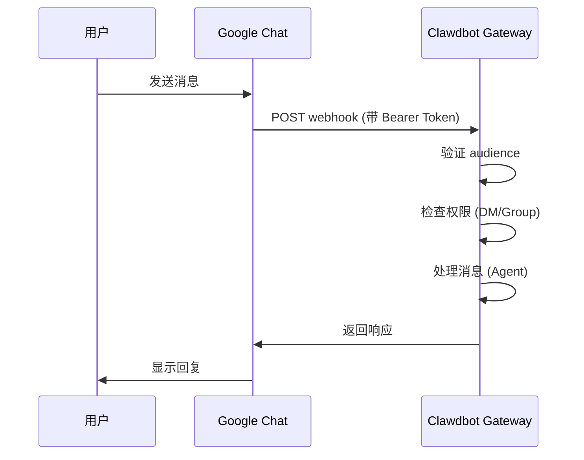

# Google Chat 渠道配置

## 学完你能做什么

- 在 Google Chat 中与你的 AI 助手进行 1:1 私聊
- 在 Google Chat 空间中使用 @提及触发 AI 助手
- 掌握 Service Account 认证和 Webhook 配置方法
- 学会使用 Tailscale Funnel 安全暴露公开 URL

## 你现在的困境

你想在公司或团队中通过 Google Chat 使用 AI 助手，但不知道如何：

- 创建和配置 Google Cloud 项目
- 设置 Service Account 认证
- 配置 Webhook 使 Google Chat 能连接到你的 Gateway
- 安全地将 Gateway 暴露到公网

## 什么时候用这一招

**适合使用 Google Chat 渠道的场景**：

- 你的团队主要使用 Google Chat 进行沟通
- 需要在 Google Workspace 环境中使用 AI 助手
- 希望通过 Google Chat Spaces 协作工作
- 需要通过公开 Webhook 接收 Google Chat 消息

**不适合的场景**：

- 个人使用（推荐 WebChat、Telegram、WhatsApp）
- 需要 OAuth 用户授权（Google Chat 只支持 Service Account）

## 核心思路

Google Chat 渠道的工作流程：



**关键概念**：

| 概念 | 说明 |
|--- | ---|
| **Service Account** | Google Cloud 认证方式，用于机器人身份验证 |
| **Webhook** | Google Chat POST 消息到 Gateway 的 HTTP 端点 |
| **Audience** | 用于验证 webhook 请求的目标（app-url 或 project-number） |
| **DM 配对** | 默认安全机制，陌生发送者需要批准 |

::: tip
Google Chat 渠道仅支持 Service Account 认证，不支持 OAuth 用户授权。如果需要用户级权限，考虑使用其他渠道。
:::

## 🎒 开始前的准备

确保你已经：

- ✅ 完成 [快速开始](../../start/getting-started/) 并安装了 Clawdbot
- ✅ Gateway 正在运行（`clawdbot gateway --port 18789`）
- ✅ 有 Google Cloud 账户访问权限
- ✅ 理解基础的终端命令使用

::: warning
Google Chat Webhook 需要公开的 HTTPS 端点。本教程会介绍如何使用 Tailscale Funnel 或反向代理安全暴露服务。
:::

## 跟我做

### 第 1 步：创建 Google Cloud 项目并启用 Chat API

**为什么**
首先需要一个 Google Cloud 项目来承载 Chat 应用和 Service Account。

1. 访问 [Google Chat API Credentials](https://console.cloud.google.com/apis/api/chat.googleapis.com/credentials)
2. 如果未启用 API，点击 **Enable API**

**你应该看到**：
- Chat API 已启用并显示为 "API enabled"
- 进入 Credentials 管理页面

### 第 2 步：创建 Service Account

**为什么**
Service Account 是机器人身份，用于认证 webhook 请求。

1. 在 Credentials 页面，点击 **Create Credentials** > **Service Account**
2. 输入名称（例如 `clawdbot-chat`）
3. 点击 **Continue**（跳过权限设置）
4. 保持访问控制为空，点击 **Done**

**你应该看到**：
- 新创建的 Service Account 出现在列表中

### 第 3 步：创建并下载 JSON Key

**为什么**
JSON Key 包含认证凭据，Clawdbot 需要它来验证 Google Chat 请求。

1. 点击刚创建的 Service Account
2. 进入 **Keys** 标签页
3. 点击 **Add Key** > **Create new key**
4. 选择 **JSON** 格式，点击 **Create**
5. 下载的 JSON 文件会自动保存

**你应该看到**：
- 浏览器下载一个 `.json` 文件

::: warning
⚠️ 重要：这个 JSON Key 只会下载一次，请妥善保管！如果丢失，必须重新创建。
:::

### 第 4 步：存储 Service Account 文件

**为什么**
Clawdbot 需要读取 Key 文件来验证 Google Chat 请求。

1. 将下载的 JSON 文件移动到安全位置：
   ```bash
   mv ~/Downloads/*.json ~/.clawdbot/googlechat-service-account.json
   ```
2. 设置文件权限（可选但推荐）：
   ```bash
   chmod 600 ~/.clawdbot/googlechat-service-account.json
   ```

**你应该看到**：
- 文件已存储在 `~/.clawdbot/` 目录下
- 权限设置为仅所有者可读写

### 第 5 步：创建 Google Chat 应用

**为什么**
Chat App 定义了机器人的外观、行为和 webhook URL。

1. 访问 [Google Cloud Console Chat Configuration](https://console.cloud.google.com/apis/api/chat.googleapis.com/hangouts-chat)
2. 填写 **Application info**：
   - **App name**: `Clawdbot`（或其他名称）
   - **Avatar URL**: `https://clawd.bot/logo.png`（可选）
   - **Description**: `Personal AI Assistant`（可选）
3. 启用 **Interactive features**
4. 在 **Functionality** 下，勾选 **Join spaces and group conversations**
5. 在 **Connection settings** 下，选择 **HTTP endpoint URL**
6. 在 **Visibility** 下，选择 **Make this Chat app available to specific people and groups in &lt;Your Domain&gt;**
7. 输入你的 Google Workspace 邮箱（例如 `user@example.com`）
8. 点击页面底部的 **Save**

**你应该看到**：
- 应用配置已保存
- 页面显示 "App status" 部分

### 第 6 步：配置 Webhook Triggers

**为什么**
Triggers 定义了 Google Chat 何时向 Gateway 发送消息。

1. 在保存后刷新页面
2. 找到 **App status** 部分（通常在顶部或底部）
3. 将状态更改为 **Live - available to users**
4. 再次点击 **Save**

**你应该看到**：
- App status 显示为 "Live - available to users"

::: info
💡 提示：Webhook URL 将在第 7 步配置。如果不确定，可以先用占位符 `https://example.com/googlechat`，稍后更新。
:::

### 第 7 步：获取 Gateway 的公共 URL

**为什么**
Google Chat 需要一个公开的 HTTPS URL 来发送 webhook 请求。

运行以下命令查看 Gateway 的公共 URL：

```bash
clawdbot status
```

**你应该看到**：
- 输出中包含公共 URL（例如 `https://your-node.tailnet.ts.net`）

::: warning
如果 Gateway 未配置 Tailscale 或反向代理，你需要先设置公开访问（见下一步）。
:::

### 第 8 步：公开 Webhook 端点（选择其一）

::: tip
推荐使用 Tailscale Funnel，它可以只暴露 `/googlechat` 路径，保持其他端点私密。
:::

#### 选项 A：Tailscale Funnel（推荐）

**为什么 Tailscale Funnel**
- 只暴露特定路径，提高安全性
- 内网 Gateway 保持私有，仅 Webhook 可访问
- 无需购买域名和配置 SSL

1. **检查 Gateway 绑定地址**：
   ```bash
   ss -tlnp | grep 18789
   ```
   记录 IP 地址（例如 `127.0.0.1`、`0.0.0.0` 或 Tailscale IP 如 `100.x.x.x`）

2. **仅向 tailnet 暴露控制面板**（端口 8443）：
   ```bash
   # 如果绑定到 localhost (127.0.0.1 或 0.0.0.0):
   tailscale serve --bg --https 8443 http://127.0.0.1:18789
   
   # 如果绑定到 Tailscale IP (例如 100.106.161.80):
   tailscale serve --bg --https 8443 http://100.106.161.80:18789
   ```

3. **公开 Webhook 路径**：
   ```bash
   # 如果绑定到 localhost (127.0.0.1 或 0.0.0.0):
   tailscale funnel --bg --set-path /googlechat http://127.0.0.1:18789/googlechat
   
   # 如果绑定到 Tailscale IP (例如 100.106.161.80):
   tailscale funnel --bg --set-path /googlechat http://100.106.161.80:18789/googlechat
   ```

4. **授权节点访问 Funnel**（如果提示）：
   - 访问输出中显示的授权 URL
   - 在 Tailscale 管理面板中为该节点启用 Funnel

5. **验证配置**：
   ```bash
   tailscale serve status
   tailscale funnel status
   ```

**你应该看到**：
- Serve 和 Funnel 均运行中
- 公共 Webhook URL：`https://<node-name>.<tailnet>.ts.net/googlechat`
- 私有控制面板：`https://<node-name>.<tailnet>.ts.net:8443/`

#### 选项 B：Caddy 反向代理

**为什么 Caddy**
- 支持自动 HTTPS
- 灵活的路径路由配置

1. 创建 Caddyfile：
   ```txt
   your-domain.com {
       reverse_proxy /googlechat* localhost:18789
   }
   ```

2. 启动 Caddy：
   ```bash
   caddy run --config Caddyfile
   ```

**你应该看到**：
- Caddy 已启动并监听 443 端口
- 只有 `your-domain.com/googlechat` 路径路由到 Gateway

#### 选项 C：Cloudflare Tunnel

**为什么 Cloudflare Tunnel**
- 免费的全球 CDN
- 简单的路径规则配置

1. 配置隧道入口规则：
   - **Path**: `/googlechat` -> `http://localhost:18789/googlechat`
   - **Default Rule**: HTTP 404 (Not Found)

### 第 9 步：更新 Google Chat Webhook URL

**为什么**
现在有了公共 URL，更新 Chat App 配置以指向正确的端点。

1. 返回 Google Cloud Console Chat Configuration 页面
2. 在 **Triggers** 部分：
   - 选择 **Use a common HTTP endpoint URL for all triggers**
   - 设置为：`<你的公开 URL>/googlechat`
   - 例如：`https://your-node.tailnet.ts.net/googlechat`
3. 点击 **Save**

**你应该看到**：
- Triggers 已更新并保存

### 第 10 步：配置 Clawdbot

**为什么**
告诉 Clawdbot 使用哪个 Service Account 和 Webhook 路径。

**方式 A：环境变量**

```bash
export GOOGLE_CHAT_SERVICE_ACCOUNT_FILE="/path/to/service-account.json"
clawdbot gateway restart
```

**方式 B：配置文件**

编辑 `~/.clawdbot/clawdbot.json`：

```json5
{
  channels: {
    googlechat: {
      enabled: true,
      serviceAccountFile: "/Users/yourname/.clawdbot/googlechat-service-account.json",
      audienceType: "app-url",
      audience: "https://your-node.tailnet.ts.net/googlechat",
      webhookPath: "/googlechat",
      dm: {
        policy: "pairing",
        allowFrom: ["users/1234567890", "your-email@example.com"]
      },
      groupPolicy: "allowlist",
      groups: {
        "spaces/AAAA": {
          allow: true,
          requireMention: true,
          users: ["users/1234567890"],
          systemPrompt: "Short answers only."
        }
      }
    }
  }
}
```

**重启 Gateway**：

```bash
clawdbot gateway restart
```

**你应该看到**：
- Gateway 启动并显示 "Google Chat default: enabled, configured, ..."
- 无错误日志

### 第 11 步：将 Bot 添加到 Google Chat

**为什么**
最后一步，在 Google Chat 中找到并添加机器人。

1. 访问 [Google Chat](https://chat.google.com/)
2. 点击 **+**（加号）图标，在 **Direct Messages** 旁边
3. 在搜索框（通常添加联系人的地方）输入 **App name**（第 5 步配置的名称）
   - **注意**：机器人不会出现在 "Marketplace" 浏览列表，因为它是私有应用。必须按名称搜索。
4. 从结果中选择你的机器人
5. 点击 **Add** 或 **Chat** 开始 1:1 对话

**你应该看到**：
- 机器人出现在联系人列表中
- 聊天窗口打开

### 第 12 步：发送测试消息

**为什么**
验证配置是否正确，消息是否正常传递。

在聊天窗口输入：

```
Hello
```

**你应该看到**：
- 机器人回复问候语或确认消息
- Gateway 日志显示收到和处理的消息

## 检查点 ✅

验证配置是否成功：

```bash
# 检查渠道状态
clawdbot channels status

# 应该显示：
# Google Chat default: enabled, configured, webhook listening
```

::: info
如果看到错误，运行 `clawdbot channels status --probe` 查看详细的诊断信息。
:::

## 配置详解

### Service Account 认证

| 配置项 | 类型 | 默认值 | 说明 |
|--- | --- | --- | ---|
| `serviceAccountFile` | string | - | Service Account JSON 文件路径 |
| `serviceAccount` | string\|object | - | 内联 JSON 凭据（替代文件路径） |
| `audienceType` | "app-url"\|"project-number" | "app-url" | 验证类型：URL 或项目编号 |
| `audience` | string | - | Audience 值（URL 或项目编号） |

### DM 策略

默认情况下，陌生发送者需要配对：

| 配置项 | 类型 | 默认值 | 说明 |
|--- | --- | --- | ---|
| `dm.enabled` | boolean | 未定义 | 是否启用 DM 接收 |
| `dm.policy` | "pairing"|"open" | "pairing" | 访问策略：配对或开放 |
| `dm.allowFrom` | array | [] | 允许的发送者列表（user IDs 或 emails） |

**配对新发送者**：

```bash
clawdbot pairing approve googlechat <配对码>
```

### 群组策略

| 配置项 | 类型 | 默认值 | 说明 |
|--- | --- | --- | ---|
| `groupPolicy` | "allowlist"|"disabled" | "allowlist" | 群组策略：允许列表或禁用 |
| `requireMention` | boolean | true | 是否需要 @提及触发 |
| `groups` | object | {} | 按空间 ID 的配置 |

**允许特定群组**：

```json5
{
  channels: {
    googlechat: {
      groups: {
        "spaces/AAAA": {
          allow: true,
          requireMention: true,
          users: ["users/1234567890"],
          systemPrompt: "Short answers only."
        }
      }
    }
  }
}
```

### 其他配置

| 配置项 | 类型 | 默认值 | 说明 |
|--- | --- | --- | ---|
| `webhookPath` | string | "/googlechat" | Webhook 路径 |
| `botUser` | string | - | 机器人用户资源名称（用于提及检测） |
| `typingIndicator` | "none"|"message"|"reaction" | "message" | 打字指示器模式 |
| `actions.reactions` | boolean | false | 是否支持表情反应 |
| `mediaMaxMb` | number | 未定义 | 最大媒体文件大小（MB） |

## 踩坑提醒

### 405 Method Not Allowed

**症状**：Google Cloud Logs Explorer 显示 `405 Method Not Allowed`

**原因**：Webhook 处理程序未注册

**解决方法**：

1. 确认配置中存在 `channels.googlechat` 部分：
   ```bash
   clawdbot config get channels.googlechat
   ```

2. 检查插件状态：
   ```bash
   clawdbot plugins list | grep googlechat
   ```

3. 如果显示 "disabled"，添加配置：
   ```json5
   {
     plugins: {
       entries: {
         googlechat: {
           enabled: true
         }
       }
     }
   }
   ```

4. 重启 Gateway：
   ```bash
   clawdbot gateway restart
   ```

### 未收到消息

**症状**：发送消息后无响应

**排查步骤**：

1. 运行 `clawdbot logs --follow` 并发送测试消息
2. 确认 Chat App 的 Webhook URL 和事件订阅
3. 检查 `audience` 配置是否正确
4. 如果提及 gating 阻塞回复，设置 `botUser` 并验证 `requireMention`

### Tailscale Funnel 无法启动

**症状**：`tailscale funnel` 报错

**原因**：未设置密码认证

**解决方法**：

在 `~/.clawdbot/clawdbot.json` 中添加：

```json5
{
  gateway: {
    auth: {
      mode: "password"
    }
  }
}
```

## 本课小结

- 创建了 Google Cloud 项目和 Service Account
- 配置了 Google Chat App 和 Webhook
- 使用 Tailscale Funnel 或反向代理公开端点
- 配置了 Clawdbot 使用 Service Account 认证
- 学会了 DM 配对和群组 @提及机制
- 测试了 1:1 和群组消息

## 下一课预告

> 下一课我们学习 **[Signal 渠道](../signal/)**。
>
> 你会学到：
> - 如何安装和配置 signal-cli
> - Signal 渠道的权限和访问控制
> - 与 Google Chat 的配置差异

---

## 附录：源码参考

<details>
<summary><strong>点击展开查看源码位置</strong></summary>

> 更新时间：2026-01-27

| 功能 | 文件路径 | 行号 |
|--- | --- | ---|
| Google Chat 配置类型定义 | [`src/config/types.googlechat.ts`](https://github.com/moltbot/moltbot/blob/main/src/config/types.googlechat.ts) | 1-109 |
| Google Chat Zod Schema | [`src/config/zod-schema.providers-core.ts`](https://github.com/moltbot/moltbot/blob/main/src/config/zod-schema.providers-core.ts) | 273-341 |
| 渠道注册表 | [`src/channels/registry.ts`](https://github.com/moltbot/moltbot/blob/main/src/channels/registry.ts) | 61-67 |
| 群组提及解析 | [`src/channels/plugins/group-mentions.ts`](https://github.com/moltbot/moltbot/blob/main/src/channels/plugins/group-mentions.ts) | 158-175 |
| Google Chat 文档 | [`docs/channels/googlechat.md`](https://github.com/moltbot/moltbot/blob/main/docs/channels/googlechat.md) | 1-221 |

**关键类型**：
- `GoogleChatConfig`: 完整的 Google Chat 配置接口
- `GoogleChatDmConfig`: DM 访问策略配置
- `GoogleChatGroupConfig`: 群组空间配置
- `GoogleChatActionConfig`: 动作（如表情反应）配置

**关键配置字段**：
- `audienceType`: "app-url" 或 "project-number"，用于验证 webhook 请求
- `audience`: Webhook URL 或项目编号，与 `audienceType` 配对
- `dm.policy`: 默认 "pairing"，控制陌生 DM 访问
- `groupPolicy`: 群组访问策略，"allowlist" 或 "disabled"

**认证机制**：
- 使用 Google Service Account JSON 凭据
- Webhook 请求通过 `Authorization: Bearer <token>` 头验证
- Token 与 `audience` 配置项比对以确保请求来自合法来源

</details>
