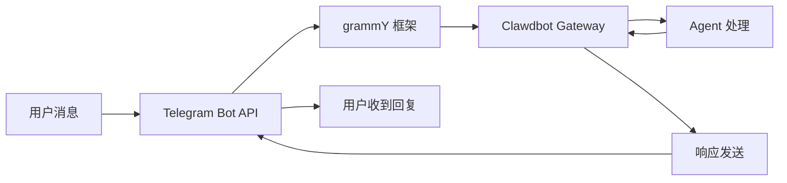

# Telegram 渠道配置与使用

## 学完你能做什么

- 🤖 在 Telegram 中创建 Bot 并获取 Bot Token
- ⚙️ 配置 Telegram 渠道连接到 Clawdbot
- 🔒 控制 DM 和群组的访问权限（配对机制和白名单）
- 📡 设置群组提及规则和响应策略
- 🔌 配置 Webhook 模式（可选）
- 🎯 使用 Telegram Bot API 特性（内联按钮、主题、回复）

## 你现在的困境

你已经在 Telegram 上使用 Clawdbot，但遇到了这些问题：

- ❌ 不清楚如何正确配置 Bot Token
- ❌ 陌生人给 Bot 发消息后，Bot 没有响应
- ❌ 在群组中，Bot 不响应非提及消息
- ❌ 想要精细控制谁能访问 Bot，但不知道如何配置
- ❌ 听说过 Webhook 和 Long-polling 的区别，不知道选哪个

这教程会帮你一步步解决这些问题。

## 什么时候用这一招

适合使用 Telegram 渠道的场景：

- ✅ 你已经在使用 Telegram，希望在这个平台与 AI 助手对话
- ✅ 你需要 Bot 在群组中响应特定用户或命令
- ✅ 你希望使用 Telegram Bot API 的特殊功能（内联按钮、Forum 主题）
- ✅ 你的服务器网络环境适合使用 Long-polling 或 Webhook

**如果主要使用 WhatsApp 或其他渠道**：这课可以跳过，专注于你使用的渠道。

## 🎒 开始前的准备

在开始之前，确保你已经：

- [ ] 完成了 [快速开始](../../start/getting-started/) 教程，Clawdbot 已安装并可以启动
- [ ] 有一个 Telegram 账户（不需要是 Premium 用户）
- [ ] 了解基本的 Telegram Bot 概念（Bot、Token、隐私模式）

::: info 配置文件位置
默认情况下，Clawdbot 的配置文件位于：
- **Linux/macOS**: `~/.clawdbot/clawdbot.json`
- **Windows**: `%USERPROFILE%\.clawdbot\clawdbot.json`
:::

## 核心思路

### Telegram Bot API vs 其他渠道

与其他即时通讯平台不同，Telegram 使用**Bot API** 架构：

| 特性 | Telegram | WhatsApp | Slack |
|--- | --- | --- | ---|
| 连接方式 | Bot API（HTTP） | Web Client | Bot API + WebSocket |
| 消息模式 | 推送（Bot 主动发送） | 拉取（监听 Web Client） | 拉取（监听 WebSocket） |
| 隐私模式 | **支持**（Bot 可选择） | N/A | N/A |
| 群组支持 | SuperGroup + Forum | Groups | Channels + Workspace |
| 特殊功能 | Forum 主题、内联按钮 | - | - |

### Clawdbot 的集成方式

Clawdbot 使用 [grammY](https://grammy.dev/) Bot API 框架集成 Telegram：



**关键点**：
- **Long-polling**：默认模式，Clawdbot 主动拉取 Telegram 更新
- **Webhook**：可选模式，Telegram 推送更新到你的服务器
- **DM 配对**：默认启用，陌生人需要先配对才能发送消息
- **群组提及**：默认启用，Bot 只响应 `@botname` 或配置的提及模式

### 访问控制机制

Clawdbot 提供三层访问控制：

1. **DM 层面**（`dmPolicy`）
   - `pairing`：陌生用户收到配对码，必须先批准
   - `allowlist`：只允许白名单中的用户
   - `open`：允许所有 DM（需配置 `allowFrom: ["*"]`）

2. **群组层面**（`groups` + `groupPolicy`）
   - 列出哪些群组可以访问 Bot
   - 设置每个群组的 `requireMention` 规则

3. **发送者层面**（`allowFrom` + `groupAllowFrom`）
   - 在已允许的 DM/群组中，进一步限制谁可以发送消息

::: warning 安全默认
默认 DM 策略是 `pairing`，这是最安全的默认值。陌生人发送的消息会被忽略，直到你批准配对码。
:::

## 跟我做

### 第 1 步：创建 Telegram Bot 并获取 Token

**为什么**
Telegram Bot 需要 Bot Token 才能通过 Bot API 访问和发送消息。这个 Token 相当于 Bot 的"身份凭证"。

**操作**

1. 在 Telegram 中搜索并打开 **@BotFather**
2. 发送命令 `/newbot`
3. 按照提示操作：
   - 输入 Bot 名称（例如：`My Clawdbot Assistant`）
   - 输入 Bot 用户名（必须以 `bot` 结尾，例如：`my_clawdbot_bot`）
4. BotFather 会返回 Bot Token，格式如：`123456:ABC-DEF123456`

**你应该看到**：
```
Done! Congratulations on your new bot.

You can find it at t.me/my_clawdbot_bot. You can now add a description,
about section and profile picture for it, see /help for a list of commands.

Use this token to access the HTTP API:
123456:ABC-DEF1234567890

Keep your token secure and store it safely, it can be used by anyone
to control your bot.
```

::: tip 安全建议
- 🔐 立即将 Token 复制并保存到安全的地方（如密码管理器）
- ⚠️ **绝不要**在公开仓库、社交媒体或与他人分享 Token
- 🔄 如果 Token 泄露，立即在 @BotFather 中使用 `/revoke` 命令撤销
:::

**可选 BotFather 配置**（推荐）

1. 设置群组权限：
   - `/setjoingroups` → 选择是否允许 Bot 被添加到群组
   - `/setprivacy` → 控制是否看到所有群组消息

2. 设置 Bot 信息：
   - `/setdescription` → 添加描述
   - `/setabouttext` → 添加关于文本
   - `/setuserpic` → 上传头像

### 第 2 步：配置 Telegram 渠道

**为什么**
配置文件告诉 Clawdbot 如何连接到 Telegram Bot API，以及如何处理消息和权限。

**操作**

创建或编辑 `~/.clawdbot/clawdbot.json`：

```json5
{
  "channels": {
    "telegram": {
      "enabled": true,
      "botToken": "123456:ABC-DEF1234567890",
      "dmPolicy": "pairing"
    }
  }
}
```

**配置字段说明**：

| 字段 | 类型 | 默认值 | 说明 |
|--- | --- | --- | ---|
| `enabled` | boolean | `true` | 是否启动 Telegram 渠道 |
| `botToken` | string | - | Bot Token（必需） |
| `dmPolicy` | string | `"pairing"` | DM 访问策略 |
| `allowFrom` | array | `[]` | DM 白名单（用户 ID 或 @用户名） |
| `groupPolicy` | string | `"allowlist"` | 群组访问策略 |
| `groupAllowFrom` | array | `[]` | 群组发送者白名单 |
| `groups` | object | `{}` | 群组详细配置 |

**环境变量方式**（可选）

你也可以使用环境变量（适用于默认账户）：

```bash
export TELEGRAM_BOT_TOKEN="123456:ABC-DEF1234567890"
```

::: tip 环境变量优先级
如果同时配置了环境变量和配置文件：
- **配置文件优先**（`channels.telegram.botToken`）
- 环境变量作为**默认账户的后备**
:::

### 第 3 步：启动 Gateway 并验证连接

**为什么**
启动 Gateway 让它根据配置连接到 Telegram Bot API，并开始监听消息。

**操作**

1. 在终端中启动 Gateway：

```bash
# 方式 1：直接启动
clawdbot gateway --verbose

# 方式 2：使用守护进程
clawdbot gateway --port 18789 --verbose
```

2. 观察 Gateway 的启动日志，查找 Telegram 相关信息

**你应该看到**：
```
[INFO] Starting Gateway...
[INFO] Loading config from ~/.clawdbot/clawdbot.json
[INFO] Starting channels...
[INFO] Starting Telegram channel...
[INFO] Telegram bot connected: @my_clawdbot_bot
[INFO] Listening for updates (long-polling)...
```

::: tip 查看详细日志
使用 `--verbose` 标志可以看到更详细的日志，包括：
- 接收到的每条消息
- 会话路由决策
- 权限检查结果
:::

**检查点 ✅**

- [ ] Gateway 成功启动且没有报错
- [ ] 日志显示 "Telegram bot connected"
- [ ] 没有出现 "Authentication failed" 或 "Invalid token" 错误

### 第 4 步：在 Telegram 中测试 Bot

**为什么**
发送第一条消息验证 Bot 正确连接、配置生效、可以接收和回复消息。

**操作**

1. 在 Telegram 中搜索你的 Bot 用户名（如 `@my_clawdbot_bot`）
2. 点击"Start"按钮或发送 `/start` 命令
3. 如果是第一次 DM 联系，你应该收到配对码

**你应该看到**：
```
👋 Hi! I'm your Clawdbot assistant.

To get started, please approve this pairing code:
CLAW-ABC123

Run this command in your terminal:
clawdbot pairing approve telegram CLAW-ABC123
```

**如果 Bot 没有响应**：

| 问题 | 可能原因 | 解决方法 |
|--- | --- | ---|
| Bot 无响应 | Bot Token 错误 | 检查 `clawdbot.json` 中的 `botToken` 值 |
| Bot 无响应 | Gateway 未启动 | 运行 `clawdbot gateway --verbose` 查看错误 |
| Bot 无响应 | 网络问题 | 检查服务器是否能访问 `api.telegram.org` |
| Bot 无响应 | Bot 被封禁 | 在 @BotFather 中检查 Bot 状态 |

### 第 5 步：批准 DM 配对（如果适用）

**为什么**
默认 DM 策略是 `pairing`，陌生人需要你批准后才能发送消息给 Bot。这保证了安全性。

**操作**

1. 在终端中运行配对命令：

```bash
# 查看待批准的配对
clawdbot pairing list telegram

# 批准配对码
clawdbot pairing approve telegram CLAW-ABC123
```

2. 配对成功后，用户可以正常发送消息给 Bot

**你应该看到**：
```
✅ Pairing approved: telegram:user:123456789

User @username can now send messages to the bot.
```

::: tip 配对码过期
配对码在 1 小时后过期。用户需要重新发送 `/start` 命令获取新码。
:::

## 群组配置

### 获取群组 Chat ID

要配置群组访问控制，首先需要知道群组的 Chat ID。

**方法 1：使用第三方 Bot（快速但不推荐）**

1. 将你的 Bot 添加到群组
2. 在群组中转发任意消息到 `@userinfobot`
3. Bot 会返回群组信息，包括 Chat ID

**方法 2：使用 Gateway 日志（推荐）**

1. 在群组中发送任意消息给 Bot
2. 运行：

```bash
clawdbot logs --follow
```

3. 在日志中查找 `chat.id` 字段，群组 ID 通常是负数（如 `-1001234567890`）

**你应该看到**：
```
[INFO] Received message from chat: -1001234567890
```

### 配置群组访问

**方式 1：允许所有群组**

```json5
{
  "channels": {
    "telegram": {
      "groups": {
        "*": {
          "requireMention": true
        }
      }
    }
  }
}
```

**方式 2：仅允许特定群组**

```json5
{
  "channels": {
    "telegram": {
      "groups": {
        "-1001234567890": {
          "requireMention": false
        },
        "-1009876543210": {
          "requireMention": true
        }
      }
    }
  }
}
```

**方式 3：群组中始终响应（不要求提及）**

```json5
{
  "channels": {
    "telegram": {
      "groups": {
        "-1001234567890": {
          "requireMention": false
        }
      }
    }
  }
}
```

### Telegram 隐私模式设置

如果群组中 Bot **不响应非提及消息**，可能是隐私模式限制。

**检查步骤**：

1. 在 @BotFather 中运行 `/setprivacy`
2. 选择 **Disable**（关闭隐私模式）
3. **重要**：Telegram 要求你从群组中移除并重新添加 Bot，设置才会生效
4. 重新添加 Bot 到群组

::: warning 隐私模式影响
- ✅ **隐私模式 OFF**：Bot 可以看到所有群组消息（需要 `requireMention: false` 才会响应所有消息）
- ⚠️ **隐私模式 ON**：Bot 只看到 @提及 或 Bot 被回复的消息（默认）
- 🛡️ **Bot 是管理员**：管理员 Bot 可以看到所有消息，无论隐私模式如何
:::

### 会话内群组激活

你也可以使用命令动态切换群组响应行为（会话级别，重启后失效）：

- `/activation always` — 群组中响应所有消息
- `/activation mention` — 只响应提及（默认）

::: tip 推荐使用配置
为了持久化行为，推荐在 `clawdbot.json` 中配置 `groups.requireMention`，而不是依赖命令。
:::

## 高级配置

### Webhook 模式（可选）

默认使用 **Long-polling**（主动拉取更新）。如果你有公共服务器，可以使用 Webhook 模式。

**配置 Webhook**：

```json5
{
  "channels": {
    "telegram": {
      "webhookUrl": "https://your-domain.com/telegram-webhook",
      "webhookSecret": "your-secret-token"
    }
  }
}
```

**Webhook vs Long-polling**：

| 特性 | Long-polling | Webhook |
|--- | --- | ---|
| 网络要求 | 需要主动访问 `api.telegram.org` | 需要公共 HTTPS 端点 |
| 延迟 | ~1-3 秒轮询间隔 | 近乎实时推送 |
| 服务器资源 | 较高（持续轮询） | 较低（被动接收） |
| 适用场景 | 家庭服务器、无公共 IP | VPS、有域名 |

::: tip 本地 Webhook 测试
如果你想在本地测试 Webhook：
- 使用 `ngrok` 或 `localtunnel` 创建临时隧道
- 将隧道 URL 配置为 `webhookUrl`
- Gateway 会在 `0.0.0.0:8787` 监听 `/telegram-webhook`
:::

### 媒体大小限制

控制 Telegram 中发送和接收的媒体文件大小：

```json5
{
  "channels": {
    "telegram": {
      "mediaMaxMb": 10
    }
  }
}
```

- 默认：5MB
- 超出限制的媒体会被拒绝

### 消息分块配置

Telegram 对单条消息的文本长度有限制（约 4096 字符）。Clawdbot 会自动分块长消息。

```json5
{
  "channels": {
    "telegram": {
      "textChunkLimit": 4000,
      "chunkMode": "length"
    }
  }
}
```

**分块模式**：

- `"length"`：按字符数分块（默认）
- `"newline"`：先按空行分割（保留段落），再按长度分块

### Forum 主题支持

Telegram Forum 超级群支持主题。Clawdbot 会为每个主题创建独立会话。

```json5
{
  "channels": {
    "telegram": {
      "groups": {
        "-1001234567890": {
          "topics": {
            "12345": {
              "requireMention": false,
              "systemPrompt": "You are a specialist in this topic."
            }
          }
        }
      }
    }
  }
}
```

**主题会话键格式**：
```
agent:main:telegram:group:-1001234567890:topic:12345
```

### 内联按钮

Telegram 支持交互式按钮（Inline Buttons）。

**启用按钮**：

```json5
{
  "channels": {
    "telegram": {
      "capabilities": {
        "inlineButtons": "allowlist"
      }
    }
  }
}
```

**按钮作用域**：

- `"off"`：禁用按钮
- `"dm"`：仅在 DM 中允许
- `"group"`：仅在群组中允许
- `"all"`：DM + 群组
- `"allowlist"`：DM + 群组，但只允许 `allowFrom` 中的发送者

**通过 Agent 发送按钮**：

使用 `telegram` 工具的 `sendMessage` 操作：

```json5
{
  "action": "send",
  "channel": "telegram",
  "to": "123456789",
  "message": "Choose an option:",
  "buttons": [
    [
      {"text": "Yes", "callback_data": "yes"},
      {"text": "No", "callback_data": "no"}
    ],
    [
      {"text": "Cancel", "callback_data": "cancel"}
    ]
  ]
}
```

**按钮回调处理**：

当用户点击按钮时，Agent 会收到格式如 `callback_data: value` 的消息。

### 反应通知

控制 Agent 是否接收用户对消息的反应（emoji）。

```json5
{
  "channels": {
    "telegram": {
      "reactionNotifications": "all",
      "reactionLevel": "minimal"
    }
  }
}
```

**反应通知模式**：

- `"off"`：忽略所有反应
- `"own"`：只通知用户对 Bot 消息的反应（默认）
- `"all"`：通知所有反应

**Agent 反应级别**：

- `"off"`：Agent 不能发送反应
- `"ack"`：处理时发送确认反应 👀
- `"minimal"`：谨慎使用反应（每 5-10 次交换 1 次，默认）
- `"extensive"`：自由使用反应

## 踩坑提醒

### 常见配置错误

| 错误 | 症状 | 原因 | 解决方法 |
|--- | --- | --- | ---|
| Token 格式错误 | "Invalid token" 错误 | 复制了不完整的 Token | 检查 Token 是否完整（包含冒号） |
| 环境变量冲突 | Bot 使用不同的 Token | 环境变量覆盖了配置文件 | 优先使用 `channels.telegram.botToken` |
| 群组不响应 | Bot 不处理群组消息 | 隐私模式未关闭 | 在 @BotFather 中运行 `/setprivacy` |
| Webhook 失败 | "Webhook setup failed" | URL 无法访问或 HTTPS 不正确 | 检查服务器和证书 |

### 网络问题

**IPv6 路由问题**：

一些服务器优先使用 IPv6 解析 `api.telegram.org`，如果 IPv6 网络有问题会导致请求失败。

**症状**：
- Bot 启动但很快停止响应
- 日志显示 "HttpError: Network request failed"

**解决方法**：

1. 检查 DNS 解析：

```bash
dig +short api.telegram.org A    # IPv4
dig +short api.telegram.org AAAA # IPv6
```

2. 强制使用 IPv4（添加到 `/etc/hosts` 或修改 DNS 配置）

```bash
# /etc/hosts 示例
123.45.67.89 api.telegram.org
```

3. 重启 Gateway

### 隐私模式陷阱

**问题**：
- 关闭隐私模式后，Bot 仍然看不到群组消息

**原因**：
- Telegram 要求你从群组中**移除并重新添加** Bot

**解决方法**：
1. 在群组中移除 Bot
2. 重新添加 Bot 到群组
3. 等待 30 秒后测试

## 本课小结

本课你学会了：

- ✅ 在 Telegram 中创建 Bot 并获取 Token
- ✅ 配置 Clawdbot 连接到 Telegram Bot API
- ✅ 理解和使用 DM 配对机制
- ✅ 配置群组访问控制（白名单 + 提及规则）
- ✅ 了解 Webhook vs Long-polling 的区别
- ✅ 配置高级功能（媒体限制、分块、Forum 主题、内联按钮）
- ✅ 处理常见网络和配置问题

**关键配置字段回顾**：

| 字段 | 推荐值 | 说明 |
|--- | --- | ---|
| `dmPolicy` | `"pairing"` | 最安全的默认 DM 策略 |
| `groups.*.requireMention` | `true` | 群组默认要求提及 |
| `reactionNotifications` | `"own"` | 只响应 Bot 消息的反应 |
| `streamMode` | `"partial"` | 启用草稿流式更新 |

## 下一课预告

> 下一课我们学习 **[Slack 渠道](../../platforms/slack/)**。
>
> 你会学到：
> - 如何创建 Slack App 并获取 Bot Token
> - 配置 Slack Bot Token 和 App Token
> - 理解 Slack 的 Workspace 和 Channel 概念
> - 设置 Slack 特有的功能（线程、快捷方式、App Home）

---

## 附录：源码参考

<details>
<summary><strong>点击展开查看源码位置</strong></summary>

> 更新时间：2026-01-27

| 功能 | 文件路径 | 行号 |
|--- | --- | ---|
| Telegram Bot 创建 | [`src/telegram/bot.ts`](https://github.com/clawdbot/clawdbot/blob/main/src/telegram/bot.ts) | 106-452 |
| 配置类型定义 | [`src/config/types.telegram.ts`](https://github.com/clawdbot/clawdbot/blob/main/src/config/types.telegram.ts) | 14-157 |
| Telegram 文档 | [`docs/channels/telegram.md`](https://github.com/clawdbot/clawdbot/blob/main/docs/channels/telegram.md) | 1-547 |
| Bot 消息处理器 | [`src/telegram/bot-message.ts`](https://github.com/clawdbot/clawdbot/blob/main/src/telegram/bot-message.ts) | 全文件 |
| Bot 命令处理器 | [`src/telegram/bot-handlers.ts`](https://github.com/clawdbot/clawdbot/blob/main/src/telegram/bot-handlers.ts) | 全文件 |
| 原生命令注册 | [`src/telegram/bot-native-commands.ts`](https://github.com/clawdbot/clawdbot/blob/main/src/telegram/bot-native-commands.ts) | 全文件 |

**关键配置字段**：

- `dmPolicy`: DM 访问策略（`"pairing"` | `"allowlist"` | `"open"` | `"disabled"`）
- `groupPolicy`: 群组策略（`"open"` | `"allowlist"` | `"disabled"`）
- `requireMention`: 群组是否要求提及（`boolean`）
- `reactionNotifications`: 反应通知模式（`"off"` | `"own"` | `"all"`）
- `reactionLevel`: Agent 反应级别（`"off"` | `"ack"` | `"minimal"` | `"extensive"`）

**关键函数**：

- `createTelegramBot()`: 创建 Telegram Bot 实例并配置 grammY 框架
- `createTelegramWebhookCallback()`: 创建 Webhook 回调处理器
- `getTelegramSequentialKey()`: 生成会话键，支持 Forum 主题和普通群组

**依赖库**：

- [grammY](https://grammy.dev/): Telegram Bot API 框架
- @grammyjs/runner: 顺序化更新处理
- @grammyjs/transformer-throttler: API 节流限制

</details>
