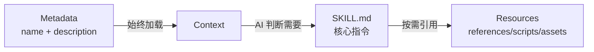

# 技能结构详解

## 学完你能做什么

- 精确理解 SKILL.md 的所有字段要求和格式规范
- 掌握 references/、scripts/、assets/ 的设计原理和使用场景
- 优化技能的 token 使用和加载性能
- 避免常见的格式错误和路径解析问题
- 使用渐进式加载提升 AI 上下文效率

## 你现在的困境

你已经学会了创建基本技能，但对 SKILL.md 的完整规范还不够了解。你的技能可能遇到以下问题：

- SKILL.md 超长，导致 token 消耗过高
- 不确定哪些内容应该放在 references/ 而不是 SKILL.md
- AI 代理无法正确加载 scripts/ 或 assets/ 中的资源
- YAML frontmatter 格式错误导致安装失败

## 什么时候用这一招

- **技能审查**：检查已有技能是否符合 Anthropic 规范
- **性能优化**：解决技能加载慢或 token 超限的问题
- **资源重构**：将大型技能拆分为 SKILL.md + bundled resources
- **复杂技能开发**：编写包含 API 文档、可执行脚本的完整技能

## 🎒 开始前的准备

::: warning 前置检查

在开始前，请确保：

- ✅ 已阅读 [创建自定义技能](../create-skills/)
- ✅ 安装过至少一个技能（了解基本流程）
- ✅ 熟悉 YAML 和 Markdown 基础语法

:::

## 核心思路

### SKILL.md 的设计哲学

**SKILL.md** 是 Anthropic 技能系统的核心，采用**渐进式加载**设计：



**三层加载的优势**：

1. **Metadata 层**：所有技能的 `name` 和 `description` 始终在上下文中，AI 能快速了解可用技能
2. **SKILL.md 层**：只在相关时加载，包含核心指令（< 5000 词）
3. **Resources 层**：详细文档和可执行文件按需加载，避免浪费 token

### Bundled Resources 的分类

| 目录      | 是否加载到上下文 | 使用场景              | 示例类型                |
| --------- | ---------------- | --------------------- | ----------------------- |
| `references/` | ✅ 按需加载      | 详细文档、API 说明      | API docs、数据库 schema  |
| `scripts/`  | ❌ 不加载        | 可执行代码            | Python/Bash 脚本        |
| `assets/`   | ❌ 不加载        | 模板、输出文件、图片  | JSON 模板、样板代码     |

## 跟我做

### 第 1 步：理解 YAML Frontmatter 完整规范

**为什么**：YAML frontmatter 是技能的元数据，必须符合严格规范

SKILL.md 必须以 `---` 开头和结尾：

```yaml
---
name: my-skill
description: Use this skill when you need to demonstrate proper format.
---
```

**必需字段**：

| 字段       | 类型     | 格式要求                          | 示例                    |
| ---------- | -------- | --------------------------------- | ----------------------- |
| `name`     | string   | 连字符格式（kebab-case），不能有空格 | `pdf-editor`、`api-client` |
| `description` | string | 1-2 句话，第三人称                | `Use this skill to edit PDF files` |

::: danger 常见错误

| 错误示例 | 问题 | 修正方法 |
| -------- | ---- | -------- |
| `name: My Skill` | 包含空格 | 改为 `name: my-skill` |
| `name: my_skill` | 下划线格式 | 改为 `name: my-skill` |
| `description: You should use this when...` | 第二人称 | 改为 `description: Use this skill when...` |
| `description:` 太长 | 超过 100 词 | 精简为 1-2 句话概述 |
| 缺少结尾 `---` | YAML 未正确关闭 | 添加结尾分隔符 |

:::

**源码验证**：OpenSkills 使用非贪婪正则验证格式

```typescript
// src/utils/yaml.ts
export function hasValidFrontmatter(content: string): boolean {
  return content.trim().startsWith('---');
}

export function extractYamlField(content: string, field: string): string {
  const match = content.match(new RegExp(`^${field}:\\s*(.+?)$`, 'm'));
  return match ? match[1].trim() : '';
}
```

---

### 第 2 步：编写 SKILL.md 正文（Imperative Form）

**为什么**：AI 代理期望命令式指令，不是对话式描述

**正确定位**：

```markdown
## Instructions

To execute this task:

1. Read the input file
2. Process data using the algorithm
3. Generate output in specified format
```

**错误定位**（避免）：

```markdown
## Instructions

You should execute this task by:

1. Reading the input file
2. Processing data using the algorithm
3. Generating output in specified format
```

**对比表**：

| ✅ 正确（Imperative/Infinitive） | ❌ 错误（Second Person） |
| ------------------------------ | ---------------------- |
| "Load this skill when X"       | "If you need Y"        |
| "To accomplish Z, execute A"   | "You should do Z"      |
| "See references/guide.md"     | "When you want to Z"   |

**写作口诀**：

1. **动词开头**：`Create` → `Use` → `Return`
2. **省略 "You"**：不说 "You should"
3. **明确路径**：引用资源时使用 `references/`、`scripts/`、`assets/` 前缀

---

### 第 3 步：使用 references/ 管理详细文档

**为什么**：保持 SKILL.md 简洁，详细文档按需加载

**适用场景**：

- API 文档（超过 500 词的 endpoint 说明）
- 数据库 schema（表结构、字段定义）
- 详细指南（配置项说明、常见问题）
- 代码示例（大型代码片段）

**目录结构**：

```
my-skill/
├── SKILL.md              (~2,000 词，核心指令)
└── references/
    ├── api-docs.md       (详细 API 文档)
    ├── database-schema.md (数据库结构)
    └── troubleshooting.md (故障排除指南)
```

**SKILL.md 中的引用方式**：

```markdown
## Instructions

To interact with the API:

1. Read the request parameters
2. Call the API endpoint
3. For detailed response format, see `references/api-docs.md`
4. Parse the response
5. Handle errors (see `references/troubleshooting.md`)
```

**references/api-docs.md 示例**：

```markdown
# API Documentation

## Overview

This API provides endpoints for data processing.

## Endpoints

### POST /api/process

**Request:**
```json
{
  "input": "data to process",
  "options": {
    "format": "json"
  }
}
```

**Response:**
```json
{
  "status": "success",
  "result": {
    "output": "processed data"
  }
}
```

**Error Codes:**
- `400`: Invalid input format
- `500`: Server error
```

::: tip 最佳实践

**references/ 的文件大小建议**：
- 单个文件：建议 < 10,000 词
- 总大小：建议 < 50,000 词（多个文件拆分）
- 命名：使用连字符格式（`api-docs.md` 而非 `API_Docs.md`）

:::

---

### 第 4 步：使用 scripts/ 执行确定性任务

**为什么**：可执行脚本不需要加载到上下文，适合重复性任务

**适用场景**：

- 数据转换（JSON → CSV、格式转换）
- 文件处理（压缩、解压、重命名）
- 代码生成（从模板生成代码）
- 测试运行（单元测试、集成测试）

**目录结构**：

```
my-skill/
├── SKILL.md
└── scripts/
    ├── process.py       (Python 脚本)
    ├── transform.sh     (Bash 脚本)
    └── validate.js     (Node.js 脚本)
```

**SKILL.md 中的引用方式**：

```markdown
## Instructions

To process the input data:

1. Validate the input file format
2. Execute the processing script:
   ```bash
   python scripts/process.py --input data.json --output result.json
   ```
3. Verify the output file
4. If validation fails, see `scripts/validate.py` for error messages
```

**scripts/process.py 示例**：

```python
#!/usr/bin/env python3
import json
import sys

def main():
    input_file = sys.argv[1]
    output_file = sys.argv[2]

    with open(input_file, 'r') as f:
        data = json.load(f)

    # Processing logic
    result = transform_data(data)

    with open(output_file, 'w') as f:
        json.dump(result, f, indent=2)

    print(f"✅ Processed {input_file} → {output_file}")

if __name__ == "__main__":
    main()
```

::: info scripts/ 的优势

相比在 SKILL.md 中内联代码：

| 特性       | 内联代码        | scripts/            |
| ---------- | --------------- | ------------------ |
| Token 消耗 | ✅ 高           | ❌ 低              |
| 可复用性   | ❌ 差           | ✅ 好              |
| 可测试性   | ❌ 难           | ✅ 易              |
| 复杂度限制 | ❌ 受 token 限制 | ✅ 无限制          |

:::

---

### 第 5 步：使用 assets/ 存储模板和输出文件

**为什么**：模板和输出文件不需要加载到上下文，节省 token

**适用场景**：

- 输出模板（JSON、XML、Markdown 模板）
- 样板代码（项目脚手架、配置文件）
- 图片和图表（流程图、架构图）
- 测试数据（样本输入、预期输出）

**目录结构**：

```
my-skill/
├── SKILL.md
└── assets/
    ├── template.json    (JSON 模板)
    ├── boilerplate.js   (样板代码)
    └── diagram.png     (流程图)
```

**SKILL.md 中的引用方式**：

```markdown
## Instructions

To generate the output file:

1. Load the template: `assets/template.json`
2. Replace placeholders with actual data
3. Write to output file
4. For boilerplate code, see `assets/boilerplate.js`
```

**assets/template.json 示例**：

```json
{
  "title": "{{ title }}",
  "description": "{{ description }}",
  "version": "{{ version }}",
  "author": "{{ author }}",
  "created_at": "{{ timestamp }}"
}
```

**在脚本中使用模板**：

```python
import json
from string import Template

def generate_output(data, template_path):
    with open(template_path, 'r') as f:
        template_str = f.read()

    template = Template(template_str)
    output = template.safe_substitute(data)

    return output
```

::: warning assets/ 的注意事项

- **不加载到上下文**：AI 代理不能直接读取内容，必须通过脚本加载
- **路径解析**：使用相对路径，如 `assets/template.json`
- **文件大小**：建议单个文件 < 10MB（避免传输延迟）

:::

---

### 第 6 步：优化文件大小和性能

**为什么**：文件大小直接影响 AI 上下文的 token 消耗和加载速度

**文件大小指南**（官方推荐）：

| 目录      | 大小限制        | 加载行为          |
| --------- | --------------- | ----------------- |
| SKILL.md  | < 5,000 词     | 始终加载（需要时） |
| references/ | 无严格限制      | 按需加载         |
| scripts/  | 不计入 token    | 不加载，只执行     |
| assets/   | 不加载到上下文  | 不加载，只复制     |

**性能优化技巧**：

1. **拆分 references/**：
   ```bash
   # ❌ 单个大文件（20,000 词）
   references/all-docs.md

   # ✅ 拆分为多个小文件（每篇 < 5,000 词）
   references/
   ├── api-docs.md
   ├── database-schema.md
   └── troubleshooting.md
   ```

2. **使用 scripts/ 处理数据**：
   ```markdown
   # ❌ 在 SKILL.md 中内联大代码块（消耗 token）
   ## Instructions
   Execute this code:
   ```python
   # 500 lines of code...
   ```

   # ✅ 引用 scripts/（不消耗 token）
   ## Instructions
   Execute: `python scripts/processor.py`
   ```

3. **精简 SKILL.md**：
   - 只保留核心指令和步骤
   - 将详细说明移到 `references/`
   - 使用简洁的命令式语言

**验证文件大小**：

```bash
# 统计 SKILL.md 词数
wc -w my-skill/SKILL.md

# 统计 references/ 总词数
find my-skill/references -name "*.md" -exec wc -w {} + | tail -1

# 检查 scripts/ 文件大小
du -sh my-skill/scripts/
```

---

### 第 7 步：理解资源解析机制

**为什么**：了解路径解析规则，避免引用错误

**base directory 的概念**：

当 AI 代理加载技能时，`openskills read` 会输出 base directory：

```
Reading: my-skill
Base directory: /path/to/project/.claude/skills/my-skill
```

**相对路径解析规则**：

| 引用路径              | 解析结果                                                  |
| --------------------- | --------------------------------------------------------- |
| `references/api.md`   | `/base/directory/references/api.md`                          |
| `scripts/process.py`  | `/base/directory/scripts/process.py`                         |
| `assets/template.json` | `/base/directory/assets/template.json`                       |

**源码验证**：

```typescript
// src/commands/read.ts
export function readSkill(skillNames: string[] | string): void {
  const skill = findSkill(name);
  const content = readFileSync(skill.path, 'utf-8');

  // 输出 base directory，供 AI 解析相对路径
  console.log(`Base directory: ${skill.baseDir}`);
  console.log(content);
}
```

::: danger 路径错误示例

| ❌ 错误写法                      | 问题                | ✅ 正确写法              |
| ------------------------------- | ------------------- | --------------------- |
| `/absolute/path/to/api.md`      | 使用绝对路径         | `references/api.md`     |
| `../other-skill/references/api.md` | 跨技能引用           | `references/api.md`     |
| `~/references/api.md`           | 使用波浪号扩展      | `references/api.md`     |

:::

---

### 第 8 步：验证技能格式

**为什么**：在安装前验证格式，避免运行时报错

**使用 openskills 验证**：

```bash
npx openskills install ./my-skill
```

**你应该看到**：

```
✔ Found skill: my-skill
  Description: Use this skill when you need to demonstrate proper format.
  Size: 2.1 KB

? Select skills to install: (Use arrow keys)
❯ ☑ my-skill
```

**验证清单**：

- [ ] SKILL.md 以 `---` 开头
- [ ] 包含 `name` 字段（连字符格式）
- [ ] 包含 `description` 字段（1-2 句话）
- [ ] YAML 以 `---` 结尾
- [ ] 正文使用 imperative/infinitive 形式
- [ ] 所有 `references/`、`scripts/`、`assets/` 引用使用相对路径
- [ ] SKILL.md 词数 < 5,000 词
- [ ] references/ 文件命名使用连字符格式

**手动验证 YAML frontmatter**：

```bash
# 检查是否以 --- 开头
head -1 my-skill/SKILL.md

# 验证 YAML 字段（使用 yq 或其他工具）
yq eval '.name' my-skill/SKILL.md
```

---

### 第 9 步：测试技能加载

**为什么**：确保技能能正确加载到 AI 上下文

**使用 openskills read 测试**：

```bash
npx openskills read my-skill
```

**你应该看到**：

```
Reading: my-skill
Base directory: /path/to/project/.claude/skills/my-skill

---
name: my-skill
description: Use this skill when you need to demonstrate proper format.
---

# My Skill

## Instructions

To execute this task...

## Bundled Resources

For detailed information: see `references/skill-format.md`

Skill read: my-skill
```

**检查点**：

- ✅ 输出包含 `Base directory`（用于路径解析）
- ✅ SKILL.md 内容完整（包括 YAML 和正文）
- ✅ 没有 "Invalid SKILL.md" 错误
- ✅ 所有引用路径正确显示

## 检查点 ✅

完成以上步骤后，你应该：

- ✅ 理解 SKILL.md 的完整字段规范
- ✅ 掌握 references/、scripts/、assets/ 的使用场景
- ✅ 能够优化技能的文件大小和加载性能
- ✅ 知道如何验证技能格式和测试加载
- ✅ 理解资源解析机制和 base directory

## 踩坑提醒

### 问题 1：SKILL.md 超过 5000 词导致 token 超限

**原因**：SKILL.md 包含过多详细文档

**解决方法**：
1. 将详细内容移到 `references/` 目录
2. 在 SKILL.md 中引用：`See references/guide.md for details`
3. 使用 `wc -w SKILL.md` 检查词数

---

### 问题 2：scripts/ 脚本无法执行

**原因**：
- 脚本缺少执行权限
- 使用了绝对路径而非相对路径

**解决方法**：
```bash
# 添加执行权限
chmod +x my-skill/scripts/*.sh

# 在 SKILL.md 中使用相对路径
## Instructions
Execute: `python scripts/process.py`  # ✅ 正确
Execute: `/path/to/my-skill/scripts/process.py`  # ❌ 错误
```

---

### 问题 3：references/ 文件按需加载但 AI 未能读取

**原因**：AI 代理没有正确解析 `references/` 路径

**解决方法**：
1. 确认 `openskills read` 输出了 `Base directory`
2. 在引用时明确说明：`See references/api-docs.md in base directory`
3. 避免使用绝对路径或跨技能引用

---

### 问题 4：assets/ 文件过大导致传输延迟

**原因**：assets/ 存储了大型二进制文件（> 10MB）

**解决方法**：
- 压缩图片：使用 PNG 而非 BMP，优化 JPEG 质量
- 拆分数据：将大型数据集拆分为多个小文件
- 使用外部存储：对于超大文件，提供下载链接而非直接包含

---

### 问题 5：YAML frontmatter 格式错误

**原因**：
- 缺少结尾的 `---`
- 字段值包含特殊字符（冒号、井号）未加引号

**解决方法**：
```yaml
# ❌ 错误：缺少结尾 ---
---
name: my-skill
description: Use this skill: for testing
# 缺少 ---

# ✅ 正确：完整闭合
---
name: my-skill
description: "Use this skill: for testing"
---
```

---

### 问题 6：指令使用第二人称（Second Person）

**原因**：习惯性使用 "You should"、"When you want"

**解决方法**：
- 使用动词开头的命令式语言
- 使用 "To do X, execute Y" 替代 "You should do Y"
- 使用 "Load this skill when Z" 替代 "If you need Z"

**对照表**：

| 第二人称（❌ 避免）     | 命令式（✅ 推荐）         |
| ---------------------- | ------------------------ |
| "You should execute..." | "To execute X, run..."   |
| "When you want to..."  | "Load this skill when..."  |
| "If you need..."       | "Use X to accomplish Y"    |

## 本课小结

技能结构的核心要点：

1. **YAML frontmatter**：必需字段 `name`（连字符格式）和 `description`（1-2 句话）
2. **正文格式**：使用 imperative/infinitive 形式，避免 second person
3. **references/**：存放详细文档，按需加载到上下文（< 10,000 词/文件）
4. **scripts/**：存放可执行脚本，不加载到上下文，适合确定性任务
5. **assets/**：存放模板和输出文件，不加载到上下文
6. **文件大小**：SKILL.md < 5,000 词，references/ 可拆分，scripts/ 无限制
7. **路径解析**：使用相对路径（`references/`、`scripts/`、`assets/`），基于 base directory 解析
8. **验证方法**：使用 `openskills install` 验证格式，`openskills read` 测试加载

## 下一课预告

> 下一课我们学习 **[CI/CD 集成](../ci-integration/)**。
>
> 你会学到：
> - 如何在 CI/CD 环境中使用 `-y/--yes` 标志
> - 自动化技能安装和同步流程
> - 在 GitHub Actions、GitLab CI 中集成 OpenSkills

---

## 附录：源码参考

<details>
<summary><strong>点击展开查看源码位置</strong></summary>

> 更新时间：2026-01-24

| 功能           | 文件路径                                                                 | 行号    |
| -------------- | ------------------------------------------------------------------------ | ------- |
| YAML frontmatter 验证 | [`src/utils/yaml.ts`](https://github.com/numman-ali/openskills/blob/main/src/utils/yaml.ts) | 12-14   |
| YAML 字段提取  | [`src/utils/yaml.ts`](https://github.com/numman-ali/openskills/blob/main/src/utils/yaml.ts) | 4-7     |
| 技能读取命令  | [`src/commands/read.ts`](https://github.com/numman-ali/openskills/blob/main/src/commands/read.ts) | 1-49    |
| Base directory 输出 | [`src/commands/read.ts`](https://github.com/numman-ali/openskills/blob/main/src/commands/read.ts) | 42      |
| 安装时验证格式  | [`src/commands/install.ts`](https://github.com/numman-ali/openskills/blob/main/src/commands/install.ts) | 242, 291, 340 |

**示例技能文件**：
- [`examples/my-first-skill/SKILL.md`](https://github.com/numman-ali/openskills/blob/main/examples/my-first-skill/SKILL.md) - 完整结构示例
- [`examples/my-first-skill/references/skill-format.md`](https://github.com/numman-ali/openskills/blob/main/examples/my-first-skill/references/skill-format.md) - 格式规范参考

**关键函数**：
- `hasValidFrontmatter(content: string): boolean` - 验证 SKILL.md 是否以 `---` 开头
- `extractYamlField(content: string, field: string): string` - 提取 YAML 字段值（非贪婪匹配）
- `readSkill(skillNames: string[] | string): void` - 读取技能到标准输出（供 AI 使用）

</details>
