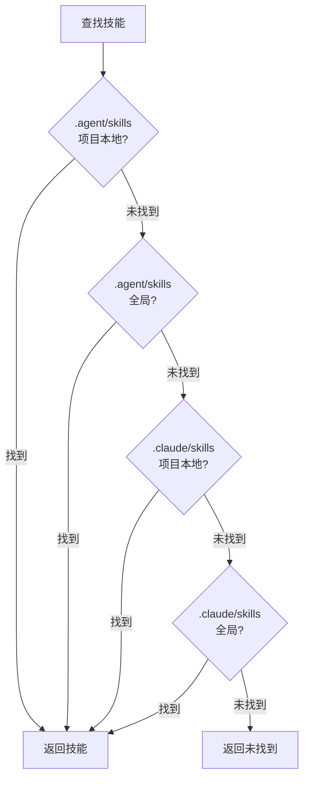

# Universal 模式：多代理环境

## 学完你能做什么

- 理解 Universal 模式的核心价值和设计目的
- 掌握 `--universal` 标志的使用方法
- 了解 `.agent/skills` 与 `.claude/skills` 的区别
- 理解 4 级搜索优先级规则
- 在多代理环境中统一管理技能，避免冲突
- 为 Claude Code、Cursor、Windsurf、Aider 等多个代理共享同一套技能

::: info 前置知识

本教程假设你已经了解了 [全局安装 vs 项目本地安装](../../platforms/global-vs-project/) 和 [同步技能到 AGENTS.md](../../start/sync-to-agents/)，理解基本的安装位置和同步流程。

:::

---

## 你现在的困境

你可能已经学会了如何安装和同步技能，但是：

- **多个代理如何共享技能？**：同时使用 Claude Code 和 Cursor，但各自安装技能，管理混乱
- **Claude Code Marketplace 冲突**：安装技能后与 Claude Code 原生插件市场产生冲突
- **AGENTS.md 位置不统一**：不同代理需要的 AGENTS.md 路径不同，维护困难
- **技能重复安装**：每个代理都要安装一套技能，浪费磁盘空间

其实 OpenSkills 提供了 Universal 模式，专门解决多代理环境的技能管理问题。

---

## 什么时候用这一招

**Universal 模式的适用场景**：

| 场景 | 是否需要 Universal 模式 | 示例 |
| ---- | --------------------- | ---- |
| **单一代理**（仅 Claude Code） | ❌ 否 | 只使用 Claude Code，直接使用默认的 `.claude/skills` |
| **多代理**（Claude Code + 其他） | ✅ 是 | 同时使用 Claude Code 和 Cursor/Windsurf/Aider |
| **避免 Marketplace 冲突** | ✅ 是 | 不想与 Claude Code 原生插件市场冲突 |
| **统一 AGENTS.md 管理** | ✅ 是 | 多个代理共享同一个 AGENTS.md 文件 |

::: tip 推荐做法

- **单一代理用默认模式**：只使用 Claude Code 时，使用默认的 `.claude/skills` 安装
- **多代理用 Universal 模式**：同时使用多个代理时，使用 `--universal` 安装到 `.agent/skills`
- **团队协作统一标准**：团队内明确约定使用哪种模式，避免混乱

:::

---

## 核心思路：统一目录，多代理共享

OpenSkills 提供两种技能目录模式：

**默认模式（`.claude/skills`）**：
- 专为 Claude Code 设计
- 与 Claude Code Marketplace 兼容
- 安装位置：`./.claude/skills/` 或 `~/.claude/skills/`

**Universal 模式（`.agent/skills`）**：
- 专为多代理环境设计
- 避免 Claude Code Marketplace 冲突
- 安装位置：`./.agent/skills/` 或 `~/.agent/skills/`

::: info 重要概念

**Universal 模式**：使用 `--universal` 标志将技能安装到 `.agent/skills/` 目录，让多个 AI 编码代理（Claude Code、Cursor、Windsurf、Aider 等）共享同一套技能，统一通过 AGENTS.md 管理。

:::

**4 级搜索优先级**（源码 `dirs.ts:18-24`）：

```typescript
export function getSearchDirs(): string[] {
  return [
    join(process.cwd(), '.agent/skills'),   // 1. Project universal (最高优先级)
    join(homedir(), '.agent/skills'),        // 2. Global universal
    join(process.cwd(), '.claude/skills'),  // 3. Project claude
    join(homedir(), '.claude/skills'),       // 4. Global claude
  ];
}
```

**优先级说明**：
1. **Project Universal**（最高）：`.agent/skills/` 优先于 `.claude/skills/`
2. **Global Universal**：其次查找全局的 `.agent/skills/`
3. **Project Claude**：然后是项目本地的 `.claude/skills/`
4. **Global Claude**（最低）：最后是全局的 `.claude/skills/`

---

## 跟我做

### 第 1 步：使用 Universal 模式安装技能

**为什么**
先学会如何使用 `--universal` 标志安装技能。

打开终端，在任意项目中执行：

```bash
# 使用 Universal 模式安装技能
npx openskills install anthropics/skills --universal -y

# 查看技能列表
npx openskills list
```

**你应该看到**：技能列表中每个技能后面有 `(project)` 标签

```
  codebase-reviewer         (project)
    Review code changes for issues...

Summary: 3 project, 0 global (3 total)
```

**解释**：
- 使用 `--universal` 标志后，技能安装在 `./.agent/skills/` 目录
- `list` 命令仍然显示 `(project)` 或 `(global)` 标签
- `.agent/skills/` 与默认的 `.claude/skills/` 并不冲突

---

### 第 2 步：查看技能安装位置

**为什么**
确认技能文件的实际存储位置，理解 Universal 模式的目录结构。

在项目根目录执行：

```bash
# 查看 Universal 模式的技能目录
ls -la .agent/skills/

# 查看技能目录内容
ls -la .agent/skills/codebase-reviewer/
```

**你应该看到**：

```
.agent/skills/
├── codebase-reviewer/
│   ├── SKILL.md
│   └── .openskills.json    # 安装元数据
├── file-writer/
│   ├── SKILL.md
│   └── .openskills.json
└── ...
```

**解释**：
- Universal 模式的技能安装在 `.agent/skills/` 目录
- 每个技能有自己的目录和元数据
- 这与默认的 `.claude/skills/` 结构完全相同

---

### 第 3 步：对比两种模式的目录结构

**为什么**
通过实际对比，理解 `.claude/skills` 和 `.agent/skills` 的区别。

执行以下命令：

```bash
# 查看两种模式的技能目录
echo "=== .claude/skills (默认模式) ==="
ls -la .claude/skills/ 2>/dev/null || echo "目录不存在"

echo "=== .agent/skills (Universal 模式) ==="
ls -la .agent/skills/

# 查看全局安装的目录
echo "=== ~/.claude/skills (全局默认) ==="
ls -la ~/.claude/skills/ 2>/dev/null || echo "目录不存在"

echo "=== ~/.agent/skills (全局 Universal) ==="
ls -la ~/.agent/skills/ 2>/dev/null || echo "目录不存在"
```

**你应该看到**：

```
=== .claude/skills (默认模式) ===
目录不存在

=== .agent/skills (Universal 模式) ===
codebase-reviewer
file-writer

=== ~/.claude/skills (全局默认) ===
git-helper
test-generator

=== ~/.agent/skills (全局 Universal) ===
目录不存在
```

**解释**：
- `.claude/skills/` 和 `.agent/skills/` 是两个独立的目录
- 可以同时存在，互不干扰
- 支持项目本地和全局两种安装方式

---

### 第 4 步：全局 Universal 安装

**为什么**
了解如何全局安装 Universal 技能，服务所有项目。

执行：

```bash
# 全局 Universal 安装技能
npx openskills install anthropics/skills --universal --global -y

# 查看技能列表
npx openskills list
```

**你应该看到**：

```
  codebase-reviewer         (project)
    Review code changes for issues...
  file-writer              (global)
    Write files with format...

Summary: 1 project, 2 global (3 total)
```

**解释**：
- `--universal` 和 `--global` 可以组合使用
- 安装到 `~/.agent/skills/` 目录
- 所有项目都可以使用这些技能

---

### 第 5 步：验证 4 级搜索优先级

**为什么**
理解 OpenSkills 如何在 4 个目录中查找技能。

执行：

```bash
# 在 4 个位置安装同名技能（不同版本）
# 1. Project Universal
npx openskills install anthropics/skills --universal -y
# 2. Global Universal
npx openskills install anthropics/skills --universal --global -y
# 3. Project Claude
npx openskills install anthropics/skills -y
# 4. Global Claude
npx openskills install anthropics/skills --global -y

# 读取技能（会优先使用 Project Universal 版本）
npx openskills read codebase-reviewer | head -5
```

**你应该看到**：输出的是 `.agent/skills/`（Project Universal）版本的技能内容。

**搜索优先级可视化**：



**解释**：
- `.agent/skills/` 的优先级高于 `.claude/skills/`
- 项目本地优先级高于全局
- 当同名技能同时存在时，优先使用 Project Universal 版本
- 这样可以实现"Universal 优先"的灵活配置

---

### 第 6 步：避免 Claude Code Marketplace 冲突

**为什么**
了解 Universal 模式如何解决与 Claude Code Marketplace 的冲突。

执行：

```bash
# 使用 Universal 模式安装技能
npx openskills install anthropics/skills --universal -y

# 同步到 AGENTS.md
npx openskills sync

# 查看 AGENTS.md
cat AGENTS.md
```

**你应该看到**：AGENTS.md 中包含技能列表，不会与 Claude Code Marketplace 冲突。

**解释**：
- Universal 模式使用 `.agent/skills/`，与 Claude Code 的 `.claude/skills/` 分离
- 避免 OpenSkills 安装的技能与 Claude Code Marketplace 插件冲突
- 多个代理可以共享同一个 AGENTS.md，统一管理

---

## 检查点 ✅

完成以下检查，确认你掌握了本课内容：

- [ ] 能够区分 `.claude/skills` 和 `.agent/skills` 两种模式
- [ ] 知道 `--universal` 标志的作用
- [ ] 理解 4 级搜索优先级规则
- [ ] 能够根据场景选择合适的安装模式
- [ ] 知道如何在多代理环境中统一管理技能
- [ ] 理解 Universal 模式如何避免 Marketplace 冲突

---

## 踩坑提醒

### 常见错误 1：单一代理误用 Universal 模式

**错误场景**：只使用 Claude Code，但使用了 Universal 模式

```bash
# ❌ 错误：单一代理不需要 Universal 模式
npx openskills install anthropics/skills --universal
```

**问题**：
- 增加了不必要的复杂度
- 无法与 Claude Code Marketplace 插件协同工作
- AGENTS.md 位置可能不符合 Claude Code 期望

**正确做法**：

```bash
# ✅ 正确：单一代理使用默认模式
npx openskills install anthropics/skills
```

---

### 常见错误 2：多代理未使用 Universal 模式

**错误场景**：同时使用多个代理，但未使用 Universal 模式

```bash
# ❌ 错误：每个代理独立安装技能，管理混乱
npx openskills install anthropics/skills  # Claude Code 用
npx openskills install anthropics/skills --global  # Cursor 用
```

**问题**：
- 技能重复安装，浪费磁盘空间
- 不同代理使用的技能版本可能不一致
- AGENTS.md 需要分别维护

**正确做法**：

```bash
# ✅ 正确：多代理使用 Universal 模式统一管理
npx openskills install anthropics/skills --universal
# 所有代理共享同一套技能和 AGENTS.md
```

---

### 常见错误 3：忘记 Universal 模式的搜索优先级

**错误场景**：在 `.claude/skills` 和 `.agent/skills` 都安装了同名技能，但期望使用 `.claude/skills` 版本

```bash
# .agent/skills 和 .claude/skills 都有 codebase-reviewer
# 但想用 .claude/skills 版本
npx openskills install anthropics/skills --universal  # 安装新版到 .agent/skills
npx openskills install anthropics/skills  # 安装旧版到 .claude/skills
npx openskills read codebase-reviewer  # ❌ 还是读到 .agent/skills 版本
```

**问题**：
- `.agent/skills` 的优先级高于 `.claude/skills`
- 即使 `.claude/skills` 安装了新版本，仍然读取 `.agent/skills` 版本

**正确做法**：

```bash
# 方案 1：删除 .agent/skills 版本
npx openskills remove codebase-reviewer  # 删除 .agent/skills 版本
npx openskills read codebase-reviewer  # ✅ 现在读取 .claude/skills 版本

# 方案 2：更新 .agent/skills 版本
npx openskills update codebase-reviewer  # 更新 .agent/skills 版本
```

---

### 常见错误 4：AGENTS.md 路径配置错误

**错误场景**：多个代理需要的 AGENTS.md 路径不同

```bash
# Claude Code 期望 AGENTS.md 在根目录
# Cursor 期望 AGENTS.md 在 .cursor/ 目录
# Windsurf 期望 AGENTS.md 在 .windsurf/ 目录
npx openskills sync  # 只生成一个 AGENTS.md
```

**问题**：
- 不同代理无法找到 AGENTS.md
- 技能加载失败

**正确做法**：

```bash
# 为不同代理生成不同位置的 AGENTS.md
npx openskills sync -o AGENTS.md           # Claude Code
npx openskills sync -o .cursor/AGENTS.md    # Cursor
npx openskills sync -o .windsurf/AGENTS.md  # Windsurf
```

---

## 本课小结

**核心要点**：

1. **Universal 模式用于多代理环境**：使用 `--universal` 安装到 `.agent/skills/`
2. **4 级搜索优先级**：Project Universal > Global Universal > Project Claude > Global Claude
3. **避免 Marketplace 冲突**：`.agent/skills/` 与 Claude Code 的 `.claude/skills/` 分离
4. **统一 AGENTS.md 管理**：多个代理共享同一个 AGENTS.md 文件
5. **推荐原则**：单一代理用默认模式，多代理用 Universal 模式

**决策流程**：

```
[需要安装技能] → [是否使用多个代理？]
                      ↓ 是
              [使用 Universal 模式（--universal）]
                      ↓ 否
              [仅使用 Claude Code？]
                      ↓ 是
              [使用默认模式（.claude/skills）]
                      ↓ 否
              [查看具体代理文档，选择合适模式]
```

**记忆口诀**：

- **单一代理**：默认模式最简单，Claude Code 用 `.claude`
- **多代理**：Universal 模式统一管，`.agent/skills` 避免冲突

---

## 下一课预告

> 下一课我们学习 **[自定义输出路径](../custom-output-path/)**。
>
> 你会学到：
> - 如何使用 `--output/-o` 标志自定义 AGENTS.md 输出路径
> - 如何为不同代理生成不同位置的 AGENTS.md
> - 如何在 CI/CD 环境中使用自定义输出路径
> - 如何集成到现有的文档系统

---

## 附录：源码参考

<details>
<summary><strong>点击展开查看源码位置</strong></summary>

> 更新时间：2026-01-24

| 功能        | 文件路径                                                                                          | 行号    |
| ----------- | ------------------------------------------------------------------------------------------------- | ------- |
| 目录路径工具 | [`src/utils/dirs.ts`](https://github.com/numman-ali/openskills/blob/main/src/utils/dirs.ts#L7-L25)     | 7-25    |
| 安装位置判断 | [`src/commands/install.ts`](https://github.com/numman-ali/openskills/blob/main/src/commands/install.ts#L84-L92) | 84-92   |
| 命令行参数定义 | [`src/cli.ts`](https://github.com/numman-ali/openskills/blob/main/src/cli.ts#L48)                    | 48      |

**关键常量**：
- `.claude/skills`：默认技能目录（Claude Code 兼容）
- `.agent/skills`：通用技能目录（多代理环境）

**关键函数**：
- `getSkillsDir(projectLocal, universal)`：根据标志返回技能目录路径
- `getSearchDirs()`：返回技能搜索目录列表（4 级优先级）

**业务规则**：
- Universal 模式使用 `.agent/skills/` 目录
- 4 级搜索优先级：Project Universal > Global Universal > Project Claude > Global Claude
- `--universal` 和 `--global` 可组合使用

</details>
