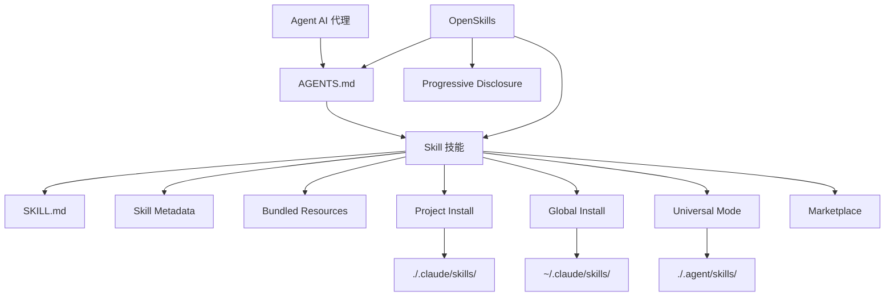

# 术语表

本术语表解释 OpenSkills 和 AI 技能系统中的关键概念，帮助你快速理解专业术语。

::: info 提示
本术语表按字母顺序排列，术语之间的关联会在定义中标注。
:::

---

## A

### Agent（AI 代理）

**定义**：AI 代理是指能够执行编码任务的 AI 工具，如 Claude Code、Cursor、Windsurf、Aider 等。

**特点**：
- 能够读取 `AGENTS.md` 配置文件
- 支持 SKILL.md 格式的技能加载
- 可以通过命令行调用外部工具（如 `npx openskills read`）

**在 OpenSkills 中的角色**：OpenSkills 让任何支持读取 AGENTS.md 的代理都能使用 Anthropic 的技能格式。

**相关术语**：[Skill](#skill)、[AGENTS.md](#agentsmd)

---

## B

### Base Directory（基础目录）

**定义**：技能目录的完整路径，用于解析技能中的相对路径引用。

**作用**：
- 提供技能目录的绝对路径
- 用于解析 `references/`、`scripts/`、`assets/` 等捆绑资源的相对路径

**示例**：
```
Base directory: /path/to/my-first-skill
```

当技能引用 `references/skill-format.md` 时，实际解析为：
```
/path/to/my-first-skill/references/skill-format.md
```

**相关术语**：[Skill](#skill)、[Bundled Resources](#bundled-resources)

---

### Bundled Resources（捆绑资源）

**定义**：技能目录下附带的资源文件，提供技能执行所需的详细信息或工具。

**类型**：
- **`references/`** - 参考文档、API 文档等
- **`scripts/`** - 可执行的脚本文件
- **`assets/`** - 模板、示例文件等

**用途**：
- 将详细文档移到 `references/`，保持 SKILL.md 简洁
- 将可执行代码放在 `scripts/`，便于调用
- 将模板和示例放在 `assets/`，供用户参考

**示例**：
```
my-skill/
├── SKILL.md
├── references/
│   └── api-docs.md
├── scripts/
│   └── helper.py
└── assets/
    └── template.json
```

**相关术语**：[Skill](#skill)、[SKILL.md](#skillmd)

---

## G

### Global Install（全局安装）

**定义**：将技能安装到用户主目录下的 `.claude/skills` 目录，使所有项目都能访问该技能。

**命令示例**：
```bash
npx openskills install anthropics/skills --global
```

**目标路径**：
- macOS/Linux: `~/.claude/skills/`
- Windows: `%USERPROFILE%\.claude\skills\`

**适用场景**：
- 希望在多个项目中使用相同技能
- 不希望技能随项目仓库版本化

**优先级**：在查找技能时，全局安装的优先级低于项目本地安装（见 [Skill 查找优先级](#skill-查找优先级)）。

**相关术语**：[Project Install](#project-install)、[Skill 查找优先级](#skill-查找优先级)

---

## M

### Marketplace（市场）

**定义**：存放技能的 GitHub 仓库，用于发布和发现技能。

**Anthropic Marketplace**：
- 官方技能仓库：`anthropics/skills`
- 提供官方维护的技能（如 pdf、git-workflow、skill-creator 等）

**第三方市场**：
- 任何 GitHub 仓库都可以作为技能来源
- 支持私有仓库

**从市场安装**：
```bash
# 从 Anthropic 官方市场安装
npx openskills install anthropics/skills

# 从第三方仓库安装
npx openskills install your-org/your-skills

# 从私有仓库安装
npx openskills install git@github.com:your-org/private-skills.git
```

**相关术语**：[Skill](#skill)、[Global Install](#global-install)

---

## O

### OpenSkills

**定义**：OpenSkills 是 Anthropic 技能系统的通用加载器，让任何 AI 编码代理都能使用标准的 SKILL.md 格式技能。

**核心价值**：
- **统一标准** - 所有代理使用相同的技能格式和 AGENTS.md 描述
- **渐进式加载** - 按需加载技能，保持上下文精简
- **多代理支持** - 一套技能服务多个代理
- **开源友好** - 支持本地路径和私有 git 仓库
- **兼容性强** - 与 Claude Code 格式完全兼容

**主要命令**：
- `install` - 安装技能
- `list` - 列出已安装技能
- `read` - 读取技能内容（供 AI 代理使用）
- `sync` - 同步技能到 AGENTS.md
- `update` - 更新已安装技能
- `manage` / `remove` - 删除技能

**官方仓库**：https://github.com/numman-ali/openskills

**相关术语**：[Skill](#skill)、[SKILL.md](#skillmd)、[AGENTS.md](#agentsmd)

---

## P

### Progressive Disclosure（渐进式加载）

**定义**：只在实际需要时才加载技能，避免一次性加载所有技能导致的上下文膨胀。

**工作原理**：
1. 技能信息以简短描述存储在 AGENTS.md 中
2. 当用户请求某任务时，AI 代理检查是否有匹配的技能
3. 如果有，通过 `npx openskills read <skill-name>` 加载完整技能内容
4. 技能内容只在当前任务上下文中有效

**优势**：
- 保持 AI 代理的上下文精简
- 降低 token 使用量
- 提高响应速度

**示例**：
```xml
<!-- AGENTS.md 中只包含简短描述 -->
<available_skills>
  <skill>
    <name>pdf</name>
    <description>Comprehensive PDF manipulation toolkit...</description>
  </skill>
</available_skills>

<!-- 用户请求 PDF 处理时才加载完整内容 -->
npx openskills read pdf
```

**相关术语**：[AGENTS.md](#agentsmd)、[Skill](#skill)

---

### Project Install（项目本地安装）

**定义**：将技能安装到项目目录下的 `.claude/skills` 或 `.agent/skills` 目录，使技能随项目仓库版本化。

**命令示例**：
```bash
# 项目本地安装（默认）
npx openskills install anthropics/skills

# 项目本地安装到 .agent/skills（通用模式）
npx openskills install anthropics/skills --universal
```

**目标路径**：
- 默认：`./.claude/skills/`
- Universal 模式：`./.agent/skills/`

**适用场景**：
- 项目需要特定技能
- 希望技能随项目仓库版本化
- 团队协作时统一技能版本

**优先级**：在查找技能时，项目本地安装的优先级高于全局安装（见 [Skill 查找优先级](#skill-查找优先级)）。

**相关术语**：[Global Install](#global-install)、[Universal Mode](#universal-mode)、[Skill 查找优先级](#skill-查找优先级)

---

## S

### Skill（技能）

**定义**：给 AI 代理提供特定任务执行指导的文档，包含详细指令、步骤和捆绑资源。

**核心特点**：
- **静态指令** - 只包含文本和资源，不包含动态逻辑
- **可组合** - 多个技能可以组合使用
- **可版本化** - 随项目仓库管理

**技能组成**：
```
skill-name/
├── SKILL.md              # 技能主文件
├── .openskills.json      # 安装元数据（自动生成）
├── references/           # 参考文档（可选）
├── scripts/             # 可执行脚本（可选）
└── assets/              # 模板和示例（可选）
```

**使用场景**：
- 用户请求任务时，AI 代理检查是否有匹配的技能
- 如果有，通过 `npx openskills read <name>` 加载技能
- AI 代理根据技能指令完成任务

**示例技能**：
- `pdf` - PDF 处理工具
- `git-workflow` - Git 工作流
- `check-branch-first` - 分支检查

**相关术语**：[SKILL.md](#skillmd)、[Bundled Resources](#bundled-resources)、[Agent](#agent)

---

### Skill Metadata（技能元数据）

**定义**：记录技能安装来源信息的 JSON 文件（`.openskills.json`），用于支持技能更新。

**文件位置**：技能目录下的 `.openskills.json`

**字段说明**：
```json
{
  "source": "anthropics/skills",
  "sourceType": "github",
  "repoUrl": "https://github.com/anthropics/skills",
  "subpath": "skills/pdf",
  "installedAt": "2025-01-24T10:30:00.000Z"
}
```

**作用**：
- 记录技能来源（GitHub、本地路径等）
- 支持 `openskills update` 命令从源刷新技能
- 识别需要更新但未记录来源的技能

**相关术语**：[Skill](#skill)、[Global Install](#global-install)、[Project Install](#project-install)

---

### Skill 查找优先级

**定义**：OpenSkills 在查找技能时，按照固定的优先级顺序在多个目录中搜索。

**优先级顺序**（从高到低）：

| 优先级 | 目录                 | 安装方式           | 适用场景                     |
| ------ | -------------------- | ------------------ | ---------------------------- |
| 1     | `./.agent/skills/`   | `--universal`      | 多代理环境，避免与 Claude Code 冲突 |
| 2     | `~/.agent/skills/`   | `--universal --global` | 多代理环境全局技能           |
| 3     | `./.claude/skills/`  | 默认（项目本地）   | 项目本地技能（默认选择）      |
| 4     | `~/.claude/skills/`   | `--global`         | 全局技能                     |

**查找规则**：
- 按优先级顺序查找
- 找到第一个匹配的技能即停止
- 项目本地技能会覆盖同名全局技能

**示例**：
```bash
# 查找名为 "pdf" 的技能
# 1. 先检查 ./.agent/skills/pdf
# 2. 再检查 ~/.agent/skills/pdf
# 3. 再检查 ./.claude/skills/pdf
# 4. 最后检查 ~/.claude/skills/pdf
```

**相关术语**：[Project Install](#project-install)、[Global Install](#global-install)、[Universal Mode](#universal-mode)

---

### SKILL.md

**定义**：技能的标准格式文件，使用 YAML frontmatter 和 Markdown 内容定义技能的元数据和指令。

**文件格式**：
```markdown
---
name: my-skill
description: When to use this skill
---

# Skill Instructions

Detailed instructions for the AI agent...

## Bundled Resources

See `references/skill-format.md` for details.
```

**必需字段**：
- `name` - 技能名称（唯一标识）
- `description` - 技能描述（显示在 AGENTS.md 中）

**可选字段**：
- `context` - 上下文提示（指导 AI 代理如何使用技能）

**最佳实践**：
- 使用祈使句/不定式：`"To do X, execute Y"`
- 避免第二人称：不要写 `"You should..."`
- 保持在 5,000 字以内
- 将详细内容移到 `references/` 目录

**相关术语**：[Skill](#skill)、[AGENTS.md](#agentsmd)、[Bundled Resources](#bundled-resources)

---

## U

### Universal Mode（通用模式）

**定义**：多代理环境下的安装模式，将技能安装到 `.agent/skills/` 目录，避免与 Claude Code 的 Marketplace 冲突。

**命令示例**：
```bash
npx openskills install anthropics/skills --universal
```

**目标路径**：`./.agent/skills/` 或 `~/.agent/skills/`（配合 `--global`）

**适用场景**：
- 同时使用 Claude Code 和其他 AI 代理（如 Cursor、Windsurf）
- 希望所有代理共享同一套技能
- 避免技能安装冲突

**查找优先级**：Universal 模式安装的技能优先级最高（见 [Skill 查找优先级](#skill-查找优先级)）。

**相关术语**：[Project Install](#project-install)、[Skill 查找优先级](#skill-查找优先级)

---

## A

### AGENTS.md

**定义**：AI 代理读取的配置文件，包含可用技能列表和使用说明，采用 XML 格式。

**文件位置**：项目根目录或用户自定义路径（默认为项目根目录）

**文件格式**：
```xml
<skills_system priority="1">

## Available Skills

<!-- SKILLS_TABLE_START -->
<usage>
When users ask you to perform tasks, check if any of the available skills below can help complete the task more effectively.

How to use skills:
- Invoke: `npx openskills read <skill-name>` (run in your shell)
- The skill content will load with detailed instructions
- Base directory provided in output for resolving bundled resources
</usage>

<available_skills>

<skill>
<name>pdf</name>
<description>Comprehensive PDF manipulation toolkit...</description>
<location>project</location>
</skill>

</available_skills>
<!-- SKILLS_TABLE_END -->

</skills_system>
```

**作用**：
- 声明可用技能列表
- 提供技能使用说明
- 支持技能更新时保留自定义内容

**生成方式**：
```bash
npx openskills sync
```

**更新方式**：
```bash
# 重新生成 AGENTS.md（会覆盖现有内容）
npx openskills sync -y

# 输出到自定义文件
npx openskills sync -o custom-agents.md
```

**相关术语**：[OpenSkills](#openskills)、[Skill](#skill)、[Progressive Disclosure](#progressive-disclosure)

---

## 术语关系图

以下是核心术语之间的关联关系：



---

## 下一课预告

> 术语表到此结束。你已经了解了 OpenSkills 的核心概念。
>
> 接下来你可以：
> - 返回 [快速开始](../../start/quick-start/) 实践安装和使用
> - 查阅 [CLI API 参考](../cli-api/) 了解完整命令
> - 阅读 [故障排除](../../faq/troubleshooting/) 解决常见问题

---

## 附录：源码参考

<details>
<summary><strong>点击展开查看源码位置</strong></summary>

> 更新时间：2026-01-24

| 术语/功能            | 文件路径                                                                 | 行号    |
| -------------------- | ------------------------------------------------------------------------ | ------- |
| Skill 类型定义       | [`src/types.ts`](https://github.com/numman-ali/openskills/blob/main/src/types.ts#L1-L6) | 1-6     |
| SkillLocation 类型   | [`src/types.ts`](https://github.com/numman-ali/openskills/blob/main/src/types.ts#L8-L12) | 8-12    |
| InstallOptions 类型  | [`src/types.ts`](https://github.com/numman-ali/openskills/blob/main/src/types.ts#L14-L18) | 14-18   |
| SkillMetadata 类型   | [`src/types.ts`](https://github.com/numman-ali/openskills/blob/main/src/types.ts#L20-L24) | 20-24   |
| 技能查找逻辑        | [`src/utils/skills.ts`](https://github.com/numman-ali/openskills/blob/main/src/utils/skills.ts) | 全文    |
| 目录路径计算        | [`src/utils/dirs.ts`](https://github.com/numman-ali/openskills/blob/main/src/utils/dirs.ts) | 全文    |
| AGENTS.md 生成       | [`src/utils/agents-md.ts`](https://github.com/numman-ali/openskills/blob/main/src/utils/agents-md.ts) | 全文    |
| Skill Metadata 读写  | [`src/utils/skill-metadata.ts`](https://github.com/numman-ali/openskills/blob/main/src/utils/skill-metadata.ts) | 全文    |

**关键常量**：
- 无（逻辑基于参数和目录计算）

**关键函数**：
- `findAllSkills()` - 查找所有已安装技能
- `findSkill(name)` - 查找指定技能（按优先级）
- `getSkillsDir(options)` - 计算技能安装目录
- `generateSkillsXml(skills)` - 生成 AGENTS.md XML 内容

</details>
