# OpenSkills快速开始：5分钟上手AI技能系统

## 学完你能做什么

完成本课后，你将能够：

- 在 5 分钟内完成 OpenSkills 的安装和第一个技能的部署
- 使用 `openskills install` 和 `openskills sync` 命令管理技能
- 让 AI 代理（Claude Code、Cursor、Windsurf 等）识别并使用安装的技能
- 理解 OpenSkills 的核心价值：统一技能格式、渐进式加载、多代理支持

## 你现在的困境

你可能遇到过这些问题：

- **技能无法跨代理使用**：Claude Code 的技能无法在 Cursor 或 Windsurf 中复用
- **上下文爆炸**：加载太多技能导致 AI 代理的 token 消耗过快
- **技能格式混乱**：不同代理使用不同的技能定义方式，学习成本高
- **私有技能无法分享**：公司内部的技能无法方便地分发给团队成员

OpenSkills 解决了这些问题。

## 什么时候用这一招

当你需要：

- 为 AI 编码代理安装专用技能（如 PDF 处理、Git 工作流、代码审查等）
- 在多个 AI 代理之间统一技能管理
- 使用私有的或定制的技能仓库
- 让 AI 按需加载技能，保持上下文精简

## 🎒 开始前的准备

::: warning 前置检查

在开始之前，请确认：

1. **Node.js 20.6 或更高版本**
   ```bash
   node --version
   ```
   输出应该显示 `v20.6.0` 或更高版本

2. **Git 已安装**（用于从 GitHub 仓库克隆技能）
   ```bash
   git --version
   ```

:::

## 核心思路

OpenSkills 的工作原理可以概括为三步：

```mermaid
graph LR
    A[1. 安装技能] --> B[2. 同步到AGENTS.md]
    B --> C[3. AI代理按需加载]
```



### 步骤 1：安装技能

使用 `openskills install` 从 GitHub、本地路径或私有仓库安装技能。技能会被复制到项目的 `.claude/skills/` 目录。

### 步骤 2：同步到 AGENTS.md

使用 `openskills sync` 生成 AGENTS.md 文件，其中包含技能列表的 XML 标记。AI 代理会读取这个文件来了解可用的技能。

### 步骤 3：AI 代理按需加载

当用户请求特定任务时，AI 代理会通过 `npx openskills read <skill-name>` 动态加载对应的技能内容，而不是一次性加载所有技能。

::: info 为什么是"渐进式加载"？

传统方式：所有技能预加载到上下文 → token 消耗大、响应慢
OpenSkills：按需加载 → 只加载需要的技能 → 上下文精简、响应快

:::

---

## 跟我做

现在我们一步步完成安装和使用流程。

### 第 1 步：进入你的项目目录

首先，进入你正在开发的项目目录：

```bash
cd /path/to/your/project
```

**为什么**

OpenSkills 默认将技能安装到项目的 `.claude/skills/` 目录，这样技能可以随项目版本控制，团队成员也能共享。

**你应该看到**：

你的项目目录应该包含以下内容之一：

- `.git/` （Git 仓库）
- `package.json` （Node.js 项目）
- 其他项目文件

::: tip 推荐做法

即使是一个新项目，也建议先初始化 Git 仓库，这样可以更好地管理技能文件。

:::

---

### 第 2 步：安装第一个技能

使用以下命令从 Anthropic 官方技能仓库安装技能：

```bash
npx openskills install anthropics/skills
```

**为什么**

`anthropics/skills` 是 Anthropic 官方维护的技能仓库，包含高质量的技能示例，适合第一次体验。

**你应该看到**：

命令会启动一个交互式选择界面：

```
? Select skills to install: (Press <space> to select, <a> to toggle all, <i> to invert selection, and <enter> to proceed)
❯ ◉ pdf                 Comprehensive PDF manipulation toolkit for extracting text and tables...
  ◯ check-branch-first  Git workflow: Always check current branch before making changes...
  ◯ git-workflow        Git workflow: Best practices for commits, branches, and PRs...
  ◯ skill-creator       Guide for creating effective skills...
```

使用空格键选择你要安装的技能，然后按回车确认。

::: tip 小技巧

第一次建议只选择 1-2 个技能（如 `pdf` 和 `git-workflow`），熟悉流程后再安装更多。

:::

**你应该看到**（安装成功后）：

```
✓ Installed: pdf
✓ Installed: git-workflow

Skills installed to: /path/to/your/project/.claude/skills/

Next steps:
  Run: npx openskills sync
  This will update AGENTS.md with your installed skills
```

---

### 第 3 步：同步技能到 AGENTS.md

现在运行同步命令：

```bash
npx openskills sync
```

**为什么**

`sync` 命令会生成 AGENTS.md 文件，其中包含技能列表的 XML 标记。AI 代理会读取这个文件来了解可用的技能。

**你应该看到**：

```
? Select skills to sync: (Press <space> to select, <a> to toggle all, <i> to invert selection, and <enter> to proceed)
❯ ◉ pdf                 [project]
  ◯ git-workflow        [project]
```

同样使用空格键选择要同步的技能，然后按回车确认。

**你应该看到**（同步成功后）：

```
✓ Synced: pdf
✓ Synced: git-workflow

Updated: AGENTS.md
```

---

### 第 4 步：检查 AGENTS.md 文件

查看生成的 AGENTS.md 文件：

```bash
cat AGENTS.md
```

**你应该看到**：

```xml
<skills_system priority="1">

## Available Skills

<!-- SKILLS_TABLE_START -->
<usage>
When users ask you to perform tasks, check if any of available skills below can help complete task more effectively.

How to use skills:
- Invoke: `npx openskills read <skill-name>` (run in your shell)
- The skill content will load with detailed instructions
- Base directory provided in output for resolving bundled resources

Usage notes:
- Only use skills listed in <available_skills> below
- Do not invoke a skill that is already loaded in your context
</usage>

<available_skills>

<skill>
<name>pdf</name>
<description>Comprehensive PDF manipulation toolkit for extracting text and tables...</description>
<location>project</location>
</skill>

<skill>
<name>git-workflow</name>
<description>Git workflow: Best practices for commits, branches, and PRs...</description>
<location>project</location>
</skill>

</available_skills>
<!-- SKILLS_TABLE_END -->

</skills_system>
```

---

### 第 5 步：查看已安装的技能

使用 `list` 命令查看已安装的技能：

```bash
npx openskills list
```

**你应该看到**：

```
Installed Skills:

pdf              [project]
  Comprehensive PDF manipulation toolkit for extracting text and tables...

git-workflow     [project]
  Git workflow: Best practices for commits, branches, and PRs...

Total: 2 skills (project: 2, global: 0)
```

**你应该看到**（说明）：

- 技能名称在左侧
- `[project]` 标签表示这是项目本地安装的技能
- 技能描述显示在下方

---

## 检查点 ✅

完成上述步骤后，你应该确认：

- [ ] `.claude/skills/` 目录已创建，包含你安装的技能
- [ ] `AGENTS.md` 文件已生成，包含技能列表的 XML 标记
- [ ] 运行 `openskills list` 能看到已安装的技能

如果所有检查都通过，恭喜你！你已经成功安装并配置了 OpenSkills。

---

## 踩坑提醒

### 问题 1：`npx` 命令找不到

**错误信息**：

```
command not found: npx
```

**原因**：Node.js 没有安装或没有配置到 PATH

**解决方法**：

1. 重新安装 Node.js（建议使用 [nvm](https://github.com/nvm-sh/nvm) 管理 Node.js 版本）
2. 确认安装后重启终端

---

### 问题 2：安装时网络超时

**错误信息**：

```
Error: git clone failed
```

**原因**：GitHub 访问受限或网络不稳定

**解决方法**：

1. 检查网络连接
2. 配置代理（如果需要）：
   ```bash
   git config --global http.proxy http://proxy.example.com:8080
   ```
3. 使用镜像源（如有）

---

### 问题 3：权限错误

**错误信息**：

```
Error: EACCES: permission denied
```

**原因**：目标目录没有写入权限

**解决方法**：

1. 检查目录权限：
   ```bash
   ls -la .claude/
   ```
2. 如果目录不存在，先创建：
   ```bash
   mkdir -p .claude/skills
   ```
3. 如果权限不足，修改权限（谨慎使用）：
   ```bash
   chmod -R 755 .claude/
   ```

---

## 本课小结

本课我们学习了：

1. **OpenSkills 的核心价值**：统一技能格式、渐进式加载、多代理支持
2. **三步工作流程**：安装技能 → 同步到 AGENTS.md → AI 代理按需加载
3. **基本命令**：
   - `npx openskills install <source>` - 安装技能
   - `npx openskills sync` - 同步技能到 AGENTS.md
   - `npx openskills list` - 查看已安装技能
4. **常见问题排查**：网络问题、权限问题等

现在你可以让 AI 代理使用这些技能了。当 AI 代理需要执行 PDF 处理或 Git 操作时，它会自动调用 `npx openskills read <skill-name>` 来加载对应的技能内容。

---

## 下一课预告

> 下一课我们学习 **[什么是 OpenSkills？](../what-is-openskills/)**
>
> 你会学到：
> - OpenSkills 与 Claude Code 的关系
> - 技能系统的核心概念
> - 为什么选择 CLI 而不是 MCP

---

## 附录：源码参考

<details>
<summary><strong>点击展开查看源码位置</strong></summary>

> 更新时间：2026-01-24

### 核心功能

| 功能            | 文件路径                                                                                     | 行号      |
| --------------- | -------------------------------------------------------------------------------------------- | --------- |
| 安装技能        | [`src/commands/install.ts`](https://github.com/numman-ali/openskills/blob/main/src/commands/install.ts) | 83-424    |
| 同步到 AGENTS.md | [`src/commands/sync.ts`](https://github.com/numman-ali/openskills/blob/main/src/commands/sync.ts)     | 18-109    |
| 列出技能        | [`src/commands/list.ts`](https://github.com/numman-ali/openskills/blob/main/src/commands/list.ts)     | 7-43      |
| 查找所有技能    | [`src/utils/skills.ts`](https://github.com/numman-ali/openskills/blob/main/src/utils/skills.ts)     | 30-64     |
| 生成 XML        | [`src/utils/agents-md.ts`](https://github.com/numman-ali/openskills/blob/main/src/utils/agents-md.ts) | 23-93     |
| 目录路径工具    | [`src/utils/dirs.ts`](https://github.com/numman-ali/openskills/blob/main/src/utils/dirs.ts)        | 18-25     |

### 关键函数

**install.ts**
- `installSkill(source, options)` - 主安装函数，支持 GitHub、本地路径和私有仓库
- `isLocalPath(source)` - 判断是否为本地路径
- `isGitUrl(source)` - 判断是否为 Git URL
- `getRepoName(repoUrl)` - 从 Git URL 提取仓库名
- `isPathInside(targetPath, targetDir)` - 路径遍历安全检查

**sync.ts**
- `syncAgentsMd(options)` - 同步技能到 AGENTS.md，支持交互式选择
- 支持自定义输出路径（`--output` 标志）
- 预选当前文件中已启用的技能

**agents-md.ts**
- `parseCurrentSkills(content)` - 解析 AGENTS.md 中的当前技能
- `generateSkillsXml(skills)` - 生成 Claude Code 格式的 XML
- `replaceSkillsSection(content, xml)` - 替换文件中的技能部分

**skills.ts**
- `findAllSkills()` - 查找所有已安装技能，按优先级去重
- `findSkill(skillName)` - 查找指定技能
- 支持符号链接检测和去重

**dirs.ts**
- `getSkillsDir(projectLocal, universal)` - 获取技能目录路径
- `getSearchDirs()` - 返回搜索目录列表（优先级：.agent 项目 → .agent 全局 → .claude 项目 → .claude 全局）

### 重要常量

- `.claude/skills/` - 默认项目本地安装路径
- `.agent/skills/` - Universal 模式安装路径
- `~/.claude/skills/` - 全局安装路径
- `AGENTS.md` - 默认同步输出文件

</details>
