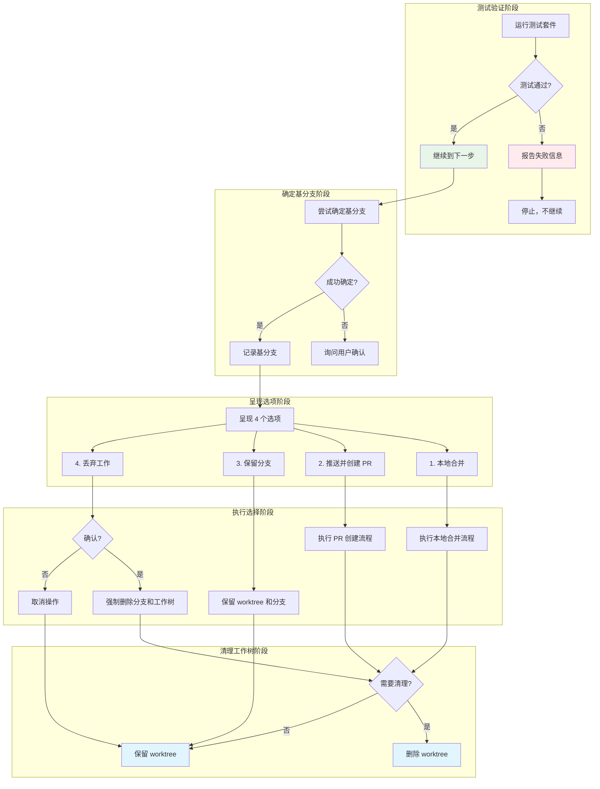

# 分支完成工作流

## 学完你能做什么

- 系统化验证开发完成后的测试状态
- 明确选择合并、PR、保留或丢弃分支
- 执行分支合并并清理 Git worktree
- 创建规范的 Pull Request
- 安全地丢弃不需要的工作

## 你现在的困境

**分支管理混乱，收尾工作随意**

你是否在开发完成后遇到过这些问题？

测试还没通过就急着合并，导致主分支代码损坏。创建 PR 时不知道该写什么，提交记录混乱。想保留当前工作分支，但忘了清理工作树，导致磁盘空间浪费。最糟糕的是，想丢弃某个失败实验时，意外删除了重要提交。

常见混乱场景：
- ❌ 测试失败还继续合并，破坏主分支
- ❌ 创建 PR 时描述空白或随意填写
- ❌ 开发完成后的工作树长期保留，占用空间
- ❌ 丢弃工作前不确认，误删重要代码
- ❌ 分支合并后忘记删除，导致分支堆积

**核心问题**：缺少系统化的分支完成工作流。

::: info 什么是分支完成工作流？

`finishing-a-development-branch` 技能是在所有开发任务完成后，帮助你系统化地处理分支收尾的工作流。

它涵盖以下场景：
- **本地合并**：直接将功能分支合并到主分支
- **创建 PR**：推送分支并创建 Pull Request
- **保留分支**：暂时保留分支和 worktree，继续工作
- **丢弃工作**：放弃当前的实验或失败尝试

核心优势：
1. **强制测试验证**：确保只有通过的代码才能合并
2. **清晰选项呈现**：4 个固定选项，不会遗漏
3. **安全工作树清理**：只在合适的时机清理 worktree
4. **规范 PR 模板**：自动生成 PR 描述结构

::

## 什么时候用这一招

`finishing-a-development-branch` 技能适用于以下场景：

| 条件 | 说明 |
| ---- | ---- |
| **所有任务完成** | 已经通过 `subagent-driven-development` 或 `executing-plans` 完成所有任务 |
| **测试通过** | 开发工作完成，所有测试通过 |
| **需要决定如何集成** | 不知道是合并、创建 PR，还是保留/丢弃分支 |

::: tip 工作流集成位置

在 Superpowers 的完整开发工作流中，`finishing-a-development-branch` 在以下阶段被调用：

1. **subagent-driven-development**（Step 7）- 所有任务完成后
2. **executing-plans**（Step 5）- 所有批次完成后

核心原则：**在任何需要决定如何集成已完成工作的时候使用**。
::

::: warning 必备前置条件

使用 finishing-a-development-branch 技能前，你必须：
1. ✅ 已在 Git worktree 中完成开发工作
2. ✅ 所有任务已标记为完成
3. ✅ 测试通过（或准备好处理测试失败）

::

## 核心思路

finishing-a-development-branch 技能的核心流程分为测试验证、确定基分支、呈现选项、执行选择和清理工作树五个阶段：



### 强制测试验证

在呈现任何选项之前，**必须**先验证测试通过。

**为什么重要**：
- 确保只有经过验证的代码才能进入主分支
- 防止损坏的代码污染主分支或创建失败的 PR
- 符合 TDD 和证据优先原则

**验证方法**：
```bash
# 运行项目测试套件
npm test  # 或 cargo test, pytest, go test ./...
```

**如果测试失败**：
- 报告失败数量和具体失败信息
- 停止流程，**不**呈现合并选项
- 要求修复后再重新调用技能

### 四个选项的设计

技能精确呈现以下 4 个选项，不添加解释：

```
Implementation complete. What would you like to do?

1. Merge back to <base-branch> locally
2. Push and create a Pull Request
3. Keep the branch as-is (I'll handle it later)
4. Discard this work

Which option?
```

**选项特性**：

| 选项 | 合并 | 推送 | 保留 Worktree | 清理分支 |
| ---- | ---- | ---- | ------------ | -------- |
| 1. 本地合并 | ✓ | - | - | ✓ |
| 2. 创建 PR | - | ✓ | ✓ | - |
| 3. 保留 | - | - | ✓ | - |
| 4. 丢弃 | - | - | - | ✓（强制） |

### 工作树清理策略

根据选择的选项，工作树的清理策略不同：

- **选项 1（本地合并）**：清理 worktree
- **选项 2（创建 PR）**：保留 worktree（可能需要跟进 PR 审查）
- **选项 3（保留）**：保留 worktree
- **选项 4（丢弃）**：清理 worktree

## 跟我做

### 第 1 步：准备 - 触发技能

**为什么**
确认 AI 代理已正确加载 `finishing-a-development-branch` 技能。

**操作示例**

```
你：所有任务已完成，准备结束开发工作。

AI 代理：我将使用 finishing-a-development-branch 技能来完成这项工作。
```

**你应该看到**：AI 代理声明正在使用此技能。

### 第 2 步：测试验证 - 运行测试套件

**为什么**
确保只有通过测试的代码才能进入主分支。

**操作示例**

```
AI 代理：[运行项目测试套件]
npm test
```

**你应该看到**：

**测试通过示例**：
```
AI 代理：
✅ 正在验证测试状态...
npm test

PASS  src/auth.test.js
  ✓ testLoginSuccess()
  ✓ testLoginFailure()
  ✓ testSessionManagement()

Test Suites: 1 passed, 1 total
Tests:       3 passed, 3 total
```

**测试失败示例**：
```
AI 代理：
❌ 测试验证失败
测试通过：2 个测试，1 个失败
失败：testSessionManagement() - expected session to be active, got inactive

Cannot proceed with merge/PR until tests pass.
```

::: warning 检查点

测试验证必须报告：
- [ ] 测试通过数量
- [ ] 测试失败数量（如有）
- [ ] 具体失败信息（如有）

如果测试失败，**必须**停止流程，不呈现合并选项。
::

### 第 3 步：确定基分支

**为什么**
知道功能分支从哪个基分支分出，才能正确合并。

**操作示例**

```
AI 代理：[尝试确定基分支]
git merge-base HEAD main 2>/dev/null || git merge-base HEAD master 2>/dev/null
```

**成功确定示例**：
```
AI 代理：
✅ 基分支：main
```

**无法确定示例**：
```
AI 代理：
This branch split from main - is that correct?
```

**你应该看到**：
- 如果自动确定成功：基分支名称
- 如果无法确定：确认提示

### 第 4 步：呈现选项

**为什么**
让用户明确选择如何集成已完成的工作。

**操作示例**

```
AI 代理：
Implementation complete. What would you like to do?

1. Merge back to main locally
2. Push and create a Pull Request
3. Keep the branch as-is (I'll handle it later)
4. Discard this work

Which option?
```

::: tip 选项说明

**不要添加额外解释**，保持选项简洁：
- ❌ 错误："Option 1 merges the branch locally..."（太长）
- ✅ 正确："1. Merge back to main locally"（简洁）
::

**用户回复示例**：

```
你：2
```

### 第 5 步：执行选择 - 选项 1（本地合并）

**为什么**
直接将功能分支合并到主分支，快速完成集成。

**操作示例**

```
AI 代理：
正在执行本地合并...

[切换到基分支]
git checkout main

[拉取最新代码]
git pull

[合并功能分支]
git merge feature/auth

[验证测试]
npm test
```

**你应该看到**：
```
AI 代理：
✅ 已切换到 main
✅ 已拉取最新代码
✅ 已合并 feature/auth

Merge made by the 'ort' strategy.
 src/auth.js    | 45 +++++++++++++++++++++++++++++
 1 file changed, 45 insertions(+)

✅ 合并后测试通过：3 个测试，0 个失败
```

**如果合并后测试失败**：
```
AI 代理：
❌ 合并后测试失败
测试通过：2 个测试，1 个失败

必须修复后才能继续。
```

**清理分支**：
```
AI 代理：
[删除功能分支]
git branch -d feature/auth
Deleted branch feature/auth (was abc1234).
```

### 第 5 步：执行选择 - 选项 2（创建 PR）

**为什么**
通过 PR 流程进行代码审查，确保代码质量。

**操作示例**

```
AI 代理：
正在创建 Pull Request...

[推送分支]
git push -u origin feature/auth

[创建 PR]
gh pr create --title "Add user authentication" --body "$(cat <<'EOF'
## Summary
- Implemented user login/logout functionality
- Added session management with JWT tokens
- Created authentication middleware

## Test Plan
- [x] Unit tests for login/logout
- [x] Session management tests
- [ ] Manual testing in dev environment
EOF
)"
```

**你应该看到**：
```
AI 代理：
✅ 已推送分支：feature/auth
✅ PR 已创建：https://github.com/owner/repo/pull/42

Pull Request #42: Add user authentication
```

::: tip PR 描述规范

使用规范的 PR 描述模板：
- **Summary**：2-3 个要点描述变更内容
- **Test Plan**：验证步骤清单
- 不超过 200 词，保持简洁
::

### 第 5 步：执行选择 - 选项 3（保留分支）

**为什么**
暂时保留分支和 worktree，可能需要进一步工作。

**操作示例**

```
AI 代理：
Keeping branch feature/auth.
Worktree preserved at /Users/jesse/project/.worktrees/auth.

No cleanup performed. Branch and worktree remain available.
```

**你应该看到**：
- 分支保留确认
- Worktree 路径

**注意事项**：
- **不清理 worktree**
- 分支保持可用状态
- 可以稍后重新调用技能处理

### 第 5 步：执行选择 - 选项 4（丢弃工作）

**为什么**
放弃当前的实验或失败尝试，清理相关资源。

**操作示例**

```
AI 代理：
⚠️ 即将永久删除以下内容：

- Branch: feature/auth
- Commits: abc1234 (Add auth), def5678 (Fix login)
- Worktree at: /Users/jesse/project/.worktrees/auth

Type 'discard' to confirm.
```

**你应该看到**：
- 清晰的删除清单
- 具体的提交哈希和提交信息
- Worktree 完整路径

**用户确认**：
```
你：discard
```

**执行删除**：
```
AI 代理：
[切换到基分支]
git checkout main

[强制删除功能分支]
git branch -D feature/auth
Deleted branch feature/auth (was def5678).
```

::: danger 永远不要不确认就删除

丢弃操作必须要求用户输入确切确认：
- ❌ 错误：直接执行删除，不询问
- ❌ 错误：接受任意输入（如 "yes"、"ok"）
- ✅ 正确：要求输入 "discard" 才确认
::

### 第 6 步：清理工作树（选项 1、2、4）

**为什么**
清理不再需要的 Git worktree，释放磁盘空间。

**操作示例**

```
AI 代理：[检查是否在 worktree 中]
git worktree list | grep $(git branch --show-current)
```

**如果需要清理**：
```
AI 代理：
[删除 worktree]
git worktree remove /Users/jesse/project/.worktrees/auth

✅ Worktree 已删除
```

**检查命令**（内部执行）：
```bash
# 检查是否在 worktree 中
git worktree list | grep $(git branch --show-current)

# 删除 worktree
git worktree remove <worktree-path>
```

**对于选项 3**：
- 不清理 worktree
- 分支和 worktree 保持可用

::: warning 检查点

工作树清理必须遵循：
- [ ] 选项 1（本地合并）：清理 worktree
- [ ] 选项 2（创建 PR）：保留 worktree（需要跟进 PR）
- [ ] 选项 3（保留）：保留 worktree
- [ ] 选项 4（丢弃）：清理 worktree
::

## 检查点 ✅

**验证 finishing-a-development-branch 技能执行是否完整**

- [ ] AI 代理声明使用 `finishing-a-development-branch` 技能
- [ ] 已运行测试套件验证状态
- [ ] 如果测试失败，已停止流程并报告失败信息
- [ ] 已确定基分支（或询问用户确认）
- [ ] 已呈现精确的 4 个选项
- [ ] 已执行用户选择的选项
- [ ] 如选择选项 1：已切换到基分支、拉取、合并、验证测试、删除功能分支
- [ ] 如选择选项 2：已推送分支、创建 PR、报告 PR URL
- [ ] 如选择选项 3：已报告分支和 worktree 保留位置
- [ ] 如选择选项 4：已列出删除清单、要求用户确认、执行删除
- [ ] 已根据选项清理或保留 worktree

如果以上任何一项不符合，说明流程不完整，需要补充。

## 踩坑提醒

### ❌ 踩坑 1：跳过测试验证

**症状**：直接呈现合并选项，不验证测试状态。

**问题**：
- 可能合并损坏的代码
- 破坏主分支稳定性
- 创建失败的 PR

**解决方法**：
- 呈现选项前，必须先运行测试
- 如果测试失败，报告失败信息并停止
- 不允许"稍后再测"的借口

### ❌ 踩坑 2：开放式问题

**症状**：询问"What should I do next?"，没有明确选项。

**问题**：
- 用户不知道有哪些选择
- 可能遗漏重要步骤
- 流程不一致

**解决方法**：
- 精确呈现 4 个选项
- 不添加额外解释
- 保持选项格式统一

### ❌ 踩坑 3：自动清理所有 worktree

**症状**：无论选择哪个选项，都清理 worktree。

**问题**：
- 选项 2（创建 PR）需要保留 worktree 跟进审查
- 选项 3（保留）明确表示暂时保留
- 违反用户意图

**解决方法**：
- 选项 1：清理 worktree
- 选项 2：保留 worktree
- 选项 3：保留 worktree
- 选项 4：清理 worktree

### ❌ 踩坑 4：丢弃不确认

**症状**：直接删除分支和 worktree，不要求确认。

**问题**：
- 可能误删重要工作
- 无法挽回丢失的代码
- 违反安全原则

**解决方法**：
- 列出所有将要删除的内容（分支、提交、worktree 路径）
- 要求用户输入确切确认（"discard"）
- 等待确认后执行删除

### ❌ 踩坑 5：合并后不验证测试

**症状**：合并后不运行测试，直接清理分支。

**问题**：
- 合并可能引入冲突或破坏
- 主分支进入不稳定状态
- 其他开发者受到影响

**解决方法**：
- 合并后必须运行测试
- 验证测试通过后才清理功能分支
- 如果测试失败，报告失败并停止

### ❌ 踩坑 6：PR 描述随意填写

**症状**：创建 PR 时描述空白或内容随意。

**问题**：
- 审查者不清楚变更内容
- 不符合团队规范
- 可能导致 PR 被拒绝

**解决方法**：
- 使用规范的 PR 描述模板
- 包含 Summary（2-3 个要点）
- 包含 Test Plan（验证步骤）
- 保持简洁（不超过 200 词）

### ❌ 踩坑 7：基分支判断错误

**症状**：默认假设基分支是 main，不验证。

**问题**：
- 项目可能使用 master 作为主分支
- 合并到错误的分支
- 破坏分支结构

**解决方法**：
- 尝试自动确定基分支（main 或 master）
- 如果无法确定，询问用户确认
- 不要假设分支名称

## Red Flags - 必须避免

以下行为会导致 finishing-a-development-branch 技能失效：

**绝对禁止**：
- ❌ 在测试失败时继续呈现合并选项
- ❌ 合并后不验证测试
- ❌ 不确认就删除工作
- ❌ 未明确请求就强制推送
- ❌ 自动清理所有 worktree
- ❌ 使用开放式问题
- ❌ 随意填写 PR 描述

**始终必须**：
- ✅ 呈现选项前验证测试通过
- ✅ 精确呈现 4 个选项
- ✅ 选项 4 需要输入"discard"确认
- ✅ 选项 1 和 4 清理 worktree
- ✅ 选项 2 和 3 保留 worktree
- ✅ 合并后验证测试
- ✅ 使用规范的 PR 模板

## 与其他技能的集成

### 调用方

**finishing-a-development-branch** 技能由以下技能调用：

- **subagent-driven-development**（Step 7）- 所有任务完成后
- **executing-plans**（Step 5）- 所有批次完成后

### 配合使用

**finishing-a-development-branch** 技能与以下技能配合使用：

- **using-git-worktrees** - 清理由此技能创建的 worktree
- **test-driven-development** - 确保所有测试通过
- **verification-before-completion** - 验证工作完成

## 分支完成决策树

```
开发完成
    ↓
finishing-a-development-branch 技能触发
    ↓
[测试验证]
    ├─ 测试失败 → 停止，报告失败
    └─ 测试通过 → 继续
            ↓
        [确定基分支]
            ├─ 自动确定 → 记录基分支
            └─ 无法确定 → 询问用户确认
                    ↓
                [呈现选项]
                    ├─ 1. 本地合并
                    │   ├─ 切换到基分支
                    │   ├─ 拉取最新代码
                    │   ├─ 合并功能分支
                    │   ├─ 验证测试
                    │   ├─ 删除功能分支
                    │   └─ 清理 worktree
                    ├─ 2. 创建 PR
                    │   ├─ 推送分支
                    │   ├─ 创建 PR（使用模板）
                    │   └─ 保留 worktree
                    ├─ 3. 保留
                    │   └─ 保留分支和 worktree
                    └─ 4. 丢弃
                        ├─ 列出删除清单
                        ├─ 要求确认（输入"discard"）
                        ├─ 删除功能分支
                        └─ 清理 worktree
```

## 常见问题

### Q: 我应该在什么时候使用此技能？

A: 在所有开发任务完成后、所有测试通过时使用。这是开发的最后一步，用于决定如何集成已完成的工作。

### Q: 为什么不能跳过测试验证？

A: 测试验证是保证代码质量的核心防线。跳过测试验证可能导致损坏的代码进入主分支，影响整个项目的稳定性。

### Q: 选项 2 创建 PR 后，什么时候删除 worktree？

A: 通常在 PR 合并后删除。可以重新调用此技能（此时选择选项 3）来清理 worktree，或者手动使用 `git worktree remove` 命令。

### Q: 如果我误选了选项 4，能恢复吗？

A: 不能。Git worktree 和分支删除操作是永久性的。因此技能要求输入明确的确认（"discard"），确保这是你的真实意图。

### Q: 我可以自定义 PR 模板吗？

A: 可以。技能提供的模板是默认的，你可以在执行前要求 AI 代理调整 PR 描述格式，或修改技能本身以适应团队规范。

## 本课小结

finishing-a-development-branch 技能通过以下机制实现分支完成的系统化管理：

1. **强制测试验证**：只有通过的代码才能合并或创建 PR
2. **清晰的选项呈现**：4 个固定选项覆盖所有常见场景
3. **安全的工作树清理**：根据选择智能清理或保留 worktree
4. **规范的 PR 模板**：自动生成符合规范的 PR 描述
5. **安全的丢弃流程**：要求明确确认，防止误删

**记住**：分支完成工作流是开发的最后一步，确保代码质量和工作环境的整洁。在任何需要决定如何集成已完成工作的时候使用此技能。

## 下一课预告

> 下一课我们学习 **[完整开发工作流实战](../complete-workflow/)**。
>
> 你会学到：
> - 如何综合运用所有 Superpowers 技能
> - 从设计到部署的完整开发流程
> - 不同场景下的工作流选择
> - 实战中的常见问题和解决方案

---

## 附录：源码参考

<details>
<summary><strong>点击展开查看源码位置</strong></summary>

> 更新时间：2026-02-01

| 功能        | 文件路径                                                                                      | 行号    |
| ----------- | --------------------------------------------------------------------------------------------- | ------- |
| 分支完成技能 | [`skills/finishing-a-development-branch/SKILL.md`](https://github.com/obra/superpowers/blob/main/skills/finishing-a-development-branch/SKILL.md) | 1-201   |
| 工作流概述   | [`README.md`](https://github.com/obra/superpowers/blob/main/README.md)                            | 80-96   |

**核心原则**：
- 验证测试 → 呈现选项 → 执行选择 → 清理工作树（Verify tests → Present options → Execute choice → Clean up）
- 开始时声明："I'm using the finishing-a-development-branch skill to complete this work."

**步骤 1：验证测试**（源码第 18-38 行）：
```bash
# 运行项目测试套件
npm test / cargo test / pytest / go test ./...

# 如果测试失败
Tests failing (<N> failures). Must fix before completing:
[Show failures]

Cannot proceed with merge/PR until tests pass.

# 停止，不继续
```

**步骤 2：确定基分支**（源码第 40-48 行）：
```bash
# 尝试确定基分支
git merge-base HEAD main 2>/dev/null || git merge-base HEAD master 2>/dev/null

# 或询问
This branch split from main - is that correct?
```

**步骤 3：呈现选项**（源码第 50-64 行）：
```
Implementation complete. What would you like to do?

1. Merge back to <base-branch> locally
2. Push and create a Pull Request
3. Keep the branch as-is (I'll handle it later)
4. Discard this work

Which option?
```

**不要添加解释** - 保持选项简洁。

**步骤 4：执行选择 - 选项 1（本地合并）**（源码第 68-87 行）：
```bash
# 切换到基分支
git checkout <base-branch>

# 拉取最新
git pull

# 合并功能分支
git merge <feature-branch>

# 验证测试
<test command>

# 如果测试通过
git branch -d <feature-branch>
```

**步骤 4：执行选择 - 选项 2（创建 PR）**（源码第 89-106 行）：
```bash
# 推送分支
git push -u origin <feature-branch>

# 创建 PR
gh pr create --title "<title>" --body "$(cat <<'EOF'
## Summary
<2-3 bullets of what changed>

## Test Plan
- [ ] <verification steps>
EOF
)"
```

**步骤 4：执行选择 - 选项 3（保留）**（源码第 108-112 行）：
```
Keeping branch <name>. Worktree preserved at <path>.

Don't cleanup worktree.
```

**步骤 4：执行选择 - 选项 4（丢弃）**（源码第 114-134 行）：
```
This will permanently delete:
- Branch <name>
- All commits: <commit-list>
- Worktree at <path>

Type 'discard' to confirm.

[等待确切确认]

如果确认：
git checkout <base-branch>
git branch -D <feature-branch>
```

**步骤 5：清理工作树**（源码第 136-150 行）：
```bash
# 检查是否在 worktree 中
git worktree list | grep $(git branch --show-current)

# 如果是
git worktree remove <worktree-path>

# 选项 3：保留 worktree
```

**快速参考表**（源码第 152-159 行）：
| Option | Merge | Push | Keep Worktree | Cleanup Branch |
|--------|-------|------|---------------|----------------|
| 1. Merge locally | ✓ | - | - | ✓ |
| 2. Create PR | - | ✓ | ✓ | - |
| 3. Keep as-is | - | - | ✓ | - |
| 4. Discard | - | - | - | ✓ (force) |

**常见错误**（源码第 161-177 行）：
- **跳过测试验证**：问题 - 合并损坏代码；修复 - 始终验证测试
- **开放式问题**：问题 - 模糊；修复 - 精确呈现 4 个选项
- **自动 worktree 清理**：问题 - 删除需要保留的 worktree；修复 - 只清理选项 1 和 4
- **不确认就丢弃**：问题 - 误删工作；修复 - 要求输入"discard"

**Red Flags**（源码第 179-191 行）：
**Never**:
- 在测试失败时继续
- 不验证测试结果就合并
- 不确认就删除工作
- 未明确请求就强制推送

**Always**:
- 呈现选项前验证测试
- 精确呈现 4 个选项
- 选项 4 需要输入"discard"确认
- 只为选项 1 和 4 清理 worktree

**集成**（源码第 193-201 行）：
**Called by**:
- **subagent-driven-development** (Step 7) - 所有任务完成后
- **executing-plans** (Step 5) - 所有批次完成后

**Pairs with**:
- **using-git-worktrees** - 清理由此技能创建的 worktree

</details>
