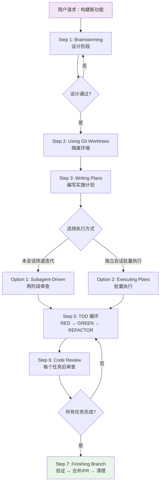

# 完整开发工作流实战：从设计到部署

::: warning 前置知识
本教程假设你已了解以下内容：
- [如何使用技能](../../start/using-skills/)
- [设计工作流：Brainstorming](../../core-workflows/design-workflow/)
- [计划工作流：Writing Plans](../../core-workflows/planning-workflow/)
- [测试驱动开发：TDD 铁律](../../core-workflows/tdd-workflow/)
- [子代理驱动开发](../subagent-development/)
::

## 学完你能做什么

- 掌握 Superpowers 的七大核心步骤，从需求到部署的完整流程
- 理解每个步骤的作用和触发条件
- 学会在关键决策点选择正确的执行方式
- 通过真实场景练习完整的开发工作流
- 避免常见的流程跳过和错误决策

## 你现在的困境

**AI 代理开发容易"跑偏"**

你有没有遇到这样的情况：让 AI 代理实现一个功能，它直接开始写代码，结果写到一半发现理解错了需求，或者写出来的代码不符合项目规范，或者缺少测试需要返工。

常见问题：
- ❌ 直接跳到实现，缺少设计思考
- ❌ 没有隔离环境，污染主分支
- ❌ 任务太大，无法追踪进度
- ❌ 缺少测试驱动，质量无法保证
- ❌ 没有代码审查，问题后期才发现
- ❌ 完成后不知道如何合并或清理

这些问题会导致：开发周期长、代码质量不稳定、返工频繁。

**核心问题**：缺少系统化的开发工作流。

::: info 什么是完整开发工作流？

完整开发工作流是 Superpowers 的核心，它定义了从需求到部署的七大步骤，确保 AI 代理在每一步都遵循最佳实践。

**七大核心步骤**：
1. **Brainstorming（设计）** - 理解需求，探索方案，展示设计
2. **Using Git Worktrees（隔离）** - 创建隔离工作空间，保护主分支
3. **Writing Plans（计划）** - 分解为小任务，编写详细实施计划
4. **Subagent-Driven / Executing Plans（执行）** - 两阶段审查或批量执行
5. **Test-Driven Development（测试）** - RED-GREEN-REFACTOR 循环
6. **Requesting Code Review（审查）** - 每个任务后审查，确保质量
7. **Finishing a Development Branch（完成）** - 验证测试，选择合并方式，清理环境

**核心原则**：每个步骤都是强制性的，不是建议。
::

## 什么时候用这一招

完整开发工作流适用于以下场景：

| 条件 | 说明 |
| ---- | ---- |
| **新功能开发** | 实现新的功能或组件 |
| **Bug 修复** | 修复复杂的 bug 或问题 |
| **代码重构** | 重构现有代码或架构 |
| **集成工作** | 集成第三方服务或模块 |

::: tip 工作流 vs. 单个技能

**完整工作流**：适用于整个开发周期，从需求到部署
**单个技能**：适用于特定阶段，如调试、审查等

如果你只是需要调试一个问题，使用 `systematic-debugging` 技能。如果你需要完成整个开发周期，使用完整工作流。
::

## 核心思路

完整开发工作流的核心流程：



### 七大步骤总览

| 步骤 | 技能 | 目的 | 时间 |
| ---- | ---- | ---- | ---- |
| **1. 设计** | brainstorming | 理解需求，探索方案 | 10-30 分钟 |
| **2. 隔离** | using-git-worktrees | 创建隔离工作空间 | 2-5 分钟 |
| **3. 计划** | writing-plans | 分解为小任务 | 10-20 分钟 |
| **4. 执行** | subagent-driven 或 executing-plans | 两阶段审查或批量执行 | 变化 |
| **5. 测试** | test-driven-development | RED-GREEN-REFACTOR | 持续 |
| **6. 审查** | requesting-code-review | 每个任务后审查 | 每个任务 |
| **7. 完成** | finishing-a-development-branch | 验证、合并、清理 | 5-10 分钟 |

### 关键决策点

**决策点 1：执行方式选择**

在 Step 4，你需要选择执行方式：

| 维度 | Subagent-Driven | Executing Plans |
| ---- | -------------- | -------------- |
| **会话** | 本会话（无切换） | 独立会话（需切换） |
| **上下文** | 控制器管理 | 每个任务独立 |
| **审查** | 自动两阶段 | 手动或单阶段 |
| **任务数量** | 少量（< 10） | 大量（> 10） |
| **速度** | 快（无等待） | 中等（需切换） |

**选择建议**：
- 任务数量少（< 10）→ Subagent-Driven Development
- 任务数量多（> 10）→ Executing Plans（批量执行）

::: tip 查看详细教程

- **Subagent-Driven Development** → [子代理驱动开发](../subagent-development/)
- **Execuing Plans** → [计划工作流](../../core-workflows/planning-workflow/)
::

## 跟我做

### 场景：构建用户评论系统

假设你需要为一个博客系统添加用户评论功能，包括：
- 用户可以发表评论
- 评论需要审核
- 支持回复和点赞

### Step 1：Brainstorming - 设计阶段

**为什么**
在实现之前，必须理解需求、探索方案、展示设计，避免后期返工。

**操作示例**

```
你：我要为博客系统添加用户评论功能，包括发表、审核、回复和点赞。

AI：好的，我需要了解一些细节。

问题 1：用户评论是否需要登录后才能发表？

你：是的，需要登录。

AI：明白。

问题 2：评论审核是由管理员手动审核，还是自动过滤敏感词？

你：手动审核。

AI：明白。

问题 3：回复是支持无限嵌套，还是只支持一级回复？

你：支持无限嵌套，但最多显示 3 层。

AI：明白了。我理解你的需求了。下面是我的设计方案：

【设计文档 - 第 1 部分：数据模型】

评论系统需要以下数据模型：
- Comment: id, content, userId, postId, parentId, status, createdAt
- User: id, name, email
- Post: id, title

status 字段有三个值：pending（待审核）、approved（已审核）、rejected（已拒绝）。

目前看起来对吗？

你：对，继续。

AI：【设计文档 - 第 2 部分：API 端点】

需要以下 API 端点：
- POST /api/posts/:postId/comments - 创建评论
- GET /api/posts/:postId/comments - 获取评论列表
- PUT /api/comments/:id/approve - 审核通过
- PUT /api/comments/:id/reject - 审核拒绝
- POST /api/comments/:id/replies - 回复评论
- POST /api/comments/:id/like - 点赞评论

目前看起来对吗？

你：对，继续。

AI：【设计文档 - 第 3 部分：前端组件】

需要以下 React 组件：
- CommentForm - 评论表单
- CommentList - 评论列表
- CommentItem - 单个评论
- AdminPanel - 管理员审核面板

目前看起来对吗？

你：对，继续。

AI：【设计文档 - 第 4 部分：权限控制】

- 只有登录用户可以发表评论和点赞
- 只有管理员可以审核评论
- 作者可以删除自己的评论

目前看起来对吗？

你：对，这样就可以。

AI：好的，我现在保存设计文档。

[保存到：docs/plans/2026-02-01-comment-system-design.md]
[提交设计文档]
```

**你应该看到**：AI 提出问题，展示设计分段确认，最后保存设计文档。

::: warning 检查点

Brainstorming 完成后，必须：
- [ ] 需求已明确（所有关键问题已回答）
- [ ] 设计已分段展示并确认
- [ ] 设计文档已保存到 `docs/plans/`
- [ ] 设计文档已提交到 git

如果以上任何一项缺失，不要继续，补充完整。
::

### Step 2：Using Git Worktrees - 隔离环境

**为什么**
创建隔离的工作空间，保护主分支，避免污染。

**操作示例**

```
你：准备开始实现了。

AI：好的，我现在创建隔离的工作空间。

[使用 using-git-worktrees 技能]

正在创建工作树...
工作树创建成功：/path/to/project-worktree

切换到工作树...

运行项目设置...
npm install
npm run setup

验证测试基线...
npm test

测试基线通过：100/100

工作空间已准备好。
```

**你应该看到**：
- 新的工作树已创建
- 项目已设置（依赖安装完成）
- 测试基线通过（确保不会破坏现有功能）

::: warning 检查点

Git Worktrees 完成后，必须：
- [ ] 工作树已创建
- [ ] 已切换到工作树
- [ ] 项目设置完成（依赖安装）
- [ ] 测试基线通过

如果测试基线失败，必须修复才能继续。
::

### Step 3：Writing Plans - 编写实施计划

**为什么**
将大的功能分解为小任务（每个 2-5 分钟），编写详细的实施计划，确保无上下文的工程师也能执行。

**操作示例**

```
AI：好的，我现在编写详细的实施计划。

[使用 writing-plans 技能]

[保存到：docs/plans/2026-02-01-comment-system-implementation.md]

```markdown
# 用户评论系统实施计划

**For Claude:** REQUIRED SUB-SKILL: Use superpowers:executing-plans to implement this plan task-by-task.

**Goal:** 实现用户评论系统，包括发表、审核、回复和点赞功能。

**Architecture:** 使用 RESTful API，数据存储在 PostgreSQL，前端使用 React 组件。

**Tech Stack:** Node.js + Express + PostgreSQL + React

---

## 任务列表

### Task 1：创建评论数据模型
- 创建 `models/Comment.js`
- 定义字段：id, content, userId, postId, parentId, status, createdAt
- 定义 status 枚举：pending, approved, rejected
- 迁移到数据库

### Task 2：创建评论 API 端点
- 创建 `routes/comments.js`
- 实现 POST /api/posts/:postId/comments
- 实现 GET /api/posts/:postId/comments
- 添加参数验证

### Task 3：实现评论审核 API
- 实现 PUT /api/comments/:id/approve
- 实现 PUT /api/comments/:id/reject
- 添加权限检查（仅管理员）

### Task 4：实现回复和点赞 API
- 实现 POST /api/comments/:id/replies
- 实现 POST /api/comments/:id/like
- 处理嵌套逻辑

### Task 5：创建评论表单组件
- 创建 `components/CommentForm.jsx`
- 实现表单验证
- 集成评论 API

### Task 6：创建评论列表组件
- 创建 `components/CommentList.jsx`
- 实现评论展示
- 支持嵌套显示（最多 3 层）

### Task 7：创建管理员审核面板
- 创建 `components/AdminPanel.jsx`
- 显示待审核评论
- 实现审核按钮
```
```

**你应该看到**：详细的实施计划已保存到 `docs/plans/`。

::: warning 检查点

Writing Plans 完成后，必须：
- [ ] 实施计划已保存到 `docs/plans/`
- [ ] 每个任务足够小（2-5 分钟完成）
- [ ] 每个任务包含完整代码和测试步骤
- [ ] 实施计划已提交到 git

如果任务太大，继续分解。
::

### Step 4：选择执行方式

**为什么**
根据任务数量和场景，选择合适的执行方式。

**操作示例**

```
AI：实施计划已完成，包含 7 个任务。

现在有两种执行方式：

**Option 1: Subagent-Driven Development（本会话）**
- 每个任务派发新的子代理
- 两阶段自动审查（规格合规 + 代码质量）
- 适合任务数量少（< 10）
- 无需切换会话

**Option 2: Executing Plans（独立会话）**
- 批量执行任务
- 需要切换到独立会话
- 适合任务数量多（> 10）
- 手动审查检查点

你希望使用哪种方式？

你：使用 Option 1，Subagent-Driven Development。

AI：好的，我将使用 Subagent-Driven Development 执行这个计划。
```

::: tip 如何选择？

**选择 Subagent-Driven Development，如果**：
- 任务数量少（< 10）
- 希望在当前会话完成
- 需要自动两阶段审查

**选择 Executing Plans，如果**：
- 任务数量多（> 10）
- 可以切换到独立会话
- 需要批量处理任务
::

### Step 5：Subagent-Driven Development - 两阶段审查

**为什么**
为每个任务派发新的子代理，避免上下文污染，执行两阶段审查确保质量。

**操作示例**

```
AI：开始执行任务 1：创建评论数据模型。

[派发实现者子代理]

任务：创建评论数据模型

要求：
- 创建 `models/Comment.js`
- 定义字段：id, content, userId, postId, parentId, status, createdAt
- 定义 status 枚举：pending, approved, rejected
- 迁移到数据库
- 严格遵循 TDD（RED-GREEN-REFACTOR）

【一段时间后】

实现者子代理：
- ✅ 创建了 `models/Comment.js`
- ✅ 定义了所有字段和枚举
- ✅ 添加了 5 个测试，全部通过
- ✅ 迁移脚本已创建并运行
- ✅ 自我审查：发现缺少索引，已添加
- ✅ 已提交：abc123

[派发规格审查子代理]

规格审查子代理：
✅ 规格合规
- 实现了所有要求的字段
- 定义了 status 枚举
- 迁移脚本已创建
- 没有额外功能
- 没有遗漏规格细节

[派发代码质量审查子代理]

代码质量审查子代理：
优势：
- 良好的测试覆盖率（5/5）
- 代码清晰，结构合理
- 添加了必要的索引

问题：
无

结果：✅ 批准

[标记任务 1 完成]
```

**你应该看到**：每个任务都经历了实现 → 规格审查 → 代码质量审查的流程。

::: tip 查看详细教程

Subagent-Driven Development 的完整流程 → [子代理驱动开发](../subagent-development/)
::

### Step 6：Test-Driven Development - TDD 循环

**为什么**
强制 RED-GREEN-REFACTOR 循环，确保每个功能都有测试，避免编写未测试的代码。

**操作示例**

在实施过程中，子代理会自动遵循 TDD 流程：

```
实现者子代理：
现在开始实现任务 1：创建评论数据模型。

【Step 1: RED - 编写失败测试】

创建 `tests/Comment.test.js`：
```javascript
describe('Comment Model', () => {
  it('should create a comment with required fields', async () => {
    const comment = await Comment.create({
      content: 'Test comment',
      userId: 1,
      postId: 1
    });
    expect(comment.content).toBe('Test comment');
  });
});
```

运行测试：
```
npm test

测试失败：ReferenceError: Comment is not defined
```

【Step 2: GREEN - 编写最小代码使测试通过】

创建 `models/Comment.js`：
```javascript
const { DataTypes } = require('sequelize');

const Comment = sequelize.define('Comment', {
  content: DataTypes.TEXT,
  userId: DataTypes.INTEGER,
  postId: DataTypes.INTEGER,
  status: DataTypes.ENUM('pending', 'approved', 'rejected')
});

module.exports = Comment;
```

运行测试：
```
npm test

测试通过：✅
```

【Step 3: REFACTOR - 重构代码】

代码已经简洁，无需重构。

【提交】

git commit -m "Create Comment model with required fields"
```

**你应该看到**：子代理严格遵循 RED-GREEN-REFACTOR 循环。

::: tip 查看详细教程

TDD 的完整流程 → [测试驱动开发：TDD 铁律](../../core-workflows/tdd-workflow/)
::

### Step 7：Requesting Code Review - 代码审查

**为什么**
每个任务完成后进行代码审查，确保代码质量和规格合规性。

**操作示例**

```
AI：任务 1 已完成，现在进行代码审查。

[使用 requesting-code-review 技能]

审查任务：创建评论数据模型

提交：abc123

规格审查：
✅ 符合规格
- 实现了所有要求的字段
- 定义了 status 枚举
- 迁移脚本已创建

代码质量审查：
优势：
- 测试覆盖率 100%（5/5）
- 代码结构清晰
- 添加了必要的索引（userId, postId）

建议：
无

结果：✅ 批准
```

**你应该看到**：每个任务完成后都有详细的代码审查。

::: tip 查看详细教程

代码审查的完整流程 → [代码审查工作流](../code-review-workflow/)
::

### Step 8：重复流程，完成所有任务

**为什么**
对每个任务重复相同的流程，直到所有任务完成。

**操作示例**

```
任务 2：创建评论 API 端点
[实现者子代理] → [规格审查] → [代码质量审查] → ✅ 完成

任务 3：实现评论审核 API
[实现者子代理] → [规格审查] → [代码质量审查] → ✅ 完成

任务 4：实现回复和点赞 API
[实现者子代理] → [规格审查] → [代码质量审查] → ✅ 完成

任务 5：创建评论表单组件
[实现者子代理] → [规格审查] → [代码质量审查] → ✅ 完成

任务 6：创建评论列表组件
[实现者子代理] → [规格审查] → [代码质量审查] → ✅ 完成

任务 7：创建管理员审核面板
[实现者子代理] → [规格审查] → [代码质量审查] → ✅ 完成

所有任务已完成。
```

**你应该看到**：所有任务都通过了两阶段审查。

### Step 9：Finishing a Development Branch - 完成分支

**为什么**
验证所有测试通过，选择合并或创建 PR，清理工作树。

**操作示例**

```
AI：所有任务已完成，现在使用 finishing-a-development-branch 技能完成工作。

[使用 finishing-a-development-branch 技能]

正在验证测试...

npm test

测试结果：
✅ 100% 通过（150/150）

所有测试通过。

【Step 1: 确定基础分支】

当前分支：feature/comment-system
基础分支：main

【Step 2: 呈现选项】

请选择下一步操作：

1. **合并到主分支**
   - 直接合并到 main 分支
   - 适合小型项目或个人项目

2. **创建 Pull Request**
   - 创建 PR 供审查
   - 适合团队项目或开源项目

3. **保留分支供进一步工作**
   - 保留分支继续工作
   - 适合需要更多开发的情况

4. **丢弃分支**
   - 删除分支和工作树
   - 适合放弃这个功能

你：选择 2，创建 Pull Request。

AI：好的，正在创建 Pull Request...

PR 已创建：https://github.com/your-repo/pull/123

【Step 3: 清理工作树】

工作树已清理。
```

**你应该看到**：可以选择合并或创建 PR 的选项，工作树已清理。

::: tip 查看详细教程

Finishing a Development Branch 的完整流程 → [分支完成工作流](../branch-completion/)
::

## 检查点 ✅

**验证完整开发工作流是否完整**

- [ ] **Step 1: Brainstorming** - 需求明确，设计已保存
- [ ] **Step 2: Using Git Worktrees** - 工作树已创建，测试基线通过
- [ ] **Step 3: Writing Plans** - 实施计划已保存，任务足够小
- [ ] **Step 4: 执行方式** - 已选择合适的执行方式
- [ ] **Step 5: Subagent-Driven / Executing Plans** - 所有任务已完成
- [ ] **Step 6: TDD** - 每个功能都有测试，遵循 RED-GREEN-REFACTOR
- [ ] **Step 7: Code Review** - 每个任务后都有审查
- [ ] **Step 8: 重复流程** - 所有任务都通过审查
- [ ] **Step 9: Finishing Branch** - 测试验证通过，已合并或创建 PR，工作树已清理

如果以上任何一项不符合，说明流程不完整，需要补充。

## 踩坑提醒

### ❌ 跳过 Brainstorming

**症状**：直接开始实现，没有理解需求和设计。

**问题**：
- 可能理解错误需求，后期返工
- 缺少设计思考，代码结构不合理
- 没有设计文档，后期无法参考

**解决方法**：
- 任何创造性工作前必须使用 brainstorming
- 明确需求，探索方案，展示设计
- 保存设计文档到 `docs/plans/`

### ❌ 跳过 Git Worktrees

**症状**：在主分支或现有分支上直接实现。

**问题**：
- 可能污染主分支
- 无法并行开发多个功能
- 代码混乱，难以追溯

**解决方法**：
- 每个功能前使用 using-git-worktrees
- 创建隔离的工作空间
- 确保测试基线通过

### ❌ 任务太大

**症状**：实施计划中的任务需要 30 分钟以上完成。

**问题**：
- 进度难以追踪
- 出错后难以定位
- 子代理容易迷失

**解决方法**：
- 每个任务 2-5 分钟完成
- 继续分解大任务
- 每个任务只有一个动作

### ❌ 跳过代码审查

**症状**：任务完成后直接进入下一个，没有审查。

**问题**：
- 代码质量无法保证
- 问题后期才发现，修复成本高
- 不符合最佳实践

**解决方法**：
- 每个任务后必须进行代码审查
- 两阶段审查（规格合规 + 代码质量）
- 审查发现问题必须修复

### ❌ 违反 TDD

**症状**：先写代码，后写测试。

**问题**：
- 可能遗漏测试
- 测试覆盖率不足
- 代码质量无法保证

**解决方法**：
- 严格遵循 RED-GREEN-REFACTOR
- 先写失败测试，再写代码
- 删除在测试之前编写的代码

### ❌ 测试基线失败

**症状**：创建工作树后，测试基线失败，但继续实现。

**问题**：
- 可能破坏现有功能
- 后期难以定位问题
- 不符合最佳实践

**解决方法**：
- 测试基线失败必须修复
- 确保现有功能正常
- 不能带着问题继续

### ❌ 工作树未清理

**症状**：功能完成后，工作树没有清理。

**问题**：
- 占用磁盘空间
- 混淆分支状态
- 后续开发容易出错

**解决方法**：
- 使用 finishing-a-development-branch 技能
- 完成后清理工作树
- 选择合并或创建 PR

## Red Flags - 必须避免

以下行为会导致完整开发工作流失效：

**绝对禁止**：
- ❌ 跳过任何步骤（Brainstorming、Git Worktrees、Writing Plans 等）
- ❌ 在主分支或 master 分支上开始实现（除非用户明确同意）
- ❌ 任务太大（> 5 分钟）
- ❌ 跳过代码审查
- ❌ 违反 TDD（先写代码，后写测试）
- ❌ 测试基线失败还继续实现
- ❌ 工作树未清理
- ❌ 跳过重新审查（修复后必须重新审查）

**如果出现问题**：
- 停止，回到问题出现的步骤
- 修复问题后再继续
- 不要带着问题跳到下一步

## 本课小结

完整开发工作流通过以下机制确保高质量交付：

1. **设计先行** - Brainstorming 确保需求明确，设计合理
2. **环境隔离** - Git Worktrees 保护主分支，避免污染
3. **计划详细** - Writing Plans 分解为小任务，确保可执行
4. **执行灵活** - Subagent-Driven 或 Executing Plans，根据场景选择
5. **测试驱动** - TDD 强制 RED-GREEN-REFACTOR，确保测试覆盖
6. **代码审查** - 两阶段审查确保代码质量和规格合规
7. **完成清理** - Finishing Branch 验证测试，选择合并方式，清理环境

**记住**：每个步骤都是强制性的，不是建议。跳过任何步骤都会导致质量下降或返工。

## 下一课预告

> 下一课我们学习 **[编写自定义技能](../../extending/writing-skills/)**。
>
> 你会学到：
> - 如何遵循最佳实践编写自己的技能
> - 技能文件的格式和结构
> - 如何测试和验证技能
> - 如何向 Superpowers 项目贡献技能

---

## 附录：源码参考

<details>
<summary><strong>点击展开查看源码位置</strong></summary>

> 更新时间：2026-02-01

| 功能        | 文件路径                                                                                    | 行号    |
| ----------- | ------------------------------------------------------------------------------------------- | ------- |
| 基本工作流概述 | [`README.md`](https://github.com/obra/superpowers/blob/main/README.md) | 80-96   |
| Brainstorming 技能 | [`skills/brainstorming/SKILL.md`](https://github.com/obra/superpowers/blob/main/skills/brainstorming/SKILL.md) | 1-70+   |
| Writing Plans 技能 | [`skills/writing-plans/SKILL.md`](https://github.com/obra/superpowers/blob/main/skills/writing-plans/SKILL.md) | 1-100+  |
| Subagent-Driven Development 技能 | [`skills/subagent-driven-development/SKILL.md`](https://github.com/obra/superpowers/blob/main/skills/subagent-driven-development/SKILL.md) | 1-243   |
| TDD 技能 | [`skills/test-driven-development/SKILL.md`](https://github.com/obra/superpowers/blob/main/skills/test-driven-development/SKILL.md) | 1-150+  |
| Code Review 技能 | [`skills/requesting-code-review/SKILL.md`](https://github.com/obra/superpowers/blob/main/skills/requesting-code-review/SKILL.md) | 1-80+   |
| Finishing Branch 技能 | [`skills/finishing-a-development-branch/SKILL.md`](https://github.com/obra/superpowers/blob/main/skills/finishing-a-development-branch/SKILL.md) | 1-100+  |
| Git Worktrees 技能 | [`skills/using-git-worktrees/SKILL.md`](https://github.com/obra/superpowers/blob/main/skills/using-git-worktrees/SKILL.md) | 1-120+  |
| Executing Plans 技能 | [`skills/executing-plans/SKILL.md`](https://github.com/obra/superpowers/blob/main/skills/executing-plans/SKILL.md) | 1-150+  |
| 完整用户旅程 | [`docs/zh/obra/superpowers/prd.md`](https://github.com/obra/superpowers/blob/main/docs/zh/obra/superpowers/prd.md) | 110-146  |

**七大核心步骤**（来自 README.md:80-96）：
1. **Brainstorming** - 在写代码前激活。通过问题细化想法，探索替代方案，分段展示设计以验证。保存设计文档。
2. **Using Git Worktrees** - 在设计批准后激活。在新分支创建隔离工作空间，运行项目设置，验证干净的测试基线。
3. **Writing Plans** - 在批准设计后激活。将工作分解为小任务（每个 2-5 分钟）。每个任务都有确切的文件路径、完整代码、验证步骤。
4. **Subagent-Driven Development 或 Executing Plans** - 在有计划时激活。为每个任务派发新的子代理，进行两阶段审查（规格合规，然后代码质量），或在批量执行中使用人工检查点。
5. **Test-Driven Development** - 在实现期间激活。强制 RED-GREEN-REFACTOR：编写失败测试，看着它失败，编写最小代码，看着它通过，提交。删除在测试之前编写的代码。
6. **Requesting Code Review** - 在任务之间激活。根据计划审查，按严重程度报告问题。关键问题阻止进度。
7. **Finishing a Development Branch** - 在任务完成时激活。验证测试，呈现选项（合并/PR/保留/丢弃），清理工作树。

**关键原则**：
- 代理在任何任务之前都会检查相关技能
- 强制工作流，不是建议

**触发条件**（来自 PRD:110-146）：
- 用户需要构建新功能
- 修复 bug
- 实施复杂任务

**前置要求**（来自 PRD:148-149）：
- 已安装对应平台的插件或配置

**预期结果**（来自 PRD:149）：
- 遵循最佳实践的完整实现
- 经过系统化验证

</details>
