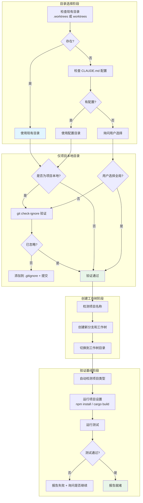

# Git 工作树隔离

## 学完你能做什么

- 创建隔离的 Git 工作树，保持主分支清洁
- 遵循目录选择优先级，智能确定工作树位置
- 执行安全验证，防止工作树内容被意外提交
- 自动检测并运行项目设置（npm install、cargo build 等）
- 验证测试基线，确保工作树从干净状态开始

## 你现在的困境

**传统分支切换会丢失当前工作**

你有没有遇到这种情况？正在主分支开发一个功能，突然需要修复一个紧急 bug，但切换分支前需要：

- 要么提交当前未完成的代码（污染提交历史）
- 要么使用 `git stash`（容易忘记恢复或覆盖）
- 要么放弃当前工作（进度丢失）

更糟糕的是，多个功能并行开发时，需要在不同分支之间频繁切换，每次都要重新设置环境、重新编译。

常见问题：
- ❌ 主分支被未完成的工作污染
- ❌ `git stash` 导致代码丢失或覆盖
- ❌ 频繁切换分支，浪费时间重新设置环境
- ❌ 多个功能并行时，上下文混乱

这些问题会导致：开发效率低、代码质量不稳定、难以追踪工作进度。

**核心问题**：缺少系统化的环境隔离机制。

::: info 什么是 Git worktrees？

Git worktrees（工作树）允许你在同一个仓库中创建多个独立的工作目录，每个目录可以关联到不同的分支。

核心优势：
1. **同时工作多个分支**：无需切换分支，多个工作树并行
2. **共享同一个仓库**：所有 worktrees 共享 .git 目录，节省空间
3. **独立工作环境**：每个工作树有独立的文件和未提交的更改

使用场景：
- 同时开发多个功能
- 需要紧急修复 bug 时切换工作
- 需要隔离开发环境，避免污染主分支

::

## 什么时候用这一招

Git worktrees 技能适用于以下场景：

| 条件 | 说明 |
| ---- | ---- |
| **设计已批准** | 已经通过 `brainstorming` 技能创建了设计文档 |
| **需要隔离环境** | 功能开发需要在独立的工作空间进行 |
| **执行实施前** | 在开始执行 `subagent-driven-development` 或 `executing-plans` 前 |

::: tip 工作流集成位置

在 Superpowers 的完整开发工作流中，`using-git-worktrees` 在以下阶段被调用：

1. **brainstorming**（Phase 4）- 设计批准后，准备实施前
2. **subagent-driven-development** - 执行任何任务前
3. **executing-plans** - 执行任何任务前

核心原则：**在任何需要隔离的功能工作开始前，创建工作树**。
::

::: warning 必备前置条件

使用 Git worktrees 技能前，你必须：
1. ✅ 已有 Git 仓库
2. ✅ Git 版本支持 worktree（2.5+）
3. ✅ 有创建新分支的权限
4. ✅ 已批准的设计文档（如有）

::

## 核心思路

Git worktrees 技能的核心流程分为目录选择、安全验证、创建工作树和验证基线四个阶段：



### 目录选择优先级

技能遵循严格的目录选择优先级，确保一致性和可靠性：

1. **检查现有目录**（优先级最高）
   - 检查 `.worktrees/`（隐藏目录，推荐）
   - 检查 `worktrees/`（可见目录）
   - 如果两者都存在，`.worktrees/` 优先

2. **检查 CLAUDE.md 配置**
   - 搜索 `worktree.*director` 配置
   - 如果用户明确指定，直接使用（不询问）

3. **询问用户**
   - 如果没有现有目录，也没有配置
   - 提供两个选项供用户选择

### 安全验证机制

对于项目本地目录（`.worktrees/` 或 `worktrees/`），**必须验证目录已被 Git 忽略**。

**为什么重要**：
- 如果工作树目录未被忽略，Git 会尝试跟踪其中的内容
- 这会导致 `git status` 显示大量无关文件
- 可能意外提交工作树内容到仓库

**验证方法**：
```bash
git check-ignore -q .worktrees 2>/dev/null || git check-ignore -q worktrees 2>/dev/null
```

**如果未忽略**：
1. 立即添加到 `.gitignore`
2. 提交更改（遵循"立即修复损坏的东西"原则）
3. 然后才能创建工作树

### 自动化项目设置

创建工作树后，技能会自动检测项目类型并运行相应的设置命令：

| 项目类型 | 检测文件 | 设置命令 |
| -------- | -------- | -------- |
| Node.js | `package.json` | `npm install` |
| Rust | `Cargo.toml` | `cargo build` |
| Python | `requirements.txt` | `pip install -r requirements.txt` |
| Python (Poetry) | `pyproject.toml` | `poetry install` |
| Go | `go.mod` | `go mod download` |

### 测试基线验证

工作树必须从干净的测试基线开始，这样才能区分新 bug 和预存问题。

**验证流程**：
1. 自动运行项目测试命令
2. 检查测试结果
3. 如果测试失败，报告失败信息
4. 询问用户是否继续（不自动决定）

## 跟我做

### 第 1 步：准备 - 确认技能触发

**为什么**
确认 AI 代理已正确加载 `using-git-worktrees` 技能。

**操作示例**

```
你：帮我实现用户认证功能。

AI 代理：我将使用 using-git-worktrees 技能来设置隔离工作空间。
```

**你应该看到**：AI 代理声明正在使用此技能。

### 第 2 步：目录选择 - 检查现有目录

**为什么**
优先使用现有目录，保持项目一致性。

**操作示例**

```
AI 代理：[检查 .worktrees/ - 存在]
[验证 .worktrees/ 是否已被忽略]
```

**如果目录存在**：
- 直接使用该目录
- 跳过询问环节

**如果目录不存在**：
- 进入第 3 步

**检查命令**（内部执行）：
```bash
ls -d .worktrees 2>/dev/null    # 优先
ls -d worktrees 2>/dev/null     # 备选
```

### 第 3 步：目录选择 - 检查 CLAUDE.md 配置

**为什么**
尊重用户的配置偏好，减少不必要的询问。

**操作示例**

```
AI 代理：[检查 CLAUDE.md 中的 worktree 配置]
```

**检查命令**（内部执行）：
```bash
grep -i "worktree.*director" CLAUDE.md 2>/dev/null
```

**如果找到配置**：
- 使用配置的目录（不询问）

**如果未找到配置**：
- 进入第 4 步，询问用户

### 第 4 步：目录选择 - 询问用户

**为什么**
给用户选择权，适应不同的项目需求。

**操作示例**

```
AI 代理：
未找到工作树目录。我应该在哪里创建工作树？

1. .worktrees/ (项目本地，隐藏)
2. ~/.config/superpowers/worktrees/<project-name>/ (全局位置)

您更倾向哪一个？
```

**你应该看到**：两个选项，并说明各自的优缺点。

**选项对比**：

| 选项 | 位置 | 优点 | 缺点 |
| ---- | ---- | ---- | ---- |
| `.worktrees/` | 项目根目录（隐藏） | 项目自包含，易于管理 | 可能被版本跟踪（需要 .gitignore） |
| `~/.config/superpowers/worktrees/` | 全局配置目录 | 完全独立，不会污染项目 | 跨项目访问较麻烦 |

**用户回复示例**：

```
你：使用 .worktrees/
```

### 第 5 步：安全验证 - 检查目录是否被忽略

**为什么**
防止工作树内容被意外提交到仓库。

**操作示例**

```
AI 代理：[执行 git check-ignore -q .worktrees]
```

**检查命令**（内部执行）：
```bash
git check-ignore -q .worktrees 2>/dev/null
```

**如果已被忽略**：
- 验证通过，进入第 6 步

**如果未被忽略**：
- 进入第 6 步的修复流程

**验证成功示例**：
```
AI 代理：.worktrees/ 已被忽略，安全验证通过。
```

**验证失败示例**：
```
AI 代理：⚠️ 警告：.worktrees/ 未被忽略！
正在修复...
```

::: warning 检查点

安全验证必须通过才能创建工作树！

- [ ] 目录已被 `git check-ignore` 确认忽略
- [ ] 如果未忽略，已添加到 .gitignore
- [ ] 修复提交已完成

::

### 第 6 步：安全验证 - 修复未忽略目录

**为什么**
遵循"立即修复损坏的东西"原则，确保工作树安全。

**操作示例**

```
AI 代理：
正在添加 .worktrees/ 到 .gitignore...

[编辑 .gitignore 文件]
[添加一行：.worktrees/]

[提交修复]
git add .gitignore
git commit -m "fix: add .worktrees/ to gitignore for worktree isolation"
```

**你应该看到**：
- .gitignore 文件已更新
- 提交已创建

**修复后验证**：
```
AI 代理：[重新执行 git check-ignore -q .worktrees]
✅ 验证通过，目录已忽略。
```

::: danger 永远不要跳过安全验证

如果目录未被忽略，**必须**修复后再创建工作树。

- ❌ 错误：直接创建工作树，忽略警告
- ❌ 错误：创建后再添加到 .gitignore（已有内容会被跟踪）
- ✅ 正确：先添加到 .gitignore，提交，再创建工作树

::

### 第 7 步：创建工作树 - 检测项目名称

**为什么**
自动获取项目名称，避免手动输入错误。

**操作示例**

```
AI 代理：[检测项目名称]
```

**检测命令**（内部执行）：
```bash
project=$(basename "$(git rev-parse --show-toplevel)")
```

**示例输出**：
```
AI 代理：项目名称：superpowers
```

### 第 8 步：创建工作树 - 创建新分支和工作树

**为什么**
在新分支上创建工作树，保持主分支清洁。

**操作示例**

```
AI 代理：
正在创建工作树和分支...

分支名称：feature/auth
工作树路径：.worktrees/auth
```

**创建命令**（内部执行）：
```bash
# 项目本地目录
git worktree add ".worktrees/auth" -b "feature/auth"

# 全局目录
git worktree add "~/.config/superpowers/worktrees/superpowers/auth" -b "feature/auth"
```

**你应该看到**：
```
AI 代理：
✅ 工作树已创建：.worktrees/auth
✅ 新分支已创建：feature/auth
```

::: tip 分支命名规范

建议使用有意义的分支名称：
- `feature/<feature-name>` - 新功能
- `fix/<bug-name>` - Bug 修复
- `refactor/<component>` - 重构
- `test/<test-name>` - 测试

::

### 第 9 步：切换到工作树目录

**为什么**
后续所有操作都在工作树中进行。

**操作示例**

```
AI 代理：[切换到工作树目录]
cd .worktrees/auth
```

**当前目录**：
- 原主目录：`/path/to/project/`
- 新工作树：`/path/to/project/.worktrees/auth/`

### 第 10 步：项目设置 - 自动检测并运行

**为什么**
确保工作树有完整的依赖和构建产物。

**操作示例**

```
AI 代理：[检测项目类型]
[找到 package.json，检测为 Node.js 项目]

[运行 npm install]
npm install
```

**你应该看到**：
```
AI 代理：
✅ 检测到 Node.js 项目
✅ 正在运行 npm install...
npm WARN deprecated package...
added 142 packages in 12s
✅ 项目设置完成
```

**不同项目类型的设置示例**：

| 项目类型 | 设置命令 | 输出示例 |
| -------- | -------- | -------- |
| Node.js | `npm install` | `added 142 packages in 12s` |
| Rust | `cargo build` | `Compiling project... Finished dev [unoptimized]` |
| Python (requirements.txt) | `pip install -r requirements.txt` | `Successfully installed requests-2.31.0` |
| Python (Poetry) | `poetry install` | `Installing dependencies from lock file` |
| Go | `go mod download` | `go: downloading github.com/...` |

### 第 11 步：验证基线 - 运行测试

**为什么**
确保工作树从干净的测试状态开始。

**操作示例**

```
AI 代理：[运行测试验证基线]
npm test
```

**你应该看到**：
```
AI 代理：
✅ 正在验证测试基线...
npm test

 PASS  src/utils.test.js
  ✓ testAddition()
  ✓ testSubtraction()
  ✓ testMultiplication()

Test Suites: 1 passed, 1 total
Tests:       3 passed, 3 total
```

**测试通过示例**：
```
AI 代理：
✅ 测试基线验证通过
测试通过：3 个测试，0 个失败
工作树就绪，可以开始实现功能
```

**测试失败示例**：
```
AI 代理：
❌ 测试基线验证失败
测试通过：2 个测试，1 个失败
失败：testDivision() - expected 2, got 2.0000001

是否继续实现功能？（基线不干净可能导致难以区分新 bug 和预存问题）
```

::: warning 检查点

测试基线验证必须报告：
- [ ] 测试通过数量
- [ ] 测试失败数量（如有）
- [ ] 具体失败信息（如有）
- [ ] 询问是否继续（如果测试失败）

如果测试失败，**不要**自动决定是否继续，**必须**询问用户。
::

### 第 12 步：报告工作树就绪

**为什么**
清晰告知用户工作树已准备就绪，可以开始实现。

**操作示例**

```
AI 代理：
🎉 工作树已就绪！

📍 工作树位置：/Users/jesse/superpowers/.worktrees/auth
🌿 分支名称：feature/auth
✅ 测试基线：3 个测试，0 个失败

可以开始实现：用户认证功能
```

**你应该看到**：
- 工作树完整路径
- 分支名称
- 测试基线状态
- 准备就绪提示

## 检查点 ✅

**验证 Git worktrees 技能执行是否完整**

- [ ] AI 代理声明使用 `using-git-worktrees` 技能
- [ ] 已检查现有目录（`.worktrees/` 或 `worktrees/`）
- [ ] 已检查 CLAUDE.md 配置（如无现有目录）
- [ ] 已询问用户选择（如无现有目录和配置）
- [ ] 已执行 `git check-ignore` 验证目录是否被忽略
- [ ] 如未忽略，已添加到 .gitignore 并提交
- [ ] 已检测项目名称
- [ ] 已创建新分支和工作树
- [ ] 已切换到工作树目录
- [ ] 已自动检测并运行项目设置
- [ ] 已运行测试验证基线
- [ ] 已报告工作树位置、分支、测试状态
- [ ] 如测试失败，已询问是否继续

如果以上任何一项不符合，说明流程不完整，需要补充。

## 踩坑提醒

### ❌ 踩坑 1：跳过 .gitignore 验证

**症状**：直接创建工作树，不检查目录是否被忽略。

**问题**：
- 工作树内容被 Git 跟踪
- `git status` 显示大量无关文件
- 可能意外提交工作树内容

**解决方法**：
- 创建工作树前，必须执行 `git check-ignore`
- 如果未忽略，立即添加到 .gitignore 并提交
- 然后才能创建工作树

### ❌ 踩坑 2：假设目录位置

**症状**：直接使用 `.worktrees/` 或 `worktrees/`，不检查现有目录和配置。

**问题**：
- 违反项目约定
- 创建不一致的工作树结构
- 用户需要手动修复

**解决方法**：
- 遵循优先级：现有目录 > CLAUDE.md 配置 > 询问用户
- 不要假设用户偏好
- 保持一致性

### ❌ 踩坑 3：测试失败时自动继续

**症状**：测试基线失败，AI 代理直接继续实现功能。

**问题**：
- 无法区分新 bug 和预存问题
- 可能误将预存问题归咎于新代码
- 调试困难

**解决方法**：
- 测试失败时，报告失败信息
- 询问用户是否继续
- 不自动决定

### ❌ 踩坑 4：硬编码项目设置命令

**症状**：总是运行 `npm install`，不检测项目类型。

**问题**：
- 非 Node.js 项目无法正确设置
- 可能运行错误的命令
- 环境不完整

**解决方法**：
- 自动检测项目类型（package.json、Cargo.toml 等）
- 根据检测到的类型运行相应命令
- 支持多种项目类型

### ❌ 踩坑 5：在主分支创建工作树

**症状**：在 `main` 或 `master` 分支上创建工作树。

**问题**：
- 违反最佳实践
- 主分支可能被污染
- 违反"立即修复损坏的东西"原则

**解决方法**：
- 创建新分支（如 `feature/<name>`）
- 在新分支上创建工作树
- 保持主分支清洁

### ❌ 踩坑 6：忘记切换到工作树目录

**症状**：创建工作树后，仍在主目录操作。

**问题**：
- 修改在错误的位置进行
- 工作树未使用
- 环境隔离失效

**解决方法**：
- 创建工作树后，立即 `cd` 到工作树目录
- 所有后续操作都在工作树中进行
- 确认当前目录

### ❌ 踩坑 7：忽略测试基线验证

**症状**：跳过测试基线验证，直接开始实现。

**问题**：
- 无法验证工作树是否干净
- 难以追踪问题来源
- 可能隐藏现有 bug

**解决方法**：
- 创建工作树后，必须运行测试
- 验证测试基线
- 报告测试结果

## Red Flags - 必须避免

以下行为会导致 Git worktrees 技能失效：

**绝对禁止**：
- ❌ 创建项目本地工作树时不验证 .gitignore
- ❌ 测试基线失败时自动继续实现
- ❌ 假设目录位置（不检查现有目录和配置）
- ❌ 硬编码项目设置命令（不检测项目类型）
- ❌ 在主分支或 master 分支上创建工作树
- ❌ 创建工作树后不切换到工作树目录
- ❌ 跳过测试基线验证
- ❌ 测试失败时不报告具体失败信息
- ❌ 测试失败时不询问是否继续
- ❌ 添加 .gitignore 后不提交修复

**始终必须**：
- ✅ 遵循目录选择优先级：现有 > CLAUDE.md > 询问
- ✅ 验证项目本地目录已被忽略
- ✅ 如未忽略，立即修复并提交
- ✅ 自动检测项目类型并运行相应设置命令
- ✅ 在新分支上创建工作树
- ✅ 切换到工作树目录
- ✅ 运行测试验证基线
- ✅ 报告测试失败时的具体信息
- ✅ 测试失败时询问是否继续
- ✅ 报告工作树位置、分支、测试状态

## 工作树清理

完成功能开发后，使用 `finishing-a-development-branch` 技能进行清理：

::: info 相关技能

**finishing-a-development-branch** - 在所有任务完成后，使用此技能：
- 验证测试通过
- 呈现选项（合并/PR/保留/丢弃）
- 清理工作树

::

**清理命令示例**：
```bash
# 删除工作树（如果不需要保留）
git worktree remove .worktrees/auth

# 或保留工作树供进一步工作
# 不执行删除命令
```

## Git worktrees vs. 传统分支切换

| 维度 | Git worktrees | 传统分支切换 |
| ---- | ------------ | ------------ |
| **并行工作** | ✅ 可以同时工作多个分支 | ❌ 必须切换分支 |
| **上下文保留** | ✅ 每个工作树独立保留上下文 | ❌ 切换分支需要 stash 或提交 |
| **环境隔离** | ✅ 每个工作树独立环境 | ❌ 共享同一环境 |
| **空间占用** | ✅ 共享 .git 目录，节省空间 | ❌ 不适用 |
| **设置时间** | ✅ 只需创建一次 | ❌ 每次切换都要重新设置 |
| **学习成本** | ⚠️ 需要理解 worktree 概念 | ✅ 简单直观 |

## 本课小结

Git worktrees 技能通过以下机制实现环境隔离和开发效率提升：

1. **智能目录选择**：遵循优先级（现有 > CLAUDE.md > 询问），确保一致性
2. **安全验证机制**：强制检查 .gitignore，防止意外提交工作树内容
3. **自动化项目设置**：自动检测项目类型并运行相应命令
4. **测试基线验证**：确保工作树从干净状态开始，便于追踪问题
5. **清晰报告**：报告工作树位置、分支、测试状态，让用户确认就绪

**记住**：Git worktrees 适用于需要在隔离环境中进行功能开发的场景。在创建工作树前，必须验证目录被忽略，并验证测试基线。完成开发后，使用 **[finishing-a-development-branch](../branch-completion/)** 技能进行清理和合并。

## 下一课预告

> 下一课我们学习 **[并发代理调度](../parallel-agents/)**。
>
> 你会学到：
> - 如何同时派发多个子代理处理独立任务
> - 并发调度的适用场景和限制
> - 如何管理并发任务的进度和结果
> - 避免并发冲突和依赖问题

---

## 附录：源码参考

<details>
<summary><strong>点击展开查看源码位置</strong></summary>

> 更新时间：2026-02-01

| 功能        | 文件路径                                                                                      | 行号    |
| ----------- | --------------------------------------------------------------------------------------------- | ------- |
| Git worktrees 技能 | [`skills/using-git-worktrees/SKILL.md`](https://github.com/obra/superpowers/blob/main/skills/using-git-worktrees/SKILL.md) | 1-219   |
| 工作流概述   | [`README.md`](https://github.com/obra/superpowers/blob/main/README.md)                            | 80-96   |

**核心原则**：
- 系统化目录选择 + 安全验证 = 可靠隔离（Systematic directory selection + safety verification = reliable isolation）
- 开始时声明："I'm using the using-git-worktrees skill to set up an isolated workspace."

**目录选择优先级**（源码第 16-49 行）：
1. 检查现有目录（`.worktrees/` > `worktrees/`）
2. 检查 CLAUDE.md 配置
3. 询问用户（如无现有目录和配置）

**安全验证**（源码第 51-73 行）：
- 项目本地目录：必须执行 `git check-ignore -q .worktrees` 或 `git check-ignore -q worktrees`
- 如未忽略：添加到 .gitignore + 提交（遵循 Jesse 的"立即修复"原则）
- 全局目录：无需 .gitignore 验证（完全在项目外）

**创建步骤**（源码第 75-142 行）：
1. 检测项目名称：`project=$(basename "$(git rev-parse --show-toplevel)")`
2. 创建工作树：`git worktree add "$path" -b "$BRANCH_NAME"`
3. 切换到工作树：`cd "$path"`
4. 自动检测并运行项目设置（支持 Node.js、Rust、Python、Go）
5. 验证测试基线（运行项目测试命令）
6. 报告位置和测试状态

**支持的项目类型**（源码第 101-117 行）：
| 项目类型 | 检测文件 | 设置命令 |
| -------- | -------- | -------- |
| Node.js | `package.json` | `npm install` |
| Rust | `Cargo.toml` | `cargo build` |
| Python (requirements.txt) | `requirements.txt` | `pip install -r requirements.txt` |
| Python (Poetry) | `pyproject.toml` | `poetry install` |
| Go | `go.mod` | `go mod download` |

**常见错误**（源码第 156-177 行）：
- 跳过 ignore 验证
- 假设目录位置
- 测试失败时继续
- 硬编码设置命令

**Red Flags**（源码第 194-207 行）：
**Never**:
- 创建项目本地工作树时不验证是否被忽略
- 跳过基线测试验证
- 测试失败时不询问是否继续
- 目录位置模糊时假设位置
- 跳过 CLAUDE.md 检查

**Always**:
- 遵循目录优先级：existing > CLAUDE.md > ask
- 验证项目本地目录是否被忽略
- 自动检测并运行项目设置
- 验证干净的测试基线

**集成**（源码第 209-218 行）：
**Called by**:
- **brainstorming** (Phase 4) - REQUIRED（设计批准后实施前）
- **subagent-driven-development** - REQUIRED（执行任何任务前）
- **executing-plans** - REQUIRED（执行任何任务前）
- 任何需要隔离工作空间的技能

**Pairs with**:
- **finishing-a-development-branch** - REQUIRED（工作完成后清理）

**示例工作流**（源码第 178-192 行）：
```
You: I'm using the using-git-worktrees skill to set up an isolated workspace.

[Check .worktrees/ - exists]
[Verify ignored - git check-ignore confirms .worktrees/ is ignored]
[Create worktree: git worktree add .worktrees/auth -b feature/auth]
[Run npm install]
[Run npm test - 47 passing]

Worktree ready at /Users/jesse/myproject/.worktrees/auth
Tests passing (47 tests, 0 failures)
Ready to implement auth feature
```

**快速参考表**（源码第 144-154 行）：
| Situation | Action |
|-----------|--------|
| `.worktrees/` exists | Use it (verify ignored) |
| `worktrees/` exists | Use it (verify ignored) |
| Both exist | Use `.worktrees/` |
| Neither exists | Check CLAUDE.md → Ask user |
| Directory not ignored | Add to .gitignore + commit |
| Tests fail during baseline | Report failures + ask |
| No package.json/Cargo.toml | Skip dependency install |

</details>
