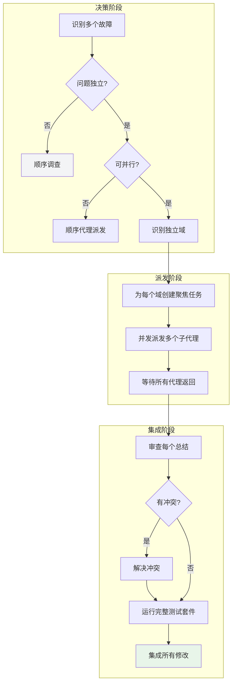

# 并发代理调度：多任务并行提速

## 学完你能做什么

- 判断何时使用并发代理调度 vs 顺序调查
- 识别独立的故障域，避免任务混淆
- 创建聚焦的代理任务，确保高效执行
- 并发派发多个子代理，同时处理多个问题
- 审查和集成所有代理的修复，确保无冲突

## 你现在的困境

**AI 代理顺序处理多个独立问题效率低下**

你有没有遇到这种情况？测试失败有 6 个，分布在 3 个文件中，你让 AI 代理一个一个修复，花了很多时间，但其实这些问题彼此独立，完全可以同时处理。

常见问题：
- ❌ 多个测试失败，AI 按顺序修复一个一个来
- ❌ 不同的子系统出问题，被当作一个大问题处理
- ❌ AI 上下文混淆，修复一个问题时破坏了另一个
- ❌ 时间浪费在顺序处理本来可以并行的事情

这些问题会导致：调试周期长、效率低、修复质量不稳定。

**核心问题**：缺少识别独立问题和并发调度的能力。

::: info 什么是并发代理调度？

并发代理调度是一种高级工作流，当面对多个独立问题时，为每个独立问题域派发一个子代理，让它们同时工作，大幅提高效率。

核心原则：
1. **独立域识别**：判断问题是否可以并行处理
2. **每个域一个代理**：避免上下文混淆
3. **并发执行**：多个问题同时解决
4. **审查集成**：确保修复无冲突

::

## 什么时候用这一招

并发代理调度适用于以下场景：

| 条件 | 说明 |
| ---- | ---- |
| **3+ 个独立故障** | 多个测试文件失败，不同根本原因 |
| **多个子系统问题** | 不同模块独立损坏，无关联 |
| **无共享状态** | 修复一个不影响另一个 |
| **可并行理解** | 每个问题可以在没有其他问题上下文的情况下理解 |

::: tip vs. 顺序调查

| 维度 | 并发代理调度 | 顺序调查 |
| ---- | ------------ | -------- |
| **执行方式** | 多个代理同时工作 | 一个代理按顺序处理 |
| **时间成本** | 线性减少（3 个问题 ≈ 1 个问题时间） | 线性增加（3 个问题 ≈ 3 个问题时间） |
| **上下文** | 每个代理聚焦于一个域 | 代理需要追踪多个上下文 |
| **冲突风险** | 需要事后检查 | 较低（顺序修改） |
| **适用场景** | 独立问题，并行安全 | 相关问题，需要全局理解 |

::

::: warning 什么时候不用

以下场景**不适合**使用并发代理调度：
- ❌ 失败是相关的（修复一个可能会修复其他的）
- ❌ 需要理解完整的系统状态
- ❌ 探索性调试（你不知道哪里坏了）
- ❌ 代理会相互干扰（编辑相同文件，使用相同资源）

::

## 核心思路

并发代理调度的核心流程分为决策阶段、派发阶段和集成阶段：



### 识别独立域

如何判断问题是否独立？按"坏了什么"分组：

**示例**：6 个测试失败分布在 3 个文件

| 文件 | 失败数 | 问题描述 | 独立域 |
| ---- | ------ | -------- | ------ |
| agent-tool-abort.test.ts | 3 | 中断时机问题 | 中断逻辑 |
| batch-completion-behavior.test.ts | 2 | 工具未执行 | 批量完成 |
| tool-approval-race-conditions.test.ts | 1 | 执行计数为 0 | 竞态条件 |

这三个域是独立的——修复中断逻辑不会影响批量完成或竞态条件测试。

### 创建聚焦的代理任务

每个代理任务必须：

1. **聚焦**：一个清晰的问题域（一个测试文件或子系统）
2. **自包含**：理解问题所需的所有上下文
3. **约束明确**：不能修改其他代码
4. **输出具体**：返回发现的和修复内容的总结

## 跟我做

### 第 1 步：识别独立域

**为什么**
判断问题是否可以并行处理，避免浪费资源。

**操作示例**

假设你有以下测试失败：

```bash
npm test

# 失败 1/6: agent-tool-abort.test.ts:45
#   "should abort tool with partial output capture"
#   AssertionError: expected 'interrupted at' in message

# 失败 2/6: agent-tool-abort.test.ts:78
#   "should handle mixed completed and aborted tools"
#   AssertionError: fast tool aborted instead of completed

# 失败 3/6: agent-tool-abort.test.ts:102
#   "should properly track pendingToolCount"
#   AssertionError: expected 3 results but got 0

# 失败 4/6: batch-completion-behavior.test.ts:23
#   "should execute all tools in batch"
#   AssertionError: only 2/5 tools executed

# 失败 5/6: batch-completion-behavior.test.ts:56
#   "should update batch status after completion"
#   AssertionError: status stuck at 'executing'

# 失败 6/6: tool-approval-race-conditions.test.ts:12
#   "should track tool execution count"
#   AssertionError: expected 3 but got 0
```

**分析独立性**：

```markdown
问题域分析：

1. agent-tool-abort.test.ts（3 个失败）
   - 问题：中断时机、计数错误
   - 独立性：✅ 只涉及中断逻辑

2. batch-completion-behavior.test.ts（2 个失败）
   - 问题：工具未执行、状态卡住
   - 独立性：✅ 只涉及批量完成逻辑

3. tool-approval-race-conditions.test.ts（1 个失败）
   - 问题：执行计数为 0
   - 独立性：✅ 只涉及竞态条件

结论：三个域完全独立，可以并发处理
```

**你应该看到**：问题被清晰地分组到不同的独立域。

### 第 2 步：创建聚焦的代理任务

**为什么**
每个代理需要一个明确的任务，避免范围过大导致迷失。

**操作示例**

**域 1：agent-tool-abort.test.ts**

```markdown
修复 agent-tool-abort.test.ts 中的 3 个失败测试：

1. "should abort tool with partial output capture"
   - 错误：期望消息中包含 'interrupted at'
   - 实际：消息中没有这个标记

2. "should handle mixed completed and aborted tools"
   - 错误：快速工具被中断而非完成
   - 实际：应该是完成但被标记为中断

3. "should properly track pendingToolCount"
   - 错误：期望 3 个结果，实际得到 0
   - 实际：计数逻辑有问题

这些是时机/竞态条件问题。你的任务：

1. 读取测试文件，理解每个测试验证什么
2. 识别根本原因——是时机问题还是实际 bug？
3. 修复方法：
   - 用基于事件的等待替换任意超时
   - 如果发现中断实现中的 bug，修复它
   - 如果测试的是改变了的行为，调整测试预期

不要只是增加超时——找到真正的问题。

返回：你发现的和修复内容的总结。
```

**域 2：batch-completion-behavior.test.ts**

```markdown
修复 batch-completion-behavior.test.ts 中的 2 个失败测试：

1. "should execute all tools in batch"
   - 错误：只执行了 2/5 个工具
   - 实际：工具列表在循环中被错误修改

2. "should update batch status after completion"
   - 错误：状态卡在 'executing'
   - 实际：完成后没有更新状态

你的任务：

1. 读取测试文件，理解批量完成逻辑
2. 识别工具列表被修改的原因
3. 修复状态更新问题
4. 确保批量完成后状态正确更新

返回：你发现的和修复内容的总结。
```

**域 3：tool-approval-race-conditions.test.ts**

```markdown
修复 tool-approval-race-conditions.test.ts 中的失败测试：

1. "should track tool execution count"
   - 错误：期望 3，实际 0
   - 实际：异步工具完成前计数器被读取

你的任务：

1. 读取测试文件，理解竞态条件场景
2. 添加等待，确保异步工具完成后再读取计数
3. 确保测试正确验证执行计数

返回：你发现的和修复内容的总结。
```

**你应该看到**：每个任务都聚焦于一个独立域，有明确的上下文和约束。

### 第 3 步：并发派发多个子代理

**为什么**
让多个代理同时工作，大幅提高效率。

**操作示例**

```markdown
[在 AI 环境中，并发派发 3 个子代理]

任务 1：Fix agent-tool-abort.test.ts failures
任务 2：Fix batch-completion-behavior.test.ts failures
任务 3：Fix tool-approval-race-conditions.test.ts failures

# 所有三个任务并发运行
```

**你应该看到**：三个代理同时开始工作。

### 第 4 步：等待所有代理返回

**为什么**
给每个代理足够的时间完成任务，不要过早打断。

**操作示例**

```
[等待代理 1 返回]
[等待代理 2 返回]
[等待代理 3 返回]

所有代理已完成
```

**示例返回结果**：

**代理 1 返回**：

```markdown
总结：

发现的根本原因：
1. "should abort tool with partial output capture"
   - 中断信号在部分输出捕获前发送
   - 修复：调整中断时机，在输出捕获后发送信号

2. "should handle mixed completed and aborted tools"
   - 快速工具的超时设置为 100ms，太短
   - 修复：将超时调整为 500ms，改为基于事件等待

3. "should properly track pendingToolCount"
   - 计数器在工具开始时递增，但在完成/中断前递减
   - 修复：将递减逻辑移到完成/中断处理后

修复内容：
- src/agents/abort-logic.ts: 调整中断时机
- src/agents/abort-logic.ts: 替换超时为事件等待
- src/agents/abort-logic.ts: 修复计数器递减逻辑

测试结果：3/3 通过
```

**代理 2 返回**：

```markdown
总结：

发现的根本原因：
1. "should execute all tools in batch"
   - 循环中使用 `for...of` 直接迭代工具列表
   - 工具对象被修改（添加 `executed: true`）导致迭代跳过
   - 修复：创建工具列表的浅拷贝用于迭代

2. "should update batch status after completion"
   - 批量完成后，状态更新在 `finally` 块中
   - 但某些情况下异常被吞没，没有触发 finally
   - 修复：将状态更新移到正常流程中，确保始终执行

修复内容：
- src/agents/batch-executor.ts: 创建工具列表拷贝
- src/agents/batch-executor.ts: 修复状态更新位置

测试结果：2/2 通过
```

**代理 3 返回**：

```markdown
总结：

发现的根本原因：
1. "should track tool execution count"
   - 测试立即读取计数器，但工具执行是异步的
   - 修复：添加 `await Promise.all()` 等待所有工具完成后再读取计数

修复内容：
- src/agents/tool-approval.ts: 添加异步等待

测试结果：1/1 通过
```

**你应该看到**：所有代理都返回了总结，说明发现了什么问题以及如何修复。

### 第 5 步：审查每个总结

**为什么**
理解每个代理做了什么修改，确保修复合理。

**操作示例**

**检查点清单**：

```markdown
审查代理 1 的修复：
- [ ] 修改文件：src/agents/abort-logic.ts
- [ ] 修改原因：时机问题、超时设置、计数器逻辑
- [ ] 测试通过：3/3
- [ ] 修改范围：仅涉及中断逻辑 ✅

审查代理 2 的修复：
- [ ] 修改文件：src/agents/batch-executor.ts
- [ ] 修改原因：迭代 bug、状态更新位置
- [ ] 测试通过：2/2
- [ ] 修改范围：仅涉及批量完成逻辑 ✅

审查代理 3 的修复：
- [ ] 修改文件：src/agents/tool-approval.ts
- [ ] 修改原因：异步等待缺失
- [ ] 测试通过：1/1
- [ ] 修改范围：仅涉及工具批准逻辑 ✅
```

**你应该看到**：所有代理的修改都聚焦于各自的域，没有越界。

### 第 6 步：检查冲突

**为什么**
确保不同代理的修改不会相互冲突。

**操作示例**

```markdown
检查冲突：

修改文件：
1. src/agents/abort-logic.ts（代理 1）
2. src/agents/batch-executor.ts（代理 2）
3. src/agents/tool-approval.ts（代理 3）

冲突检查：
- [ ] 文件是否重复？否 ✅
- [ ] 修改的逻辑是否有重叠？否 ✅
- [ ] 是否有共享的依赖或函数？否 ✅

结论：无冲突，可以安全集成
```

**如果有冲突**：

```markdown
冲突示例：
- 代理 1 修改了 src/agents/abort-logic.ts 的函数 A
- 代理 2 也修改了同一个函数 A

解决方法：
1. 手动合并修改
2. 或重新派发一个合并任务
```

**你应该看到**：修改无冲突，可以安全集成。

### 第 7 步：运行完整测试套件

**为什么**
验证所有修复一起工作，没有引入新问题。

**操作示例**

```bash
npm test

# 你会看到：
# PASS  agent-tool-abort.test.ts (3/3)
# PASS  batch-completion-behavior.test.ts (2/2)
# PASS  tool-approval-race-conditions.test.ts (1/1)
#
# All tests passed! (15/15)
```

**如果有新问题**：

```markdown
发现新问题：
- 其他测试开始失败
- 可能是修复引入了副作用

解决方法：
1. 识别哪个修复导致的问题
2. 重新派发该代理，提供新失败的测试信息
3. 让代理修复副作用
```

**你应该看到**：所有测试通过。

### 第 8 步：集成所有修改

**为什么**
将所有修复提交到 Git，确保可追踪。

**操作示例**

```bash
git add src/agents/abort-logic.ts
git add src/agents/batch-executor.ts
git add src/agents/tool-approval.ts

git commit -m "Fix 6 failing tests across 3 files

- Fix abort timing and counter logic (3 tests)
- Fix batch execution iteration bug (2 tests)
- Fix async tool execution count (1 test)

Parallel investigation:
- Agent 1: Fixed agent-tool-abort.test.ts
- Agent 2: Fixed batch-completion-behavior.test.ts
- Agent 3: Fixed tool-approval-race-conditions.test.ts

All fixes independent, no conflicts, full suite green."
```

**你应该看到**：所有修复已提交，commit 信息清晰记录了并行调查的过程。

## 检查点 ✅

**验证并发代理调度流程是否完整**

- [ ] 已识别所有故障并分组到独立域
- [ ] 已判断问题是否可以并行处理
- [ ] 已为每个域创建聚焦的代理任务
- [ ] 已并发派发多个子代理
- [ ] 已等待所有代理返回
- [ ] 已审查每个代理的总结
- [ ] 已检查修改是否有冲突
- [ ] 已运行完整测试套件验证所有修复
- [ ] 已集成所有修改并提交

如果以上任何一项不符合，说明流程不完整，需要补充。

## 踩坑提醒

### ❌ 踩坑 1：任务范围过大

**症状**：告诉代理"修复所有测试"或"修复中断逻辑的所有问题"。

**问题**：
- 代理可能迷失方向
- 上下文过载，效率低下
- 可能修复非预期的问题

**解决方法**：
- 明确指定测试文件
- 列出具体的失败测试
- 提供错误消息和测试名称

**对比**：

| ❌ 错误 | ✅ 正确 |
| ------ | ------ |
| "修复所有测试" | "修复 agent-tool-abort.test.ts" |
| "修复竞态条件" | "修复 tool-approval-race-conditions.test.ts 中的执行计数问题" |

### ❌ 踩坑 2：没有提供上下文

**症状**：告诉代理"修复竞态条件"但没有提供错误信息或测试名称。

**问题**：
- 代理不知道在哪里查找问题
- 可能修复错误的地方
- 增加调试时间

**解决方法**：
- 提供完整的错误消息
- 列出失败的测试名称
- 描述预期行为和实际行为

**对比**：

| ❌ 错误 | ✅ 正确 |
| ------ | ------ |
| "修复竞态条件" | "修复 tool-approval-race-conditions.test.ts 中的执行计数问题：期望 3，实际 0" |

### ❌ 踩坑 3：没有约束

**症状**：代理可能重构整个模块或修改生产代码。

**问题**：
- 范围扩大，引入新问题
- 违反了聚焦原则
- 增加集成复杂度

**解决方法**：
- 明确约束："不要修改生产代码"或"只修复测试"
- 限制修改范围："只涉及这个文件"
- 明确边界："不要修改其他相关代码"

**对比**：

| ❌ 错误 | ✅ 正确 |
| ------ | ------ |
| "修复测试" | "只修复测试，不要修改生产代码" |
| "修复中断问题" | "只修改 src/agents/abort-logic.ts，不要动其他文件" |

### ❌ 踩坑 4：输出模糊

**症状**：代理报告"已修复"但没有说明改了什么。

**问题**：
- 你不知道代理做了什么修改
- 无法验证修复是否合理
- 增加审查成本

**解决方法**：
- 要求明确的输出格式："返回总结"
- 指定内容要求："说明发现的问题、修改的文件、测试结果"
- 要求证据："提供测试通过的截图"

**对比**：

| ❌ 错误 | ✅ 正确 |
| ------ | ------ |
| "修复它" | "返回总结：你发现的和修复的内容" |

### ❌ 踩坑 5：在相关问题上使用并发调度

**症状**：多个测试失败但共享一个根本原因，仍然派发多个代理。

**问题**：
- 重复调查同一个问题
- 修复可能冲突
- 浪费资源

**解决方法**：
- 判断失败是否相关
- 如果修复一个可能修复其他的，顺序调查
- 先理解根本原因，再决定是否并发

**示例**：

```markdown
相关失败：
- test 1: 期望 status = 'completed'
- test 2: 期望 status = 'completed'
- test 3: 期望 status = 'completed'

这些失败可能共享一个根本原因（状态更新逻辑）
→ 顺序调查，找到根本原因后统一修复
```

### ❌ 踩坑 6：跳过冲突检查

**症状**：代理返回后直接集成，不检查修改是否有冲突。

**问题**：
- 可能覆盖彼此的修改
- 集成后测试失败
- 需要重新调查

**解决方法**：
- 检查修改的文件是否有重复
- 检查修改的逻辑是否有重叠
- 检查是否有共享的依赖或函数
- 有冲突时手动合并或重新派发

### ❌ 踩坑 7：跳过完整测试套件

**症状**：每个代理的测试都通过，但没有运行完整测试套件。

**问题**：
- 修复可能引入新问题
- 其他相关测试可能开始失败
- 集成后才发现问题

**解决方法**：
- 总是运行完整测试套件
- 确保没有引入新问题
- 如果有新问题，重新派发相关代理

## Red Flags - 必须避免

以下行为会导致并发代理调度失效：

**绝对禁止**：
- ❌ 派发范围过大的代理任务
- ❌ 没有提供足够的上下文
- ❌ 没有明确约束代理的行为
- ❌ 接受模糊的输出
- ❌ 在相关问题上使用并发调度
- ❌ 跳过冲突检查
- ❌ 跳过完整测试套件
- ❌ 代理修改了指定的范围之外的代码
- ❌ 代理合并了多个独立域的修复

## 并发代理调度 vs. 其他方法

| 维度 | 并发代理调度 | 子代理驱动开发 | 顺序调查 |
| ---- | ------------ | -------------- | -------- |
| **适用场景** | 多个独立故障 | 实施多个独立任务 | 单一问题或相关问题 |
| **执行方式** | 并发派发多个代理 | 顺序派发多个代理（带审查） | 一个代理处理所有 |
| **时间成本** | 线性减少 | 中等（顺序但聚焦） | 线性增加 |
| **上下文** | 每个代理聚焦于一个域 | 每个任务独立上下文 | 需要追踪多个上下文 |
| **审查** | 事后审查 | 两阶段自动审查 | 无或手动审查 |
| **冲突风险** | 需要检查 | 较低（顺序执行） | 最低（单一代理） |

## 本课小结

并发代理调度通过以下机制实现效率提升：

1. **独立域识别**：判断问题是否可以并行处理
2. **聚焦任务**：每个代理聚焦于一个独立域，避免迷失
3. **并发执行**：多个问题同时解决，时间成本线性减少
4. **审查集成**：检查冲突、运行完整测试套件，确保安全集成

**记住**：并发代理调度适用于多个独立故障的场景。如果问题是相关的，应该先顺序调查找到根本原因，再决定是否并发。使用此技能时，一定要检查冲突和运行完整测试套件。

## 下一课预告

> 下一课我们学习 **[分支完成工作流](../branch-completion/)**。
>
> 你会学到：
> - 如何完成开发分支的合并、PR 或清理
> - 如何验证测试通过后再合并
> - 如何选择合适的分支完成选项

---

## 附录：源码参考

<details>
<summary><strong>点击展开查看源码位置</strong></summary>

> 更新时间：2026-02-01

| 功能        | 文件路径                                                                                    | 行号    |
| ----------- | ------------------------------------------------------------------------------------------- | ------- |
| 并发代理调度技能 | [`skills/dispatching-parallel-agents/SKILL.md`](https://github.com/obra/superpowers/blob/main/skills/dispatching-parallel-agents/SKILL.md) | 1-181   |
| 工作流概述 | [`README.md`](https://github.com/obra/superpowers/blob/main/README.md) | 80-96   |

**核心原则**：
- 每个独立问题域派发一个代理（One agent per independent problem domain）
- 让它们并发工作（Let them work concurrently）

**使用条件**：
- 3+ 个测试文件失败，不同的根本原因
- 多个子系统独立损坏
- 每个问题可以在没有其他问题上下文的情况下理解
- 调查之间没有共享状态

**不使用条件**：
- 失败是相关的（修复一个可能会修复其他的）
- 需要理解完整的系统状态
- 探索性调试（你不知道哪里坏了）
- 代理会相互干扰（编辑相同文件，使用相同资源）

**模式**（4 个步骤）：
1. 识别独立域（Identify Independent Domains）
2. 创建聚焦的代理任务（Create Focused Agent Tasks）
3. 并发派发（Dispatch in Parallel）
4. 审查和集成（Review and Integrate）

**代理提示结构**：
1. 聚焦（Focused）：一个清晰的问题域
2. 自包含（Self-contained）：理解问题所需的所有上下文
3. 输出具体（Specific about output）：应该返回什么

**示例工作流**（源码第 131-156 行）：
- 场景：重大重构后 6 个测试失败分布在 3 个文件
- 失败：agent-tool-abort.test.ts（3）、batch-completion-behavior.test.ts（2）、tool-approval-race-conditions.test.ts（1）
- 决策：独立域（中断逻辑、批量完成、竞态条件）
- 派发：3 个代理并发工作
- 结果：所有修复独立，无冲突，完整测试套件通过

**时间节省**：3 个问题并行解决 vs 顺序解决

**常见错误**（源码第 110-123 行）：
- ❌ 太宽泛 vs ✅ 具体
- ❌ 没有上下文 vs ✅ 有上下文
- ❌ 没有约束 vs ✅ 有约束
- ❌ 输出模糊 vs ✅ 输出具体

**关键优势**：
1. 并行化（Parallelization）：多个调查同时发生
2. 聚焦（Focus）：每个代理有狭窄的范围，跟踪的上下文更少
3. 独立性（Independence）：代理不相互干扰
4. 速度（Speed）：用 1 个问题的时间解决 3 个问题

**验证**（源码第 165-171 行）：
1. 审查每个总结（Review each summary）：理解改变了什么
2. 检查冲突（Check for conflicts）：代理是否编辑了相同代码？
3. 运行完整测试套件（Run full suite）：验证所有修复一起工作
4. 抽查（Spot check）：代理可能犯系统性错误

**实际影响**（源码第 173-180 行）：
- 6 个失败分布在 3 个文件
- 3 个代理并发派发
- 所有调查同时完成
- 所有修复成功集成
- 代理修改之间零冲突

</details>
