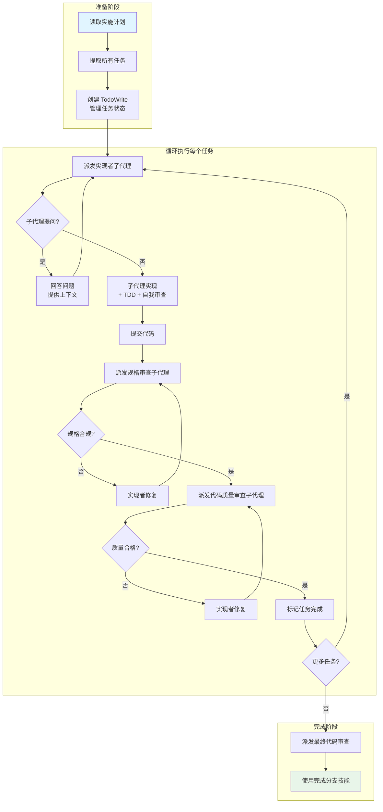

# 子代理驱动开发

## 学完你能做什么

- 利用子代理实现多个独立任务的快速迭代开发
- 执行两阶段自动审查（规格合规性 + 代码质量）
- 避免子代理之间的上下文污染和冲突
- 自动化 TDD 流程和代码审查检查点
- 理解何时使用子代理驱动开发 vs 执行计划（并行会话）

## 你现在的困境

**AI 代理处理多个任务时容易混乱**

你有没有遇到这种情况？你对 AI 说"帮我实现这 5 个功能"，它开始处理第一个任务，但处理到第三个时，已经忘了第一个任务的上下文，导致代码不一致或重复。

常见问题：
- ❌ 一个 AI 会话处理多个任务，上下文混淆
- ❌ 任务完成后缺少审查环节，质量无法保证
- ❌ 需要在多个会话之间切换，效率低下
- ❌ 代码审查依赖人工介入，流程不连贯

这些问题会导致：开发周期长、代码质量不稳定、人工审查负担重。

**核心问题**：缺少系统化的任务派发和自动审查机制。

::: info 什么是子代理驱动开发？

子代理驱动开发是一种高级工作流，通过为每个独立任务派发新的子代理，并在每个任务完成后执行两阶段自动审查，实现快速迭代和高质量交付。

核心原则：
1. **每个任务独立子代理**：避免上下文污染
2. **两阶段审查**：规格合规性审查 → 代码质量审查
3. **自动检查点**：每个任务完成前必须通过审查
4. **相同会话**：控制器保持在主会话，无缝衔接

::

## 什么时候用这一招

子代理驱动开发适用于以下场景：

| 条件 | 说明 |
| ---- | ---- |
| **有实施计划** | 已经通过 `writing-plans` 技能创建了详细的实施计划 |
| **任务大多独立** | 计划中的任务之间依赖关系不强，可以独立完成 |
| **留在当前会话** | 希望在一个会话中完成所有任务，不需要切换会话 |

::: tip vs. 执行计划（并行会话）

| 维度 | 子代理驱动开发 | 执行计划（并行会话） |
| ---- | ------------ | ------------------ |
| **会话切换** | 无（同一会话） | 需要切换到独立会话 |
| **上下文** | 控制器管理 | 每个任务独立上下文 |
| **审查** | 自动两阶段审查 | 手动或单阶段审查 |
| **迭代速度** | 快（无等待） | 中等（需要切换） |
| **适用场景** | 独立任务，快速迭代 | 大量任务，批量处理 |

如果任务数量很多（> 10）或需要批量处理，考虑使用 **[executing-plans](../../core-workflows/planning-workflow/)** 在独立会话中执行。
::

::: warning 必备前置条件

使用子代理驱动开发前，你必须：
1. ✅ 已创建实施计划（通过 `writing-plans` 技能）
2. ✅ 已设置隔离工作空间（通过 `using-git-worktrees` 技能）
3. ✅ 已配置 Git 工作流（分支、提交约定）

::

## 核心思路

子代理驱动开发的核心流程分为准备阶段、任务执行阶段和完成阶段：



### 两阶段审查机制

**阶段 1：规格合规性审查**

- 审查内容：代码是否完全符合规格说明
- 检查项：
  - 是否完成了所有要求的功能
  - 是否添加了未要求的功能（过度实现）
  - 是否遗漏了规格中的细节

**阶段 2：代码质量审查**

- 审查内容：代码实现质量
- 检查项：
  - 代码结构和可读性
  - 测试覆盖率和质量
  - 潜在的 bug 或性能问题
  - 最佳实践遵循情况

::: tip 为什么需要两阶段审查？

单阶段审查容易遗漏问题：
- 只看代码质量：可能发现不了规格偏差（过度或不足实现）
- 只看规格合规：可能发现不了代码质量问题

两阶段确保：
- 先确认"做对"（规格合规）
- 再确认"做好"（代码质量）
::

## 跟我做

### 第 1 步：准备工作 - 读取实施计划

**为什么**
一次性提取所有任务和上下文，避免子代理重复读取文件。

**操作示例**

假设你有以下实施计划（`docs/plans/feature-plan.md`）：

```markdown
## 功能计划：用户评论系统

### 任务列表

#### 任务 1：Hook 安装脚本
- 创建安装 hook 的 CLI 命令
- 支持用户级别和系统级别安装
- 测试覆盖：5/5

#### 任务 2：恢复模式
- 添加 verify 模式（检查安装状态）
- 添加 repair 模式（修复损坏的配置）
- 测试覆盖：8/8

#### 任务 3：配置文件管理
- 读取 ~/.config/superpowers/config.json
- 验证配置格式
- 测试覆盖：6/6
```

**在主会话中执行**：

```
你：我将使用子代理驱动开发执行这个计划。

[读取计划文件：docs/plans/feature-plan.md]
[提取所有 3 个任务的完整文本和上下文]
[使用 TodoWrite 创建任务列表]
```

**你应该看到**：所有任务已提取，TodoWrite 已创建。

### 第 2 步：处理任务 1 - 派发实现者子代理

**为什么**
为每个任务派发新的子代理，避免上下文污染。

**操作示例**

```
任务 1：Hook 安装脚本

[获取任务 1 的完整文本和上下文]
[派发实现者子代理，提供完整的任务文本 + 上下文]
```

**派发子代理的提示格式**（来自源码 `implementer-prompt.md`）：

```
@subagent

你是实现者子代理。你的任务是：

【任务描述】
创建安装 hook 的 CLI 命令
- 支持 user 级别安装：~/.config/superpowers/hooks/
- 支持 system 级别安装：/etc/superpowers/hooks/

【上下文】
- 项目位于：/path/to/project
- 现有的 CLI 命令结构：lib/commands/
- Hook 存放位置：~/.config/superpowers/hooks/

【要求】
- 严格遵循 TDD（RED-GREEN-REFACTOR）
- 每次提交前进行自我审查
- 完成后报告测试结果
```

**你应该看到**：子代理开始工作，可能提问。

### 第 3 步：回答子代理的问题

**为什么**
子代理在开始实现前可能会提问，提供明确的上下文可以减少返工。

**操作示例**

```
实现者子代理："在开始之前 - hook 应该安装在用户级别还是系统级别？"

你："用户级别（~/.config/superpowers/hooks/）"
```

**应该注意**：
- 回答要清晰完整
- 提供额外的上下文（如果子代理需要）
- 不要着急让子代理开始实现，先解决所有疑问

### 第 4 步：子代理实现 + TDD + 自我审查

**为什么**
子代理会自动遵循 TDD 流程，并在提交前进行自我审查。

**操作示例**

```
实现者子代理：
"明白了。现在开始实现..."

[一段时间后]

实现者子代理：
- ✅ 实现了 install-hook 命令
- ✅ 添加了 5 个测试，全部通过
- ✅ 自我审查：发现缺少 --force 标志，已添加
- ✅ 已提交：abc123
```

**你应该看到**：子代理报告实现完成、测试通过、已提交。

::: warning 检查点
子代理必须报告：
- [ ] 实现完成
- [ ] 测试通过
- [ ] 自我审查结果
- [ ] Git commit SHA

如果任何一项缺失，要求子代理补充。
::

### 第 5 步：派发规格审查子代理

**为什么**
验证代码是否完全符合规格说明，防止过度或不足实现。

**操作示例**

```
[获取 Git commit SHA：abc123]
[派发规格审查子代理，提供 commit SHA 和规格说明]
```

**派发规格审查的提示格式**（来自源码 `spec-reviewer-prompt.md`）：

```
@subagent

你是规格审查子代理。你的任务是审查以下实现是否符合规格。

【规格说明】
创建安装 hook 的 CLI 命令
- 支持 user 级别安装：~/.config/superpowers/hooks/
- 支持 system 级别安装：/etc/superpowers/hooks/

【Git Commit】
SHA: abc123
仓库：/path/to/project

【审查项】
- 是否完成了所有要求的功能？
- 是否添加了未要求的功能？
- 是否遗漏了任何规格细节？

请给出详细的审查报告。
```

**你应该看到**：规格审查子代理给出审查结果。

**示例审查结果（通过）**：

```
规格审查子代理：
✅ 规格合规
- 实现了用户级别安装
- 实现了系统级别安装
- 没有添加额外功能
- 没有遗漏规格细节
```

**示例审查结果（不通过）**：

```
规格审查子代理：
❌ 发现问题：
- 缺失：进度报告功能（规格要求"每处理 100 个项目报告一次"）
- 额外：添加了 --json 标志（规格中未要求）
```

### 第 6 步：处理规格审查问题

**为什么**
如果规格审查不通过，必须让实现者子代理修复问题。

**操作示例**

**如果审查不通过**：

```
你：[转达审查结果给实现者子代理]

实现者子代理：
"明白了。我现在修复问题..."
[移除 --json 标志]
[添加进度报告功能]
[重新运行测试]
[重新提交：def456]
```

**如果审查通过**：
直接进入下一步。

::: warning 检查点
实现者子代理修复后，必须：
1. 重新派发规格审查子代理
2. 确认审查通过
3. 才能进入代码质量审查阶段

不要跳过重新审查！
::

### 第 7 步：派发代码质量审查子代理

**为什么**
验证代码实现质量，包括结构、测试覆盖、潜在问题等。

**操作示例**

```
[获取最新的 Git commit SHA：def456]
[派发代码质量审查子代理，提供 commit SHA]
```

**派发代码质量审查的提示格式**（来自源码 `code-quality-reviewer-prompt.md`）：

```
@subagent

你是代码质量审查子代理。你的任务是审查以下实现的代码质量。

【Git Commit】
SHA: def456
仓库：/path/to/project

【审查项】
- 代码结构和可读性
- 测试覆盖率和质量
- 潜在的 bug 或性能问题
- 最佳实践遵循情况
- 命名和注释

请给出详细的审查报告，标注问题的重要性（Important/Minor）。
```

**你应该看到**：代码质量审查子代理给出审查结果。

**示例审查结果（通过）**：

```
代码质量审查子代理：
优势：
- 良好的测试覆盖率（5/5）
- 代码清晰，结构合理
- 有意义的变量命名

问题：
无

结果：✅ 批准
```

**示例审查结果（不通过）**：

```
代码质量审查子代理：
优势：
- 测试覆盖率良好
- 代码逻辑正确

问题（重要）：
- Magic Number：进度间隔写死为 100，应该提取为常量
- 缺少错误处理：如果目录不存在，会直接崩溃

结果：❌ 需要修复
```

### 第 8 步：处理代码质量问题

**为什么**
代码质量审查发现问题后，必须让实现者子代理修复。

**操作示例**

**如果审查不通过**：

```
你：[转达审查结果给实现者子代理]

实现者子代理：
"明白了。我现在修复问题..."
[提取 PROGRESS_INTERVAL 常量]
[添加目录检查和错误处理]
[重新运行测试]
[重新提交：ghi789]
```

**如果审查通过**：
标记任务完成。

**重新审查**：

```
[重新派发代码质量审查子代理]
[确认审查通过]
[标记任务完成]
```

::: warning 检查点
实现者子代理修复后，必须：
1. 重新派发代码质量审查子代理
2. 确认审查通过
3. 才能标记任务完成

不要跳过重新审查！
::

### 第 9 步：标记任务完成

**为什么**
在 TodoWrite 中标记任务完成，继续下一个任务。

**操作示例**

```
你：[使用 TodoWrite 标记任务 1 完成]
```

**你应该看到**：TodoWrite 显示任务 1 已完成。

### 第 10 步：处理剩余任务（重复流程）

**为什么**
对每个任务重复相同的流程，直到所有任务完成。

**操作示例**

```
任务 2：恢复模式

[获取任务 2 的完整文本和上下文]
[派发实现者子代理]
...
[两阶段审查]
...
[标记任务完成]

任务 3：配置文件管理

[获取任务 3 的完整文本和上下文]
[派发实现者子代理]
...
[两阶段审查]
...
[标记任务完成]
```

**你应该看到**：所有任务都通过审查并完成。

### 第 11 步：最终代码审查

**为什么**
所有任务完成后，对整个实现进行最终审查，确保整体质量。

**操作示例**

```
[所有任务完成后]
[派发最终代码审查子代理，审查整个实现]
```

**示例结果**：

```
最终代码审查子代理：
所有需求已满足
- 任务 1：✅ 完成
- 任务 2：✅ 完成
- 任务 3：✅ 完成

整体质量：
- 测试覆盖率：19/19
- 代码结构清晰
- 无重大问题

结果：✅ 可以合并
```

### 第 12 步：完成开发分支

**为什么**
使用 `finishing-a-development-branch` 技能完成开发分支的清理和合并。

**操作示例**

```
你：[使用 finishing-a-development-branch 技能]

系统呈现选项：
1. 合并到主分支
2. 创建 Pull Request
3. 保留分支供进一步工作
4. 丢弃分支
```

**你应该看到**：可以选择合并或创建 PR 的选项。

## 检查点 ✅

**验证子代理驱动开发流程是否完整**

- [ ] 已读取并提取所有任务和上下文
- [ ] 已创建 TodoWrite 管理任务状态
- [ ] 每个任务都派发了新的实现者子代理
- [ ] 实现者子代理遵循了 TDD 流程
- [ ] 实现者子代理进行了自我审查
- [ ] 每个任务都完成了两阶段审查（规格 + 代码质量）
- [ ] 规格审查不通过时，实现了修复和重新审查
- [ ] 代码质量审查不通过时，实现了修复和重新审查
- [ ] 所有任务都在 TodoWrite 中标记完成
- [ ] 最终代码审查通过
- [ ] 使用了 finishing-a-development-branch 技能完成分支

如果以上任何一项不符合，说明流程不完整，需要补充。

## 踩坑提醒

### ❌ 踩坑 1：让子代理读取计划文件

**症状**：控制器告诉子代理"去读取计划文件，然后完成任务"。

**问题**：
- 子代理读取文件消耗 token
- 控制器已经提取了任务文本，重复工作
- 子代理可能提取到错误的上下文

**解决方法**：
- 控制器一次性提取所有任务和上下文
- 派发子代理时直接提供完整的任务文本和上下文
- 不要让子代理读取任何文件

### ❌ 踩坑 2：跳过审查阶段

**症状**：为了"节省时间"，跳过规格审查或代码质量审查。

**问题**：
- 规格审查不通过：可能过度实现或不足实现
- 代码质量审查不通过：可能存在 bug 或性能问题
- 问题后期修复成本更高

**解决方法**：
- 两阶段审查是强制要求
- 即使你认为"没问题"，也要执行审查
- 审查发现的问题必须修复

### ❌ 踩坑 3：接受"差不多就行"

**症状**：规格审查发现小问题，但你觉得"可以接受"。

**问题**：
- 小问题会累积成大问题
- 违反了规格合规性原则
- 后期维护成本高

**解决方法**：
- 规格审查发现问题 = 不通过
- 必须让实现者子代理修复
- 重新审查直到通过

### ❌ 踩坑 4：跳过重新审查

**症状**：实现者子代理修复问题后，你直接标记任务完成，没有重新审查。

**问题**：
- 修复可能引入新问题
- 无法确认修复是否有效
- 违反了审查循环原则

**解决方法**：
- 实现者修复 → 重新审查 → 确认通过 → 标记完成
- 不要跳过重新审查

### ❌ 踩坑 5：错误的审查顺序

**症状**：先进行代码质量审查，再进行规格审查。

**问题**：
- 如果规格不通过，代码质量审查白费
- 逻辑顺序错误

**解决方法**：
- 必须先进行规格合规性审查
- 确认通过后，再进行代码质量审查
- 这个顺序不能颠倒

### ❌ 踩坑 6：派发多个实现者子代理并行工作

**症状**：为了"加快速度"，同时派发多个实现者子代理。

**问题**：
- 子代理可能修改相同的文件，导致冲突
- 上下文混乱
- 审查流程无法正确执行

**解决方法**：
- 每次只派发一个实现者子代理
- 完成两阶段审查后，再派发下一个
- 顺序执行，不要并行

### ❌ 踩坑 7：忽略子代理的问题

**症状**：子代理提问，你觉得"太麻烦"，直接让它们开始实现。

**问题**：
- 子代理可能基于错误的假设实现
- 后期返工成本高
- 降低实现质量

**解决方法**：
- 子代理提问时，回答清楚完整
- 提供必要的上下文
- 不要着急让子代理开始实现

## Red Flags - 必须避免

以下行为会导致子代理驱动开发失效：

**绝对禁止**：
- ❌ 在没有实施计划的情况下开始
- ❌ 跳过规格审查或代码质量审查
- ❌ 接受"差不多就行"的审查结果
- ❌ 跳过重新审查（修复后必须重新审查）
- ❌ 并行派发多个实现者子代理
- ❌ 让子代理读取计划文件（控制器应提供完整文本）
- ❌ 忽略子代理的问题（回答后再让它们开始）
- ❌ 颠倒审查顺序（必须先规格，后代码质量）
- ❌ 手动修复子代理的问题（应让同一个子代理修复）
- ❌ 在主分支或 master 分支上开始实现（除非用户明确同意）

**如果子代理失败**：
- 不要尝试手动修复（会污染上下文）
- 派发修复子代理，提供具体指令
- 如果无法修复，考虑放弃任务

## 子代理驱动开发 vs. 手动执行

| 维度 | 子代理驱动开发 | 手动执行 |
| ---- | ------------ | -------- |
| **TDD 遵循** | 自动（子代理自然遵循） | 依赖人工监督 |
| **上下文污染** | 无（每个任务独立） | 高（多个任务混在一起） |
| **并行安全** | 安全（顺序执行） | 不安全（容易冲突） |
| **提问时机** | 开始前和工作中 | 仅开始前（很少） |
| **审查流程** | 自动两阶段审查 | 手动或无审查 |
| **迭代速度** | 快（无人工干预） | 慢（依赖人工审查） |

## 子代理驱动开发 vs. 执行计划

| 维度 | 子代理驱动开发 | 执行计划（并行会话） |
| ---- | ------------ | ------------------ |
| **会话切换** | 无（同一会话） | 需要（切换到独立会话） |
| **上下文管理** | 控制器管理 | 每个任务独立上下文 |
| **进度可见性** | 实时（在主会话中） | 需要查询 |
| **审查** | 自动两阶段 | 手动或单阶段 |
| **迭代速度** | 快（无等待） | 中等（需要切换） |
| **适用场景** | 独立任务，快速迭代 | 大量任务，批量处理 |
| **任务数量** | 少量（< 10） | 大量（> 10） |

## 本课小结

子代理驱动开发通过以下机制实现高质量、快速迭代：

1. **任务隔离**：每个任务派发新的子代理，避免上下文污染
2. **两阶段审查**：规格合规性 → 代码质量，确保"做对"和"做好"
3. **自动检查点**：每个任务完成前必须通过审查
4. **TDD 自动化**：子代理自然遵循 TDD 流程
5. **效率优化**：控制器一次性提取所有任务，避免重复读取
6. **质量保证**：自我审查 + 两阶段外部审查，多层次验证

**记住**：子代理驱动开发适用于有实施计划、任务大多独立、希望在当前会话快速完成的场景。如果任务数量很多或需要批量处理，考虑使用 **[executing-plans](../../core-workflows/planning-workflow/)** 在独立会话中执行。

## 下一课预告

> 下一课我们学习 **[代码审查工作流](../code-review-workflow/)**。
>
> 你会学到：
> - 如何请求代码审查
> - 如何接收和处理代码审查反馈
> - 代码审查的最佳实践和常见陷阱
> - 利用代码审查提升代码质量

---

## 附录：源码参考

<details>
<summary><strong>点击展开查看源码位置</strong></summary>

> 更新时间：2026-02-01

| 功能        | 文件路径                                                                                    | 行号    |
| ----------- | ------------------------------------------------------------------------------------------- | ------- |
| 子代理驱动开发技能 | [`skills/subagent-driven-development/SKILL.md`](https://github.com/obra/superpowers/blob/main/skills/subagent-driven-development/SKILL.md) | 1-243   |
| 实现者子代理提示 | [`skills/subagent-driven-development/implementer-prompt.md`](https://github.com/obra/superpowers/blob/main/skills/subagent-driven-development/implementer-prompt.md) | -       |
| 规格审查子代理提示 | [`skills/subagent-driven-development/spec-reviewer-prompt.md`](https://github.com/obra/superpowers/blob/main/skills/subagent-driven-development/spec-reviewer-prompt.md) | -       |
| 代码质量审查子代理提示 | [`skills/subagent-driven-development/code-quality-reviewer-prompt.md`](https://github.com/obra/superpowers/blob/main/skills/subagent-driven-development/code-quality-reviewer-prompt.md) | -       |
| 工作流概述 | [`README.md`](https://github.com/obra/superpowers/blob/main/README.md) | 80-96   |

**核心原则**：
- 每个任务派发新的子代理（Fresh subagent per task）
- 两阶段审查（Two-stage review）：规格合规性（spec compliance）→ 代码质量（code quality）
- 核心公式：独立子代理 + 两阶段审查 = 高质量、快速迭代

**使用条件**：
1. 有实施计划（Have implementation plan）
2. 任务大多独立（Tasks mostly independent）
3. 留在当前会话（Stay in this session）

**流程图**：
- DOT 格式流程图（源码第 40-83 行）
- 每个任务的完整循环：实现者 → 规格审查 → 代码质量审查 → 标记完成

**提示模板**：
- `implementer-prompt.md`：派发实现者子代理
- `spec-reviewer-prompt.md`：派发规格合规性审查子代理
- `code-quality-reviewer-prompt.md`：派发代码质量审查子代理

**示例工作流**（源码第 91-165 行）：
- 任务 1：Hook 安装脚本（完整示例）
- 任务 2：恢复模式（包含问题和修复的示例）
- 展示了提问、实现、审查、修复的完整流程

**优势**（vs. 手动执行）：
- 子代理自然遵循 TDD
- 每个任务独立上下文（无混淆）
- 并发安全（子代理不干扰）
- 子代理可以提问（开始前和工作中）

**优势**（vs. 执行计划）：
- 同一会话（无切换）
- 持续进度（无等待）
- 审查检查点自动

**效率增益**：
- 无文件读取开销（控制器提供完整文本）
- 控制器精确定位所需上下文
- 子代理预先获得完整信息
- 问题在工作开始前浮现（不是工作后）

**质量门**：
- 自我审查在移交前发现问题
- 两阶段审查：规格合规性，然后代码质量
- 审查循环确保修复真正有效
- 规格合规性防止过度/不足构建
- 代码质量确保实现良好

**成本**：
- 更多子代理调用（每个任务：实现者 + 2 个审查者）
- 控制器做更多准备工作（预先提取所有任务）
- 审查循环增加迭代
- 但早期发现问题（比后期调试便宜）

**Red Flags - 绝对禁止**：
- 在未获得用户明确同意的情况下在主/master 分支上开始实现
- 跳过审查（规格合规性或代码质量）
- 带着未修复的问题继续
- 并行派发多个实现者子代理（冲突）
- 让子代理读取计划文件（改为提供完整文本）
- 跳过场景设置上下文（子代理需要理解任务位置）
- 忽略子代理问题（在允许它们继续之前先回答）
- 接受规格合规性"足够接近"（审查者发现问题 = 未完成）
- 跳过审查循环（审查者发现问题 = 实现者修复 = 再次审查）
- 让实现者自我审查替代实际审查（两者都需要）
- **在规格合规性通过 ✅ 之前开始代码质量审查**（错误顺序）
- 在任一审查有未解决问题时移动到下一个任务

**如果子代理提问**：
- 清晰完整地回答
- 如有需要，提供额外上下文
- 不要催促它们进入实现

**如果审查者发现问题**：
- 实现者（同一子代理）修复它们
- 审查者再次审查
- 重复直到批准
- 不要跳过重新审查

**如果子代理任务失败**：
- 派发修复子代理并提供具体指令
- 不要尝试手动修复（上下文污染）

**集成 - 必需的工作流技能**：
- `using-git-worktrees`：必需：开始前设置隔离工作空间
- `writing-plans`：创建此技能执行的计划
- `requesting-code-review`：审查者子代理的代码审查模板
- `finishing-a-development-branch`：所有任务完成后完成开发

**子代理应使用**：
- `test-driven-development`：子代理为每个任务遵循 TDD

**替代工作流**：
- `executing-plans`：用于并行会话而非同会话执行

</details>
