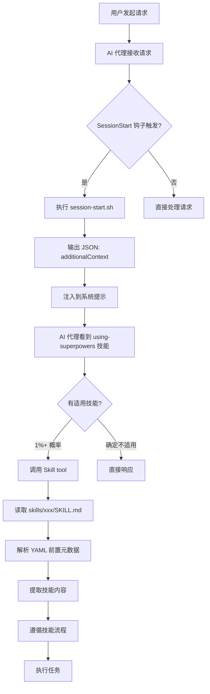
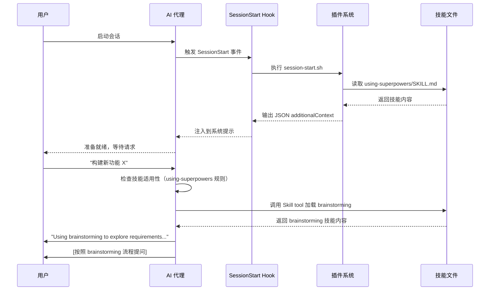

# 架构与实现原理

## 学完你能做什么

- 理解 Superpowers 的整体架构和核心组件
- 掌握多平台集成机制的实现原理
- 了解技能发现和加载的优先级机制
- 理解钩子系统如何自动化工作流引导
- 为自定义技能开发和平台扩展打好基础

## 什么时候用这一招

- 你想深入了解 Superpowers 的工作原理
- 你打算向 Superpowers 贡献代码或技能
- 你需要在自定义环境中集成 Superpowers
- 你想调试技能加载或钩子执行问题

## 核心思路

**Superpowers 的架构设计理念**：通过可组合的"技能"和自动化钩子，将软件工程最佳实践强制注入到 AI 代理的工作流中。

> **架构核心原则**：
> 1. **文件即技能**：每个技能是独立的 Markdown 文件（`SKILL.md`），包含 YAML 前置元数据和流程指导
> 2. **平台无关核心**：技能库跨平台共享，通过插件系统适配不同 AI 编码代理
> 3. **自动化引导**：通过钩子机制在会话启动时自动注入技能使用指南
> 4. **技能优先级**：支持技能覆盖（个人技能 > 项目技能 > Superpowers 技能）

## 整体架构概览

```
┌─────────────────────────────────────────────────────────────┐
│              AI 编码代理（Claude Code/OpenCode/Codex）  │
└─────────────────────┬───────────────────────────────────┘
                      │
                      ▼
         ┌────────────┴────────────┐
         │   平台适配层            │
         ├─────────────────────────┤
         │ • Claude Code Plugin  │
         │ • OpenCode Plugin     │
         │ • Codex CLI          │
         └──────────┬────────────┘
                    │
                    ▼
         ┌──────────┴────────────┐
         │   Superpowers 核心      │
         ├─────────────────────────┤
         │ • 技能库 (skills/)   │
         │ • 钩子系统 (hooks/)   │
         │ • 命令系统 (commands/)│
         │ • 代理定义 (agents/)   │
         │ • 共享工具 (lib/)     │
         └──────────────────────────┘
```

### 架构分层

| 层级         | 职责                     | 目录/文件                  |
| ------------ | ------------------------ | ------------------------- |
| **平台适配层** | 适配不同 AI 编码代理的 API | `.claude-plugin/`, `.opencode/`, `.codex/` |
| **技能层**     | 提供可组合的工作流指南     | `skills/`                  |
| **自动化层**   | 钩子和命令实现自动化引导   | `hooks/`, `commands/`      |
| **工具层**     | 提供跨平台的共享工具函数   | `lib/skills-core.js`       |

---

## 核心组件详解

### 1. 技能系统（Skills）

技能是 Superpowers 的核心，每个技能是一个独立的目录，包含 `SKILL.md` 文件。

#### 技能文件结构

```
skills/
├── brainstorming/
│   └── SKILL.md
├── test-driven-development/
│   └── SKILL.md
└── using-superpowers/
    └── SKILL.md
```

#### SKILL.md 格式

每个 `SKILL.md` 文件遵循标准格式：

```yaml
---
name: skill-name
description: Use when [condition] - [what it does]
---

[技能内容：流程图、清单、规则、Red Flags 等]
```

**必需字段**（来自 `lib/skills-core.js` 提取逻辑）：

| 字段        | 类型   | 用途                           | 示例                          |
| ----------- | ------ | ------------------------------ | ----------------------------- |
| `name`      | string | 技能唯一标识（kebab-case）     | `test-driven-development`        |
| `description` | string | 触发条件描述（用于技能发现）   | `Use when implementing any feature or fixing before writing code` |

#### 技能分类

Superpowers 将 14 个技能分为 4 类：

| 类别       | 技能数量 | 技能列表                                                             |
| ---------- | --------- | -------------------------------------------------------------------- |
| **核心技能**   | 1         | `using-superpowers`                                                    |
| **测试技能**   | 2         | `test-driven-development`, `verification-before-completion`                     |
| **调试技能**   | 2         | `systematic-debugging`, `root-cause-tracing`（子技术）                     |
| **协作技能**   | 7         | `brainstorming`, `writing-plans`, `subagent-driven-development`, `using-git-worktrees`, `requesting-code-review`, `receiving-code-review`, `finishing-a-development-branch` |
| **其他技能**   | 2         | `executing-plans`, `dispatching-parallel-agents`, `writing-skills`（元技能）    |

::: tip 技能调用优先级

当多个技能可能适用时，遵循以下顺序（来自 `using-superpowers` 技能）：

1. **流程技能优先**（brainstorming、debugging）——决定如何处理任务
2. **实现技能其次**（TDD、git-worktrees）——指导具体执行

"让我们构建 X" → 先 brainstorming，再实现技能
"修复这个 bug" → 先 systematic-debugging，再实现技能
:::

---

### 2. 钩子系统（Hooks）

钩子系统用于在特定事件发生时自动执行逻辑，目前仅实现 `SessionStart` 钩子。

#### hooks.json 配置

```json
{
  "hooks": {
    "SessionStart": [
      {
        "matcher": "startup|resume|clear|compact",
        "hooks": [
          {
            "type": "command",
            "command": "${CLAUDE_PLUGIN_ROOT}/hooks/session-start.sh"
          }
        ]
      }
    ]
  }
}
```

**字段说明**：
- `SessionStart`：钩子事件名称
- `matcher`：匹配模式（正则表达式），`startup|resume|clear|compact` 表示会话启动时触发
- `type: "command"`：钩子类型为执行命令
- `command`：要执行的 Shell 脚本路径，`${CLAUDE_PLUGIN_ROOT}` 是环境变量，指向插件根目录

#### session-start.sh 执行流程

`hooks/session-start.sh` 脚本（第 6-52 行）实现以下逻辑：

```bash
# 1. 确定插件根目录
# 2. 检查旧版技能目录（兼容性警告）
# 3. 读取 using-superpowers 技能内容
# 4. JSON 转义（处理特殊字符）
# 5. 输出 JSON 格式的钩子输出
```

**关键点**：
- 使用 `cat` 直接读取 `SKILL.md` 内容，不经过任何解析
- `escape_for_json` 函数（第 21-37 行）处理 JSON 特殊字符（`"`, `\n`, `\t`, `\r`）
- 输出 `hookSpecificOutput` JSON 格式，包含 `additionalContext` 字段
- `additionalContext` 被注入到 AI 代理的系统提示中

---

### 3. 多平台集成机制

Superpowers 通过插件系统适配三大平台：Claude Code、OpenCode、Codex。

#### 3.1 Claude Code 集成

**组件**：
- 插件定义：`.claude-plugin/plugin.json`
- 钩子配置：`hooks/hooks.json`
- SessionStart 脚本：`hooks/session-start.sh`
- 技能目录：`skills/`
- 命令定义：`commands/*.md`
- 代理定义：`agents/*.md`

**工作流程**：

```
用户启动 Claude Code
    ↓
Claude Code 加载插件（plugin.json）
    ↓
SessionStart 事件触发（匹配 "startup|resume|clear|compact"）
    ↓
执行 hooks/session-start.sh
    ↓
输出 JSON：{ "hookSpecificOutput": { "additionalContext": "..." } }
    ↓
additionalContext 注入到系统提示
    ↓
AI 代理接收到 "You have superpowers" + using-superpowers 技能内容
    ↓
代理开始检查技能适用性
```

**plugin.json 元数据**：

```json
{
  "name": "superpowers",
  "description": "Core skills library for Claude Code: TDD, debugging, collaboration patterns...",
  "version": "4.1.1",
  "author": { "name": "Jesse Vincent", "email": "jesse@fsck.com" },
  "homepage": "https://github.com/obra/superpowers",
  "repository": "https://github.com/obra/superpowers",
  "license": "MIT",
  "keywords": ["skills", "tdd", "debugging", "collaboration", "best-practices", "workflows"]
}
```

#### 3.2 OpenCode 集成

**组件**：
- 插件文件：`.opencode/plugins/superpowers.js`
- 技能符号链接：`~/.config/opencode/skills/superpowers` → `~/.config/opencode/superpowers/skills/`

**工作流程**：

```
用户启动 OpenCode
    ↓
加载 .opencode/plugins/superpowers.js
    ↓
注册 experimental.chat.system.transform hook
    ↓
每次对话开始时触发 transform
    ↓
读取 skills/using-superpowers/SKILL.md
    ↓
提取并去除 YAML frontmatter（第 16-34 行）
    ↓
生成 bootstrap 内容（第 56-84 行）
    ↓
注入到 system prompt（第 88-93 行）
    ↓
OpenCode 原生 skill tool 发现技能
```

**superpowers.js 关键代码**（第 88-93 行）：

```javascript
return {
  'experimental.chat.system.transform': async (_input, output) => {
    const bootstrap = getBootstrapContent();
    if (bootstrap) {
      (output.system ||= []).push(bootstrap);
    }
  }
};
```

**Bootstrap 内容结构**（第 75-83 行）：

```javascript
return `<EXTREMELY_IMPORTANT>
You have superpowers.

**IMPORTANT: The using-superpowers skill content is included below. It is ALREADY LOADED - you are currently following it. Do NOT use skill tool to load "using-superpowers" again - that would be redundant.**

${content}

${toolMapping}
</EXTREMELY_IMPORTANT>`;
```

**工具映射**（第 64-73 行）：

当技能引用 Claude Code 特有工具时，OpenCode 用户提供对应映射：

| Claude Code 工具 | OpenCode 对应工具          |
| ---------------- | ------------------------- |
| `TodoWrite`       | `update_plan`             |
| `Task`（子代理）  | OpenCode 的 @mention 系统    |
| `Skill`          | OpenCode 原生 `skill` 工具 |
| `Read`, `Write`, `Edit`, `Bash` | OpenCode 原生工具 |

#### 3.3 Codex 集成

**组件**：
- CLI 脚本：`.codex/superpowers-codex`
- 共享核心模块：`lib/skills-core.js`
- Bootstrap 文件：`.codex/superpowers-bootstrap.md`

**工作流程**（基于 PRD 推断）：

```
用户启动 Codex
    ↓
加载 .codex/superpowers-codex
    ↓
执行 CLI 命令：
    - superpowers-codex find-skills → JSON 输出技能列表
    - superpowers-codex use-skill → 加载指定技能
    - superpowers-codex bootstrap → 注入完整上下文
    ↓
使用 lib/skills-core.js 共享功能
    ↓
技能通过 CLI 参数或交互式菜单选择
```

**共享核心模块函数**（`lib/skills-core.js`）：

| 函数名                     | 功能                                     | 行号范围 |
| -------------------------- | ---------------------------------------- | -------- |
| `extractFrontmatter()`      | 提取 SKILL.md 的 YAML 前置元数据        | 16-52    |
| `findSkillsInDir()`       | 递归查找目录下所有 SKILL.md 文件          | 62-97    |
| `resolveSkillPath()`       | 解析技能名称到文件路径，处理技能覆盖       | 108-140   |
| `checkForUpdates()`        | 检查 Git 仓库是否有更新（3 秒超时）      | 148-170   |
| `stripFrontmatter()`       | 去除 YAML 前置元数据，返回纯内容         | 178-200   |

---

### 4. 技能发现与加载机制

#### 4.1 技能发现优先级（OpenCode）

OpenCode 采用三级发现机制（来自 `superpowers.js` 第 52-53 行和 `README.opencode.md:231`）：

```
1. 项目技能（.opencode/skills/）- 最高优先级
2. 个人技能（~/.config/opencode/skills/）
3. Superpowers 技能（~/.config/opencode/skills/superpowers/）
```

**实现原理**（`lib/skills-core.js` 第 108-140 行）：

```javascript
function resolveSkillPath(skillName, superpowersDir, personalDir) {
    // 1. 去除 superpowers: 前缀（如果存在）
    const forceSuperpowers = skillName.startsWith('superpowers:');
    const actualSkillName = forceSuperpowers ? skillName.replace(/^superpowers:/, '') : skillName;

    // 2. 优先尝试个人技能（除非明确指定 superpowers:）
    if (!forceSuperpowers && personalDir) {
        const personalSkillFile = path.join(personalDir, actualSkillName, 'SKILL.md');
        if (fs.existsSync(personalSkillFile)) {
            return { skillFile: personalSkillFile, sourceType: 'personal' };
        }
    }

    // 3. 回退到 Superpowers 技能
    if (superpowersDir) {
        const superpowersSkillFile = path.join(superpowersDir, actualSkillName, 'SKILL.md');
        if (fs.existsSync(superpowersSkillFile)) {
            return { skillFile: superpowersSkillFile, sourceType: 'superpowers' };
        }
    }

    return null; // 技能未找到
}
```

**示例场景**：

| 技能名称             | 解析结果                   | 实际加载文件                          |
| -------------------- | -------------------------- | ------------------------------------- |
| `test-driven-development` | 无前缀 → 优先个人技能       | `~/.config/opencode/skills/test-driven-development/SKILL.md`（如果存在） |
| `superpowers:tdd`      | 强制 Superpowers → 跳过优先级 | `~/.config/opencode/skills/superpowers/tdd/SKILL.md` |
| `my-custom-skill`       | 个人技能                   | `~/.config/opencode/skills/my-custom-skill/SKILL.md` |

#### 4.2 技能递归查找

`findSkillsInDir()` 函数（第 62-97 行）实现递归技能发现：

```javascript
function findSkillsInDir(dir, sourceType, maxDepth = 3) {
    const skills = [];

    function recurse(currentDir, depth) {
        if (depth > maxDepth) return; // 防止无限递归

        const entries = fs.readdirSync(currentDir, { withFileTypes: true });

        for (const entry of entries) {
            const fullPath = path.join(currentDir, entry.name);

            if (entry.isDirectory()) {
                // 检查目录下是否有 SKILL.md
                const skillFile = path.join(fullPath, 'SKILL.md');
                if (fs.existsSync(skillFile)) {
                    const { name, description } = extractFrontmatter(skillFile);
                    skills.push({
                        path: fullPath,
                        skillFile: skillFile,
                        name: name || entry.name,
                        description: description || '',
                        sourceType: sourceType
                    });
                }

                // 继续递归子目录
                recurse(fullPath, depth + 1);
            }
        }
    }

    recurse(dir, 0);
    return skills;
}
```

**参数说明**：
- `dir`：要搜索的根目录
- `sourceType`：技能来源类型（`'personal'` 或 `'superpowers'`）
- `maxDepth`：最大递归深度（默认 3 层）

---

### 5. 命令系统（Slash Commands）

斜杠命令提供快速访问核心技能的快捷方式。

#### 命令定义

每个命令是一个 Markdown 文件，位于 `commands/` 目录：

| 命令文件          | 用途                           | 技能依赖                      |
| ----------------- | ------------------------------ | --------------------------- |
| `brainstorm.md`    | 交互式设计细化                  | `brainstorming` 技能          |
| `write-plan.md`    | 创建实施计划                    | `writing-plans` 技能          |
| `execute-plan.md`  | 批量执行计划                    | `executing-plans` 技能        |

#### brainstorm.md 示例（第 1-7 行）：

```yaml
---
description: "You MUST use this before any creative work - creating features, building components, adding functionality, or modifying behavior. Explores requirements and design before implementation."
disable-model-invocation: true
---

Invoke superpowers:brainstorming skill and follow it exactly as presented to you
```

**字段说明**：
- `description`：命令描述，显示在 `/help` 输出中
- `disable-model-invocation: true`：禁止模型在执行此命令时调用工具（防止死循环）

---

### 6. 代理定义系统（Agents）

代理定义文件（`agents/*.md`）为特定任务提供专业化 AI 代理的角色设定。

#### code-reviewer.md 示例

**YAML 前置元数据**（第 1-6 行）：

```yaml
---
name: code-reviewer
description: |
  Use this agent when a major project step has been completed and needs to be reviewed against original plan and coding standards.
model: inherit
---
```

**代理角色设定**（第 8-48 行）：

代理作为"高级代码审查者"，负责：

1. **计划一致性分析**：对比实现与原始计划，识别偏差
2. **代码质量评估**：检查错误处理、类型安全、测试覆盖、安全性
3. **架构和设计审查**：确保符合 SOLID 原则和模式
4. **文档和标准**：验证注释、文档和编码规范遵循
5. **问题识别和建议**：按严重程度分类问题（Critical/Important/Suggestions）
6. **通信协议**：与编码代理的交互规范

**使用场景**（第 4 行 `<example>` 标签）：

```
用户："I've finished implementing user authentication system as outlined in step 3 of our plan"
代理："Great work! Now let me use code-reviewer agent to review the implementation against our plan and coding standards"
```

---

## 数据流向

### 完整工作流数据流

以下是从用户输入到技能调用的完整数据流：



### 技能加载序列



---

## 技术决策与权衡

### 为什么选择文件系统作为技能存储？

**优势**：
- ✅ **简单直观**：技能是 Markdown 文件，易于阅读和编辑
- ✅ **版本控制友好**：可以直接用 Git 管理技能变更
- ✅ **零依赖**：不需要数据库或存储服务
- ✅ **跨平台兼容**：任何能访问文件系统的 AI 代理都可以使用

**劣势**：
- ⚠️ **无索引**：每次需要遍历目录查找技能（通过递归优化）
- ⚠️ **无热更新**：需要重启会话才能加载新技能（某些平台）

### 为什么使用 YAML 前置元数据？

**优势**：
- ✅ **标准化格式**：所有技能遵循统一结构
- ✅ **易于解析**：可以用简单的正则表达式提取
- ✅ **工具友好**：IDE 和编辑器可以高亮和验证

**实现示例**（`lib/skills-core.js` 第 32-44 行）：

```javascript
for (const line of lines) {
    if (line.trim() === '---') {
        if (inFrontmatter) break;
        inFrontmatter = true;
        continue;
    }

    if (inFrontmatter) {
        const match = line.match(/^(\w+):\s*(.*)$/);
        if (match) {
            const [, key, value] = match;
            switch (key) {
                case 'name':
                    name = value.trim();
                    break;
                case 'description':
                    description = value.trim();
                    break;
            }
        }
    }
}
```

### 为什么每个平台需要单独的适配层？

**原因**：
1. **API 差异**：不同平台的插件系统、钩子机制、工具调用方式不同
2. **部署路径不同**：Claude Code（插件市场）、OpenCode（插件目录）、Codex（CLI）
3. **技能发现机制不同**：Claude Code（Skill tool）、OpenCode（符号链接 + 原生 skill）、Codex（CLI 命令）

**设计目标**：
- ✅ **核心技能库跨平台共享**：`skills/` 目录所有平台共用
- ✅ **最小化适配层代码**：每个平台适配器仅处理平台特定逻辑
- ✅ **统一体验**：用户在不同平台使用技能时体验一致

---

## 扩展 Superpowers

### 添加自定义技能

按照 `writing-skills` 技能的指南创建新技能：

1. 在 `skills/` 目录下创建子目录
2. 添加 `SKILL.md` 文件，包含 YAML 前置元数据
3. 编写技能内容（流程图、清单、规则等）
4. 测试技能（使用子代理验证）
5. 提交到 Git（如果是 Superpowers 官方技能）

**SKILL.md 模板**：

```yaml
---
name: your-skill-name
description: Use when [condition] - [what it does]
---

[技能内容]
```

### 集成到新平台

如果要将 Superpowers 集成到新的 AI 编码代理平台：

1. **实现平台适配器**：
   - 创建插件入口文件（如 `.newplatform/plugin.js`）
   - 实现 SessionStart 钩子（或等效机制）
   - 处理 `using-superpowers` 技能注入

2. **适配技能发现**：
   - 实现技能查找逻辑（复用或参考 `lib/skills-core.js`）
   - 处理技能优先级和覆盖机制

3. **适配工具调用**：
   - 如果平台工具与 Claude Code 不同，提供映射表
   - 更新 `using-superpowers` 技能的工具映射说明

---

## 常见问题

### Q1: 为什么技能没有自动加载？

**可能原因**：
1. **钩子未触发**：检查 SessionStart 事件是否被正确配置
2. **路径错误**：确认 `CLAUDE_PLUGIN_ROOT` 环境变量指向正确目录
3. **权限问题**：检查 `session-start.sh` 是否有执行权限（`chmod +x`）

**调试方法**：
- 在 `session-start.sh` 中添加 `echo "Debug: $(date)" > /tmp/superpowers-debug.log`
- 检查日志文件是否生成

### Q2: 个人技能为什么没有覆盖 Superpowers 技能？

**检查清单**：
1. 确认个人技能路径正确（OpenCode：`~/.config/opencode/skills/`）
2. 确认技能目录结构正确（`my-skill/SKILL.md`）
3. 确认 YAML 前置元数据中的 `name` 字段与技能目录名匹配
4. 确认没有使用 `superpowers:` 前缀（会强制使用 Superpowers 技能）

### Q3: 如何调试技能加载过程？

**方法 1：查看日志**
- Claude Code：检查会话开始时的系统提示
- OpenCode：检查 Bootstrap 内容是否注入到 system prompt

**方法 2：手动测试技能加载**
```bash
# 测试技能发现（Codex）
superpowers-codex find-skills

# 测试技能路径解析（Node.js）
node -e "..."
```

---

## 本课小结

Superpowers 的架构设计围绕**可组合的技能**和**自动化钩子**展开：

- **技能层**：14 个标准技能分为核心、测试、调试、协作、元技能
- **钩子系统**：SessionStart 钩子自动注入 `using-superpowers` 技能内容
- **多平台适配**：通过插件层适配 Claude Code、OpenCode、Codex，核心技能库共享
- **技能发现**：支持三级优先级（项目 > 个人 > Superpowers），通过递归查找实现
- **共享工具库**：`lib/skills-core.js` 提供跨平台的技能解析和路径解析函数

理解这些原理，你可以：
- 高效调试技能加载问题
- 创建符合规范的自定义技能
- 将 Superpowers 集成到新平台
- 参与项目贡献

---

## 附录：源码参考

<details>
<summary><strong>点击展开查看源码位置</strong></summary>

> 更新时间：2026-02-01

| 组件         | 文件路径                                                                                    | 行号范围    |
| ------------ | ------------------------------------------------------------------------------------------- | ----------- |
| 插件元数据     | [`source/obra/superpowers/.claude-plugin/plugin.json`](https://github.com/obra/superpowers/blob/main/.claude-plugin/plugin.json) | 1-14        |
| 钩子配置     | [`source/obra/superpowers/hooks/hooks.json`](https://github.com/obra/superpowers/blob/main/hooks/hooks.json) | 1-16        |
| SessionStart 脚本 | [`source/obra/superpowers/hooks/session-start.sh`](https://github.com/obra/superpowers/blob/main/hooks/session-start.sh) | 1-53        |
| OpenCode 插件 | [`source/obra/superpowers/.opencode/plugins/superpowers.js`](https://github.com/obra/superpowers/blob/main/.opencode/plugins/superpowers.js) | 1-96        |
| 共享核心模块   | [`source/obra/superpowers/lib/skills-core.js`](https://github.com/obra/superpowers/blob/main/lib/skills-core.js) | 1-209       |
| 入口技能       | [`source/obra/superpowers/skills/using-superpowers/SKILL.md`](https://github.com/obra/superpowers/blob/main/skills/using-superpowers/SKILL.md) | 1-88        |
| 代码审查代理   | [`source/obra/superpowers/agents/code-reviewer.md`](https://github.com/obra/superpowers/blob/main/agents/code-reviewer.md) | 1-49        |
| Brainstorm 命令 | [`source/obra/superpowers/commands/brainstorm.md`](https://github.com/obra/superpowers/blob/main/commands/brainstorm.md) | 1-7         |
| Write Plan 命令 | [`source/obra/superpowers/commands/write-plan.md`](https://github.com/obra/superpowers/blob/main/commands/write-plan.md) | 全文        |
| Execute Plan 命令 | [`source/obra/superpowers/commands/execute-plan.md`](https://github.com/obra/superpowers/blob/main/commands/execute-plan.md) | 全文        |

**关键函数**（`lib/skills-core.js`）：
- `extractFrontmatter(filePath)`：提取 SKILL.md 的 YAML 前置元数据（第 16-52 行）
- `findSkillsInDir(dir, sourceType, maxDepth)`：递归查找目录下所有 SKILL.md 文件（第 62-97 行）
- `resolveSkillPath(skillName, superpowersDir, personalDir)`：解析技能名称到文件路径，处理技能覆盖（第 108-140 行）
- `checkForUpdates(repoDir)`：检查 Git 仓库是否有更新（第 148-170 行）
- `stripFrontmatter(content)`：去除 YAML 前置元数据，返回纯内容（第 178-200 行）

**关键常量**：
- `maxDepth = 3`：递归查找技能的最大深度（`findSkillsInDir` 函数默认参数）
- 超时时间 `3000`：Git fetch 检查更新的超时时间（3 秒）

**关键流程**：
- SessionStart 钩子执行流程：`session-start.sh`（第 6-52 行）
- OpenCode Bootstrap 注入流程：`superpowers.js`（第 88-93 行）
- 技能调用优先级规则：`using-superpowers/SKILL.md`（第 69-75 行）

</details>
