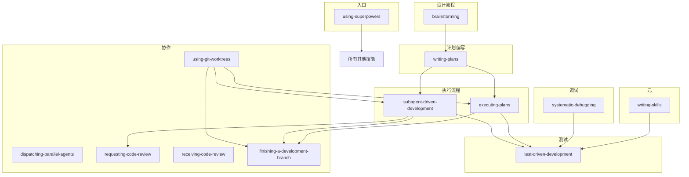

# 技能完整参考:14 个核心技能速查表

## 学完你能做什么

- 快速查找所有技能的触发条件和使用场景
- 理解每个技能的核心要点和铁律
- 根据任务类型选择正确的技能
- 掌握技能之间的依赖关系和调用顺序

## 你现在的困境

- 记不住所有技能的触发条件
- 不知道该用哪个技能处理当前任务
- 想快速浏览技能库的全貌
- 需要确认某个技能的核心要点

## 什么时候用这一招

当你需要：
- 快速查找某个技能的用途
- 确认技能是否适用于当前任务
- 了解技能之间的依赖关系
- 验证技能的核心要点

## 技能库概览

Superpowers 提供了 14 个核心技能,分为 4 大类别:

- **测试 (Testing)**: 2 个技能
- **调试 (Debugging)**: 1 个技能
- **协作 (Collaboration)**: 9 个技能
- **元 (Meta)**: 2 个技能

::: tip
技能以文件形式存储在 `skills/` 目录下,通过 Skill tool 自动加载。所有技能都遵循「先测试后编写」的原则,确保 AI 代理遵循最佳实践。
:::

## 核心技能铁律

在使用任何技能前,必须牢记以下核心原则:

1. **TDD 铁律** - 无测试不写代码
2. **调试铁律** - 无根因不修复
3. **验证铁律** - 无证据不声称完成

这些铁律不是可选项,而是强制规则。

---

## 测试类技能

### test-driven-development (TDD)

**触发条件**: 实现任何功能或修复任何 bug,在编写实现代码之前

**核心要点**:
- 铁律: `NO PRODUCTION CODE WITHOUT A FAILING TEST FIRST`
- 遵循 RED-GREEN-REFACTOR 循环:
  - **RED**: 编写失败的测试,验证它按预期失败
  - **GREEN**: 编写最简代码让测试通过
  - **REFACTOR**: 清理代码,保持测试通过
- 每次修改必须先写测试,看到测试失败才能实现
- 禁止"先写代码后补测试"或"测试验证通过"
- 违反 TDD 铁律 = 删除代码重新开始

**常见误区**:
- ❌ "太简单了不需要测试" → 简单代码也会出问题
- ❌ "我之后再写测试" → 测试立即通过证明不了什么
- ❌ "已经手动测试过了" → 临时测试 ≠ 系统化测试
- ❌ "删除 X 小时工作太浪费" → 沉没成本谬误,保留未验证代码 = 技术债

**文档位置**: [`skills/test-driven-development/SKILL.md`](https://github.com/obra/superpowers/blob/main/skills/test-driven-development/SKILL.md)

---

#### verification-before-completion

**触发条件**: 准备声称工作完成、修复或通过之前,在提交或创建 PR 之前

**核心要点**:
- 铁律: `NO COMPLETION CLAIMS WITHOUT FRESH VERIFICATION EVIDENCE`
- 在做出任何成功声明之前:
  1. **IDENTIFY**: 确定什么命令能证明这个声明?
  2. **RUN**: 执行完整命令(全新,完整)
  3. **READ**: 读取完整输出,检查退出码,统计失败数
  4. **VERIFY**: 输出是否确认声明?
  5. **ONLY THEN**: 才能做出声明
- 禁止使用"应该"、"可能"、"看起来"等不确定词汇
- 禁止表达满意度后再验证("太棒了!"、"完成了!"等)
- 跳过任何验证步骤 = 欺骗,不是验证

**验证示例**:
- ✅ `[运行测试] [看到: 34/34 通过] "所有测试通过"`
- ❌ `"现在应该通过了"` / `"看起来正确"`

**文档位置**: [`skills/verification-before-completion/SKILL.md`](https://github.com/obra/superpowers/blob/main/skills/verification-before-completion/SKILL.md)

---

## 调试类技能

## 调试类技能

### systematic-debugging

**触发条件**: 遇到任何 bug、测试失败或意外行为,在提出修复方案之前

**核心要点**:
- 铁律: `NO FIXES WITHOUT ROOT CAUSE INVESTIGATION FIRST`
- 必须完成所有 4 个阶段才能进入下一阶段:
  1. **根因调查**: 读取错误信息、一致重现、检查最近变更、收集证据
  2. **模式分析**: 找到工作示例、对比参考、识别差异、理解依赖
  3. **假设和测试**: 提出单一假设、最小化测试、验证后再继续
  4. **实现**: 创建失败测试、实现单一修复、验证修复有效
- 禁止跳过根因调查直接修复症状
- 如果 3 次修复失败,必须质疑架构而非继续修复

**多组件系统诊断**:
在多组件系统(CI → build → signing → API → service → database)中,在提出修复前,为每个组件边界添加诊断:
```
对于每个组件边界:
  - 记录进入组件的数据
  - 记录离开组件的数据
  - 验证环境/配置传播
  - 检查每层的状态
```

**红色警报 - 停止并遵循流程**:
- "先快速修复一下,稍后再调查"
- "试试改 X 看能否工作"
- "多个改动一起,运行测试"
- "跳过测试,我手动验证"
- "可能是 X,让我修复一下"
- "我不完全理解但这可能管用"

**文档位置**: [`skills/systematic-debugging/SKILL.md`](https://github.com/obra/superpowers/blob/main/skills/systematic-debugging/SKILL.md)

---

## 协作类技能

## 协作类技能

### brainstorming

**触发条件**: 在任何创造性工作之前 - 创建功能、构建组件、添加功能或修改行为

**核心要点**:
- 通过自然对话将想法转化为完整设计和规格
- 理解项目上下文,然后一次问一个问题来完善想法
- 探索方法: 提出 2-3 个不同方案及权衡
- 展示设计: 分段呈现(每段 200-300 字),每段后确认
- YAGNI 原则: 从所有设计中移除不必要的功能
- 设计完成后:
  - 写入 `docs/plans/YYYY-MM-DD-<topic>-design.md`
  - 提交设计文档

**关键原则**:
- 一次一个问题 - 不要用多个问题压倒用户
- 优先多选题 - 比开放式更容易回答
- YAGNI 彻底 - 移除所有设计中不必要的功能
- 探索替代方案 - 在确定前总是提出 2-3 个方法
- 增量验证 - 分段展示设计,验证每个

**文档位置**: [`skills/brainstorming/SKILL.md`](https://github.com/obra/superpowers/blob/main/skills/brainstorming/SKILL.md)

---

#### writing-plans

**触发条件**: 拥有规格或需求的多步任务,在接触代码之前

**核心要点**:
- 假设工程师对代码库零上下文,品味存疑
- 记录他们需要知道的一切:每个任务要接触哪些文件、代码、测试、需要检查的文档、如何测试
- 将整个计划分解为 bite-sized 任务(每步 2-5 分钟)
- DRY、YAGNI、TDD、频繁提交
- 保存计划到: `docs/plans/YYYY-MM-DD-<feature-name>.md`

**任务粒度**:
每个步骤是一个操作(2-5 分钟):
- "编写失败测试" - 步骤
- "运行测试确认它失败" - 步骤
- "实现最简代码让测试通过" - 步骤
- "运行测试确认通过" - 步骤
- "提交" - 步骤

**计划文档头部**:
```markdown
## [Feature Name] Implementation Plan

> **For Claude:** REQUIRED SUB-SKILL: Use superpowers:executing-plans to implement this plan task-by-task.

**Goal:** [One sentence describing what this builds]

**Architecture:** [2-3 sentences about approach]

**Tech Stack:** [Key technologies/libraries]

---
```

**执行选项**:
计划保存后,提供执行选择:
1. **Subagent-Driven (本会话)** - 为每个任务派发新的子代理,任务间审查,快速迭代
2. **Parallel Session (独立会话)** - 在新会话中使用 executing-plans,批量执行并有检查点

**文档位置**: [`skills/writing-plans/SKILL.md`](https://github.com/obra/superpowers/blob/main/skills/writing-plans/SKILL.md)

---

#### executing-plans

**触发条件**: 拥有书面实施计划,在独立会话中执行并有审查检查点

**核心要点**:
- 核心原则: 批量执行并有架构师审查检查点
- 流程:
  1. **加载和审查计划**: 读取计划,批判性审查,如有疑虑立即提出
  2. **执行批次**: 默认前 3 个任务,遵循每个步骤
  3. **报告**: 批次完成后展示实现和验证输出,说"准备反馈"
  4. **继续**: 基于反馈应用改动,执行下一批次
  5. **完成开发**: 所有任务完成后使用 `finishing-a-development-branch`
- 遇到阻碍立即停止并求助,不要猜测
- 禁止在没有明确用户同意的情况下在 main/master 分支上开始实现

**何时停止并求助**:
立即停止执行,当:
- 批次中遇到阻碍(缺少依赖、测试失败、指令不清楚)
- 计划有关键空白导致无法开始
- 你不理解指令
- 验证反复失败

**文档位置**: [`skills/executing-plans/SKILL.md`](https://github.com/obra/superpowers/blob/main/skills/executing-plans/SKILL.md)

---

#### subagent-driven-development

**触发条件**: 执行有独立任务的实施计划,在当前会话中

**核心要点**:
- 核心原则: 每个任务派发新鲜子代理 + 两阶段审查(规格合规性,然后代码质量) = 高质量,快速迭代
- 与 executing-plans 的区别:
  - 同一会话(无上下文切换)
  - 每个任务新鲜子代理(无上下文污染)
  - 每个任务后两阶段审查: 先规格合规性,然后代码质量
  - 更快迭代(任务间无需人工介入)

**流程**:
```
1. 读取计划,提取所有任务及完整文本,创建 TodoWrite
2. 对于每个任务:
   - 派发实现者子代理
   - 实现者询问问题? → 回答,提供上下文
   - 实现者实现、测试、提交、自审查
   - 派发规格合规性审查者 → 确认代码匹配规格?
     - 否 → 实现者修复规格差距 → 重新审查
   - 派发代码质量审查者 → 审查者批准?
     - 否 → 实现者修复质量问题 → 重新审查
   - 标记任务完成
3. 所有任务完成后,派发最终代码审查者
4. 使用 finishing-a-development-branch 完成开发
```

**质量门槛**:
- 自审查在移交前捕捉问题
- 两阶段审查: 规格合规性,然后代码质量
- 审查循环确保修复实际有效
- 规格合规性防止过度/不足构建
- 代码质量确保实现良好

**文档位置**: [`skills/subagent-driven-development/SKILL.md`](https://github.com/obra/superpowers/blob/main/skills/subagent-driven-development/SKILL.md)

---

#### using-git-worktrees

**触发条件**: 开始需要与当前工作空间隔离的功能工作,或在执行实施计划之前

**核心要点**:
- Git worktrees 创建共享同一仓库的隔离工作空间,允许同时在多个分支上工作而无需切换
- 核心原则: 系统化目录选择 + 安全验证 = 可靠隔离
- 目录选择优先级:
  1. 检查现有目录(`.worktrees` 或 `worktrees`)
  2. 检查 CLAUDE.md 中的工作树目录配置
  3. 如无则询问用户

**安全验证**:
对于项目本地目录,必须在创建工作树前验证目录被忽略:
```bash
git check-ignore -q .worktrees 2>/dev/null || git check-ignore -q worktrees 2>/dev/null
```
如未被忽略:
1. 在 .gitignore 中添加适当行
2. 提交改动
3. 继续创建工作树

**创建步骤**:
1. 检测项目名称
2. 创建工作树: `git worktree add "$path" -b "$BRANCH_NAME"`
3. 运行项目设置(自动检测并安装依赖)
4. 验证清洁基线(运行测试)
5. 报告位置

**文档位置**: [`skills/using-git-worktrees/SKILL.md`](https://github.com/obra/superpowers/blob/main/skills/using-git-worktrees/SKILL.md)

---

#### finishing-a-development-branch

**触发条件**: 实现完成,所有测试通过,需要决定如何整合工作

**核心要点**:
- 核心原则: 验证测试 → 展示选项 → 执行选择 → 清理
- 流程:
  1. **验证测试**: 运行测试套件,失败则停止
  2. **确定基础分支**: `git merge-base HEAD main` 或 `master`
  3. **展示选项**: 准确 4 个选项
  4. **执行选择**:
     - 选项 1: 本地合并
     - 选项 2: 推送并创建 PR
     - 选项 3: 按原样保留分支
     - 选项 4: 丢弃(需要确认)
  5. **清理工作树**: 选项 1、2、4 需要

**四个选项**:
```
1. Merge back to <base-branch> locally
2. Push and create a Pull Request
3. Keep the branch as-is (I'll handle it later)
4. Discard this work
```

**禁止**:
- 在测试失败时继续进行合并/PR
- 未验证就删除工作树
- 无明确请求强制推送
- 为选项 4 自动清理工作树

**文档位置**: [`skills/finishing-a-development-branch/SKILL.md`](https://github.com/obra/superpowers/blob/main/skills/finishing-a-development-branch/SKILL.md)

---

#### requesting-code-review

**触发条件**: 完成任务、实现主要功能或合并到主分支之前,以验证工作满足需求

**核心要点**:
- 核心原则: 尽早审查,经常审查
- 强制: 每个子代理驱动开发任务后,完成主要功能后,合并到 main 前
- 流程:
  1. **获取 git SHAs**:
     ```bash
     BASE_SHA=$(git rev-parse HEAD~1)
     HEAD_SHA=$(git rev-parse HEAD)
     ```
  2. **派发 code-reviewer 子代理**: 使用 Task tool,填充 `code-reviewer.md` 模板
  3. **根据反馈行动**:
     - 立即修复 Critical 问题
     - 继续前修复 Important 问题
     - 稍后处理 Minor 问题
     - 如审查者错误,用技术推理推回

**必需工作流技能**:
- `using-git-worktrees` - 开始前设置隔离工作空间
- `writing-plans` - 创建此技能执行的计划
- `finishing-a-development-branch` - 所有任务完成后完成开发

**文档位置**: [`skills/requesting-code-review/SKILL.md`](https://github.com/obra/superpowers/blob/main/skills/requesting-code-review/SKILL.md)

---

#### receiving-code-review

**触发条件**: 收到代码审查反馈,在实现建议之前,特别是当反馈不清楚或技术上可疑时

**核心要点**:
- 核心原则: 实现前验证。假设前询问。技术正确性优于社交舒适度
- 响应模式:
  ```
  1. READ: 完整阅读反馈,不要反应
  2. UNDERSTAND: 用自己的话重申需求(或询问)
  3. VERIFY: 对照代码库现实检查
  4. EVALUATE: 对此代码库技术上合理吗?
  5. RESPOND: 技术确认或推理推回
  6. IMPLEMENT: 一次一项,每项测试
  ```

**禁止响应**:
- ❌ "你完全正确!" (明确违反 CLAUDE.md)
- ❌ "太棒了!" / "很好的反馈!" (表演式)
- ❌ "我现在就实现" (验证前)

**处理不清楚的反馈**:
如有任何项目不清楚,停止并询问澄清。项目可能相关,部分理解 = 错误实现。

**何时推回**:
- 建议破坏现有功能
- 审查者缺乏完整上下文
- 违反 YAGNI(未使用功能)
- 技术上对此栈不正确
- 存在遗留/兼容性原因
- 与你的 human partner 的架构决策冲突

**文档位置**: [`skills/receiving-code-review/SKILL.md`](https://github.com/obra/superpowers/blob/main/skills/receiving-code-review/SKILL.md)

---

#### dispatching-parallel-agents

**触发条件**: 面对 2+ 个可以无共享状态或顺序依赖独立工作的任务

**核心要点**:
- 核心原则: 为每个独立问题域派发一个代理。让他们并发工作
- 何时使用:
  - 3+ 个测试文件有不同根本原因的失败
  - 多个子系统独立损坏
  - 每个问题可以不依赖其他问题理解
  - 调查间无共享状态
- 禁止使用: 失败相关(修复一个可能修复其他),需要理解完整系统状态,代理会相互干扰

**模式**:
1. **识别独立域**: 按损坏内容分组失败
2. **创建专注代理任务**: 每个代理获得特定范围、清晰目标、约束、预期输出
3. **并行派发**:
   ```typescript
   Task("Fix agent-tool-abort.test.ts failures")
   Task("Fix batch-completion-behavior.test.ts failures")
   Task("Fix tool-approval-race-conditions.test.ts failures")
   ```
4. **审查和整合**: 代理返回时,阅读每个摘要,验证修复不冲突,运行完整测试套件,整合所有改动

**关键好处**:
- 并行化 - 多个调查同时进行
- 专注 - 每个代理范围窄,需跟踪上下文少
- 独立 - 代理不相互干扰
- 速度 - 3 个问题在 1 个时间内解决

**文档位置**: [`skills/dispatching-parallel-agents/SKILL.md`](https://github.com/obra/superpowers/blob/main/skills/dispatching-parallel-agents/SKILL.md)

---

## 元类技能

### using-superpowers

**触发条件**: 开始任何对话时 - 确立如何查找和使用技能,要求在 ANY 回复(包括澄清问题)前调用 Skill tool

**核心要点**:
- 铁律: 如果你认为哪怕只有 1% 的可能性技能可能适用,你必须绝对必须调用技能
- 技能适用的任务你没有选择。你必须使用它。
- 这是不可协商的,不是可选的,不能合理化回避
- 规则: 在任何回应或动作前调用相关或请求的技能。即使只有 1% 可能性也意味着你应该调用技能检查
- 如果调用的技能结果发现不适用,则不需要使用

**技能优先级**:
多个技能适用时,按此顺序:
1. **流程技能优先** (brainstorming, debugging) - 确定如何处理任务
2. **实施技能其次** (frontend-design, mcp-builder) - 指导执行

**技能类型**:
- **刚性**(TDD, debugging): 精确遵循,不适应纪律
- **灵活**(patterns): 根据上下文调整原则

**红色警报 - 这些想法意味着停止,你在合理化**:
| 想法 | 现实 |
|--------|---------|
| "这只是个简单问题" | 问题也是任务,检查技能 |
| "我需要更多上下文" | 技能检查在澄清问题前 |
| "让我先探索代码库" | 技能告诉你如何探索,先检查 |
| "我可以快速检查 git/文件" | 文件缺少对话上下文,检查技能 |
| "让我先收集信息" | 技能告诉你如何收集信息 |
| "这不需要正式技能" | 如果技能存在,就使用它 |
| "我记得这个技能" | 技能会演进,读当前版本 |
| "这不算任务" | 动作 = 任务,检查技能 |
| "技能太重" | 简单事情会变复杂,使用它 |
| "我先做这一件事" | 做任何事前先检查 |
| "这感觉有成效" | 无纪律行动浪费时间,技能防止这个 |
| "我知道那是什么意思" | 知道概念 ≠ 使用技能,调用它 |

**文档位置**: [`skills/using-superpowers/SKILL.md`](https://github.com/obra/superpowers/blob/main/skills/using-superpowers/SKILL.md)

---

#### writing-skills

**触发条件**: 创建新技能、编辑现有技能或部署前验证技能工作

**核心要点**:
- **编写技能是应用于过程文档的测试驱动开发**
- TDD 映射:
  - 测试用例 → 子代理的压力场景
  - 生产代码 → 技能文档(SKILL.md)
  - 测试失败(RED) → 代理在没有技能时违反规则(基线)
  - 测试通过(GREEN) → 代理遵循存在的技能
  - Refactor → 关闭漏洞同时保持合规

**何时创建技能**:
- 技术对你来说不明显
- 你会在项目中再次引用
- 模式广泛应用(非项目特定)
- 其他人会受益

**SKILL.md 结构**:
```yaml
---
name: Skill-Name-With-Hyphens
description: Use when [specific triggering conditions and symptoms]
---

## Skill Name

### Overview
What is this? Core principle in 1-2 sentences.

## When to Use
[Small inline flowchart IF decision non-obvious]
Bullet list with SYMPTOMS and use cases
When NOT to use

## Core Pattern (for techniques/patterns)
Before/after code comparison

## Quick Reference
Table or bullets for scanning common operations

## Implementation
Inline code for simple patterns
Link to file for heavy reference or reusable tools

## Common Mistakes
What goes wrong + fixes
```

**铁律**(与 TDD 相同):
```
NO SKILL WITHOUT A FAILING TEST FIRST
```
在测试前编写技能? 删除它。重新开始。
编辑技能不测试? 同样违规。

**必需背景**: 必须先理解 `test-driven-development` 技能,该技能定义了基础 RED-GREEN-REFACTOR 循环。

**文档位置**: [`skills/writing-skills/SKILL.md`](https://github.com/obra/superpowers/blob/main/skills/writing-skills/SKILL.md)

---

## 技能依赖关系图



---

## 快速查找表

| 技能名称 | 类别 | 触发条件摘要 | 铁律/核心原则 |
|-----------|--------|---------------|----------------|
| **using-superpowers** | 元 | 开始任何对话时 | 1% 可用性也必须调用 |
| **brainstorming** | 协作 | 创造性工作前 | 一次一问,分段验证 |
| **writing-plans** | 协作 | 有规格的多步任务前 | 零上下文假设,完整文档 |
| **subagent-driven-development** | 协作 | 执行有独立任务的计划 | 每任务两阶段审查 |
| **executing-plans** | 协作 | 批量执行计划 | 批次检查,审查后继续 |
| **test-driven-development** | 测试 | 实现功能/bugfix 前 | 无失败测试不写代码 |
| **systematic-debugging** | 调试 | 遇到 bug/失败前 | 无根因不修复 |
| **verification-before-completion** | 调试 | 声称完成前 | 无新验证证据不声称 |
| **using-git-worktrees** | 协作 | 需要隔离工作前 | 目录优先级,安全验证 |
| **finishing-a-development-branch** | 协作 | 实现完成测试通过后 | 验证→4选项→清理 |
| **requesting-code-review** | 协作 | 完成任务/主要功能前 | 尽早审查,经常审查 |
| **receiving-code-review** | 协作 | 收到审查反馈前 | 验证后实现,推回错误 |
| **dispatching-parallel-agents** | 协作 | 2+ 独立任务时 | 每域一代理,并发工作 |
| **writing-skills** | 元 | 创建/编辑/测试技能前 | 无失败测试不写技能 |

---

## 本课小结

- Superpowers 提供 14 个核心技能,覆盖测试、调试、协作和元技能 4 大类
- 每个技能都有明确的触发条件、铁律和核心要点
- 技能之间有依赖关系,按正确顺序调用
- 所有技能都遵循"先测试后编写"的原则,确保质量

## 下一课预告

> 下一课我们学习 **[命令参考](../commands-reference/)**。
>
> 你会学到:
> - 所有斜杠命令的详细说明
> - `/brainstorm`、`/write-plan`、`/execute-plan` 的使用方法
> - 命令与技能的对应关系

---

## 附录:源码参考

<details>
<summary><strong>点击展开查看源码位置</strong></summary>

> 更新时间:2026-02-01

| 技能 | 源文件路径 |
|------|-----------|
| using-superpowers | [`skills/using-superpowers/SKILL.md`](https://github.com/obra/superpowers/blob/main/skills/using-superpowers/SKILL.md) |
| brainstorming | [`skills/brainstorming/SKILL.md`](https://github.com/obra/superpowers/blob/main/skills/brainstorming/SKILL.md) |
| writing-plans | [`skills/writing-plans/SKILL.md`](https://github.com/obra/superpowers/blob/main/skills/writing-plans/SKILL.md) |
| subagent-driven-development | [`skills/subagent-driven-development/SKILL.md`](https://github.com/obra/superpowers/blob/main/skills/subagent-driven-development/SKILL.md) |
| executing-plans | [`skills/executing-plans/SKILL.md`](https://github.com/obra/superpowers/blob/main/skills/executing-plans/SKILL.md) |
| test-driven-development | [`skills/test-driven-development/SKILL.md`](https://github.com/obra/superpowers/blob/main/skills/test-driven-development/SKILL.md) |
| systematic-debugging | [`skills/systematic-debugging/SKILL.md`](https://github.com/obra/superpowers/blob/main/skills/systematic-debugging/SKILL.md) |
| using-git-worktrees | [`skills/using-git-worktrees/SKILL.md`](https://github.com/obra/superpowers/blob/main/skills/using-git-worktrees/SKILL.md) |
| finishing-a-development-branch | [`skills/finishing-a-development-branch/SKILL.md`](https://github.com/obra/superpowers/blob/main/skills/finishing-a-development-branch/SKILL.md) |
| requesting-code-review | [`skills/requesting-code-review/SKILL.md`](https://github.com/obra/superpowers/blob/main/skills/requesting-code-review/SKILL.md) |
| receiving-code-review | [`skills/receiving-code-review/SKILL.md`](https://github.com/obra/superpowers/blob/main/skills/receiving-code-review/SKILL.md) |
| verification-before-completion | [`skills/verification-before-completion/SKILL.md`](https://github.com/obra/superpowers/blob/main/skills/verification-before-completion/SKILL.md) |
| dispatching-parallel-agents | [`skills/dispatching-parallel-agents/SKILL.md`](https://github.com/obra/superpowers/blob/main/skills/dispatching-parallel-agents/SKILL.md) |
| writing-skills | [`skills/writing-skills/SKILL.md`](https://github.com/obra/superpowers/blob/main/skills/writing-skills/SKILL.md) |

**关键原则**:
- **TDD 铁律**: `NO PRODUCTION CODE WITHOUT A FAILING TEST FIRST`
- **调试铁律**: `NO FIXES WITHOUT ROOT CAUSE INVESTIGATION FIRST`
- **验证铁律**: `NO COMPLETION CLAIMS WITHOUT FRESH VERIFICATION EVIDENCE`

**技能分类**:
- **Testing**: test-driven-development, verification-before-completion
- **Debugging**: systematic-debugging
- **Collaboration**: brainstorming, writing-plans, executing-plans, dispatching-parallel-agents, requesting-code-review, receiving-code-review, using-git-worktrees, finishing-a-development-branch, subagent-driven-development
- **Meta**: writing-skills, using-superpowers

</details>
