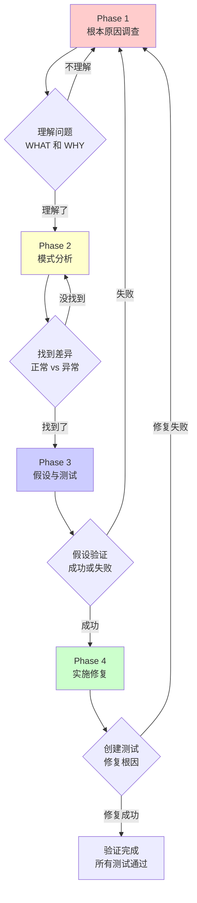

# 调试工作流：Systematic Debugging

## 学完你能做什么

- 强制 AI 代理在修复前先调查根本原因（Root Cause）
- 识别和纠正常见的调试陷阱（如"快速修复"、"再试一次"）
- 应用四阶段系统化调试流程（观察、模式、假设、实施）
- 使用根因追踪技术，从深层错误回溯到源头
- 在多组件系统中添加诊断工具，精确定位故障点
- 区分"修复症状"和"解决问题"，避免症状修复失败

## 你现在的困境

**AI 代理经常跳过调查直接"快速修复"**

你有没有遇到过这种情况？测试失败了，AI 马上就开始改代码，改了几次"看起来好了"，但根本原因没找到，过几天又出现新问题。

常见问题：
- ❌ AI 说"应该就是这个原因，改一下试试"
- ❌ 修复了一个 bug，引入三个新 bug
- ❌ 改了多次都没效果，还在"再试一次"
- ❌ 错误信息看一眼就跳过，直接改代码
- ❌ "这是个小问题，不用那么正式"

这些问题的根源：**AI 在没有找到根本原因前就开始修复**。

::: info 什么是系统化调试？

系统化调试（Systematic Debugging）是一种强制流程，要求在尝试任何修复之前，先完成彻底的根本原因调查。

核心铁律：
```
NO FIXES WITHOUT ROOT CAUSE INVESTIGATION FIRST
（没有根因调查，就不做修复）
```

四阶段流程：
1. **根本原因调查** - 理解发生了什么，为什么发生
2. **模式分析** - 对比正常和异常情况
3. **假设与测试** - 用科学方法验证假设
4. **实施修复** - 创建测试，修复根因，验证效果
:::

## 什么时候用这一招

Systematic Debugging 技能会在以下场景自动触发：

| 场景 | 示例 |
| ---- | ---- |
| **测试失败** | "测试报错了，帮我修复" |
| **Bug 报告** | "用户反馈功能不工作" |
| **异常行为** | "这个结果不符合预期" |
| **性能问题** | "这个操作太慢了" |
| **构建失败** | "CI 构建失败了" |
| **集成问题** | "这个服务调用失败了" |

**特别要使用的情况**：
- 时间压力大时（紧急情况更不应该猜测）
- 看起来"很明显的快速修复"
- 已经尝试了多次修复但都没用
- 上一次修复没解决问题
- 你不完全理解问题

**不要跳过的情况**：
- 看起来很简单（简单 bug 也有根因）
- 赶时间（匆忙会导致返工）
- 管理要求"立刻修复"（系统化比胡乱尝试更快）

## 核心思路

系统化调试的核心是四阶段流程，每个阶段都有强制验证步骤，必须按顺序完成：



### 核心铁律

```
NO FIXES WITHOUT ROOT CAUSE INVESTIGATION FIRST
（没有根因调查，就不做修复）
```

如果你没有完成 Phase 1，就不能提出修复方案。

**违反规则的字面意思就是违反规则的精神**。即使你 99% 确定是某个原因，也必须先调查确认。

### 四阶段概览

| 阶段 | 关键活动 | 成功标准 |
| ----- | --------- | -------- |
| **1. 根本原因调查** | 读取错误、复现、检查变更、收集证据 | 理解 WHAT 和 WHY |
| **2. 模式分析** | 找正常例子、对比参考实现 | 识别差异 |
| **3. 假设与测试** | 形成假设、最小化测试 | 确认或新假设 |
| **4. 实施修复** | 创建测试、修复、验证 | Bug 解决，测试通过 |

## 跟我做

### 第 1 步：根本原因调查 - 读取错误信息

**为什么**
错误信息通常包含解决方案的线索，跳过会错过关键信息。

**操作示例**

假设你遇到这个错误：

```
Error: Cannot find module 'lodash' from '/project/src/utils.ts'
    at resolveModule (/project/node_modules/vite/dist/node/chunks/dep-a1b2c3.js:123:45)
    at /project/src/main.ts:45:12
```

**完整读取错误信息**：

1. **错误类型**：`Cannot find module 'lodash'`
2. **文件位置**：`/project/src/utils.ts` 尝试导入 lodash
3. **调用位置**：`/project/src/main.ts:45:12` 触发了导入
4. **可能原因**：lodash 未安装或路径错误

**你应该看到**：错误信息告诉你是什么、在哪里、可能为什么。

::: danger 检查点
不要只看错误标题就跳过！
- ✅ 读取完整的错误堆栈
- ✅ 注意文件路径和行号
- ✅ 记录错误代码
- ✅ 不要跳过警告信息（警告往往是真正的问题）
:::

### 第 2 步：根本原因调查 - 复现问题

**为什么**
如果不能稳定复现，就无法验证修复是否有效。

**操作示例**

```bash
# 运行失败的测试
npm test utils.test.ts

# 尝试手动复现
npm run dev

# 记录复现步骤
1. npm run dev
2. 打开 http://localhost:3000
3. 点击登录按钮
4. 观察控制台错误
```

**复现检查清单**：
- 能稳定触发吗？每次都会发生吗？
- 具体步骤是什么？
- 特定条件下才发生吗？（环境、数据、时间）

**应该注意**：
- 如果不能稳定复现 → 收集更多数据，不要猜测
- 如果间歇性发生 → 检查竞争条件、环境差异、缓存

### 第 3 步：根本原因调查 - 检查最近变更

**为什么**
大多数 bug 都是由最近的变更引起的。

**操作示例**

```bash
# 查看最近的提交
git log --oneline -10

# 查看最近的变更
git diff HEAD~5 HEAD

# 检查依赖变更
git diff package.json
```

**应该检查的内容**：
- 哪些代码变更可能导致这个问题？
- 最近添加了哪些依赖？
- 配置文件有变更吗？
- 环境变量有变化吗？

**你应该看到**：一份可能导致问题的变更清单。

### 第 4 步：根本原因调查 - 多组件系统的诊断

**为什么**
当系统有多个组件（CI → 构建 → 签名，API → 服务 → 数据库）时，需要精确定位故障点。

**操作示例**

假设你在调试一个 CI 构建失败问题（GitHub Actions → 构建脚本 → 签名脚本）：

```bash
# Layer 1: Workflow 层
echo "=== Secrets available in workflow: ==="
echo "IDENTITY: ${IDENTITY:+SET}${IDENTITY:-UNSET}"

# Layer 2: Build script 层
echo "=== Env vars in build script: ==="
env | grep IDENTITY || echo "IDENTITY not in environment"

# Layer 3: Signing script 层
echo "=== Keychain state: ==="
security list-keychains
security find-identity -v

# Layer 4: 实际签名
codesign --sign "$IDENTITY" --verbose=4 "$APP"
```

**运行一次后分析输出**：
- Layer 1 显示 `IDENTITY: SET` ✓
- Layer 2 显示 `IDENTITY not in environment` ✗

**结论**：问题出在 Layer 2，secrets 从 workflow 传递到 build 失败。

**应该注意**：
- 对每个组件边界添加日志
- 记录进入和退出的数据
- 验证环境/配置的传递
- 检查每一层的状态

### 第 5 步：根因追踪 - 深层错误回溯

**为什么**
错误通常出现在调用栈深处，直接修复是治标不治本。

**操作示例**

假设错误显示在深层调用：

```
Error: git init failed in /Users/jesse/project/packages/core
```

**调用链追踪**：

```typescript
// 立即原因（错误发生处）
await execFileAsync('git', ['init'], { cwd: projectDir });
  ↑
// 什么调用了这个？
WorktreeManager.createSessionWorktree(projectDir, sessionId)
  ↑
// 什么调用了这个？
Session.initializeWorkspace()
  ↑
// 什么调用了这个？
Session.create()
  ↑
// 什么调用了这个？（源头）
Project.create('name', context.tempDir)
```

**追踪问题**：
- `projectDir = ''` （空字符串！）
- 空字符串作为 `cwd` 解析为 `process.cwd()`
- 那是源代码目录，不是临时目录！

**找到根本原因**：
```typescript
const context = setupCoreTest(); // 返回 { tempDir: '' }
Project.create('name', context.tempDir); // 在 beforeEach 之前访问了！
```

**修复**：
```typescript
// 修复根本原因（源头），而不是症状
private get tempDir(): string {
  if (!this._tempDir) {
    throw new Error('tempDir accessed before beforeEach');
  }
  return this._tempDir;
}
```

**你应该看到**：修复在调用链的源头，而不是错误出现的地方。

::: danger 检查点
永远不要只在错误出现的地方修复！
- ✅ 追溯到最初的触发点
- ✅ 修复根本原因
- ✅ 添加多层防御
- ❌ 不要在症状处"贴创可贴"
:::

### 第 6 步：模式分析 - 找到正常例子

**为什么**
通过对比正常和异常情况，能快速识别差异。

**操作示例**

假设你修复一个按钮点击不生效的问题：

**找到类似功能的正常代码**：

```typescript
// 正常工作的按钮（参考）
<Button onClick={() => console.log('clicked')}>
  Click me
</Button>

// 不工作的按钮（问题）
<Button onClick={handleClick}>
  Click me
</Button>
```

**对比差异**：
1. 正常：箭头函数直接调用 `console.log`
2. 异常：使用 `handleClick` 变量

**检查 `handleClick` 的定义**：

```typescript
// 问题：没有定义 handleClikc（拼写错误！）
const handleClikc = () => console.log('clicked');
//      ↑↑↑↑ 拼写错误
```

**根本原因**：函数名拼写错误。

**你应该看到**：通过对比找到了拼写错误。

### 第 7 步：模式分析 - 对比参考实现

**为什么**
完整阅读参考实现，而不是"适配"它。

**操作示例**

假设你在实现一个新功能，参考了官方文档的例子：

```typescript
// 完整阅读参考实现
// 参考代码（from docs）
import { useAuth } from '@auth/react';

function UserProfile() {
  const { user, loading } = useAuth();

  if (loading) return <div>Loading...</div>;
  if (!user) return <div>Please log in</div>;

  return <div>Welcome, {user.name}</div>;
}

// 你的代码（不完整）
function UserProfile() {
  const { user } = useAuth(); // 缺少 loading
  return <div>Welcome, {user.name}</div>; // 没有检查 loading/user
}
```

**差异列表**：
1. 没有检查 `loading` 状态
2. 没有检查 `user` 是否存在
3. 可能在加载时访问 `user.name` 导致错误

**修复**：
```typescript
function UserProfile() {
  const { user, loading } = useAuth(); // 添加 loading

  if (loading) return <div>Loading...</div>; // 添加检查
  if (!user) return <div>Please log in</div>; // 添加检查

  return <div>Welcome, {user.name}</div>;
}
```

**应该注意**：
- 完整阅读参考，不要 skim
- 理解模式后再应用
- 不要"看起来差不多就行"
- 列出所有差异，不要假设"那个不重要"

### 第 8 步：假设与测试 - 形成单一假设

**为什么**
用科学方法验证假设，一次只变一个变量。

**操作示例**

假设你在调试一个 API 超时问题：

**形成假设**：
```
我认为请求超时是因为 API 服务器的响应时间超过了客户端的 30 秒超时设置，因为我看到服务器日志显示请求需要 45 秒。
```

**关键要素**：
- ✅ 明确指出原因（API 服务器响应慢）
- ✅ 说明证据（服务器日志显示 45 秒）
- ✅ 具体可验证

**最小化测试**：
```typescript
// 只修改超时设置，不改其他东西
const response = await fetch(url, {
  timeout: 60000, // 从 30000 改为 60000
  // 其他参数保持不变
});
```

**验证假设**：
```bash
# 运行测试
npm test api-timeout.test.ts

# 结果：请求成功
PASS api-timeout.test.ts
  ✓ API 请求在 60 秒超时内成功
```

**应该注意**：
- 一次只变一个变量
- 不要"顺便"修复其他问题
- 测试最小化，不要大改
- 记录假设，验证成功或失败

### 第 9 步：实施修复 - 创建失败测试

**为什么**
先有失败的测试，才能证明修复有效。

**操作示例**

假设你修复一个空邮箱被接受的 bug：

```typescript
// Phase 4: 创建失败测试
test('拒绝空邮箱', async () => {
  const result = await submitForm({ email: '' });
  expect(result.error).toBe('Email required');
});
```

**验证测试失败**：

```bash
$ npm test submitForm.test.ts

FAIL submitForm.test.ts
  ● 拒绝空邮箱

    expect(result.error).toBe('Email required')
    Received: undefined

      at Object.<anonymous> (submitForm.test.ts:3:28)
```

**你应该看到**：测试失败，错误信息符合预期（功能缺失）。

::: danger 检查点
如果测试立刻通过？
说明你测试的是已有行为，需要修改测试。

如果测试报错？
说明代码有错误，先修复错误，再运行测试。
:::

### 第 10 步：实施修复 - 单一修复

**为什么**
一次修复一个根因，避免混入其他问题。

**操作示例**

```typescript
// Phase 4: 实施单一修复
function submitForm(data: FormData) {
  // 只修复根因（空邮箱验证）
  if (!data.email?.trim()) {
    return { error: 'Email required' };
  }

  // ... 其他逻辑不变
  // 不要"顺便"添加其他验证
  // 不要重构其他代码
  // 不要"优化"性能
}
```

**应该注意**：
- 只修复根本原因
- 不添加额外功能
- 不重构其他代码
- 不"顺便"做其他事情

### 第 11 步：实施修复 - 验证修复

**为什么**
确认修复有效，且没有破坏其他功能。

**操作示例**

```bash
# 验证测试通过
npm test submitForm.test.ts

PASS submitForm.test.ts
  ✓ 拒绝空邮箱

Test Suites: 1 passed, 1 total
Tests:       1 passed, 1 total
```

**验证其他测试**：
```bash
# 运行所有测试
npm test

# 确保没有破坏其他功能
Test Suites: 5 passed, 5 total
Tests:       25 passed, 25 total
```

**你应该看到**：
- ✅ Bug 修复测试通过
- ✅ 所有其他测试通过
- ✅ 没有新的警告或错误

### 第 12 步：修复失败 - 重新分析

**为什么**
如果修复无效，说明假设错误，需要重新调查。

**操作示例**

假设你尝试了 2 次修复，都没成功：

```bash
# 修复 1：修改超时设置 → 仍然超时
# 修复 2：重试请求 → 仍然超时
```

**计数和判断**：
- 已尝试修复：2 次
- 结果：都无效
- 行动：返回 Phase 1，重新分析

**重新分析**：
```typescript
// 新信息：超时设置和重试都没用
// 重新根本原因调查

// 检查网络请求日志
console.log('Request URL:', url);
console.log('Request headers:', headers);

// 发现：URL 配置错误，指向了错误的端点
// const apiEndpoint = 'https://wrong-api.example.com';
//                  ^^^^^^^^^^^^^^^^^^^^^^^^^^^^^^^^^^^
//                  应该是 https://correct-api.example.com
```

**新的假设**：
```
我认为请求超时是因为 API 端点配置错误（指向了错误的 URL），因为我看到网络日志显示请求发送到了 wrong-api.example.com 而不是 correct-api.example.com。
```

**新的修复**：
```typescript
const apiEndpoint = 'https://correct-api.example.com';
```

**验证修复**：

```bash
npm test api-timeout.test.ts

PASS api-timeout.test.ts
  ✓ API 请求成功
```

::: danger 检查点
如果已尝试 3 次修复但都失败？
立即停止，这不是修复问题，而是架构问题。

进入 Phase 4.5：质疑架构。
:::

### 第 13 步：架构质疑 - 3 次失败后停止

**为什么**
如果每次修复都揭示新问题，说明基础架构有问题。

**模式识别**：

每次修复都揭示：
- ✗ 新的共享状态问题
- ✗ 新的耦合问题
- ✗ 需要"大规模重构"才能实现
- ✗ 修复后其他地方出现新症状

**这表明**：你试图在错误的基础上修补，而不是修复根本问题。

**操作示例**

假设你在修复一个认证系统问题：

- **修复 1**：添加 token 验证 → 发现 token 存储不安全
- **修复 2**：加密 token 存储 → 发现密钥管理混乱
- **修复 3**：改进密钥管理 → 发现多服务同步问题

**停止并质疑**：
```typescript
// 问题模式：每次修复都揭示新问题
// 根本原因：架构设计不匹配需求

// 质疑问题：
// 1. 这个模式根本上是合理的吗？
// 2. 我们是否"因为惯性而坚持"？
// 3. 应该重构架构而不是继续修复症状？

// 架构问题：
// - 试图在无状态服务中维护会话状态
// - 多个服务共享同一个 token 存储
// - 没有统一的认证中心
```

**行动**：
1. 停止尝试第 4 次修复
2. 与人类伙伴讨论架构问题
3. 决定是重构架构还是换用其他方案

**这不是失败的假设**，这是错误的架构。

## 检查点 ✅

**验证系统化调试流程是否完整**

- [ ] 读取了完整的错误信息和堆栈
- [ ] 能够稳定复现问题
- [ ] 检查了最近的代码变更
- [ ] 在多组件系统中添加了诊断工具
- [ ] 使用根因追踪找到了问题源头
- [ ] 找到了正常例子并对比差异
- [ ] 形成了明确的单一假设
- [ ] 通过最小化测试验证了假设
- [ ] 创建了失败测试（Phase 4）
- [ ] 实施了单一修复
- [ ] 验证了修复有效
- [ ] 其他测试仍然通过
- [ ] 如果 3 次修复失败，质疑了架构

如果以上任何一项不符合，说明跳过了系统化调试流程。

## 踩坑提醒

### ❌ 踩坑 1："快速修复一下，稍后再调查"

**症状**：AI 说"这个很明显，先修复，稍后深入分析"。

**问题**：
- 快速修复往往只解决症状
- 不治本，问题会重复出现
- "稍后"通常意味着"永远不会"

**解决方法**：
- 铁律：没有根因调查，不做修复
- 时间紧迫时，系统化更快
- 记住：症状修复 = 失败

### ❌ 踩坑 2："试试改这个，看看能不能行"

**症状**：AI 说"可能是 X，改一下试试"。

**问题**：
- 没有明确假设
- 一次改多个地方
- 无法判断什么起作用

**解决方法**：
- 先形成假设："我认为 X 是根因，因为 Y"
- 最小化测试：一次只改一个变量
- 记录假设，验证成功或失败

### ❌ 踩坑 3："一次改多个，再跑测试"

**症状**：AI 一次性修改多个地方，然后运行测试。

**问题**：
- 无法知道哪个修改起作用
- 可能有多个修复互相抵消
- 引入新 bug 很难定位

**解决方法**：
- 一次只做一处修改
- 每次修改后验证
- 逐步接近根因

### ❌ 踩坑 4："先跳过测试，我手动验证"

**症状**：AI 说"这个不用测试，我手动测过了"。

**问题**：
- 手动测试无法重复
- 没有测试记录，回归时无法验证
- 容易遗漏边界情况

**解决方法**：
- 必须创建自动化测试
- 测试记录行为和修复
- 手动验证不能替代自动化测试

### ❌ 踩坑 5："可能是 X，我就修复它"

**症状**：AI 没有调查就假设是某个原因。

**问题**：
- 假设没有证据
- 可能源自经验偏差
- 浪费时间修复错误问题

**解决方法**：
- 先调查再假设
- 假设必须有证据支持
- 用科学方法验证假设

### ❌ 踩坑 6："我不完全理解，但这应该能行"

**症状**：AI 承认不理解，但还是建议修复。

**问题**：
- 不理解就不能正确修复
- 可能引入更严重的问题
- 不敢声称完成

**解决方法**：
- 承认"我不理解 X"
- 先研究更多
- 请求帮助，不要猜测

### ❌ 踩坑 7："模式说 X，但我用不同方式适配"

**症状**：AI 说"参考实现太长，我大概看一下，用我的方式实现"。

**问题**：
- 部分理解必然导致 bug
- 遗漏细节（通常是最重要的）
- "看起来差不多" ≠ "正确实现"

**解决方法**：
- 完整阅读参考实现
- 理解模式后再应用
- 不要 skim，不要"适配"

### ❌ 踩坑 8："再试一次修复"（已尝试 2+ 次）

**症状**：AI 尝试了 2-3 次修复，但说"再试一次"。

**问题**：
- 3 次失败 = 架构问题
- 不是修复不够，而是方向错了
- 继续修复会浪费更多时间

**解决方法**：
- 立即停止
- 质疑架构
- 与人类伙伴讨论重构方案

### ❌ 踩坑 9："问题很简单，不用那么正式"

**症状**：AI 说"这是小问题，不用系统化调试"。

**问题**：
- 简单问题也有根因
- 系统化调试对小问题更快
- "简单"是主观判断，容易出错

**解决方法**：
- 系统化调试适用于所有问题
- 小问题也能快速完成
- 记住：95% 的"无根因"案例都是调查不完整

## Red Flags - 必须返回 Phase 1

如果出现以下任何想法，**立即停止，返回 Phase 1**：

- [ ] "快速修复一下，稍后再调查"
- [ ] "试试改这个，看看能不能行"
- [ ] "一次改多个，再跑测试"
- [ ] "先跳过测试，我手动验证"
- [ ] "可能是 X，我就修复它"
- [ ] "我不完全理解，但这应该能行"
- [ ] "模式说 X，但我用不同方式适配"
- [ ] "这里列出了主要问题：[列出修复，没有调查]"
- [ ] 在追踪数据流之前就提出解决方案
- [ ] **"再试一次修复"（已尝试 2+ 次）**
- [ ] **每次修复都在不同地方揭示新问题**

**记住**：违反规则的字面意思就是违反规则的精神。

**如果 3 次修复失败**：质疑架构（Phase 4.5）

## 人类伙伴的信号

**注意这些纠正信号**：

| 信号 | 含义 | 行动 |
| ---- | ---- | ---- |
| "是没发生吗？" | 你假设没有验证 | 立即验证 |
| "会给我们展示...吗？" | 你应该添加证据收集 | 添加诊断工具 |
| "停止猜测" | 你在没理解时提出修复 | 返回 Phase 1 |
| "深度思考这个" | 质疑基础，不只是症状 | 质疑架构 |
| "我们卡住了？"（沮丧） | 你的方法不起效 | 返回 Phase 1 |

**当你看到这些**：立即停止，返回 Phase 1。

## 常见合理化借口

| 借口 | 现实 |
| ---- | ---- |
| "问题很简单，不用流程" | 简单问题也有根因。流程对小 bug 很快。 |
| "紧急情况，没时间流程" | 系统化调试比乱试修复更快。 |
| "先试试这个，稍后调查" | 第一次修复设定模式。从一开始就做对。 |
| "确认修复可行后再写测试" | 未测试的修复不可靠。先写测试证明它。 |
| "一次修复多个节省时间" | 无法知道什么起作用。导致新 bug。 |
| "参考太长，我适配模式" | 部分理解必然 bug。完整阅读它。 |
| "我看到问题了，让我修复" | 看到症状 ≠ 理解根本原因。 |
| "再试一次修复"（2+ 次失败后） | 3+ 次失败 = 架构问题。质疑模式，不要再修复。 |

## 本课小结

Systematic Debugging 技能通过四阶段流程，确保：

1. **强制调查**：在修复前完成根本原因调查（Phase 1）
2. **模式对比**：找到正常例子，对比参考实现（Phase 2）
3. **科学方法**：形成单一假设，最小化测试验证（Phase 3）
4. **有效修复**：创建失败测试，实施单一修复，验证效果（Phase 4）
5. **架构质疑**：3 次修复失败后，质疑基础架构
6. **零容忍**：任何 Red Flags 都意味着返回 Phase 1

**记住**：
- 症状修复 = 失败
- 违反规则的字面意思 = 违反规则的精神
- 95% 的"无根因"案例都是调查不完整
- 系统化调试比盲目修复更快（15-30 分钟 vs 2-3 小时）

## 下一课预告

> 下一课我们学习 **[验证工作流：证据优先](../verification-workflow/)**。
>
> 你会学到：
> - 如何在声称完成前提供真实验证
> - "证据优先"原则的 5 类证据
> - 避免"我试过了"和"应该能行"的陷阱
> - 确保工作真正完成，而不是"差不多"

---

## 附录：源码参考

<details>
<summary><strong>点击展开查看源码位置</strong></summary>

> 更新时间：2026-02-01

| 功能        | 文件路径                                                                                    | 行号    |
| ----------- | ------------------------------------------------------------------------------------------- | ------- |
| 调试技能定义 | [`skills/systematic-debugging/SKILL.md`](https://github.com/obra/superpowers/blob/main/skills/systematic-debugging/SKILL.md) | 1-297   |
| 根因追踪技术 | [`skills/systematic-debugging/root-cause-tracing.md`](https://github.com/obra/superpowers/blob/main/skills/systematic-debugging/root-cause-tracing.md) | 1-170   |
| 工作流概述 | [`README.md`](https://github.com/obra/superpowers/blob/main/README.md) | 80-96   |

**核心铁律**：
- 无根因调查，不做修复（NO FIXES WITHOUT ROOT CAUSE INVESTIGATION FIRST）
- 违反规则的字面意思就是违反规则的精神（Violating letter of this process is violating spirit of debugging）

**四阶段流程**：
1. **Phase 1: Root Cause Investigation** - 根本原因调查
   - 读取错误信息（不要跳过）
   - 稳定复现问题
   - 检查最近变更
   - 多组件系统添加诊断工具
   - 根因追踪（深层错误回溯）
2. **Phase 2: Pattern Analysis** - 模式分析
   - 找到正常例子
   - 完整阅读参考实现
   - 识别差异
   - 理解依赖关系
3. **Phase 3: Hypothesis and Testing** - 假设与测试
   - 形成单一假设（明确、有证据）
   - 最小化测试（一次一个变量）
   - 验证后决定继续或新假设
   - 承认"我不知道"
4. **Phase 4: Implementation** - 实施修复
   - 创建失败测试（必须）
   - 实施单一修复（只修复根因）
   - 验证修复（测试通过）
   - 如果修复失败：计数并判断
   - 如果 3+ 次失败：质疑架构

**Red Flags - 必须返回 Phase 1**：
- "快速修复一下，稍后再调查"
- "试试改这个，看看能不能行"
- "一次改多个，再跑测试"
- "先跳过测试，我手动验证"
- "可能是 X，我就修复它"
- "我不完全理解，但这应该能行"
- "模式说 X，但我用不同方式适配"
- "再试一次修复"（已尝试 2+ 次）
- 每次修复都在不同地方揭示新问题

**人类伙伴的信号**：
- "是没发生吗？" - 你假设没有验证
- "会给我们展示...吗？" - 你应该添加证据收集
- "停止猜测" - 你在没理解时提出修复
- "深度思考这个" - 质疑基础，不只是症状
- "我们卡住了？"（沮丧）- 你的方法不起效

**常见合理化借口**：
- "问题很简单，不用流程" - 简单问题也有根因
- "紧急情况，没时间流程" - 系统化调试比盲目修复更快
- "先试试这个，稍后调查" - 第一次修复设定模式
- "确认修复可行后再写测试" - 未测试的修复不可靠
- "一次修复多个节省时间" - 无法知道什么起作用
- "参考太长，我适配模式" - 部分理解必然 bug
- "我看到问题了，让我修复" - 看到症状 ≠ 理解根因
- "再试一次修复"（2+ 次失败后）- 3+ 次失败 = 架构问题

**根因追踪技术**（root-cause-tracing.md）：
- 从深层错误回溯到源头
- 追踪调用链，找到最初触发点
- 添加堆栈跟踪记录（使用 `console.error()` 和 `new Error().stack`）
- 使用二分查找脚本（`find-polluter.sh`）定位测试污染源

**多组件系统诊断**（SKILL.md Phase 1, Step 4）：
- 对每个组件边界添加日志
- 记录进入和退出的数据
- 验证环境/配置传递
- 检查每一层的状态
- 运行一次收集证据，定位故障组件

**架构问题识别**（Phase 4.5）：
- 每次修复揭示新的共享状态/耦合/问题
- 修复需要"大规模重构"
- 每次修复在其他地方创建新症状
- 行动：停止，质疑基础，讨论重构

**支持技术**：
- **root-cause-tracing.md** - 追踪深层错误
- **defense-in-depth.md** - 多层防御
- **condition-based-waiting.md** - 条件等待代替超时

**相关技能**：
- **superpowers:test-driven-development** - 创建失败测试（Phase 4, Step 1）
- **superpowers:verification-before-completion** - 验证修复成功

**实际影响**（从调试会话统计）：
- 系统化方法：15-30 分钟修复
- 随机修复方法：2-3 小时混乱
- 首次修复成功率：95% vs 40%
- 引入新 bug：几乎为零 vs 常见

**验证清单**：
- [ ] 读取了完整的错误信息和堆栈
- [ ] 能够稳定复现问题
- [ ] 检查了最近的代码变更
- [ ] 在多组件系统中添加了诊断工具
- [ ] 使用根因追踪找到了问题源头
- [ ] 找到了正常例子并对比差异
- [ ] 形成了明确的单一假设
- [ ] 通过最小化测试验证了假设
- [ ] 创建了失败测试
- [ ] 实施了单一修复
- [ ] 验证了修复有效
- [ ] 其他测试仍然通过
- [ ] 如果 3 次修复失败，质疑了架构

</details>
