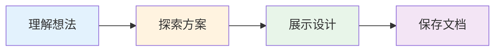

# 设计工作流：Brainstorming

## 学完你能做什么

- 在编码前与 AI 代理进行结构化的设计对话
- 通过一次一个问题的方式，让 AI 准确理解你的需求
- 评估 2-3 种不同实现方案的权衡
- 分段审查设计文档，确保每个部分都符合预期
- 自动生成格式化的设计文档并保存到项目

## 你现在的困境

**AI 代理经常"想当然"**

你有没有遇到过这种情况？你对 AI 说"帮我加个用户登录功能"，它马上就开始写代码，但最后实现的东西跟你想要的不一样。

常见问题：
- ❌ AI 跳过了需求澄清，直接写代码
- ❌ 没有讨论替代方案，只给出了"最常见"的实现
- ❌ 实现后发现遗漏了关键需求
- ❌ 代码写了一半才发现思路不对

这些问题的根源：**AI 在编码前没有充分探索和验证设计**。

## 什么时候用这一招

Brainstorming 技能会在以下场景自动触发：

| 场景 | 示例 |
| ---- | ---- |
| **创建新功能** | "帮我加个用户评论功能" |
| **构建组件** | "我需要一个可复用的表格组件" |
| **添加功能** | "在现有页面上加搜索过滤" |
| **修改行为** | "改变这个按钮的交互逻辑" |

**核心原则**：任何创意工作开始前，必须先 brainstorming。

## 核心思路

Brainstorming 工作流分为三个阶段：



### 阶段 1：理解想法

AI 会先检查当前项目状态（文件、文档、最近提交），然后**一次一个问题**地询问，细化你的想法。

**提问原则**：
- ✅ 一次一个问题（避免信息过载）
- ✅ 多选题优先（更容易回答）
- ✅ 关注：目的、约束、成功标准

### 阶段 2：探索方案

AI 会提出 2-3 种不同的实现方案，并给出权衡分析。

**呈现方式**：
- 先推荐最合适的方案，并说明理由
- 列出其他方案的优缺点
- 保持对话式风格，不是技术报告

### 阶段 3：展示设计

一旦 AI 认为理解了你的需求，就会分段展示设计：

**分段规则**：
- 每段 200-300 词（避免信息过载）
- 每段后询问"这部分看起来对吗？"
- 涵盖：架构、组件、数据流、错误处理、测试
- 如果有不合理的地方，可以随时回退澄清

### 阶段 4：保存文档

设计确认后，AI 会：
1. 将设计写入 `docs/plans/YYYY-MM-DD-<topic>-design.md`
2. 使用清晰的写作风格（如果有 `elements-of-style` 技能）
3. 提交设计文档到 git

## 跟我做

### 第 1 步：提出想法

**为什么**
让 AI 知道你想做什么，触发 brainstorming 工作流。

**操作示例**

```
用户输入：
我想给这个项目加一个用户认证功能。

AI 回复：
让我先了解一下项目现状...

（AI 检查项目文件、现有代码、文档）

AI 继续说：
好的，我看到这是一个 Web 应用。让我问几个问题来细化需求：

第一个问题：你期望的用户认证方式是什么？
A. 邮箱+密码登录
B. 第三方登录（Google/GitHub）
C. 手机号验证码登录
```

**你应该看到**：AI 先检查项目上下文，然后提出第一个问题。

### 第 2 步：回答问题（循环）

**为什么**
通过多次迭代，让 AI 精准理解你的需求。

**操作示例**

```
用户输入：
我选择 A，但同时也想支持 B。

AI 回复：
明白了，主认证方式是邮箱+密码，同时支持 Google 和 GitHub 第三方登录。

下一个问题：你需要支持"记住我"功能吗？
A. 是，用户可以保持登录状态 7 天
B. 否，每次关闭浏览器都需要重新登录
```

**你应该看到**：AI 根据你的回答，继续提出下一个细化问题。

### 第 3 步：探索方案

**为什么**
在 AI 完全理解需求后，它会提出不同的实现方案供你选择。

**操作示例**

```
AI 回复：
很好，我已经理解了你的需求。让我分析几种实现方案：

**方案 1：自建认证系统**（推荐）

优点：
- 完全控制数据和行为
- 无外部依赖
- 未来可以灵活扩展

缺点：
- 需要处理密码存储、令牌管理、安全细节
- 开发工作量较大

**方案 2：使用 Auth0 类服务**

优点：
- 开箱即用，快速实现
- 自动处理安全细节
- 支持多种第三方登录

缺点：
- 需要付费（免费额度有限）
- 数据托管在第三方

我推荐方案 1，因为你的项目已经有自己的数据库架构，
而且长期来看自建系统更灵活。你觉得呢？
```

**你应该看到**：AI 推荐 2-3 种方案，给出权衡分析，并表达倾向性建议。

### 第 4 步：分段审查设计

**为什么**
分段展示设计让你可以逐步验证，避免信息过载。

**操作示例**

```
用户输入：
好的，那就用方案 1。

AI 回复：
好的，我来展示详细设计。我分成几个部分讲。

**第 1 部分：架构设计**

认证系统将采用 JWT（JSON Web Token）架构。前端登录成功后，
后端返回包含用户信息和签名的 JWT，前端存储在 localStorage 中。
后续请求在 Authorization header 中附带此 token，后端验证签名后提取用户信息。

Token 设置为 1 小时过期，刷新令牌设置为 7 天。

这部分看起来对吗？
```

**你应该看到**：AI 展示设计的第一部分（架构），并询问是否正确。

```
用户输入：
这部分可以。

AI 回复：
**第 2 部分：数据库设计**

需要以下表：
- users：存储用户基本信息（id, email, password_hash, created_at）
- refresh_tokens：存储刷新令牌（id, user_id, token_hash, expires_at）
- social_accounts：存储第三方账号关联（id, user_id, provider, provider_id）

密码使用 bcrypt 加密，cost factor 为 10。

这部分看起来对吗？
```

**你应该看到**：AI 继续展示设计的下一部分（数据库），每部分后都询问是否正确。

### 第 5 步：保存设计文档

**为什么**
将确认的设计保存为文档，便于后续实施和审查。

**操作示例**

```
用户输入：
看起来都没问题。

AI 回复：
太好了！我现在把设计文档保存下来。

（AI 写入 docs/plans/2026-02-01-user-authentication-design.md）

AI 继续说：
设计文档已保存：docs/plans/2026-02-01-user-authentication-design.md

我已经把设计文档提交到 git。

准备好设置实施环境了吗？
```

**你应该看到**：
1. 设计文档已保存到 `docs/plans/` 目录
2. 文件已提交到 git
3. AI 询问是否进入下一阶段（设置环境）

## 检查点 ✅

**验证 brainstorming 工作流是否正常**

- [ ] AI 在编码前主动询问问题
- [ ] 一次只问一个问题
- [ ] 提供多选题选项（适用时）
- [ ] 提出 2-3 种实现方案及权衡
- [ ] 分段展示设计，每段后询问确认
- [ ] 设计文档保存到 `docs/plans/` 目录
- [ ] 设计文档已提交到 git

如果以上任何一项不符合预期，可能是技能加载问题，请检查[安装指南](../../start/installation/)或[故障排除](../../faq/troubleshooting/)。

## 踩坑提醒

### ❌ 踩坑 1：跳过问题直接写代码

**症状**：你刚提了需求，AI 马上开始写代码，没有提问。

**原因**：brainstorming 技能未正确加载或触发。

**解决方法**：
1. 检查技能是否安装：查看 `skills/brainstorming/SKILL.md` 是否存在
2. 确认技能路径正确：不同平台的技能发现机制不同
3. 手动触发：使用 `/brainstorm` 命令强制调用

### ❌ 踩坑 2：一次问太多问题

**症状**：AI 在一个消息中问了 3-5 个问题，信息过载。

**原因**：AI 未遵循"一次一个问题"原则。

**解决方法**：
- 提醒 AI："一次只问一个问题"
- 如果问题太多，先回答前几个，让 AI 继续

### ❌ 踩坑 3：设计文档未保存

**症状**：设计确认后，没有生成 `docs/plans/` 下的文件。

**原因**：AI 跳过了"保存文档"步骤。

**解决方法**：
- 明确要求："请把设计文档保存到 docs/plans/ 目录"
- 检查 `docs/plans/` 目录是否存在，不存在则手动创建

### ❌ 踩坑 4：设计过于复杂

**症状**：设计文档中包含了很多"未来可能需要"的功能。

**原因**：AI 未遵循 YAGNI 原则。

**解决方法**：
- 提醒 AI："保持简单，只做当前需要的功能"
- 在 brainstorming 过程中明确说明"暂不需要"

## 本课小结

Brainstorming 是 Superpowers 的核心工作流之一，它确保：

1. **编码前先设计**：不跳过需求澄清和方案探索
2. **一次一个问题**：避免信息过载，逐步细化需求
3. **探索替代方案**：提出 2-3 种方案及权衡，做出明智选择
4. **分段验证**：分 200-300 词的小段展示设计，逐步确认
5. **文档化**：将确认的设计保存为文档，便于后续实施

**记住**：brainstorming 不是建议，而是强制工作流。AI 会在任何创意工作开始前自动触发这个技能。

## 下一课预告

> 下一课我们学习 **[计划工作流：Writing Plans](../planning-workflow/)**。
>
> 设计确认后，你会学到：
> - 如何将设计分解为可执行的小任务
> - 每个任务如何包含完整代码和验证步骤
> - 确保计划清晰到"无上下文的工程师也能执行"

---

## 附录：源码参考

<details>
<summary><strong>点击展开查看源码位置</strong></summary>

> 更新时间：2026-02-01

| 功能        | 文件路径                                                                                    | 行号    |
| ----------- | ------------------------------------------------------------------------------------------- | ------- |
| Brainstorming 技能定义 | [`skills/brainstorming/SKILL.md`](https://github.com/obra/superpowers/blob/main/skills/brainstorming/SKILL.md) | 1-55    |
| /brainstorm 命令定义 | [`commands/brainstorm.md`](https://github.com/obra/superpowers/blob/main/commands/brainstorm.md) | 1-7     |
| 工作流概述 | [`README.md`](https://github.com/obra/superpowers/blob/main/README.md) | 80-96   |

**关键原则**：
- 一次一个问题（One question at a time）- 避免信息过载
- 多选题优先（Multiple choice preferred）- 更容易回答
- YAGNI（You Aren't Gonna Need It）- 移除不必要功能
- 探索替代方案（Explore alternatives）- 提出 2-3 种方法
- 增量验证（Incremental validation）- 分段展示设计
- 灵活调整（Be flexible）- 可随时回退澄清

**关键流程**：
- 理解想法：检查项目上下文 → 一次一个问题地询问
- 探索方案：提出 2-3 种方法及权衡 → 推荐并说明理由
- 展示设计：分段展示（200-300 词）→ 每段后确认
- 保存文档：写入 `docs/plans/YYYY-MM-DD-<topic>-design.md` → 提交到 git

</details>
