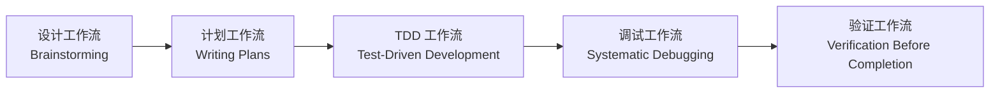

# 核心工作流：系统化开发流程

本章节介绍 Superpowers 的五大核心工作流，帮助你建立系统化的开发习惯。这些工作流强制遵循最佳实践，确保代码质量、可维护性和团队协作效率。

::: info 为什么需要核心工作流？
AI 代理虽然强大，但如果没有约束，容易"偷懒"或过度理性化。核心工作流为 AI 代理提供了明确的边界和流程，确保每一步都有验证和证据。
:::

## 本章节包含的内容

| 课程 | 描述 | 难度 |
| --- | --- | --- |
| [设计工作流：Brainstorming](../design-workflow/) | 在编码前进行需求澄清和设计，避免方向错误 | ⭐⭐ |
| [计划工作流：Writing Plans](../planning-workflow/) | 编写详细的实施计划，确保无上下文的工程师也能执行 | ⭐⭐⭐ |
| [测试驱动开发：TDD 铁律](../tdd-workflow/) | 深入讲解 RED-GREEN-REFACTOR 循环 | ⭐⭐⭐⭐ |
| [调试工作流：Systematic Debugging](../debugging-workflow/) | 系统化四阶段调试流程，避免盲目修复 | ⭐⭐⭐ |
| [验证工作流：证据优先](../verification-workflow/) | 强调"证据优先"原则，确保在声称完成前有真实验证 | ⭐⭐ |

## 学习路径建议

### 推荐顺序（新手）

1. **先学设计工作流**：理解如何在编码前进行需求澄清
2. **再学计划工作流**：掌握编写可执行计划的技巧
3. **深入 TDD**：这是最核心的开发流程，需要重点学习
4. **学调试工作流**：学会系统化地定位和修复问题
5. **最后学验证工作流**：建立"证据优先"的完成标准

### 进阶学习路径

如果你已经有一定经验，可以按需学习：

- **快速上手**：设计工作流 + TDD 工作流
- **质量提升**：TDD 工作流 + 调试工作流 + 验证工作流
- **团队协作**：计划工作流 + 验证工作流

## 前置条件

::: warning 开始前请确认
- 已完成 [快速开始](../../start/quick-start/)
- 已掌握 [如何使用技能](../../start/using-skills/)
- 理解 Superpowers 的核心概念（技能、子代理、钩子系统）
:::

## 下一步指引

完成本章节学习后，你可以继续：

- [进阶工作流](../../advanced/) - 学习子代理驱动开发、代码审查等高级技巧
- [扩展功能](../../extending/) - 编写自定义技能，为团队贡献
- [常见问题](../../faq/) - 查看最佳实践和故障排除

## 本章节的价值

通过学习核心工作流，你将获得：

- **系统化思维**：不再是"想到什么做什么"，而是有章法地推进开发
- **质量保证**：TDD 铁律和验证工作流确保代码质量
- **效率提升**：设计先行和计划工作流避免方向错误和返工
- **可追溯性**：每个步骤都有明确的证据和文档

::: tip 记住
工作流的本质不是增加流程负担，而是减少不确定性和返工成本。
:::
