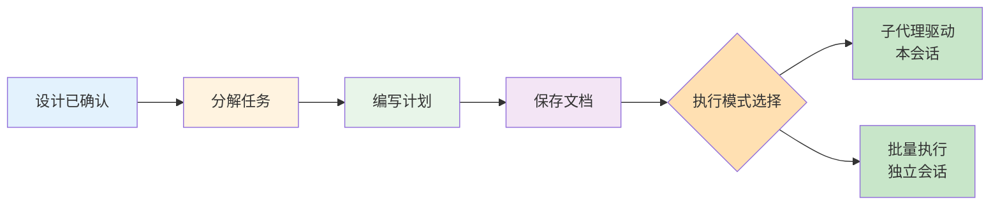

# 计划工作流：Writing Plans

## 学完你能做什么

- 将设计分解为 2-5 分钟一个的可执行小任务
- 编写包含完整代码、文件路径、验证步骤的详细计划
- 确保计划清晰到"零上下文的工程师也能执行"
- 选择合适的执行模式（子代理驱动 vs 批量执行）
- 自动生成格式化的计划文档并保存到项目

## 你现在的困境

**AI 代理经常"跳过计划直接写代码"**

你有没有遇到过这种情况？AI 理解了你的需求后，直接开始写代码，但写了一半才发现：
- 没有测试框架
- 缺少必要的依赖
- 测试覆盖不全
- 提交信息混乱

常见问题：
- ❌ AI 把大功能当成一个任务，写到一半才发现太复杂
- ❌ 计划中只有"实现功能"，没有具体代码或验证步骤
- ❌ 任务之间依赖关系混乱，执行顺序出错
- ❌ 缺少审查检查点，问题积累到后期才发现

这些问题的根源：**AI 没有将工作分解为足够小的任务，并记录完整执行细节。**

## 什么时候用这一招

Writing Plans 技能在以下场景自动触发：

| 场景 | 示例 |
| ---- | ---- |
| **有规格/需求的多步任务** | 设计文档已确认，需要实现 |
| **功能开发** | "实现用户认证系统"（设计已完成） |
| **Bug 修复** | "修复登录超时问题"（根因已确定） |
| **重构工作** | "重构数据访问层"（目标已明确） |

**核心原则**：设计确认后，编码前必须写计划。

## 核心思路

Writing Plans 工作流的核心假设是：**假设执行计划的工程师对代码库零上下文，而且品味存疑。**

这意味着计划必须包含：
- 精确的文件路径（创建哪些文件、修改哪些文件）
- 完整的代码（不是"添加验证"这种模糊指令）
- 确切的命令和预期输出
- 相关文档引用（需要查阅的现有文档）
- 如何测试的详细步骤



### 任务粒度原则

**每个任务 2-5 分钟完成**，一个动作一个步骤：

| ✅ 正确示例 | ❌ 错误示例 |
| ---------- | ---------- |
| "写一个失败的测试" | "实现用户认证" |
| "运行测试验证失败" | "添加测试" |
| "写最小实现让测试通过" | "修复 bug" |
| "运行测试验证通过" | "更新文档" |
| "提交代码" |  |

### 计划文档结构

每个计划必须包含以下头部信息：

```markdown
# [功能名称] 实施计划

> **给 AI 的提示：必需子技能：使用 superpowers:executing-plans 执行此计划的任务

**目标：** [一句话描述此计划构建的内容]

**架构：** [2-3 句话描述实现方法]

**技术栈：** [关键技术/库]

---
```

### 执行模式选择

计划完成后，AI 会提供两种执行方式：

| 模式 | 描述 | 适用场景 |
| ---- | ---- | -------- |
| **子代理驱动** | 本会话执行，每个任务派发新子代理，任务间快速迭代 | 需要频繁沟通反馈 |
| **批量执行** | 独立会话执行，按批次完成任务，批次间报告审查 | 任务相对独立，可以批量处理 |

## 跟我做

### 第 1 步：触发计划编写

**为什么**
设计确认后，让 AI 自动触发 writing-plans 工作流，编写详细实施计划。

**操作示例**

```
用户输入：
设计文档已经确认好了，我们开始实施吧。

AI 回复：
好的，我来编写实施计划。我正在使用 writing-plans 技能。

（AI 读取设计文档）
（AI 分析实现步骤）
（AI 分解任务）
```

**你应该看到**：AI 宣布使用 writing-plans 技能，开始编写计划。

### 第 2 步：分解任务

**为什么**
将大功能分解为 2-5 分钟的小任务，确保每个任务可独立完成和验证。

**操作示例**

```
AI 回复：
我已将功能分解为 6 个任务：

**任务 1：Hook 安装脚本**（3 分钟）
- 创建 hook 安装脚本
- 添加权限设置
- 编写测试

**任务 2：恢复模式**（4 分钟）
- 实现 verify 模式
- 实现 repair 模式
- 添加进度报告

**任务 3：错误处理**（3 分钟）
- 添加异常捕获
- 实现友好错误消息
- 测试错误场景

...

所有任务遵循 TDD 流程，每个任务包含完整代码和验证步骤。
```

**你应该看到**：
1. 每个任务明确时间估算（2-5 分钟）
2. 每个任务是一个具体的动作（不是抽象功能）
3. 任务之间的依赖关系清晰

### 第 3 步：编写任务详情

**为什么**
零上下文工程师需要精确的信息：文件路径、完整代码、验证步骤、命令输出。

**操作示例**

```
AI 回复：
现在我编写每个任务的详细步骤。

### 任务 1：Hook 安装脚本

**文件：**
- 创建：`src/hooks/install-hook.js`
- 修改：`package.json:45-48`（添加启动脚本）
- 测试：`tests/hooks/test-install-hook.js`

**步骤 1：编写失败的测试**

```javascript
describe('install-hook', () => {
  it('should create hook directory if not exists', async () => {
    await installHook();
    expect(fs.existsSync('.superpowers/hooks')).toBe(true);
  });
});
```

**步骤 2：运行测试验证失败**

运行：`npm test -- tests/hooks/test-install-hook.js`
预期：FAIL，报错 "install-hook is not defined"

**步骤 3：编写最小实现**

```javascript
import fs from 'fs/promises';
import path from 'path';

export async function installHook() {
  const hooksDir = '.superpowers/hooks';
  await fs.mkdir(hooksDir, { recursive: true });
}
```

**步骤 4：运行测试验证通过**

运行：`npm test -- tests/hooks/test-install-hook.js`
预期：PASS

**步骤 5：提交**

```bash
git add src/hooks/install-hook.js tests/hooks/test-install-hook.js package.json
git commit -m "feat: add hook installation script"
```
```

**你应该看到**：
1. 每个任务列出创建/修改/测试的精确文件路径
2. 每个步骤有完整的代码（不是"添加验证"这种描述）
3. 每个步骤有确切的命令和预期输出
4. TDD 循环：RED → GREEN → COMMIT

### 第 4 步：保存计划文档

**为什么**
将计划保存为文档，便于执行和审查，同时作为项目知识库的一部分。

**操作示例**

```
AI 回复：
计划已编写完成，正在保存到 docs/plans/。

（AI 写入 docs/plans/2026-02-01-hook-recovery-system.md）

AI 继续说：
计划已保存：docs/plans/2026-02-01-hook-recovery-system.md

我现在提交这个计划文档。

（AI 执行 git commit）
```

**你应该看到**：
1. 计划文档保存到 `docs/plans/` 目录
2. 文件名格式：`YYYY-MM-DD-<feature-name>.md`
3. 计划文档已提交到 git

### 第 5 步：选择执行模式

**为什么**
不同的执行模式适合不同的场景，选择正确的模式可以提高效率。

**操作示例**

```
AI 回复：
计划完成并已保存到 `docs/plans/2026-02-01-hook-recovery-system.md`。

有两种执行选项：

**1. 子代理驱动（本会话）**
- 我为每个任务派发新的子代理
- 任务之间进行审查
- 快速迭代，频繁反馈

**2. 批量执行（独立会话）**
- 在新会话中打开 worktree
- 按 3 个任务一批执行
- 批次之间进行审查

你希望使用哪种方式？
```

**你应该看到**：AI 明确提供两种执行方式，并说明各自的优缺点。

```
用户输入：
我想用子代理驱动的方式，因为我们可能需要频繁调整。

AI 回复：
好的，我将使用子代理驱动开发来执行这个计划。

我正在使用 subagent-driven-development 技能。
```

**或者**

```
用户输入：
任务相对独立，我用批量执行吧，我想在另一个终端并行处理其他事情。

AI 回复：
好的，请在 worktree 中打开新的会话，并使用 /write-plan 命令加载这个计划。

新会话会使用 executing-plans 技能，按批次执行任务并在批次之间报告。
```

**你应该看到**：
- 子代理驱动：AI 在当前会话继续执行
- 批量执行：AI 引导你打开新会话，在 worktree 中执行

## 检查点 ✅

**验证 writing-plans 工作流是否正常**

- [ ] AI 在设计确认后自动编写计划
- [ ] 任务粒度为 2-5 分钟一个
- [ ] 每个任务包含精确文件路径
- [ ] 每个步骤有完整代码（不是模糊指令）
- [ ] 每个步骤有确切命令和预期输出
- [ ] TDD 循环：写测试 → 验证失败 → 写实现 → 验证通过 → 提交
- [ ] 计划文档保存到 `docs/plans/` 目录
- [ ] 计划文档已提交到 git
- [ ] AI 提供两种执行方式供选择

如果以上任何一项不符合预期，可能是技能加载问题，请检查[安装指南](../../start/installation/)或[故障排除](../../faq/troubleshooting/)。

## 踩坑提醒

### ❌ 踩坑 1：任务太大，无法 2-5 分钟完成

**症状**：计划中有"实现用户认证"、"重构数据层"这样的任务。

**原因**：AI 未遵循"任务粒度"原则。

**解决方法**：
- 提醒 AI："每个任务应该在 2-5 分钟内完成"
- 如果任务太大，要求 AI 继续分解："请将任务 1 分解为更小的步骤"

### ❌ 踩坑 2：计划中只有"做 X"，没有具体代码

**症状**：步骤内容是"添加验证逻辑"、"编写测试"，但没有代码示例。

**原因**：AI 未遵循"完整代码"原则。

**解决方法**：
- 提醒 AI："请提供完整的代码示例"
- 强调"假设工程师零上下文，需要确切的实现"

### ❌ 踩坑 3：缺少文件路径

**症状**：任务中没有明确说明要创建或修改哪些文件。

**原因**：AI 未遵循"精确文件路径"原则。

**解决方法**：
- 要求 AI 在每个任务中列出"文件"部分
- 格式：`创建：`、`修改：path:line-range`、`测试：`

### ❌ 踩坑 4：缺少验证步骤

**症状**：代码写完后没有运行测试或验证的步骤。

**原因**：AI 跳过了 TDD 验证。

**解决方法**：
- 提醒 AI："每个任务必须包含验证步骤"
- 确保"步骤 2：运行测试验证失败"和"步骤 4：运行测试验证通过"都存在

### ❌ 踩坑 5：未提交代码就进入下一个任务

**症状**：测试通过后直接写下一个任务的代码，没有 commit。

**原因**：AI 未遵循"频繁提交"原则。

**解决方法**：
- 确保 TDD 循环的最后一步是"步骤 5：提交"
- 提交信息应该明确：`feat: add specific feature`

### ❌ 踩坑 6：选择错误的执行模式

**症状**：用批量执行处理需要频繁反馈的任务，导致返工；或用子代理驱动处理独立任务，效率低。

**原因**：未根据任务特点选择合适的执行模式。

**解决方法**：
- **需要频繁反馈** → 子代理驱动（任务间快速审查）
- **任务相对独立** → 批量执行（批次间报告，可以并行工作）

## 本课小结

Writing Plans 是 Superpowers 核心工作流的第 3 步，它确保：

1. **零上下文假设**：假设工程师对代码库零上下文，记录所有必要信息
2. **任务粒度**：每个任务 2-5 分钟，一个动作一个步骤
3. **完整代码**：不使用"添加验证"这种模糊指令，提供确切实现
4. **TDD 循环**：写测试 → 验证失败 → 写实现 → 验证通过 → 提交
5. **计划文档化**：保存到 `docs/plans/`，便于执行和审查
6. **执行模式选择**：提供子代理驱动和批量执行两种方式

**记住**：writing-plans 不是建议，而是强制工作流。AI 会在设计确认后自动触发这个技能。

## 下一课预告

> 下一课我们学习 **[测试驱动开发：TDD 铁律](../tdd-workflow/)**。
>
> 计划执行过程中，你会学到：
> - 如何遵循 RED-GREEN-REFACTOR 循环
> - 纠正常见的 TDD 误解（如"先写实现再写测试"）
> - 为什么无测试不写代码是铁律

---

## 附录：源码参考

<details>
<summary><strong>点击展开查看源码位置</strong></summary>

> 更新时间：2026-02-01

| 功能        | 文件路径                                                                                    | 行号    |
| ----------- | ------------------------------------------------------------------------------------------- | ------- |
| Writing Plans 技能定义 | [`skills/writing-plans/SKILL.md`](https://github.com/obra/superpowers/blob/main/skills/writing-plans/SKILL.md) | 1-117   |
| /write-plan 命令定义 | [`commands/write-plan.md`](https://github.com/obra/superpowers/blob/main/commands/write-plan.md) | 1-7     |
| Executing Plans 技能定义 | [`skills/executing-plans/SKILL.md`](https://github.com/obra/superpowers/blob/main/skills/executing-plans/SKILL.md) | 1-85    |
| 子代理驱动开发技能定义 | [`skills/subagent-driven-development/SKILL.md`](https://github.com/obra/superpowers/blob/main/skills/subagent-driven-development/SKILL.md) | 1-243   |
| 工作流概述 | [`README.md`](https://github.com/obra/superpowers/blob/main/README.md) | 80-96   |

**关键原则**：
- 零上下文假设（Zero context assumption）- 假设工程师对代码库零上下文
- 任务粒度（Bite-sized tasks）- 每个任务 2-5 分钟完成
- 完整代码（Complete code）- 提供确切实现，不是模糊指令
- TDD 循环（RED-GREEN-REFACTOR）- 写测试 → 验证失败 → 写实现 → 验证通过 → 提交
- DRY（Don't Repeat Yourself）- 避免重复代码
- YAGNI（You Aren't Gonna Need It）- 只做当前需要的功能
- 频繁提交（Frequent commits）- 每个任务完成后提交

**关键流程**：
- 编写计划：读取设计文档 → 分解任务（2-5 分钟/任务）→ 编写详细步骤（完整代码 + 验证）→ 保存到 `docs/plans/YYYY-MM-DD-<feature-name>.md` → 提交到 git
- 执行模式选择：子代理驱动（本会话，快速迭代） vs 批量执行（独立会话，批次报告）
- 子代理驱动：派发实现子代理 → 规格符合性审查 → 代码质量审查 → 下一任务
- 批量执行：批判性审查计划 → 执行第一批（默认 3 个任务）→ 报告 → 下一批次

**执行模式对比**：
| 维度 | 子代理驱动 | 批量执行 |
| ---- | ---------- | -------- |
| 会话 | 本会话（无上下文切换） | 独立会话（新 worktree） |
| 代理 | 每个任务新子代理 | 同一代理执行一批任务 |
| 审查 | 每个任务后自动审查 | 批次之间报告，等待人工审查 |
| 迭代 | 快速（任务间无需人工干预） | 慢（批次间需人工反馈） |
| 适用场景 | 需要频繁调整 | 任务相对独立，可并行 |

</details>
