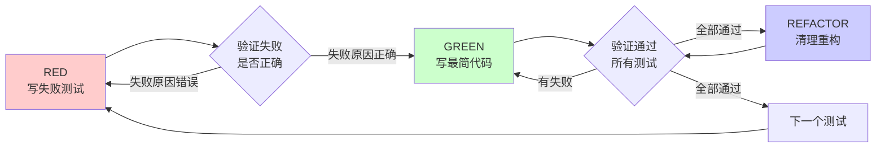

# 测试驱动开发：TDD 铁律

## 学完你能做什么

- 强制 AI 代理严格遵循 RED-GREEN-REFACTOR 循环
- 识别和纠正常见的 TDD 合理化借口（如"这个很简单""我已经手动测试过了"）
- 在新功能、Bug 修复和重构中正确应用 TDD
- 验证测试是否真的在测试正确的东西（先看它失败）
- 编写高质量测试（单一行为、清晰名称、展示意图）
- 使用验证清单确保 TDD 流程完整执行

## 你现在的困境

**AI 代理经常跳过测试直接写代码**

你有没有遇到过这种情况？你对 AI 说"帮我修复这个 bug"，它马上就开始改代码，但修复后你发现又引入了新问题。

常见问题：
- ❌ AI 说"这个很简单，不用测试"
- ❌ 写完代码后补测试，测试立刻通过（说明什么都没测到）
- ❌ 修复一个 bug，引入三个新 bug
- ❌ 重构后功能突然失效
- ❌ "我已经手动测试过了，放心吧"

这些问题的根源：**AI 在写代码前没有先写测试**。

::: info 什么是 TDD？

TDD（Test-Driven Development，测试驱动开发）是一种开发方法论，要求在写生产代码之前先写测试。

核心循环：
1. **RED**：写一个失败的测试
2. **GREEN**：写最简单的代码让它通过
3. **REFACTOR**：清理和重构代码

**关键原则**：如果你没看到测试失败，你就不知道它测试的是对的东西。
:::

## 什么时候用这一招

TDD 技能会在以下场景自动触发：

| 场景 | 示例 |
| ---- | ---- |
| **新功能** | "帮我加个用户评论功能" |
| **Bug 修复** | "修复空邮箱被接受的问题" |
| **重构** | "重构这个函数，让它更清晰" |
| **行为变化** | "改变按钮的点击逻辑" |

**例外情况（需要人工授权）**：
- 丢弃的原型代码
- 自动生成的代码
- 配置文件

**核心铁律**：
```
NO PRODUCTION CODE WITHOUT A FAILING TEST FIRST
（没有失败的测试，就不写生产代码）
```

## 核心思路

TDD 的核心是 RED-GREEN-REFACTOR 循环，每个阶段都有强制验证步骤：



### RED 阶段：写失败测试

写一个展示预期行为的**最小测试**。

**测试质量要求**：
- ✅ 单一行为（测试名包含 "and" 就要拆分）
- ✅ 清晰名称（描述行为，不是 `test1`）
- ✅ 展示意图（说明代码应该做什么，而不是怎么做）
- ✅ 使用真实代码（除非不可避免，否则不用 mock）

### 验证 RED：看它失败

**强制性要求，绝不能跳过。**

确认事项：
- 测试失败（不是报错）
- 失败信息符合预期
- 失败是因为功能缺失（不是拼写错误）

如果测试立刻通过？那你在测试已有的行为，需要修改测试。
如果测试报错？先修复错误，直到它正确失败。

### GREEN 阶段：写最简代码

写**最简单的代码**让测试通过。

**关键原则**：
- 不添加额外功能
- 不重构其他代码
- 不"改进"超出测试范围
- 避免过度工程化（YAGNI 原则）

### 验证 GREEN：看它通过

**强制性要求。**

确认事项：
- 测试通过
- 其他测试仍然通过
- 输出干净（没有错误、警告）

如果其他测试失败？现在就修复，不要推迟。

### REFACTOR 阶段：清理代码

在保持测试通过的前提下：
- 移除重复代码
- 改善命名
- 提取辅助函数

**关键**：不添加新行为，保持所有测试绿色。

## 跟我做

### 第 1 步：修复 Bug - 写失败测试

**为什么**
通过测试先失败，确保它真的在测试这个 bug。

**实战示例：修复空邮箱被接受的 bug**

```typescript
// RED 阶段：写失败测试
test('拒绝空邮箱', async () => {
  const result = await submitForm({ email: '' });
  expect(result.error).toBe('Email required');
});
```

**你应该看到**：这是一个清晰、单一的测试，描述了期望的行为。

### 第 2 步：验证 RED - 看测试失败

**为什么**
确认测试确实在测试这个 bug，而不是测试已有行为。

**操作示例**

```bash
$ npm test submitForm.test.ts

FAIL submitForm.test.ts
  ● 拒绝空邮箱

    expect(result.error).toBe('Email required')
    Received: undefined

      at Object.<anonymous> (submitForm.test.ts:3:28)
```

**你应该看到**：测试失败，错误信息显示 `result.error` 是 `undefined`，说明功能确实缺失。

::: warning 检查点
如果测试**立刻通过**，说明你测试的是已有行为，需要修改测试。
如果测试**报错**（如语法错误），先修复错误，再运行。
:::

### 第 3 步：GREEN - 写最简代码

**为什么**
写最简单的代码让测试通过，避免过度工程化。

**操作示例**

```typescript
// GREEN 阶段：写最简代码
function submitForm(data: FormData) {
  if (!data.email?.trim()) {
    return { error: 'Email required' };
  }
  // ... 其他逻辑
}
```

**应该注意**：
- 只添加验证空邮箱的逻辑
- 不添加其他验证规则
- 不重构现有代码
- 保持最简单

### 第 4 步：验证 GREEN - 看测试通过

**为什么**
确认修复有效，且没有破坏其他功能。

**操作示例**

```bash
$ npm test submitForm.test.ts

PASS submitForm.test.ts
  ✓ 拒绝空邮箱

Test Suites: 1 passed, 1 total
Tests:       1 passed, 1 total
```

**你应该看到**：测试通过，没有其他错误。

::: warning 检查点
如果有**其他测试失败**，现在就修复，不要推迟。
如果有**警告或错误输出**，清理干净后再继续。
:::

### 第 5 步：REFACTOR - 清理代码

**为什么**
在保持测试通过的前提下，改善代码质量。

**操作示例**

假设需要验证多个字段：

```typescript
// REFACTOR 阶段：提取验证逻辑
function validateRequired(fields: Record<string, string>, fieldName: string) {
  const value = fields[fieldName]?.trim();
  if (!value) {
    return { error: `${fieldName} required` };
  }
}

function submitForm(data: FormData) {
  const emailError = validateRequired(data, 'email');
  if (emailError) return emailError;

  const passwordError = validateRequired(data, 'password');
  if (passwordError) return passwordError;

  // ... 其他逻辑
}
```

**验证重构**

```bash
$ npm test

PASS submitForm.test.ts
  ✓ 拒绝空邮箱
  ✓ 拒绝空密码

Test Suites: 1 passed, 1 total
Tests:       2 passed, 2 total
```

**你应该看到**：所有测试仍然通过，代码更清晰。

### 第 6 步：新功能 - 重复循环

**为什么**
每个新行为都从 RED 开始。

**实战示例：添加邮箱格式验证**

```typescript
// RED 阶段：新测试
test('拒绝无效邮箱格式', async () => {
  const result = await submitForm({ email: 'invalid-email' });
  expect(result.error).toBe('Invalid email format');
});
```

**验证 RED**：

```bash
$ npm test submitForm.test.ts

FAIL submitForm.test.ts
  ● 拒绝无效邮箱格式

    expect(result.error).toBe('Invalid email format')
    Received: undefined
```

**GREEN 阶段**：

```typescript
function isValidEmail(email: string): boolean {
  const emailRegex = /^[^\s@]+@[^\s@]+\.[^\s@]+$/;
  return emailRegex.test(email);
}

function submitForm(data: FormData) {
  // ... 验证必填字段

  if (data.email && !isValidEmail(data.email)) {
    return { error: 'Invalid email format' };
  }

  // ... 其他逻辑
}
```

**验证 GREEN**：

```bash
$ npm test submitForm.test.ts

PASS submitForm.test.ts
  ✓ 拒绝空邮箱
  ✓ 拒绝无效邮箱格式
```

## 检查点 ✅

**验证 TDD 流程是否完整**

- [ ] 每个新函数/方法都有测试
- [ ] 实现前先看测试失败（验证 RED）
- [ ] 每个测试失败原因正确（功能缺失，不是拼写错误）
- [ ] 写了最简单的代码让测试通过
- [ ] 所有测试通过（验证 GREEN）
- [ ] 输出干净（无错误、警告）
- [ ] 测试使用真实代码（只在不可避免时用 mock）
- [ ] 覆盖边界情况和错误处理

如果以上任何一项不符合，说明跳过了 TDD，需要重新开始。

::: danger 铁律违反
如果发现写了代码但没有失败的测试，必须：
1. 删除代码
2. 从 RED 阶段重新开始

不要"保留作为参考"，不要"一边写测试一边改代码"。
直接删除意味着删除，这是修复 TDD 流程的唯一方法。
:::

## 踩坑提醒

### ❌ 踩坑 1："这个很简单，不用测试"

**症状**：AI 说"这个功能只有几行代码，不值得写测试"。

**问题**：简单代码也会出错，测试只需要 30 秒。

**解决方法**：
- 强制原则：越简单的代码越应该测试
- 提醒 AI："遵循 TDD，先写测试"

### ❌ 踩坑 2："我先写代码，再补测试"

**症状**：代码写完了，测试立刻通过（什么都没测到）。

**问题**：测试后补无法验证测试的正确性。

**解决方法**：
- 铁律：先写失败的测试
- 如果已经写了代码，必须删除并重新开始

### ❌ 踩坑 3："测试后补也能达到同样效果"

**症状**：AI 说"测试写前写后都一样，何必纠结顺序"。

**问题**：
- 测试后补回答"这个代码做什么？"（验证已有实现）
- 测试先写回答"这个代码应该做什么？"（定义预期行为）
- 测试后补受实现偏差影响，容易遗漏边界情况

**解决方法**：
- 强调：先写测试才能发现边界情况
- 测试后补只能验证你记得的情况，而不是应该测试的情况

### ❌ 踩坑 4："我已经手动测试过了"

**症状**：AI 说"我手动测过了，所有边界情况都覆盖了"。

**问题**：
- 手动测试是临时的，无法重复
- 没有测试记录，代码变更后无法验证
- 压力下容易遗漏情况

**解决方法**：
- 自动化测试是系统性的，每次都一样
- 手动测试 ≠ 全面测试
- "我试过能工作" ≠ 全面覆盖

### ❌ 踩坑 5："删除 X 小时的代码是浪费"

**症状**：AI 写了 2 小时代码后，发现没有测试，不愿删除。

**问题**：沉没成本谬误。时间是浪费了，但保留不信任的代码是技术债务。

**解决方法**：
- 选择 1：删除并用 TDD 重写（X 小时，高信心）
- 选择 2：保留并补测试（30 分钟，低信心，可能仍有 bug）
- 真正的浪费是保留无法信任的代码

### ❌ 踩坑 6："TDD 太教条了，我是务实的"

**症状**：AI 以"务实"为借口跳过 TDD。

**问题**：TDD 本身就是务实的：
- 在提交前发现 bug（比调试快）
- 防止回归（测试立即捕获破坏）
- 记录行为（测试展示如何使用代码）
- 支持重构（自由修改，测试捕获问题）

"务实"的快捷方式 = 生产环境调试 = 更慢。

### ❌ 踩坑 7："测试通过说明不了问题，我直接改代码"

**症状**：AI 认为先写测试浪费时间，直接改代码更快。

**问题**：
- 如果代码已经通过测试，说明测试什么都没测到
- 测试先写强制你看到它失败，证明它真的在测试东西
- 测试后补你永远不知道测试是否正确

**解决方法**：
- 核心原则：如果你没看到测试失败，你不知道它在测试什么
- 测试先写 = 边界情况发现
- 测试后补 = 记住的边界情况验证

## Red Flags - 必须重新开始

如果出现以下任何情况，**删除代码，用 TDD 重新开始**：

- [ ] 测试前写了代码
- [ ] 实现后补测试
- [ ] 测试立刻通过
- [ ] 无法解释测试为什么失败
- [ ] 测试"稍后"添加
- [ ] 合理化"就这一次"
- [ ] "我已经手动测试过了"
- [ ] "测试后补也能达到同样目的"
- [ ] "这是精神不是仪式"
- [ ] "保留作为参考"或"修改现有代码"
- [ ] "已经花了 X 小时，删除是浪费"
- [ ] "TDD 太教条了，我是务实的"
- [ ] "这个情况不同，因为..."

**记住：违反规则的字面意思就是违反规则的精神。**

## 本课小结

TDD 技能通过 RED-GREEN-REFACTOR 循环，确保：

1. **测试驱动**：先写失败的测试，再看它失败，证明测试正确
2. **最简实现**：写最简单的代码让测试通过，避免过度工程化
3. **验证必查**：每个阶段都必须验证（RED 确实失败，GREEN 确实通过）
4. **清理重构**：在测试保护下安全重构，提升代码质量
5. **零容忍**：任何违反铁律的行为都必须重新开始

**记住**：TDD 不是建议，而是强制工作流。AI 会在任何功能实现、Bug 修复或重构前自动触发这个技能。

## 下一课预告

> 下一课我们学习 **[调试工作流：Systematic Debugging](../debugging-workflow/)**。
>
> 当 TDD 测试失败时，你会学到：
> - 如何系统化地定位根本原因
> - 四阶段调试流程（观察、假设、验证、修复）
> - 避免"盲目修改"的常见陷阱
> - 确保修复真正解决问题，而不是掩盖症状

---

## 附录：源码参考

<details>
<summary><strong>点击展开查看源码位置</strong></summary>

> 更新时间：2026-02-01

| 功能        | 文件路径                                                                                    | 行号    |
| ----------- | ------------------------------------------------------------------------------------------- | ------- |
| TDD 技能定义 | [`skills/test-driven-development/SKILL.md`](https://github.com/obra/superpowers/blob/main/skills/test-driven-development/SKILL.md) | 1-372   |
| 工作流概述 | [`README.md`](https://github.com/obra/superpowers/blob/main/README.md) | 80-96   |

**关键原则**：
- 铁律：无失败的测试，不写生产代码（No production code without a failing test first）
- 核心原则：如果你没看到测试失败，你就不知道它测试的是对的东西
- 违反规则的字面意思就是违反规则的精神（Violating letter of rules is violating spirit of rules）

**铁律违反处理**：
- 写代码前没写测试？删除代码，重新开始
- 不保留"参考代码"，不"一边写测试一边改代码"
- 删除意味着删除，这是修复 TDD 流程的唯一方法

**RED-GREEN-REFACTOR 循环**：
1. **RED**：写失败测试 → 验证失败正确性（不是报错，不是已通过）
2. **GREEN**：写最简代码 → 验证所有测试通过
3. **REFACTOR**：清理重构 → 保持测试绿色

**质量标准**：
- 单一行为（One behavior）：测试名包含 "and" 就要拆分
- 清晰名称（Clear name）：描述行为，不是 `test1`
- 展示意图（Shows intent）：说明应该做什么，不是怎么做
- 使用真实代码（Real code）：除非不可避免，否则不用 mock

**常见合理化借口**（需要识别并纠正）：
- "这个很简单，不用测试" - 简单代码也会出错
- "我先写代码，再补测试" - 测试后补无法验证正确性
- "测试后补也能达到同样效果" - 测试先写定义行为，测试后补验证实现
- "我已经手动测试过了" - 手动测试是临时的，无法重复
- "删除 X 小时的代码是浪费" - 沉没成本谬误，保留不信任的代码是技术债务
- "TDD 太教条了，我是务实的" - TDD 本身就是务实的（更早发现 bug、防止回归）
- "测试通过说明不了问题" - 测试先写才能证明测试正确性

**Red Flags - 必须重新开始的信号**：
- 测试前写了代码
- 实现后补测试
- 测试立刻通过
- 无法解释测试为什么失败
- 测试"稍后"添加
- 任何形式的合理化借口

**例外情况**（需要人工授权）：
- 丢弃的原型代码
- 自动生成的代码
- 配置文件

**Bug 修复示例**（从源码提取）：
- Bug：空邮箱被接受
- RED：写测试 `expect(result.error).toBe('Email required')`
- 验证 RED：测试失败，错误信息 `undefined`
- GREEN：添加 `if (!data.email?.trim())` 检查
- 验证 GREEN：测试通过
- REFACTOR：提取验证逻辑（如果需要）

**验证清单**：
- [ ] 每个新函数/方法都有测试
- [ ] 实现前先看测试失败
- [ ] 每个测试失败原因正确（功能缺失，不是拼写错误）
- [ ] 写了最简单的代码让测试通过
- [ ] 所有测试通过
- [ ] 输出干净（无错误、警告）
- [ ] 测试使用真实代码（mocks 只在不可避免时）
- [ ] 边界情况和错误处理覆盖

</details>
