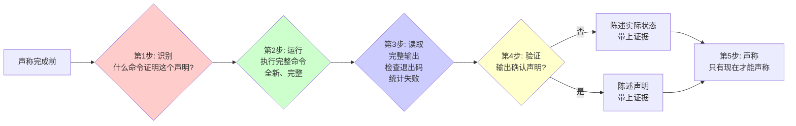

# 验证工作流：证据优先

## 学完你能做什么

- 强制 AI 代理在声称完成前运行验证命令并提供证据
- 识别和阻止各种"偷懒"行为（如"应该通过了""看起来没问题"）
- 正确应用门函数流程（识别 → 运行 → 读取 → 验证 → 声称）
- 区分真实验证和部分验证（Linter ≠ 编译器，代理报告 ≠ 实际验证）
- 避免合理化借口（"就这一次""我很自信"）
- 在提交、PR 创建、任务完成前强制验证

## 你现在的困境

**AI 代理经常声称完成但没有验证**

你有没有遇到过这种情况？AI 说"修复完成了"，但你运行测试发现还是失败。或者 AI 说"测试通过了"，但你检查输出发现有 3 个失败。

常见问题：
- ❌ AI 说"应该没问题了"（但实际上没运行验证）
- ❌ AI 依赖之前的测试结果（没有重新运行）
- ❌ AI 认为 Linter 通过就意味着构建成功
- ❌ AI 信任代理的"成功"报告（但没有独立验证）
- ❌ AI 表达满意度后才想起来验证（"太好了！让我验证一下..."）

这些问题的根源：**AI 在声称完成前没有提供真实验证证据**。

::: info 什么是证据优先？

证据优先（Evidence First）是一种工作原则，要求在做出任何完成声明前，必须先运行验证命令并检查输出。

核心铁律：
```
无验证命令，无完成声明
```

这意味着：
- 你在本消息中没有运行验证，就不能声称它通过
- 信任代理报告 = 没有验证
- 部分验证（如只看 Linter）≠ 完整验证
:::

## 什么时候用这一招

验证技能会在以下场景自动触发：

| 场景 | 示例 |
| ---- | ---- |
| **声称完成** | "修复完成了"、"任务完成" |
| **声称通过** | "测试通过了"、"Linter 干净" |
| **声称成功** | "构建成功"、"部署成功" |
| **表达满意度** | "太好了！"、"完美！"、"搞定！" |
| **提交/PR 前** | "我要提交了"、"创建 PR" |
| **代理完成后** | "代理报告成功" |
| **移动到下一任务** | "这个任务完成了，下一个" |

**核心铁律**：
```
NO COMPLETION CLAIMS WITHOUT FRESH VERIFICATION EVIDENCE
（无验证证据，不声称完成）
```

**触发条件**：
- 任何形式的成功/完成声明
- 任何表达满意的话语
- 任何正面陈述工作状态
- 提交、PR 创建、任务完成前

## 核心思路

验证工作流的核心是**门函数（Gate Function）**，在声称任何状态或表达满意度前必须通过。



### 门函数 5 步流程

**第 1 步：识别**
- 问题：什么命令能证明这个声明？
- 示例：声明"测试通过" → 识别命令 `npm test`

**第 2 步：运行**
- 要求：执行**完整**命令（全新、完整）
- 示例：运行 `npm test -- --coverage`（不是 `npm test` 看个大概）

**第 3 步：读取**
- 要求：读取完整输出，检查退出码，统计失败
- 示例：检查输出"Tests: 34 passed, 2 failed"

**第 4 步：验证**
- 要求：输出确认声明？
- 否：陈述实际状态 + 证据
- 是：陈述声明 + 证据

**第 5 步：声称**
- 要求：只有现在才能声称

**关键规则**：跳过任何一步 = 说谎，不是验证

### 验证铁律

```
如果你在本消息中没有运行验证命令，你就不能声称它通过。
```

**违反示例**：
- ❌ "应该通过了"（没运行）
- ❌ "之前通过了，应该没问题"（不是全新验证）
- ❌ "Linter 通过了"（部分验证）
- ❌ "代理报告成功"（没有独立验证）
- ❌ "看起来没问题"（主观判断，没有命令输出）

**正确示例**：
- ✅ `[Run npm test] [See: 34/34 pass] "所有测试通过"`
- ✅ `[Run build] [See: exit 0] "构建成功"`
- ✅ `[Run linter] [See: 0 errors] "代码整洁"`

## 跟我做

### 第 1 步：识别验证命令

**为什么**
知道用什么命令证明你的声明，避免盲目猜测或使用错误的验证方法。

**实战示例：声称"测试通过"**

**识别命令**：
```bash
npm test
```

**你应该看到**：一个明确的验证命令，能够测试你要声明的内容。

::: tip 提示
不同的声明需要不同的验证命令：
- "测试通过" → `npm test`
- "构建成功" → `npm run build`
- "Linter 干净" → `npm run lint`
- "Bug 修复" → 复现原始症状的测试
:::

### 第 2 步：运行完整命令

**为什么**
执行完整、全新的验证，避免依赖缓存或部分输出。

**操作示例**

```bash
$ npm test
```

**应该注意**：
- 运行**完整**命令（不省略参数）
- **全新**运行（不依赖之前的输出）
- 等待完整执行完成

**你应该看到**：完整的命令执行过程和输出。

::: warning 检查点
不要依赖之前的测试结果。每次声称完成前都必须重新运行验证。
:::

### 第 3 步：读取完整输出

**为什么**
完整读取输出，检查退出码，统计失败，避免只看"看起来没问题"的表面。

**操作示例**

```bash
$ npm test

PASS src/utils/format.test.ts
PASS src/components/Button.test.ts
FAIL src/api/user.test.ts
  ● User API
    expect(mockUser.id).toBe(1)
    Received: undefined

Test Suites: 2 passed, 1 failed, 3 total
Tests:       18 passed, 2 failed, 20 total
```

**你应该看到**：
- 完整的测试输出
- 失败的测试数量（2 failed）
- 失败的具体原因（`mockUser.id` 是 `undefined`）

**关键检查**：
- 退出码是什么？（非零 = 失败）
- 有多少失败？（2 failed）
- 失败原因是什么？（具体错误信息）

::: danger 警告
不要只看"PASS"的部分，忽略"FAIL"。
不要只看日志"看起来正常"，不检查退出码。
不要只看"大部分通过"，忽略个别失败。
:::

### 第 4 步：验证输出

**为什么**
确认输出是否真的支持你的声明，避免主观判断。

**操作示例**

**情况 1：输出不支持声明**

```bash
$ npm test
Tests: 18 passed, 2 failed, 20 total
```

**正确声明**：
```
"测试运行完成，有 2 个失败：
- User API: mockUser.id 是 undefined
- [另一个失败]

需要修复这些失败后才能声称测试通过。"
```

**情况 2：输出支持声明**

```bash
$ npm test
Test Suites: 1 passed, 1 total
Tests:       34 passed, 34 total
```

**正确声明**：
```
"[Run npm test] [See: 34/34 pass] 所有测试通过。"
```

**你应该看到**：
- 陈述基于实际输出
- 包含具体证据（失败数量、通过数量）
- 不使用"应该"、"可能"等模糊词汇

### 第 5 步：声称结果

**为什么**
只有完成前面 4 步后，才能做出声明。

**操作示例**

**错误示例**（跳过验证）：
```
"测试应该通过了。"
```

**正确示例**（完整验证）：
```
"[Run npm test] [See: 34/34 pass] 所有测试通过。"
```

**错误示例**（部分验证）：
```
"Linter 通过了，所以构建应该没问题。"
```

**正确示例**（完整验证）：
```
"[Run npm run build] [See: exit 0] 构建成功。"
```

**你应该看到**：
- 声明前已经运行验证命令
- 声明中包含验证证据
- 声明明确且准确

## 检查点 ✅

**验证流程是否完整**

- [ ] 识别了验证命令
- [ ] 运行了完整命令（全新、完整）
- [ ] 读取了完整输出（包括失败、错误）
- [ ] 验证了输出是否支持声明
- [ ] 声明中包含具体证据
- [ ] 没有使用"应该"、"可能"等模糊词汇
- [ ] 没有依赖之前的测试结果
- [ ] 没有信任代理报告而独立验证

如果以上任何一项不符合，说明跳过了验证，需要重新开始。

::: danger 铁律违反
如果发现声称完成但没有验证，必须：
1. 撤回声明
2. 运行完整验证
3. 根据实际输出重新声明

不要"应该没问题"，不要"先声明再验证"，不要"相信代理报告"。
验证是声称完成的前提，不是可选步骤。
:::

## 踩坑提醒

### ❌ 踩坑 1："应该通过了"

**症状**：AI 说"代码改好了，应该通过了"。

**问题**：没有运行验证命令，这是猜测不是验证。

**解决方法**：
- 运行验证命令
- 检查实际输出
- 根据输出重新声明

**正确示例**：
```
"让我验证一下... [Run npm test] [See: 34/34 pass] 所有测试通过。"
```

### ❌ 踩坑 2："之前通过了，应该没问题"

**症状**：AI 依赖之前的测试结果，没有重新运行。

**问题**：之前的测试结果不能代表当前状态。

**解决方法**：
- 每次声称完成前都重新运行验证
- 不依赖缓存或历史结果

**正确示例**：
```
"让我重新验证... [Run npm test] [See: 34/34 pass] 所有测试通过。"
```

### ❌ 踩坑 3："Linter 通过了"

**症状**：AI 用 Linter 代替完整的构建或测试验证。

**问题**：Linter ≠ 编译器，Linter 通过不代表构建成功。

**解决方法**：
- Linter 检查代码风格
- 构建命令检查编译
- 测试命令检查功能

**正确示例**：
```
"[Run npm run build] [See: exit 0] 构建成功。"
```

### ❌ 踩坑 4："代理报告成功"

**症状**：AI 信任子代理的"成功"报告，没有独立验证。

**问题**：代理报告 ≠ 实际验证，需要独立确认。

**解决方法**：
- 代理完成后，检查 VCS diff
- 运行自己的验证命令
- 根据实际输出声明状态

**正确示例**：
```
"代理报告成功。让我验证... [Check git diff] [See: 3 files changed] [Run npm test] [See: 34/34 pass] 工作完成。"
```

### ❌ 踩坑 5："看起来没问题"

**症状**：AI 基于主观判断，没有运行命令。

**问题**：主观判断不可靠，需要客观证据。

**解决方法**：
- 运行验证命令
- 检查具体输出
- 不依赖"看起来"

**正确示例**：
```
"让我验证... [Run npm test] [See: 34/34 pass] 测试通过。"
```

### ❌ 踩坑 6："我很自信"

**症状**：AI 用"自信"代替验证。

**问题**：自信 ≠ 证据，必须验证。

**解决方法**：
- 自信很重要，但验证更重要
- 运行命令获取证据

**正确示例**：
```
"我对修改很自信，但让我验证... [Run npm test] [See: 34/34 pass] 确认通过。"
```

### ❌ 踩坑 7："就这一次"

**症状**：AI 用"特殊情况"为借口跳过验证。

**问题**：没有例外，验证是强制要求。

**解决方法**：
- 强制原则：无验证不声称
- 没有特殊情况

**正确示例**：
```
"即使这是小修改，我也要验证... [Run npm test] [See: 1/1 pass] 确认通过。"
```

### ❌ 踩坑 8："我很累了"

**症状**：AI 以"疲劳"为借口跳过验证。

**问题**：疲劳 ≠ 理由，验证没有例外。

**解决方法**：
- 疲劳时更要验证
- 疲劳容易出错

**正确示例**：
```
"我很累了，但必须验证... [Run npm test] [See: 34/34 pass] 确认通过。"
```

## 常见失败案例

| 声明 | 需要什么 | 不充分 |
| ---- | ---- | ---- |
| 测试通过 | 测试命令输出：0 失败 | 之前运行、"应该通过" |
| Linter 干净 | Linter 输出：0 错误 | 部分检查、推断 |
| 构建成功 | 构建命令：退出码 0 | Linter 通过、日志看起来正常 |
| Bug 修复 | 测试原始症状：通过 | 代码改了、假设修复了 |
| 回归测试工作 | 红绿循环已验证 | 测试通过一次 |
| 代理完成 | VCS diff 显示变更 | 代理报告"成功" |
| 需求满足 | 逐行检查清单 | 测试通过 |

## Red Flags - 必须停止

如果出现以下任何情况，**立即停止并验证**：

- 使用"应该"、"可能"、"看起来"
- 在验证前表达满意度（"太好了！"、"完美！"、"完成！"）
- 准备提交/推送/PR 但没有验证
- 信任代理成功报告
- 依赖部分验证
- 想"就这一次"
- 累了，想让工作结束
- **任何暗示成功但没有运行验证的措辞**

## 合理化预防

| 借口 | 现实 |
| ---- | ---- |
| "应该能工作" | 运行验证 |
| "我很自信" | 自信 ≠ 证据 |
| "就这一次" | 没有例外 |
| "Linter 通过了" | Linter ≠ 编译器 |
| "代理说成功" | 独立验证 |
| "我很累了" | 疲劳 ≠ 理由 |
| "部分检查够了" | 部分证明不了什么 |
| "换个说法规则就不适用" | 精神重于字面 |

## 本课小结

验证技能通过证据优先原则，确保：

1. **铁律强制**：无验证命令，无完成声明
2. **门函数流程**：识别 → 运行 → 读取 → 验证 → 声称
3. **完整验证**：全新运行、完整输出、独立确认
4. **零容忍**：跳过任何一步 = 说谎
5. **拒绝合理化**：没有例外，没有"应该"，没有"就这一次"

**记住**：验证不是建议，而是强制工作流。AI 会在任何声称完成前自动触发这个技能。

## 下一课预告

> 下一课我们学习 **[子代理驱动开发](../../advanced/subagent-development/)**。
>
> 当任务变得复杂时，你会学到：
> - 如何利用子代理实现快速迭代
> - 自动审查和验证机制
> - 在主会话中调度多个子任务
> - 保持代码质量和最佳实践

---

## 附录：源码参考

<details>
<summary><strong>点击展开查看源码位置</strong></summary>

> 更新时间：2026-02-01

| 功能        | 文件路径                                                                                    | 行号    |
| ----------- | ------------------------------------------------------------------------------------------- | ------- |
| 验证技能定义 | [`skills/verification-before-completion/SKILL.md`](https://github.com/obra/superpowers/blob/main/skills/verification-before-completion/SKILL.md) | 1-140   |
| 工作流概述 | [`README.md`](https://github.com/obra/superpowers/blob/main/README.md) | 80-96   |

**核心原则**：
- 铁律：无验证命令，无完成声明（No completion claims without fresh verification evidence）
- 核心原则：证据优先，永远如此（Evidence before claims, always）
- 违反规则的字面意思就是违反规则的精神（Violating letter of this rule is violating spirit of this rule）

**门函数流程**：
1. **识别**（IDENTIFY）：什么命令证明这个声明？
2. **运行**（RUN）：执行完整命令（全新、完整）
3. **读取**（READ）：完整输出，检查退出码，统计失败
4. **验证**（VERIFY）：输出确认声明？
   - 否：陈述实际状态 + 证据
   - 是：陈述声明 + 证据
5. **声称**（ONLY THEN）：只有现在才能声称

**关键规则**：
- 跳过任何一步 = 说谎，不是验证
- 如果在本消息中没有运行验证命令，就不能声称它通过
- 没有例外，没有"就这一次"

**常见失败案例**：
- 测试通过：需要测试命令输出 0 失败（不是"应该通过"）
- Linter 干净：需要 Linter 输出 0 错误（不是部分检查）
- 构建成功：需要构建命令退出码 0（不是 Linter 通过）
- Bug 修复：需要测试原始症状通过（不是代码改了就假设修复）
- 回归测试工作：需要红绿循环验证（不是测试通过一次）
- 代理完成：需要检查 VCS diff（不是信任代理报告）
- 需求满足：需要逐行检查清单（不是测试通过）

**Red Flags - 必须停止**：
- 使用"should"、"probably"、"seems to"
- 在验证前表达满意度
- 准备提交/推送/PR 但没有验证
- 信任代理成功报告
- 依赖部分验证
- 想"就这一次"
- 累了，想让工作结束
- **任何暗示成功但没有运行验证的措辞**

**合理化预防**（源码中的借口 vs 现实）：
- "Should work now" → RUN 验证
- "I'm confident" → 自信 ≠ 证据
- "Just this once" → 没有例外
- "Linter passed" → Linter ≠ 编译器
- "Agent said success" → 独立验证
- "I'm tired" → 疲劳 ≠ 理由
- "Partial check is enough" → 部分证明不了什么
- "Different words so rule doesn't apply" → 精神重于字面

**关键模式**：
- 测试：`✅ [Run test command] [See: 34/34 pass] "All tests pass"` / `❌ "Should pass now"`
- 回归测试（TDD 红绿）：`✅ Write → Run (pass) → Revert fix → Run (MUST FAIL) → Restore → Run (pass)` / `❌ "I've written a regression test"`
- 构建：`✅ [Run build] [See: exit 0] "Build passes"` / `❌ "Linter passed"`
- 需求：`✅ Re-read plan → Create checklist → Verify each → Report gaps or completion` / `❌ "Tests pass, phase complete"`
- 代理委托：`✅ Agent reports success → Check VCS diff → Verify changes → Report actual state` / `❌ Trust agent report`

**为什么重要**（从 24 个失败记忆中提取）：
- 人类伙伴说"我不相信你" - 信任破裂
- 未定义的函数被发布 - 会崩溃
- 缺失的需求被发布 - 不完整的功能
- 在虚假完成上浪费时间 → 重定向 → 重做
- 违反："诚实是核心价值。如果你说谎，你将被替换。"

**应用场景**：
**ALWAYS before**（总是在以下情况前）：
- 任何成功/完成声明的变体
- 任何表达满意度
- 任何关于工作状态的正面陈述
- 提交、PR 创建、任务完成
- 移动到下一个任务
- 委托给代理

**Rule applies to**（规则适用于）：
- 确切短语
- 改写和同义词
- 成功的暗示
- 任何暗示完成/正确性的交流

**底线**：
- 验证没有捷径
- 运行命令，读取输出，然后声明结果
- 这是不可商量的

</details>
