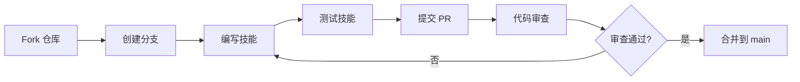

# 贡献指南

## 学完你能做什么

- 完成技能贡献的完整流程（Fork → 分支 → 测试 → PR）
- 遵循技能编写规范（frontmatter、描述、结构）
- 使用子代理测试技能（压力场景、验证有效性）
- 提交符合规范的 Pull Request

## 你现在的困境

**你写了一个很棒的技能，想分享给社区**

你已经按照 [编写自定义技能](../writing-skills/) 的教程创建了一个技能，测试也通过了。现在你想把它分享给更多人使用，让其他开发者也能受益。

常见问题：
- ❌ 不知道 PR 流程，提交的 PR 被打回
- ❌ 技能不符合规范，需要反复修改
- ❌ 没有测试技能就提交， reviewer 发现问题
- ❌ 不知道如何与社区协作，沟通不畅

这些问题会导致：贡献受阻、浪费时间、社区反馈差。

**核心问题**：缺少系统化的贡献流程指南。

::: info 什么是贡献？

贡献是指将自己编写的技能提交到 Superpowers 官方仓库，让社区用户也能使用。

Superpowers 的所有技能都直接存放在仓库中，通过 Fork + PR 的方式接受社区贡献。

---

## 什么时候用这一招

**你已经准备好了一个经过测试的技能**

满足以下条件时，考虑贡献：
- ✅ 技能遵循 TDD 方法论（RED-GREEN-REFACTOR）
- ✅ 使用子代理测试过，验证有效性
- ✅ 技能具有普适性（不是项目特定的）
- ✅ 技能文档完整（frontmatter、描述、示例）

::: warning 不适合贡献的情况

以下情况不建议提交 PR：
- 项目特定的技能（放在你的个人技能目录）
- 未经测试的技能（必须先测试）
- 与现有技能重复的（先检查是否已存在）
- 纯文档性质的（参考其他技能，不要重复发明轮子）
:::

---

## 🎒 开始前的准备

### 必备条件

开始前，请确认：

- [ ] 已有 GitHub 账号
- [ ] 已完成 [编写自定义技能](../writing-skills/) 教程
- [ ] 已完成 [测试技能](../testing-skills/) 教程
- [ ] 技能已通过子代理测试验证
- [ ] 熟悉 Git 基本操作（clone、branch、commit、push）

### 技能规范检查

提交前，确保技能符合以下规范：

| 规范项 | 要求 | 来源 |
| ------- | ---- | ---- |
| **Frontmatter** | 只包含 `name` 和 `description` | `writing-skills/SKILL.md:96` |
| **name** | 仅字母、数字、连字符，无特殊字符 | `writing-skills/SKILL.md:98` |
| **description** | 第三人称，以 "Use when..." 开头 | `writing-skills/SKILL.md:99` |
| **描述长度** | frontmatter 总计 ≤ 1024 字符 | `writing-skills/SKILL.md:97` |
| **技能长度** | 常用技能 <200 词，其他 <500 词 | `writing-skills/SKILL.md:217` |
| **测试验证** | 必须通过子代理压力测试 | `writing-skills/SKILL.md:373` |

---

## 核心思路

**贡献流程遵循标准的开源协作模式**



**核心原则**：
1. **质量优先**：未经测试的技能不提交
2. **规范遵循**：严格遵守技能编写规范
3. **协作友好**：提供清晰的 PR 描述和测试证据
4. **持续迭代**：根据 reviewer 反馈改进

---

## 跟我做

### 第 1 步：Fork 仓库

**为什么**
你需要一个可写的仓库副本，用于开发技能并提交 PR。

```bash
# 访问 GitHub 仓库
open https://github.com/obra/superpowers
```

在 GitHub 页面上：
1. 点击右上角 "Fork" 按钮
2. 选择你的账号作为目标
3. 等待 Fork 完成

**你应该看到**：GitHub 创建了一个 `your-username/superpowers` 仓库。

---

### 第 2 步：克隆你的 Fork

**为什么**
将 Fork 的仓库克隆到本地，进行技能开发和测试。

```bash
# 克隆你的 Fork（替换 your-username）
git clone https://github.com/your-username/superpowers.git
cd superpowers
```

**你应该看到**：当前目录是 `superpowers`，包含完整的仓库内容。

---

### 第 3 步：创建技能分支

**为什么**
隔离开发环境，保持 `main` 分支清洁。

```bash
# 创建并切换到新分支（使用技能名称）
git checkout -b add-your-skill-name

# 例如：
git checkout -b add-condition-based-waiting
```

**你应该看到**：Git 提示 "Switched to a new branch 'add-your-skill-name'"。

::: tip 命名规范

分支名使用 `add-` 或 `fix-` 前缀 + 技能名称：
- ✅ `add-condition-based-waiting`
- ✅ `fix-tdd-workflow-example`
- ❌ `my-skill`
- ❌ `skill-update`
:::

---

### 第 4 步：编写技能

**为什么**
创建技能文件，按照规范编写内容。

```bash
# 在 skills/ 目录下创建技能目录
mkdir -p skills/your-skill-name

# 创建 SKILL.md 文件
touch skills/your-skill-name/SKILL.md
```

**编写 SKILL.md**：

```yaml
---
name: your-skill-name
description: Use when [specific triggering conditions and symptoms]
---

# Your Skill Name

## Overview
Core principle in 1-2 sentences.

## When to Use
- Symptom 1
- Symptom 2

## Core Pattern
[Before/after code comparison]

## Quick Reference
[Table for scanning common operations]

## Common Mistakes
- Mistake 1: description
- Mistake 2: description
```

**你应该看到**：`skills/your-skill-name/SKILL.md` 文件包含完整的技能内容。

::: tip 参考完整指南

详细的技能编写规范，请参考 [编写自定义技能](../writing-skills/) 教程和 `skills/writing-skills/SKILL.md` 文件。
:::

---

### 第 5 步：测试技能

**为什么**
确保技能能有效约束 AI 代理，符合 TDD 方法论。

参考 [测试技能](../testing-skills/) 教程，使用子代理进行压力测试：

```bash
# 使用子代理测试技能（在 Claude Code 或 OpenCode 中）
# 测试场景：
# 1. 基线测试：不加技能，观察代理违规行为
# 2. 合规测试：加入技能，验证代理遵守规则
# 3. 压力测试：施加时间、疲劳等压力，验证技能有效性
```

**你应该看到**：
- 基线测试：代理违反规则（RED）
- 合规测试：代理遵守技能（GREEN）
- 压力测试：代理在高压下仍遵守规则

::: warning 铁律

**NO SKILL WITHOUT A FAILING TEST FIRST**

参考 `writing-skills/SKILL.md:373`，必须先运行基线测试，证明代理会违反规则，然后再编写技能。
:::

---

### 第 6 步：提交更改

**为什么**
将技能文件和测试记录提交到本地仓库。

```bash
# 查看修改状态
git status

# 添加新技能文件
git add skills/your-skill-name/

# 提交更改
git commit -m "Add your-skill-name: short description of what it does"

# 例如：
git commit -m "Add condition-based-waiting: eliminates race conditions in async tests"
```

**你应该看到**：Git 提示 "X files changed, X insertions(+)"。

::: tip 提交信息规范

使用清晰的提交信息：
- ✅ "Add condition-based-waiting: eliminates race conditions"
- ✅ "Fix TDD workflow: add missing refactoring step"
- ❌ "Add skill"
- ❌ "Update documentation"
:::

---

### 第 7 步：推送到 Fork

**为什么**
将本地分支推送到 GitHub Fork，为创建 PR 做准备。

```bash
# 推送分支到远程仓库
git push origin add-your-skill-name
```

**你应该看到**：Git 输出类似 "Branch 'add-your-skill-name' set up to track remote branch..."。

---

### 第 8 步：创建 Pull Request

**为什么**
向原仓库提交 PR，请求合并你的技能。

1. 访问你的 Fork 仓库：
   ```bash
   open https://github.com/your-username/superpowers
   ```

2. 在 GitHub 页面上：
   - 点击 "Compare & pull request" 按钮
   - 确保 base repository 是 `obra/superpowers`（不是你的 Fork）
   - 确保 base branch 是 `main`
   - 确保 compare branch 是你的新分支（如 `add-your-skill-name`）

3. 填写 PR 信息：

   **标题格式**：
   ```
   Add skill-name: short description
   ```

   **描述模板**：
   ```markdown
   ## What this skill does

   [1-2 sentences describing the skill's purpose]

   ## Testing evidence

   [Describe how you tested this skill with subagents]

   - Baseline test: [what agents did without skill]
   - Compliance test: [how agents complied with skill]
   - Pressure test: [how agents handled time/pressure constraints]

   ## Checklist

   - [ ] Skill follows frontmatter spec (name + description only)
   - [ ] Name uses only letters, numbers, hyphens
   - [ ] Description starts with "Use when..." and is third-person
   - [ ] Skill tested with subagents (RED-GREEN-REFACTOR)
   - [ ] No untested changes committed
   ```

4. 点击 "Create pull request"

**你应该看到**：GitHub 创建了 PR，并显示自动检查结果（如果有 CI）。

---

### 检查点 ✅

**验证 PR 提交正确**：

在 PR 页面上检查：

| 检查项 | 预期结果 | 不符合时的操作 |
| ------- | --------- | ------------ |
| **PR 标题** | 格式为 "Add skill-name: description" | 编辑 PR 标题 |
| **描述完整性** | 包含测试证据和 checklist | 补充描述 |
| **文件变更** | 只新增 `skills/your-skill-name/` | 清理无关修改 |
| **技能文件** | 包含 SKILL.md 和必要支持文件 | 补充文件 |
| **Frontmatter** | 只有 name 和 description | 修正 frontmatter |

---

## 踩坑提醒

### 常见错误

| 错误 | 解决方法 |
| ---- | -------- |
| **PR 提交到自己的 Fork** | 确保 base repository 是 `obra/superpowers` |
| **忘记测试技能** | 必须先完成 [测试技能](../testing-skills/) 教程 |
| **Frontmatter 格式错误** | 检查 YAML 语法，字符串用双引号包裹 |
| **描述不符合规范** | 确保以 "Use when..." 开头，第三人称 |
| **技能太长** | 删减冗余内容，目标 <500 词（常用 <200 词） |

### Review 反馈处理

**Review 指出问题后**：

1. 不要情绪化，专注于技术改进
2. 逐项回应 reviewer 的评论
3. 在本地修改后，推送到同一分支
4. PR 会自动更新，无需重新创建

::: tip 响应最佳实践

"感谢 feedback！我已修复 frontmatter 格式问题，并补充了压力测试场景。请再次 review。"
:::

---

## 本课小结

贡献技能是参与 Superpowers 社区的重要方式。通过 Fork + PR 的标准流程，你可以将经过 TDD 测试的技能分享给更多人。

**核心要点**：
- ✅ Fork 仓库，创建分支进行开发
- ✅ 严格遵循技能编写规范（frontmatter、描述、结构）
- ✅ 使用子代理测试技能（RED-GREEN-REFACTOR）
- ✅ 提交清晰的 PR，包含测试证据和 checklist
- ✅ 友好响应 reviewer 反馈，持续改进

---

## 下一课预告

> 下一课我们学习 **[常见问题与故障排除](../../faq/troubleshooting/)**。
>
> 你会学到：
> - 技能加载失败的常见原因
> - 跨平台兼容性问题
> - 性能优化技巧
> - 社区支持渠道

---

## 附录：源码参考

<details>
<summary><strong>点击展开查看源码位置</strong></summary>

> 更新时间：2026-02-01

| 功能        | 文件路径                                                                                     | 行号    |
| ----------- | -------------------------------------------------------------------------------------------- | ------- |
| 贡献流程   | [`README.md`](https://github.com/obra/superpowers/blob/main/README.md#L133-L142)                     | 133-142  |
| 技能编写规范 | [`skills/writing-skills/SKILL.md`](https://github.com/obra/superpowers/blob/main/skills/writing-skills/SKILL.md) | 1-656    |
| MIT 许可证  | [`LICENSE`](https://github.com/obra/superpowers/blob/main/LICENSE)                                 | 全文     |

**关键原则**：
- **Fork → 分支 → 测试 → PR**：标准的开源贡献流程
- **TDD 方法论**：No skill without failing test first
- **质量优先**：未经测试的技能不提交

**参考教程**：
- [编写自定义技能](../writing-skills/)：详细的技能编写规范
- [测试技能](../testing-skills/)：子代理测试方法

</details>
