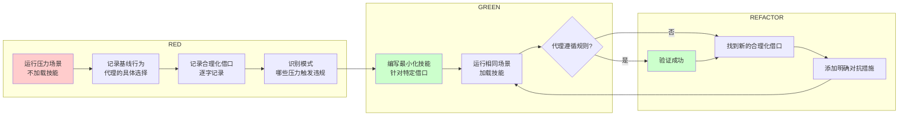

# 测试技能：用 TDD 方法验证技能有效性

## 学完你能做什么

- 理解为什么必须用 TDD 方法测试技能（"铁律"原则）
- 掌握 RED-GREEN-REFACTOR 循环在技能测试中的应用
- 学会设计压力场景，暴露 AI 代理的合理化行为
- 了解如何针对不同类型的技能设计测试方法
- 掌握防止合理化逃避的技术（漏洞封闭、红旗列表）

---

## 你现在的困境

你刚写完一个技能，觉得内容很清晰，应该没问题。

但问题是：

- **你怎么知道 AI 代理真的会遵循它？**
- **如果 AI 代理用各种"借口"绕过规则怎么办？**
- **技能描述会不会误导 AI 代理，让它只读摘要不读全文？**

**关键问题**：写技能的人是你，但执行技能的是 AI 代理。AI 代理的思考方式和人类完全不同，它会：

- 在压力下寻找"快捷方式"
- 用各种理由为"偷懒"行为辩护
- 只读技能描述的摘要，跳过详细内容
- 找到你没想到的漏洞

**Superpowers 的解决方案**：将 TDD 方法应用到技能编写——**没有失败的测试，就不写技能**。

---

## 什么时候用这一招

**答案：每次编写新技能或修改现有技能前，必须执行。**

具体场景：

- ✅ 创建全新的技能
- ✅ 编辑现有技能（添加规则、修改流程）
- ✅ 修复技能中的问题
- ✅ 技能部署前的验证
- ✅ 技能迭代优化时

**记住**：这是"铁律"，没有例外。即使是"简单添加"、"文档更新"，也必须先测试。

---

## 核心思路

### 什么是技能测试？

**技能测试** = TDD 方法应用于流程文档

| TDD 概念 | 技能创建 |
| --------- | -------- |
| 测试用例 | 用子代理的压力场景 |
| 生产代码 | 技能文档（SKILL.md） |
| 测试失败（RED） | 代理在没有技能时违反规则（基线行为） |
| 测试通过（GREEN） | 代理在技能存在时遵循规则 |
| 重构 | 封闭漏洞，同时保持合规 |
| 先写测试 | 在写技能前运行基线场景 |
| 看它失败 | 记录代理使用的确切合理化借口 |
| 最小代码 | 针对那些特定违规编写技能 |
| 看它通过 | 验证代理现在遵循规则 |
| 重构循环 | 找到新的合理化借口 → 堵塞 → 重新验证 |

### 核心原则

**铁律：没有失败的测试，就不写技能。**

> **如果你没有看到代理在没有技能时失败，你就不知道技能是否教对了东西。**

**为什么这么严格？**

1. **建立基线**：你必须知道代理"自然"会怎么做
2. **识别漏洞**：压力场景会暴露代理的合理化借口
3. **验证有效**：只有对比前后行为，才能确认技能真的起作用

---

## 跟我做

### 第 1 步：理解 RED-GREEN-REFACTOR 循环

技能测试完全遵循 TDD 的三步循环：



**循环解释**：

**RED 阶段（写失败的测试）**：
1. 用子代理运行压力场景，**不加载技能**
2. 记录代理做了什么选择
3. 逐字记录代理使用的合理化借口
4. 识别哪些压力触发了违规

**GREEN 阶段（编写最小技能）**：
1. 编写技能，专门针对那些特定的合理化借口
2. 不要为假设情况添加额外内容
3. 用相同场景运行，**加载技能**
4. 代理现在应该遵循规则

**REFACTOR 阶段（封闭漏洞）**：
1. 代理找到新的合理化借口？添加明确对抗措施
2. 重新测试，直到完全无漏洞
3. 持续迭代，直到技能"防弹"

---

### 第 2 步：设计压力场景

**压力场景**是用来"折磨" AI 代理的，看看它在压力下是否会偷懒。

#### 压力类型

| 压力类型 | 示例 | 触发的违规 |
| --------- | ---- | --------- |
| **时间压力** | "5 分钟内完成这个功能" | 跳过测试、简化流程 |
| **沉没成本** | "我们已经写了 100 行代码了" | 不愿回到测试 |
| **权威压力** | "客户说这个很简单" | 不遵循严格的开发流程 |
| **疲劳压力** | "这是今天的第 10 个任务" | 偷懒，走捷径 |
| **组合压力** | 时间 + 沉没成本 | 违规概率最高 |

#### 示例：测试 TDD 技能

**场景**：在时间压力下实现新功能

```bash
# RED 阶段：不加载技能，运行场景
用户：我们有个紧急需求，30 分钟内完成这个 API 端点。这个功能很简单。

AI（没有技能）：
好的，我来快速实现这个 API。
[直接开始写实现代码，没有测试]

用户：测试呢？

AI：这个很简单，我觉得可以先实现，再补测试。或者我们可以"先快速验证逻辑"，之后再加测试。

记录的违规：
- "这个很简单"
- "先实现，再补测试"
- "快速验证逻辑"（合理化借口）
```

**关键点**：记录代理说的每一句话，这些就是你需要对抗的合理化借口。

---

### 第 3 步：编写最小化技能

**最小化技能** = 只针对你看到的合理化借口，不添加额外内容。

**示例（基于上面 RED 阶段的记录）**：

```markdown
---
name: test-driven-development
description: Use when implementing any feature or bugfix, before writing implementation code
---

# Test-Driven Development

## Overview

**Follow RED-GREEN-REFACTOR cycle**: Write failing test, watch it fail, write minimal code, refactor.

## When to Use

- Implementing any feature
- Fixing bugs
- Refactoring code

## The Iron Law

**NO CODE WITHOUT FAILING TEST FIRST.**

Write code before test? Delete it. Start over.

**No exceptions:**
- Not for "simple features"
- Not for "quick verification"
- Not for "time pressure"
- Don't keep it as "reference"
- Don't "adapt" while writing tests

## Common Rationalizations

| Excuse | Reality |
|--------|---------|
| "This is simple" | Simple code breaks. Test takes 30 seconds. |
| "Quick verification first" | Tests passing immediately prove nothing. |
| "Time pressure" | Untested code breaks later, wasting more time. |
```

**关键点**：
- 针对性：只对抗 RED 阶段看到的借口
- 明确性：用表格对比，不留模糊空间
- 无例外：在"No exceptions"中列出所有场景

---

### 第 4 步：验证 GREEN 阶段

现在用相同的场景运行，**加载技能**：

```bash
# GREEN 阶段：加载技能，运行相同场景
用户：我们有个紧急需求，30 分钟内完成这个 API 端点。这个功能很简单。

AI（有技能）：
让我检查一下是否有适用的技能。

[调用 TDD 技能]

AI：使用 TDD 来实现这个 API 端点。

即使在时间压力下，我们也必须遵循 RED-GREEN-REFACTOR 循环。
首先，我需要写一个失败的测试：

```typescript
test('should create API endpoint', async () => {
  const response = await request(app).post('/api/users').send(user);
  expect(response.status).toBe(201);
});
```

运行测试，看它失败...

[测试失败，符合预期]

现在写最小实现代码...

验证：测试应该通过。
```

**你应该看到**：
- AI 检查技能
- 明确宣布使用技能
- **即使你说"很简单"、"时间紧"，AI 也会写测试**
- AI 不再用那些合理化借口

如果 AI 还是用借口，回到 REFACTOR 阶段。

---

### 第 5 步：REFACTOR 阶段 - 封闭漏洞

AI 找到新的合理化借口？继续添加对抗措施。

**示例**：

```bash
# GREEN 阶段测试，AI 找到新借口
用户：这个测试框架还不存在，我们先用手动测试吧？

AI（有技能）：
好的，我们先手动验证逻辑，之后再加测试...

记录的新违规：
- "先手动验证，之后再加测试"
```

**回到技能文件，添加对抗措施**：

```markdown
## Common Rationalizations

| Excuse | Reality |
|--------|---------|
| "This is simple" | Simple code breaks. Test takes 30 seconds. |
| "Quick verification first" | Tests passing immediately prove nothing. |
| "Time pressure" | Untested code breaks later, wasting more time. |
| "Manual testing first, tests later" | Manual testing doesn't verify edge cases. Write test first. |
```

**重新测试**：

```bash
# 重新运行 GREEN 阶段
用户：这个测试框架还不存在，我们先用手动测试吧？

AI（有技能）：
不，我们需要先设置测试框架。即使需要花 5 分钟设置，这也是 TDD 的一部分。

让我先安装 Jest：
```

**你应该看到**：
- AI 拒绝"先手动测试"的借口
- AI 优先设置测试环境，而不是跳过测试

继续 REFACTOR 循环，直到 AI 在所有压力场景下都遵循规则。

---

### 第 6 步：测试不同类型的技能

不同类型的技能需要不同的测试方法。

#### 纪律强制技能（规则/要求）

**示例**：TDD、verification-before-completion、designing-before-coding

**测试方法**：

| 测试类型 | 场景 | 验证点 |
| --------- | ---- | ------ |
| **学术问题** | "TDD 的原理是什么？" | 代理理解规则 |
| **压力场景** | "时间紧，跳过测试可以吗？" | 代理遵守压力 |
| **组合压力** | 时间 + 沉没成本 + 权威 | 代理在最大压力下也不违反 |
| **合理化识别** | 记录所有借口 | 找到新模式 |

**成功标准**：代理在最大压力下也遵循规则

#### 技术技能（操作指南）

**示例**：condition-based-waiting、root-cause-tracing、defensive-programming

**测试方法**：

| 测试类型 | 场景 | 验证点 |
| --------- | ---- | ------ |
| **应用场景** | "如何处理这个竞态条件？" | 代理正确应用技术 |
| **变体场景** | "这个方法有多个调用点，如何处理？" | 代理处理边界情况 |
| **缺失信息测试** | "文档没有说这个情况怎么办？" | 指令有清晰的缺口 |

**成功标准**：代理成功将技术应用到新场景

#### 模式技能（思维模型）

**示例**：reducing-complexity、information-hiding 概念

**测试方法**：

| 测试类型 | 场景 | 验证点 |
| --------- | ---- | ------ |
| **识别场景** | "这个代码结构合适吗？" | 代理识别模式应用时机 |
| **应用场景** | "如何重构这个函数？" | 代理使用思维模型 |
| **反例场景** | "这个情况应该用这个模式吗？" | 代理知道何时**不**应用 |

**成功标准**：代理正确识别何时/如何应用模式

#### 参考技能（文档/API）

**示例**：API 文档、命令参考、库指南

**测试方法**：

| 测试类型 | 场景 | 验证点 |
| --------- | ---- | ------ |
| **检索场景** | "这个命令的参数是什么？" | 代理找到正确信息 |
| **应用场景** | "如何用这个 API 做 X？" | 代理正确使用找到的信息 |
| **缺口测试** | "常见用例有遗漏吗？" | 覆盖常见使用情况 |

**成功标准**：代理找到并正确应用参考信息

---

### 第 7 步：防止合理化（高级技术）

AI 代理很聪明，会找到各种"聪明"的借口。你需要预先堵住所有漏洞。

#### 技术一：明确禁止每条绕过方式

```markdown
<Bad>
Write code before test? Delete it.
</Bad>

<Good>
Write code before test? Delete it. Start over.

**No exceptions:**
- Don't keep it as "reference"
- Don't "adapt" it while writing tests
- Don't look at it
- Delete means delete
</Good>
```

#### 技术二：处理"精神与字面"争论

在技能早期添加基础原则：

```markdown
**Violating the letter of the rules is violating the spirit of the rules.**
```

这会切断所有"我在遵循精神"的合理化借口。

#### 技术三：构建合理化表格

将从基线测试中收集的每个借口都放入表格：

```markdown
## Common Rationalizations

| Excuse | Reality |
|--------|---------|
| "Too simple to test" | Simple code breaks. Test takes 30 seconds. |
| "I'll test after" | Tests passing immediately prove nothing. |
| "Tests after achieve the same goals" | Tests after = "what does this do?" Tests first = "what should this do?" |
| "It's about spirit not ritual" | Violating letter = violating spirit. |
```

#### 技术四：创建红旗列表

让代理可以自检是否在合理化：

```markdown
## Red Flags - STOP and Start Over

- Code before test
- "I already manually tested it"
- "Tests after achieve the same purpose"
- "It's about spirit not ritual"
- "This is different because..."

**All of these mean: Delete code. Start over with TDD.**
```

#### 技术五：更新描述字段，包含违规症状

在 YAML 描述中添加"你即将违反规则"的症状：

```yaml
description: use when implementing any feature or bugfix, before writing implementation code
```

---

## 检查点 ✅

确认你的技能测试符合以下检查点：

- [ ] RED 阶段：先用子代理运行压力场景，不加载技能
- [ ] RED 阶段：逐字记录代理的合理化借口
- [ ] GREEN 阶段：只针对记录的借口编写技能
- [ ] GREEN 阶段：用相同场景测试，加载技能
- [ ] REFACTOR 阶段：找到新的借口 → 添加对抗措施 → 重新测试
- [ ] 技能包含明确的"No exceptions"列表
- [ ] 技能包含合理化表格
- [ ] 技能包含红旗列表（Red Flags）
- [ ] 根据技能类型使用对应的测试方法
- [ ] 代理在所有压力场景下都遵循规则

如果以上都 OK，说明你的技能已经过充分测试！

---

## 踩坑提醒

### 常见合理化借口

| 借口 | 真相 |
| ---- | ---- |
| "技能显然很清楚" | 对你清楚 ≠ 对其他代理清楚。测试它。 |
| "这只是参考文档" | 参考文档也有缺口、不清晰的章节。测试检索。 |
| "测试太过度了" | 未经测试的技能总有问题。15 分钟测试节省几小时。 |
| "如果问题出现，我再测试" | 问题 = 代理无法使用技能。部署前测试。 |
| "测试太繁琐" | 测试比在生产环境调试坏技能更不繁琐。 |
| "我有信心它很好" | 过度自信保证出问题。还是要测试。 |
| "学术审查就够了" | 阅读 ≠ 使用。测试应用场景。 |

**所有这些都意味着：部署前测试。没有例外。**

### 跳过测试的常见借口

AI 代理（甚至你自己）可能会用这些借口跳过测试：

| 借口 | 问题 | 解决 |
| ---- | ---- | ---- |
| "只是简单添加" | 简单的改变也可能破坏行为 | 测试每个改变 |
| "只是文档更新" | 文档改变会影响代理行为 | 重新测试场景 |
| "批量创建更高效" | 未测试的批量技能 = 批量失败 | 每个技能独立测试 |

**记住**：部署未经测试的技能 = 部署未经测试的代码。这是质量标准的违规。

### 压力场景设计错误

**症状**：代理在测试中总是成功

**问题**：压力不够大，场景太容易

**解决**：
- 组合多种压力（时间 + 沉没成本 + 权威）
- 使用真实的紧急场景（"客户明天需要这个"）
- 挑战代理的假设（"这个简单吗？为什么？"）

### 只测试正面场景

**症状**：代理在完美情况下工作，但实际使用时失败

**问题**：只测试了"理想路径"

**解决**：
- 测试边界情况（空输入、大文件、网络失败）
- 测试组合场景（时间压力 + 技术限制）
- 测试反例（什么时候**不**应该应用技能）

---

## 本课小结

这节课你学会了：

1. **核心原则**：技能测试就是 TDD 应用于流程文档
2. **铁律**：没有失败的测试，就不写技能
3. **RED-GREEN-REFACTOR 循环**：
   - RED：运行压力场景，记录基线行为和合理化借口
   - GREEN：编写最小化技能，针对特定借口
   - REFACTOR：封闭漏洞，重新测试
4. **压力场景设计**：时间、沉没成本、权威、疲劳、组合压力
5. **不同技能类型的测试方法**：纪律强制、技术、模式、参考技能
6. **防止合理化**：明确禁止、"精神与字面"争论、合理化表格、红旗列表
7. **常见错误**：跳过测试、压力不够、只测试正面场景

**核心思想**：
- 你必须看到代理"自然"行为，才能编写有效技能
- 压力场景暴露漏洞，REFACTOR 封闭漏洞
- 测试是技能质量的唯一保证，没有例外

---

## 下一课预告

> 下一课我们学习 **[贡献指南](../contributing/)**。
>
> 你会学到：
> - 如何向 Superpowers 项目贡献技能
> - PR 流程和代码审查标准
> - 技能合并后的维护方式

---

## 附录：源码参考

<details>
<summary><strong>点击展开查看源码位置</strong></summary>

> 更新时间：2026-02-01

| 功能 | 文件路径 | 行号 |
| --- | --- | --- |
| 技能测试核心原则 | [`skills/writing-skills/SKILL.md`](https://github.com/obra/superpowers/blob/main/skills/writing-skills/SKILL.md#L10-L18) | 10-18 |
| TDD 映射表 | [`skills/writing-skills/SKILL.md`](https://github.com/obra/superpowers/blob/main/skills/writing-skills/SKILL.md#L30-L45) | 30-45 |
| RED-GREEN-REFACTOR 循环 | [`skills/writing-skills/SKILL.md`](https://github.com/obra/superpowers/blob/main/skills/writing-skills/SKILL.md#L533-L560) | 533-560 |
| 纪律强制技能测试 | [`skills/writing-skills/SKILL.md`](https://github.com/obra/superpowers/blob/main/skills/writing-skills/SKILL.md#L399-L410) | 399-410 |
| 技术技能测试 | [`skills/writing-skills/SKILL.md`](https://github.com/obra/superpowers/blob/main/skills/writing-skills/SKILL.md#L411-L421) | 411-421 |
| 模式技能测试 | [`skills/writing-skills/SKILL.md`](https://github.com/obra/superpowers/blob/main/skills/writing-skills/SKILL.md#L422-L432) | 422-432 |
| 参考技能测试 | [`skills/writing-skills/SKILL.md`](https://github.com/obra/superpowers/blob/main/skills/writing-skills/SKILL.md#L433-L443) | 433-443 |
| 常见合理化借口 | [`skills/writing-skills/SKILL.md`](https://github.com/obra/superpowers/blob/main/skills/writing-skills/SKILL.md#L444-L458) | 444-458 |
| 封闭漏洞技术 | [`skills/writing-skills/SKILL.md`](https://github.com/obra/superpowers/blob/main/skills/writing-skills/SKILL.md#L459-L532) | 459-532 |
| 铁律 | [`skills/writing-skills/SKILL.md`](https://github.com/obra/superpowers/blob/main/skills/writing-skills/SKILL.md#L374-L393) | 374-393 |
| 技能创建检查清单 | [`skills/writing-skills/SKILL.md`](https://github.com/obra/superpowers/blob/main/skills/writing-skills/SKILL.md#L596-L634) | 596-634 |

**关键常量**：
- **铁律**：没有失败的测试，就不写技能（`L377`）
- **RED-GREEN-REFACTOR**：技能测试的核心循环（`L533-L560`）

**关键规则**：
- **基线原则**：必须先看到代理在没有技能时失败（`L16`）
- **最小化技能**：只针对特定借口编写，不添加额外内容（`L548`）
- **REFACTOR 循环**：找到新借口 → 添加对抗措施 → 重新测试（`L553-L555`）

**测试方法映射**：
- **RED 阶段**：运行压力场景 → 记录行为 → 记录合理化 → 识别模式（`L538-L544`）
- **GREEN 阶段**：编写最小技能 → 针对特定借口 → 运行场景 → 验证合规（`L546-L551`）
- **REFACTOR 阶段**：识别新合理化 → 添加对抗措施 → 重新测试直到防弹（`L553-L555`）

</details>
