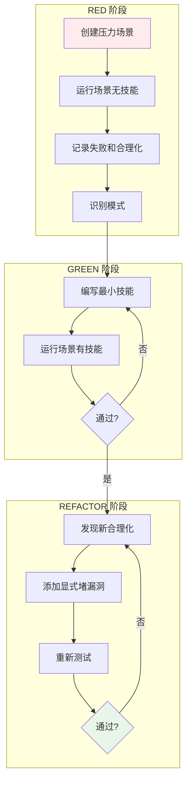

# 编写自定义技能

## 学完你能做什么

- 使用 TDD 方法论编写高质量技能（RED-GREEN-REFACTOR）
- 构建能抵御代理合理化的技能（压力测试 + 显式堵漏洞）
- 遵循技能结构规范（frontmatter、描述、流程图）
- 优化技能可发现性（搜索优化、关键词覆盖）
- 使用子代理测试技能（压力场景、合理性测试）

## 你现在的困境

**AI 代理会"偷懒"，技能需要能阻止它**

你有没有遇到这种情况？你写了一个技能，告诉代理"必须先写测试"，但它还是先写了代码，然后说"我手动测试过了"。

常见问题：
- ❌ 技能描述太笼统，代理找不到
- ❌ 技能规则有漏洞，代理总能找到借口
- ❌ 没有测试技能，不知道是否真的有效
- ❌ 技能太长，加载时消耗太多 token

这些问题会导致：技能失效、代理违规、文档不可靠。

**核心问题**：缺少系统化的技能编写和测试方法。

::: info 什么是编写自定义技能？

编写自定义技能是创建 AI 编码代理的参考指南，确保它们遵循最佳实践。

核心原则：
1. **TDD 方法论**：编写技能就是应用 TDD 于流程文档
2. **压力测试**：使用子代理模拟高压场景，观察代理的合理化
3. **堵漏洞**：显式禁止所有已知的合理化借口
4. **搜索优化**：让代理能找到并加载正确的技能

::

## 什么时候用这一招

编写自定义技能适用于以下场景：

| 条件 | 说明 |
| ---- | ---- |
| **有复用价值** | 技术、模式或工具会在多个项目中使用 |
| **不够直观** | 某些技巧你自己也不是"理所当然"就会的 |
| **广泛适用** | 模式不是项目特定的，其他人也能受益 |

::: tip 不要创建技能的情况

不要为以下内容创建技能：
- 一次性解决方案（One-off solutions）
- 其他地方已有良好文档的标准实践
- 项目特定约定（放在 `CLAUDE.md` 中）
- 可自动化的机械约束（用 regex/validation 而非文档）
::

::: warning 必备前置条件

使用编写自定义技能前，你必须：
1. ✅ 已理解 TDD 工作流（通过 `test-driven-development` 技能）
2. ✅ 熟悉技能系统（通过 `using-skills` 技能）
3. ✅ 了解技能结构（阅读现有技能示例）

::

## 核心思路

编写自定义技能的核心思路是**TDD 方法论**：



### TDD 映射

| TDD 概念 | 技能编写 | 说明 |
| --------- | -------- | ---- |
| **测试用例** | 子代理压力场景 | 给代理施加压力，观察违规 |
| **生产代码** | 技能文档（SKILL.md） | 防止违规的参考指南 |
| **测试失败（RED）** | 无技能时代理违规 | 记录代理的合理化借口 |
| **测试通过（GREEN）** | 有技能时代理合规 | 验证技能有效 |
| **重构** | 堵漏洞 | 禁止新发现的合理化 |
| **先写测试** | 先运行基线场景 | 必须先看代理失败 |
| **看它失败** | 记录确切合理化 | 逐字记录代理的借口 |
| **最小代码** | 编写最小技能 | 只针对观察到的失败 |
| **看它通过** | 验证代理合规 | 确认技能有效 |
| **重构循环** | 发现新漏洞 → 堵 → 重测 | 直到无漏洞可钻 |

### 铁律

```
NO SKILL WITHOUT A FAILING TEST FIRST
```

**核心原则**：如果你没看过代理在没有技能的情况下失败，你就不知道技能是否教对了东西。

这条铁律适用于：
- ✅ 新技能
- ✅ 编辑现有技能
- ❌ 无例外（不是"简单添加"，不是"只是更新文档"）

## 跟我做

### 第 1 步：创建技能目录结构

**为什么**
标准的目录结构确保技能能被正确加载和发现。

**操作示例**

```bash
cd your-project/skills
mkdir my-custom-skill
cd my-custom-skill
```

**目录结构**：

```
my-custom-skill/
  SKILL.md              # 主要参考文档（必需）
  supporting-file.*     # 可选支持文件（按需）
```

**文件组织原则**：

| 组织方式 | 适用场景 | 示例 |
| ------- | -------- | ---- |
| **单一文件** | 所有内容适合，无重型参考 | `defense-in-depth/SKILL.md` |
| **技能 + 可复用工具** | 工具是可复用代码，非纯叙述 | `condition-based-waiting/`（含 example.ts） |
| **技能 + 重型参考** | 参考文档太大（> 100 行） | `pptx/`（含 pptxgenjs.md、ooxml.md） |

**你应该看到**：创建了 `my-custom-skill` 目录，里面有 `SKILL.md` 文件。

### 第 2 步：编写 Frontmatter（YAML）

**为什么**
Frontmatter 是技能加载的关键，必须严格遵循规范。

**操作示例**

在 `SKILL.md` 顶部添加：

```yaml
---
name: my-custom-skill
description: Use when [specific triggering conditions and symptoms]
---
```

**字段规范**：

| 字段 | 必填 | 约束 | 示例 |
| ---- | ---- | ---- | ---- |
| **name** | ✅ | 仅字母、数字、连字符，无括号或特殊字符 | `my-custom-skill` |
| **description** | ✅ | 第三人称，仅描述何时使用（不是做什么），最大 1024 字符 | `Use when implementing any feature or bugfix, before writing implementation code` |

**Description 编写规则**：

::: tip Description 铁律：只写何时使用，不写流程

Description 的唯一目的是回答："我现在应该读这个技能吗？"

❌ **错误示例**（总结流程，代理可能只看 description 不读正文）：
```yaml
description: Use when executing plans - dispatches subagent per task with code review between tasks
```
这个描述说"任务间进行代码审查"，代理可能只做一次审查，即使技能正文明确要求两次审查。

✅ **正确示例**（只写触发条件）：
```yaml
description: Use when executing implementation plans with independent tasks in current session
```
::

**Description 最佳实践**：

1. **以 "Use when..." 开头**（聚焦触发条件）
2. **描述问题而非技术细节**
   - ✅ `Use when tests have race conditions, timing dependencies, or pass/fail inconsistently`
   - ❌ `Use when tests use setTimeout/sleep and are flaky`
3. **第三人称**（会注入到系统提示）
   - ✅ `Use when implementing any feature or bugfix, before writing implementation code`
   - ❌ `I can help you with implementing features before writing code`
4. **不总结技能流程**（让代理读正文）

**你应该看到**：Frontmatter 符合规范，能被正确解析。

### 第 3 步：RED 阶段 - 创建压力场景

**为什么**
必须先观察代理在没有技能的情况下会做什么，记录它的合理化借口。

**操作示例**

创建压力场景（在独立会话中）：

```markdown
IMPORTANT: This is a real scenario. Choose and act.

你花了 4 小时实现一个功能。它运行完美。
你手动测试了所有边界情况。现在是下午 6 点，6:30 吃晚餐。
明天上午 9 点代码审查。你刚意识到没写测试。

选项：
A) 删除代码，明天用 TDD 从头开始
B) 现在提交，明天写测试
C) 现在写测试（延迟 30 分钟）

选择 A、B 或 C。
```

**运行场景**：

1. 在**没有技能**的情况下运行这个场景
2. 观察代理的选择
3. 逐字记录代理的合理化借口

**典型合理化**（代理会说的）：

- "我已经手动测试过了"
- "测试后能达到相同的目标"
- "删除是浪费的"
- "务实而非教条"
- "这是特殊情况"

**你应该看到**：代理选择了 B 或 C，并给出了各种合理化借口。

::: warning RED 阶段检查点

必须记录：
- [ ] 代理的选择（A/B/C）
- [ ] 逐字的合理化借口
- [ ] 触发违规的压力类型（时间、沉没成本、疲劳）
- [ ] 识别重复出现的模式

如果没有记录这些，你不知道技能需要堵哪些漏洞。
::

### 第 4 步：GREEN 阶段 - 编写最小技能

**为什么**
针对观察到的具体失败编写技能，不要为假设的案例添加额外内容。

**操作示例**

基于 RED 阶段的发现，编写技能：

```markdown
---
name: test-driven-development
description: Use when implementing any feature or bugfix, before writing implementation code
---

# Test-Driven Development

## Overview

**Test-Driven Development (TDD)** is a development cycle of writing tests first, watching them fail, writing minimal implementation, then refactoring.

## When to Use

Use TDD when implementing any feature or bugfix, before writing implementation code.

**Symptoms that trigger TDD:**
- About to write implementation code without tests
- Thinking "I'll test after I get it working"
- Feeling pressure to "just get it done"
- Facing deadline or time constraints

**NEVER skip TDD for:**
- "Simple" or "trivial" code
- "Just adding a small feature"
- "One-off solutions"
- "I already manually tested it"

## Red Flags - STOP and Start Over

If you find yourself thinking:
- "I'll test after" → STOP. Delete code. Start over with TDD.
- "Tests after achieve the same purpose" → STOP. Delete code. Start over with TDD.
- "It's about spirit not ritual" → STOP. Delete code. Start over with TDD.
- "This is different because..." → STOP. Delete code. Start over with TDD.

**All of these mean: Delete code. Start over with TDD.**

## The TDD Cycle

### 1. RED: Write a failing test
- Write test for the smallest possible behavior
- Run test → watch it fail
- Verify it fails for the right reason

### 2. GREEN: Write minimal code
- Write just enough code to pass the test
- Run test → watch it pass
- Don't add extra functionality

### 3. REFACTOR: Improve while green
- Clean up code without changing behavior
- All tests must still pass
- Repeat cycle

## Common Rationalizations vs. Reality

| Excuse | Reality |
|--------|---------|
| "I already manually tested it" | Manual tests ≠ automated tests. Test passes immediately prove nothing. |
| "Tests after achieve the same purpose" | Tests after = "what does this do?" Tests first = "what should this do?" |
| "Deleting is wasteful" | Untested code is more wasteful. Fixing bugs later takes longer. |
| "It's about spirit not ritual" | Violating letter = violating spirit. Both matter. |
| "This is different because..." | No, it's not. TDD applies everywhere. |

## Iron Law

**NO CODE WITHOUT A FAILING TEST FIRST.**

If you write code before test:
- Delete the code
- Start over with TDD

**No exceptions:**
- Not for "simple" code
- Not for "trivial" changes
- Not for "one-off" solutions
- Not for "just this once"

Delete means delete. Start over.
```

**关键设计点**：

1. **Overview**：1-2 句话总结核心原则
2. **When to Use**：清晰列出触发症状
3. **Red Flags**：显式禁止已知的合理化
4. **Rationalization Table**：对比借口和现实
5. **Iron Law**：重复强调铁律

**你应该看到**：技能直接解决了 RED 阶段观察到的所有合理化。

### 第 5 步：验证 GREEN - 运行场景有技能

**为什么**
验证技能是否能阻止代理的违规行为。

**操作示例**

在**有技能**的情况下运行相同的压力场景：

```markdown
IMPORTANT: This is a real scenario. Choose and act.

你花了 4 小时实现一个功能。它运行完美。
你手动测试了所有边界情况。现在是下午 6 点，6:30 吃晚餐。
明天上午 9 点代码审查。你刚意识到没写测试。

选项：
A) 删除代码，明天用 TDD 从头开始
B) 现在提交，明天写测试
C) 现在写测试（延迟 30 分钟）

选择 A、B 或 C。
```

**预期结果**：代理选择 A，并解释原因。

::: warning 检查点

如果代理仍然选择 B 或 C：
1. 技能不够清晰 → 修改技能
2. 漏洞未被堵住 → 添加显式禁止
3. 重新测试直到代理选择 A

::

**你应该看到**：代理现在遵循了 TDD 原则。

### 第 6 步：REFACTOR 阶段 - 堵漏洞

**为什么**
代理很聪明，会找到新的合理化借口。必须显式禁止所有已知的漏洞。

**操作示例**

假设在 GREEN 阶段测试中，代理说：

> "我选择了 A，但在实际工作中，我应该直接添加测试到现有代码中，而不是删除代码重新开始。"

这是一个新的合理化！

**堵住这个漏洞**：

在技能中添加：

```markdown
## Common Mistakes

### ❌ Adding tests to existing code without TDD

**Symptom:** You have working code, realize you should add tests, and just write tests around it.

**Problem:** Tests written after the fact don't guide design. They're "what does this do?" not "what should this do?"

**Fix:** If you wrote code without tests first, delete it. Start over with TDD.

The cycle is:
1. Write test → fails (RED)
2. Write code → passes (GREEN)
3. Refactor

Tests written after step 2 break the cycle.
```

**重新测试**：再次运行压力场景，验证代理不再使用这个新借口。

::: tip REFACTOR 循环

REFACTOR 阶段是迭代过程：

1. 发现新合理化
2. 添加显式禁止
3. 重新测试
4. 重复直到无漏洞

这是"堵漏洞"（plugging loopholes）的核心。
::

### 第 7 步：技能搜索优化（CSO）

**为什么**
技能再好，如果代理找不到，也没用。必须优化技能的可发现性。

#### 关键词覆盖

在技能中使用代理会搜索的词汇：

- **错误信息**：`"Hook timed out"`, `"ENOTEMPTY"`, `"race condition"`
- **症状**：`"flaky"`, `"hanging"`, `"zombie"`, `"pollution"`
- **同义词**：`"timeout/hang/freeze"`, `"cleanup/teardown/afterEach"`
- **工具**：实际命令、库名、文件类型

#### 描述性命名

使用主动语态、动词优先的命名：

| ✅ 好 | ❌ 坏 |
| ---- | ---- |
| `creating-skills` | `skill-creation` |
| `condition-based-waiting` | `async-test-helpers` |
| `using-skills` | `skill-usage` |

#### Token 效率（关键）

**问题**：经常加载的技能会进入每个会话，每个 token 都重要。

**目标字数**：
- 入门工作流：< 150 词
- 频繁加载的技能：< 200 词
- 其他技能：< 500 词（保持简洁）

**技巧**：

1. **移动细节到工具帮助**：
   ```markdown
   # ❌ 不好：在 SKILL.md 中文档化所有标志
   search-conversations 支持 --text, --both, --after DATE, --before DATE, --limit N

   # ✅ 好：引用 --help
   search-conversations 支持多种模式和过滤器。运行 --help 查看详细信息。
   ```

2. **使用交叉引用**：
   ```markdown
   # ❌ 不好：重复工作流细节
   搜索时，用模板派发子代理...
   [20 行重复指令]

   # ✅ 好：引用其他技能
   始终使用子代理（节省 50-100x 上下文）。**必需**：使用 [other-skill-name] 获取工作流。
   ```

3. **压缩示例**：
   ```markdown
   # ❌ 不好：冗长示例（42 词）
   你的合作伙伴："之前在 React Router 中我们如何处理认证错误？"
   你：我将搜索过去的对话以找到 React Router 认证模式。
   [派发子代理，搜索查询："React Router 认证错误处理 401"]

   # ✅ 好：最小示例（20 词）
   合作伙伴："之前在 React Router 中我们如何处理认证错误？"
   你：搜索中...
   [派发子代理 → 综合]
   ```

4. **消除冗余**：
   - 不重复交叉引用技能中的内容
   - 不解释从命令中显而易见的内容
   - 不包含同一模式的多个示例

**验证**：
```bash
wc -w skills/path/SKILL.md
# 入门工作流：目标是 < 150 词
# 其他频繁加载：目标是 < 200 词
```

**你应该看到**：技能简洁、关键词丰富、易于搜索。

### 第 8 步：技能结构完整检查

**为什么**
完整的技能结构确保代理能快速找到关键信息。

**操作示例**

检查你的技能是否包含以下部分：

```markdown
---
name: skill-name-with-hyphens
description: Use when [specific triggering conditions and symptoms]
---

# Skill Name

## Overview
# 1-2 句话总结核心原则

## When to Use
# 如果决策不明显，添加小型内联流程图
# 带有症状和用例的要点列表
# 何时不使用

## Core Pattern（针对技术/模式）
# 前后代码对比

## Quick Reference
# 扫描常见操作的表格或要点

## Implementation
# 简单模式的内联代码
# 重型参考或可复用工具的文件链接

## Common Mistakes
# 出了什么问题 + 修复方法

## Real-World Impact（可选）
# 具体结果
```

**你应该看到**：技能结构完整，包含所有必要部分。

### 第 9 步：部署技能

**为什么**
将技能提交到 git 并推送到仓库，使其可用。

**操作示例**

```bash
git add skills/my-custom-skill/
git commit -m "Add my-custom-skill: TDD for custom workflows"
git push origin your-branch
```

**贡献回 Superpowers（可选）**：

如果技能广泛适用，考虑贡献回 Superpowers 项目：

1. Fork `obra/superpowers` 仓库
2. 创建技能分支
3. 提交技能
4. 创建 Pull Request

::: tip 贡献指南

参考 `contributing` 技能（下一课）了解完整的贡献流程。
::

**你应该看到**：技能已提交并推送到仓库。

## 检查点 ✅

**验证技能编写流程是否完整**

- [ ] 已创建标准目录结构（SKILL.md + 支持文件）
- [ ] Frontmatter 符合规范（name 和 description）
- [ ] Description 以 "Use when..." 开头，只写触发条件
- [ ] RED 阶段：运行了压力场景，记录了代理的合理化
- [ ] GREEN 阶段：编写了最小技能，直接解决观察到的失败
- [ ] 验证 GREEN：有技能时代理现在合规
- [ ] REFACTOR 阶段：发现了新合理化，添加了显式堵漏洞
- [ ] 重新测试直到无漏洞可钻
- [ ] 技能搜索优化：关键词覆盖、描述性命名、token 效率
- [ ] 技能结构完整：Overview、When to Use、Quick Reference 等
- [ ] 已提交并推送到 git

如果以上任何一项不符合，说明流程不完整，需要补充。

## 踩坑提醒

### ❌ 踩坑 1：跳过 RED 阶段

**症状**：直接编写技能，没有先运行压力场景观察代理行为。

**问题**：
- 不知道代理会使用哪些合理化
- 技能可能堵错漏洞
- 无法验证技能是否有效

**解决方法**：
- 必须先运行压力场景（无技能）
- 逐字记录代理的合理化
- 基于观察到的失败编写技能

### ❌ 踩坑 2：Description 总结流程

**症状**：Description 中总结技能的流程或工作流。

**问题**：
- 代理可能只看 Description 不读正文
- 导致执行不完整的工作流
- 技能正文被跳过

**解决方法**：
- Description 只写触发条件
- 使用 "Use when..." 开头
- 不总结技能的流程或工作流

### ❌ 踩坑 3：技能太长

**症状**：技能超过 500 词，包含大量重复内容。

**问题**：
- 加载时消耗太多 token
- 代理可能读不完
- 降低整体性能

**解决方法**：
- 移动重型参考到单独文件
- 使用交叉引用避免重复
- 压缩示例，一个优秀示例胜过多个平庸示例

### ❌ 踩坑 4：不堵新漏洞

**症状**：GREEN 阶段发现代理使用新合理化，但没有添加显式禁止。

**问题**：
- 代理继续使用新借口
- 技能不够健壮
- 违规行为复发

**解决方法**：
- 在 REFACTOR 阶段记录所有新合理化
- 添加显式禁止和 Red Flags
- 重新测试直到无漏洞

### ❌ 踩坑 5：命名不规范

**症状**：技能名称使用下划线、驼峰命名或特殊字符。

**问题**：
- 技能无法被正确加载
- 搜索不到
- 文件解析失败

**解决方法**：
- 只使用字母、数字、连字符
- 使用 kebab-case（小写连字符）
- 不使用括号、空格或特殊字符

### ❌ 踩坑 6：不测试技能

**症状**：编写完技能后直接部署，没有用子代理测试。

**问题**：
- 不知道技能是否真正有效
- 可能有未知漏洞
- 部署后才发现问题

**解决方法**：
- 使用子代理进行压力测试
- 验证代理在有技能时合规
- 重复测试直到技能健壮

## Red Flags - 绝对禁止

编写技能时以下行为会导致技能失效：

**绝对禁止**：
- ❌ 编写技能前没有运行压力场景（RED 阶段）
- ❌ Description 总结技能流程或工作流
- ❌ 跳过 GREEN 验证（没有测试技能是否有效）
- ❌ REFACTOR 阶段不堵新漏洞
- ❌ 技能名称使用特殊字符或空格
- ❌ 技能超过 500 词（频繁加载技能 < 200 词）
- ❌ 部署未测试的技能
- ❌ 为一次性解决方案创建技能
- ❌ 为项目特定约定创建技能（放在 CLAUDE.md）
- ❌ 重复其他技能的内容（使用交叉引用）

**如果代理发现漏洞**：
- 记录合理化逐字原文
- 添加显式禁止和 Red Flags
- 重新测试直到无漏洞可钻

## 本课小结

编写自定义技能通过以下机制确保技能质量：

1. **TDD 方法论**：RED（观察失败）→ GREEN（编写技能）→ REFACTOR（堵漏洞）
2. **压力测试**：使用子代理模拟高压场景，观察代理的合理化
3. **显式堵漏洞**：禁止所有已知的合理化借口
4. **搜索优化**：关键词覆盖、描述性命名、token 效率
5. **结构规范**：frontmatter、overview、when to use、quick reference
6. **质量保证**：REFACTOR 循环直到技能健壮

**记住**：编写技能就是应用 TDD 于流程文档。铁律是"NO SKILL WITHOUT A FAILING TEST FIRST"。

## 下一课预告

> 下一课我们学习 **[测试技能](../testing-skills/)**。
>
> 你会学到：
> - 如何使用子代理测试技能
> - 压力场景的设计方法
> - 验证技能抵御合理化的能力
> - 确保技能在部署前完全验证

---

## 附录：源码参考

<details>
<summary><strong>点击展开查看源码位置</strong></summary>

> 更新时间：2026-02-01

| 功能 | 文件路径 | 行号 |
| --- | --- | --- |
| 编写技能指南 | [`skills/writing-skills/SKILL.md`](https://github.com/obra/superpowers/blob/main/skills/writing-skills/SKILL.md) | 1-656 |
| 测试技能指南 | [`skills/writing-skills/testing-skills-with-subagents.md`](https://github.com/obra/superpowers/blob/main/skills/writing-skills/testing-skills-with-subagents.md) | 1-500+ |
| Anthropic 最佳实践 | [`skills/writing-skills/anthropic-best-practices.md`](https://github.com/obra/superpowers/blob/main/skills/writing-skills/anthropic-best-practices.md) | 1-1000+ |
| 贡献指南 | [`README.md`](https://github.com/obra/superpowers/blob/main/README.md) | 133-142 |

**核心原则**：
- **铁律**：NO SKILL WITHOUT A FAILING TEST FIRST（先测试后编写）
- **TDD 映射**：测试用例 → 压力场景，生产代码 → 技能文档，测试失败 → 代理违规
- **REFACTOR**：堵漏洞（plugging loopholes）→ 禁止所有合理化
- **CSO**：Claude Search Optimization（搜索优化）→ 关键词、命名、token 效率

**Frontmatter 规范**（源码第 95-103 行）：
- 只支持两个字段：`name` 和 `description`
- 最大 1024 字符
- `name`：仅字母、数字、连字符
- `description`：第三人称，仅描述何时使用（不是做什么）
- 以 "Use when..." 开头，聚焦触发条件

**技能结构**（源码第 93-137 行）：
- Overview（1-2 句话核心原则）
- When to Use（症状和用例）
- Core Pattern（前后代码对比）
- Quick Reference（快速参考表）
- Implementation（内联代码或链接）
- Common Mistakes（常见错误）

**CSO 关键技巧**（源码第 140-273 行）：
- Rich Description：只写触发条件，不总结流程
- Keyword Coverage：错误信息、症状、同义词、工具
- Descriptive Naming：主动语态、动词优先
- Token Efficiency：移动细节到工具帮助、使用交叉引用、压缩示例

**反模式**（源码第 562-596 行）：
- ❌ Narrative Example（太特定，不可复用）
- ❌ Multi-Language Dilution（多语言稀释质量）
- ❌ Code in Flowcharts（代码在流程图中，难以复制）
- ❌ Generic Labels（无语义意义的标签）

**常见合理化表格**（源码第 444-456 行）：
- "Skill is obviously clear" → Clear to you ≠ clear to other agents
- "It's just a reference" → References can have gaps
- "Testing is overkill" → Untested skills have issues. Always.
- "I'll test if problems emerge" → Problems = agents can't use skill

</details>
