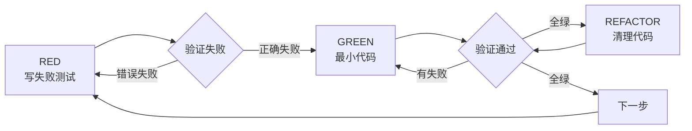

# 最佳实践与避坑指南：用对技能，避免常见陷阱

## 学完你能做什么

- 立即识别 AI 代理的合理化借口，阻止其偷懒行为
- 掌握 TDD、系统化调试、证据优先等核心铁律
- 避免常见的反模式，减少返工和调试时间
- 建立高效的协作习惯，与 AI 代理达成质量共识

## 你现在的困境

你花了几个小时和 AI 代理一起开发，最后却发现：
- 代码没有测试，功能一堆 bug
- AI 说"应该可以了"，一运行就报错
- 重复改了三次问题，每次都引入新 bug
- AI 说服你跳过技能，"这次很简单"
- 代码审查时才发现实现了错误的功能

**这不是 AI 不够聪明，是你让 AI"偷懒"了。**

## Superpowers 的五大铁律

Superpowers 不是简单的工具集，它强制 AI 代理遵循五大铁律：

| 铁律 | 核心内容 | 违反的代价 |
| ----- | --------- | ----------- |
| **1% 原则** | 即使只有 1% 可能，也必须调用技能 | AI 会跳过必要的检查，导致漏做工作 |
| **TDD 铁律** | 无失败测试不写生产代码 | 代码不可测试、难以维护、隐藏 bug |
| **调试铁律** | 无根因不修复 | 症状修复、问题复发、时间浪费 |
| **证据铁律** | 无证据不声称完成 | 虚假进度、信任破裂、返工 |
| **审查铁律** | 早期频繁审查 | 技术债积累、后期返工成本高 |

## 一、技能调用铁律：防止 AI 偷懒

### 核心原则

**即使只有 1% 可能，也必须调用技能。**

AI 代理很擅长"合理化"——找各种理由跳过必要的工作流程。

### 常见合理化借口 vs 真相

| AI 的借口 | 真相 | 应对方法 |
| ---------- | ---- | -------- |
| "这只是个简单问题" | 问题就是任务，检查技能 | 坚持调用技能 |
| "我需要更多上下文" | 技能检查在澄清问题之前 | 先调技能，再问问题 |
| "让我先探索代码库" | 技能会告诉你如何探索 | 先调技能，按技能指引探索 |
| "我可以快速查 git/文件" | 文件缺少对话上下文 | 先调技能，再读文件 |
| "让我先收集信息" | 技能会告诉你如何收集信息 | 先调技能，再收集 |
| "这不需要正式技能" | 如果有技能，就使用它 | 坚持使用 |
| "我记得这个技能" | 技能会更新，读最新版 | 每次都读技能 |
| "这不算任务" | 任何行动都是任务 | 坚持调用技能 |
| "技能是杀鸡用牛刀" | 简单事情会变复杂 | 坚持使用技能 |
| "我先做这一件事" | 做任何事前先检查 | 坚持调用技能 |
| "感觉这样很高效" | 无纪律行动浪费时间 | 技能防止低效 |
| "我知道什么意思" | 知道概念≠使用技能 | 必须调用技能 |

### 技能优先级

当多个技能可能适用时，按此顺序：

1. **流程技能优先**（brainstorming、debugging）— 决定如何处理任务
2. **实现技能其次**（TDD、review）— 引导执行

示例：
- "构建 X" → 先 brainstorming，再实现技能
- "修复这个 bug" → 先 debugging，再 TDD

## 二、TDD 铁律：拒绝测试后补

### 核心原则

```
NO PRODUCTION CODE WITHOUT A FAILING TEST FIRST
```

写代码前没看到测试失败？你没证明它测试正确。

### RED-GREEN-REFACTOR 循环



### 常见合理化借口

| AI 的借口 | 真相 |
| ---------- | ---- |
| "太简单不需要测试" | 简单代码会坏。测试花 30 秒。 |
| "我之后再写测试" | 测试立即通过证明什么都没测。 |
| "测试后补也一样" | 测试后补回答"这是做什么"，测试先回答"应该做什么" |
| "我已经手动测试所有边界" | 临时测试≠系统化。无记录，不能重跑。 |
| "删除 X 小时工作太浪费" | 沉没成本谬误。保留未验证代码是技术债。 |
| "保留作为参考，先写测试" | 你会调整它，那是测试后。删除就是删除。 |
| "需要先探索" | 可以。丢掉探索代码，从 TDD 开始。 |
| "测试难=设计不清楚" | 听从测试。难测=难用。 |
| "TDD 会拖慢我" | TDD 比调试快。实用=测试先。 |
| "手动测试更快" | 手动不证明边界。每次改动都要重测。 |
| "现有代码没测试" | 你在改进它。给现有代码加测试。 |

### Red Flags：立即停止

- 测试前写代码
- 实现后测试
- 测试立即通过
- 无法解释测试为何失败
- "之后再补测试"
- 合理化"就这一次"
- "我已经手动测试了"
- "测试后补也一样"
- "是精神不是仪式"
- "保留作为参考"或"调整现有代码"
- "已经花了 X 小时，删除浪费"
- "TDD 教条主义，我很务实"
- "这次不同，因为..."

**所有这些意味着：删除代码，用 TDD 重新开始。**

## 三、调试铁律：拒绝盲目修复

### 核心原则

```
NO FIXES WITHOUT ROOT CAUSE INVESTIGATION FIRST
```

没完成根因调查前不能提修复方案。

### 四阶段系统化调试

| 阶段 | 核心活动 | 成功标准 |
| ----- | --------- | -------- |
| **1. 根因调查** | 读错误信息、复现、检查变更、收集证据 | 理解 WHAT 和 WHY |
| **2. 模式分析** | 找工作示例、对比参考 | 识别差异 |
| **3. 假设测试** | 形成理论、最小测试 | 确认或新假设 |
| **4. 实施** | 创建测试、修复、验证 | bug 修复、测试通过 |

### 常见合理化借口

| AI 的借口 | 真相 |
| ---------- | ---- |
| "问题简单，不需要流程" | 简单问题也有根因。流程对简单 bug 更快。 |
| "紧急，没时间走流程" | 系统化调试比猜测乱试更快。 |
| "先试这个，再调查" | 第一次修复设定模式。从一开始就做对。 |
| "我会写测试验证修复有效" | 未测试修复不持久。测试先证明它。 |
| "一次多个修复省时间" | 无法隔离有效修复。引入新 bug。 |
| "参考太长，我会调整模式" | 部分理解保证 bug。完整阅读。 |
| "我看到问题了，让我修复" | 看到症状≠理解根因。 |
| "再试一次修复"（2+ 次失败后） | 3+ 次失败=架构问题。质疑模式，别再修。 |

### Red Flags：立即停止

- "快速修复，以后调查"
- "试试改 X 看能否工作"
- "添加多个改动，运行测试"
- "跳过测试，我会手动验证"
- "可能是 X，让我修复"
- "我不完全理解但这可能行"
- "模式说 X 但我会不同适应"
- "列出主要问题：[列出修复，无调查]"
- 提方案前未追踪数据流
- **"再试一次修复"**（已试 2+ 次）
- **每次修复揭示不同位置新问题**

**所有这些意味着：停止，回到阶段 1。**

**如果 3+ 次修复失败：质疑架构。**

## 四、证据铁律：拒绝虚假完成

### 核心原则

```
NO COMPLETION CLAIMS WITHOUT FRESH VERIFICATION EVIDENCE
```

如果本消息没运行验证命令，你不能声称它通过。

### 闸门函数

```
在声称任何状态或表达满意度之前：

1. 识别：什么命令证明此声称？
2. 运行：执行完整命令（全新、完整）
3. 读取：完整输出、检查退出码、统计失败
4. 验证：输出是否确认声称？
   - 否：陈述实际状态及证据
   - 是：陈述声称并提供证据
5. 只有这时：发出声称

跳过任何步骤=说谎，不是验证
```

### 常见合理化借口

| AI 的借口 | 真相 |
| ---------- | ---- |
| "应该现在可以了" | 运行验证 |
| "我有信心" | 信心≠证据 |
| "就这一次" | 无例外 |
| "Linter 通过" | Linter≠编译器 |
| "代理说成功" | 独立验证 |
| "我累了" | 疲劳不是借口 |
| "部分检查足够" | 部分证明什么都没有 |
| "不同措辞所以规则不适用" | 精神大于字面 |

### Red Flags：立即停止

- 使用"应该"、"可能"、"似乎"
- 验证前表达满意（"好！"、"完美！"、"完成！"）
- 准备 commit/push/PR 前不验证
- 信任代理成功报告
- 依赖部分验证
- 想着"就这一次"
- 疲惫并希望工作结束
- **任何暗示成功但未运行验证的措辞**

## 五、代码审查铁律：早期频繁审查

### 核心原则

**审查要早、审查要频。**

### 何时请求审查

**强制：**
- 子代理驱动开发的每个任务后
- 完成主要功能后
- 合并到主分支前

**可选但有价值：**
- 卡住时（新视角）
- 重构前（基线检查）
- 修复复杂 bug 后

### Red Flags：永不

- 因为"简单"跳过审查
- 忽略严重问题
- 带未修复重要问题继续
- 争辩有效技术反馈
- 信任代理报告，不查 VCS diff

## 六、计划编写：假设工程师无上下文

### 核心原则

**假设工程师零上下文、品味可疑。**

提供他们需要的所有信息：每个任务改哪些文件、代码、测试、文档参考、如何测试。把整个计划分解为 bite-sized 任务。

### 关键原则

- **DRY**：不要重复代码
- **YAGNI**：不需要的不要做
- **TDD**：每个功能先写测试
- **频繁提交**：每完成任务后 commit

## 七、设计阶段：一次一个问题

### 核心原则

**一次只问一个问题。不要用多个问题压倒用户。**

### 关键原则

- 多选题优于开放式（当可能时）
- **YAGNI 无情**：从所有设计中移除不必要功能
- 探索替代方案：定案前总是提 2-3 种方法
- 增量验证：分段呈现设计，每段确认

## 八、子代理驱动：两阶段审查

### 核心原则

**每个任务用新鲜子代理 + 两阶段审查（先符合规格再代码质量）= 高质量、快迭代。**

### Red Flags：永不

- 未经用户明确同意在 main/master 分支开始实现
- 跳过审查（规格符合性或代码质量）
- 带未修复问题继续
- 并发派多个实现子代理（冲突）
- 让子代理读计划文件（提供完整文本）
- 跳过场景设置上下文
- 忽略子代理问题
- 在规格符合✅前开始代码质量审查（顺序错误）
- 带任一审查未解决时移到下个任务

## 九、Git 工作树：隔离开发

### 核心原则

**用 Git 工作树创建隔离开发环境，保持主分支清洁。**

在开始任何需要隔离的功能工作前，创建工作树：
- 不污染主分支
- 并行多个功能分支
- 快速丢弃坏实验

## 十、常见反模式总结

### 12 种 AI 代理会使用的合理化借口

| 序号 | 借口类型 | 示例 | 应对 |
| ----- | --------- | ---- | ---- |
| 1 | **"简单"借口** | "这很简单，不用技能" | 1% 原则，必须调用 |
| 2 | **"之后"借口** | "我之后再写测试/再调查" | 现在做，之后无意义 |
| 3 | **"快速修复"借口** | "快速修这个，以后调查" | 无根因不修复 |
| 4 | **"手动测试"借口** | "我手动测过了，没问题" | 手动≠自动，无记录 |
| 5 | **"沉没成本"借口** | "已经花 X 小时，删除浪费" | 沉没成本谬误，删掉重来 |
| 6 | **"参考"借口** | "保留代码作参考" | 你会调整它，删掉重来 |
| 7 | **"务实"借口** | "TDD 教条，我很务实" | 实用=遵循流程 |
| 8 | **"探索"借口** | "让我先探索代码" | 技能告诉你如何探索 |
| 9 | **"记得"借口** | "我记得这个技能" | 每次读最新版 |
| 10 | **"紧急"借口** | "紧急，没时间走流程" | 流程更快，乱试更慢 |
| 11 | **"部分验证"借口** | "Linter 过了" | 部分验证什么都没有 |
| 12 | **"疲劳"借口** | "我累了，先这样吧" | 疲劳不是借口，验证再声称 |

### 立即停止信号

当听到以下信号时，**立即停止并返回正确的流程**：

| 信号 | 含义 | 正确行动 |
| ---- | ---- | -------- |
| "这不是？" | 你未经验证就假设了 | 验证你的假设 |
| "它会展示我们...？" | 你应该加证据收集 | 回到根因调查 |
| "停止猜测" | 你未理解就提方案 | 完成根因调查 |
| "深入思考这个问题" | 质疑基础，不只症状 | 回到根本问题 |
| "我们卡住了？"（沮丧） | 你的方法不工作 | 重新分析问题 |

## 十一、与 AI 代理协作的黄金法则

### 建立信任的七条准则

1. **铁律不可商量**：TDD、调试、证据等铁律不是选项
2. **证据优于声称**：没看到输出前不相信任何完成声明
3. **识别合理化**：AI 会找各种借口，必须识别并阻止
4. **早期审查**：每个任务后审查，不堆到 PR 一起
5. **系统化流程**：不跳过任何步骤，即使是"简单"任务
6. **尊重优先级**：流程技能优先于实现技能
7. **相信验证**：只有看到命令输出和证据才相信完成

### 建立高效工作习惯

::: tip 推荐做法

每次对话开始时，你可以对 AI 说：

```
请严格遵循 Superpowers 技能。即使觉得没必要，
也必须先调用相关技能。所有"简单"、"快速"、
"之后"等合理化借口都被禁止。
```

这样可以建立期望，让 AI 代理知道你会严格执行。
:::

## 本课小结

Superpowers 的核心价值不是让 AI 更聪明，而是让 AI"听话"：

- **1% 原则**防止 AI 跳过必要检查
- **TDD 铁律**确保代码可测试、可维护
- **调试铁律**避免盲目修复和问题复发
- **证据铁律**建立信任基线，拒绝虚假进度
- **审查铁律**早期发现问题，减少后期返工

识别并阻止 AI 代理的 12 种常见合理化借口，你将获得：
- 更高的代码质量
- 更快的开发速度（减少返工）
- 更稳定的交付（系统化流程）
- 更好的协作体验（信任建立）

## 下一课预告

> 下一课我们学习 **[技能完整参考](../../appendix/skills-reference/)**。
>
> 你将学到：
> - 14 个技能的快速参考表
> - 每个技能的触发条件和核心要点
> - 如何快速找到需要的技能

---

## 附录：源码参考

<details>
<summary><strong>点击展开查看源码位置</strong></summary>

> 更新时间：2026-02-01

| 功能 | 文件路径 | 行号 |
| ----- | --------- | ---- |
| 技能调用铁律与 1% 原则 | [`skills/using-superpowers/SKILL.md`](https://github.com/obra/superpowers/blob/main/skills/using-superpowers/SKILL.md#L6-L12) | 6-12, 24, 48-66 |
| TDD 铁律与 RED-GREEN-REFACTOR | [`skills/test-driven-development/SKILL.md`](https://github.com/obra/superpowers/blob/main/skills/test-driven-development/SKILL.md#L31-L45) | 31-45, 47-69, 272-289 |
| 系统化调试四阶段流程 | [`skills/systematic-debugging/SKILL.md`](https://github.com/obra/superpowers/blob/main/skills/systematic-debugging/SKILL.md#L16-L45) | 16-45, 50-122, 215-232 |
| 证据优先闸门函数 | [`skills/verification-before-completion/SKILL.md`](https://github.com/obra/superpowers/blob/main/skills/verification-before-completion/SKILL.md#L16-L38) | 16-38, 52-62, 64-75 |
| 代码审查铁律与 Red Flags | [`skills/requesting-code-review/SKILL.md`](https://github.com/obra/superpowers/blob/main/skills/requesting-code-review/SKILL.md#L10-L12, 92-99) | 10-12, 92-99 |
| 子代理驱动两阶段审查 | [`skills/subagent-driven-development/SKILL.md`](https://github.com/obra/superpowers/blob/main/skills/subagent-driven-development/SKILL.md#L10-L11, 199-214) | 10-11, 199-214 |
| 计划编写原则（DRY、YAGNI、TDD） | [`skills/writing-plans/SKILL.md`](https://github.com/obra/superpowers/blob/main/skills/writing-plans/SKILL.md#L10-L12, 90-96) | 10-12, 90-96 |
| 设计阶段原则（一次一个问题） | [`skills/brainstorming/SKILL.md`](https://github.com/obra/superpowers/blob/main/skills/brainstorming/SKILL.md#L16-L21, 47-54) | 16-21, 47-54 |

**关键常量**：
- 无硬编码常量，技能系统基于文件动态加载

**关键函数**：
- 无函数定义，技能系统基于 Markdown 文件和 YAML frontmatter

</details>
