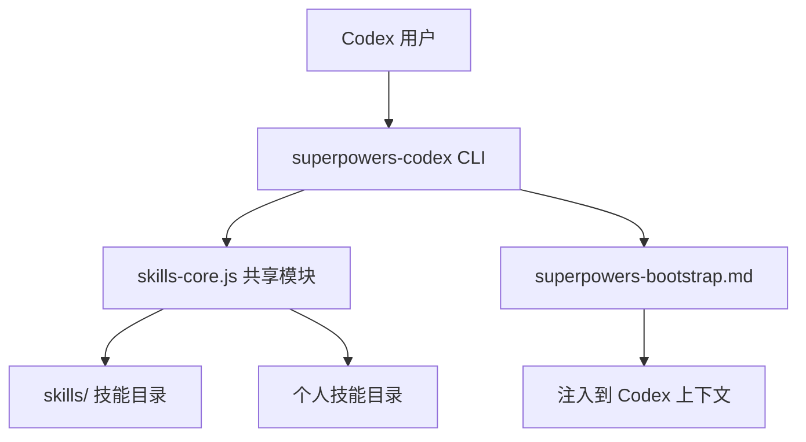
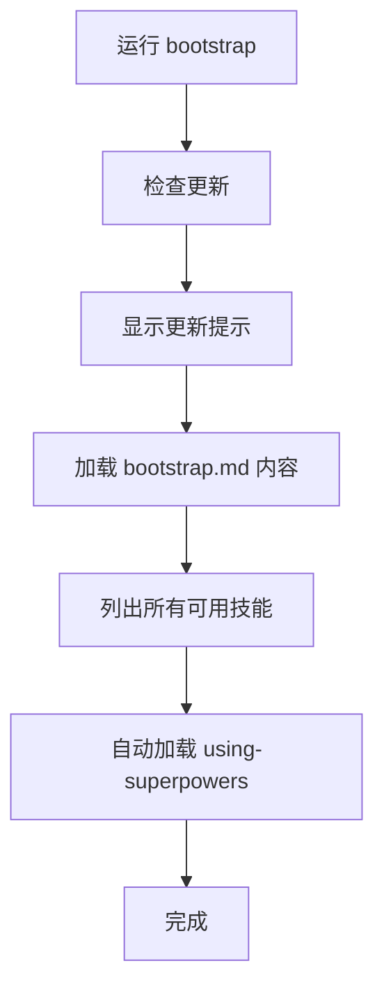

# Codex 平台集成指南

## 学完你能做什么

- 在 Codex 中安装 Superpowers CLI 工具
- 使用 bootstrap 自动加载所有技能
- 通过命名空间区分 Superpowers 技能和个人技能
- 理解工具映射规则，正确转换 Claude Code 技能

## 你现在的困境

Codex 是 OpenAI 的强大 AI 编码工具，但缺乏结构化的工作流指导：
- 你想让 Codex 遵循 TDD，但不知道如何强制执行
- 遇到 bug 时调试随意，缺乏系统化方法
- 想要复用 Claude Code 的 Superpowers 技能，但平台不兼容

Superpowers 通过 CLI 工具和 bootstrap 机制，将完整的技能系统带入 Codex。

## 什么时候用这一招

- **首次使用 Superpowers**：必须先安装 CLI 工具
- **验证技能加载**：检查 bootstrap 是否正确注入
- **创建个人技能**：在 Codex 中编写自定义技能

::: warning 实验性功能
Codex 支持目前处于实验阶段，可能需要根据用户反馈进行调整。如果遇到问题，请 [在 GitHub 报告](https://github.com/obra/superpowers/issues)。
:::

## 核心思路

Superpowers 在 Codex 中通过 CLI 工具和 bootstrap 机制工作：

| 层级 | 组件 | 作用 |
| --- | --- | --- |
| **CLI 层** | superpowers-codex 脚本 | 提供技能加载、查找、bootstrap 命令 |
| **Core 层** | skills-core.js | 共享的技能发现和解析模块（与 OpenCode 共用） |
| **Bootstrap 层** | superpowers-bootstrap.md | 会话启动时注入的技能上下文 |

**CLI 工具架构**：



**关键优势**：
- **跨平台一致性**：使用与 OpenCode 相同的 `skills-core` 模块，确保技能解析一致
- **命名空间隔离**：通过 `superpowers:` 前缀区分官方技能和个人技能
- **灵活覆盖**：个人技能可覆盖同名 Superpowers 技能，方便自定义

## 跟我做：安装和验证

### 第 1 步：快速安装（推荐）

**为什么**
让 Codex 自动处理所有安装步骤，减少手动操作。

**操作**

在 Codex 中运行：

```
Fetch and follow instructions from https://raw.githubusercontent.com/obra/superpowers/refs/heads/main/.codex/INSTALL.md
```

**你应该看到**：
Codex 会自动执行安装脚本，包括克隆仓库、设置权限等步骤。

### 第 2 步：手动安装（备选）

**为什么**
如果快速安装失败，可以手动执行每个步骤。

::: code-group

```bash [macOS/Linux]
# 创建目录
mkdir -p ~/.codex/superpowers

# 克隆仓库
git clone https://github.com/obra/superpowers.git ~/.codex/superpowers

# 确保脚本可执行
chmod +x ~/.codex/superpowers/.codex/superpowers-codex
```

```powershell [Windows]
# 创建目录
New-Item -ItemType Directory -Force -Path "$env:USERPROFILE\.codex\superpowers"

# 克隆仓库
git clone https://github.com/obra/superpowers.git "$env:USERPROFILE\.codex\superpowers"

# 确保脚本可执行
icacls "$env:USERPROFILE\.codex\superpowers\.codex\superpowers-codex.exe" /grant "$($env:USERNAME):F"
```

:::

Bootstrap 文件会自动从克隆位置加载，无需额外配置。

**你应该看到**：
仓库成功克隆到 `~/.codex/superpowers/` 目录。

### 第 3 步：验证安装

**为什么**
确认 CLI 工具能正常工作，技能目录结构正确。

**操作**

在 Codex 中运行：

```
Run ~/.codex/superpowers/.codex/superpowers-codex find-skills to show available skills
```

**你应该看到**：
```
Available skills:
==================

superpowers:brainstorming
  Interactive design refinement...

superpowers:test-driven-development
  TDD workflow for writing reliable code...

[... more skills ...]

Usage:
  superpowers-codex use-skill <skill-name>   # Load a specific skill

Skill naming:
  Superpowers skills: superpowers:skill-name (from ~/.codex/superpowers/skills/)
  Personal skills: skill-name (from ~/.codex/skills/)
  Personal skills override superpowers skills when names match.
```

### 第 4 步：运行 Bootstrap

**为什么**
Bootstrap 会在会话启动时注入完整的 Superpowers 上下文，包括工具映射和技能列表。

**操作**

在 Codex 中运行：

```
Run ~/.codex/superpowers/.codex/superpowers-codex bootstrap
```

**你应该看到**：
```
# Superpowers Bootstrap for Codex
# ================================

<EXTREMELY_IMPORTANT>
You have superpowers.

**Tool for running skills:**
- `~/.codex/superpowers/.codex/superpowers-codex use-skill <skill-name>`

**Tool Mapping for Codex:**
When skills reference tools you don't have, substitute your equivalent tools:
- `TodoWrite` → `update_plan` (your planning/task tracking tool)
...

## Available Skills:
[技能列表...]

## Auto-loading superpowers:using-superpowers skill:
[using-superpowers 技能内容...]

# Bootstrap Complete!
# You now have access to all superpowers skills.
```

## 检查点 ✅

| 检查项 | 预期结果 | 命令 |
| --- | --- | --- |
| 目录存在 | `~/.codex/superpowers/` 存在 | `ls ~/.codex/superpowers/` |
| CLI 可执行 | 脚本有执行权限 | `ls -la ~/.codex/superpowers/.codex/superpowers-codex` |
| find-skills | 显示所有可用技能 | `~/.codex/superpowers/.codex/superpowers-codex find-skills` |
| bootstrap | 注入完整技能上下文 | `~/.codex/superpowers/.codex/superpowers-codex bootstrap` |

## 踩坑提醒

### 常见错误 1：技能未找到

**症状**：运行 `use-skill` 时提示 "Skill not found"

**原因**：技能目录不存在或 CLI 路径错误

**解决**：
```
# 检查技能目录
ls ~/.codex/superpowers/skills

# 检查 CLI 是否可执行
~/.codex/superpowers/.codex/superpowers-codex find-skills

# 如果技能目录为空，重新克隆
rm -rf ~/.codex/superpowers
git clone https://github.com/obra/superpowers.git ~/.codex/superpowers
```

### 常见错误 2：CLI 脚本不可执行

**症状**：运行命令时提示 "Permission denied"

**原因**：脚本没有执行权限

**解决**：
```
chmod +x ~/.codex/superpowers/.codex/superpowers-codex
```

### 常见错误 3：Node.js 版本过低

**症状**：运行 CLI 时出现 ES module 错误

**原因**：`skills-core.js` 使用 ES 模块，需要 Node.js v14+（推荐 v18+）

**解决**：
```
# 检查 Node.js 版本
node --version

# 如果版本过低，升级到 v18+
# 访问 https://nodejs.org 下载最新 LTS 版本
```

## 深入了解：核心机制

### CLI 工具命令

Superpowers 提供三个核心命令：

| 命令 | 描述 | 使用场景 |
| --- | --- | --- |
| `bootstrap` | 加载完整 bootstrap，包含所有技能信息 | 会话启动时运行一次 |
| `use-skill <name>` | 加载特定技能到上下文 | 需要使用某个技能时 |
| `find-skills` | 列出所有可用技能 | 查看可用技能列表 |

**Bootstrap 命令流程**：



### 技能命名空间

Superpowers 使用命名空间区分技能来源：

| 技能类型 | 命名格式 | 示例 | 来源 |
| --- | --- | --- | --- |
| Superpowers 技能 | `superpowers:skill-name` | `superpowers:brainstorming` | `~/.codex/superpowers/skills/` |
| 个人技能 | `skill-name` | `my-custom-skill` | `~/.codex/skills/` |

**覆盖规则**：
- 个人技能会覆盖同名 Superpowers 技能
- 例如：如果有 `~/.codex/skills/brainstorming/`，它会覆盖 `superpowers:brainstorming`
- 使用 `superpowers:` 前缀可以强制加载官方技能

### 工具映射

Superpowers 技能最初为 Claude Code 编写，在 Codex 中需要映射工具：

| Claude Code 工具 | Codex 等价工具 | 说明 |
| --- | --- | --- |
| `TodoWrite` | `update_plan` | 任务跟踪和规划工具 |
| `Task`（子代理） | `spawn_agent` + `wait` | 如果 collab 可用，并发执行；否则顺序执行 |
| `Subagent` / `Agent` 提及 | `spawn_agent` | 映射到 collab 或顺序回退 |
| `Skill` tool | `superpowers-codex use-skill` | 技能加载命令 |
| `Read` / `Write` / `Edit` | Codex 原生工具 | 文件操作 |

::: tip 工具映射示例
当技能中出现"使用 TodoWrite 记录任务"时，Codex 应改为"使用 update_plan 记录任务"。
:::

### 共享核心模块

`lib/skills-core.js` 是 ES 模块，提供以下功能：

| 函数 | 功能 | 使用场景 |
| --- | --- | --- |
| `extractFrontmatter(filePath)` | 提取 YAML frontmatter | 解析技能元数据 |
| `findSkillsInDir(dir, sourceType, maxDepth)` | 递归查找所有技能 | 列出可用技能 |
| `resolveSkillPath(skillName, ...)` | 解析技能路径（处理覆盖） | 定位技能文件 |
| `checkForUpdates(repoDir)` | 检查 Git 更新 | Bootstrap 时提示更新 |
| `stripFrontmatter(content)` | 移除 frontmatter | 提取纯内容 |

该模块也被 OpenCode 插件使用，确保跨平台一致性。

### 创建个人技能

在 `~/.codex/skills/` 目录创建自定义技能：

```bash
# 创建技能目录
mkdir -p ~/.codex/skills/my-skill
```

创建 `~/.codex/skills/my-skill/SKILL.md`：

```markdown
---
name: my-skill
description: Use when [condition] - [what it does]
---

# My Skill

[Your skill content here]
```

**命名规范**：
- 使用小写字母和连字符（kebab-case）
- description 字段必须填写（用于触发条件）

## 本课小结

Codex 平台通过 CLI 工具提供了 Superpowers 的灵活集成：

- **安装简单**：自动或手动安装均可
- **bootstrap 机制**：会话启动时自动注入所有技能上下文
- **命名空间隔离**：清晰区分官方技能和个人技能
- **工具映射**：自动适配 Claude Code 技能到 Codex 环境
- **共享核心**：与 OpenCode 使用相同的核心模块，确保一致性

安装完成后，每次会话启动时运行 bootstrap 命令，Codex 就会自动获得 Superpowers 的所有技能和最佳实践。

## 下一课预告

> 下一课我们学习 **[平台对比与选择](../platform-comparison/)**。
>
> 你会学到：
> - 三大平台的功能差异对比
> - 各平台的适用场景
> - 如何根据需求选择合适的平台

---

## 附录：源码参考

<details>
<summary><strong>点击展开查看源码位置</strong></summary>

> 更新时间：2026-02-01

| 功能 | 文件路径 | 行号 |
| --- | --- | --- |
| CLI 工具脚本 | [`.codex/superpowers-codex`](https://github.com/obra/superpowers/blob/main/.codex/superpowers-codex) | 全文 |
| 共享核心模块 | [`lib/skills-core.js`](https://github.com/obra/superpowers/blob/main/lib/skills-core.js) | 全文 |
| Bootstrap 文件 | [`.codex/superpowers-bootstrap.md`](https://github.com/obra/superpowers/blob/main/.codex/superpowers-bootstrap.md) | 全文 |
| Codex 文档 | [`docs/README.codex.md`](https://github.com/obra/superpowers/blob/main/docs/README.codex.md) | 全文 |

**关键函数**：

- `extractFrontmatter(filePath)`：提取技能文件的 YAML frontmatter（第 16-52 行）
- `findSkillsInDir(dir, sourceType, maxDepth)`：递归查找目录中所有技能（第 62-97 行）
- `resolveSkillPath(skillName, superpowersDir, personalDir)`：解析技能路径，处理覆盖逻辑（第 108-140 行）
- `checkForUpdates(repoDir)`：检查 Git 仓库是否有更新（第 148-170 行）
- `stripFrontmatter(content)`：移除 frontmatter，返回纯内容（第 178-200 行）

**CLI 命令处理**：

- `runBootstrap()`：bootstrap 命令实现，包括更新检查和技能列表（第 72-124 行）
- `runUseSkill(skillName)`：use-skill 命令实现，支持命名空间（第 126-239 行）
- `runFindSkills()`：find-skills 命令实现，列出所有技能（第 37-70 行）

**关键路径配置**：

- Superpowers 技能目录：`~/.codex/superpowers/skills/`
- 个人技能目录：`~/.codex/skills/`
- CLI 脚本：`~/.codex/superpowers/.codex/superpowers-codex`
- Bootstrap 文件：`~/.codex/superpowers/.codex/superpowers-bootstrap.md`

**命令示例**：

- 快速安装：`Fetch and follow instructions from https://raw.githubusercontent.com/obra/superpowers/refs/heads/main/.codex/INSTALL.md`
- 查找技能：`~/.codex/superpowers/.codex/superpowers-codex find-skills`
- 加载技能：`~/.codex/superpowers/.codex/superpowers-codex use-skill superpowers:brainstorming`
- Bootstrap：`~/.codex/superpowers/.codex/superpowers-codex bootstrap`
- 更新：`cd ~/.codex/superpowers && git pull`

</details>
