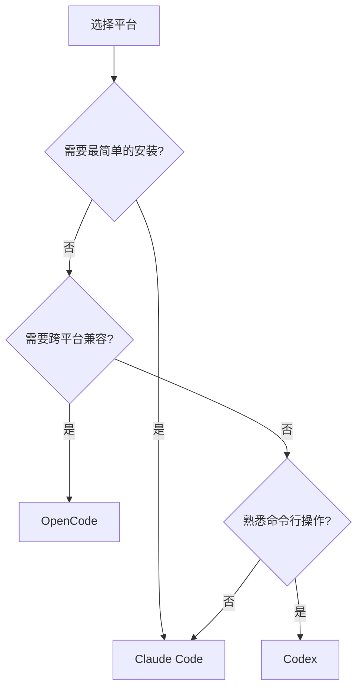
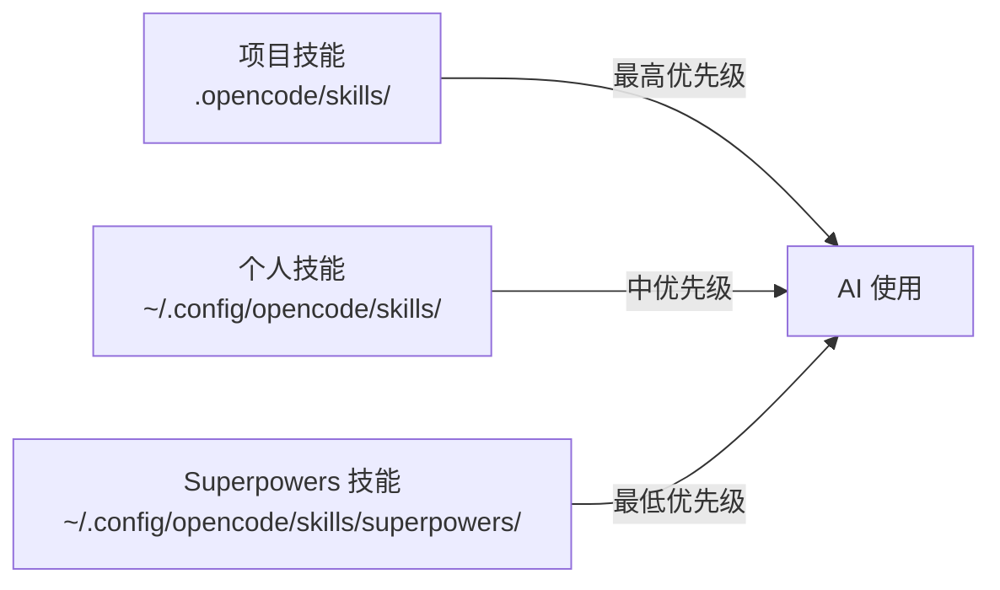

# 平台对比与选择

## 学完你能做什么

- 了解三大平台的核心差异和功能对比
- 根据你的使用场景选择最合适的平台
- 理解各平台的技能发现和加载机制
- 掌握工具映射和钩子系统的工作原理

## 你现在的困境

Claude Code、OpenCode、Codex 都可以运行 Superpowers，但它们之间存在显著差异：
- **安装方式不同**：有的通过插件市场，有的需要手动配置
- **技能发现机制不同**：有的自动注入，有的需要手动加载
- **工具映射不同**：同一技能在不同平台需要适配不同工具
- **适用场景不同**：有的适合个人开发，有的适合团队协作

不知道选哪个平台，选错了又浪费时间？

## 什么时候用这一招

- **首次安装 Superpowers**：不知道该选择哪个平台
- **平台切换时**：需要了解新平台的差异和迁移成本
- **团队选型时**：需要评估哪个平台最适合团队协作

## 核心思路

Superpowers 在三个平台的集成方式不同，但核心价值一致：

| 维度 | Claude Code | OpenCode | Codex |
| --- | --- | --- | --- |
| **安装方式** | 插件市场（最简单） | JavaScript 插件 | CLI 工具 + Bootstrap |
| **技能注入** | Hook 自动注入 | System prompt transform | Bootstrap 手动加载 |
| **技能发现** | 自动 | Native skill tool | CLI 命令 |
| **工具映射** | 原生支持 | 需要映射规则 | 需要映射规则 |
| **技能优先级** | 单一 | 三级优先级 | 命名空间隔离 |
| **适用场景** | 个人开发者 | 多平台用户 | 熟悉 CLI 的开发者 |

**选择决策树**：



## 详细对比：功能差异

### 安装方式对比

| 平台 | 安装复杂度 | 更新方式 | 适合人群 |
| --- | --- | --- | --- |
| **Claude Code** | ⭐ 最简单 | `/plugin update superpowers` | 追求便捷性的用户 |
| **OpenCode** | ⭐⭐ 中等 | Git pull 重新链接 | 多平台用户 |
| **Codex** | ⭐⭐⭐ 复杂 | `git pull` + 权限修复 | 熟悉 CLI 的开发者 |

**Claude Code**（最简单）：
```bash
# 一行命令完成安装
/plugin install superpowers@superpowers-marketplace

# 一行命令完成更新
/plugin update superpowers
```

**OpenCode**（中等）：
```bash
# 让 AI 帮你安装
Fetch and follow instructions from https://raw.githubusercontent.com/obra/superpowers/refs/heads/main/.opencode/INSTALL.md

# 更新需要重新克隆
cd ~/.config/opencode/skills/superpowers
git pull
```

**Codex**（复杂）：
```bash
# 快速安装（推荐）
Fetch and follow instructions from https://raw.githubusercontent.com/obra/superpowers/refs/heads/main/.codex/INSTALL.md

# 手动安装
git clone https://github.com/obra/superpowers.git ~/.codex/superpowers
chmod +x ~/.codex/superpowers/.codex/superpowers-codex
```

### 技能发现与加载机制

| 平台 | 技能发现方式 | 技能加载方式 | 触发条件 |
| --- | --- | --- | --- |
| **Claude Code** | Hook 自动注入 | Hook 自动注入 | 会话启动时 |
| **OpenCode** | Native skill tool | Skill tool 手动加载 | 需要使用技能时 |
| **Codex** | CLI 命令查找 | CLI 命令加载 | Bootstrap 或手动调用 |

**Claude Code - 自动注入**：

```bash
# 会话启动时，SessionStart Hook 自动注入
# 无需手动操作，技能立即可用
/superpowers:brainstorm  # 直接使用
```

**OpenCode - 手动加载**：

```bash
# 使用 native skill tool 查看所有技能
use skill tool to list skills

# 使用 native skill tool 加载特定技能
use skill tool to load superpowers/brainstorming
```

**Codex - Bootstrap 或手动加载**：

```bash
# 方式 1：Bootstrap 自动加载所有技能
~/.codex/superpowers/.codex/superpowers-codex bootstrap

# 方式 2：手动加载特定技能
~/.codex/superpowers/.codex/superpowers-codex use-skill superpowers:brainstorming
```

### 技能优先级与覆盖机制

| 平台 | 优先级层级 | 覆盖规则 | 命名空间 |
| --- | --- | --- | --- |
| **Claude Code** | 单一 | 无 | 无 |
| **OpenCode** | 三级优先级 | 项目 > 个人 > Superpowers | 无（目录隔离） |
| **Codex** | 命名空间隔离 | 个人技能覆盖 Superpowers | `superpowers:` 前缀 |

**Claude Code - 单一技能库**：
- 技能来自插件目录，无覆盖机制
- 所有技能平等对待

**OpenCode - 三级优先级**：



::: info 技能覆盖示例
如果项目目录有 `.opencode/skills/brainstorming/`，它会完全覆盖 Superpowers 的 brainstorming 技能。
:::

**Codex - 命名空间隔离**：

```bash
# Superpowers 技能（带前缀）
superpowers:brainstorming
superpowers:test-driven-development

# 个人技能（无前缀）
my-custom-skill
brainstorming  # 会覆盖 superpowers:brainstorming
```

::: tip 强制加载官方技能
即使有同名个人技能，使用 `superpowers:` 前缀可以强制加载官方技能：
```bash
use-skill superpowers:brainstorming  # 强制加载官方技能
```
:::

### 工具映射对比

| Claude Code 工具 | OpenCode 等价工具 | Codex 等价工具 | 说明 |
| --- | --- | --- | --- |
| `Skill` tool | `skill` tool | `superpowers-codex use-skill` | 技能加载 |
| `TodoWrite` | `update_plan` | `update_plan` | 任务跟踪 |
| `Task`（子代理） | `@mention` | `spawn_agent` + `wait` | 子代理调用 |
| `Read` / `Write` / `Edit` | 原生工具 | 原生工具 | 文件操作 |

**Claude Code - 原生支持**：
- 技能直接使用 Claude Code 的原生工具
- 无需任何映射，开箱即用

**OpenCode - 自动映射**：

```markdown
**Tool Mapping for OpenCode:**
When skills reference tools you don't have, substitute OpenCode equivalents:
- `TodoWrite` → `update_plan`
- `Task` tool with subagents → Use OpenCode's subagent system (@mention)
- `Skill` tool → OpenCode's native `skill` tool
- `Read`, `Write`, `Edit`, `Bash` → Your native tools
```

**Codex - Bootstrap 映射**：

```markdown
**Tool Mapping for Codex:**
When skills reference tools you don't have, substitute your equivalent tools:
- `TodoWrite` → `update_plan` (your planning/task tracking tool)
- `Task` tool with subagents → `spawn_agent` + `wait` (if collab available, parallel; otherwise sequential)
```

### 钩子系统对比

| 平台 | Hook 类型 | 用途 | 实现方式 |
| --- | --- | --- | --- |
| **Claude Code** | SessionStart | 会话启动时注入技能内容 | `hooks/session-start.sh` |
| **OpenCode** | system.transform | 每次请求前修改系统提示 | `superpowers.js` 插件 |
| **Codex** | 无 | 手动运行 Bootstrap | CLI 命令 |

**Claude Code - SessionStart Hook**：

```json
// hooks/hooks.json
{
  "hooks": {
    "SessionStart": "bash hooks/session-start.sh"
  }
}
```

每次会话启动时，`session-start.sh` 脚本会自动注入 `using-superpowers` 技能内容。

**OpenCode - System Transform Hook**：

```javascript
// .opencode/plugins/superpowers.js
export const SuperpowersPlugin = async ({ client, directory }) => {
  return {
    'experimental.chat.system.transform': async (_input, output) => {
      const bootstrap = getBootstrapContent();
      if (bootstrap) {
        (output.system ||= []).push(bootstrap);
      }
    }
  };
};
```

每次请求时，系统提示会被自动修改，注入 Superpowers 上下文。

**Codex - 手动 Bootstrap**：

```bash
# 需要手动运行 Bootstrap 命令
~/.codex/superpowers/.codex/superpowers-codex bootstrap
```

::: warning Codex 无自动 Hook
Codex 不支持自动钩子，需要每次会话启动时手动运行 Bootstrap 命令。
:::

## 适用场景与选择建议

### Claude Code：最适合个人开发者

**优势**：
- ✅ 安装最简单，一行命令搞定
- ✅ 自动注入，无需手动加载技能
- ✅ 斜杠命令直观易用
- ✅ 官方支持，Bug 修复快

**劣势**：
- ❌ 仅支持 Claude Code 平台
- ❌ 技能覆盖机制有限

**最适合**：
- 个人开发者
- 初次使用 AI 编码代理
- 追求开箱即用体验
- 不想折腾配置的用户

### OpenCode：最适合多平台用户

**优势**：
- ✅ 支持多平台（Claude、OpenAI 等）
- ✅ 三级技能优先级，灵活覆盖
- ✅ 自动工具映射
- ✅ Native skill tool 集成

**劣势**：
- ❌ 安装稍复杂，需要手动配置符号链接
- ❌ 需要手动加载技能

**最适合**：
- 多平台用户
- 需要自定义技能覆盖的用户
- 团队协作场景
- 需要项目级技能隔离的用户

### Codex：最适合高级用户

**优势**：
- ✅ CLI 工具，可脚本化
- ✅ 命名空间隔离清晰
- ✅ 与 OpenCode 共享核心模块
- ✅ 灵活的覆盖机制

**劣势**：
- ❌ 安装最复杂，需要 CLI 操作
- ❌ 无自动钩子，需手动运行 Bootstrap
- ❌ 实验性功能，可能不稳定

**最适合**：
- 熟悉命令行的高级用户
- 需要脚本化操作的用户
- 想要深度定制和调试的用户
- 愿意接受实验性功能的用户

### 快速选择表

| 你的需求 | 推荐平台 |
| --- | --- |
| 最简单的安装和使用 | Claude Code |
| 多平台支持 | OpenCode |
| 需要项目级技能覆盖 | OpenCode |
| 命令行操作爱好者 | Codex |
| 团队协作 | OpenCode |
| 个人快速开发 | Claude Code |
| 深度定制和调试 | Codex |

## 平台迁移指南

### 从 Claude Code 迁移到 OpenCode

**迁移步骤**：

1. **安装 OpenCode 插件**
   ```bash
   Fetch and follow instructions from https://raw.githubusercontent.com/obra/superpowers/refs/heads/main/.opencode/INSTALL.md
   ```

2. **学习工具映射**
   - 斜杠命令 → Native skill tool
   - 熟悉 OpenCode 的 `@mention` 系统

3. **调整工作流**
   - 会话启动后手动加载技能（如果需要）
   - 使用 `use skill tool to load superpowers/brainstorming`

### 从 Claude Code 迁移到 Codex

**迁移步骤**：

1. **安装 CLI 工具**
   ```bash
   Fetch and follow instructions from https://raw.githubusercontent.com/obra/superpowers/refs/heads/main/.codex/INSTALL.md
   ```

2. **运行 Bootstrap**
   ```bash
   ~/.codex/superpowers/.codex/superpowers-codex bootstrap
   ```

3. **学习命令行操作**
   - 斜杠命令 → CLI 命令
   - `/superpowers:brainstorm` → `~/.codex/superpowers/.codex/superpowers-codex use-skill superpowers:brainstorming`

### 从 OpenCode 迁移到 Claude Code

**迁移步骤**：

1. **安装 Claude Code 插件**
   ```bash
   /plugin marketplace add obra/superpowers-marketplace
   /plugin install superpowers@superpowers-marketplace
   ```

2. **验证技能加载**
   ```bash
   /help
   # 应该看到 /superpowers:brainstorm 等命令
   ```

3. **享受自动化**
   - 无需手动加载技能
   - 斜杠命令立即可用

## 本课小结

三大平台各有优势，选择取决于你的需求：

- **Claude Code**：最简单、开箱即用，适合个人开发者
- **OpenCode**：多平台支持、灵活覆盖，适合团队协作
- **Codex**：CLI 工具、高度可定制，适合高级用户

无论选择哪个平台，Superpowers 的核心价值和技能内容都是一致的。关键是理解各平台的差异，选择最适合你工作流的平台。

## 下一课预告

> 下一课我们学习 **[设计工作流：Brainstorming](../../core-workflows/design-workflow/)**。
>
> 你会学到：
> - 如何在编码前进行创意设计
> - 使用 brainstorming 技能进行需求澄清
> - 保存和管理设计文档

---

## 附录：源码参考

<details>
<summary><strong>点击展开查看源码位置</strong></summary>

> 更新时间：2026-02-01

| 功能 | 文件路径 | 行号 |
| --- | --- | --- |
| Claude Code 插件配置 | [`.claude-plugin/plugin.json`](https://github.com/obra/superpowers/blob/main/.claude-plugin/plugin.json) | 全文 |
| Claude Code SessionStart Hook | [`hooks/session-start.sh`](https://github.com/obra/superpowers/blob/main/hooks/session-start.sh) | 全文 |
| OpenCode 插件 | [`.opencode/plugins/superpowers.js`](https://github.com/obra/superpowers/blob/main/.opencode/plugins/superpowers.js) | 全文 |
| Codex CLI 工具 | [`.codex/superpowers-codex`](https://github.com/obra/superpowers/blob/main/.codex/superpowers-codex) | 全文 |
| 共享核心模块 | [`lib/skills-core.js`](https://github.com/obra/superpowers/blob/main/lib/skills-core.js) | 全文 |

**关键配置**：

- **Claude Code Hook 配置**：[`hooks/hooks.json`](https://github.com/obra/superpowers/blob/main/hooks/hooks.json) - 定义 SessionStart Hook
- **OpenCode System Transform**：[`.opencode/plugins/superpowers.js`](https://github.com/obra/superpowers/blob/main/.opencode/plugins/superpowers.js#L88-L94) - 注入系统提示
- **Codex Bootstrap 机制**：[`.codex/superpowers-codex`](https://github.com/obra/superpowers/blob/main/.codex/superpowers-codex#L72-L124) - bootstrap 命令实现

**平台文档**：

- [Claude Code 文档](https://github.com/obra/superpowers/blob/main/README.md#L31-L44)
- [OpenCode 文档](https://github.com/obra/superpowers/blob/main/docs/README.opencode.md)
- [Codex 文档](https://github.com/obra/superpowers/blob/main/docs/README.codex.md)

**关键路径**：

| 平台 | 技能目录 | 配置目录 |
| --- | --- | --- |
| Claude Code | `~/.config/claude-code/skills/superpowers/` | `~/.config/claude-code/` |
| OpenCode | `~/.config/opencode/skills/superpowers/` | `~/.config/opencode/` |
| Codex | `~/.codex/superpowers/skills/` | `~/.codex/` |

</details>
