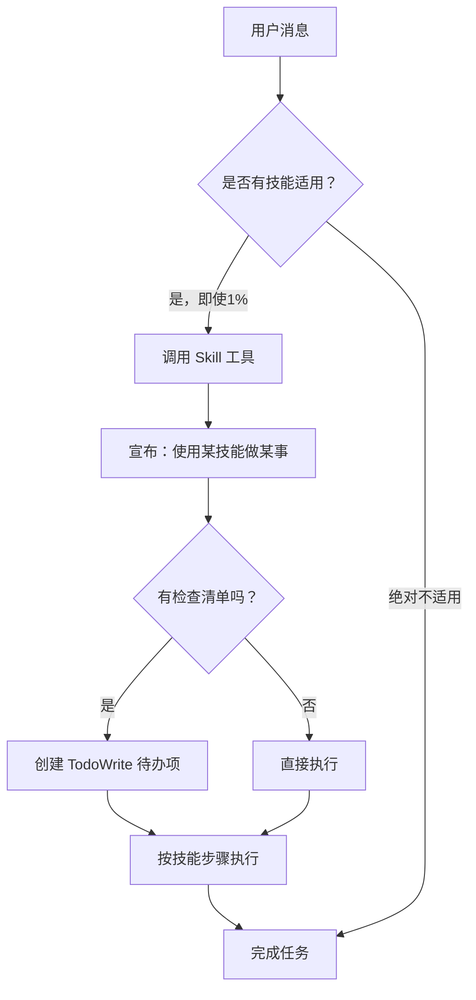

# Superpowers 是什么：AI 编码代理的完整开发工作流

## 学完你能做什么

看完这章，你会：
- 理解 **Superpowers 是什么**，它如何改变 AI 代理的工作方式
- 知道 **为什么需要它**——识别 AI 代理常见的问题和局限
- 掌握 **技能系统的工作原理**——技能如何自动触发、优先级规则
- 了解 **14 个核心技能**——它们如何覆盖完整的软件开发生命周期

---

## 你现在的困境

如果你用过 Claude Code、OpenCode 或 Codex，你可能会遇到这些情况：

| AI 代理的问题 | 真实场景 |
| ------------ | --------- |
| **跳过设计直接写代码** | 你说"加个用户认证"，它直接开始写代码，没问你用 JWT 还是 Session，有没有双因素认证 |
| **缺乏测试驱动开发纪律** | 写完功能代码，才想起来写测试，甚至不写测试直接提交 |
| **调试随意** | 测试失败了，凭感觉改代码，改了几次"看起来好了"，但根本原因没找到 |
| **缺乏协作规范** | 多个任务并行时，不知道先做哪个，代码审查变成事后诸葛亮 |

这些问题不是 AI 模型不够聪明，而是**缺少系统化的工作流约束**。Superpowers 就是为了解决这个问题。

---

## 核心思路

**Superpowers 是什么？**

Superpowers 是一套完整的软件开发生命周期工作流，由 **14 个可组合的"技能"（Skills）** 和初始指令构建，确保 AI 编码代理强制遵循最佳实践。

::: info 什么是"技能"（Skill）？

"技能"是定义了特定工作流的 Markdown 文件，包含：
- 触发条件（什么时候使用这个技能）
- 工作流程图（如何一步步执行）
- 快速参考表（核心要点）
- 常见错误警告（Red Flags）

技能不是"建议"，而是"强制规则"。AI 代理在执行任务前，必须先检查是否有适用的技能。

:::

**它如何工作？**

传统 AI 代理的工作方式：
```
用户请求 → 直接生成代码 → 提交
```

Superpowers 增强后的工作方式：
```
用户请求 → 检查技能 → 调用技能 → 按流程执行 → 验证 → 完成
```

::: tip 技能调用的强制规则

即使只有 **1% 的可能性**技能适用，AI 代理也**必须调用**。这不是可选项，不可协商，不能"合理化"逃避。

例如，代理想："这只是简单问题，不需要技能" → ❌ 错误！必须先检查技能。

:::

---

## 技能系统如何工作

### 技能调用流程

当 AI 代理收到任务时，会按照以下流程工作：



### Red Flags：常见的错误想法

AI 代理在跳过技能检查时，常会产生这些"合理化"的想法：

| AI 的想法 | 现实 |
| --------- | ---- |
| "这只是简单问题" | 问题也是任务，必须检查技能 |
| "我需要更多上下文" | 技能检查在询问问题之前 |
| "让我先探索代码库" | 技能会告诉你如何探索，先检查技能 |
| "我可以快速检查 git/文件" | 文件缺乏对话上下文，必须检查技能 |
| "这个技能太重了" | 简单事情会变复杂，使用技能 |
| "我知道这个技能" | 技能会更新，必须读取当前版本 |

### 技能优先级

当多个技能可能适用时，按此顺序选择：

1. **流程技能优先**（如 brainstorming、debugging）——决定**如何**处理任务
2. **实现技能其次**（如 frontend-design）——引导具体执行

**示例**：
- "让我们构建 X" → 先 brainstorming，再实现技能
- "修复这个 bug" → 先 debugging，再领域特定技能

### 技能类型

- **严格型（Rigid）**：如 TDD、debugging，必须精确遵循，不能调整纪律
- **灵活型（Flexible）**：如设计模式，可按上下文调整原则

技能本身会告诉你是哪种类型。

---

## Superpowers 的 14 个核心技能

### 技能库分类

**测试技能（Testing）**
- **test-driven-development**：RED-GREEN-REFACTOR 循环，强制先写测试

**调试技能（Debugging）**
- **systematic-debugging**：四阶段根因分析过程
- **verification-before-completion**：确保真正修复，验证优先

**协作技能（Collaboration）**
- **brainstorming**：苏格拉底式设计细化，通过提问澄清需求
- **writing-plans**：详细的实施计划，每个任务 2-5 分钟
- **executing-plans**：批量执行计划，人工检查点
- **dispatching-parallel-agents**：并发子代理工作流
- **requesting-code-review**：预审查检查清单
- **receiving-code-review**：如何响应代码审查反馈
- **using-git-worktrees**：使用 Git 工作树创建隔离开发环境
- **finishing-a-development-branch**：分支完成工作流（合并/PR/保留/丢弃）
- **subagent-driven-development**：快速迭代，两阶段审查（规范符合性，代码质量）

**元技能（Meta）**
- **writing-skills**：创建新技能的最佳实践指南
- **using-superpowers**：技能系统入口（本章介绍的就是这个技能）

### 完整开发工作流

当你说"让我们构建一个新功能"时，Superpowers 会自动触发以下工作流：


**每一步都会自动触发**，不需要你手动干预。

### 哲学原则

Superpowers 的设计基于四大原则：

| 原则 | 含义 |
| ---- | ---- |
| **Test-Driven Development** | 测试优先，永远先写测试 |
| **Systematic over ad-hoc** | 系统化过程优于随机猜测 |
| **Complexity reduction** | 简单性是首要目标（YAGNI 原则） |
| **Evidence over claims** | 在声明成功前必须验证（证据优先） |

---

## 为什么 Superpowers 有用？

### 对 AI 代理的好处

| 问题 | Superpowers 的解决方案 |
| ---- | ------------------- |
| 跳过设计，直接写代码 | brainstorming 技能强制先澄清需求 |
| 缺少测试，提交后才发现问题 | TDD 技能强制 RED-GREEN-REFACTOR 循环 |
| 调试随意，改了多次没找到根本原因 | systematic-debugging 技能提供四阶段流程 |
| 任务混乱，不知道优先级 | writing-plans 技能将任务分解为 2-5 分钟的小块 |
| 代码审查变成事后诸葛亮 | requesting-code-review 技能在每个任务后自动审查 |

### 对你的好处

- **更可靠的代码**：强制测试驱动开发，减少 bug
- **更清晰的设计**：通过 brainstorming 确保需求理解正确
- **更快的迭代**：子代理驱动开发让 AI 可以独立工作数小时
- **可追踪的进度**：每个步骤都有检查清单和验证要求
- **一致的质量**：无论谁使用，都遵循相同的工作流

---

## 本课小结

- **Superpowers** 是一套完整的软件开发生命周期工作流，通过 14 个可组合技能确保 AI 代理强制遵循最佳实践
- **技能不是建议**，而是强制规则——AI 代理在执行任务前必须检查并调用适用技能
- **技能系统**自动触发，无需手动干预，覆盖从设计到部署的完整流程
- **四大原则**：TDD、系统化、简化、证据优先，是所有技能的核心指导

---

## 下一课预告

> 下一课我们学习 **[快速开始：5 分钟上手](../quick-start/)**。
>
> 你会亲手体验：
> - 使用 Superpowers 的基本工作流
> - 触发 brainstorming 技能澄清需求
> - 体验 AI 代理的"自动导航"能力

---

## 附录：源码参考

<details>
<summary><strong>点击展开查看源码位置</strong></summary>

> 更新时间：2026-02-01

| 功能        | 文件路径                                                                                    | 行号    |
| ----------- | ------------------------------------------------------------------------------------------- | ------- |
| Superpowers 定义 | [`README.md`](https://github.com/obra/superpowers/blob/main/README.md#L3)         | 3   |
| 工作流程说明 | [`README.md`](https://github.com/obra/superpowers/blob/main/README.md#L5-L15)         | 5-15   |
| 基本工作流  | [`README.md`](https://github.com/obra/superpowers/blob/main/README.md#L80-L96)         | 80-96   |
| 技能库分类  | [`README.md`](https://github.com/obra/superpowers/blob/main/README.md#L98-L122)        | 98-122  |
| 哲学原则    | [`README.md`](https://github.com/obra/superpowers/blob/main/README.md#L124-L129)        | 124-129 |
| 插件元信息  | [`.claude-plugin/plugin.json`](https://github.com/obra/superpowers/blob/main/.claude-plugin/plugin.json#L1-L13) | 1-13   |
| 技能调用规则 | [`skills/using-superpowers/SKILL.md`](https://github.com/obra/superpowers/blob/main/skills/using-superpowers/SKILL.md#L6-L12) | 6-12   |
| 技能调用流程图 | [`skills/using-superpowers/SKILL.md`](https://github.com/obra/superpowers/blob/main/skills/using-superpowers/SKILL.md#L26-L46) | 26-46   |
| Red Flags 列表 | [`skills/using-superpowers/SKILL.md`](https://github.com/obra/superpowers/blob/main/skills/using-superpowers/SKILL.md#L48-L64) | 48-64   |
| 技能优先级  | [`skills/using-superpowers/SKILL.md`](https://github.com/obra/superpowers/blob/main/skills/using-superpowers/SKILL.md#L68-L75) | 68-75   |
| 技能类型    | [`skills/using-superpowers/SKILL.md`](https://github.com/obra/superpowers/blob/main/skills/using-superpowers/SKILL.md#L77-L83) | 77-83   |

**关键常量**：
- 插件版本：`"version": "4.1.1"`

**关键规则**：
- **强制调用规则**：即使 1% 可能性，也必须调用技能（`using-superpowers/SKILL.md:7`）
- **无选择权**：如果技能适用，AI 代理没有选择余地（`using-superpowers/SKILL.md:9`）

</details>
