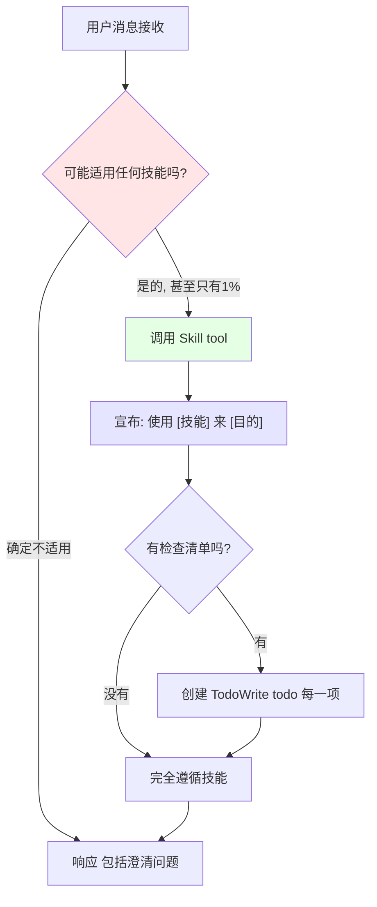

# 如何使用技能：调用规则与优先级

## 学完你能做什么

- 理解技能系统的核心规则（1% 原则）
- 掌握技能调用的正确时机和流程
- 了解技能优先级，知道先调用哪个技能
- 区分刚性技能和柔性技能，避免误用

---

## 你现在的困境

你是不是觉得 AI 代理有时候"太聪明"了？

- 你问个简单问题，它直接给答案，结果不完整
- 你让它修 bug，它马上动手改，改完又引入新问题
- 你想让它遵循 TDD，它说"这个很简单，不用测试"

**这些不是"聪明"，是"偷懒"**——AI 代理会试图用最省力的方式完成任务。

**Superpowers 的解决方案**：强制规则——即使只有 1% 的可能性，也必须检查技能。

---

## 什么时候用这一招

**答案：每次任务前，无条件检查。**

具体场景：
- ✅ 构建新功能
- ✅ 修复 Bug
- ✅ 回答技术问题
- ✅ 重构代码
- ✅ 编写测试
- ✅ 需要调试问题
- ✅ 探索代码库
- ✅ 收集信息

**记住**：技能检查必须在任何响应或行动之前完成，包括提问澄清之前。

---

## 核心思路

### 什么是技能系统？

**技能系统**是 Superpowers 的核心，它规定了 AI 代理在任何任务前必须先检查适用的技能。

**强制规则**：

> **即使只有 1% 的可能性某个技能适用，也必须调用它。**
>
> **如果适用技能，你没有选择——必须使用。**
>
> **这不是可选项，不可谈判，也不能合理化逃避。**

### 为什么这么严格？

因为 AI 代理的"偷懒"方式很多：
- "这个很简单，不用技能" → 可能在 5 分钟后变成复杂问题
- "我先看看代码" → 但技能会告诉你如何正确地看
- "我先收集信息" → 但技能会告诉你需要收集什么信息

**技能系统防止所有这些偷懒行为**，确保 AI 代理始终遵循最佳实践。

---

## 跟我做

### 第 1 步：理解调用流程

当 AI 代理收到你的任务时，它必须遵循以下流程：



**流程解释**：

1. **接收消息**：AI 代理收到你的任务
2. **检查技能**：判断是否有任何技能可能适用（即使 1% 的可能性）
3. **调用技能**：使用 Skill tool 加载技能内容
4. **宣布使用**：明确告诉你"使用 [技能] 来 [目的]"
5. **创建任务列表**：如果技能有检查清单，为每一项创建 TodoWrite
6. **遵循技能**：严格按照技能指示执行

**关键点**：
- 步骤 2-3 必须在提问澄清之前完成
- 技能检查必须在任何行动之前完成

---

### 第 2 步：识别"偷懒借口"

AI 代理可能会用各种借口逃避技能调用。识别这些借口，才能确保它不偷懒。

**常见错误想法 vs. 真相**：

| AI 的想法 | 真相 |
| --------- | ---- |
| "这只是个简单问题" | 问题也是任务。检查技能。 |
| "我需要更多上下文" | 技能检查在提问澄清之前。 |
| "我先看看代码" | 技能会告诉你如何探索代码。先检查技能。 |
| "我可以快速查 git 或文件" | 文件缺少对话上下文。先检查技能。 |
| "我先收集信息" | 技能会告诉你如何收集信息。先检查技能。 |
| "不需要正式技能" | 如果有技能存在，就用它。 |
| "我记得这个技能" | 技能会进化。读当前版本。 |
| "这不算任务" | 任何行动 = 任务。检查技能。 |
| "技能太复杂" | 简单的事情也会变复杂。用技能。 |
| "我先做这一件事" | 在做任何事之前，先检查技能。 |
| "这感觉很高效" | 无纪律的行动浪费时间。技能防止这个。 |
| "我知道这意味着什么" | 知道概念 ≠ 使用技能。调用它。 |

**如果 AI 代理说这些话，立即要求它检查技能。**

---

### 第 3 步：理解技能优先级

当多个技能可能适用时，使用这个优先级顺序：

**1. 流程技能优先**

先确定如何处理任务：
- **brainstorming**（创意设计）——需要澄清需求
- **systematic-debugging**（系统化调试）——需要修复 bug

**2. 实现技能其次**

确定实施方式（示例可能随项目版本变化）：
- **test-driven-development**（测试驱动开发）
- 其他实现相关技能

**示例**：

- "我们来构建 X" → 先 brainstorming（设计），然后实现技能
- "修复这个 bug" → 先 systematic-debugging（调试），然后域特定技能

**原则**：先搞清楚怎么做（流程），再动手做（实现）。

---

### 第 4 步：区分刚性技能和柔性技能

不是所有技能都一样严格。

**刚性技能（Rigid）**：

必须完全遵循，不要自行调整纪律：
- **test-driven-development**（TDD）
- **systematic-debugging**（系统化调试）

这些技能的核心是严格的流程和纪律，改变纪律就失去意义。

**柔性技能（Flexible）**：

根据上下文调整原则：
- **brainstorming**（创意设计）
- **writing-plans**（编写计划）

技能内容会体现这种区别。

**原则**：刚性技能必须严格遵循，柔性技能可以灵活应用。

---

### 第 5 步：实战练习

现在你理解了规则，让我们看看 AI 代理应该怎么做。

**场景**：你说"给我写一个用户注册功能"

**错误方式**（偷懒）：
```
AI：好的，我来写注册功能...
[直接开始写代码]
```

**正确方式**（遵循技能）：
```
AI：让我检查一下是否有适用的技能。
[调用 brainstorming 技能]

AI：使用 brainstorming 来澄清用户注册功能的需求。

现在，让我先问几个问题来了解你的需求：
1. 需要哪些字段？
2. 需要邮箱验证吗？
3. 密码有什么要求？
[等待你的回答]
```

**区别**：
- 错误方式：直接开干，可能写错
- 正确方式：先问清楚，确保符合需求

---

## 检查点 ✅

确认 AI 代理的行为符合以下检查点：

- [ ] 任务开始前，AI 会说"让我检查一下技能"
- [ ] 即使简单任务，AI 也会检查技能
- [ ] AI 不会在提问澄清之前就开始行动
- [ ] 多个技能适用时，AI 会按优先级顺序调用
- [ ] 刚性技能（TDD、调试）会严格按照流程执行
- [ ] AI 会明确告诉你"使用 [技能] 来 [目的]"

如果以上都 OK，说明 AI 代理已经遵循技能调用规则！

---

## 踩坑提醒

### AI 说我需要更多上下文

**症状**：AI 说"我需要更多信息才能开始"

**问题**：技能检查应该在提问澄清之前

**解决**：
- 明确告诉 AI："在提问之前，先检查技能"
- 技能可能会告诉你需要收集什么信息

### AI 说任务很简单

**症状**：AI 说"这个很简单，不需要技能"

**问题**：简单任务也可能需要工作流

**解决**：
- 提醒 AI："即使 1% 的可能性，也必须检查技能"
- 简单任务往往在过程中变复杂，技能会预防这个问题

### AI 说它记得技能

**症状**：AI 说"我知道 TDD 是什么，不需要调用技能"

**问题**：技能会进化，记忆可能过时

**解决**：
- 要求 AI："使用 Skill tool 调用最新版本的技能"
- 技能文件可能更新，AI 需要读取最新版本

---

## 本课小结

这节课你学会了：

1. **核心规则**：即使只有 1% 的可能性，也必须调用技能
2. **调用流程**：接收消息 → 检查技能 → 调用 Skill tool → 宣布使用 → 遵循技能
3. **常见借口**：识别 AI 的"偷懒"想法，防止逃避技能
4. **技能优先级**：流程技能（brainstorming、debugging）优先，实现技能其次
5. **技能类型**：刚性技能（TDD、调试）严格遵循，柔性技能灵活应用

**核心思想**：
- 技能系统防止 AI 代理偷懒
- 强制规则确保始终遵循最佳实践
- 技能检查必须在任何行动之前完成

---

## 下一课预告

> 下一课我们学习 **[Claude Code 平台](../../platforms/claude-code/)**。
>
> 你会学到：
> - Claude Code 的完整集成方式
> - 如何使用 Skill tool 调用技能
> - 钩子系统的自动加载机制

---

## 附录：源码参考

<details>
<summary><strong>点击展开查看源码位置</strong></summary>

> 更新时间：2026-02-01

| 功能 | 文件路径 | 行号 |
| --- | --- | --- |
| 核心规则定义 | [`skills/using-superpowers/SKILL.md`](https://github.com/obra/superpowers/blob/main/skills/using-superpowers/SKILL.md#L6-L12) | 6-12 |
| Skill tool 调用方式 | [`skills/using-superpowers/SKILL.md`](https://github.com/obra/superpowers/blob/main/skills/using-superpowers/SKILL.md#L16) | 16 |
| 调用流程图 | [`skills/using-superpowers/SKILL.md`](https://github.com/obra/superpowers/blob/main/skills/using-superpowers/SKILL.md#L26-L46) | 26-46 |
| Red Flags（偷懒借口） | [`skills/using-superpowers/SKILL.md`](https://github.com/obra/superpowers/blob/main/skills/using-superpowers/SKILL.md#L48-L65) | 48-65 |
| 技能优先级规则 | [`skills/using-superpowers/SKILL.md`](https://github.com/obra/superpowers/blob/main/skills/using-superpowers/SKILL.md#L67-L76) | 67-76 |
| 刚性/柔性技能区分 | [`skills/using-superpowers/SKILL.md`](https://github.com/obra/superpowers/blob/main/skills/using-superpowers/SKILL.md#L77-L81) | 77-81 |
| 用户指令说明 | [`skills/using-superpowers/SKILL.md`](https://github.com/obra/superpowers/blob/main/skills/using-superpowers/SKILL.md#L85-L88) | 85-88 |

**关键常量**：
- **1% 原则**：即使 1% 的可能性，也必须调用技能（`L7`）

**关键规则**：
- **强制规则**：如果适用技能，AI 必须使用，不可谈判（`L9-L12`）
- **流程优先**：流程技能（brainstorming、debugging）→ 实现技能（`L71-L75`）

</details>
