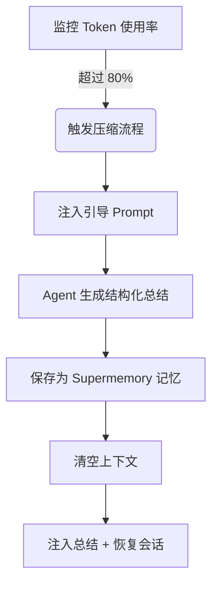

# 抢占式压缩原理：防止上下文遗忘

## 学完你能做什么

学完本课，你将能够：
1.  **理解** 为什么长会话中 Agent 会"变笨"以及 Supermemory 如何解决这个问题。
2.  **掌握** 抢占式压缩（Preemptive Compaction）的触发条件和工作流程。
3.  **配置** 适合你项目的压缩阈值，平衡成本与记忆质量。
4.  **验证** 压缩是否正常工作，并查看生成的会话总结。

## 你现在的困境

在与 AI 结对编程时，你可能遇到过这些情况：
*   **聊着聊着"失忆"了**：在一个漫长的重构任务中，Agent 突然忘记了最开始约定的变量命名规则。
*   **被迫重开会话**：上下文窗口（Context Window）满了，IDE 提示必须清空历史，导致你丢失了所有已完成工作的上下文。
*   **总结质量差**：普通的自动压缩只是简单截断或模糊摘要，丢失了"下一步该做什么"的关键信息。

## 什么时候用这一招

*   当你进行**大型重构**或**复杂功能开发**，预计会话会持续很长时间时。
*   当你使用的模型上下文窗口较小（如 32k/128k），容易触顶时。
*   当你希望 Agent 在清空上下文后，依然能精准记得"我们做到哪一步了"。

---

## 核心思路：抢占式 vs 被动式

传统的上下文管理往往是**被动**的：等到上下文彻底满了（100%），才被迫丢弃旧消息。这就像等到硬盘满了才开始删文件，往往来不及整理。

Supermemory 采用**抢占式压缩（Preemptive Compaction）**：

1.  **提前介入**：默认在 Token 使用率达到 **80%** 时触发，预留足够的空间进行思考和总结。
2.  **结构化引导**：不是让 Agent 随便写个摘要，而是注入特定的 Prompt，强制它按"目标-进度-待办"的格式总结。
3.  **记忆持久化**：生成的总结不仅用于当前会话的恢复，还会被保存为 `conversation` 类型的记忆，供未来检索。

### 工作流程图解



---

## 触发机制详解

Supermemory 会实时监控每个会话的 Token 使用情况。压缩流程由以下三个硬性条件共同触发：

### 1. Token 使用率阈值
默认情况下，当总 Token 数（输入 + 输出 + 缓存）超过模型上限的 **80%** 时触发。

*   **配置项**：`compactionThreshold`
*   **默认值**：`0.80`
*   **源码依据**：[`src/services/compaction.ts`](https://github.com/supermemoryai/opencode-supermemory/blob/main/src/services/compaction.ts#L11)

### 2. 最小 Token 限制
为了防止在短会话中误触发（例如模型上下文很大，但只聊了几句），系统硬编码了一个下限。只有当使用量超过 **50,000 Tokens** 时，才会考虑压缩。

*   **常量**：`MIN_TOKENS_FOR_COMPACTION`
*   **值**：`50,000`
*   **源码依据**：[`src/services/compaction.ts`](https://github.com/supermemoryai/opencode-supermemory/blob/main/src/services/compaction.ts#L12)

### 3. 冷却时间
为了防止连续触发导致死循环，两次压缩之间至少间隔 **30 秒**。

*   **常量**：`COMPACTION_COOLDOWN_MS`
*   **值**：`30,000` (ms)
*   **源码依据**：[`src/services/compaction.ts`](https://github.com/supermemoryai/opencode-supermemory/blob/main/src/services/compaction.ts#L13)

---

## 结构化总结模板

当压缩触发时，Supermemory 会向 Agent 注入一个特殊的 System Prompt（`[COMPACTION CONTEXT INJECTION]`），强制要求总结包含以下 5 个部分：

| 章节 | 内容说明 | 目的 |
| :--- | :--- | :--- |
| **1. User Requests** | 用户原始需求（原样保留） | 防止需求漂移 |
| **2. Final Goal** | 最终要达成的目标 | 明确终局状态 |
| **3. Work Completed** | 已完成的工作、修改的文件 | 避免重复劳动 |
| **4. Remaining Tasks** | 剩余待办事项 | 明确下一步行动 |
| **5. MUST NOT Do** | 明确禁止的事项、失败的尝试 | 避免重蹈覆辙 |

::: details 点击查看注入的 Prompt 源码
```typescript
// src/services/compaction.ts

return `[COMPACTION CONTEXT INJECTION]

When summarizing this session, you MUST include the following sections in your summary:

## 1. User Requests (As-Is)
- List all original user requests exactly as they were stated
...

## 2. Final Goal
...

## 3. Work Completed
...

## 4. Remaining Tasks
...

## 5. MUST NOT Do (Critical Constraints)
...
This context is critical for maintaining continuity after compaction.
`;
```
:::

---

## 跟我做：配置与验证

### 第 1 步：调整压缩阈值（可选）

如果你觉得 80% 太早或太晚，可以在 `~/.config/opencode/supermemory.jsonc` 中调整。

```jsonc
// ~/.config/opencode/supermemory.jsonc
{
  // ... 其他配置
  "compactionThreshold": 0.90
}
```

::: warning 冲突警告
如果你安装了 `oh-my-opencode` 或其他上下文管理插件，**必须禁用** 它们自带的压缩功能（如 `context-window-limit-recovery`），否则会导致双重压缩或逻辑冲突。
:::

### 第 2 步：观测压缩触发

当你在长会话中达到阈值时，留意 IDE 右下角的 Toast 提示。

**你应该看到**：

1.  **预警提示**：
    > "Preemptive Compaction: Context at 81% - compacting with Supermemory context..."
    
    此时系统正在生成总结。

2.  **完成提示**：
    > "Compaction Complete: Session compacted with Supermemory context. Resuming..."
    
    此时上下文已清空，并注入了新的总结。

### 第 3 步：验证记忆保存

压缩完成后，生成的总结会自动保存到 Supermemory。你可以通过 CLI 验证。

**操作**：
在终端运行以下命令查看最近的记忆：

```bash
opencode run supermemory list --scope project --limit 1
```

**你应该看到**：
一条类型为 `conversation` 的记忆，内容正是刚才的结构化总结。

```json
{
  "id": "mem_123abc",
  "content": "[Session Summary]\n## 1. User Requests\n...",
  "type": "conversation",
  "scope": "opencode_project_..."
}
```

---

## 常见问题 (FAQ)

### Q: 为什么我的会话很长了还没触发压缩？
**A**: 检查以下几点：
1.  **Token 总量**：是否超过了 50,000 Tokens？（短会话即使比例高也不会触发）。
2.  **模型限制**：OpenCode 是否正确识别了当前模型的上下文上限？如果识别失败，会回退到默认的 200k，导致比例计算偏低。
3.  **冷却时间**：距离上次压缩是否不足 30 秒？

### Q: 压缩后的总结会占用多少 Token？
**A**: 这取决于总结的详细程度，通常在 500-2000 Tokens 之间。相比于原始的 100k+ 上下文，这是极大的节省。

### Q: 我能手动触发压缩吗？
**A**: 目前版本（v1.0）不支持手动触发，完全由算法自动托管。

---

## 本课小结

抢占式压缩是 Supermemory 的"长跑秘诀"。它通过**提前介入**和**结构化总结**，将线性的对话流转换成了精炼的记忆快照。这不仅解决了上下文溢出的问题，更重要的是，它让 Agent 即使在"失忆"（清空上下文）后，依然能通过读取快照，无缝衔接之前的工作。

## 下一课预告

> 下一课我们学习 **[深度配置详解](../configuration/index.md)**。
>
> 你会学到：
> - 如何自定义记忆的存储路径
> - 配置搜索结果的数量限制
> - 调整隐私过滤的规则

---

## 附录：源码参考

<details>
<summary><strong>点击展开查看源码位置</strong></summary>

> 更新时间：2026-01-23

| 功能 | 文件路径 | 行号 |
| :--- | :--- | :--- |
| 阈值常量定义 | [`src/services/compaction.ts`](https://github.com/supermemoryai/opencode-supermemory/blob/main/src/services/compaction.ts#L11-L14) | 11-14 |
| 引导 Prompt 生成 | [`src/services/compaction.ts`](https://github.com/supermemoryai/opencode-supermemory/blob/main/src/services/compaction.ts#L58-L98) | 58-98 |
| 触发检测逻辑 | [`src/services/compaction.ts`](https://github.com/supermemoryai/opencode-supermemory/blob/main/src/services/compaction.ts#L317-L358) | 317-358 |
| 总结保存逻辑 | [`src/services/compaction.ts`](https://github.com/supermemoryai/opencode-supermemory/blob/main/src/services/compaction.ts#L294-L315) | 294-315 |
| 配置项定义 | [`src/config.ts`](https://github.com/supermemoryai/opencode-supermemory/blob/main/src/config.ts#L22) | 22 |

**关键常量**：
- `DEFAULT_THRESHOLD = 0.80`：默认触发阈值
- `MIN_TOKENS_FOR_COMPACTION = 50_000`：最小触发 Token 数
- `COMPACTION_COOLDOWN_MS = 30_000`：冷却时间（毫秒）

</details>
