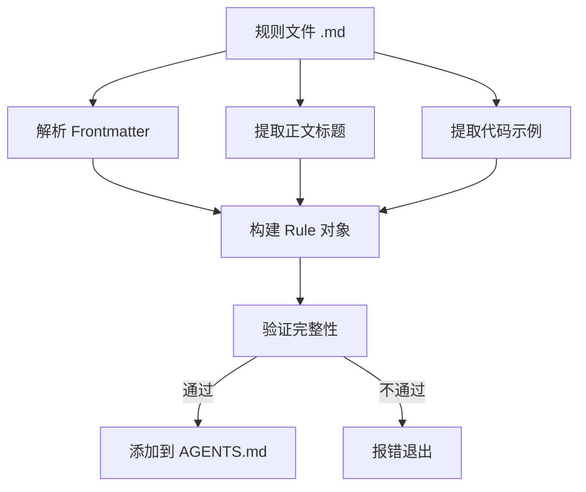

# 编写 React 最佳实践规则

## 学完你能做什么

- 从零编写符合 Agent Skills 规范的 React 性能优化规则
- 使用 _template.md 模板快速创建规则文件
- 正确选择 impact 级别（CRITICAL/HIGH/MEDIUM）为规则分类
- 编写清晰易懂的 Incorrect/Correct 代码对比示例
- 通过 `pnpm validate` 验证规则的完整性

## 你现在的困境

你已经使用 Agent Skills 的 React 性能优化规则库审计过代码，发现有些性能优化模式没有被覆盖。你想贡献自己的规则，但是：

- 不知道规则文件应该用什么格式
- 不确定 impact 级别该如何选择
- 写的代码示例不规范，导致验证失败
- 担心规则会被拒绝或无法被正确解析

## 什么时候用这一招

适合编写规则的场景：

- 你发现了项目中的性能问题，想将其固化为可复用的规则
- 团队有特定的 React 优化模式，希望能被 Agent 应用
- 你从 React 官方文档或 Vercel 工程团队学到了新技巧，想分享给社区

不适合的场景：

- 简单的代码风格问题（使用 ESLint 规则）
- 与性能无关的功能性建议（使用文档或注释）

## 核心思路

规则文件是 Markdown 格式，遵循**三段式结构**：

1. **Frontmatter**：规则的元数据（title, impact, tags）
2. **正文标题**：规则的展示名称和 impact 说明
3. **代码示例**：`**Incorrect:**` 和 `**Correct:**` 对比展示



**关键概念**：

::: info Impact Level（影响级别）
Impact 决定规则在文档中的排序位置。级别从高到低：
- **CRITICAL**：关键瓶颈（消除瀑布、打包优化）
- **HIGH**：重要改进（服务端性能）
- **MEDIUM-HIGH**：中高优先级（客户端数据获取）
- **MEDIUM**：中等改进（re-render 优化）
- **LOW-MEDIUM**：低中优先级（JavaScript 微优化）
- **LOW**：增量改进（高级模式）
:::

::: info kebab-case 命名
文件名必须使用连字符分隔的小写字母，如 `async-parallel.md`。文件名的前缀（第一个 `-` 之前的部分）决定规则所属的章节：
- `async-*` → 第 1 章（消除瀑布）
- `bundle-*` → 第 2 章（打包优化）
- `rerender-*` → 第 5 章（re-render 优化）
:::

## 🎒 开始前的准备

::: warning 前置检查
- 已完成 [Agent Skills 入门](../../start/getting-started/)
- 了解基本的 React 性能概念（re-render、waterfall、bundle 等）
- 已克隆仓库：`cd source/vercel-labs/agent-skills`
- 已安装依赖：`pnpm install`
:::

## 跟我做

### 第 1 步：复制模板文件

**为什么**
使用模板可以确保格式正确，避免遗漏必填字段。

**操作**：

```bash
cd skills/react-best-practices/rules
cp _template.md my-new-rule.md
```

**你应该看到**：`my-new-rule.md` 文件已创建，内容与模板一致。

### 第 2 步：编写 Frontmatter 元数据

**为什么**
Frontmatter 定义了规则的标题、影响级别和分类标签，是解析器的第一道关卡。

**编辑 `my-new-rule.md` 的 frontmatter 部分**：

```yaml
---
title: Use React.lazy for Code Splitting
impact: CRITICAL
impactDescription: 50-70% reduction in initial bundle
tags: bundle, code-splitting, lazy-loading, performance
---
```

**字段说明**：

| 字段                | 必填 | 说明                   | 示例值                                     |
|--- | --- | --- | ---|
| `title`             | ✅    | 规则的简短标题         | `Promise.all() for Independent Operations` |
| `impact`            | ✅    | 影响级别（6 个枚举值） | `CRITICAL` / `HIGH` / `MEDIUM` 等          |
| `impactDescription` | ⭕    | 影响幅度的描述         | `2-10× improvement`                        |
| `tags`              | ⭕    | 逗号分隔的标签         | `async, parallelization, promises`         |

**你应该看到**：frontmatter 更新为你编写的内容。

### 第 3 步：填写正文标题和说明

**为什么**
正文标题会展示在最终文档中，说明部分帮助用户理解规则的意义。

**在 frontmatter 后添加正文**

```markdown
## Use React.lazy for Code Splitting

**Impact: CRITICAL (50-70% reduction in initial bundle)**

Code split large components using `React.lazy()` to reduce the initial bundle size. Components are loaded on-demand when needed.
```

**写作要点**：

- H2 标题使用 frontmatter 中的 `title`
- **Impact:** 行采用 `**Impact: LEVEL (description)**` 格式
- 简洁说明规则的目的和性能收益

### 第 4 步：编写 Incorrect 和 Correct 示例

**为什么**
对比示例是规则的核心，直接展示「问题代码」和「正确做法」。

**在正文后添加代码示例**

````markdown
**Incorrect (loads entire bundle on initial page):**

```typescript
import HeavyChart from './HeavyChart'

function Dashboard() {
  return <HeavyChart />
}
```

**Correct (loads on-demand when needed):**

```typescript
import { lazy, Suspense } from 'react'

const HeavyChart = lazy(() => import('./HeavyChart'))

function Dashboard() {
  return (
    <Suspense fallback={<LoadingSpinner />}>
      <HeavyChart />
    </Suspense>
  )
}
```
````

**示例编写规范**：

| 要求         | 说明                                                           |
|--- | ---|
| **标签格式** | `**Incorrect:**` 或 `**Incorrect (description):**`（括号可选） |
| **括号内容** | 可选，简短描述为什么错/为什么对                                |
| **代码块**   | 使用 `\`\`\`typescript` 或 `\`\`\`tsx`                         |
| **示例数量** | 至少包含一个 bad 或 good 类型示例                              |

**你应该看到**：代码块正确渲染，有语法高亮。

### 第 5 步：添加参考文献（可选）

**为什么**
参考文献为规则提供权威来源，增强可信度。

**在文件末尾添加**

```markdown
Reference: [React.lazy and Suspense](https://react.dev/reference/react/lazy)
```

**支持格式**：

```markdown
Reference: [链接文本](URL)

### 多个参考文献
References:
- [React.lazy documentation](https://react.dev/reference/react/lazy)
- [Code splitting patterns](https://web.dev/code-splitting-suspense/)
```

### 第 6 步：验证规则文件

**为什么**
`pnpm validate` 会检查规则的完整性，确保能被正确解析。

**运行验证命令**

```bash
cd packages/react-best-practices-build
pnpm validate
```

**你应该看到**：

```bash
Validating rule files...
✓ All 58 rule files are valid
```

如果验证失败，会看到详细的错误信息：

```bash
✗ Validation failed:

  my-new-rule.md: Missing or empty title
```

**常见验证错误**：

| 错误信息                                                        | 原因                                         | 修复方法                                                                |
|--- | --- | ---|
| `Missing or empty title`                                        | frontmatter 缺少 `title` 字段                | 添加 `title: Your Title`                                                |
| `Missing examples (need at least one bad and one good example)` | examples 数组为空                            | 添加至少一个示例（带代码块）                                            |
| `Missing code examples`                                         | 有示例标签但无实际代码                       | 在标签后添加代码块（`\`\`\`typescript`）                                |
| `Missing bad/incorrect or good/correct examples`                | 标签中无 bad/good/incorrect/correct 等关键词 | 使用 `**Incorrect:**`、`**Correct:**`、`**Example:**` 等合法标签        |
| `Invalid impact level: &lt;value&gt;...`                        | `impact` 值不在枚举中                        | 使用全大写：`CRITICAL`/`HIGH`/`MEDIUM-HIGH`/`MEDIUM`/`LOW-MEDIUM`/`LOW` |
| `Failed to parse`                                               | Markdown 格式错误                            | 检查 frontmatter 是否用 `---` 包围                                      |

### 第 7 步：构建并查看结果

**为什么**
`pnpm build` 会将所有规则编译成 `AGENTS.md`，你可以看到规则在文档中的展示效果。

**运行构建命令**

```bash
pnpm build
```

**你应该看到**：

```bash
Building rules...
Validating rule files...
✓ All 58 rule files are valid
✓ Built 8 sections with 58 rules
✓ Generated test-cases.json with 172 test cases
```

**查看生成的文档**

```bash
cat skills/react-best-practices/AGENTS.md
```

**你应该看到**：你的新规则出现在对应章节中，格式为：

```markdown
### 2.1 Use React.lazy for Code Splitting

**Impact: CRITICAL (50-70% reduction in initial bundle)**

Code split large components using `React.lazy()` to reduce...
```

## 检查点 ✅

确认你已完成以下操作：

- [ ] 复制了 `_template.md` 并命名为 `my-new-rule.md`
- [ ] Frontmatter 包含 `title`、`impact`、`impactDescription`、`tags`
- [ ] 正文标题与 frontmatter 中的 `title` 一致
- [ ] 至少包含一个 Incorrect 或 Correct 代码示例
- [ ] `pnpm validate` 验证通过
- [ ] `pnpm build` 成功生成 AGENTS.md

## 踩坑提醒

#### 常见错误 1：Impact 级别拼写错误

```yaml
# ❌ 错误：小写字母导致验证失败
# impact: critical

# ✅ 正确：使用全大写（必须全大写）
impact: CRITICAL
```

**原因**：`ImpactLevel` 类型定义只接受全大写的枚举值（`types.ts:5`）。

#### 常见错误 2：文件名前缀错误

```bash
# ❌ 错误：前缀不在 sectionMap 中导致推断失败
# use-react-lazy.md  # 前缀是 "use"，无法推断章节

# ✅ 正确：使用 8 个标准前缀
bundle-lazy-loading.md  # 前缀是 "bundle"，归属第 2 章
```

**原因**：解析器会从文件名前缀推断章节（`parser.ts:201-210`），如果前缀不匹配 `sectionMap`，规则将被归类到第 0 章。

#### 常见错误 3：Frontmatter 未关闭

```markdown
---
title: My Rule
impact: MEDIUM
# ❌ 缺少结尾的 ---

## My Rule
```

**原因**：Frontmatter 必须用 `---` 包围（`parser.ts:42`）。

#### 常见错误 4：示例标签格式错误

````markdown
# ❌ 错误：缺少冒号
# **Incorrect**

```typescript
const bad = code
```

# ✅ 正确：必须有冒号
# **Incorrect:**

```typescript
const bad = code
```

# ✅ 有括号描述（推荐）
# **Incorrect (reason why it's wrong):**

```typescript
const bad = code
```
````

**原因**：解析器通过正则 `^\*\*([^:]+?):\*?\*?$` 匹配标签（`parser.ts:125`），冒号是必须的，但括号描述是可选的。

## 本课小结

规则文件的编写遵循**模板驱动**的方式，核心是：

1. **Frontmatter** 定义元数据（title、impact、tags）
2. **正文** 包含标题、impact 说明和代码示例
3. **示例** 使用 `**Incorrect:**` 和 `**Correct:**` 标签
4. **验证** 通过 `pnpm validate` 确保格式正确

记住这 5 个要点：
- ✅ 使用 `_template.md` 作为起点
- ✅ impact 级别用全大写（CRITICAL/HIGH/MEDIUM）
- ✅ 文件名前缀决定章节归属（async-/bundle-/rerender- 等）
- ✅ 示例标签格式：`**Incorrect (description):**`
- ✅ 提交前运行 `pnpm validate`

## 下一课预告

> 下一课我们学习 **[构建工具链使用](../build-toolchain/)**。
>
> 你会学到：
> - `pnpm build` 如何编译规则文档
> - `pnpm extract-tests` 如何提取测试用例
> - 如何配置 GitHub Actions 自动验证
> - LLM 自动评估的工作原理

---

## 附录：源码参考

<details>
<summary><strong>点击展开查看源码位置</strong></summary>

> 更新时间：2026-01-25

| 功能                     | 文件路径                                                                                                                                                           | 行号    |
|--- | --- | ---|
| 规则模板文件             | [`skills/react-best-practices/rules/_template.md`](https://github.com/vercel-labs/agent-skills/blob/main/skills/react-best-practices/rules/_template.md)           | 1-29    |
| 规则类型定义             | [`packages/react-best-practices-build/src/types.ts`](https://github.com/vercel-labs/agent-skills/blob/main/packages/react-best-practices-build/src/types.ts)       | 5-26    |
| 规则验证逻辑             | [`packages/react-best-practices-build/src/validate.ts`](https://github.com/vercel-labs/agent-skills/blob/main/packages/react-best-practices-build/src/validate.ts) | 21-66   |
| Frontmatter 解析         | [`packages/react-best-practices-build/src/parser.ts`](https://github.com/vercel-labs/agent-skills/blob/main/packages/react-best-practices-build/src/parser.ts)     | 42-63   |
| 章节映射（推断 section） | [`packages/react-best-practices-build/src/parser.ts`](https://github.com/vercel-labs/agent-skills/blob/main/packages/react-best-practices-build/src/parser.ts)     | 201-210 |
| 代码示例提取             | [`packages/react-best-practices-build/src/parser.ts`](https://github.com/vercel-labs/agent-skills/blob/main/packages/react-best-practices-build/src/parser.ts)     | 130-194 |
| 章节定义文件             | [`skills/react-best-practices/rules/_sections.md`](https://github.com/vercel-labs/agent-skills/blob/main/skills/react-best-practices/rules/_sections.md)           | 1-47    |

**关键类型定义**：

```typescript
export type ImpactLevel = 'CRITICAL' | 'HIGH' | 'MEDIUM-HIGH' | 'MEDIUM' | 'LOW-MEDIUM' | 'LOW'

export interface Rule {
  id: string
  title: string
  section: number // 1-8
  impact: ImpactLevel
  explanation: string
  examples: CodeExample[]
  references?: string[]
  tags?: string[]
}
```

**关键验证规则**：

- title 非空（`validate.ts:26-28`）
- examples 数量 ≥ 1（`validate.ts:34-58`）
- impact 必须是合法枚举值（`validate.ts:60-63`）

**章节映射**（文件名前缀 → 章节 ID）：

```typescript
const sectionMap: Record<string, number> = {
  async: 1,      // 消除瀑布
  bundle: 2,     // 打包优化
  server: 3,     // 服务端性能
  client: 4,     // 客户端数据获取
  rerender: 5,   // Re-render 优化
  rendering: 6,  // 渲染性能
  js: 7,         // JavaScript 性能
  advanced: 8,   // 高级模式
}
```

</details>
